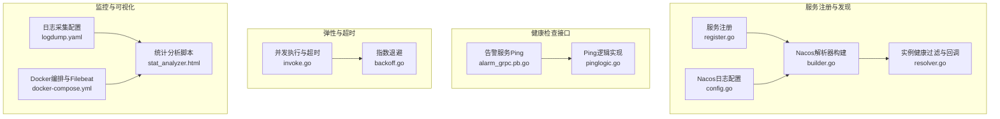
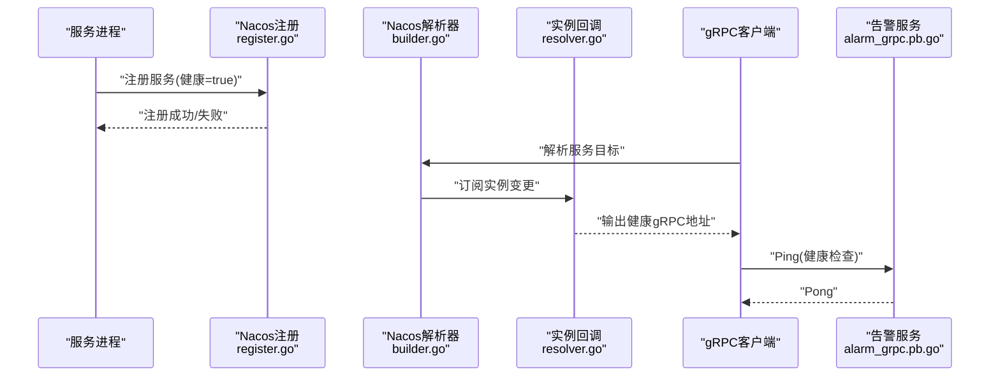
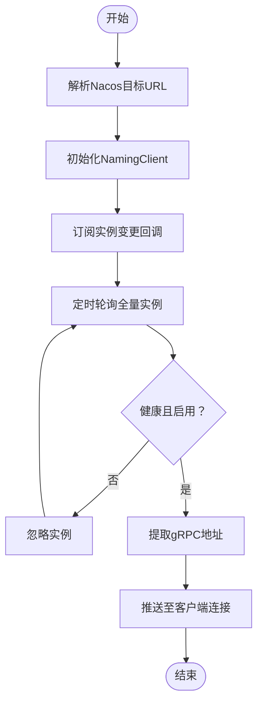
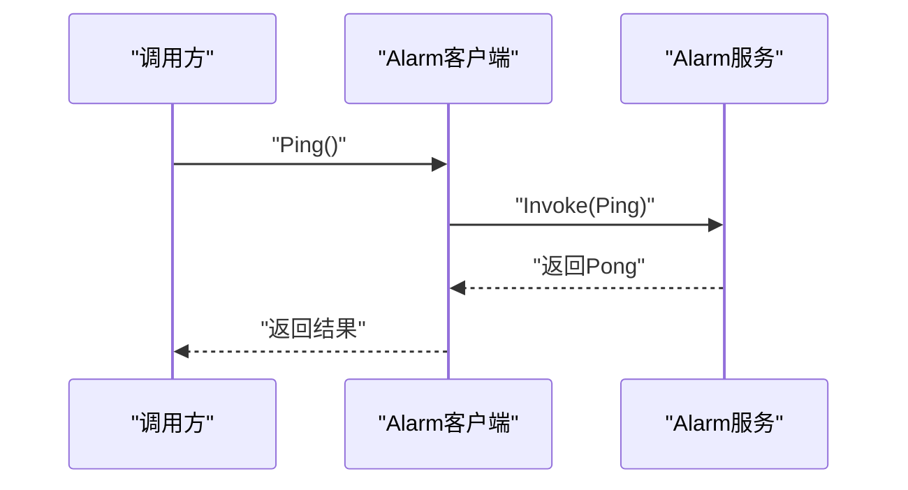
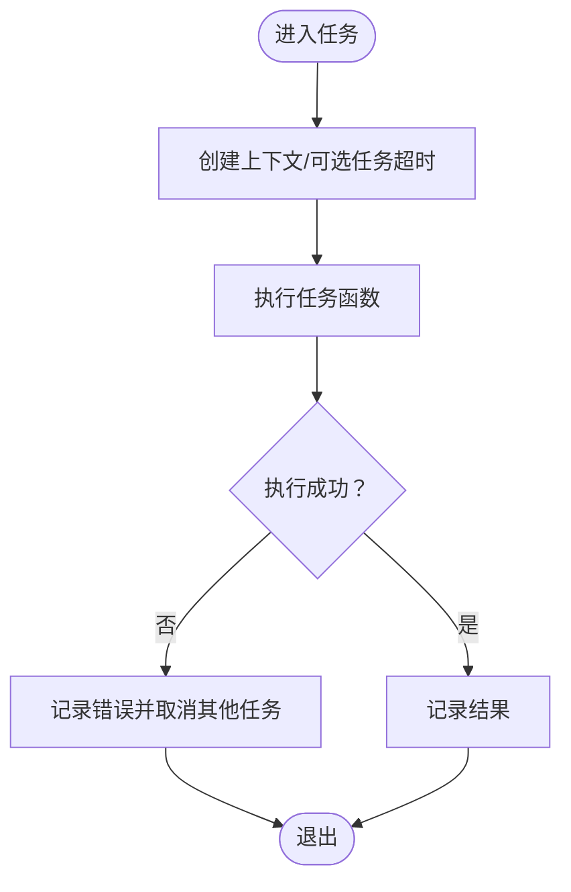
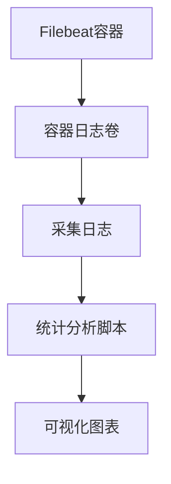
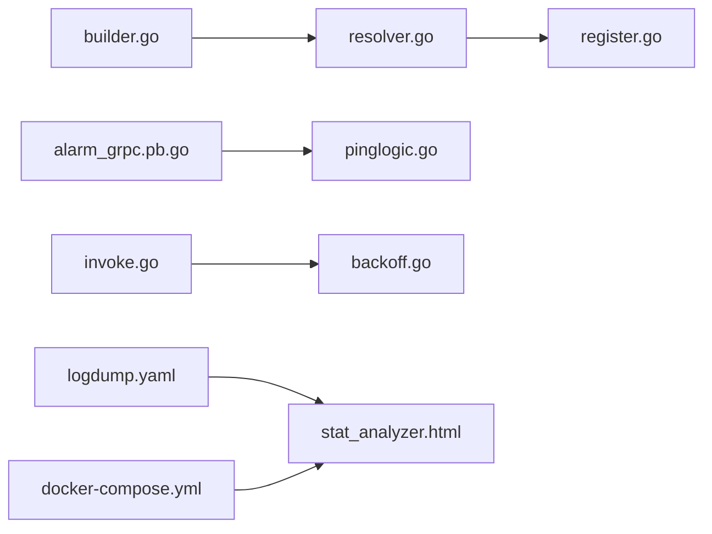

# 健康检查与监控

<cite>
**本文引用的文件**
- [common/nacosx/builder.go](file://common/nacosx/builder.go)
- [common/nacosx/resolver.go](file://common/nacosx/resolver.go)
- [common/nacosx/register.go](file://common/nacosx/register.go)
- [common/nacosx/config.go](file://common/nacosx/config.go)
- [app/alarm/etc/alarm.yaml](file://app/alarm/etc/alarm.yaml)
- [app/logdump/etc/logdump.yaml](file://app/logdump/etc/logdump.yaml)
- [.trae/skills/zero-skills/references/resilience-patterns.md](file://.trae/skills/zero-skills/references/resilience-patterns.md)
- [deploy/stat_analyzer.html](file://deploy/stat_analyzer.html)
- [deploy/docker-compose.yml](file://deploy/docker-compose.yml)
- [app/alarm/alarm/alarm_grpc.pb.go](file://app/alarm/alarm/alarm_grpc.pb.go)
- [app/alarm/internal/logic/pinglogic.go](file://app/alarm/internal/logic/pinglogic.go)
- [common/tool/backoff.go](file://common/tool/backoff.go)
- [common/antsx/invoke.go](file://common/antsx/invoke.go)
</cite>

## 目录
1. [引言](#引言)
2. [项目结构](#项目结构)
3. [核心组件](#核心组件)
4. [架构总览](#架构总览)
5. [详细组件分析](#详细组件分析)
6. [依赖分析](#依赖分析)
7. [性能考量](#性能考量)
8. [故障排查指南](#故障排查指南)
9. [结论](#结论)
10. [附录](#附录)

## 引言
本文件面向Zero-Service项目的健康检查与监控主题，系统化阐述服务健康状态检测机制（心跳、超时、故障恢复）、Nacos侧健康检查配置与gRPC客户端健康检查策略、监控指标采集与上报（可用性、响应时间、错误率等），并提供告警配置与故障排查方法及最佳实践与运维建议。

## 项目结构
围绕健康检查与监控的关键模块分布如下：
- 服务注册与发现（Nacos）：服务注册、实例健康过滤、gRPC地址解析
- 健康检查接口：通用Ping逻辑与gRPC方法
- 超时与弹性：上下文超时传播、指数退避、并发执行与快速失败
- 监控与可视化：日志采集、统计分析脚本、Docker编排与Filebeat对接

**图表来源**
- [common/nacosx/register.go:21-76](file://common/nacosx/register.go#L21-L76)
- [common/nacosx/config.go:23-37](file://common/nacosx/config.go#L23-L37)
- [common/nacosx/builder.go:29-111](file://common/nacosx/builder.go#L29-L111)
- [common/nacosx/resolver.go:38-45](file://common/nacosx/resolver.go#L38-L45)
- [app/alarm/alarm/alarm_grpc.pb.go:42-60](file://app/alarm/alarm/alarm_grpc.pb.go#L42-L60)
- [app/alarm/internal/logic/pinglogic.go:26-30](file://app/alarm/internal/logic/pinglogic.go#L26-L30)
- [common/tool/backoff.go:9-35](file://common/tool/backoff.go#L9-L35)
- [common/antsx/invoke.go:20-72](file://common/antsx/invoke.go#L20-L72)
- [app/logdump/etc/logdump.yaml:1-26](file://app/logdump/etc/logdump.yaml#L1-L26)
- [deploy/stat_analyzer.html:862-1253](file://deploy/stat_analyzer.html#L862-L1253)
- [deploy/docker-compose.yml:32-52](file://deploy/docker-compose.yml#L32-L52)

**章节来源**
- [common/nacosx/register.go:21-76](file://common/nacosx/register.go#L21-L76)
- [common/nacosx/builder.go:29-111](file://common/nacosx/builder.go#L29-L111)
- [common/nacosx/resolver.go:38-45](file://common/nacosx/resolver.go#L38-L45)
- [app/alarm/etc/alarm.yaml:1-26](file://app/alarm/etc/alarm.yaml#L1-L26)
- [app/logdump/etc/logdump.yaml:1-26](file://app/logdump/etc/logdump.yaml#L1-L26)
- [.trae/skills/zero-skills/references/resilience-patterns.md:125-162](file://.trae/skills/zero-skills/references/resilience-patterns.md#L125-L162)
- [deploy/stat_analyzer.html:862-1253](file://deploy/stat_analyzer.html#L862-L1253)
- [deploy/docker-compose.yml:32-52](file://deploy/docker-compose.yml#L32-L52)

## 核心组件
- Nacos服务注册与健康过滤
  - 注册服务时标记健康状态与元数据，支持注销时清理
  - 解析器按gRPC端口与健康状态筛选实例，回调输出健康地址列表
- 健康检查接口
  - 告警服务提供Ping方法，逻辑层返回固定响应，便于探测连通性
- 超时与弹性
  - 上下文超时传播与快速失败；并发任务执行与单任务超时控制；指数退避策略
- 监控与可视化
  - 日志采集配置与Filebeat对接；统计分析脚本聚合CPU、QPS、丢弃、响应时间等指标

**章节来源**
- [common/nacosx/register.go:21-76](file://common/nacosx/register.go#L21-L76)
- [common/nacosx/builder.go:120-138](file://common/nacosx/builder.go#L120-L138)
- [common/nacosx/resolver.go:38-45](file://common/nacosx/resolver.go#L38-L45)
- [app/alarm/alarm/alarm_grpc.pb.go:42-60](file://app/alarm/alarm/alarm_grpc.pb.go#L42-L60)
- [app/alarm/internal/logic/pinglogic.go:26-30](file://app/alarm/internal/logic/pinglogic.go#L26-L30)
- [common/antsx/invoke.go:20-72](file://common/antsx/invoke.go#L20-L72)
- [common/tool/backoff.go:9-35](file://common/tool/backoff.go#L9-L35)
- [app/logdump/etc/logdump.yaml:1-26](file://app/logdump/etc/logdump.yaml#L1-L26)
- [deploy/stat_analyzer.html:862-1253](file://deploy/stat_analyzer.html#L862-L1253)

## 架构总览
下图展示健康检查与监控在系统中的交互路径：服务通过Nacos注册健康实例，gRPC客户端使用Nacos解析器获取健康地址；健康检查通过Ping接口验证连通性；日志经Filebeat采集至统计分析脚本进行指标聚合与可视化。

**图表来源**
- [common/nacosx/register.go:40-56](file://common/nacosx/register.go#L40-L56)
- [common/nacosx/builder.go:29-111](file://common/nacosx/builder.go#L29-L111)
- [common/nacosx/resolver.go:38-45](file://common/nacosx/resolver.go#L38-L45)
- [app/alarm/alarm/alarm_grpc.pb.go:42-60](file://app/alarm/alarm/alarm_grpc.pb.go#L42-L60)

## 详细组件分析

### Nacos健康检查与gRPC解析
- 服务注册
  - 注册时设置健康标志、权重、集群与分组，支持注销清理
- 实例健康过滤
  - 解析器回调中仅保留具备gRPC端口、健康且启用的实例
  - 定期轮询拉取全量实例并推送健康地址
- gRPC客户端策略
  - 使用Nacos解析器作为自定义scheme，自动获取健康实例列表
  - 结合负载均衡与重试策略，提升可用性

**图表来源**
- [common/nacosx/builder.go:29-111](file://common/nacosx/builder.go#L29-L111)
- [common/nacosx/resolver.go:38-45](file://common/nacosx/resolver.go#L38-L45)
- [common/nacosx/register.go:40-56](file://common/nacosx/register.go#L40-L56)

**章节来源**
- [common/nacosx/register.go:21-76](file://common/nacosx/register.go#L21-L76)
- [common/nacosx/builder.go:120-138](file://common/nacosx/builder.go#L120-L138)
- [common/nacosx/resolver.go:38-45](file://common/nacosx/resolver.go#L38-L45)

### 健康检查接口与策略
- 告警服务Ping
  - gRPC方法定义与客户端调用封装
  - 逻辑层返回固定响应，便于快速探测
- 超时与重试
  - 建议在客户端侧设置合理超时，结合指数退避与快速失败策略
- 运维建议
  - 将Ping纳入探活任务，结合Nacos健康检查与gRPC连接状态综合评估

**图表来源**
- [app/alarm/alarm/alarm_grpc.pb.go:42-60](file://app/alarm/alarm/alarm_grpc.pb.go#L42-L60)
- [app/alarm/internal/logic/pinglogic.go:26-30](file://app/alarm/internal/logic/pinglogic.go#L26-L30)

**章节来源**
- [app/alarm/etc/alarm.yaml:1-26](file://app/alarm/etc/alarm.yaml#L1-L26)
- [app/alarm/alarm/alarm_grpc.pb.go:42-60](file://app/alarm/alarm/alarm_grpc.pb.go#L42-L60)
- [app/alarm/internal/logic/pinglogic.go:26-30](file://app/alarm/internal/logic/pinglogic.go#L26-L30)

### 超时处理与故障恢复
- 并发执行与超时
  - 通过上下文超时与快速失败机制，避免级联阻塞
  - 支持单任务独立超时，聚合结果后统一返回
- 指数退避
  - 根据失败次数动态延长触发间隔，超过阈值进入上限保护
- 最佳实践
  - 在关键路径设置超时，结合断路器与限流，防止雪崩

**图表来源**
- [common/antsx/invoke.go:20-72](file://common/antsx/invoke.go#L20-L72)
- [common/tool/backoff.go:9-35](file://common/tool/backoff.go#L9-L35)

**章节来源**
- [.trae/skills/zero-skills/references/resilience-patterns.md:565-690](file://.trae/skills/zero-skills/references/resilience-patterns.md#L565-L690)
- [common/antsx/invoke.go:20-72](file://common/antsx/invoke.go#L20-L72)
- [common/tool/backoff.go:9-35](file://common/tool/backoff.go#L9-L35)

### 监控指标采集与上报
- 日志采集
  - 通过Filebeat采集服务日志，挂载容器日志目录
  - 日志中包含服务名、CPU、内存、QPS、丢弃、响应时间等字段
- 统计分析
  - 统计脚本按分钟聚合CPU、QPS、丢弃、响应时间分位数
  - 支持限流状态分析与可视化图表
- 配置要点
  - 日志级别与保留天数、额外字段、Nacos配置开关等

**图表来源**
- [deploy/docker-compose.yml:32-52](file://deploy/docker-compose.yml#L32-L52)
- [app/logdump/etc/logdump.yaml:1-26](file://app/logdump/etc/logdump.yaml#L1-L26)
- [deploy/stat_analyzer.html:862-1253](file://deploy/stat_analyzer.html#L862-L1253)

**章节来源**
- [deploy/docker-compose.yml:32-52](file://deploy/docker-compose.yml#L32-L52)
- [app/logdump/etc/logdump.yaml:1-26](file://app/logdump/etc/logdump.yaml#L1-L26)
- [deploy/stat_analyzer.html:862-1253](file://deploy/stat_analyzer.html#L862-L1253)

## 依赖分析
- 组件耦合
  - Nacos解析器与回调强依赖健康实例过滤逻辑
  - 健康检查接口与gRPC客户端解耦，通过Ping方法暴露
  - 超时与弹性工具与业务逻辑解耦，通过上下文与任务封装复用
- 外部依赖
  - Nacos SDK用于注册与订阅
  - Filebeat用于日志采集
  - ECharts用于可视化展示

**图表来源**
- [common/nacosx/builder.go:29-111](file://common/nacosx/builder.go#L29-L111)
- [common/nacosx/resolver.go:38-45](file://common/nacosx/resolver.go#L38-L45)
- [common/nacosx/register.go:40-56](file://common/nacosx/register.go#L40-L56)
- [app/alarm/alarm/alarm_grpc.pb.go:42-60](file://app/alarm/alarm/alarm_grpc.pb.go#L42-L60)
- [app/alarm/internal/logic/pinglogic.go:26-30](file://app/alarm/internal/logic/pinglogic.go#L26-L30)
- [common/antsx/invoke.go:20-72](file://common/antsx/invoke.go#L20-L72)
- [common/tool/backoff.go:9-35](file://common/tool/backoff.go#L9-L35)
- [app/logdump/etc/logdump.yaml:1-26](file://app/logdump/etc/logdump.yaml#L1-L26)
- [deploy/stat_analyzer.html:862-1253](file://deploy/stat_analyzer.html#L862-L1253)
- [deploy/docker-compose.yml:32-52](file://deploy/docker-compose.yml#L32-L52)

**章节来源**
- [common/nacosx/builder.go:29-111](file://common/nacosx/builder.go#L29-L111)
- [common/nacosx/resolver.go:38-45](file://common/nacosx/resolver.go#L38-L45)
- [common/nacosx/register.go:40-56](file://common/nacosx/register.go#L40-L56)
- [app/alarm/alarm/alarm_grpc.pb.go:42-60](file://app/alarm/alarm/alarm_grpc.pb.go#L42-L60)
- [app/alarm/internal/logic/pinglogic.go:26-30](file://app/alarm/internal/logic/pinglogic.go#L26-L30)
- [common/antsx/invoke.go:20-72](file://common/antsx/invoke.go#L20-L72)
- [common/tool/backoff.go:9-35](file://common/tool/backoff.go#L9-L35)
- [app/logdump/etc/logdump.yaml:1-26](file://app/logdump/etc/logdump.yaml#L1-L26)
- [deploy/stat_analyzer.html:862-1253](file://deploy/stat_analyzer.html#L862-L1253)
- [deploy/docker-compose.yml:32-52](file://deploy/docker-compose.yml#L32-L52)

## 性能考量
- 健康检查频率
  - Nacos解析器定时轮询周期为固定间隔，建议根据实例规模与变化频率调整
- 超时与退避
  - 合理设置客户端超时与服务端超时，避免过短导致抖动，过长影响恢复速度
  - 指数退避上限保护，防止长时间不可用时资源占用
- 日志与可视化
  - Filebeat与统计脚本对磁盘与CPU有开销，建议按需裁剪字段与聚合粒度

[本节为通用指导，无需列出具体文件来源]

## 故障排查指南
- 服务未被发现
  - 检查注册是否成功、健康标志是否为true、gRPC端口元数据是否存在
  - 核对Nacos命名空间、分组与集群配置
- 健康检查失败
  - 确认Ping方法可用与客户端超时设置合理
  - 查看告警服务日志与gRPC连接状态
- 性能异常
  - 使用统计脚本查看CPU、QPS、丢弃与响应时间趋势
  - 关注限流状态与GC指标，定位瓶颈
- 日志采集异常
  - 检查Filebeat容器状态、挂载路径与权限
  - 确认日志级别与保留策略符合预期

**章节来源**
- [common/nacosx/register.go:40-56](file://common/nacosx/register.go#L40-L56)
- [common/nacosx/builder.go:87-109](file://common/nacosx/builder.go#L87-L109)
- [app/alarm/etc/alarm.yaml:1-26](file://app/alarm/etc/alarm.yaml#L1-L26)
- [app/logdump/etc/logdump.yaml:1-26](file://app/logdump/etc/logdump.yaml#L1-L26)
- [deploy/docker-compose.yml:32-52](file://deploy/docker-compose.yml#L32-L52)
- [deploy/stat_analyzer.html:862-1253](file://deploy/stat_analyzer.html#L862-L1253)

## 结论
通过Nacos健康实例过滤与gRPC解析器、Ping健康检查接口、超时与弹性策略以及日志采集与可视化，Zero-Service实现了端到端的健康检查与监控闭环。建议在生产环境启用健康检查与限流、设置合理的超时与退避参数，并持续观测关键指标以保障系统稳定性。

[本节为总结性内容，无需列出具体文件来源]

## 附录
- 健康检查与监控最佳实践
  - 在所有外部调用中使用断路器与超时
  - 启用负载削峰与限流，避免过载
  - 使用上下文传播超时，避免无限等待
  - 定期测试超时与断路器行为
- 告警配置建议
  - 基于统计脚本的CPU、QPS、丢弃与响应时间阈值设置
  - 对Nacos实例健康状态与gRPC连接异常进行告警联动

**章节来源**
- [.trae/skills/zero-skills/references/resilience-patterns.md:565-690](file://.trae/skills/zero-skills/references/resilience-patterns.md#L565-L690)