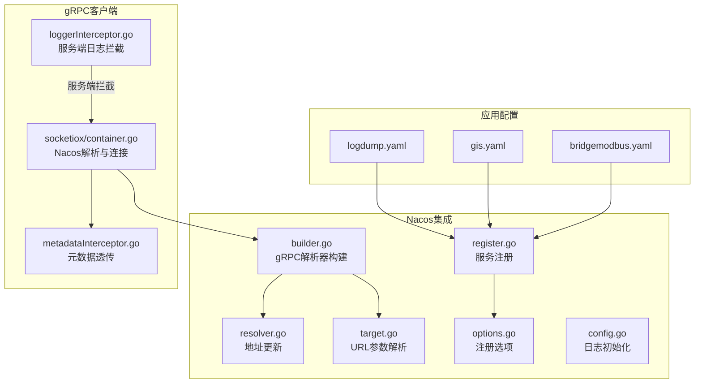
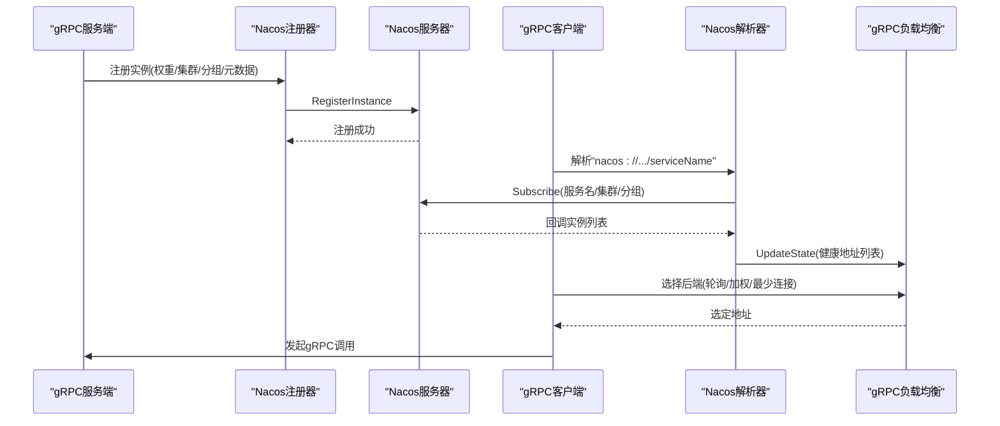
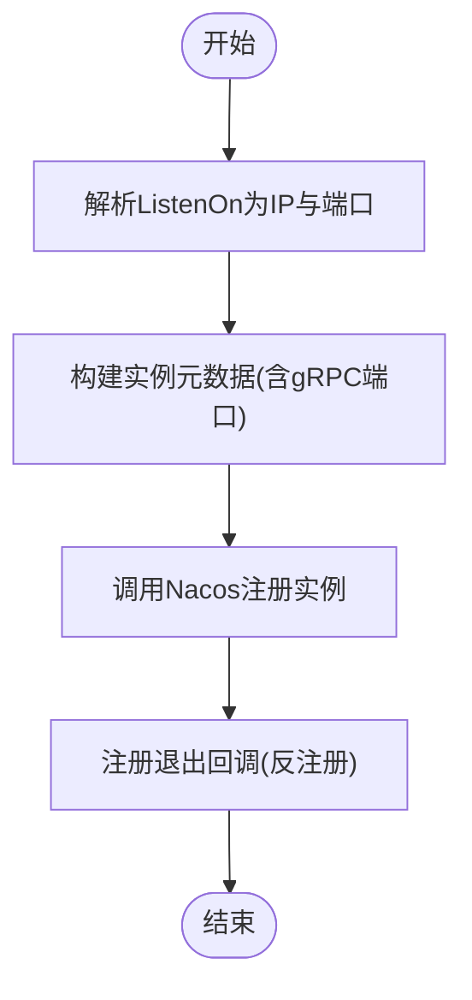
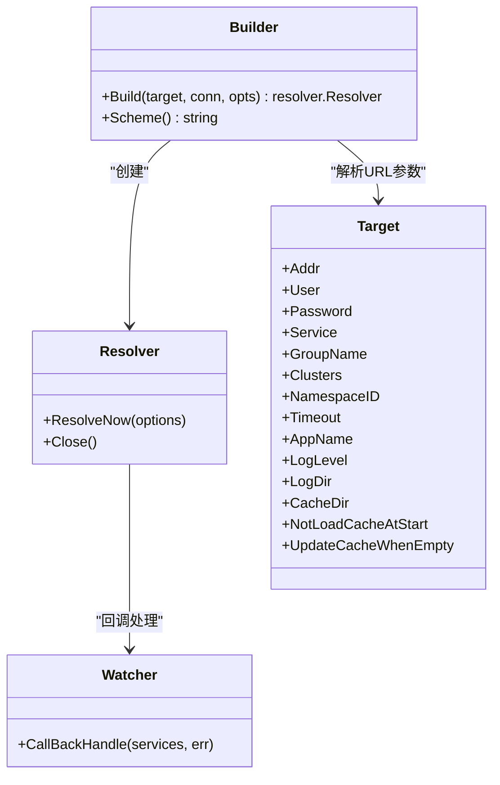
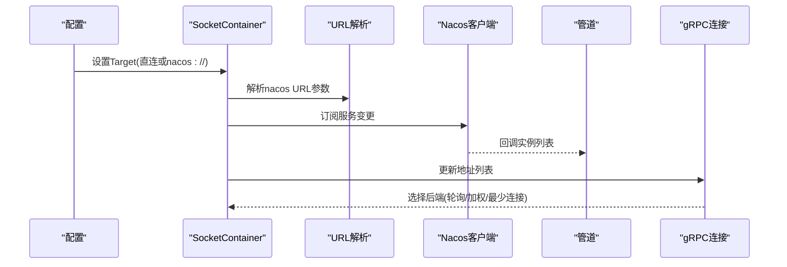
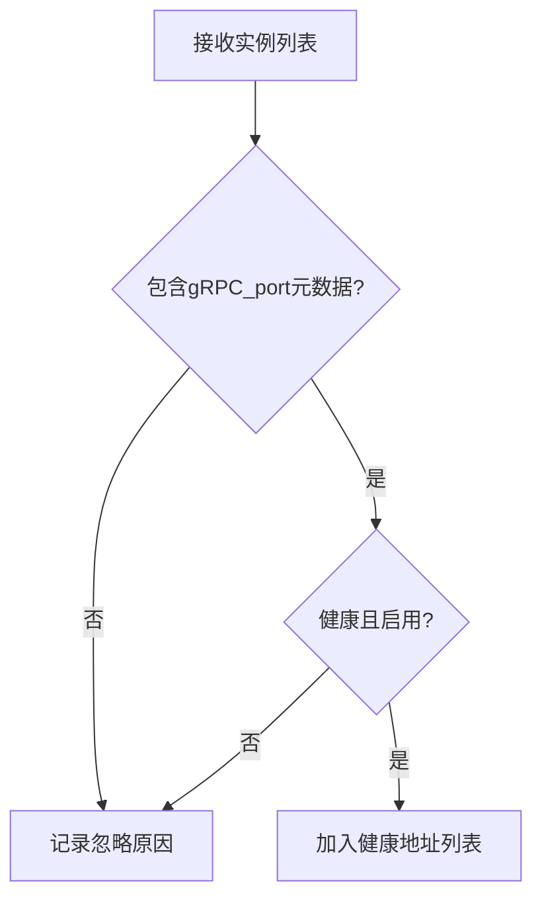
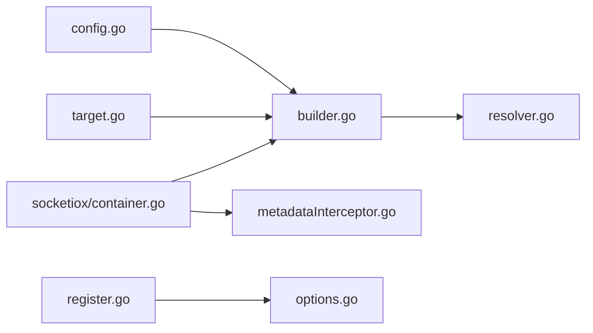

# 服务发现与负载均衡

<cite>
**本文引用的文件**   
- [common/nacosx/register.go](file://common/nacosx/register.go)
- [common/nacosx/builder.go](file://common/nacosx/builder.go)
- [common/nacosx/resolver.go](file://common/nacosx/resolver.go)
- [common/nacosx/target.go](file://common/nacosx/target.go)
- [common/nacosx/options.go](file://common/nacosx/options.go)
- [common/nacosx/config.go](file://common/nacosx/config.go)
- [common/socketiox/container.go](file://common/socketiox/container.go)
- [common/Interceptor/rpcclient/metadataInterceptor.go](file://common/Interceptor/rpcclient/metadataInterceptor.go)
- [common/Interceptor/rpcserver/loggerInterceptor.go](file://common/Interceptor/rpcserver/loggerInterceptor.go)
- [app/logdump/etc/logdump.yaml](file://app/logdump/etc/logdump.yaml)
- [app/gis/etc/gis.yaml](file://app/gis/etc/gis.yaml)
- [app/bridgemodbus/etc/bridgemodbus.yaml](file://app/bridgemodbus/etc/bridgemodbus.yaml)
- [app/trigger/trigger/trigger.pb.go](file://app/trigger/trigger/trigger.pb.go)
- [.trae/skills/zero-skills/references/resilience-patterns.md](file://.trae/skills/zero-skills/references/resilience-patterns.md)
- [.trae/skills/zero-skills/troubleshooting/common-issues.md](file://.trae/skills/zero-skills/troubleshooting/common-issues.md)
</cite>

## 目录
1. [简介](#简介)
2. [项目结构](#项目结构)
3. [核心组件](#核心组件)
4. [架构总览](#架构总览)
5. [详细组件分析](#详细组件分析)
6. [依赖分析](#依赖分析)
7. [性能考虑](#性能考虑)
8. [故障排查指南](#故障排查指南)
9. [结论](#结论)
10. [附录](#附录)

## 简介
本文件面向Zero-Service项目，系统化阐述基于Nacos的服务发现与gRPC负载均衡实现，覆盖服务注册、服务发现、健康检查、动态配置、客户端负载均衡策略、路由与故障转移、配置指南、最佳实践以及监控与排障方法。读者无需深入Go语言即可理解整体设计与落地要点。

## 项目结构
围绕服务发现与负载均衡的关键目录与文件：
- Nacos集成与gRPC解析器：common/nacosx/*
- gRPC客户端容器与Nacos解析：common/socketiox/container.go
- RPC拦截器（元数据透传与日志）：common/Interceptor/rpcclient/metadataInterceptor.go、common/Interceptor/rpcserver/loggerInterceptor.go
- 应用配置示例：app/*/etc/*.yaml
- 触发器中对gRPC服务的调用字段：app/trigger/trigger/trigger.pb.go
- 抗脆弱性与排障参考：.trae/skills/zero-skills/references/resilience-patterns.md、.trae/skills/zero-skills/troubleshooting/common-issues.md

图表来源
- [common/nacosx/register.go:21-76](file://common/nacosx/register.go#L21-L76)
- [common/nacosx/builder.go:29-112](file://common/nacosx/builder.go#L29-L112)
- [common/nacosx/resolver.go:47-74](file://common/nacosx/resolver.go#L47-L74)
- [common/nacosx/target.go:30-80](file://common/nacosx/target.go#L30-L80)
- [common/nacosx/options.go:10-72](file://common/nacosx/options.go#L10-L72)
- [common/nacosx/config.go:15-38](file://common/nacosx/config.go#L15-L38)
- [common/socketiox/container.go:156-242](file://common/socketiox/container.go#L156-L242)
- [common/Interceptor/rpcclient/metadataInterceptor.go:11-32](file://common/Interceptor/rpcclient/metadataInterceptor.go#L11-L32)
- [common/Interceptor/rpcserver/loggerInterceptor.go:12-44](file://common/Interceptor/rpcserver/loggerInterceptor.go#L12-L44)
- [app/logdump/etc/logdump.yaml:13-26](file://app/logdump/etc/logdump.yaml#L13-L26)
- [app/gis/etc/gis.yaml:12-19](file://app/gis/etc/gis.yaml#L12-L19)
- [app/bridgemodbus/etc/bridgemodbus.yaml:12-26](file://app/bridgemodbus/etc/bridgemodbus.yaml#L12-L26)

章节来源
- [common/nacosx/register.go:21-76](file://common/nacosx/register.go#L21-L76)
- [common/nacosx/builder.go:29-112](file://common/nacosx/builder.go#L29-L112)
- [common/nacosx/resolver.go:47-74](file://common/nacosx/resolver.go#L47-L74)
- [common/nacosx/target.go:30-80](file://common/nacosx/target.go#L30-L80)
- [common/nacosx/options.go:10-72](file://common/nacosx/options.go#L10-L72)
- [common/nacosx/config.go:15-38](file://common/nacosx/config.go#L15-L38)
- [common/socketiox/container.go:156-242](file://common/socketiox/container.go#L156-L242)
- [common/Interceptor/rpcclient/metadataInterceptor.go:11-32](file://common/Interceptor/rpcclient/metadataInterceptor.go#L11-L32)
- [common/Interceptor/rpcserver/loggerInterceptor.go:12-44](file://common/Interceptor/rpcserver/loggerInterceptor.go#L12-L44)
- [app/logdump/etc/logdump.yaml:13-26](file://app/logdump/etc/logdump.yaml#L13-L26)
- [app/gis/etc/gis.yaml:12-19](file://app/gis/etc/gis.yaml#L12-L19)
- [app/bridgemodbus/etc/bridgemodbus.yaml:12-26](file://app/bridgemodbus/etc/bridgemodbus.yaml#L12-L26)

## 核心组件
- 服务注册器：负责将gRPC服务实例注册到Nacos，并在进程退出时自动反注册，支持权重、集群、分组、元数据等。
- gRPC解析器：通过“nacos://”目标URL订阅Nacos服务变更，将健康实例地址列表推送到gRPC负载均衡器。
- 地址提取与过滤：从Nacos实例中筛选出具备gRPC端口且健康可用的实例，形成最终地址集合。
- 客户端容器：封装gRPC客户端连接，支持直接地址与Nacos解析两种模式，内置元数据拦截器透传用户与追踪上下文。
- 配置与日志：统一的Nacos客户端日志级别与输出目录配置，便于问题定位。

章节来源
- [common/nacosx/register.go:21-76](file://common/nacosx/register.go#L21-L76)
- [common/nacosx/builder.go:29-112](file://common/nacosx/builder.go#L29-L112)
- [common/nacosx/resolver.go:47-74](file://common/nacosx/resolver.go#L47-L74)
- [common/socketiox/container.go:156-242](file://common/socketiox/container.go#L156-L242)
- [common/nacosx/config.go:15-38](file://common/nacosx/config.go#L15-L38)

## 架构总览
下图展示从服务端注册到客户端解析与gRPC调用的整体流程。

图表来源
- [common/nacosx/register.go:40-76](file://common/nacosx/register.go#L40-L76)
- [common/nacosx/builder.go:78-112](file://common/nacosx/builder.go#L78-L112)
- [common/nacosx/resolver.go:47-74](file://common/nacosx/resolver.go#L47-L74)
- [common/socketiox/container.go:156-242](file://common/socketiox/container.go#L156-L242)

## 详细组件分析

### 组件A：Nacos服务注册
- 职责：将服务监听地址解析为IP与端口，向Nacos注册实例，设置权重、健康、启用、集群、分组与元数据；进程退出时自动反注册。
- 关键点：
  - 监听地址解析支持环境变量与内网IP自动探测。
  - 元数据中约定存储gRPC端口，作为客户端选择依据。
  - 支持集群与分组隔离，便于多环境与多版本并存。

图表来源
- [common/nacosx/register.go:22-76](file://common/nacosx/register.go#L22-L76)
- [common/nacosx/options.go:10-72](file://common/nacosx/options.go#L10-L72)

章节来源
- [common/nacosx/register.go:22-76](file://common/nacosx/register.go#L22-L76)
- [common/nacosx/options.go:10-72](file://common/nacosx/options.go#L10-L72)

### 组件B：gRPC解析器（Nacos）
- 职责：注册“nacos”解析器，解析目标URL参数，连接Nacos，订阅服务变更，周期性拉取实例，过滤健康可用实例，推送至gRPC客户端连接。
- 关键点：
  - URL参数支持用户名、密码、命名空间、超时、appName、日志/缓存目录、是否加载缓存等。
  - 实例过滤条件：必须包含gRPC端口元数据、健康且启用。
  - 地址排序以避免负载均衡器重复替换相同列表。

图表来源
- [common/nacosx/builder.go:29-112](file://common/nacosx/builder.go#L29-L112)
- [common/nacosx/resolver.go:13-22](file://common/nacosx/resolver.go#L13-L22)
- [common/nacosx/target.go:13-28](file://common/nacosx/target.go#L13-L28)

章节来源
- [common/nacosx/builder.go:29-112](file://common/nacosx/builder.go#L29-L112)
- [common/nacosx/resolver.go:13-22](file://common/nacosx/resolver.go#L13-L22)
- [common/nacosx/target.go:13-28](file://common/nacosx/target.go#L13-L28)

### 组件C：客户端容器与Nacos解析
- 职责：根据配置决定是直连还是通过Nacos解析；在Nacos模式下，解析URL、建立订阅、周期刷新、提取健康实例并注入gRPC连接。
- 关键点：
  - 支持直接端点与“nacos://”目标URL两种模式。
  - 提供元数据拦截器，自动透传用户ID、用户名、部门编码、授权令牌、追踪ID等。
  - 服务端拦截器记录请求与错误，便于问题定位。

图表来源
- [common/socketiox/container.go:156-242](file://common/socketiox/container.go#L156-L242)
- [common/Interceptor/rpcclient/metadataInterceptor.go:11-32](file://common/Interceptor/rpcclient/metadataInterceptor.go#L11-L32)
- [common/Interceptor/rpcserver/loggerInterceptor.go:12-44](file://common/Interceptor/rpcserver/loggerInterceptor.go#L12-L44)

章节来源
- [common/socketiox/container.go:156-242](file://common/socketiox/container.go#L156-L242)
- [common/Interceptor/rpcclient/metadataInterceptor.go:11-32](file://common/Interceptor/rpcclient/metadataInterceptor.go#L11-L32)
- [common/Interceptor/rpcserver/loggerInterceptor.go:12-44](file://common/Interceptor/rpcserver/loggerInterceptor.go#L12-L44)

### 组件D：健康检查与实例过滤
- 职责：从Nacos返回的实例列表中筛选健康且启用的实例，并要求实例元数据包含gRPC端口。
- 关键点：
  - 日志记录被忽略的实例原因，便于运维排查。
  - 通过权重参与后续负载均衡策略。

图表来源
- [common/nacosx/builder.go:120-138](file://common/nacosx/builder.go#L120-L138)

章节来源
- [common/nacosx/builder.go:120-138](file://common/nacosx/builder.go#L120-L138)

### 组件E：gRPC负载均衡策略
- 当前实现：gRPC默认采用“轮询”策略；通过Nacos解析器提供的地址列表，结合gRPC内置的LB，可自然实现多副本间的轮询。
- 加权轮询与最少连接：可通过扩展gRPC的Balancer实现，或在上游控制面（如Nacos元数据权重）与下游LB组合实现更精细的调度。
- 建议：
  - 在Nacos实例元数据中携带权重，配合gRPC的“权重感知”LB。
  - 对于“最少连接”，可在外部代理或自研LB层实现，或评估第三方LB方案。

章节来源
- [common/nacosx/resolver.go:47-74](file://common/nacosx/resolver.go#L47-L74)
- [common/nacosx/builder.go:120-138](file://common/nacosx/builder.go#L120-L138)

### 组件F：服务路由与故障转移
- 路由机制：
  - 服务名解析：通过“nacos://”目标URL中的服务名进行解析。
  - 目标地址选择：由gRPC LB从健康实例列表中选择。
  - 故障转移：当实例不可用或健康状态变化时，Nacos回调与周期拉取会更新地址列表，LB自动切换。
- 触发器中的调用：触发器消息体包含gRPC服务名、方法名、负载与超时，便于统一编排与故障转移。

章节来源
- [app/trigger/trigger/trigger.pb.go:741-754](file://app/trigger/trigger/trigger.pb.go#L741-L754)
- [common/nacosx/builder.go:78-112](file://common/nacosx/builder.go#L78-L112)

## 依赖分析
- 组件耦合：
  - 解析器与地址更新：builder依赖resolver将地址写入gRPC连接。
  - 客户端容器：依赖解析器与拦截器，实现“nacos://”目标URL的透明接入。
  - 注册器：独立运行，不依赖解析器，但需与客户端配置一致的服务名与分组。
- 外部依赖：
  - Nacos SDK：用于注册、订阅与实例查询。
  - gRPC：用于服务间通信与负载均衡。

图表来源
- [common/nacosx/builder.go:29-112](file://common/nacosx/builder.go#L29-L112)
- [common/nacosx/resolver.go:47-74](file://common/nacosx/resolver.go#L47-L74)
- [common/socketiox/container.go:156-242](file://common/socketiox/container.go#L156-L242)
- [common/nacosx/register.go:22-76](file://common/nacosx/register.go#L22-L76)
- [common/nacosx/options.go:10-72](file://common/nacosx/options.go#L10-L72)
- [common/nacosx/target.go:30-80](file://common/nacosx/target.go#L30-L80)
- [common/nacosx/config.go:15-38](file://common/nacosx/config.go#L15-L38)

章节来源
- [common/nacosx/builder.go:29-112](file://common/nacosx/builder.go#L29-L112)
- [common/nacosx/resolver.go:47-74](file://common/nacosx/resolver.go#L47-L74)
- [common/socketiox/container.go:156-242](file://common/socketiox/container.go#L156-L242)
- [common/nacosx/register.go:22-76](file://common/nacosx/register.go#L22-L76)
- [common/nacosx/options.go:10-72](file://common/nacosx/options.go#L10-L72)
- [common/nacosx/target.go:30-80](file://common/nacosx/target.go#L30-L80)
- [common/nacosx/config.go:15-38](file://common/nacosx/config.go#L15-L38)

## 性能考虑
- 实例拉取频率：解析器每60秒周期性拉取一次实例列表，平衡实时性与Nacos压力。
- 地址排序：对地址进行排序，避免LB频繁替换相同列表。
- 日志与缓存：可通过环境变量控制日志级别与缓存行为，减少启动时的旧缓存影响。
- 超时与重试：建议在应用层设置合理的RPC超时与重试策略，结合gRPC的背压与熔断。

章节来源
- [common/nacosx/builder.go:87-112](file://common/nacosx/builder.go#L87-L112)
- [common/nacosx/resolver.go:69-74](file://common/nacosx/resolver.go#L69-L74)
- [common/nacosx/target.go:53-76](file://common/nacosx/target.go#L53-L76)

## 故障排查指南
- Nacos连接失败
  - 检查用户名、密码、命名空间、服务名与端口配置。
  - 查看Nacos日志目录与级别，确认网络连通性。
- 服务未发现或实例为空
  - 确认服务已注册且健康启用。
  - 检查实例元数据是否包含gRPC端口。
  - 核对分组与集群参数是否匹配。
- gRPC调用异常
  - 使用服务端拦截器记录的错误上下文定位问题。
  - 检查客户端元数据拦截器是否正确透传必要头信息。
- 配置验证
  - 参考通用配置校验与路径问题排查方法。

章节来源
- [common/nacosx/target.go:30-80](file://common/nacosx/target.go#L30-L80)
- [common/nacosx/config.go:15-38](file://common/nacosx/config.go#L15-L38)
- [common/nacosx/builder.go:120-138](file://common/nacosx/builder.go#L120-L138)
- [common/Interceptor/rpcserver/loggerInterceptor.go:12-44](file://common/Interceptor/rpcserver/loggerInterceptor.go#L12-L44)
- [common/Interceptor/rpcclient/metadataInterceptor.go:11-32](file://common/Interceptor/rpcclient/metadataInterceptor.go#L11-L32)
- [.trae/skills/zero-skills/troubleshooting/common-issues.md:623-635](file://.trae/skills/zero-skills/troubleshooting/common-issues.md#L623-L635)

## 结论
Zero-Service通过Nacos实现了稳定的服务注册与发现，并借助gRPC解析器将健康实例动态注入LB，满足多副本部署与故障转移需求。结合元数据拦截器与日志拦截器，可实现端到端的可观测性与可追溯性。建议在生产中进一步完善权重调度、健康检查策略与监控告警体系。

## 附录

### 服务发现配置指南
- Nacos集群部署
  - 准备Nacos集群节点，确保网络互通与高可用。
  - 配置用户名与密码，设置命名空间隔离不同环境。
- 服务注册配置
  - 在应用配置中开启注册开关，填写Host、Port、NamespaceId、ServiceName。
  - 在实例元数据中提供gRPC端口，确保客户端可解析。
- 客户端连接参数
  - “nacos://”目标URL支持用户名、密码、命名空间、超时、appName、日志/缓存目录等参数。
  - 可通过环境变量控制日志级别与缓存行为。

章节来源
- [app/logdump/etc/logdump.yaml:13-26](file://app/logdump/etc/logdump.yaml#L13-L26)
- [app/gis/etc/gis.yaml:12-19](file://app/gis/etc/gis.yaml#L12-L19)
- [app/bridgemodbus/etc/bridgemodbus.yaml:12-26](file://app/bridgemodbus/etc/bridgemodbus.yaml#L12-L26)
- [common/nacosx/target.go:30-80](file://common/nacosx/target.go#L30-L80)
- [common/nacosx/config.go:15-38](file://common/nacosx/config.go#L15-L38)

### 服务治理最佳实践
- 分组与命名规范
  - 使用清晰的服务名与分组，区分开发、测试、生产环境。
- 版本管理与灰度发布
  - 通过集群与分组隔离新旧版本，逐步扩大流量。
- 动态配置
  - 利用Nacos配置中心管理动态参数，结合客户端热更新策略。
- 抗脆弱性
  - 为外部调用设置超时、重试与熔断；启用限流与降级。

章节来源
- [.trae/skills/zero-skills/references/resilience-patterns.md:565-619](file://.trae/skills/zero-skills/references/resilience-patterns.md#L565-L619)