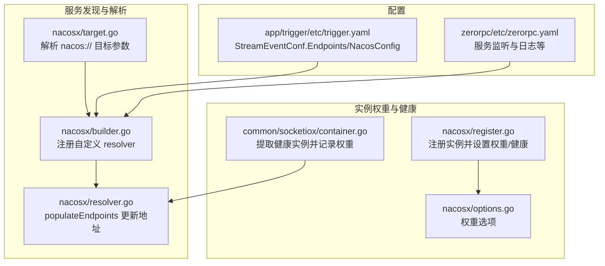
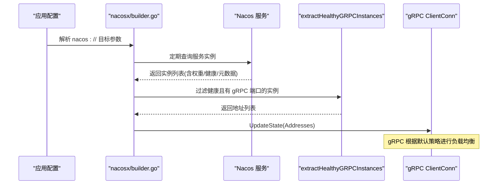
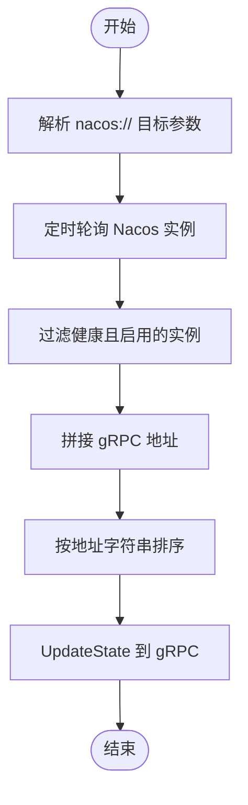
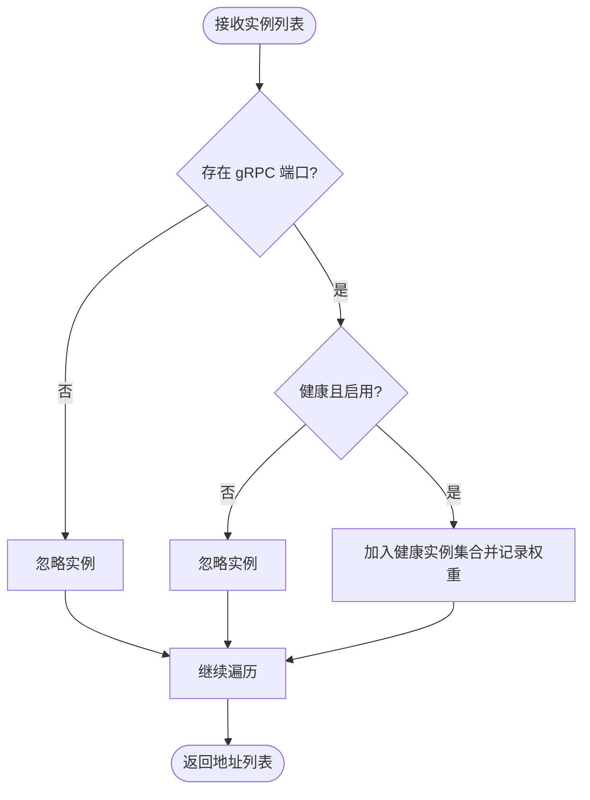
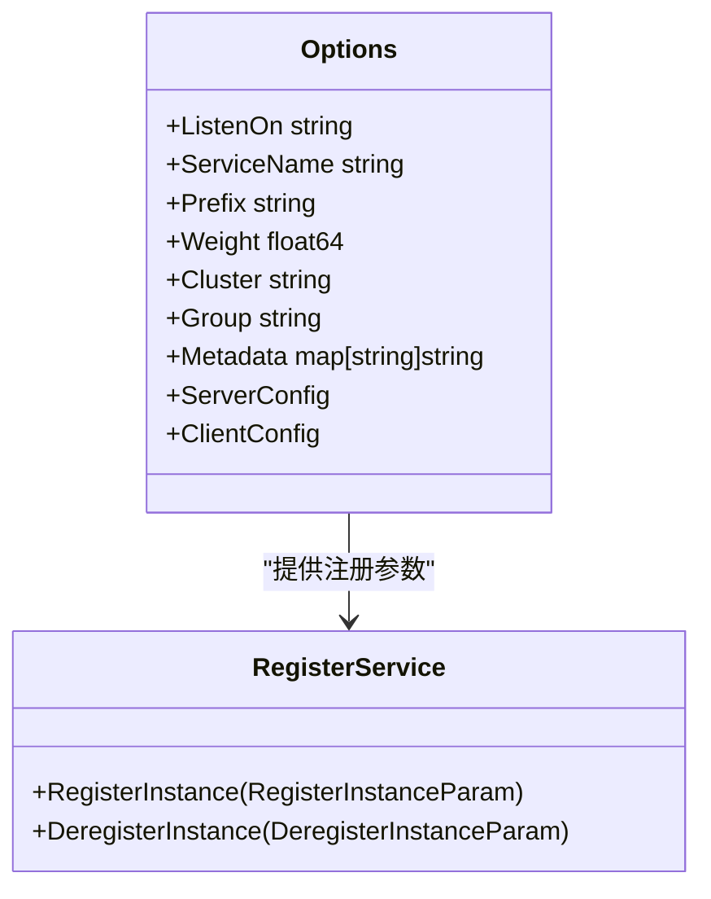
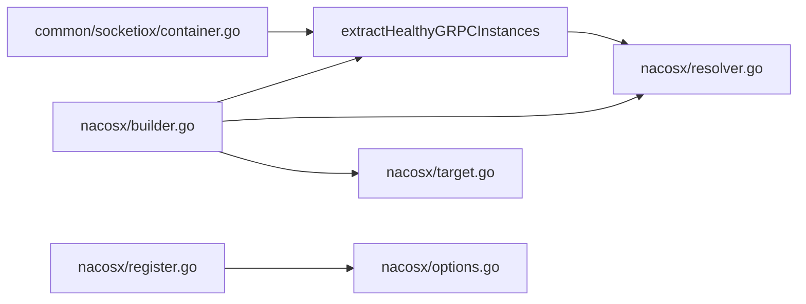

# 负载均衡策略

<cite>
**本文引用的文件**
- [common/nacosx/builder.go](file://common/nacosx/builder.go)
- [common/nacosx/resolver.go](file://common/nacosx/resolver.go)
- [common/nacosx/register.go](file://common/nacosx/register.go)
- [common/nacosx/options.go](file://common/nacosx/options.go)
- [common/nacosx/target.go](file://common/nacosx/target.go)
- [common/socketiox/container.go](file://common/socketiox/container.go)
- [app/trigger/etc/trigger.yaml](file://app/trigger/etc/trigger.yaml)
- [zerorpc/etc/zerorpc.yaml](file://zerorpc/etc/zerorpc.yaml)
- [zerorpc/internal/config/config.go](file://zerorpc/internal/config/config.go)
</cite>

## 目录
1. [简介](#简介)
2. [项目结构](#项目结构)
3. [核心组件](#核心组件)
4. [架构总览](#架构总览)
5. [详细组件分析](#详细组件分析)
6. [依赖分析](#依赖分析)
7. [性能考虑](#性能考虑)
8. [故障排查指南](#故障排查指南)
9. [结论](#结论)
10. [附录](#附录)

## 简介
本文件面向 Zero-Service 的 gRPC 客户端侧负载均衡策略，系统性阐述以下内容：
- gRPC 内置负载均衡算法在本项目的使用现状与可选范围（round_robin、least_request、pick_first 等）
- 权重分配机制：服务实例权重设置与服务端权重计算
- 健康检查与负载均衡的关系：故障实例剔除与流量切换
- 针对不同场景的策略推荐与配置示例
- 性能监控与调优建议

说明：本仓库中 gRPC 客户端侧通过自定义 resolver（nacos 方案）进行服务发现与地址列表更新；负载均衡算法默认由 gRPC 默认策略处理，未显式指定具体算法名。因此，本文件在“算法选择”部分以通用原则为主，并结合本仓库的健康过滤与权重传递逻辑给出实践建议。

## 项目结构
与负载均衡相关的关键模块集中在 nacosx 自定义解析器与 SocketIO 容器中的健康实例提取逻辑中，二者共同完成“服务发现 -> 健康实例筛选 -> 地址列表更新”的闭环。

图表来源
- [common/nacosx/builder.go:18-118](file://common/nacosx/builder.go#L18-L118)
- [common/nacosx/resolver.go:47-66](file://common/nacosx/resolver.go#L47-L66)
- [common/nacosx/target.go:31-79](file://common/nacosx/target.go#L31-L79)
- [common/nacosx/register.go:41-52](file://common/nacosx/register.go#L41-L52)
- [common/nacosx/options.go:26-53](file://common/nacosx/options.go#L26-L53)
- [common/socketiox/container.go:318-346](file://common/socketiox/container.go#L318-L346)
- [app/trigger/etc/trigger.yaml:11-37](file://app/trigger/etc/trigger.yaml#L11-L37)
- [zerorpc/etc/zerorpc.yaml:1-39](file://zerorpc/etc/zerorpc.yaml#L1-L39)

章节来源
- [common/nacosx/builder.go:18-118](file://common/nacosx/builder.go#L18-L118)
- [common/nacosx/resolver.go:47-66](file://common/nacosx/resolver.go#L47-L66)
- [common/nacosx/target.go:31-79](file://common/nacosx/target.go#L31-L79)
- [common/nacosx/register.go:41-52](file://common/nacosx/register.go#L41-L52)
- [common/nacosx/options.go:26-53](file://common/nacosx/options.go#L26-L53)
- [common/socketiox/container.go:318-346](file://common/socketiox/container.go#L318-L346)
- [app/trigger/etc/trigger.yaml:11-37](file://app/trigger/etc/trigger.yaml#L11-L37)
- [zerorpc/etc/zerorpc.yaml:1-39](file://zerorpc/etc/zerorpc.yaml#L1-L39)

## 核心组件
- 自定义 resolver（nacos）：负责将 nacos:// 目标解析为 gRPC 地址列表，并周期性拉取实例、过滤健康实例后更新到连接管理器。
- 健康实例提取：从 Nacos 返回的实例集合中，仅保留具备 gRPC 端口、健康且启用的实例，并记录其权重。
- 权重与元数据：注册时设置权重与元数据（含 gRPC 端口），解析时读取元数据中的 gRPC 端口用于拼接地址。
- 配置入口：应用配置文件中可直接指定静态地址列表或通过 nacos:// 目标启用动态发现。

章节来源
- [common/nacosx/builder.go:18-118](file://common/nacosx/builder.go#L18-L118)
- [common/nacosx/resolver.go:47-66](file://common/nacosx/resolver.go#L47-L66)
- [common/nacosx/register.go:41-52](file://common/nacosx/register.go#L41-L52)
- [common/nacosx/options.go:26-53](file://common/nacosx/options.go#L26-L53)
- [common/socketiox/container.go:318-346](file://common/socketiox/container.go#L318-L346)

## 架构总览
下图展示客户端侧从配置到 gRPC 连接的完整流程，以及健康检查与权重在其中的作用。

图表来源
- [common/nacosx/builder.go:85-118](file://common/nacosx/builder.go#L85-L118)
- [common/nacosx/resolver.go:47-66](file://common/nacosx/resolver.go#L47-L66)
- [common/nacosx/target.go:31-79](file://common/nacosx/target.go#L31-L79)
- [common/socketiox/container.go:318-346](file://common/socketiox/container.go#L318-L346)

## 详细组件分析

### 组件A：Nacos 自定义 resolver（服务发现与地址更新）
- 功能要点
  - 注册自定义 scheme（nacos），使 gRPC 能识别 nacos:// 目标。
  - 解析目标参数（主机、服务名、命名空间、超时等）。
  - 周期性轮询 Nacos 获取实例列表，过滤健康且启用的实例，拼接 gRPC 地址，排序后更新到 gRPC 连接管理器。
- 关键行为
  - 地址去重与排序，避免重复替换导致的负载均衡状态抖动。
  - 日志记录健康实例数量与忽略原因，便于排障。
- 与负载均衡的关系
  - resolver 提供的是“可用实例地址集合”，具体的负载均衡算法由 gRPC 默认策略处理（本仓库未显式指定算法名）。

图表来源
- [common/nacosx/builder.go:85-118](file://common/nacosx/builder.go#L85-L118)
- [common/nacosx/resolver.go:47-66](file://common/nacosx/resolver.go#L47-L66)
- [common/nacosx/target.go:31-79](file://common/nacosx/target.go#L31-L79)

章节来源
- [common/nacosx/builder.go:18-118](file://common/nacosx/builder.go#L18-L118)
- [common/nacosx/resolver.go:47-66](file://common/nacosx/resolver.go#L47-L66)
- [common/nacosx/target.go:31-79](file://common/nacosx/target.go#L31-L79)

### 组件B：健康实例提取与权重记录
- 功能要点
  - 仅保留具备 gRPC 端口、健康且启用的实例。
  - 记录实例权重，用于后续日志与可观测性。
- 与负载均衡的关系
  - 健康过滤直接影响“可用实例集合”，从而影响后续负载均衡的候选节点集合。
  - 权重信息在本仓库中主要体现在注册阶段与日志输出，未见在 resolver 中直接用于 gRPC 负载均衡权重分配。

图表来源
- [common/socketiox/container.go:318-346](file://common/socketiox/container.go#L318-L346)
- [common/nacosx/builder.go:120-138](file://common/nacosx/builder.go#L120-L138)

章节来源
- [common/socketiox/container.go:318-346](file://common/socketiox/container.go#L318-L346)
- [common/nacosx/builder.go:120-138](file://common/nacosx/builder.go#L120-L138)

### 组件C：实例注册与权重设置
- 功能要点
  - 注册时设置权重、健康状态、元数据（含 gRPC 端口）、集群与分组等。
  - 支持通过选项设置默认权重。
- 与负载均衡的关系
  - 注册权重是上游权重来源，resolver 在解析时会读取元数据中的 gRPC 端口用于拼接地址；但未见将注册权重直接映射为 gRPC 负载均衡权重的实现。

图表来源
- [common/nacosx/options.go:11-53](file://common/nacosx/options.go#L11-L53)
- [common/nacosx/register.go:41-52](file://common/nacosx/register.go#L41-L52)

章节来源
- [common/nacosx/options.go:11-53](file://common/nacosx/options.go#L11-L53)
- [common/nacosx/register.go:41-52](file://common/nacosx/register.go#L41-L52)

### 组件D：配置入口与使用方式
- 应用可通过两种方式消费服务：
  - 静态地址列表：直接在配置中提供 Endpoints。
  - 动态发现：通过 nacos:// 目标启用 Nacos 服务发现。
- 配置示例路径
  - 触发器服务：StreamEventConf.Endpoints 与 NacosConfig。
  - 其他服务：如 zerorpc 等，提供监听端口与日志等基础配置。

章节来源
- [app/trigger/etc/trigger.yaml:11-37](file://app/trigger/etc/trigger.yaml#L11-L37)
- [zerorpc/etc/zerorpc.yaml:1-39](file://zerorpc/etc/zerorpc.yaml#L1-L39)
- [zerorpc/internal/config/config.go:8-24](file://zerorpc/internal/config/config.go#L8-L24)

## 依赖分析
- 组件耦合
  - resolver 依赖 nacosx/target 与 nacosx/resolver 的工具函数，负责将 Nacos 实例转换为 gRPC 地址列表。
  - 健康过滤逻辑在两个位置复用：nacosx/builder 与 common/socketiox/container。
  - 权重与元数据在 nacosx/register 与 nacosx/options 中定义，供注册阶段使用。
- 外部依赖
  - gRPC resolver 接口：用于更新地址列表。
  - Nacos SDK：用于服务发现与实例查询。

图表来源
- [common/nacosx/builder.go:18-118](file://common/nacosx/builder.go#L18-L118)
- [common/nacosx/resolver.go:47-66](file://common/nacosx/resolver.go#L47-L66)
- [common/nacosx/target.go:31-79](file://common/nacosx/target.go#L31-L79)
- [common/nacosx/register.go:41-52](file://common/nacosx/register.go#L41-L52)
- [common/nacosx/options.go:26-53](file://common/nacosx/options.go#L26-L53)
- [common/socketiox/container.go:318-346](file://common/socketiox/container.go#L318-L346)

章节来源
- [common/nacosx/builder.go:18-118](file://common/nacosx/builder.go#L18-L118)
- [common/nacosx/resolver.go:47-66](file://common/nacosx/resolver.go#L47-L66)
- [common/nacosx/target.go:31-79](file://common/nacosx/target.go#L31-L79)
- [common/nacosx/register.go:41-52](file://common/nacosx/register.go#L41-L52)
- [common/nacosx/options.go:26-53](file://common/nacosx/options.go#L26-L53)
- [common/socketiox/container.go:318-346](file://common/socketiox/container.go#L318-L346)

## 性能考虑
- 地址列表稳定性
  - resolver 对地址进行排序与去重，有助于减少 gRPC 负载均衡器在相同地址集上的状态抖动，降低不必要的连接重建。
- 健康过滤粒度
  - 仅保留健康且启用的实例，可避免将故障实例纳入候选，提升整体吞吐与成功率。
- 轮询周期与延迟
  - 当前实现采用固定周期轮询 Nacos，可根据实例规模与变更频率调整轮询间隔，平衡实时性与开销。
- 权重与流量分配
  - 注册阶段设置了权重，但未见在 resolver 中将其映射为 gRPC 负载均衡权重。若需基于权重的差异化分配，可在上层扩展或引入自定义 balancer。

## 故障排查指南
- 常见问题与定位
  - 无可用实例：检查 Nacos 中实例是否具备 gRPC 端口、健康且启用。
  - 地址未更新：确认 nacos:// 目标参数正确、轮询任务正常运行。
  - 日志辅助：健康过滤与实例统计均有日志输出，可据此判断忽略原因。
- 关键日志位置
  - 健康实例提取与统计日志。
  - resolver 更新地址状态的日志。
- 建议排查步骤
  - 核对 Nacos 实例元数据（gRPC 端口）与健康状态。
  - 校验应用配置中的 Endpoints 或 nacos:// 目标。
  - 观察 resolver 的轮询与更新行为。

章节来源
- [common/socketiox/container.go:318-346](file://common/socketiox/container.go#L318-L346)
- [common/nacosx/resolver.go:47-66](file://common/nacosx/resolver.go#L47-L66)
- [common/nacosx/builder.go:85-118](file://common/nacosx/builder.go#L85-L118)

## 结论
- 本项目通过自定义 nacos resolver 实现 gRPC 客户端侧的服务发现与地址更新，默认由 gRPC 执行负载均衡。
- 健康检查与权重在本仓库中体现为“健康实例过滤”和“注册权重记录”，未见直接映射为 gRPC 负载均衡权重的实现。
- 若需更精细的负载均衡控制（如基于权重的分配、特定算法选择），可在现有基础上扩展自定义 balancer 或在上层做路由决策。

## 附录

### 场景化策略推荐与配置示例
- 高可用优先（故障快速隔离）
  - 使用健康过滤（已具备），确保仅向健康实例发送请求。
  - 建议缩短轮询周期，提升实例变更的感知速度。
  - 配置参考路径：[app/trigger/etc/trigger.yaml:11-37](file://app/trigger/etc/trigger.yaml#L11-L37)
- 权重差异化调度
  - 已支持注册权重与日志记录，建议在上层扩展将权重映射到 gRPC 负载均衡权重或在路由层做加权转发。
  - 配置参考路径：[common/nacosx/register.go:41-52](file://common/nacosx/register.go#L41-L52)，[common/nacosx/options.go:26-53](file://common/nacosx/options.go#L26-L53)
- 固定地址直连（开发/测试）
  - 直接在配置中提供 Endpoints，无需 nacos://。
  - 配置参考路径：[app/trigger/etc/trigger.yaml:32-35](file://app/trigger/etc/trigger.yaml#L32-L35)
- 算法选择与配置
  - gRPC 默认策略处理负载均衡；本仓库未显式指定算法名。
  - 如需指定 round_robin、least_request、pick_first 等，可在 gRPC 客户端侧通过通道参数或自定义 balancer 实现。
  - 本仓库未提供显式算法配置示例。