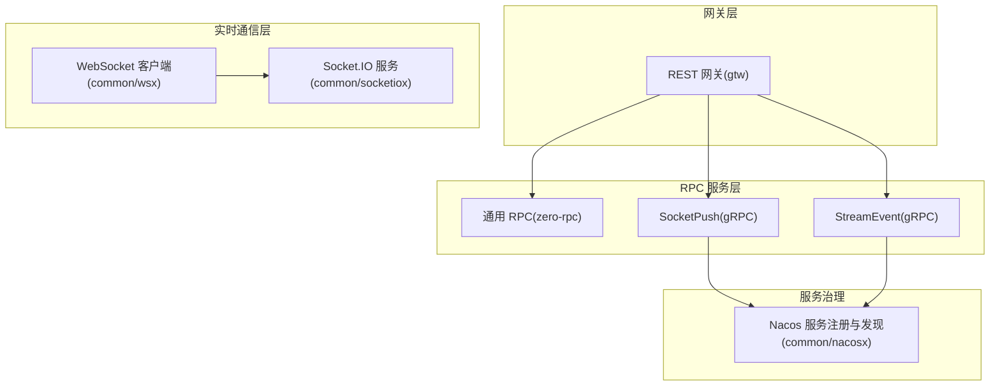
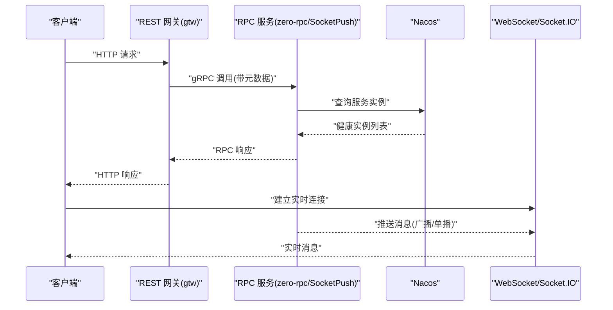
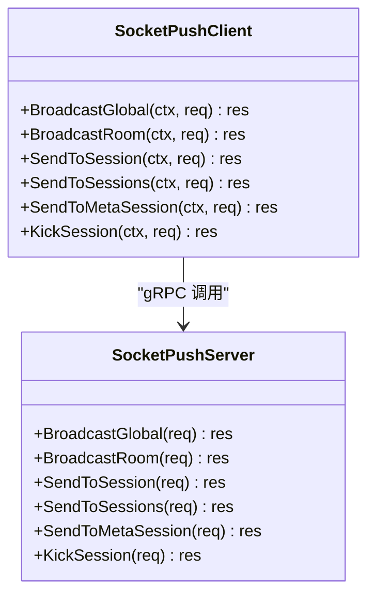
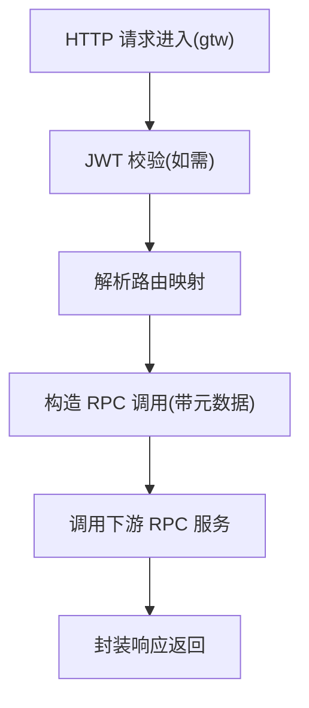
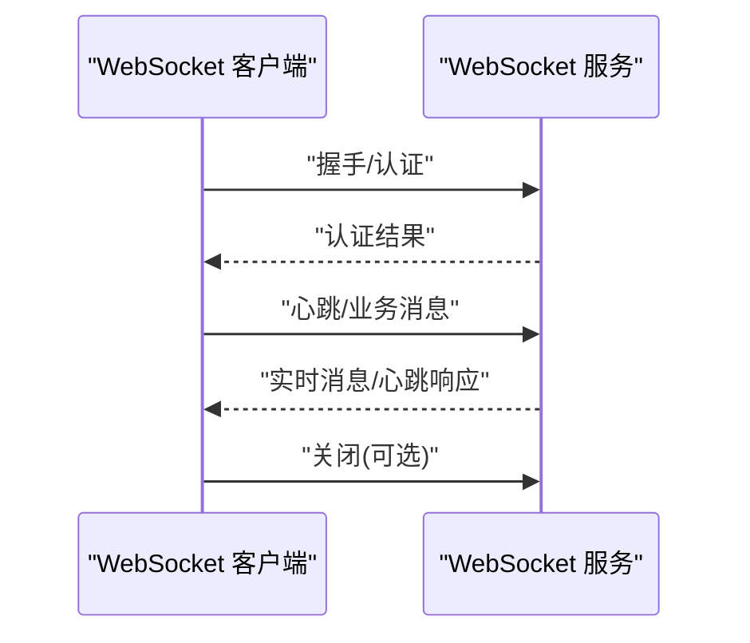
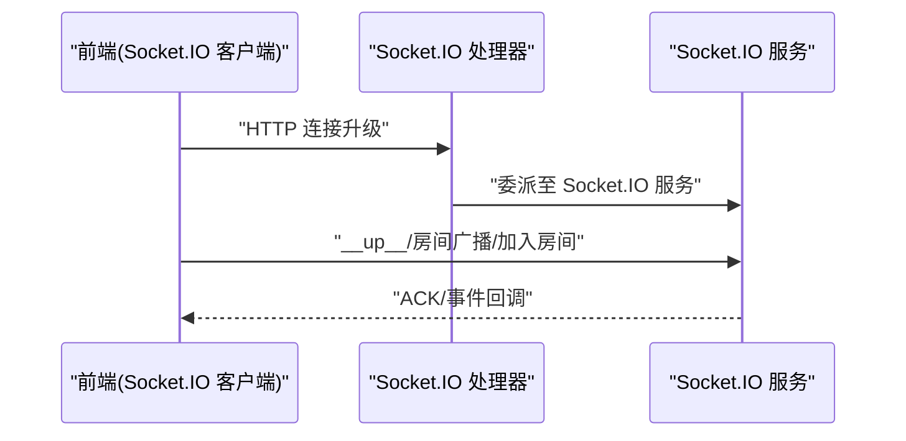
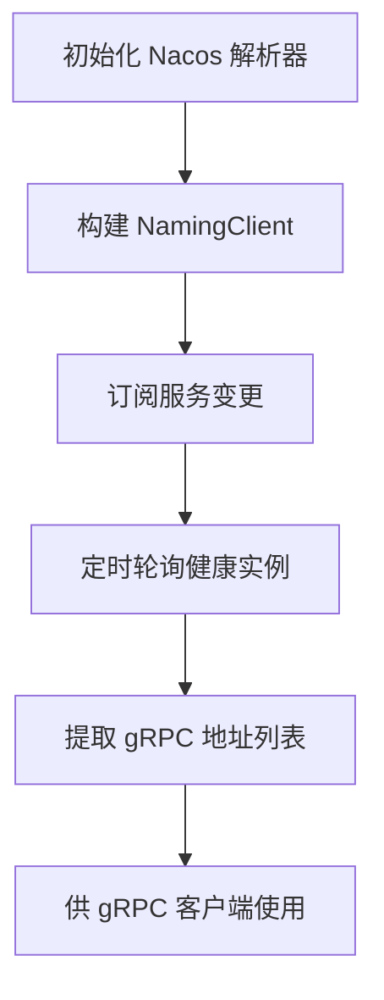
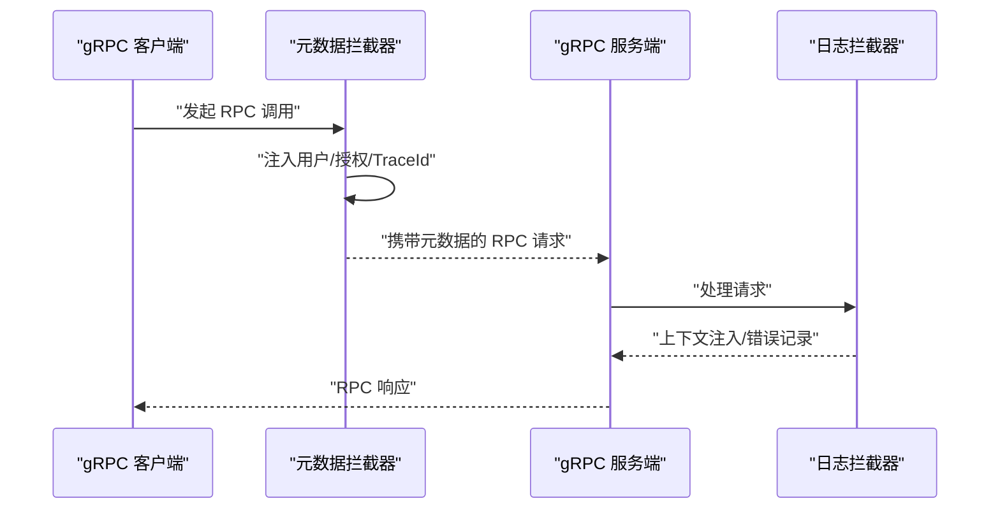
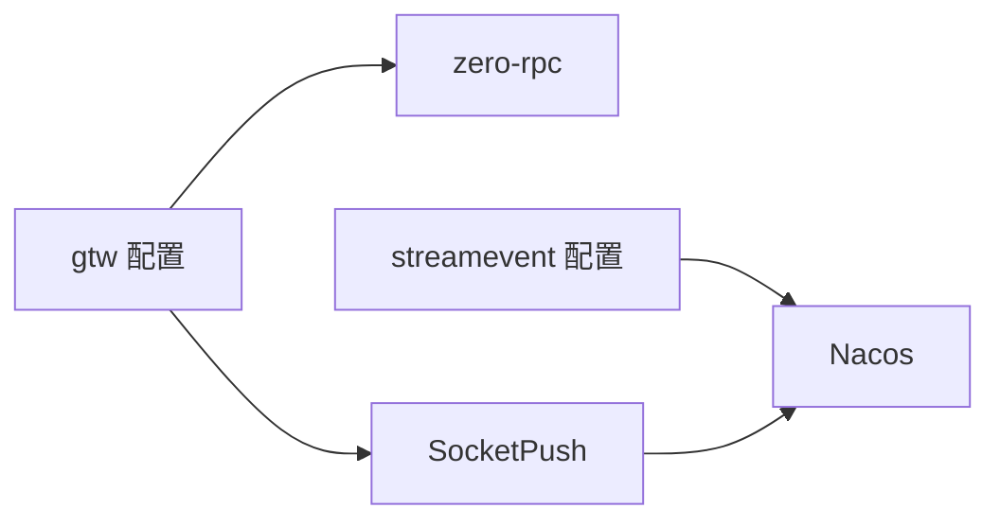

# 服务通信机制

<cite>
**本文引用的文件**
- [common/wsx/client.go](file://common/wsx/client.go)
- [common/socketiox/handler.go](file://common/socketiox/handler.go)
- [common/socketiox/container.go](file://common/socketiox/container.go)
- [common/nacosx/builder.go](file://common/nacosx/builder.go)
- [common/nacosx/target.go](file://common/nacosx/target.go)
- [common/nacosx/options.go](file://common/nacosx/options.go)
- [common/Interceptor/rpcclient/metadataInterceptor.go](file://common/Interceptor/rpcclient/metadataInterceptor.go)
- [common/Interceptor/rpcserver/loggerInterceptor.go](file://common/Interceptor/rpcserver/loggerInterceptor.go)
- [socketapp/socketpush/socketpush/socketpush_grpc.pb.go](file://socketapp/socketpush/socketpush/socketpush_grpc.pb.go)
- [socketapp/socketpush/socketpush/socketpush.pb.go](file://socketapp/socketpush/socketpush/socketpush.pb.go)
- [zerorpc/zerorpc/zerorpc.pb.go](file://zerorpc/zerorpc/zerorpc.pb.go)
- [gtw/etc/gtw.yaml](file://gtw/etc/gtw.yaml)
- [facade/streamevent/etc/streamevent.yaml](file://facade/streamevent/etc/streamevent.yaml)
- [facade/streamevent/internal/config/config.go](file://facade/streamevent/internal/config/config.go)
- [gtw/internal/config/config.go](file://gtw/internal/config/config.go)
- [common/wsx/client.go](file://common/wsx/client.go)
- [common/socketiox/test-socketio.html](file://common/socketiox/test-socketio.html)
</cite>

## 目录
1. [引言](#引言)
2. [项目结构](#项目结构)
3. [核心组件](#核心组件)
4. [架构总览](#架构总览)
5. [详细组件分析](#详细组件分析)
6. [依赖关系分析](#依赖关系分析)
7. [性能考量](#性能考量)
8. [故障排查指南](#故障排查指南)
9. [结论](#结论)
10. [附录](#附录)

## 引言
本文件系统性梳理 Zero-Service 的服务通信机制，覆盖 gRPC 高性能 RPC、HTTP REST、WebSocket 实时通信、Socket.IO 消息推送等多种通信方式；阐述适用场景、性能特征与实现要点；总结服务间通信的安全机制（认证授权、元数据透传、链路追踪）；说明基于 Nacos 的服务注册与发现、客户端侧负载均衡与路由策略；并提供通信协议选择指南与性能对比建议，以及监控、排障与优化实践。

## 项目结构
围绕通信机制的关键目录与文件：
- gRPC 服务与协议
  - socketapp/socketpush/socketpush/*.pb.go（SocketPush 服务定义与方法）
  - zerorpc/zerorpc/*.pb.go（通用 RPC 服务定义）
- HTTP REST 网关与配置
  - gtw/*（REST 网关模块，包含配置与路由）
- WebSocket 与 Socket.IO
  - common/wsx/*（WebSocket 客户端）
  - common/socketiox/*（Socket.IO 服务与处理器）
- 服务发现与负载均衡
  - common/nacosx/*（Nacos 解析器与目标参数）
- 安全与中间件
  - common/Interceptor/*（gRPC 元数据拦截器与日志拦截器）

**图示来源**
- [gtw/etc/gtw.yaml:47-61](file://gtw/etc/gtw.yaml#L47-L61)
- [socketapp/socketpush/socketpush/socketpush_grpc.pb.go:397-431](file://socketapp/socketpush/socketpush/socketpush_grpc.pb.go#L397-L431)
- [zerorpc/zerorpc/zerorpc.pb.go:56-1591](file://zerorpc/zerorpc/zerorpc.pb.go#L56-L1591)
- [common/wsx/client.go:1-800](file://common/wsx/client.go#L1-L800)
- [common/socketiox/handler.go:1-41](file://common/socketiox/handler.go#L1-L41)
- [common/nacosx/builder.go:41-138](file://common/nacosx/builder.go#L41-L138)

**章节来源**
- [gtw/etc/gtw.yaml:1-61](file://gtw/etc/gtw.yaml#L1-L61)
- [facade/streamevent/etc/streamevent.yaml:1-28](file://facade/streamevent/etc/streamevent.yaml#L1-L28)
- [facade/streamevent/internal/config/config.go:1-25](file://facade/streamevent/internal/config/config.go#L1-L25)
- [gtw/internal/config/config.go:1-21](file://gtw/internal/config/config.go#L1-L21)

## 核心组件
- gRPC 服务族
  - SocketPush：提供全局广播、房间广播、单会话/多会话推送、按元信息推送、会话踢出等能力，方法由 pb 文件定义。
  - 通用 RPC(zero-rpc)：提供登录、鉴权、任务转发等通用 RPC 能力。
- REST 网关(gtw)
  - 统一入口，配置 JWT 密钥、RPC 客户端端点、超时、下载路径等。
- WebSocket 客户端
  - 支持心跳、指数退避重连、认证超时、Token 刷新、消息回调、状态变更回调等。
- Socket.IO 服务
  - 提供 HTTP 处理器桥接，支持房间、全局广播、上行事件等。
- Nacos 服务发现
  - 构建 NamingClient、订阅服务、周期拉取实例、解析健康实例地址列表。

**章节来源**
- [socketapp/socketpush/socketpush/socketpush_grpc.pb.go:397-431](file://socketapp/socketpush/socketpush/socketpush_grpc.pb.go#L397-L431)
- [zerorpc/zerorpc/zerorpc.pb.go:56-1591](file://zerorpc/zerorpc/zerorpc.pb.go#L56-L1591)
- [gtw/etc/gtw.yaml:47-61](file://gtw/etc/gtw.yaml#L47-L61)
- [common/wsx/client.go:1-800](file://common/wsx/client.go#L1-L800)
- [common/socketiox/handler.go:1-41](file://common/socketiox/handler.go#L1-L41)
- [common/nacosx/builder.go:41-138](file://common/nacosx/builder.go#L41-L138)

## 架构总览
下图展示典型调用链：REST 网关将请求映射到 RPC 服务；RPC 服务通过 Nacos 获取可用实例并进行客户端侧负载均衡；实时通信通过 WebSocket 或 Socket.IO 与客户端交互。

**图示来源**
- [gtw/etc/gtw.yaml:47-61](file://gtw/etc/gtw.yaml#L47-L61)
- [common/nacosx/builder.go:75-112](file://common/nacosx/builder.go#L75-L112)
- [common/wsx/client.go:386-445](file://common/wsx/client.go#L386-L445)
- [common/socketiox/handler.go:33-35](file://common/socketiox/handler.go#L33-L35)

## 详细组件分析

### gRPC 服务与协议
- SocketPush 服务
  - 方法包括全局广播、房间广播、单会话/多会话推送、按元信息推送、会话踢出等，均以 pb 定义。
  - 服务端拦截器可对请求进行日志记录与上下文注入。
- 通用 RPC(zero-rpc)
  - 提供登录、鉴权、任务转发等方法，供网关或其他服务调用。

**图示来源**
- [socketapp/socketpush/socketpush/socketpush_grpc.pb.go:397-431](file://socketapp/socketpush/socketpush/socketpush_grpc.pb.go#L397-L431)
- [socketapp/socketpush/socketpush/socketpush.pb.go:553-1703](file://socketapp/socketpush/socketpush/socketpush.pb.go#L553-L1703)

**章节来源**
- [socketapp/socketpush/socketpush/socketpush_grpc.pb.go:397-431](file://socketapp/socketpush/socketpush/socketpush_grpc.pb.go#L397-L431)
- [socketapp/socketpush/socketpush/socketpush.pb.go:553-1703](file://socketapp/socketpush/socketpush/socketpush.pb.go#L553-L1703)
- [zerorpc/zerorpc/zerorpc.pb.go:56-1591](file://zerorpc/zerorpc/zerorpc.pb.go#L56-L1591)

### HTTP REST 网关与路由
- 配置项
  - JWT 密钥、RPC 客户端端点、超时、下载路径、Swagger 路径等。
- 路由与映射
  - 网关负责将 HTTP 请求映射到具体 RPC 方法，支持批量配置与非阻塞调用。

**图示来源**
- [gtw/etc/gtw.yaml:47-61](file://gtw/etc/gtw.yaml#L47-L61)
- [gtw/internal/config/config.go:8-21](file://gtw/internal/config/config.go#L8-L21)

**章节来源**
- [gtw/etc/gtw.yaml:1-61](file://gtw/etc/gtw.yaml#L1-L61)
- [gtw/internal/config/config.go:1-21](file://gtw/internal/config/config.go#L1-L21)

### WebSocket 实时通信
- 客户端特性
  - 心跳间隔、重连策略（指数退避）、认证超时、Token 刷新、消息回调、状态变更回调。
  - 支持发送二进制/JSON、Pong 自动续期读超时、优雅关闭。
- 适用场景
  - 实时状态推送、事件通知、低延迟双向通信。

**图示来源**
- [common/wsx/client.go:386-445](file://common/wsx/client.go#L386-L445)
- [common/wsx/client.go:448-535](file://common/wsx/client.go#L448-L535)
- [common/wsx/client.go:538-571](file://common/wsx/client.go#L538-L571)
- [common/wsx/client.go:598-633](file://common/wsx/client.go#L598-L633)
- [common/wsx/client.go:640-697](file://common/wsx/client.go#L640-L697)
- [common/wsx/client.go:700-774](file://common/wsx/client.go#L700-L774)
- [common/wsx/client.go:776-800](file://common/wsx/client.go#L776-L800)

**章节来源**
- [common/wsx/client.go:1-800](file://common/wsx/client.go#L1-L800)

### Socket.IO 消息推送
- 服务与处理器
  - 提供 HTTP 处理器桥接，支持房间、全局广播、上行事件等。
- 测试页面
  - 提供前端测试页面，演示连接、房间加入/离开、广播发送等。

**图示来源**
- [common/socketiox/handler.go:19-41](file://common/socketiox/handler.go#L19-L41)
- [common/socketiox/test-socketio.html:973-1393](file://common/socketiox/test-socketio.html#L973-L1393)

**章节来源**
- [common/socketiox/handler.go:1-41](file://common/socketiox/handler.go#L1-L41)
- [common/socketiox/test-socketio.html:973-1393](file://common/socketiox/test-socketio.html#L973-L1393)

### 服务发现与负载均衡
- Nacos 解析器
  - 构造 NamingClient、订阅服务、周期拉取实例、过滤健康实例并提取 gRPC 地址。
- 目标参数
  - 支持用户名密码、命名空间、分组、集群、超时、日志/缓存目录等。
- 选项配置
  - 支持前缀、权重、集群、分组、元数据等。

**图示来源**
- [common/nacosx/builder.go:41-138](file://common/nacosx/builder.go#L41-L138)
- [common/nacosx/target.go:13-42](file://common/nacosx/target.go#L13-L42)
- [common/nacosx/options.go:11-71](file://common/nacosx/options.go#L11-L71)

**章节来源**
- [common/nacosx/builder.go:41-138](file://common/nacosx/builder.go#L41-L138)
- [common/nacosx/target.go:1-42](file://common/nacosx/target.go#L1-L42)
- [common/nacosx/options.go:1-71](file://common/nacosx/options.go#L1-L71)

### 安全机制与中间件
- gRPC 元数据拦截器
  - 客户端侧将用户 ID、用户名、部门编码、授权信息、TraceId 等写入 outgoing metadata。
- gRPC 日志拦截器
  - 服务端侧从 incoming metadata 读取上述字段注入上下文，并记录错误。
- REST 网关 JWT
  - 网关配置 JWT 密钥，用于保护上游 RPC 调用。

**图示来源**
- [common/Interceptor/rpcclient/metadataInterceptor.go:11-32](file://common/Interceptor/rpcclient/metadataInterceptor.go#L11-L32)
- [common/Interceptor/rpcserver/loggerInterceptor.go:12-44](file://common/Interceptor/rpcserver/loggerInterceptor.go#L12-L44)
- [gtw/etc/gtw.yaml:57-59](file://gtw/etc/gtw.yaml#L57-L59)

**章节来源**
- [common/Interceptor/rpcclient/metadataInterceptor.go:1-56](file://common/Interceptor/rpcclient/metadataInterceptor.go#L1-L56)
- [common/Interceptor/rpcserver/loggerInterceptor.go:1-45](file://common/Interceptor/rpcserver/loggerInterceptor.go#L1-L45)
- [gtw/etc/gtw.yaml:57-59](file://gtw/etc/gtw.yaml#L57-L59)

## 依赖关系分析
- 网关依赖
  - gtw 依赖 zero-rpc 与 SocketPush 等 RPC 服务，通过配置中的 Endpoints 指定下游地址。
- 服务端配置
  - streamevent 等 RPC 服务配置了 Nacos 注册参数与中间件统计忽略项。
- 通信组件耦合
  - WebSocket 与 Socket.IO 作为独立实时通道，不强依赖 gRPC；但可通过 RPC 触发推送。

**图示来源**
- [gtw/etc/gtw.yaml:47-61](file://gtw/etc/gtw.yaml#L47-L61)
- [facade/streamevent/etc/streamevent.yaml:14-28](file://facade/streamevent/etc/streamevent.yaml#L14-L28)
- [facade/streamevent/internal/config/config.go:7-15](file://facade/streamevent/internal/config/config.go#L7-L15)

**章节来源**
- [gtw/etc/gtw.yaml:1-61](file://gtw/etc/gtw.yaml#L1-L61)
- [facade/streamevent/etc/streamevent.yaml:1-28](file://facade/streamevent/etc/streamevent.yaml#L1-L28)
- [facade/streamevent/internal/config/config.go:1-25](file://facade/streamevent/internal/config/config.go#L1-L25)

## 性能考量
- gRPC
  - 优势：二进制协议、多路复用、低开销、强类型 pb 定义、服务发现集成。
  - 适用：高吞吐、低延迟、强一致性的服务间通信。
- HTTP REST
  - 优势：生态成熟、易调试、浏览器友好。
  - 适用：对外 API、网关聚合、跨语言互操作。
- WebSocket
  - 优势：双向、低延迟、心跳与重连机制完善。
  - 适用：实时状态、事件推送、长连接场景。
- Socket.IO
  - 优势：房间广播、事件驱动、兼容性好。
  - 适用：多房间、多事件、前端直连场景。

[本节为通用性能讨论，无需列出具体文件来源]

## 故障排查指南
- gRPC 调用失败
  - 检查 Nacos 实例健康状态与 gRPC 端口元数据；确认拦截器是否正确注入/读取元数据。
- REST 网关鉴权问题
  - 核对 JWT 密钥配置与请求头；确认路由映射与 RPC 超时。
- WebSocket 连接异常
  - 关注心跳间隔、认证超时、指数退避重连策略；检查服务端 Pong 处理与读超时设置。
- Socket.IO 广播异常
  - 使用测试页面验证连接、房间加入/离开、事件名一致性；确认处理器是否正确委派。

**章节来源**
- [common/nacosx/builder.go:120-138](file://common/nacosx/builder.go#L120-L138)
- [common/Interceptor/rpcclient/metadataInterceptor.go:11-32](file://common/Interceptor/rpcclient/metadataInterceptor.go#L11-L32)
- [common/Interceptor/rpcserver/loggerInterceptor.go:12-44](file://common/Interceptor/rpcserver/loggerInterceptor.go#L12-L44)
- [gtw/etc/gtw.yaml:47-61](file://gtw/etc/gtw.yaml#L47-L61)
- [common/wsx/client.go:386-445](file://common/wsx/client.go#L386-L445)
- [common/socketiox/test-socketio.html:973-1393](file://common/socketiox/test-socketio.html#L973-L1393)

## 结论
Zero-Service 在通信层面形成了“REST 网关 + gRPC RPC + 实时通道”的立体化架构：REST 适配外部与聚合，gRPC 保障服务内高效稳定，WebSocket/Socket.IO 提供低延迟实时体验。结合 Nacos 的服务发现与客户端侧负载均衡，以及完善的元数据与日志拦截器，整体具备良好的可运维性与扩展性。

## 附录
- 通信协议选择指南
  - 高吞吐/低延迟的服务间通信：优先 gRPC。
  - 对外 API/浏览器直连：优先 HTTP REST。
  - 实时事件/状态推送：WebSocket 或 Socket.IO。
- 性能对比要点
  - gRPC：二进制、多路复用、pb 序列化，适合高频小包。
  - HTTP REST：易调试、生态丰富，适合弱实时或跨域场景。
  - WebSocket：长连接、低开销心跳，适合持续双向。
  - Socket.IO：事件模型、房间广播，适合复杂实时交互。

[本节为通用指导，无需列出具体文件来源]