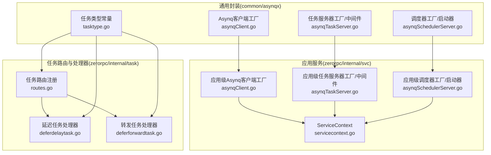
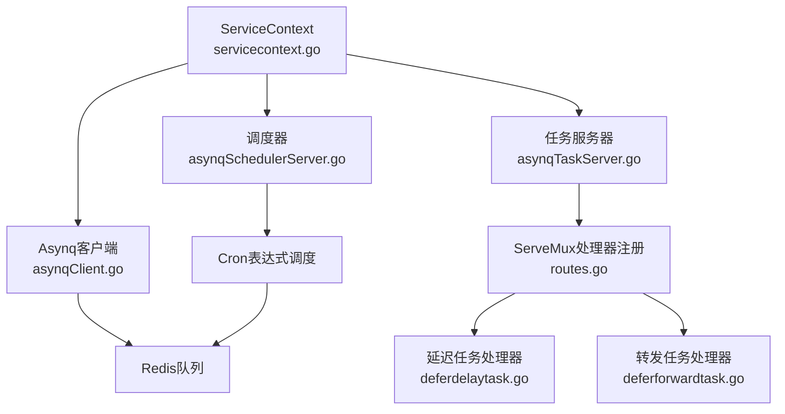
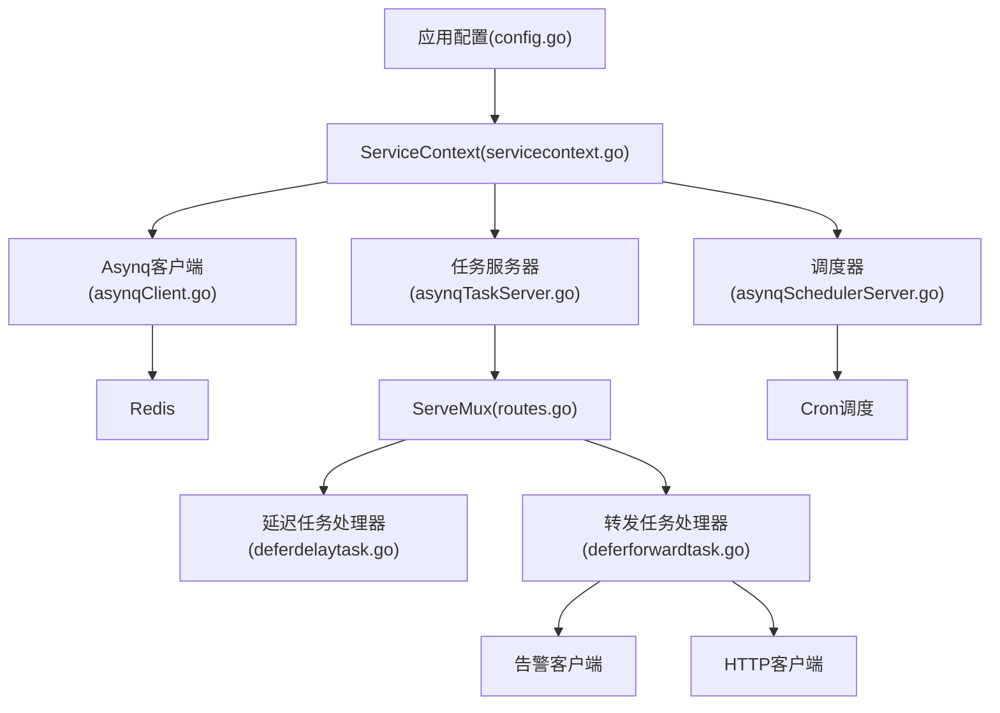
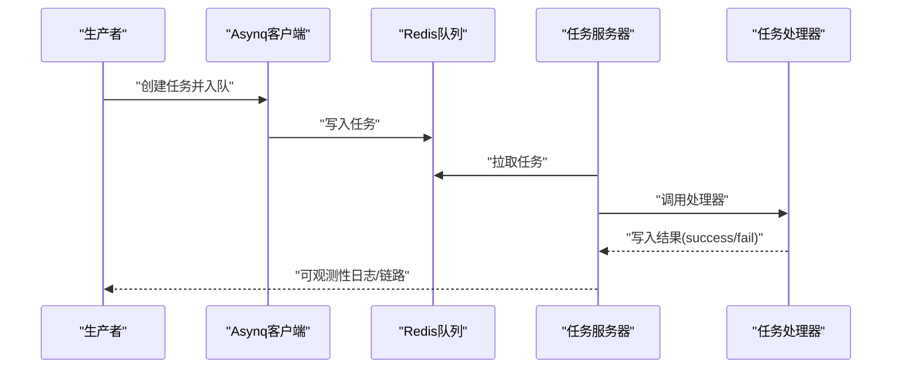

# Asynq任务队列

<cite>
**本文引用的文件**
- [common/asynqx/asynqClient.go](file://common/asynqx/asynqClient.go)
- [common/asynqx/asynqTaskServer.go](file://common/asynqx/asynqTaskServer.go)
- [common/asynqx/asynqSchedulerServer.go](file://common/asynqx/asynqSchedulerServer.go)
- [common/asynqx/tasktype.go](file://common/asynqx/tasktype.go)
- [zerorpc/internal/svc/asynqClient.go](file://zerorpc/internal/svc/asynqClient.go)
- [zerorpc/internal/svc/asynqTaskServer.go](file://zerorpc/internal/svc/asynqTaskServer.go)
- [zerorpc/internal/svc/asynqSchedulerServer.go](file://zerorpc/internal/svc/asynqSchedulerServer.go)
- [zerorpc/internal/svc/servicecontext.go](file://zerorpc/internal/svc/servicecontext.go)
- [zerorpc/internal/task/routes.go](file://zerorpc/internal/task/routes.go)
- [zerorpc/internal/task/deferdelaytask.go](file://zerorpc/internal/task/deferdelaytask.go)
- [zerorpc/internal/task/deferforwardtask.go](file://zerorpc/internal/task/deferforwardtask.go)
- [zerorpc/internal/config/config.go](file://zerorpc/internal/config/config.go)
</cite>

## 目录
1. [简介](#简介)
2. [项目结构](#项目结构)
3. [核心组件](#核心组件)
4. [架构总览](#架构总览)
5. [详细组件分析](#详细组件分析)
6. [依赖分析](#依赖分析)
7. [性能考虑](#性能考虑)
8. [故障排查指南](#故障排查指南)
9. [结论](#结论)
10. [附录](#附录)

## 简介
本文件面向Zero-Service中的Asynq任务队列系统，提供从客户端初始化、任务处理器注册、调度器运行到任务类型定义与使用的完整说明，并结合项目现有实现总结性能优化与监控调试实践。读者可据此理解如何在该系统中安全地发布任务、可靠地消费任务、稳定地调度任务，并掌握可观测性与排障要点。

## 项目结构
围绕Asynq的关键代码分布在以下位置：
- 通用封装层（common/asynqx）：提供Asynq客户端、任务服务器、调度器服务器的工厂函数与中间件、日志记录器、任务类型常量等。
- 应用服务层（zerorpc/internal/svc）：基于通用封装层，结合应用配置生成Asynq客户端、任务服务器、调度器实例；并提供OpenTelemetry链路追踪的生产者/消费者Span。
- 任务路由与处理器（zerorpc/internal/task）：定义任务处理器（如延迟任务、转发任务），并通过ServeMux完成处理器注册。
- 应用配置（zerorpc/internal/config）：定义Redis等外部依赖的配置项。

图表来源
- [common/asynqx/asynqClient.go:17-23](file://common/asynqx/asynqClient.go#L17-L23)
- [common/asynqx/asynqTaskServer.go:39-64](file://common/asynqx/asynqTaskServer.go#L39-L64)
- [common/asynqx/asynqSchedulerServer.go:32-52](file://common/asynqx/asynqSchedulerServer.go#L32-L52)
- [common/asynqx/tasktype.go:3-9](file://common/asynqx/tasktype.go#L3-L9)
- [zerorpc/internal/svc/asynqClient.go:18-20](file://zerorpc/internal/svc/asynqClient.go#L18-L20)
- [zerorpc/internal/svc/asynqTaskServer.go:35-51](file://zerorpc/internal/svc/asynqTaskServer.go#L35-L51)
- [zerorpc/internal/svc/asynqSchedulerServer.go:34-53](file://zerorpc/internal/svc/asynqSchedulerServer.go#L34-L53)
- [zerorpc/internal/svc/servicecontext.go:35-101](file://zerorpc/internal/svc/servicecontext.go#L35-L101)
- [zerorpc/internal/task/routes.go:22-36](file://zerorpc/internal/task/routes.go#L22-L36)
- [zerorpc/internal/task/deferdelaytask.go:23-36](file://zerorpc/internal/task/deferdelaytask.go#L23-L36)
- [zerorpc/internal/task/deferforwardtask.go:31-96](file://zerorpc/internal/task/deferforwardtask.go#L31-L96)

章节来源
- [common/asynqx/asynqClient.go:17-30](file://common/asynqx/asynqClient.go#L17-L30)
- [common/asynqx/asynqTaskServer.go:39-87](file://common/asynqx/asynqTaskServer.go#L39-L87)
- [common/asynqx/asynqSchedulerServer.go:32-62](file://common/asynqx/asynqSchedulerServer.go#L32-L62)
- [common/asynqx/tasktype.go:3-9](file://common/asynqx/tasktype.go#L3-L9)
- [zerorpc/internal/svc/asynqClient.go:18-27](file://zerorpc/internal/svc/asynqClient.go#L18-L27)
- [zerorpc/internal/svc/asynqTaskServer.go:35-75](file://zerorpc/internal/svc/asynqTaskServer.go#L35-L75)
- [zerorpc/internal/svc/asynqSchedulerServer.go:34-63](file://zerorpc/internal/svc/asynqSchedulerServer.go#L34-L63)
- [zerorpc/internal/svc/servicecontext.go:35-101](file://zerorpc/internal/svc/servicecontext.go#L35-L101)
- [zerorpc/internal/task/routes.go:22-36](file://zerorpc/internal/task/routes.go#L22-L36)
- [zerorpc/internal/task/deferdelaytask.go:23-36](file://zerorpc/internal/task/deferdelaytask.go#L23-L36)
- [zerorpc/internal/task/deferforwardtask.go:31-96](file://zerorpc/internal/task/deferforwardtask.go#L31-L96)

## 核心组件
- Asynq客户端工厂：负责创建Redis连接的客户端与检查器，支持设置地址、密码、数据库索引等。
- 任务服务器工厂：创建Asynq服务器实例，配置并发度、队列权重、超时与连接池大小，并提供启动/停止能力。
- 调度器服务器工厂：创建Asynq调度器实例，配置时区、入队后回调与日志器，并提供启动/停止能力。
- 任务类型常量：统一定义延迟任务、触发任务、调度器任务的类型标识，便于跨模块复用。
- 中间件与日志：提供统一的日志中间件，记录任务处理耗时、错误与成功状态。
- OpenTelemetry集成：在生产者与消费者侧分别开启Span，标注任务类型，便于链路追踪。

章节来源
- [common/asynqx/asynqClient.go:17-30](file://common/asynqx/asynqClient.go#L17-L30)
- [common/asynqx/asynqTaskServer.go:39-87](file://common/asynqx/asynqTaskServer.go#L39-L87)
- [common/asynqx/asynqSchedulerServer.go:32-62](file://common/asynqx/asynqSchedulerServer.go#L32-L62)
- [common/asynqx/tasktype.go:3-9](file://common/asynqx/tasktype.go#L3-L9)
- [common/asynqx/asynqTaskServer.go:73-87](file://common/asynqx/asynqTaskServer.go#L73-L87)
- [zerorpc/internal/svc/asynqClient.go:22-27](file://zerorpc/internal/svc/asynqClient.go#L22-L27)
- [zerorpc/internal/svc/asynqTaskServer.go:53-75](file://zerorpc/internal/svc/asynqTaskServer.go#L53-L75)
- [zerorpc/internal/svc/asynqSchedulerServer.go:34-63](file://zerorpc/internal/svc/asynqSchedulerServer.go#L34-L63)

## 架构总览
下图展示了从应用上下文创建到任务处理与调度的整体流程，以及各组件之间的依赖关系。

图表来源
- [zerorpc/internal/svc/servicecontext.go:35-101](file://zerorpc/internal/svc/servicecontext.go#L35-L101)
- [common/asynqx/asynqClient.go:17-23](file://common/asynqx/asynqClient.go#L17-L23)
- [common/asynqx/asynqTaskServer.go:39-64](file://common/asynqx/asynqTaskServer.go#L39-L64)
- [common/asynqx/asynqSchedulerServer.go:32-52](file://common/asynqx/asynqSchedulerServer.go#L32-L52)
- [zerorpc/internal/task/routes.go:22-36](file://zerorpc/internal/task/routes.go#L22-L36)
- [zerorpc/internal/task/deferdelaytask.go:23-36](file://zerorpc/internal/task/deferdelaytask.go#L23-L36)
- [zerorpc/internal/task/deferforwardtask.go:31-96](file://zerorpc/internal/task/deferforwardtask.go#L31-L96)

## 详细组件分析

### Asynq客户端初始化与配置
- 客户端工厂：通过Redis地址、密码与数据库索引创建Asynq客户端与检查器，用于任务入队与状态查询。
- 配置来源：应用层客户端工厂直接读取配置中的Redis主机与密码，确保与应用配置一致。
- 链路追踪：在生产者侧开启Span，标注任务类型，便于跨服务追踪。

章节来源
- [common/asynqx/asynqClient.go:17-30](file://common/asynqx/asynqClient.go#L17-L30)
- [zerorpc/internal/svc/asynqClient.go:18-27](file://zerorpc/internal/svc/asynqClient.go#L18-L27)

### 任务服务器实现
- 服务器工厂：创建Asynq服务器，设置Redis连接参数、超时与连接池大小；配置并发度与队列权重，以实现不同优先级任务的差异化处理。
- 中间件：提供统一日志中间件，记录任务类型、任务ID与处理耗时；错误时输出错误日志，成功时输出调试日志。
- 启停控制：提供Start/Stop方法，便于在服务生命周期内优雅启停。

章节来源
- [common/asynqx/asynqTaskServer.go:39-87](file://common/asynqx/asynqTaskServer.go#L39-L87)
- [zerorpc/internal/svc/asynqTaskServer.go:35-75](file://zerorpc/internal/svc/asynqTaskServer.go#L35-L75)

### 调度器服务器功能
- 调度器工厂：创建Asynq调度器，设置时区、入队后回调与日志器；入队后回调用于记录任务ID与类型，便于后续追踪。
- 启停控制：提供Start/Shutdown方法，保证调度器在服务生命周期内的可控运行。
- 示例注册：提供一个示例任务注册方法，使用Cron表达式周期性入队任务。

章节来源
- [common/asynqx/asynqSchedulerServer.go:32-62](file://common/asynqx/asynqSchedulerServer.go#L32-L62)
- [zerorpc/internal/svc/asynqSchedulerServer.go:34-63](file://zerorpc/internal/svc/asynqSchedulerServer.go#L34-L63)

### 任务处理器注册与并发控制
- 路由注册：通过ServeMux注册不同类型的任务处理器，统一挂载日志中间件，确保所有任务处理具备一致的可观测性。
- 并发控制：服务器配置了全局并发度与队列权重，不同优先级队列（如critical/default/low）按权重分配处理资源。
- 处理器示例：
  - 延迟任务处理器：解析任务载荷，提取链路上下文，执行业务逻辑。
  - 转发任务处理器：解析任务载荷，发起HTTP请求，根据响应状态写入结果，并在异常时触发告警。

章节来源
- [zerorpc/internal/task/routes.go:22-36](file://zerorpc/internal/task/routes.go#L22-L36)
- [common/asynqx/asynqTaskServer.go:55-61](file://common/asynqx/asynqTaskServer.go#L55-L61)
- [zerorpc/internal/task/deferdelaytask.go:23-36](file://zerorpc/internal/task/deferdelaytask.go#L23-L36)
- [zerorpc/internal/task/deferforwardtask.go:31-96](file://zerorpc/internal/task/deferforwardtask.go#L31-L96)

### 任务类型定义与使用
- 类型常量：集中定义延迟任务、触发任务与调度器任务的类型字符串，避免魔法字符串，提升一致性与可维护性。
- 使用方式：在任务处理器注册时作为类型标识；在任务入队时作为任务类型；在日志与Span中作为标签使用。

章节来源
- [common/asynqx/tasktype.go:3-9](file://common/asynqx/tasktype.go#L3-L9)
- [zerorpc/internal/task/routes.go:26-34](file://zerorpc/internal/task/routes.go#L26-L34)

### 任务参数传递、结果处理与错误处理
- 参数传递：任务载荷采用JSON格式，处理器侧进行反序列化；同时支持从消息载体中提取OpenTelemetry上下文，保障跨服务链路连通。
- 结果处理：处理器通过ResultWriter写入“success”或“fail”，便于后续查询与审计。
- 错误处理：中间件捕获错误并输出日志；转发任务在HTTP调用失败或状态码非200时，触发告警并返回错误。

章节来源
- [zerorpc/internal/task/deferdelaytask.go:24-36](file://zerorpc/internal/task/deferdelaytask.go#L24-L36)
- [zerorpc/internal/task/deferforwardtask.go:33-96](file://zerorpc/internal/task/deferforwardtask.go#L33-L96)
- [common/asynqx/asynqTaskServer.go:73-87](file://common/asynqx/asynqTaskServer.go#L73-L87)

### OpenTelemetry链路追踪
- 生产者Span：在任务入队前开启生产者Span，标注任务类型，便于追踪任务从生产到消费的全链路。
- 消费者Span：在任务处理开始时开启消费者Span，结束时关闭，标注任务类型，形成完整的消费链路。
- 上下文传播：从任务载荷中提取TextMap，注入当前上下文，确保分布式链路连续。

章节来源
- [common/asynqx/asynqClient.go:25-30](file://common/asynqx/asynqClient.go#L25-L30)
- [zerorpc/internal/svc/asynqClient.go:22-27](file://zerorpc/internal/svc/asynqClient.go#L22-L27)
- [zerorpc/internal/svc/asynqTaskServer.go:53-58](file://zerorpc/internal/svc/asynqTaskServer.go#L53-L58)
- [zerorpc/internal/task/deferdelaytask.go:29-32](file://zerorpc/internal/task/deferdelaytask.go#L29-L32)
- [zerorpc/internal/task/deferforwardtask.go:36-39](file://zerorpc/internal/task/deferforwardtask.go#L36-L39)

## 依赖分析
- 组件耦合：应用服务层通过ServiceContext统一持有Asynq客户端、服务器与调度器实例，降低上层对底层库的直接依赖。
- 外部依赖：Redis作为队列存储；HTTP客户端用于任务转发；告警客户端用于异常通知。
- 配置来源：Redis主机、密码等配置来自应用配置，确保部署一致性。

图表来源
- [zerorpc/internal/config/config.go:8-24](file://zerorpc/internal/config/config.go#L8-L24)
- [zerorpc/internal/svc/servicecontext.go:35-101](file://zerorpc/internal/svc/servicecontext.go#L35-L101)
- [zerorpc/internal/svc/asynqClient.go:18-20](file://zerorpc/internal/svc/asynqClient.go#L18-L20)
- [zerorpc/internal/svc/asynqTaskServer.go:35-51](file://zerorpc/internal/svc/asynqTaskServer.go#L35-L51)
- [zerorpc/internal/svc/asynqSchedulerServer.go:34-53](file://zerorpc/internal/svc/asynqSchedulerServer.go#L34-L53)
- [zerorpc/internal/task/routes.go:22-36](file://zerorpc/internal/task/routes.go#L22-L36)
- [zerorpc/internal/task/deferdelaytask.go:23-36](file://zerorpc/internal/task/deferdelaytask.go#L23-L36)
- [zerorpc/internal/task/deferforwardtask.go:31-96](file://zerorpc/internal/task/deferforwardtask.go#L31-L96)

章节来源
- [zerorpc/internal/config/config.go:8-24](file://zerorpc/internal/config/config.go#L8-L24)
- [zerorpc/internal/svc/servicecontext.go:35-101](file://zerorpc/internal/svc/servicecontext.go#L35-L101)

## 性能考虑
- 并发与队列权重：服务器配置了全局并发度与多队列权重，建议根据业务重要性与资源情况调整权重，确保高优任务优先处理。
- 连接池与超时：合理设置Redis连接池大小与读写超时，避免在高负载场景下出现连接争用或超时。
- 批处理与批量入队：对于高频小任务，可考虑合并为批量入队，减少网络往返与Redis压力。
- 负载均衡：通过多实例部署任务服务器，利用Redis共享队列实现水平扩展；结合队列权重实现优先级分流。
- 资源管理：中间件记录处理耗时，可用于识别慢任务与热点处理器，指导进一步优化。

章节来源
- [common/asynqx/asynqTaskServer.go:55-61](file://common/asynqx/asynqTaskServer.go#L55-L61)
- [common/asynqx/asynqTaskServer.go:40-49](file://common/asynqx/asynqTaskServer.go#L40-L49)

## 故障排查指南
- 任务未被消费：检查任务服务器是否正常启动、队列权重是否正确、处理器是否已注册。
- 调度任务未入队：确认调度器已启动、Cron表达式正确、入队后回调日志是否输出。
- 转发任务失败：检查HTTP客户端超时、目标URL可达性、响应状态码；关注告警日志与错误返回。
- 链路中断：确认任务载荷中携带的上下文信息是否正确提取，Span类型是否匹配（生产者/消费者）。
- 日志定位：利用中间件输出的任务类型、任务ID与耗时，快速定位问题节点。

章节来源
- [common/asynqx/asynqTaskServer.go:28-37](file://common/asynqx/asynqTaskServer.go#L28-L37)
- [common/asynqx/asynqSchedulerServer.go:21-30](file://common/asynqx/asynqSchedulerServer.go#L21-L30)
- [zerorpc/internal/task/deferforwardtask.go:49-96](file://zerorpc/internal/task/deferforwardtask.go#L49-L96)
- [common/asynqx/asynqTaskServer.go:73-87](file://common/asynqx/asynqTaskServer.go#L73-L87)

## 结论
本项目基于Asynq构建了完善的任务队列体系：通过统一的客户端与服务器工厂、中间件与日志、OpenTelemetry链路追踪，实现了任务的可靠入队、有序消费与稳定调度。配合清晰的任务类型定义与处理器注册机制，可在保证可观测性的前提下，灵活扩展各类异步任务场景。

## 附录
- 关键流程时序（任务入队与消费）

图表来源
- [common/asynqx/asynqClient.go:17-23](file://common/asynqx/asynqClient.go#L17-L23)
- [common/asynqx/asynqTaskServer.go:28-37](file://common/asynqx/asynqTaskServer.go#L28-L37)
- [zerorpc/internal/task/deferdelaytask.go:23-36](file://zerorpc/internal/task/deferdelaytask.go#L23-L36)