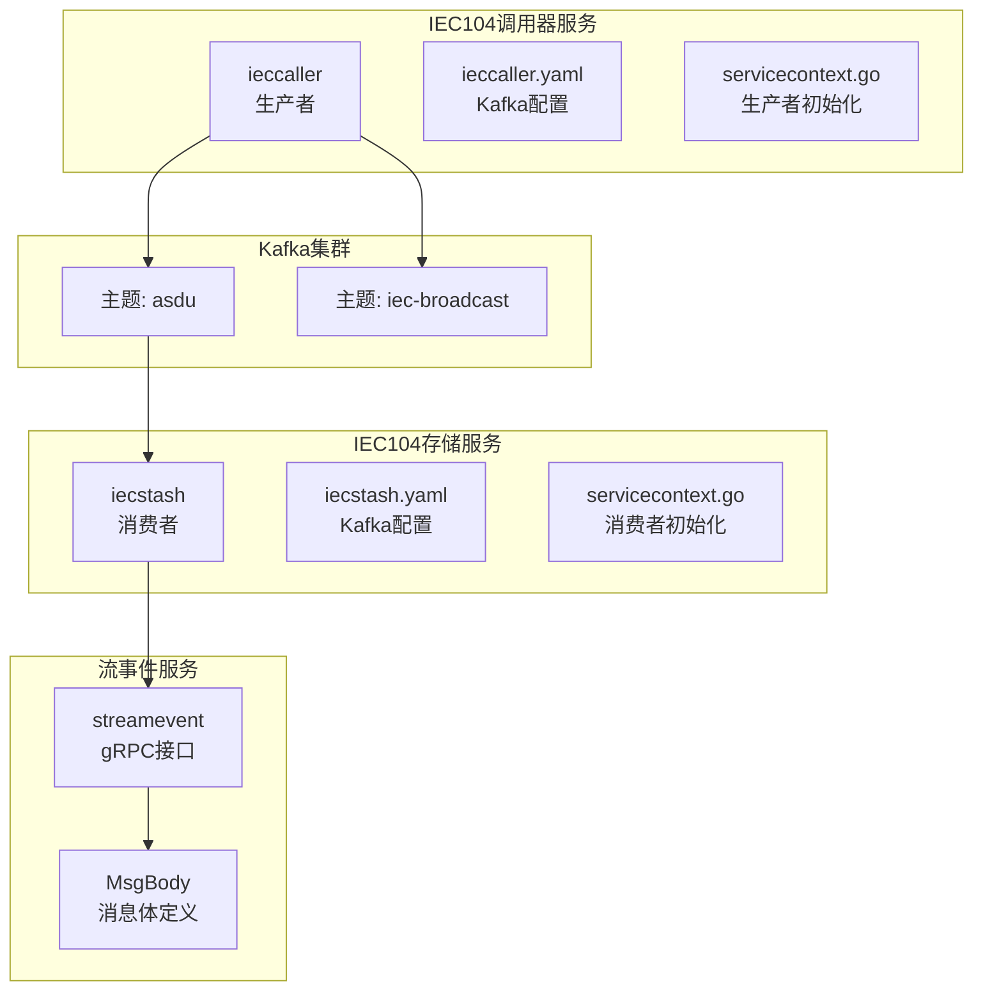
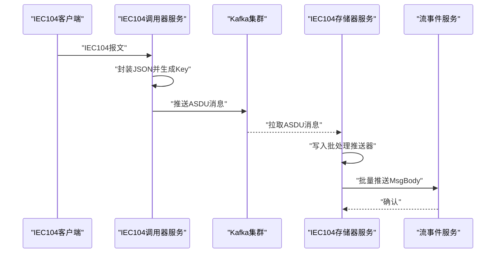
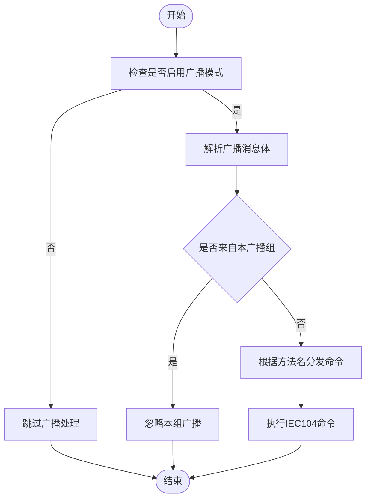
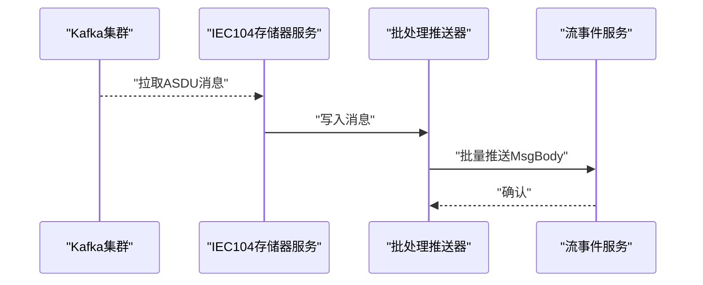
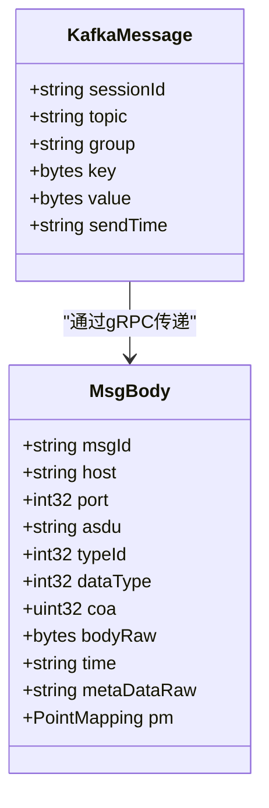
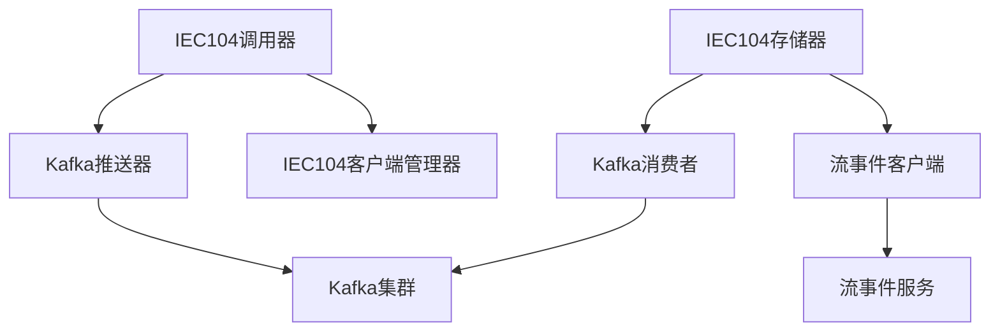

# Kafka集成实现

<cite>
**本文档引用的文件**
- [app/ieccaller/kafka/broadcast.go](file://app/ieccaller/kafka/broadcast.go)
- [app/iecstash/kafka/asdu.go](file://app/iecstash/kafka/asdu.go)
- [facade/streamevent/streamevent/streamevent.pb.go](file://facade/streamevent/streamevent/streamevent.pb.go)
- [facade/streamevent/streamevent/streamevent.pb.validate.go](file://facade/streamevent/streamevent/streamevent.pb.validate.go)
- [facade/streamevent/internal/logic/receivekafkamessagelogic.go](file://facade/streamevent/internal/logic/receivekafkamessagelogic.go)
- [common/configx/kqConfig.go](file://common/configx/kqConfig.go)
- [model/kafkamodel.go](file://model/kafkamodel.go)
- [app/ieccaller/etc/ieccaller.yaml](file://app/ieccaller/etc/ieccaller.yaml)
- [app/iecstash/etc/iecstash.yaml](file://app/iecstash/etc/iecstash.yaml)
- [app/ieccaller/internal/svc/servicecontext.go](file://app/ieccaller/internal/svc/servicecontext.go)
- [app/iecstash/internal/svc/servicecontext.go](file://app/iecstash/internal/svc/servicecontext.go)
- [docs/iec104-protocol.md](file://docs/iec104-protocol.md)
</cite>

## 目录
1. [引言](#引言)
2. [项目结构](#项目结构)
3. [核心组件](#核心组件)
4. [架构概览](#架构概览)
5. [详细组件分析](#详细组件分析)
6. [依赖分析](#依赖分析)
7. [性能考虑](#性能考虑)
8. [故障排查指南](#故障排查指南)
9. [结论](#结论)
10. [附录](#附录)

## 引言
本文件面向Zero-Service的Kafka集成实现，聚焦IEC 60870-5-104（简称IEC104）数据在Kafka中的传输与处理。内容涵盖消息广播机制、ASDU数据包处理、分区策略、生产者与消费者实现、序列化与反序列化流程、Kafka集群配置与管理，以及性能优化与故障排查方法。目标是帮助读者快速理解并高效运维该集成方案。

## 项目结构
与Kafka集成直接相关的模块主要分布在以下位置：
- 生产者侧：IEC104客户端封装与Kafka推送逻辑位于IEC104调用器服务中
- 消费者侧：ASDU数据消费与转发至流事件服务
- 协议模型：Kafka消息载体与流事件消息体通过Protocol Buffers定义
- 配置文件：各服务的Kafka连接、主题、消费者组等参数配置

图表来源
- [app/ieccaller/etc/ieccaller.yaml:35-41](file://app/ieccaller/etc/ieccaller.yaml#L35-L41)
- [app/iecstash/etc/iecstash.yaml:18-35](file://app/iecstash/etc/iecstash.yaml#L18-L35)
- [app/ieccaller/internal/svc/servicecontext.go:57-60](file://app/ieccaller/internal/svc/servicecontext.go#L57-L60)
- [app/iecstash/internal/svc/servicecontext.go:25-34](file://app/iecstash/internal/svc/servicecontext.go#L25-L34)
- [facade/streamevent/streamevent/streamevent.pb.go:535-606](file://facade/streamevent/streamevent/streamevent.pb.go#L535-L606)

章节来源
- [app/ieccaller/etc/ieccaller.yaml:1-79](file://app/ieccaller/etc/ieccaller.yaml#L1-L79)
- [app/iecstash/etc/iecstash.yaml:1-46](file://app/iecstash/etc/iecstash.yaml#L1-L46)
- [app/ieccaller/internal/svc/servicecontext.go:1-142](file://app/ieccaller/internal/svc/servicecontext.go#L1-L142)
- [app/iecstash/internal/svc/servicecontext.go:1-92](file://app/iecstash/internal/svc/servicecontext.go#L1-L92)

## 核心组件
- Kafka生产者（IEC104调用器）
  - 初始化：基于配置创建Kafka推送器实例，分别用于ASDU主题与广播主题
  - 数据推送：将IEC104报文封装为JSON字符串，按Key写入Kafka
  - 广播机制：跨节点同步命令，避免自播
- Kafka消费者（IEC104存储器）
  - 初始化：基于配置创建消费者，加入指定消费者组
  - 数据处理：将ASDU消息写入批处理推送器，最终通过gRPC推送到流事件服务
- 协议模型
  - KafkaMessage：Kafka消息载体（会话ID、主题、组、键、值、发送时间）
  - MsgBody：流事件消息体（包含ASDU、类型、元数据等）

章节来源
- [app/ieccaller/internal/svc/servicecontext.go:57-60](file://app/ieccaller/internal/svc/servicecontext.go#L57-L60)
- [app/ieccaller/kafka/broadcast.go:24-148](file://app/ieccaller/kafka/broadcast.go#L24-L148)
- [app/iecstash/kafka/asdu.go:20-24](file://app/iecstash/kafka/asdu.go#L20-L24)
- [facade/streamevent/streamevent/streamevent.pb.go:435-470](file://facade/streamevent/streamevent/streamevent.pb.go#L435-L470)
- [facade/streamevent/streamevent/streamevent.pb.go:535-606](file://facade/streamevent/streamevent/streamevent.pb.go#L535-L606)

## 架构概览
下图展示了IEC104数据在Kafka中的端到端流转路径：IEC104客户端产生ASDU报文，经IEC104调用器服务写入Kafka；IEC104存储器服务从Kafka消费ASDU，再通过流事件服务对外提供聚合能力。

图表来源
- [app/ieccaller/internal/svc/servicecontext.go:186-200](file://app/ieccaller/internal/svc/servicecontext.go#L186-L200)
- [app/iecstash/kafka/asdu.go:20-24](file://app/iecstash/kafka/asdu.go#L20-L24)
- [facade/streamevent/streamevent/streamevent.pb.go:535-606](file://facade/streamevent/streamevent/streamevent.pb.go#L535-L606)

## 详细组件分析

### 组件A：IEC104调用器生产者
- 功能职责
  - 将IEC104报文序列化为JSON字符串，作为Kafka消息值
  - 使用报文Key作为Kafka消息Key，确保同Key的消息进入同一分区
  - 支持广播主题，用于跨节点同步命令
- 关键实现要点
  - 生产者初始化：根据配置创建Kafka推送器实例
  - 广播过滤：避免接收来自自身广播组的消息
  - 命令分发：根据方法名路由到对应IEC104命令执行
- 错误处理
  - 客户端获取失败、命令执行失败均记录日志并返回

图表来源
- [app/ieccaller/kafka/broadcast.go:24-148](file://app/ieccaller/kafka/broadcast.go#L24-L148)

章节来源
- [app/ieccaller/kafka/broadcast.go:1-149](file://app/ieccaller/kafka/broadcast.go#L1-L149)
- [app/ieccaller/internal/svc/servicecontext.go:57-60](file://app/ieccaller/internal/svc/servicecontext.go#L57-L60)

### 组件B：IEC104存储器消费者
- 功能职责
  - 从Kafka订阅ASDU主题，按消费者组消费
  - 将消息写入批处理推送器，形成批量MsgBody
  - 通过gRPC调用流事件服务，推送聚合后的消息
- 关键实现要点
  - 消费者初始化：基于配置创建消费者并加入消费者组
  - 批量推送：根据配置的批次字节数进行聚合
  - 消息转换：从JSON字符串解析为MsgBody结构

图表来源
- [app/iecstash/kafka/asdu.go:20-24](file://app/iecstash/kafka/asdu.go#L20-L24)
- [app/iecstash/internal/svc/servicecontext.go:36-84](file://app/iecstash/internal/svc/servicecontext.go#L36-L84)
- [facade/streamevent/streamevent/streamevent.pb.go:535-606](file://facade/streamevent/streamevent/streamevent.pb.go#L535-L606)

章节来源
- [app/iecstash/kafka/asdu.go:1-25](file://app/iecstash/kafka/asdu.go#L1-L25)
- [app/iecstash/internal/svc/servicecontext.go:1-92](file://app/iecstash/internal/svc/servicecontext.go#L1-L92)

### 组件C：协议模型与序列化
- KafkaMessage
  - 字段：会话ID、主题、组、键、值、发送时间
  - 用途：承载Kafka消息的元信息
- MsgBody
  - 字段：消息ID、主机、端口、ASDU、类型、数据类型、信息对象地址、原始体、时间、元数据、点位映射
  - 用途：流事件服务的消息体
- 序列化与反序列化
  - 生产者侧：IEC104报文封装为JSON字符串
  - 消费者侧：从JSON字符串解析为MsgBody结构

图表来源
- [facade/streamevent/streamevent/streamevent.pb.go:435-470](file://facade/streamevent/streamevent/streamevent.pb.go#L435-L470)
- [facade/streamevent/streamevent/streamevent.pb.go:535-606](file://facade/streamevent/streamevent/streamevent.pb.go#L535-L606)

章节来源
- [facade/streamevent/streamevent/streamevent.pb.go:435-470](file://facade/streamevent/streamevent/streamevent.pb.go#L435-L470)
- [facade/streamevent/streamevent/streamevent.pb.go:535-606](file://facade/streamevent/streamevent/streamevent.pb.go#L535-L606)

### 组件D：配置与主题管理
- IEC104调用器配置
  - KafkaBrokers：Kafka集群地址
  - Topic：ASDU主题
  - BroadcastTopic：广播主题
  - BroadcastGroupId：广播组ID
- IEC104存储器配置
  - Name：消费者组名称
  - Brokers：Kafka集群地址
  - Topic：ASDU主题
  - Group：消费者组
  - Conns：连接数
  - Consumers：每个连接的消费者协程数
  - Processors：处理协程数
  - MinBytes/MaxBytes：每次拉取的数据块大小
  - CommitInOrder：有序提交
  - Offset：偏移量策略（first/last）
- 主题管理
  - 建议为ASDU主题与广播主题分别建立主题
  - 广播主题用于跨节点同步命令，避免重复处理

章节来源
- [app/ieccaller/etc/ieccaller.yaml:35-41](file://app/ieccaller/etc/ieccaller.yaml#L35-L41)
- [app/iecstash/etc/iecstash.yaml:18-35](file://app/iecstash/etc/iecstash.yaml#L18-L35)

## 依赖分析
- 组件耦合
  - IEC104调用器依赖Kafka推送器与IEC104客户端管理器
  - IEC104存储器依赖Kafka消费者与流事件客户端
- 外部依赖
  - Kafka：作为消息中间件
  - gRPC：与流事件服务通信
  - JSON：序列化与反序列化
- 潜在风险
  - 广播组配置错误可能导致消息循环
  - 消费者组配置不当可能引发重复消费或消息堆积

图表来源
- [app/ieccaller/internal/svc/servicecontext.go:57-60](file://app/ieccaller/internal/svc/servicecontext.go#L57-L60)
- [app/iecstash/internal/svc/servicecontext.go:25-34](file://app/iecstash/internal/svc/servicecontext.go#L25-L34)

章节来源
- [app/ieccaller/internal/svc/servicecontext.go:1-142](file://app/ieccaller/internal/svc/servicecontext.go#L1-L142)
- [app/iecstash/internal/svc/servicecontext.go:1-92](file://app/iecstash/internal/svc/servicecontext.go#L1-L92)

## 性能考虑
- 分区策略
  - 使用Key进行分区，确保相同Key的消息进入同一分区，便于顺序处理
  - 广播主题可采用随机Key或不同Key以提升并行度
- 拉取与批处理
  - 合理设置MinBytes/MaxBytes，平衡吞吐与延迟
  - 控制Conns、Consumers、Processors，避免过度并发导致资源争用
- 序列化开销
  - JSON序列化简单易用，但体积较大；可评估二进制序列化以降低开销
- 缓冲与批处理
  - 利用批处理推送器聚合消息，减少gRPC调用次数

## 故障排查指南
- 常见问题
  - Kafka连接失败：检查Brokers配置与网络连通性
  - 主题不存在：在Kafka中创建ASDU与广播主题，并设置合适的分区数与副本因子
  - 消费者组冲突：确保各实例的Group配置唯一或遵循共享策略
  - 广播循环：检查BroadcastGroupId配置，避免自播
- 排查步骤
  - 查看服务日志，定位错误发生阶段（生产、消费、序列化、反序列化）
  - 验证Kafka主题与分区状态
  - 检查gRPC调用链路与超时配置
- 相关配置参考
  - IEC104调用器：KafkaBrokers、Topic、BroadcastTopic、BroadcastGroupId
  - IEC104存储器：Brokers、Topic、Group、Conns、Consumers、Processors、MinBytes、MaxBytes、CommitInOrder、Offset

章节来源
- [app/ieccaller/etc/ieccaller.yaml:35-41](file://app/ieccaller/etc/ieccaller.yaml#L35-L41)
- [app/iecstash/etc/iecstash.yaml:18-35](file://app/iecstash/etc/iecstash.yaml#L18-L35)

## 结论
本实现通过Kafka将IEC104数据在分布式环境中可靠传输：IEC104调用器负责生产与广播，IEC104存储器负责消费与聚合，流事件服务提供统一的上层接口。通过合理的分区策略、批处理与配置优化，可在保证低延迟的同时获得良好的吞吐表现。建议在生产环境进一步完善监控与告警体系，确保系统的稳定性与可观测性。

## 附录
- ASDU数据包处理参考
  - IEC104协议文档提供了ASDU类型与信息体结构的详细说明，有助于理解消息体的含义与处理方式
- 协议模型验证
  - KafkaMessage与MsgBody均具备验证逻辑，可在开发与测试阶段辅助发现模型不一致问题

章节来源
- [docs/iec104-protocol.md:166-255](file://docs/iec104-protocol.md#L166-L255)
- [facade/streamevent/streamevent/streamevent.pb.validate.go:844-892](file://facade/streamevent/streamevent/streamevent.pb.validate.go#L844-L892)