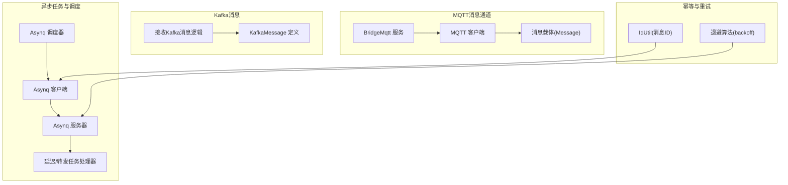
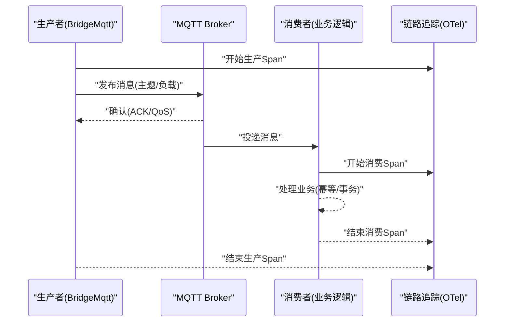
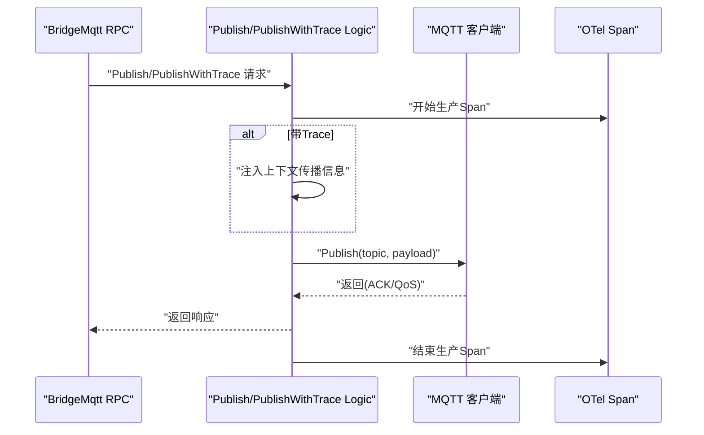
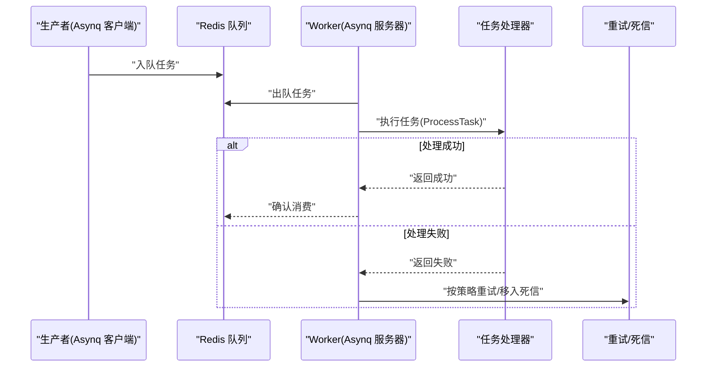
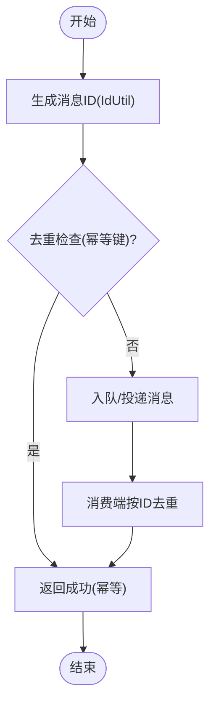
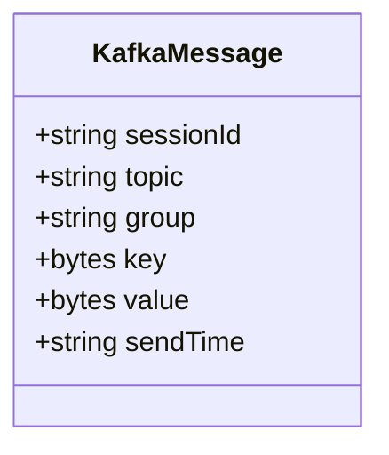
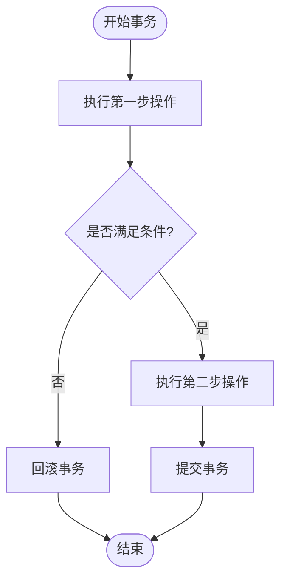
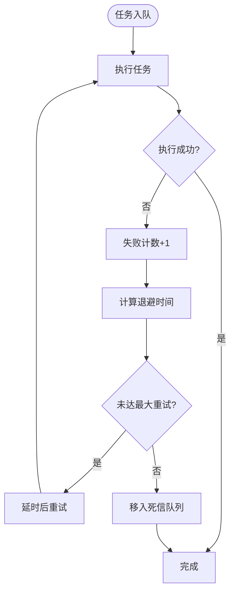
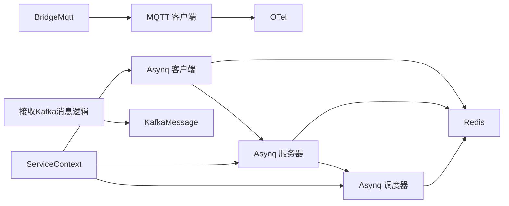

# 消息可靠性保证

<cite>
**本文引用的文件**
- [common/mqttx/mqttx.go](file://common/mqttx/mqttx.go)
- [common/mqttx/message.go](file://common/mqttx/message.go)
- [app/bridgemqtt/bridgemqtt/bridgemqtt_grpc.pb.go](file://app/bridgemqtt/bridgemqtt/bridgemqtt_grpc.pb.go)
- [app/bridgemqtt/bridgemqtt/bridgemqtt.pb.go](file://app/bridgemqtt/bridgemqtt/bridgemqtt.pb.go)
- [app/bridgemqtt/internal/logic/publishlogic.go](file://app/bridgemqtt/internal/logic/publishlogic.go)
- [app/bridgemqtt/internal/logic/publishwithtracelogic.go](file://app/bridgemqtt/internal/logic/publishwithtracelogic.go)
- [facade/streamevent/streamevent/streamevent.pb.go](file://facade/streamevent/streamevent/streamevent.pb.go)
- [facade/streamevent/streamevent/streamevent.pb.validate.go](file://facade/streamevent/streamevent/streamevent.pb.validate.go)
- [facade/streamevent/internal/logic/receivekafkamessagelogic.go](file://facade/streamevent/internal/logic/receivekafkamessagelogic.go)
- [common/asynqx/asynqClient.go](file://common/asynqx/asynqClient.go)
- [common/asynqx/asynqTaskServer.go](file://common/asynqx/asynqTaskServer.go)
- [common/asynqx/asynqSchedulerServer.go](file://common/asynqx/asynqSchedulerServer.go)
- [common/asynqx/tasktype.go](file://common/asynqx/tasktype.go)
- [common/tool/backoff.go](file://common/tool/backoff.go)
- [common/tool/idutil.go](file://common/tool/idutil.go)
- [zerorpc/internal/svc/servicecontext.go](file://zerorpc/internal/svc/servicecontext.go)
- [zerorpc/internal/task/deferdelaytask.go](file://zerorpc/internal/task/deferdelaytask.go)
- [zerorpc/internal/task/deferforwardtask.go](file://zerorpc/internal/task/deferforwardtask.go)
- [.trae/skills/zero-skills/references/database-patterns.md](file://.trae/skills/zero-skills/references/database-patterns.md)
- [model/ordertxnmodel.go](file://model/ordertxnmodel.go)
- [model/ordertxnmodel_gen.go](file://model/ordertxnmodel_gen.go)
</cite>

## 目录
1. [引言](#引言)
2. [项目结构](#项目结构)
3. [核心组件](#核心组件)
4. [架构总览](#架构总览)
5. [详细组件分析](#详细组件分析)
6. [依赖分析](#依赖分析)
7. [性能考虑](#性能考虑)
8. [故障排查指南](#故障排查指南)
9. [结论](#结论)
10. [附录](#附录)

## 引言
本文件聚焦于Zero-Service在消息可靠性方面的保障机制，围绕ACK确认（生产者/消费者/Broker）、幂等性（消息ID生成、重复检测、去重策略）、事务一致性（事务边界、提交/回滚）、重试与死信队列（重试策略、最大重试次数、死信处理）、以及监控与故障排查（指标采集、异常检测、性能分析）进行系统化梳理与可视化呈现。文档以仓库中实际代码为依据，避免臆造信息，并通过图示帮助读者快速理解各组件之间的交互关系。

## 项目结构
与消息可靠性直接相关的模块主要分布在以下区域：
- MQTT桥接与追踪：app/bridgemqtt、common/mqttx
- Kafka消息模型与接收逻辑：facade/streamevent
- 异步任务与调度：common/asynqx、zerorpc/internal/task
- 幂等与重试工具：common/tool
- 数据库事务模式参考：model、.trae/skills/zero-skills/references/database-patterns.md

图表来源
- [app/bridgemqtt/bridgemqtt/bridgemqtt_grpc.pb.go:40-76](file://app/bridgemqtt/bridgemqtt/bridgemqtt_grpc.pb.go#L40-L76)
- [common/mqttx/message.go:1-30](file://common/mqttx/message.go#L1-L30)
- [common/asynqx/asynqClient.go:17-19](file://common/asynqx/asynqClient.go#L17-L19)
- [common/asynqx/asynqTaskServer.go:39-64](file://common/asynqx/asynqTaskServer.go#L39-L64)
- [common/asynqx/asynqSchedulerServer.go:32-52](file://common/asynqx/asynqSchedulerServer.go#L32-L52)
- [facade/streamevent/streamevent/streamevent.pb.go:435-470](file://facade/streamevent/streamevent/streamevent.pb.go#L435-L470)
- [facade/streamevent/internal/logic/receivekafkamessagelogic.go:27-31](file://facade/streamevent/internal/logic/receivekafkamessagelogic.go#L27-L31)
- [common/tool/idutil.go:22-35](file://common/tool/idutil.go#L22-L35)
- [common/tool/backoff.go:9-35](file://common/tool/backoff.go#L9-L35)

章节来源
- [app/bridgemqtt/bridgemqtt/bridgemqtt_grpc.pb.go:40-76](file://app/bridgemqtt/bridgemqtt/bridgemqtt_grpc.pb.go#L40-L76)
- [common/mqttx/message.go:1-30](file://common/mqttx/message.go#L1-L30)
- [common/asynqx/asynqClient.go:17-19](file://common/asynqx/asynqClient.go#L17-L19)
- [common/asynqx/asynqTaskServer.go:39-64](file://common/asynqx/asynqTaskServer.go#L39-L64)
- [common/asynqx/asynqSchedulerServer.go:32-52](file://common/asynqx/asynqSchedulerServer.go#L32-L52)
- [facade/streamevent/streamevent/streamevent.pb.go:435-470](file://facade/streamevent/streamevent/streamevent.pb.go#L435-L470)
- [facade/streamevent/internal/logic/receivekafkamessagelogic.go:27-31](file://facade/streamevent/internal/logic/receivekafkamessagelogic.go#L27-L31)
- [common/tool/idutil.go:22-35](file://common/tool/idutil.go#L22-L35)
- [common/tool/backoff.go:9-35](file://common/tool/backoff.go#L9-L35)

## 核心组件
- MQTT消息发布与追踪
  - BridgeMqtt 提供发布与带TraceId发布的RPC接口，内部通过MQTT客户端完成消息发送；带TraceId版本会注入上下文传播信息到消息载体中，便于端到端链路追踪。
  - MQTT消息载体包含主题、负载与自定义头部，支持扩展消息属性。
- 异步任务与调度
  - Asynq 客户端用于生产任务；服务器负责消费任务并记录日志；调度器按Cron规则注册周期性任务。
  - 任务类型常量定义了延迟任务、触发任务等类型名，便于统一管理。
- Kafka消息模型与接收
  - KafkaMessage 定义了会话ID、主题、分组、键值、负载与发送时间等字段；接收逻辑作为入口，后续可接入具体业务处理。
- 幂等与重试
  - IdUtil 提供基于Redis的单调递增ID生成，结合时间戳与序号，形成全局唯一消息ID。
  - Backoff 提供指数退避与上限控制，用于延迟重试或限流。
- 事务模式参考
  - 数据库事务模式展示了单表与多表事务的写法，强调“开始事务 -> 执行多步操作 -> 成功提交 -> 失败回滚”的一致性保障思路，可借鉴到消息处理的业务侧。

章节来源
- [app/bridgemqtt/bridgemqtt/bridgemqtt_grpc.pb.go:40-76](file://app/bridgemqtt/bridgemqtt/bridgemqtt_grpc.pb.go#L40-L76)
- [app/bridgemqtt/internal/logic/publishlogic.go:27-33](file://app/bridgemqtt/internal/logic/publishlogic.go#L27-L33)
- [app/bridgemqtt/internal/logic/publishwithtracelogic.go:31-47](file://app/bridgemqtt/internal/logic/publishwithtracelogic.go#L31-L47)
- [common/mqttx/message.go:1-30](file://common/mqttx/message.go#L1-L30)
- [common/asynqx/asynqClient.go:17-19](file://common/asynqx/asynqClient.go#L17-L19)
- [common/asynqx/asynqTaskServer.go:39-64](file://common/asynqx/asynqTaskServer.go#L39-L64)
- [common/asynqx/asynqSchedulerServer.go:32-52](file://common/asynqx/asynqSchedulerServer.go#L32-L52)
- [common/asynqx/tasktype.go:1-9](file://common/asynqx/tasktype.go#L1-L9)
- [facade/streamevent/streamevent/streamevent.pb.go:435-470](file://facade/streamevent/streamevent/streamevent.pb.go#L435-L470)
- [facade/streamevent/internal/logic/receivekafkamessagelogic.go:27-31](file://facade/streamevent/internal/logic/receivekafkamessagelogic.go#L27-L31)
- [common/tool/idutil.go:22-35](file://common/tool/idutil.go#L22-L35)
- [common/tool/backoff.go:9-35](file://common/tool/backoff.go#L9-L35)
- [.trae/skills/zero-skills/references/database-patterns.md:271-365](file://.trae/skills/zero-skills/references/database-patterns.md#L271-L365)

## 架构总览
下图展示消息从生产到消费的关键路径，以及跨组件的确认与追踪机制：

图表来源
- [app/bridgemqtt/bridgemqtt/bridgemqtt_grpc.pb.go:40-76](file://app/bridgemqtt/bridgemqtt/bridgemqtt_grpc.pb.go#L40-L76)
- [common/mqttx/mqttx.go:361-388](file://common/mqttx/mqttx.go#L361-L388)
- [app/bridgemqtt/internal/logic/publishlogic.go:27-33](file://app/bridgemqtt/internal/logic/publishlogic.go#L27-L33)
- [app/bridgemqtt/internal/logic/publishwithtracelogic.go:31-47](file://app/bridgemqtt/internal/logic/publishwithtracelogic.go#L31-L47)

## 详细组件分析

### 组件A：MQTT消息发布与追踪
- 生产者确认
  - BridgeMqtt 提供发布接口，内部委托MQTT客户端完成消息发送；返回空结果表示已进入Broker投递流程。
  - 带TraceId版本将当前上下文传播信息注入消息载体，便于跨服务链路追踪。
- 消费者确认
  - MQTT客户端在消费路径上会开启消费Span，记录主题、消息ID、QoS等关键属性，便于观测与排障。
- Broker确认
  - QoS与消息ID在消费Span中被记录，有助于定位Broker侧的确认行为与消息流转。

图表来源
- [app/bridgemqtt/bridgemqtt/bridgemqtt_grpc.pb.go:40-76](file://app/bridgemqtt/bridgemqtt/bridgemqtt_grpc.pb.go#L40-L76)
- [app/bridgemqtt/internal/logic/publishlogic.go:27-33](file://app/bridgemqtt/internal/logic/publishlogic.go#L27-L33)
- [app/bridgemqtt/internal/logic/publishwithtracelogic.go:31-47](file://app/bridgemqtt/internal/logic/publishwithtracelogic.go#L31-L47)
- [common/mqttx/mqttx.go:361-388](file://common/mqttx/mqttx.go#L361-L388)

章节来源
- [app/bridgemqtt/bridgemqtt/bridgemqtt_grpc.pb.go:40-76](file://app/bridgemqtt/bridgemqtt/bridgemqtt_grpc.pb.go#L40-L76)
- [app/bridgemqtt/internal/logic/publishlogic.go:27-33](file://app/bridgemqtt/internal/logic/publishlogic.go#L27-L33)
- [app/bridgemqtt/internal/logic/publishwithtracelogic.go:31-47](file://app/bridgemqtt/internal/logic/publishwithtracelogic.go#L31-L47)
- [common/mqttx/mqttx.go:361-388](file://common/mqttx/mqttx.go#L361-L388)

### 组件B：异步任务与调度（ACK/重试/死信）
- 生产者确认
  - Asynq 客户端负责将任务入队；生产端可开启生产Span，标注任务类型，便于观测入队情况。
- 消费者确认
  - Asynq 服务器按队列优先级并发消费任务；处理器通过ResultWriter标记成功/失败，驱动框架进行重试或移入死信。
- Broker确认
  - Redis作为任务存储，任务状态变更由框架管理；调度器按Cron注册周期性任务。
- 重试与死信
  - 框架内置重试与死信队列；结合退避算法控制重试间隔，避免雪崩。
  - 任务处理器根据返回值决定是否重试或终止。

图表来源
- [common/asynqx/asynqClient.go:17-19](file://common/asynqx/asynqClient.go#L17-L19)
- [common/asynqx/asynqTaskServer.go:39-64](file://common/asynqx/asynqTaskServer.go#L39-L64)
- [common/asynqx/asynqSchedulerServer.go:32-52](file://common/asynqx/asynqSchedulerServer.go#L32-L52)
- [common/tool/backoff.go:9-35](file://common/tool/backoff.go#L9-L35)

章节来源
- [common/asynqx/asynqClient.go:17-19](file://common/asynqx/asynqClient.go#L17-L19)
- [common/asynqx/asynqTaskServer.go:39-64](file://common/asynqx/asynqTaskServer.go#L39-L64)
- [common/asynqx/asynqSchedulerServer.go:32-52](file://common/asynqx/asynqSchedulerServer.go#L32-L52)
- [common/tool/backoff.go:9-35](file://common/tool/backoff.go#L9-L35)

### 组件C：幂等性与重复检测
- 消息ID生成
  - 使用IdUtil生成全局唯一ID，格式包含前缀、年份、时间戳与序号，确保跨节点、跨进程的单调递增与唯一性。
- 重复检测与去重
  - 在业务侧，建议以消息ID作为去重键，结合Redis的SETNX或幂等表进行重复检测；若检测到重复则直接返回成功，避免重复处理。
- 与异步任务结合
  - 对于需要严格一次性的任务，可在入队时携带消息ID，消费端以消息ID为去重键，确保幂等。

图表来源
- [common/tool/idutil.go:22-35](file://common/tool/idutil.go#L22-L35)

章节来源
- [common/tool/idutil.go:22-35](file://common/tool/idutil.go#L22-L35)

### 组件D：Kafka消息模型与接收
- KafkaMessage定义
  - 包含会话ID、主题、分组、键、值、发送时间等字段，便于在不同场景下复用。
- 接收逻辑
  - 接收入口提供请求/响应结构，后续可接入具体业务处理与持久化。

图表来源
- [facade/streamevent/streamevent/streamevent.pb.go:435-470](file://facade/streamevent/streamevent/streamevent.pb.go#L435-L470)

章节来源
- [facade/streamevent/streamevent/streamevent.pb.go:435-470](file://facade/streamevent/streamevent/streamevent.pb.go#L435-L470)
- [facade/streamevent/internal/logic/receivekafkamessagelogic.go:27-31](file://facade/streamevent/internal/logic/receivekafkamessagelogic.go#L27-L31)

### 组件E：事务支持与一致性
- 单表事务
  - 示例展示了“开始事务 -> 执行更新/插入 -> 提交”的标准流程，适合单一数据源的一致性保障。
- 多表事务
  - 示例展示了订单创建涉及多表写入的事务模式，强调每一步校验与失败回滚。
- 与消息处理结合
  - 在消息消费侧，可将数据库操作纳入同一事务中，确保消息状态与业务数据一致；失败时回滚，避免半更新。

图表来源
- [.trae/skills/zero-skills/references/database-patterns.md:271-365](file://.trae/skills/zero-skills/references/database-patterns.md#L271-L365)

章节来源
- [.trae/skills/zero-skills/references/database-patterns.md:271-365](file://.trae/skills/zero-skills/references/database-patterns.md#L271-L365)
- [model/ordertxnmodel.go:1-32](file://model/ordertxnmodel.go#L1-L32)
- [model/ordertxnmodel_gen.go:241-309](file://model/ordertxnmodel_gen.go#L241-L309)

### 组件F：重试与死信队列
- 重试策略
  - 结合退避算法，对失败任务进行指数退避，超过阈值后固定上限，防止无限重试。
- 最大重试次数
  - 框架层面支持任务保留期与重试上限，超限后自动移入死信队列。
- 死信处理
  - 死信队列中的任务需人工介入或专用处理器进行兜底处理，避免丢失。

图表来源
- [common/tool/backoff.go:9-35](file://common/tool/backoff.go#L9-L35)
- [common/asynqx/asynqTaskServer.go:51-54](file://common/asynqx/asynqTaskServer.go#L51-L54)

章节来源
- [common/tool/backoff.go:9-35](file://common/tool/backoff.go#L9-L35)
- [common/asynqx/asynqTaskServer.go:51-54](file://common/asynqx/asynqTaskServer.go#L51-L54)

## 依赖分析
- 组件耦合
  - BridgeMqtt 依赖MQTT客户端与链路追踪；MQTT客户端依赖OTel进行Span管理。
  - Asynq 客户端/服务器/调度器之间通过Redis耦合；任务处理器依赖服务上下文与告警服务。
  - Kafka消息模型独立，接收逻辑作为入口，后续可接入多种下游处理。
- 外部依赖
  - Redis用于任务存储与幂等键缓存；MySQL用于业务数据持久化；OTel用于链路追踪。

图表来源
- [app/bridgemqtt/bridgemqtt/bridgemqtt_grpc.pb.go:40-76](file://app/bridgemqtt/bridgemqtt/bridgemqtt_grpc.pb.go#L40-L76)
- [common/mqttx/mqttx.go:361-388](file://common/mqttx/mqttx.go#L361-L388)
- [common/asynqx/asynqClient.go:17-19](file://common/asynqx/asynqClient.go#L17-L19)
- [common/asynqx/asynqTaskServer.go:39-64](file://common/asynqx/asynqTaskServer.go#L39-L64)
- [common/asynqx/asynqSchedulerServer.go:32-52](file://common/asynqx/asynqSchedulerServer.go#L32-L52)
- [facade/streamevent/streamevent/streamevent.pb.go:435-470](file://facade/streamevent/streamevent/streamevent.pb.go#L435-L470)
- [zerorpc/internal/svc/servicecontext.go:19-33](file://zerorpc/internal/svc/servicecontext.go#L19-L33)

章节来源
- [zerorpc/internal/svc/servicecontext.go:19-33](file://zerorpc/internal/svc/servicecontext.go#L19-L33)

## 性能考虑
- 并发与队列
  - Asynq 服务器配置了不同优先级队列与并发度，合理分配资源可提升吞吐。
- 退避与限流
  - 退避算法限制重试频率，避免对下游造成冲击；达到上限后及时转入死信，保护系统稳定性。
- 追踪与可观测
  - 生产/消费Span记录关键属性，便于定位瓶颈与异常。

## 故障排查指南
- 指标采集
  - 关注任务处理耗时、失败率、重试次数、队列长度等关键指标。
- 异常检测
  - 通过日志中间件记录任务类型与ID，结合告警服务在失败时通知。
- 性能分析
  - 利用OTel Span对比生产与消费路径的耗时差异，识别慢点。

章节来源
- [common/asynqx/asynqTaskServer.go:73-86](file://common/asynqx/asynqTaskServer.go#L73-L86)
- [zerorpc/internal/task/deferforwardtask.go:53-90](file://zerorpc/internal/task/deferforwardtask.go#L53-L90)

## 结论
Zero-Service通过MQTT链路追踪、Asynq任务框架、Kafka消息模型、幂等ID与退避重试策略，构建了覆盖生产者确认、消费者确认与Broker确认的多层次可靠性保障体系。结合数据库事务模式与可观测性实践，可在复杂场景下实现高可靠与高性能的消息处理。

## 附录
- 服务上下文整合
  - ServiceContext集中管理Redis、Asynq客户端/服务器/调度器、模型等资源，便于在业务逻辑中统一使用。

章节来源
- [zerorpc/internal/svc/servicecontext.go:19-33](file://zerorpc/internal/svc/servicecontext.go#L19-L33)