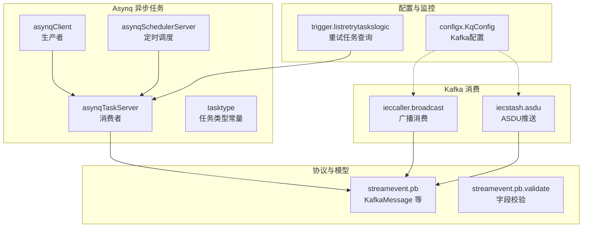
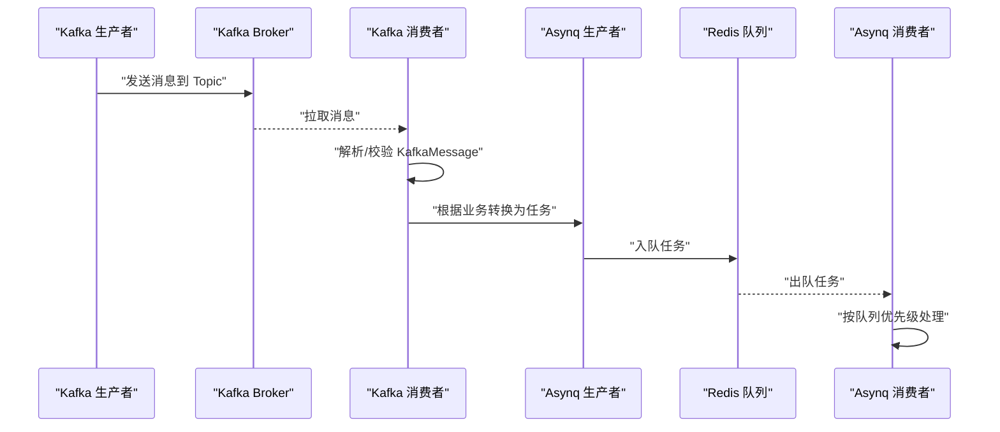
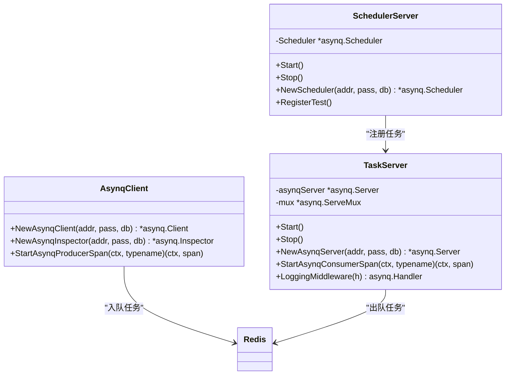
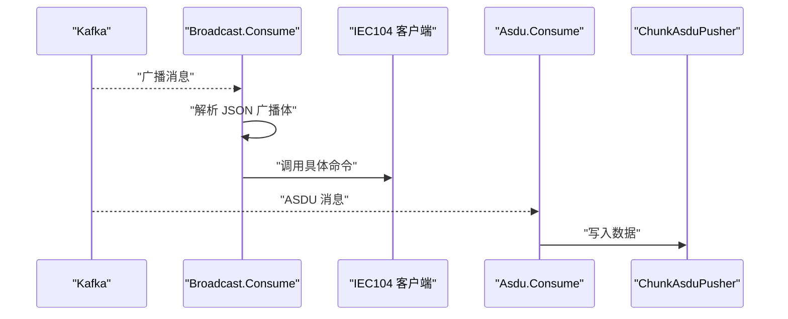
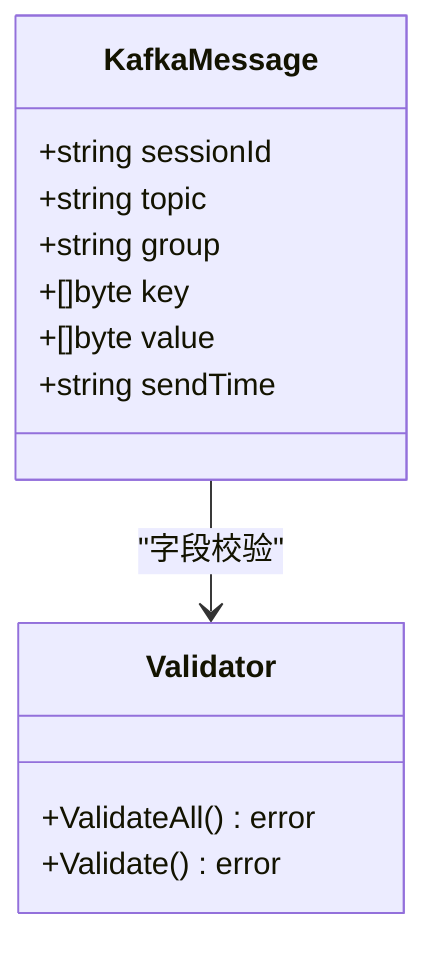
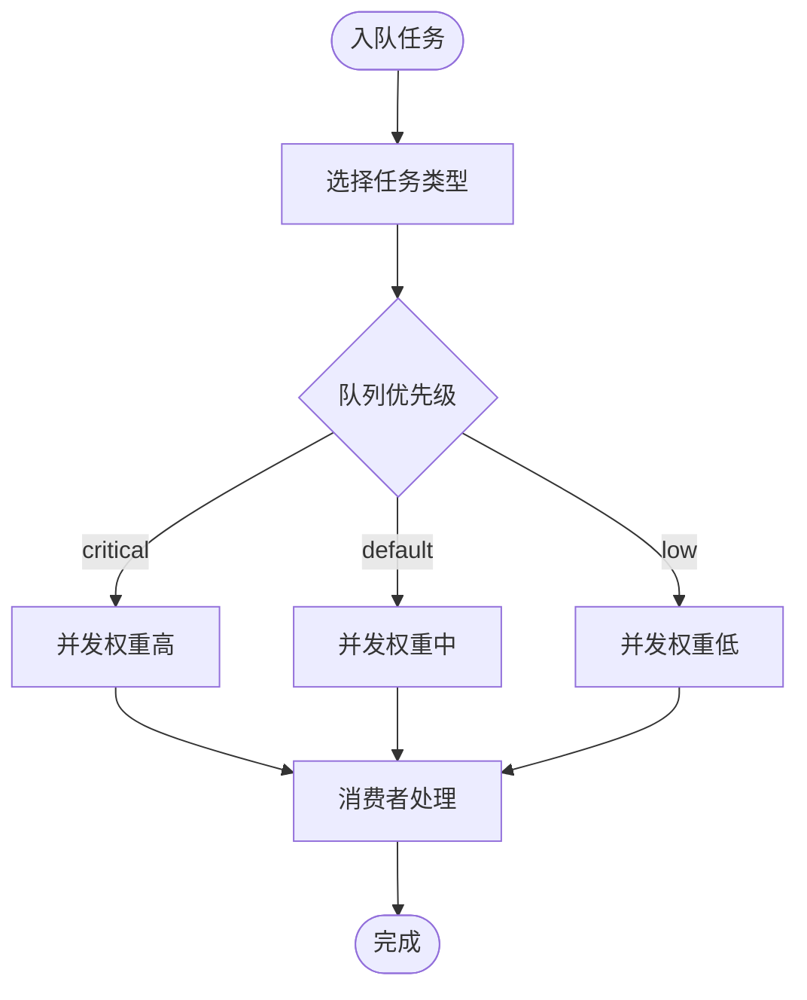
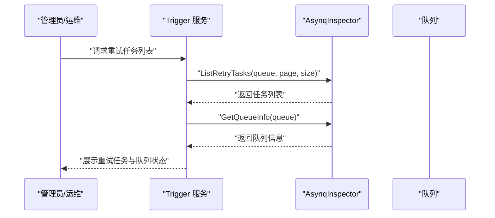
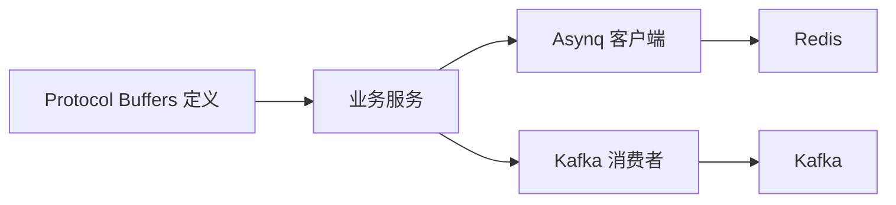

# 消息队列通信

<cite>
**本文引用的文件**
- [common/asynqx/asynqClient.go](file://common/asynqx/asynqClient.go)
- [common/asynqx/asynqTaskServer.go](file://common/asynqx/asynqTaskServer.go)
- [common/asynqx/asynqSchedulerServer.go](file://common/asynqx/asynqSchedulerServer.go)
- [common/asynqx/tasktype.go](file://common/asynqx/tasktype.go)
- [app/ieccaller/kafka/broadcast.go](file://app/ieccaller/kafka/broadcast.go)
- [app/iecstash/kafka/asdu.go](file://app/iecstash/kafka/asdu.go)
- [facade/streamevent/streamevent/streamevent.pb.go](file://facade/streamevent/streamevent/streamevent.pb.go)
- [facade/streamevent/streamevent/streamevent.pb.validate.go](file://facade/streamevent/streamevent/streamevent.pb.validate.go)
- [zerorpc/internal/svc/asynqClient.go](file://zerorpc/internal/svc/asynqClient.go)
- [zerorpc/internal/svc/asynqTaskServer.go](file://zerorpc/internal/svc/asynqTaskServer.go)
- [app/trigger/internal/logic/listretrytaskslogic.go](file://app/trigger/internal/logic/listretrytaskslogic.go)
- [common/configx/kqConfig.go](file://common/configx/kqConfig.go)
- [third_party/google/protobuf/descriptor.proto](file://third_party/google/protobuf/descriptor.proto)
</cite>

## 目录
1. [引言](#引言)
2. [项目结构](#项目结构)
3. [核心组件](#核心组件)
4. [架构总览](#架构总览)
5. [详细组件分析](#详细组件分析)
6. [依赖分析](#依赖分析)
7. [性能考虑](#性能考虑)
8. [故障排查指南](#故障排查指南)
9. [结论](#结论)
10. [附录](#附录)

## 引言
本文件面向 Zero-Service 的消息队列通信能力，系统性梳理 Kafka 与 Asynq 在微服务中的应用方式，覆盖生产者/消费者、分区/副本、任务类型与队列管理、重试与死信、序列化与反序列化、可靠性保障（ACK、幂等、去重、事务）、性能优化（批量、压缩、分区策略、消费者组）以及监控与故障排查。文档以仓库中实际实现为依据，避免臆测，帮助读者快速理解并落地消息队列实践。

## 项目结构
消息队列相关能力主要分布在以下模块：
- Asynq 异步任务：统一在 common/asynqx 下封装客户端、任务服务器与调度器，并在各业务服务中复用。
- Kafka 消费：在多个应用的 kafka 子目录下实现消费逻辑，如广播与 ASDU 数据推送。
- 协议模型：通过 Protocol Buffers 定义消息结构，用于跨服务传输与校验。
- 配置与监控：通过配置结构体与 Inspector 接口进行队列状态查询与重试任务列举。

**图表来源**
- [common/asynqx/asynqClient.go:1-31](file://common/asynqx/asynqClient.go#L1-L31)
- [common/asynqx/asynqTaskServer.go:1-87](file://common/asynqx/asynqTaskServer.go#L1-L87)
- [common/asynqx/asynqSchedulerServer.go:1-62](file://common/asynqx/asynqSchedulerServer.go#L1-L62)
- [common/asynqx/tasktype.go:1-10](file://common/asynqx/tasktype.go#L1-L10)
- [app/ieccaller/kafka/broadcast.go:1-149](file://app/ieccaller/kafka/broadcast.go#L1-L149)
- [app/iecstash/kafka/asdu.go:1-25](file://app/iecstash/kafka/asdu.go#L1-L25)
- [facade/streamevent/streamevent/streamevent.pb.go:435-470](file://facade/streamevent/streamevent/streamevent.pb.go#L435-L470)
- [facade/streamevent/streamevent/streamevent.pb.validate.go:844-892](file://facade/streamevent/streamevent/streamevent.pb.validate.go#L844-L892)
- [common/configx/kqConfig.go:1-6](file://common/configx/kqConfig.go#L1-L6)
- [app/trigger/internal/logic/listretrytaskslogic.go:1-52](file://app/trigger/internal/logic/listretrytaskslogic.go#L1-L52)

**章节来源**
- [common/asynqx/asynqClient.go:1-31](file://common/asynqx/asynqClient.go#L1-L31)
- [common/asynqx/asynqTaskServer.go:1-87](file://common/asynqx/asynqTaskServer.go#L1-L87)
- [common/asynqx/asynqSchedulerServer.go:1-62](file://common/asynqx/asynqSchedulerServer.go#L1-L62)
- [common/asynqx/tasktype.go:1-10](file://common/asynqx/tasktype.go#L1-L10)
- [app/ieccaller/kafka/broadcast.go:1-149](file://app/ieccaller/kafka/broadcast.go#L1-L149)
- [app/iecstash/kafka/asdu.go:1-25](file://app/iecstash/kafka/asdu.go#L1-L25)
- [facade/streamevent/streamevent/streamevent.pb.go:435-470](file://facade/streamevent/streamevent/streamevent.pb.go#L435-L470)
- [facade/streamevent/streamevent/streamevent.pb.validate.go:844-892](file://facade/streamevent/streamevent/streamevent.pb.validate.go#L844-L892)
- [common/configx/kqConfig.go:1-6](file://common/configx/kqConfig.go#L1-L6)
- [app/trigger/internal/logic/listretrytaskslogic.go:1-52](file://app/trigger/internal/logic/listretrytaskslogic.go#L1-L52)

## 核心组件
- Asynq 生产者：负责向 Redis 队列投递任务，支持链路追踪标注。
- Asynq 消费者：基于 ServeMux 注册任务处理器，按队列优先级并发执行。
- Asynq 调度器：基于 Cron 表达式周期性入队任务。
- Kafka 消费者：在 ieccaller 与 iecstash 中分别实现广播与 ASDU 数据的消费。
- 协议模型：使用 Protocol Buffers 定义 KafkaMessage 等消息结构，并提供字段校验。
- 配置与监控：KqConfig 提供 Kafka 连接与主题配置；Trigger 服务通过 Inspector 查询重试队列与任务信息。

**章节来源**
- [common/asynqx/asynqClient.go:1-31](file://common/asynqx/asynqClient.go#L1-L31)
- [common/asynqx/asynqTaskServer.go:1-87](file://common/asynqx/asynqTaskServer.go#L1-L87)
- [common/asynqx/asynqSchedulerServer.go:1-62](file://common/asynqx/asynqSchedulerServer.go#L1-L62)
- [app/ieccaller/kafka/broadcast.go:1-149](file://app/ieccaller/kafka/broadcast.go#L1-L149)
- [app/iecstash/kafka/asdu.go:1-25](file://app/iecstash/kafka/asdu.go#L1-L25)
- [facade/streamevent/streamevent/streamevent.pb.go:435-470](file://facade/streamevent/streamevent/streamevent.pb.go#L435-L470)
- [facade/streamevent/streamevent/streamevent.pb.validate.go:844-892](file://facade/streamevent/streamevent/streamevent.pb.validate.go#L844-L892)
- [common/configx/kqConfig.go:1-6](file://common/configx/kqConfig.go#L1-L6)
- [app/trigger/internal/logic/listretrytaskslogic.go:1-52](file://app/trigger/internal/logic/listretrytaskslogic.go#L1-L52)

## 架构总览
下图展示消息从生产到消费的关键路径，涵盖 Kafka 与 Asynq 两条主线：

**图表来源**
- [app/ieccaller/kafka/broadcast.go:24-148](file://app/ieccaller/kafka/broadcast.go#L24-L148)
- [app/iecstash/kafka/asdu.go:20-24](file://app/iecstash/kafka/asdu.go#L20-L24)
- [facade/streamevent/streamevent/streamevent.pb.go:435-470](file://facade/streamevent/streamevent/streamevent.pb.go#L435-L470)
- [common/asynqx/asynqClient.go:17-19](file://common/asynqx/asynqClient.go#L17-L19)
- [common/asynqx/asynqTaskServer.go:28-37](file://common/asynqx/asynqTaskServer.go#L28-L37)

## 详细组件分析

### Asynq 生产者与消费者
- 生产者：通过 NewAsynqClient 创建客户端，结合 StartAsynqProducerSpan 进行链路追踪标注，投递任务至 Redis。
- 消费者：NewAsynqServer 配置并发与队列优先级，LoggingMiddleware 记录处理耗时与错误；StartAsynqConsumerSpan 标注消费者端链路。
- 调度器：NewScheduler 创建定时任务，Register 注册 Cron 表达式，PostEnqueueFunc 记录入队异常。

**图表来源**
- [common/asynqx/asynqClient.go:17-30](file://common/asynqx/asynqClient.go#L17-L30)
- [common/asynqx/asynqTaskServer.go:39-86](file://common/asynqx/asynqTaskServer.go#L39-L86)
- [common/asynqx/asynqSchedulerServer.go:32-61](file://common/asynqx/asynqSchedulerServer.go#L32-L61)

**章节来源**
- [common/asynqx/asynqClient.go:1-31](file://common/asynqx/asynqClient.go#L1-L31)
- [common/asynqx/asynqTaskServer.go:1-87](file://common/asynqx/asynqTaskServer.go#L1-L87)
- [common/asynqx/asynqSchedulerServer.go:1-62](file://common/asynqx/asynqSchedulerServer.go#L1-L62)
- [zerorpc/internal/svc/asynqClient.go:1-28](file://zerorpc/internal/svc/asynqClient.go#L1-L28)
- [zerorpc/internal/svc/asynqTaskServer.go:1-75](file://zerorpc/internal/svc/asynqTaskServer.go#L1-L75)

### Kafka 消费者：广播与 ASDU
- 广播消费者：接收跨节点广播指令，解析 JSON 后分发到对应 IEC104 命令处理流程，避免自触发。
- ASDU 消费者：将收到的 ASDU 字符串写入 ChunkAsduPusher，作为后续处理的数据源。

**图表来源**
- [app/ieccaller/kafka/broadcast.go:24-148](file://app/ieccaller/kafka/broadcast.go#L24-L148)
- [app/iecstash/kafka/asdu.go:20-24](file://app/iecstash/kafka/asdu.go#L20-L24)

**章节来源**
- [app/ieccaller/kafka/broadcast.go:1-149](file://app/ieccaller/kafka/broadcast.go#L1-L149)
- [app/iecstash/kafka/asdu.go:1-25](file://app/iecstash/kafka/asdu.go#L1-L25)

### 协议模型与序列化
- KafkaMessage 结构：包含会话 ID、主题、消费者组、键、值与发送时间等字段，便于跨服务传递 Kafka 元信息。
- 字段校验：streamevent.pb.validate 提供 ValidateAll/Validate 方法，确保消息字段符合约束。
- 序列化选择：仓库中存在 Protocol Buffers 定义文件与生成代码，同时 Kafka 消费侧对 JSON 进行反序列化。建议在内部服务间优先使用 Protocol Buffers，对外或兼容场景可采用 JSON。

**图表来源**
- [facade/streamevent/streamevent/streamevent.pb.go:435-470](file://facade/streamevent/streamevent/streamevent.pb.go#L435-L470)
- [facade/streamevent/streamevent/streamevent.pb.validate.go:844-892](file://facade/streamevent/streamevent/streamevent.pb.validate.go#L844-L892)
- [third_party/google/protobuf/descriptor.proto:138-170](file://third_party/google/protobuf/descriptor.proto#L138-L170)

**章节来源**
- [facade/streamevent/streamevent/streamevent.pb.go:435-470](file://facade/streamevent/streamevent/streamevent.pb.go#L435-L470)
- [facade/streamevent/streamevent/streamevent.pb.validate.go:844-892](file://facade/streamevent/streamevent/streamevent.pb.validate.go#L844-L892)
- [third_party/google/protobuf/descriptor.proto:138-170](file://third_party/google/protobuf/descriptor.proto#L138-L170)

### 任务类型与队列管理
- 任务类型：DeferDelayTask、DeferTriggerTask、DeferTriggerProtoTask、SchedulerDeferTask 等常量定义，便于统一识别与路由。
- 队列优先级：默认 critical/default/low 三档，分别设置并发权重，满足不同任务紧急程度。
- 调度：Scheduler 支持 Cron 表达式注册周期性任务，便于定时清理、统计等后台工作。

**图表来源**
- [common/asynqx/tasktype.go:1-10](file://common/asynqx/tasktype.go#L1-L10)
- [common/asynqx/asynqTaskServer.go:56-60](file://common/asynqx/asynqTaskServer.go#L56-L60)
- [common/asynqx/asynqSchedulerServer.go:54-61](file://common/asynqx/asynqSchedulerServer.go#L54-L61)

**章节来源**
- [common/asynqx/tasktype.go:1-10](file://common/asynqx/tasktype.go#L1-L10)
- [common/asynqx/asynqTaskServer.go:1-87](file://common/asynqx/asynqTaskServer.go#L1-L87)
- [common/asynqx/asynqSchedulerServer.go:1-62](file://common/asynqx/asynqSchedulerServer.go#L1-L62)

### 重试机制与死信队列
- 重试任务查询：Trigger 服务通过 AsynqInspector.ListRetryTasks 分页列出重试队列任务，结合 GetQueueInfo 获取队列状态。
- 死信队列：Asynq 默认支持失败任务进入死信队列，可通过 Inspector 查看与处理。

**图表来源**
- [app/trigger/internal/logic/listretrytaskslogic.go:30-52](file://app/trigger/internal/logic/listretrytaskslogic.go#L30-L52)

**章节来源**
- [app/trigger/internal/logic/listretrytaskslogic.go:1-52](file://app/trigger/internal/logic/listretrytaskslogic.go#L1-L52)

## 依赖分析
- 组件耦合：Asynq 生产者/消费者与 Redis 解耦，通过统一客户端与服务器封装；Kafka 消费者与业务逻辑解耦，通过 JSON/Protocol Buffers 适配。
- 外部依赖：Asynq 使用 Redis；Kafka 消费依赖 go-zero 的 JSON 工具与日志库；Protocol Buffers 由第三方 descriptor 定义支撑。
- 可能的循环依赖：当前文件未发现直接循环导入，但需注意服务上下文与 Inspector 的注入关系。

**图表来源**
- [facade/streamevent/streamevent/streamevent.pb.go:435-470](file://facade/streamevent/streamevent/streamevent.pb.go#L435-L470)
- [common/asynqx/asynqClient.go:17-19](file://common/asynqx/asynqClient.go#L17-L19)
- [app/ieccaller/kafka/broadcast.go:24-148](file://app/ieccaller/kafka/broadcast.go#L24-L148)

**章节来源**
- [facade/streamevent/streamevent/streamevent.pb.go:435-470](file://facade/streamevent/streamevent/streamevent.pb.go#L435-L470)
- [common/asynqx/asynqClient.go:1-31](file://common/asynqx/asynqClient.go#L1-L31)
- [app/ieccaller/kafka/broadcast.go:1-149](file://app/ieccaller/kafka/broadcast.go#L1-L149)

## 性能考虑
- 批量发送：Kafka 生产端可聚合多条消息后发送，减少网络往返与系统调用开销。
- 压缩算法：启用 Snappy/LZ4/Zip 等压缩以降低带宽占用，平衡 CPU 开销。
- 分区策略：根据 Key 哈希或轮询策略分配分区，确保负载均衡与顺序性需求。
- 消费者组管理：合理设置消费者数量与再均衡策略，避免惊群与重复消费。
- Asynq 并发与队列：按 critical/default/low 设置并发权重，避免慢任务阻塞其他队列。
- 缓冲与批处理：Kafka 消费侧可引入缓冲队列，批量写入下游（如 Redis/数据库）。

[本节为通用指导，无需特定文件引用]

## 故障排查指南
- Asynq 任务失败：检查 LoggingMiddleware 输出的错误日志与耗时，定位具体任务类型与任务 ID；必要时开启更详细的追踪。
- 重试队列堆积：通过 Trigger 服务的 ListRetryTasks 与 GetQueueInfo 快速定位队列状态与任务详情，评估是否需要扩容消费者或修复上游问题。
- Kafka 消费异常：核对广播/ASDU 消费逻辑中的 JSON 解析与 IEC104 客户端连接状态；关注去重逻辑（避免自触发）。
- 协议校验失败：检查 KafkaMessage 字段是否缺失或格式不正确，确保序列化/反序列化一致。

**章节来源**
- [common/asynqx/asynqTaskServer.go:73-86](file://common/asynqx/asynqTaskServer.go#L73-L86)
- [app/trigger/internal/logic/listretrytaskslogic.go:30-52](file://app/trigger/internal/logic/listretrytaskslogic.go#L30-L52)
- [app/ieccaller/kafka/broadcast.go:24-148](file://app/ieccaller/kafka/broadcast.go#L24-L148)
- [facade/streamevent/streamevent/streamevent.pb.validate.go:844-892](file://facade/streamevent/streamevent/streamevent.pb.validate.go#L844-L892)

## 结论
Zero-Service 在消息队列方面形成了“Kafka + Asynq”的双通道架构：Kafka 负责跨节点事件与流式数据的汇聚，Asynq 负责后台任务的可靠执行与调度。通过统一的任务类型、队列优先级与监控接口，系统在可维护性与可观测性上具备良好基础。建议在生产环境中进一步完善压缩、分区策略与消费者组治理，并持续优化序列化方案与重试/死信处理流程。

## 附录
- Kafka 配置示例：Brokers 与 Topic 由 KqConfig 提供，便于集中管理。
- 任务类型清单：DeferDelayTask、DeferTriggerTask、DeferTriggerProtoTask、SchedulerDeferTask。
- 关键实现参考：
  - Asynq 客户端与服务器：[common/asynqx/asynqClient.go:1-31](file://common/asynqx/asynqClient.go#L1-L31)、[common/asynqx/asynqTaskServer.go:1-87](file://common/asynqx/asynqTaskServer.go#L1-L87)、[common/asynqx/asynqSchedulerServer.go:1-62](file://common/asynqx/asynqSchedulerServer.go#L1-L62)
  - Kafka 消费：[app/ieccaller/kafka/broadcast.go:1-149](file://app/ieccaller/kafka/broadcast.go#L1-L149)、[app/iecstash/kafka/asdu.go:1-25](file://app/iecstash/kafka/asdu.go#L1-L25)
  - 协议模型：[facade/streamevent/streamevent/streamevent.pb.go:435-470](file://facade/streamevent/streamevent/streamevent.pb.go#L435-L470)、[facade/streamevent/streamevent/streamevent.pb.validate.go:844-892](file://facade/streamevent/streamevent/streamevent.pb.validate.go#L844-L892)
  - 配置与监控：[common/configx/kqConfig.go:1-6](file://common/configx/kqConfig.go#L1-L6)、[app/trigger/internal/logic/listretrytaskslogic.go:1-52](file://app/trigger/internal/logic/listretrytaskslogic.go#L1-L52)