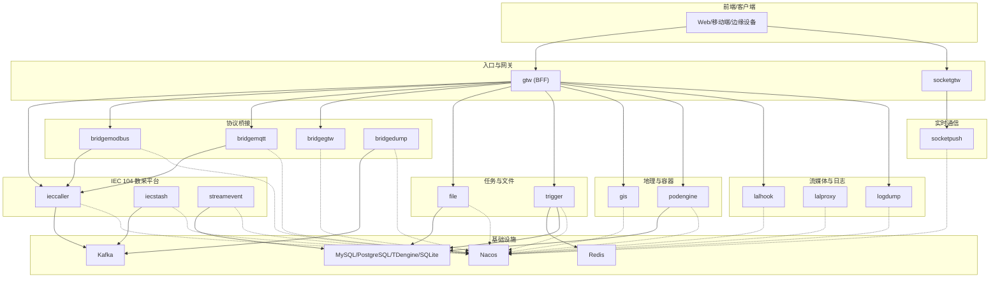
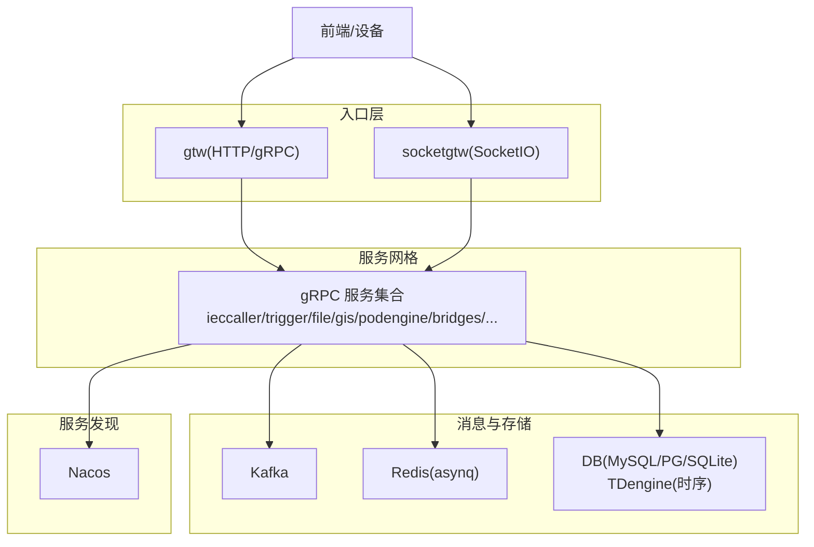
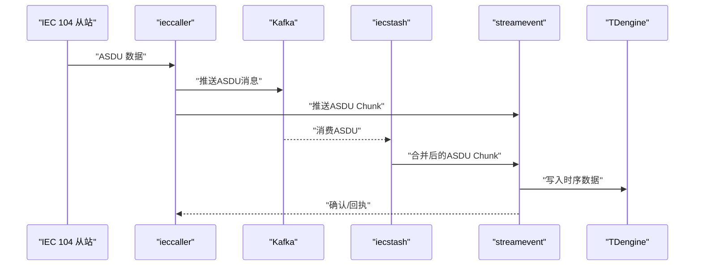
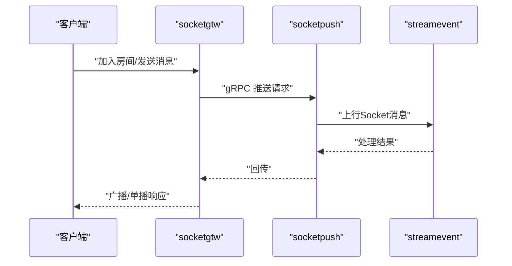
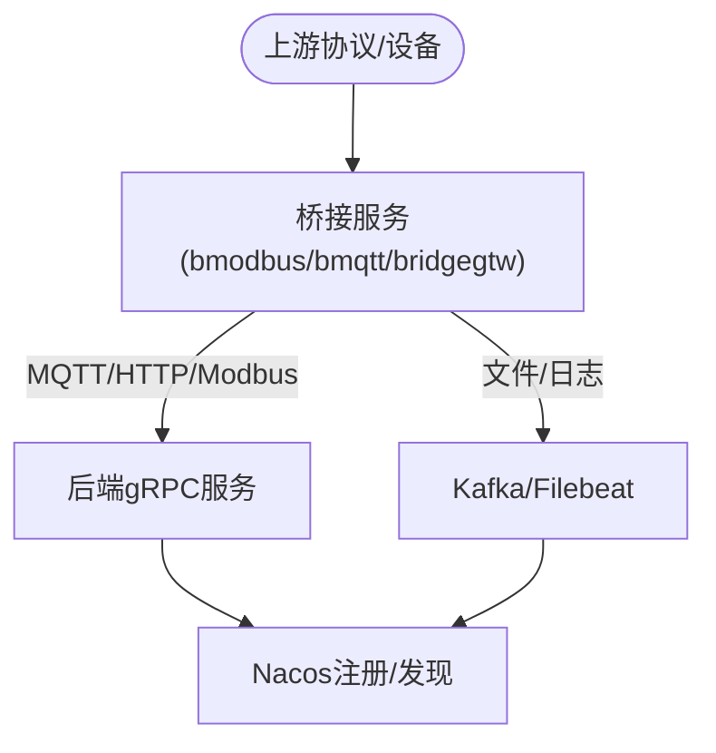
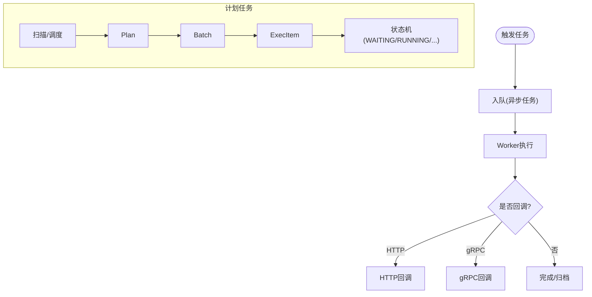
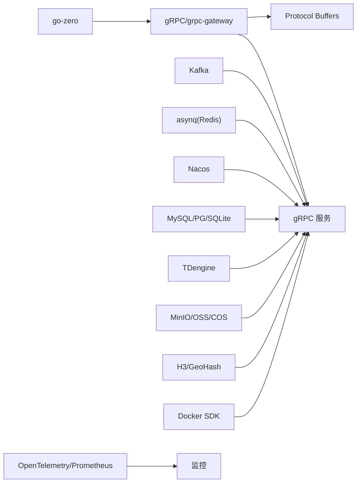

# 系统架构设计

<cite>
**本文引用的文件**
- [README.md](file://README.md)
- [go.mod](file://go.mod)
- [docker-compose.yml](file://deploy/docker-compose.yml)
- [ieccaller.proto](file://app/ieccaller/ieccaller.proto)
- [streamevent.proto](file://facade/streamevent/streamevent.proto)
- [socketgtw.proto](file://socketapp/socketgtw/socketgtw.proto)
- [types.go](file://common/iec104/types/types.go)
- [ieccaller.yaml](file://app/ieccaller/etc/ieccaller.yaml)
- [trigger.yaml](file://app/trigger/etc/trigger.yaml)
- [socketgtw.yaml](file://socketapp/socketgtw/etc/socketgtw.yaml)
- [register.go](file://common/nacosx/register.go)
- [dbx.go](file://common/dbx/dbx.go)
</cite>

## 目录
1. [简介](#简介)
2. [项目结构](#项目结构)
3. [核心组件](#核心组件)
4. [架构总览](#架构总览)
5. [详细组件分析](#详细组件分析)
6. [依赖分析](#依赖分析)
7. [性能考虑](#性能考虑)
8. [故障排查指南](#故障排查指南)
9. [结论](#结论)
10. [附录](#附录)

## 简介
本项目为面向工业物联网的微服务脚手架，围绕 IEC 60870-5-104 数采平台、异步任务调度、实时通信、协议桥接与容器管理等能力构建，提供统一的 gRPC 服务网格与 BFF 网关入口，支撑高并发、低延迟的数据采集与事件处理场景。

## 项目结构
系统采用按领域/功能划分的微服务组织方式，核心模块包括：
- IEC 104 数采平台：ieccaller、iecstash、streamevent
- 实时通信：socketgtw、socketpush
- 协议桥接：bridgemodbus、bridgemqtt、bridgegtw、bridgedump
- 基础设施：trigger（任务调度）、file（文件）、gis（地理信息）、podengine（容器）、lalhook/lalproxy（流媒体）、logdump（日志）、xfusionmock（模拟）
- 对外接口层：facade/streamevent（统一流事件协议）
- 公共组件：nacosx（服务注册/发现）、asynqx（任务队列）、dbx（多库支持）、socketiox、mqttx、ossx 等

**图表来源**
- [README.md:15-51](file://README.md#L15-L51)
- [README.md:59-108](file://README.md#L59-L108)
- [docker-compose.yml:1-110](file://deploy/docker-compose.yml#L1-L110)

**章节来源**
- [README.md:59-108](file://README.md#L59-L108)
- [docker-compose.yml:1-110](file://deploy/docker-compose.yml#L1-L110)

## 核心组件
- IEC 104 数采平台：ieccaller（主站并行通信、三协议推送）、iecstash（Kafka 消费与合并）、streamevent（统一流事件协议与 TDengine 落库）
- 实时通信：socketgtw（SocketIO 网关，房间/会话管理）、socketpush（推送入口）
- 协议桥接：bridgemodbus（Modbus TCP/RTU）、bridgemqtt（MQTT）、bridgegtw（HTTP 代理）、bridgedump（隔离装置文件生成）
- 任务与文件：trigger（asynq + Redis 异步任务 + 计划任务引擎）、file（分片流上传、OSS 集成）
- 地理与容器：gis（H3/GeoHash/围栏/坐标转换）、podengine（Docker 容器生命周期）
- 流媒体与日志：lalhook/lalproxy（流媒体回调/代理）、logdump（日志导出）
- 公共能力：nacosx（服务注册/发现）、dbx（多数据库适配）

**章节来源**
- [README.md:112-188](file://README.md#L112-L188)

## 架构总览
系统采用微服务架构，以 go-zero 为基础，统一通过 gRPC 提供高性能 RPC 能力，并结合 grpc-gateway 提供 HTTP 访问；实时通信采用 SocketIO；数据流以 Kafka 作为高吞吐缓冲，IEC 104 数据经 ieccaller -> Kafka -> iecstash -> streamevent -> TDengine 的链路落地；其他协议（MQTT/WebSocket）通过 facade/streamevent 聚合。

**图表来源**
- [README.md:15-51](file://README.md#L15-L51)
- [README.md:207-225](file://README.md#L207-L225)
- [docker-compose.yml:1-110](file://deploy/docker-compose.yml#L1-L110)

## 详细组件分析

### IEC 104 数采平台
- ieccaller：支持多从站并行通信、定时总召唤/累积量召唤、Kafka/MQTT/gRPC 三协议推送、点位映射与缓存管理、弱校验模式。
- iecstash：Kafka 消费、ASDU 压缩合并、Chunk 批量处理、下游 RPC 转发。
- streamevent：统一流事件协议，接收 MQTT/WS/Kafka/IEC104 Chunk，进行点位配置管理与 TDengine 落库。

**图表来源**
- [README.md:122-127](file://README.md#L122-L127)
- [ieccaller.proto:9-30](file://app/ieccaller/ieccaller.proto#L9-L30)
- [streamevent.proto:10-25](file://facade/streamevent/streamevent.proto#L10-L25)

**章节来源**
- [README.md:112-131](file://README.md#L112-L131)
- [ieccaller.yaml:21-79](file://app/ieccaller/etc/ieccaller.yaml#L21-L79)
- [types.go:17-40](file://common/iec104/types/types.go#L17-L40)

### 实时通信（SocketIO）
- socketgtw：房间/会话管理、消息路由、鉴权、统计信息、MQTT 桥接。
- socketpush：Token 生成/验证、gRPC 推送接口、后端服务调用入口。

**图表来源**
- [socketgtw.proto:9-32](file://socketapp/socketgtw/socketgtw.proto#L9-L32)
- [streamevent.proto:19-24](file://facade/streamevent/streamevent.proto#L19-L24)
- [socketgtw.yaml:13-37](file://socketapp/socketgtw/etc/socketgtw.yaml#L13-L37)

**章节来源**
- [README.md:156-173](file://README.md#L156-L173)
- [socketgtw.yaml:13-37](file://socketapp/socketgtw/etc/socketgtw.yaml#L13-L37)

### 协议桥接与网关
- bridgemodbus：Modbus TCP/RTU 读写、设备配置管理、gRPC 集成。
- bridgemqtt：MQTT 发布/订阅、带追踪的推送、gRPC 集成。
- bridgegtw：HTTP 代理转发、多后端负载均衡、请求路由。
- bridgedump：南瑞隔离装置文件生成、Filebeat 集成、Kafka 分类发送。

**图表来源**
- [README.md:174-188](file://README.md#L174-L188)

**章节来源**
- [README.md:174-188](file://README.md#L174-L188)

### 任务调度与计划引擎（trigger）
- 异步任务：基于 asynq + Redis，支持定时/延时任务、HTTP/gRPC 回调、自动重试与生命周期管理。
- 计划任务：数据库扫描的计划任务引擎，Plan/Batch/ExecItem 三级模型，状态机与分布式锁。

**图表来源**
- [README.md:133-154](file://README.md#L133-L154)
- [trigger.yaml:19-37](file://app/trigger/etc/trigger.yaml#L19-L37)

**章节来源**
- [README.md:133-154](file://README.md#L133-L154)
- [trigger.yaml:19-37](file://app/trigger/etc/trigger.yaml#L19-L37)

### 文件与地理信息
- file：gRPC 分片流上传、OSS 集成（MinIO/阿里/腾讯）、视频流捕获。
- gis：H3/GeoHash 编解码、电子围栏、坐标转换（WGS84/GCJ02/BD09）。

**章节来源**
- [README.md:176-181](file://README.md#L176-L181)

### 容器与流媒体
- podengine：Docker 容器 CRUD、Pod 抽象、资源统计、镜像管理。
- lalhook/lalproxy：TS 录制回调、推拉流事件、分片播放。

**章节来源**
- [README.md:181-187](file://README.md#L181-L187)

## 依赖分析
- 微服务框架：go-zero
- RPC：gRPC + grpc-gateway + Protocol Buffers
- 消息队列：Kafka（go-queue）
- 任务队列：asynq + Redis
- 实时通信：SocketIO（fork）
- 工业协议：IEC 60870-5-104（go-iecp5）、Modbus（grid-x/modbus）、MQTT（paho.mqtt）
- 关系数据库：MySQL / PostgreSQL / SQLite
- 时序数据库：TDengine
- 对象存储：MinIO / 阿里 OSS / 腾讯 COS
- 服务发现：Nacos
- 地理计算：H3（uber/h3-go）、GeoHash、orb、go-geom
- 容器管理：Docker SDK
- 监控追踪：OpenTelemetry / Prometheus
- 容器编排：Docker Compose / Kubernetes（可选）

**图表来源**
- [README.md:207-225](file://README.md#L207-L225)
- [go.mod:5-62](file://go.mod#L5-L62)

**章节来源**
- [README.md:207-225](file://README.md#L207-L225)
- [go.mod:5-62](file://go.mod#L5-L62)

## 性能考虑
- 并发与吞吐
  - IEC 104 主站支持多从站并行通信与高并发任务（TaskConcurrency），结合 Kafka 批量推送与压缩合并，降低网络与存储压力。
  - streamevent 使用 Chunk 批量写入，减少频繁 IO。
- 低延迟
  - SocketIO 网关与推送服务分离，避免长连接阻塞 RPC 调用；MQTT 桥接与房间广播优化消息路由。
- 可扩展性
  - 服务注册与发现（Nacos）支持水平扩展；Kafka/Redis 集群化部署；gRPC 服务横向扩容。
- 存储与索引
  - TDengine 时序数据库适合高频写入与高效查询；GIS/H3 网格加速空间检索。
- 资源隔离
  - Docker 容器抽象与资源统计，便于弹性伸缩与资源治理。

[本节为通用性能建议，不直接分析具体文件]

## 故障排查指南
- 服务注册与发现
  - 使用 Nacos 注册/注销实例，确保服务健康状态与元数据正确。
  - 参考：[register.go:21-76](file://common/nacosx/register.go#L21-L76)
- 数据库连接与方言
  - dbx 自动识别 SQLite/TAOS/MySQL/PostgreSQL 并创建连接，注意数据源 URL 格式。
  - 参考：[dbx.go:31-64](file://common/dbx/dbx.go#L31-L64)
- IEC 104 配置与日志
  - ieccaller 配置包含 IEC 从站列表、定时任务、Kafka/MQTT 推送 Topic、Chunk 大小等。
  - 参考：[ieccaller.yaml:21-79](file://app/ieccaller/etc/ieccaller.yaml#L21-L79)
- 任务队列与回调
  - trigger 使用 Redis 作为队列存储，支持 HTTP/gRPC 回调；检查 Redis 连接与数据库扫描。
  - 参考：[trigger.yaml:19-37](file://app/trigger/etc/trigger.yaml#L19-L37)
- SocketIO 会话与统计
  - socketgtw 提供统计接口与会话管理，关注房间广播与踢人操作。
  - 参考：[socketgtw.yaml:13-37](file://socketapp/socketgtw/etc/socketgtw.yaml#L13-L37)

**章节来源**
- [register.go:21-76](file://common/nacosx/register.go#L21-L76)
- [dbx.go:31-64](file://common/dbx/dbx.go#L31-L64)
- [ieccaller.yaml:21-79](file://app/ieccaller/etc/ieccaller.yaml#L21-L79)
- [trigger.yaml:19-37](file://app/trigger/etc/trigger.yaml#L19-L37)
- [socketgtw.yaml:13-37](file://socketapp/socketgtw/etc/socketgtw.yaml#L13-L37)

## 结论
本系统以 go-zero 为核心，构建了覆盖工业协议接入、实时通信、任务调度与数据落库的完整微服务体系。通过 gRPC 服务网格、Nacos 服务发现、Kafka/Redis/DB/TDengine 等基础设施，实现了高并发、可扩展、可观测的工业物联网平台。IEC 104 数采平台、SocketIO 实时通信与协议桥接模块共同构成系统的核心能力，满足从设备数据采集到业务应用的全链路需求。

[本节为总结性内容，不直接分析具体文件]

## 附录
- 部署与编排
  - Docker Compose 默认包含 Kafka、Filebeat、ieccaller、bridgegtw、bridgedump 等核心服务。
  - 参考：[docker-compose.yml:1-110](file://deploy/docker-compose.yml#L1-L110)
- API 与协议
  - 各服务 Proto 文件即 API 定义，Swagger 文档位于 swagger 目录。
  - 参考：[README.md:288-298](file://README.md#L288-L298)

**章节来源**
- [docker-compose.yml:1-110](file://deploy/docker-compose.yml#L1-L110)
- [README.md:288-298](file://README.md#L288-L298)