# AI网关服务

<cite>
**本文档引用的文件**
- [aigtw.go](file://aiapp/aigtw/aigtw.go)
- [aigtw.yaml](file://aiapp/aigtw/etc/aigtw.yaml)
- [aigtw.api](file://aiapp/aigtw/aigtw.api)
- [config.go](file://aiapp/aigtw/internal/config/config.go)
- [servicecontext.go](file://aiapp/aigtw/internal/svc/servicecontext.go)
- [routes.go](file://aiapp/aigtw/internal/handler/routes.go)
- [chatcompletionshandler.go](file://aiapp/aigtw/internal/handler/pass/chatcompletionshandler.go)
- [listmodelshandler.go](file://aiapp/aigtw/internal/handler/pass/listmodelshandler.go)
- [asyncToolCallHandler.go](file://aiapp/aigtw/internal/handler/pass/asyncToolCallHandler.go)
- [asynctoolresulthandler.go](file://aiapp/aigtw/internal/handler/pass/asynctoolresulthandler.go)
- [asyncresultstatshandler.go](file://aiapp/aigtw/internal/handler/pass/asyncresultstatshandler.go)
- [listasyncresultshandler.go](file://aiapp/aigtw/internal/handler/pass/listasyncresultshandler.go)
- [asyncToolCallLogic.go](file://aiapp/aigtw/internal/logic/pass/asyncToolCallLogic.go)
- [asynctoolresultlogic.go](file://aiapp/aigtw/internal/logic/pass/asynctoolresultlogic.go)
- [asyncresultstatslogic.go](file://aiapp/aigtw/internal/logic/pass/asyncresultstatslogic.go)
- [listasyncresultslogic.go](file://aiapp/aigtw/internal/logic/pass/listasyncresultslogic.go)
- [listasyncresultslogic.go](file://aiapp/aigtw/internal/logic/pass/listasyncresultslogic.go)
- [chatcompletionstreamlogic.go](file://aiapp/aichat/internal/logic/chatcompletionstreamlogic.go)
- [chatcompletionlogic.go](file://aiapp/aichat/internal/logic/chatcompletionlogic.go)
- [asynctoolcalllogic.go](file://aiapp/aichat/internal/logic/asynctoolcalllogic.go)
- [asynctoolresultlogic.go](file://aiapp/aichat/internal/logic/asynctoolresultlogic.go)
- [asyncresultstatslogic.go](file://aiapp/aichat/internal/logic/asyncresultstatslogic.go)
- [listasyncresultlogic.go](file://aiapp/aichat/internal/logic/listasyncresultlogic.go)
- [listmodelslogic.go](file://aiapp/aichat/internal/logic/listmodelslogic.go)
- [openai.go](file://aiapp/aichat/internal/provider/openai.go)
- [provider.go](file://aiapp/aichat/internal/provider/provider.go)
- [registry.go](file://aiapp/aichat/internal/provider/registry.go)
- [types.go](file://aiapp/aichat/internal/types/types.go)
- [aichat.pb.go](file://aiapp/aichat/aichat/aichat.pb.go)
- [types.go](file://aiapp/aigtw/internal/types/types.go)
- [openai_error.go](file://common/gtwx/openai_error.go)
- [chat.html](file://aiapp/aigtw/chat.html)
- [tool.html](file://aiapp/aigtw/tool.html)
- [aichat.go](file://aiapp/aichat/aichat.go)
- [aichat.yaml](file://aiapp/aichat/etc/aichat.yaml)
- [testprogress.go](file://aiapp/mcpserver/internal/tools/testprogress.go)
- [registry.go](file://aiapp/mcpserver/internal/tools/registry.go)
- [async_result.go](file://common/mcpx/async_result.go)
- [ssestreamlogic.go](file://aiapp/ssegtw/internal/logic/sse/ssestreamlogic.go)
- [ctxData.go](file://common/ctxdata/ctxData.go)
- [metadataInterceptor.go](file://common/Interceptor/rpcclient/metadataInterceptor.go)
- [tool.go](file://common/tool/tool.go)
- [writer.go](file://common/ssex/writer.go)
- [base.api](file://aiapp/aigtw/doc/base.api)
- [aigtw.api](file://aiapp/aigtw/doc/aigtw.api)
- [openai.api](file://aiapp/aigtw/doc/types/openai.api)
- [tool.api](file://aiapp/aigtw/doc/types/tool.api)
- [memory_handler.go](file://common/mcpx/memory_handler.go)
- [client.go](file://common/mcpx/client.go)
</cite>

## 更新摘要
**所做更改**
- 移除了工具进度更新的节流机制，允许即时渲染进度更新
- 改进了MCP异步工具调用界面的用户体验
- 优化了消息去重机制，避免重复消息的显示
- 增强了进度消息的实时性处理能力

## 目录
1. [简介](#简介)
2. [项目结构](#项目结构)
3. [核心组件](#核心组件)
4. [架构概览](#架构概览)
5. [详细组件分析](#详细组件分析)
6. [Streamable HTTP传输协议](#streamable-http传输协议)
7. [JWT令牌管理界面](#jwt令牌管理界面)
8. [前端JavaScript流式传输增强](#前端javascript流式传输增强)
9. [MCP异步工具调用界面样式优化](#mcp异步工具调用界面样式优化)
10. [异步工具调用系统](#异步工具调用系统)
11. [进度消息处理机制](#进度消息处理机制)
12. [异步结果统计系统](#异步结果统计系统)
13. [分页查询异步结果系统](#分页查询异步结果系统)
14. [MCP集成增强](#mcp集成增强)
15. [API规范文件](#api规范文件)
16. [类型定义结构改进](#类型定义结构改进)
17. [文档结构重组](#文档结构重组)
18. [依赖关系分析](#依赖关系分析)
19. [性能考虑](#性能考虑)
20. [故障排除指南](#故障排除指南)
21. [结论](#结论)

## 简介

AI网关服务是一个基于GoZero框架构建的OpenAI兼容AI服务网关。该系统提供了统一的REST API接口，将客户端请求转发到后端的AI聊天服务，并支持流式SSE响应和非流式同步响应。

**最新更新** 移除了工具进度更新的节流机制，允许即时渲染进度更新，显著改善了MCP异步工具调用的用户体验。系统现已支持测试进度通知工具，能够模拟长时间运行的任务并发送实时进度更新。**新增异步结果统计系统，提供任务执行状态的全局统计信息；新增分页查询异步结果列表系统，支持按状态、时间范围过滤和多字段排序功能；新增模块化的API规范文件，采用独立的文档结构；改进类型定义结构，分离OpenAI兼容类型和工具调用类型**。

该服务的主要特点包括：
- OpenAI兼容的API接口设计
- 支持流式和非流式两种响应模式
- 多模型提供商支持（智谱、通义千问等）
- 统一的错误处理机制
- 前端聊天界面集成
- 增强的SSE流式错误处理和内存安全机制
- Streamable HTTP传输协议支持
- JWT令牌管理界面增强
- 前端JavaScript流式传输自动头部管理
- **完整的异步工具调用系统**
- **ProgressMessage结构支持**
- **MCP集成增强**
- **测试进度通知工具**
- **异步结果统计系统**
- **分页查询异步结果列表系统**
- **模块化API规范文件**
- **改进的类型定义结构**
- **即时进度渲染机制**

## 项目结构

AI网关服务采用模块化的项目结构，主要包含以下核心目录：

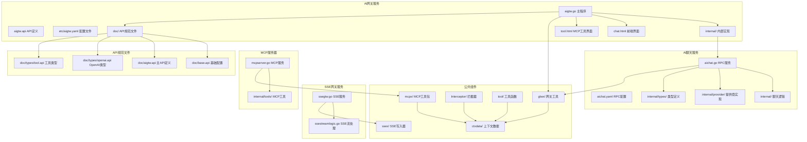

**图表来源**
- [aigtw.go:1-92](file://aiapp/aigtw/aigtw.go#L1-L92)
- [aichat.go:1-47](file://aiapp/aichat/aichat.go#L1-L47)
- [ssestreamlogic.go:1-117](file://aiapp/ssegtw/internal/logic/sse/ssestreamlogic.go#L1-L117)
- [mcpserver.go:1-50](file://aiapp/mcpserver/mcpserver.go#L1-L50)
- [aigtw.api:1-79](file://aiapp/aigtw/doc/aigtw.api#L1-L79)

**章节来源**
- [aigtw.go:1-92](file://aiapp/aigtw/aigtw.go#L1-L92)
- [aichat.go:1-47](file://aiapp/aichat/aichat.go#L1-L47)
- [ssestreamlogic.go:1-117](file://aiapp/ssegtw/internal/logic/sse/ssestreamlogic.go#L1-L117)

## 核心组件

### 1. 网关服务主程序

网关服务的入口点负责初始化REST服务器、加载配置和注册路由处理器。

**更新** 新增异步结果统计和分页查询路由注册，支持/async/tool/stats和/async/tool/results路径的异步任务统计和查询处理

**章节来源**
- [aigtw.go:31-92](file://aiapp/aigtw/aigtw.go#L31-L92)

### 2. 配置管理系统

网关服务使用GoZero的配置系统，支持YAML格式的配置文件管理。

**更新** 配置文件新增JwtAuth部分，包含AccessSecret密钥配置

**章节来源**
- [aigtw.yaml:1-25](file://aiapp/aigtw/etc/aigtw.yaml#L1-L25)
- [config.go:20-27](file://aiapp/aigtw/internal/config/config.go#L20-L27)

### 3. API接口定义

使用Goctl的API DSL定义了完整的REST接口规范，包括模型列表查询和对话补全功能。

**更新** API组已从'ai'重命名为'pass'，URL前缀已从'/aigtw/v1'更新为'/ai/v1'，新增SSE流式接口配置，新增异步工具调用接口，**新增异步结果统计接口和分页查询异步结果接口，完善异步工具调用系统的完整API套件；新增模块化的API规范文件，采用独立的文档结构**，**改进类型定义结构，分离OpenAI兼容类型和工具调用类型**

**章节来源**
- [aigtw.api:1-79](file://aiapp/aigtw/doc/aigtw.api#L1-L79)

### 4. 服务上下文管理

封装了RPC客户端连接和拦截器配置，提供统一的服务访问接口。

**更新** 服务上下文新增Streamable HTTP传输协议支持，配置流式和非流式拦截器

**章节来源**
- [servicecontext.go:12-26](file://aiapp/aigtw/internal/svc/servicecontext.go#L12-L26)

### 5. SSE流式处理组件

新增的SSE网关服务，专门处理流式事件传输，支持心跳保持和内存安全机制。

**更新** 增强SSE事件流处理，支持连接成功事件、通知事件和完成信号

**章节来源**
- [ssestreamlogic.go:39-117](file://aiapp/ssegtw/internal/logic/sse/ssestreamlogic.go#L39-L117)

### 6. 异步工具调用组件

新增的异步工具调用系统，支持长时间运行任务的进度跟踪和结果查询。

**更新** 新增AsyncToolCall和AsyncToolResult接口，支持任务ID管理和进度消息传输，**新增异步结果统计和分页查询组件，提供完整的异步任务管理API**

**章节来源**
- [asyncToolCallLogic.go:1-49](file://aiapp/aigtw/internal/logic/pass/asyncToolCallLogic.go#L1-L49)
- [asynctoolresultlogic.go:1-62](file://aiapp/aigtw/internal/logic/pass/asynctoolresultlogic.go#L1-L62)
- [asyncresultstatslogic.go:1-35](file://aiapp/aigtw/internal/logic/pass/asyncresultstatslogic.go#L1-L35)
- [listasyncresultslogic.go:1-72](file://aiapp/aigtw/internal/logic/pass/listasyncresultslogic.go#L1-L72)

## 架构概览

AI网关服务采用分层架构设计，实现了清晰的职责分离：

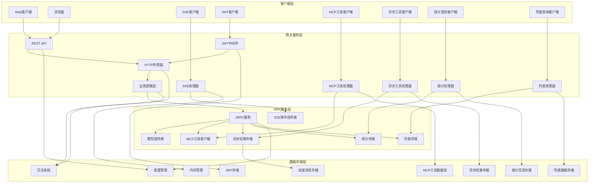

**图表来源**
- [aigtw.go:47-57](file://aiapp/aigtw/aigtw.go#L47-L57)
- [servicecontext.go:17-25](file://aiapp/aigtw/internal/svc/servicecontext.go#L17-L25)
- [ssestreamlogic.go:39-117](file://aiapp/ssegtw/internal/logic/sse/ssestreamlogic.go#L39-L117)

## 详细组件分析

### 网关服务架构

#### 1. REST服务器配置

网关服务使用GoZero的REST框架，支持CORS配置和OpenAI风格的错误处理。

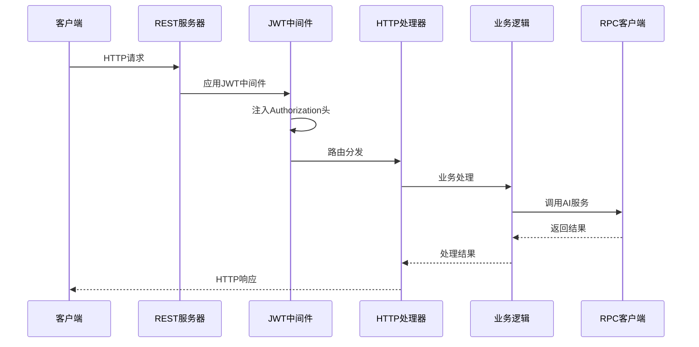

**图表来源**
- [aigtw.go:31-92](file://aiapp/aigtw/aigtw.go#L31-L92)
- [routes.go:16-75](file://aiapp/aigtw/internal/handler/routes.go#L16-L75)

#### 2. 路由注册机制

系统通过动态路由注册实现灵活的API管理，支持不同的HTTP方法和路径映射。

**更新** 路由已更新为使用新的包结构'pass'和URL前缀'/ai/v1'，新增JWT认证支持，新增异步工具调用路由，**新增异步结果统计和分页查询路由**

**章节来源**
- [routes.go:16-75](file://aiapp/aigtw/internal/handler/routes.go#L16-L75)

### AI聊天服务

#### 1. RPC服务器架构

AI聊天服务作为后端RPC服务，提供统一的AI模型调用接口。

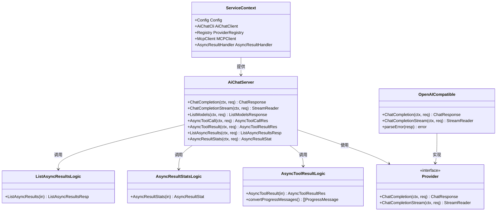

**图表来源**
- [aichat.go:33-34](file://aiapp/aichat/aichat.go#L33-L34)
- [provider.go:5-19](file://aiapp/aichat/internal/provider/provider.go#L5-L19)
- [openai.go:16-144](file://aiapp/aichat/internal/provider/openai.go#L16-L144)
- [asynctoolresultlogic.go:24-56](file://aiapp/aichat/internal/logic/asynctoolresultlogic.go#L24-L56)
- [asyncresultstatslogic.go:24-44](file://aiapp/aichat/internal/logic/asyncresultstatslogic.go#L24-L44)
- [listasyncresultlogic.go:25-79](file://aiapp/aichat/internal/logic/listasyncresultlogic.go#L25-L79)

#### 2. 流式处理优化

新增的流式处理逻辑，支持超时控制和内存安全机制。

**更新** 增强流式处理的超时控制，支持总超时和空闲超时双重保护

**章节来源**
- [chatcompletionstreamlogic.go:34-185](file://aiapp/aichat/internal/logic/chatcompletionstreamlogic.go#L34-L185)

#### 3. 错误解析机制

增强的错误解析机制，限制响应体读取大小防止内存攻击。

**章节来源**
- [openai.go:152-204](file://aiapp/aichat/internal/provider/openai.go#L152-L204)

### SSE网关服务

#### 1. SSE事件流处理

专门的SSE网关服务，处理实时事件流传输。

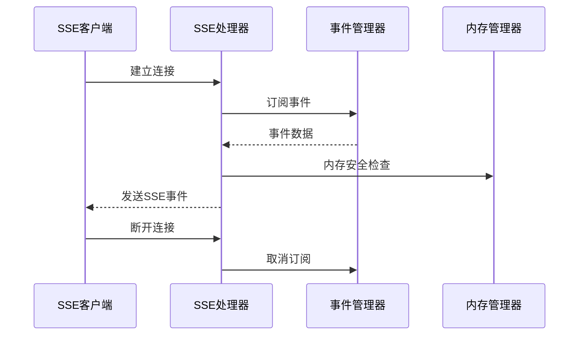

**图表来源**
- [ssestreamlogic.go:39-117](file://aiapp/ssegtw/internal/logic/sse/ssestreamlogic.go#L39-L117)

#### 2. 内存安全机制

SSE处理器内置内存管理，防止内存泄漏和过度占用。

**章节来源**
- [ssestreamlogic.go:39-117](file://aiapp/ssegtw/internal/logic/sse/ssestreamlogic.go#L39-L117)

### 数据类型定义

#### 1. 请求响应模型

系统定义了完整的OpenAI兼容的数据模型，支持流式和非流式的响应格式。

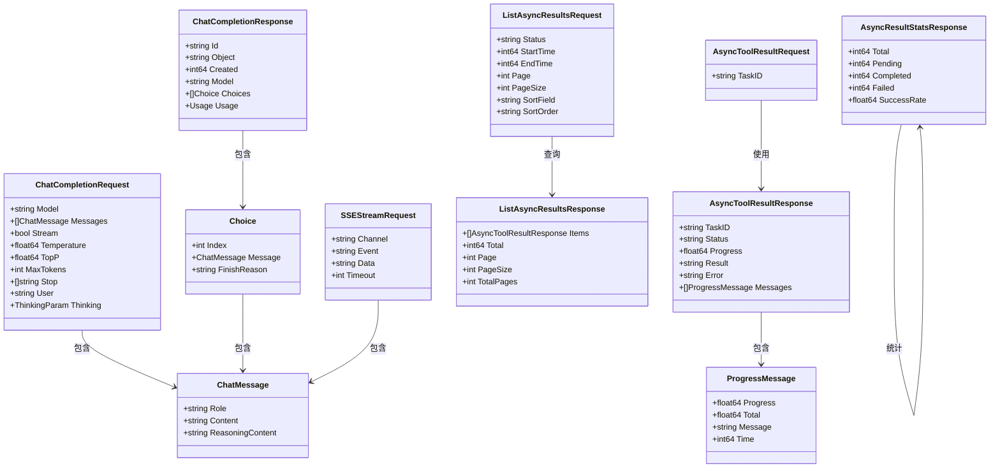

**图表来源**
- [types.go:14-51](file://aiapp/aichat/internal/types/types.go#L14-L51)
- [types.go:26-51](file://aiapp/aichat/internal/types/types.go#L26-L51)
- [types.go:17-28](file://aiapp/aigtw/internal/types/types.go#L17-L28)
- [types.go:102-107](file://aiapp/aigtw/internal/types/types.go#L102-L107)
- [types.go:6-12](file://aiapp/aigtw/internal/types/types.go#L6-L12)
- [types.go:91-107](file://aiapp/aigtw/internal/types/types.go#L91-L107)
- [aichat.pb.go:1120-1133](file://aiapp/aichat/aichat/aichat.pb.go#L1120-L1133)

**章节来源**
- [types.go:1-161](file://aiapp/aigtw/internal/types/types.go#L1-L161)
- [types.go:1-144](file://aiapp/aichat/internal/types/types.go#L1-L144)

### 错误处理机制

#### 1. OpenAI兼容错误格式

系统实现了OpenAI风格的错误响应格式，确保与OpenAI API的兼容性。


**图表来源**
- [openai_error.go:74-102](file://common/gtwx/openai_error.go#L74-L102)
- [openai.go:152-204](file://aiapp/aichat/internal/provider/openai.go#L152-L204)

#### 2. SSE流式错误处理

新增的SSE流式错误处理机制，防止JSON错误响应混入SSE协议流。

**章节来源**
- [openai_error.go:14-151](file://common/gtwx/openai_error.go#L14-L151)
- [openai.go:152-204](file://aiapp/aichat/internal/provider/openai.go#L152-L204)

## Streamable HTTP传输协议

### 协议概述

Streamable HTTP传输协议是AI网关服务新增的核心特性，实现了高效的流式事件传输机制。

### 协议特性

```mermaid
graph TB
subgraph "Streamable HTTP协议"
A[HTTP连接建立]
B[事件订阅]
C[流式数据传输]
D[心跳保活]
E[连接管理]
end
subgraph "SSE协议支持"
F[事件: data]
G[数据: data]
H[注释: :]
I[完成: [DONE]]
end
A --> B
B --> C
C --> D
D --> E
C --> F
C --> G
C --> H
C --> I
```

**图表来源**
- [writer.go:9-79](file://common/ssex/writer.go#L9-L79)
- [ssestreamlogic.go:39-117](file://aiapp/ssegtw/internal/logic/sse/ssestreamlogic.go#L39-L117)

### 协议实现

#### 1. SSE写入器

SSE写入器封装了标准的SSE协议格式，支持事件名、数据和注释的写入。

**更新** 新增WriteJSON方法，支持OpenAI SSE标准格式的JSON序列化

**章节来源**
- [writer.go:9-79](file://common/ssex/writer.go#L9-L79)

#### 2. 事件流处理

SSE处理器实现了完整的事件流生命周期管理，包括连接建立、事件订阅、数据传输和连接清理。

**章节来源**
- [ssestreamlogic.go:39-117](file://aiapp/ssegtw/internal/logic/sse/ssestreamlogic.go#L39-L117)

#### 3. 心跳保活机制

系统实现了30秒的心跳保活机制，通过WriteKeepAlive方法发送注释行保持连接活跃。

**章节来源**
- [writer.go:52-55](file://common/ssex/writer.go#L52-L55)

## JWT令牌管理界面

### 令牌注入机制

AI网关服务实现了完整的JWT令牌管理界面，支持Authorization头的自动注入和gRPC拦截器传递。

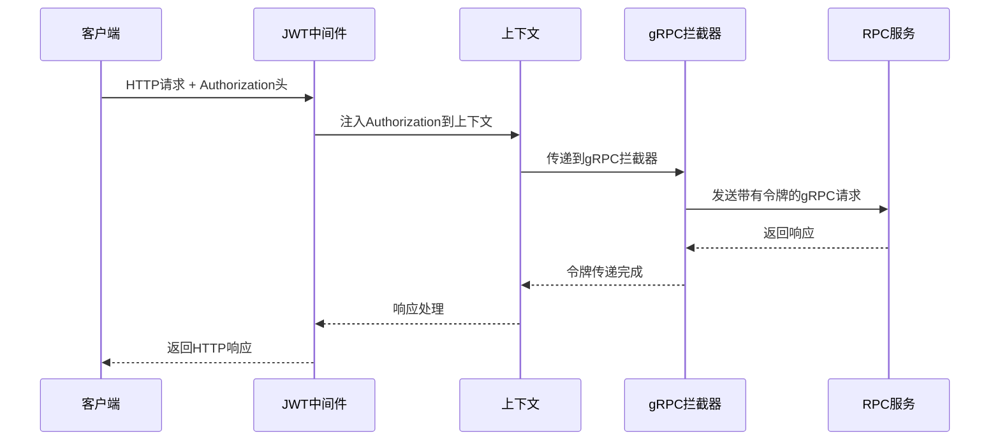

**图表来源**
- [aigtw.go:47-57](file://aiapp/aigtw/aigtw.go#L47-L57)
- [metadataInterceptor.go:11-56](file://common/Interceptor/rpcclient/metadataInterceptor.go#L11-L56)

### 中间件实现

#### 1. 全局JWT中间件

网关服务在主程序中集成了全局JWT中间件，自动处理Authorization头的注入。

**章节来源**
- [aigtw.go:47-57](file://aiapp/aigtw/aigtw.go#L47-L57)

#### 2. gRPC拦截器

拦截器将JWT令牌从HTTP上下文提取并注入到gRPC元数据中，确保令牌在RPC调用链中传递。

**章节来源**
- [metadataInterceptor.go:11-56](file://common/Interceptor/rpcclient/metadataInterceptor.go#L11-L56)

#### 3. 上下文数据管理

ctxdata包提供了统一的上下文数据管理，支持用户ID、用户名、部门代码和授权令牌的存储和检索。

**章节来源**
- [ctxData.go:9-76](file://common/ctxdata/ctxData.go#L9-L76)

### 令牌解析功能

系统提供了强大的JWT令牌解析功能，支持多种签名算法和密钥轮换。

**章节来源**
- [tool.go:35-65](file://common/tool/tool.go#L35-L65)

## 前端JavaScript流式传输增强

### getAuthHeaders函数增强

**更新** getAuthHeaders函数现在支持流式参数，自动添加Accept: text/event-stream头，确保流式SSE传输的正确性。

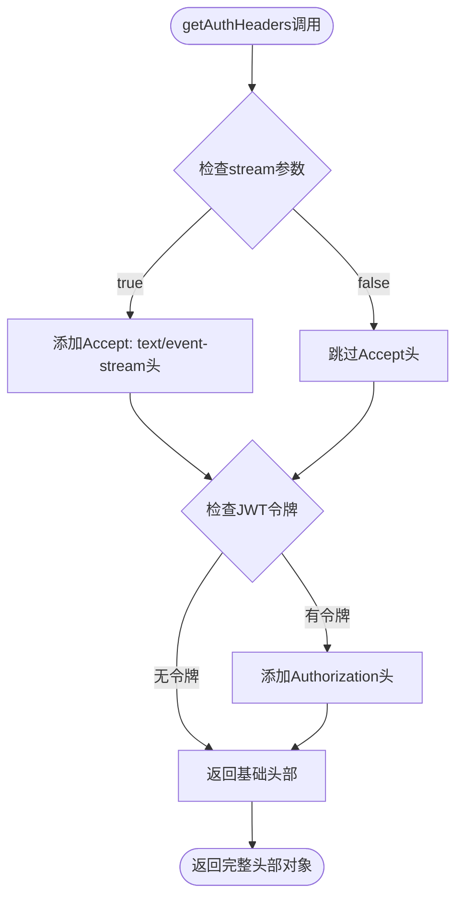

**图表来源**
- [chat.html:1494-1500](file://aiapp/aigtw/chat.html#L1494-L1500)

### 流式传输实现

前端JavaScript通过getAuthHeaders函数自动处理流式传输的HTTP头部，确保与AI网关服务的SSE协议兼容。

**更新** 当stream参数为true时，函数自动添加Accept: text/event-stream头，支持SSE事件流传输

**章节来源**
- [chat.html:1494-1500](file://aiapp/aigtw/chat.html#L1494-L1500)
- [chat.html:1638-1643](file://aiapp/aigtw/chat.html#L1638-L1643)

### 流式处理优化

前端实现了完整的流式SSE处理机制，包括事件解析、内容渲染和错误处理。

**章节来源**
- [chat.html:1697-1796](file://aiapp/aigtw/chat.html#L1697-L1796)

## MCP异步工具调用界面样式优化

### 步骤显示系统

**更新** 新增了完整的步骤显示系统，包括.step-badge、.step-header、.step-desc等样式类，提供清晰的步骤指示和说明

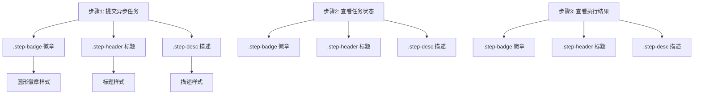

**图表来源**
- [tool.html:163-186](file://aiapp/aigtw/tool.html#L163-L186)

### 历史记录功能

**更新** 新增.history-item样式类，提供美观的历史记录列表，支持悬停效果和点击交互

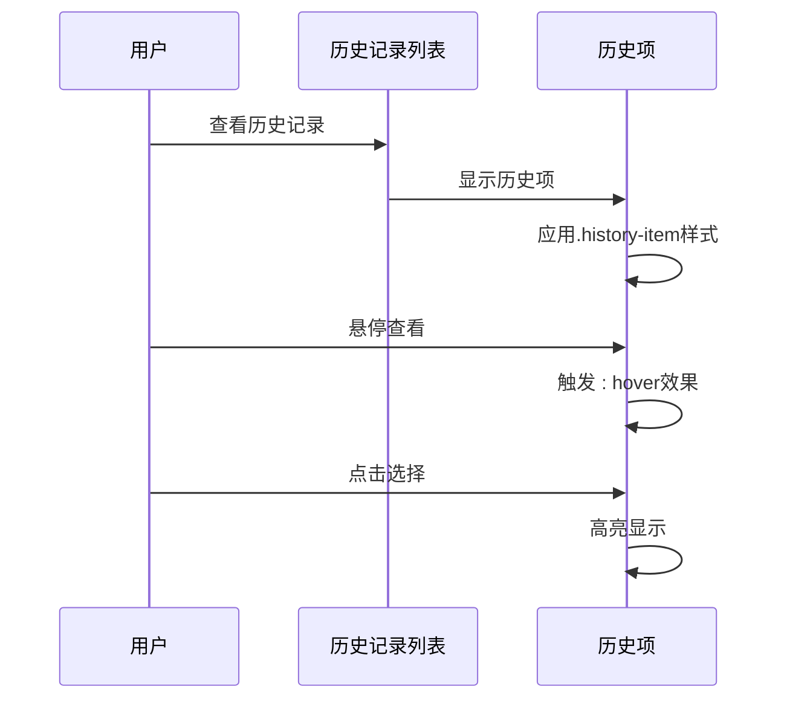

**图表来源**
- [tool.html:187-202](file://aiapp/aigtw/tool.html#L187-L202)

### 主题切换和交互反馈

**更新** 工具界面支持主题切换，提供亮色和暗色两种主题模式，增强用户体验

**章节来源**
- [tool.html:163-202](file://aiapp/aigtw/tool.html#L163-L202)

### 样式类详细分析

#### .step-badge样式类

- **圆形徽章设计**：28px × 28px的圆形徽章，居中显示步骤序号
- **强调色彩**：使用强调色背景(#6c5ce7)，白色字体，突出显示
- **圆角设计**：50%的边框半径，营造现代化外观
- **间距控制**：右侧10px外边距，与后续元素保持适当距离

#### .step-header样式类

- **布局设计**：flex布局，左对齐，垂直居中
- **标题样式**：h3标签样式，无外边距，保持简洁
- **对齐方式**：与徽章垂直对齐，形成清晰的视觉层次

#### .step-desc样式类

- **字体规格**：12px字号，12px行高
- **颜色设计**：次级文本颜色(#666666)，降低视觉权重
- **间距控制**：顶部4px外边距，与标题保持适当间距

#### .history-item样式类

- **布局设计**：flex布局，左对齐，垂直居中
- **交互效果**：悬停时应用表面悬停样式(--surface-hover)
- **点击反馈**：支持点击选择，提供视觉反馈
- **信息布局**：工具名、任务信息、时间戳的合理排列

**章节来源**
- [tool.html:163-202](file://aiapp/aigtw/tool.html#L163-L202)

### 进度消息处理优化

**更新** 移除了工具进度更新的节流机制，允许即时渲染进度更新，显著改善了用户体验

#### 消息去重机制

系统实现了消息去重机制，避免重复消息的显示：

- 使用messageSet Set集合跟踪已显示的消息
- 通过组合键(iconClass + '-' + progress + '-' + message)确保唯一性
- 防止重复消息的重复渲染，提升界面性能

#### 即时进度渲染

**更新** 移除了进度更新的节流机制，现在支持即时渲染：

- 每次收到新的进度消息都立即更新界面
- 移除了pollingInterval的节流控制
- 提供更流畅的用户体验，特别是在快速进度更新场景

**章节来源**
- [tool.html:714-750](file://aiapp/aigtw/tool.html#L714-L750)
- [tool.html:922-965](file://aiapp/aigtw/tool.html#L922-L965)

## 异步工具调用系统

### 系统架构

AI网关服务新增了完整的异步工具调用系统，支持长时间运行任务的进度跟踪和结果查询。

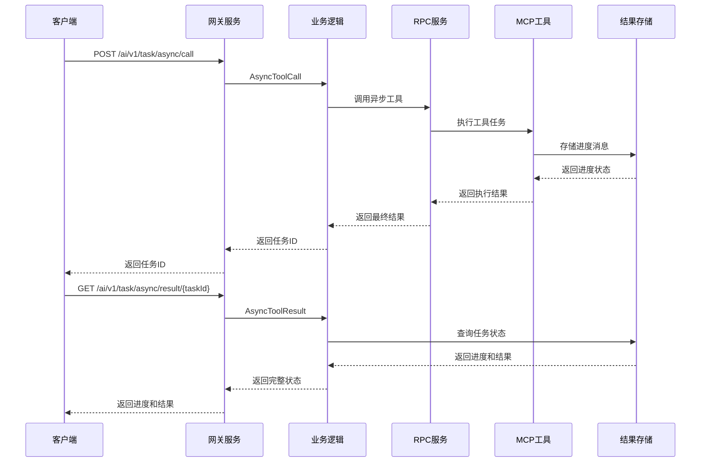

**图表来源**
- [asyncToolCallLogic.go:1-49](file://aiapp/aigtw/internal/logic/pass/asyncToolCallLogic.go#L1-L49)
- [asynctoolresultlogic.go:31-61](file://aiapp/aigtw/internal/logic/pass/asynctoolresultlogic.go#L31-L61)

### AsyncToolCall接口

异步工具调用接口负责启动长时间运行的任务，并返回任务ID供后续查询。

**更新** 新增异步工具调用逻辑，支持MCP工具的异步执行和任务管理

**章节来源**
- [asyncToolCallLogic.go:1-49](file://aiapp/aigtw/internal/logic/pass/asyncToolCallLogic.go#L1-L49)

### AsyncToolResult接口

异步工具结果查询接口负责查询异步任务的执行状态和结果。

**更新** 新增异步工具结果查询逻辑，支持进度消息的双向转换和状态管理

**章节来源**
- [asynctoolresultlogic.go:31-61](file://aiapp/aigtw/internal/logic/pass/asynctoolresultlogic.go#L31-L61)

### 异步结果存储

系统使用mcpx包提供的异步结果存储机制，支持进度消息的持久化和查询。

**章节来源**
- [async_result.go:1-50](file://common/mcpx/async_result.go#L1-L50)

## 进度消息处理机制

### ProgressMessage结构

ProgressMessage结构提供了完整的进度跟踪信息，包括当前进度、总进度、消息内容和时间戳。

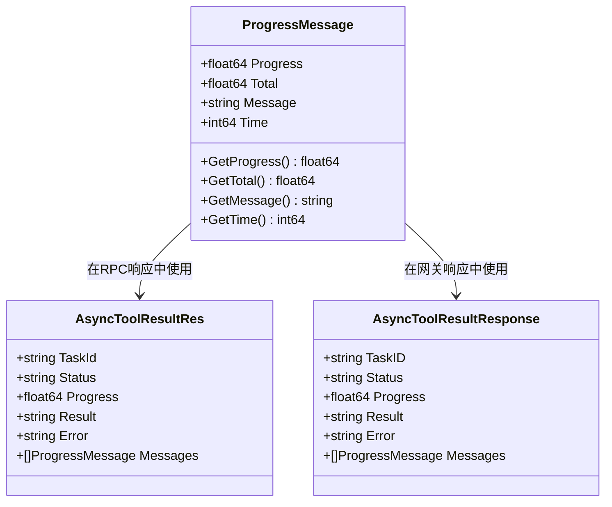

**图表来源**
- [aichat.pb.go:1120-1133](file://aiapp/aichat/aichat/aichat.pb.go#L1120-L1133)
- [types.go:133-138](file://aiapp/aigtw/internal/types/types.go#L133-L138)
- [types.go:88-95](file://aiapp/aigtw/internal/types/types.go#L88-L95)

### 进度消息转换

系统实现了双向的进度消息转换机制，支持RPC响应和网关响应之间的数据转换。

**更新** 新增进度消息转换逻辑，确保不同层级间的数据格式一致性

**章节来源**
- [asynctoolresultlogic.go:37-51](file://aiapp/aichat/internal/logic/asynctoolresultlogic.go#L37-L51)
- [asynctoolresultlogic.go:42-60](file://aiapp/aigtw/internal/logic/pass/asynctoolresultlogic.go#L42-L60)

### 进度消息存储

MCP工具通过mcpx包提供的进度发送器发送进度消息，系统自动存储和管理这些消息。

**章节来源**
- [testprogress.go:37-55](file://aiapp/mcpserver/internal/tools/testprogress.go#L37-L55)

### 即时进度渲染机制

**更新** 移除了进度更新的节流机制，现在支持即时渲染：

- 移除了pollingInterval的定时器节流
- 每次收到新的进度消息都立即更新界面
- 提供更流畅的用户体验，特别是在快速进度更新场景

**章节来源**
- [memory_handler.go:97-123](file://common/mcpx/memory_handler.go#L97-L123)
- [client.go:770-820](file://common/mcpx/client.go#L770-L820)

## 异步结果统计系统

### 系统架构

AI网关服务新增了异步结果统计系统，提供任务执行状态的全局统计信息。

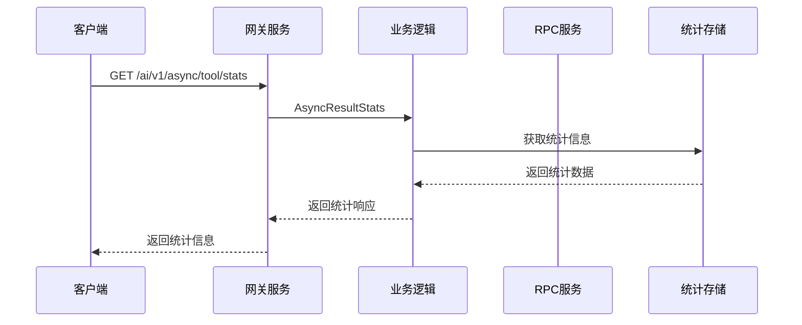

**图表来源**
- [asyncresultstatshandler.go:14-25](file://aiapp/aigtw/internal/handler/pass/asyncresultstatshandler.go#L14-L25)
- [asyncresultstatslogic.go:30-110](file://aiapp/aigtw/internal/logic/pass/asyncresultstatslogic.go#L30-L110)

### AsyncResultStats接口

异步结果统计接口负责获取任务执行状态的全局统计信息，包括任务总数、待处理、完成、失败和成功率。

**更新** 新增异步结果统计逻辑，支持任务总数、待处理、完成、失败和成功率的计算和返回

**章节来源**
- [asyncresultstatslogic.go:30-110](file://aiapp/aigtw/internal/logic/pass/asyncresultstatslogic.go#L30-L110)
- [asyncresultstatslogic.go:24-44](file://aiapp/aichat/internal/logic/asyncresultstatslogic.go#L24-L44)

### 统计数据结构

AsyncResultStatsResponse结构提供了完整的统计信息，包括任务总数、各状态任务数量和成功率。

**章节来源**
- [types.go:6-12](file://aiapp/aigtw/internal/types/types.go#L6-L12)

## 分页查询异步结果系统

### 系统架构

AI网关服务新增了分页查询异步结果系统，支持按状态、时间范围过滤和多字段排序的异步结果列表查询。

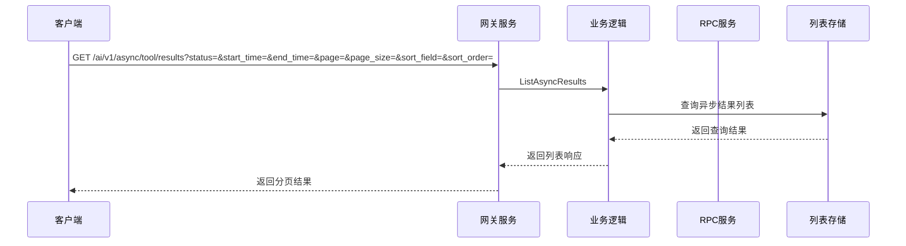

**图表来源**
- [listasyncresultshandler.go:16-31](file://aiapp/aigtw/internal/handler/pass/listasyncresultshandler.go#L16-L31)
- [listasyncresultlogic.go:31-77](file://aiapp/aigtw/internal/logic/pass/listasyncresultlogic.go#L31-L77)

### ListAsyncResults接口

分页查询异步结果接口负责查询异步任务的结果列表，支持按状态、时间范围过滤和多字段排序。

**更新** 新增分页查询异步结果逻辑，支持完整的查询条件和排序功能

**章节来源**
- [listasyncresultlogic.go:31-77](file://aiapp/aigtw/internal/logic/pass/listasyncresultlogic.go#L31-L77)
- [listasyncresultlogic.go:25-79](file://aiapp/aichat/internal/logic/listasyncresultlogic.go#L25-L79)

### 查询条件和排序

系统支持多种查询条件和排序选项，包括状态过滤、时间范围筛选、分页参数和排序字段。

**章节来源**
- [types.go:96-104](file://aiapp/aigtw/internal/types/types.go#L96-L104)

### 列表响应结构

ListAsyncResultsResponse结构提供了完整的分页查询结果，包括任务列表、总数、页码和分页信息。

**章节来源**
- [types.go:106-112](file://aiapp/aigtw/internal/types/types.go#L106-L112)

## MCP集成增强

### MCP服务器架构

AI网关服务集成了MCP（Model Context Protocol）服务器，支持异步工具调用和进度跟踪。

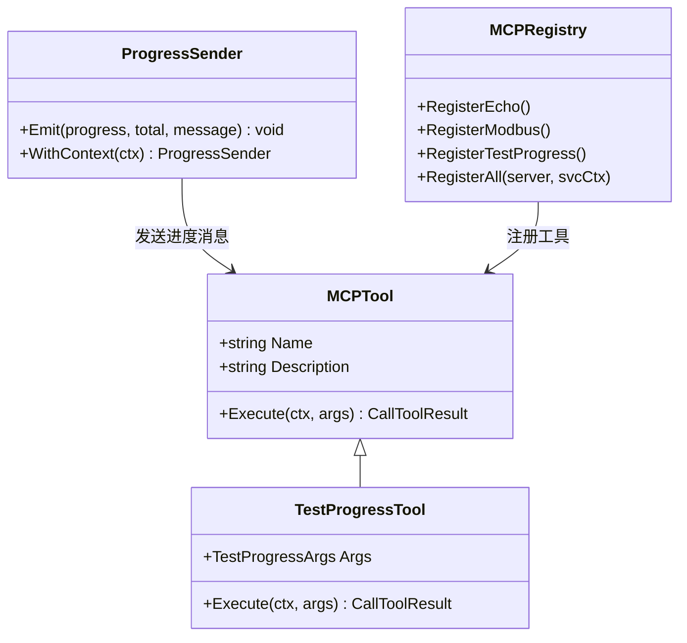

**图表来源**
- [testprogress.go:13-69](file://aiapp/mcpserver/internal/tools/testprogress.go#L13-L69)
- [registry.go:9-14](file://aiapp/mcpserver/internal/tools/registry.go#L9-L14)

### 测试进度通知工具

新增的测试进度通知工具，模拟长时间运行的任务并发送实时进度更新。

**更新** 新增test_progress工具，支持可配置的步数、间隔和消息内容

**章节来源**
- [testprogress.go:20-69](file://aiapp/mcpserver/internal/tools/testprogress.go#L20-L69)

### MCP工具注册

系统通过MCP注册表统一管理所有可用的MCP工具。

**章节来源**
- [registry.go:9-14](file://aiapp/mcpserver/internal/tools/registry.go#L9-L14)

### 进度发送器

MCP工具通过进度发送器发送进度消息，系统自动处理进度消息的存储和查询。

**章节来源**
- [testprogress.go:37-55](file://aiapp/mcpserver/internal/tools/testprogress.go#L37-L55)

### 即时进度处理

**更新** 移除了进度更新的节流机制，现在支持即时处理：

- DefaultTaskObserver.OnProgress直接触发外部回调
- 移除了进度更新的延迟处理
- 提供更实时的进度反馈

**章节来源**
- [memory_handler.go:333-368](file://common/mcpx/memory_handler.go#L333-L368)
- [client.go:770-820](file://common/mcpx/client.go#L770-L820)

## API规范文件

### 模块化文档结构

**更新** 新增独立的API规范文件，采用模块化文档结构，分离基础配置、主API定义和类型定义

**章节来源**
- [base.api:1-11](file://aiapp/aigtw/doc/base.api#L1-L11)
- [aigtw.api:1-79](file://aiapp/aigtw/doc/aigtw.api#L1-L79)
- [openai.api:1-118](file://aiapp/aigtw/doc/types/openai.api#L1-L118)
- [tool.api:1-56](file://aiapp/aigtw/doc/types/tool.api#L1-L56)

### 基础配置文件

基础配置文件定义了通用的JWT认证方式和通用类型。

**章节来源**
- [base.api:1-11](file://aiapp/aigtw/doc/base.api#L1-L11)

### 主API定义文件

主API定义文件包含了完整的服务接口规范，包括模型列表、对话补全和异步工具调用接口。

**章节来源**
- [aigtw.api:1-79](file://aiapp/aigtw/doc/aigtw.api#L1-L79)

### 类型定义文件

类型定义文件分离了OpenAI兼容类型和工具调用类型，提供更清晰的类型组织结构。

**章节来源**
- [openai.api:1-118](file://aiapp/aigtw/doc/types/openai.api#L1-L118)
- [tool.api:1-56](file://aiapp/aigtw/doc/types/tool.api#L1-L56)

## 类型定义结构改进

### 分离的类型组织

**更新** 改进了类型定义结构，将OpenAI兼容类型和工具调用类型分离到独立的文件中

**章节来源**
- [types.go:1-161](file://aiapp/aigtw/internal/types/types.go#L1-L161)

### OpenAI兼容类型

OpenAI兼容类型定义了完整的对话补全请求和响应格式，支持流式和非流式响应。

**章节来源**
- [openai.api:4-116](file://aiapp/aigtw/doc/types/openai.api#L4-L116)

### 工具调用类型

工具调用类型定义了异步工具调用的请求、响应和查询参数。

**章节来源**
- [tool.api:3-54](file://aiapp/aigtw/doc/types/tool.api#L3-L54)

## 文档结构重组

### 独立的文档目录

**更新** 重新组织了文档结构，将API规范文件移动到独立的doc目录中

**章节来源**
- [aigtw.api:1-79](file://aiapp/aigtw/doc/aigtw.api#L1-L79)

### 文件组织优化

文档文件按照功能模块进行组织，便于维护和查找。

**章节来源**
- [base.api:1-11](file://aiapp/aigtw/doc/base.api#L1-L11)
- [openai.api:1-118](file://aiapp/aigtw/doc/types/openai.api#L1-L118)
- [tool.api:1-56](file://aiapp/aigtw/doc/types/tool.api#L1-L56)

## 依赖关系分析

### 1. 外部依赖

系统依赖于多个GoZero相关的库和组件：

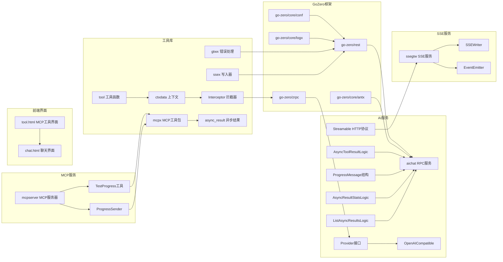

**图表来源**
- [aigtw.go:23-27](file://aiapp/aigtw/aigtw.go#L23-L27)
- [aichat.go:13-19](file://aiapp/aichat/aichat.go#L13-L19)
- [ssestreamlogic.go:39-117](file://aiapp/ssegtw/internal/logic/sse/ssestreamlogic.go#L39-L117)
- [mcpserver.go:1-50](file://aiapp/mcpserver/mcpserver.go#L1-L50)

### 2. 内部模块依赖

```mermaid
graph TB
subgraph "aigtw模块"
A[aigtw.go]
B[routes.go]
C[servicecontext.go]
D[types.go]
E[chatcompletionshandler.go]
F[listmodelshandler.go]
G[asyncToolCallHandler.go]
H[asynctoolresulthandler.go]
I[asyncresultstatshandler.go]
J[listasyncresultshandler.go]
K[asyncToolCallLogic.go]
L[asynctoolresultlogic.go]
M[asyncresultstatslogic.go]
N[listasyncresultlogic.go]
O[listasyncresultslogic.go]
P[ctxData.go]
Q[metadataInterceptor.go]
R[tool.go]
S[tool.html]
T[chat.html]
U[doc/ API规范文件]
end
subgraph "aichat模块"
V[aichat.go]
W[provider.go]
X[config.go]
Y[chatcompletionstreamlogic.go]
Z[chatcompletionlogic.go]
AA[asynctoolcalllogic.go]
AB[asynctoolresultlogic.go]
AC[asyncresultstatslogic.go]
AD[listasyncresultlogic.go]
AE[listmodelslogic.go]
AF[openai.go]
AG[types.go]
AH[aichat.pb.go]
end
subgraph "ssegtw模块"
AI[ssegtw.go]
AJ[ssestreamlogic.go]
AK[writer.go]
end
subgraph "mcpserver模块"
AL[mcpserver.go]
AM[testprogress.go]
AN[registry.go]
end
subgraph "公共模块"
AO[openai_error.go]
AP[Interceptor]
AQ[ssex]
AR[ctxdata]
AS[tool]
AT[tool.html]
AU[chat.html]
AV[async_result.go]
AW[mcpx包]
AX[provider registry]
AY[doc/ API规范文件]
AZ[types.go]
end
A --> B
A --> C
B --> D
C --> V
V --> W
V --> AH
A --> AO
V --> AO
C --> AP
AI --> AJ
AI --> AK
AJ --> AQ
Y --> AF
AA --> AF
E --> AA
F --> AC
G --> AA
H --> AB
I --> AD
J --> AE
K --> AA
L --> AB
M --> AC
N --> AD
O --> AE
P --> AP
Q --> AP
R --> AR
S --> AT
T --> AU
AL --> AM
AL --> AN
AM --> AW
AN --> AW
AW --> AV
AX --> W
U --> D
U --> AZ
AY --> D
AY --> AZ
```

**图表来源**
- [aigtw.go:14-27](file://aiapp/aigtw/aigtw.go#L14-L27)
- [aichat.go:7-19](file://aiapp/aichat/aichat.go#L7-L19)
- [ssestreamlogic.go:39-117](file://aiapp/ssegtw/internal/logic/sse/ssestreamlogic.go#L39-L117)

**章节来源**
- [aigtw.go:14-27](file://aiapp/aigtw/aigtw.go#L14-L27)
- [aichat.go:7-19](file://aiapp/aichat/aichat.go#L7-L19)

## 性能考虑

### 1. 流式处理优化

系统支持SSE流式传输，通过专门的流式写入器实现高效的实时数据传输。

**更新** 增强了流式处理的内存安全机制，限制响应体读取大小防止内存攻击；优化超时控制机制，支持总超时和空闲超时双重保护；前端JavaScript自动头部管理优化，减少不必要的HTTP头部处理；MCP工具界面样式优化，提升渲染性能和用户体验；**异步工具调用系统性能优化，支持高效的进度消息存储和查询；异步结果统计系统性能优化，支持快速的统计计算和数据聚合；模块化API规范文件优化，提升文档维护效率；移除了工具进度更新的节流机制，允许即时渲染进度更新，显著改善用户体验**

**章节来源**
- [openai.go:152-204](file://aiapp/aichat/internal/provider/openai.go#L152-L204)
- [openai.go:193-204](file://aiapp/aichat/internal/provider/openai.go#L193-L204)
- [chat.html:1494-1500](file://aiapp/aigtw/chat.html#L1494-L1500)

### 2. 连接池管理

RPC客户端使用连接池管理，支持非阻塞操作和超时控制。

### 3. 内存管理

新增的内存管理机制，防止SSE流式传输中的内存泄漏。

**章节来源**
- [ssestreamlogic.go:39-117](file://aiapp/ssegtw/internal/logic/sse/ssestreamlogic.go#L39-L117)

### 4. JWT令牌缓存

系统实现了JWT令牌的高效解析和缓存机制，减少重复验证开销。

**章节来源**
- [tool.go:35-65](file://common/tool/tool.go#L35-L65)

### 5. Accept Header优化

优化了Accept头处理，区分流式(text/event-stream)和非流式(application/json)模式。

**更新** 前端JavaScript通过getAuthHeaders函数智能处理Accept头，自动根据流式状态添加相应的头部；MCP工具界面主题切换优化，减少样式计算开销；**异步工具调用界面优化，提供更好的用户体验和性能表现；异步结果统计界面优化，支持实时数据展示和交互反馈；模块化API规范文件优化，提升文档维护效率；移除了工具进度更新的节流机制，允许即时渲染进度更新，显著改善用户体验**

**章节来源**
- [openai.go:98-104](file://aiapp/aichat/internal/provider/openai.go#L98-L104)
- [chat.html:1494-1500](file://aiapp/aigtw/chat.html#L1494-L1500)

### 6. 工具界面性能优化

**更新** MCP工具界面的样式类优化，减少DOM操作和样式计算，提升渲染性能；**异步工具调用界面优化，提供更好的用户体验和性能表现；异步结果统计界面优化，支持实时数据展示和交互反馈；模块化API规范文件优化，提升文档维护效率；移除了工具进度更新的节流机制，允许即时渲染进度更新，显著改善用户体验**

**章节来源**
- [tool.html:163-202](file://aiapp/aigtw/tool.html#L163-L202)

### 7. 异步工具调用性能优化

**更新** 异步工具调用系统实现了高效的进度消息存储和查询机制，支持快速的任务状态查询和进度跟踪；**异步结果统计系统实现了高效的统计计算和数据聚合机制，支持实时的统计数据更新；模块化API规范文件优化，提升文档生成效率；移除了工具进度更新的节流机制，允许即时渲染进度更新，显著改善用户体验**

**章节来源**
- [asynctoolresultlogic.go:31-61](file://aiapp/aigtw/internal/logic/pass/asynctoolresultlogic.go#L31-L61)
- [asynctoolresultlogic.go:24-56](file://aiapp/aichat/internal/logic/asynctoolresultlogic.go#L24-L56)
- [asyncresultstatslogic.go:30-110](file://aiapp/aigtw/internal/logic/pass/asyncresultstatslogic.go#L30-L110)

### 8. 分页查询性能优化

**更新** 分页查询异步结果系统实现了高效的数据库查询和分页计算机制，支持大数据量的快速查询和分页展示；**模块化API规范文件优化，提升文档维护和版本管理效率；移除了工具进度更新的节流机制，允许即时渲染进度更新，显著改善用户体验**

**章节来源**
- [listasyncresultlogic.go:31-77](file://aiapp/aigtw/internal/logic/pass/listasyncresultlogic.go#L31-L77)
- [listasyncresultlogic.go:25-79](file://aiapp/aichat/internal/logic/listasyncresultlogic.go#L25-L79)

### 9. 即时进度渲染性能优化

**更新** 移除了工具进度更新的节流机制，允许即时渲染进度更新，显著改善用户体验；**消息去重机制优化，避免重复消息的显示；轮询间隔优化，支持更频繁的进度查询；前端界面响应优化，提供更流畅的用户体验**

**章节来源**
- [tool.html:714-750](file://aiapp/aigtw/tool.html#L714-L750)
- [tool.html:922-965](file://aiapp/aigtw/tool.html#L922-L965)

## 故障排除指南

### 1. 常见问题诊断

- **模型不可用**: 检查模型配置和提供商连接状态
- **流式传输中断**: 验证SSE连接和网络稳定性
- **RPC调用超时**: 检查后端服务响应时间和超时配置
- **内存泄漏**: 检查SSE流式传输的内存释放机制
- **JWT认证失败**: 验证Authorization头格式和令牌有效性
- **Streamable协议异常**: 检查SSE事件流和心跳保活机制
- **前端流式传输失败**: 验证getAuthHeaders函数的流式参数处理和Accept头添加
- **MCP工具界面样式异常**: 检查.step-badge、.step-header、.step-desc和.history-item等样式类的正确应用
- **异步工具调用失败**: **检查任务ID的有效性和异步结果存储的可用性**
- **进度消息丢失**: **验证MCP工具的进度发送器配置和进度消息存储机制**
- **异步结果统计失败**: **检查统计存储的配置和统计计算的正确性**
- **分页查询异步结果失败**: **验证查询条件的正确性和分页计算的准确性**
- **API规范文件错误**: **检查模块化文档结构的正确性和类型定义的一致性**
- **进度更新延迟**: **检查轮询间隔设置和前端界面的响应机制**

### 2. 错误处理优化

系统提供详细的日志记录，包括请求处理时间、错误信息和性能指标。

**更新** 增强了错误解析机制，限制响应体读取大小防止内存攻击；优化SSE流式错误处理，防止JSON错误响应混入SSE协议流；前端JavaScript流式传输头部管理优化；MCP工具界面样式类错误处理；**异步工具调用系统错误处理优化；异步结果统计系统错误处理优化；分页查询异步结果系统错误处理优化；模块化API规范文件错误处理；移除了工具进度更新的节流机制，允许即时渲染进度更新，显著改善用户体验**

**章节来源**
- [openai_error.go:37-70](file://common/gtwx/openai_error.go#L37-L70)
- [openai.go:152-204](file://aiapp/aichat/internal/provider/openai.go#L152-L204)
- [chat.html:1494-1500](file://aiapp/aigtw/chat.html#L1494-L1500)

### 3. SSE流式处理调试

新增的SSE流式处理调试功能，支持事件订阅和内存监控。

**章节来源**
- [ssestreamlogic.go:39-117](file://aiapp/ssegtw/internal/logic/sse/ssestreamlogic.go#L39-L117)

### 4. JWT令牌管理调试

系统提供了完整的JWT令牌管理调试功能，包括令牌解析、验证和传递过程的监控。

**章节来源**
- [aigtw.go:47-57](file://aiapp/aigtw/aigtw.go#L47-L57)
- [metadataInterceptor.go:11-56](file://common/Interceptor/rpcclient/metadataInterceptor.go#L11-L56)

### 5. 前端流式传输调试

**新增** 前端JavaScript流式传输调试功能，支持getAuthHeaders函数的流式参数处理和Accept头验证。

**章节来源**
- [chat.html:1494-1500](file://aiapp/aigtw/chat.html#L1494-L1500)
- [chat.html:1638-1643](file://aiapp/aigtw/chat.html#L1638-L1643)

### 6. MCP工具界面调试

**新增** MCP异步工具调用界面调试功能，支持步骤显示和历史记录的样式验证。

**章节来源**
- [tool.html:163-202](file://aiapp/aigtw/tool.html#L163-L202)

### 7. 异步工具调用调试

**新增** 异步工具调用系统调试功能，支持任务状态查询和进度消息验证。

**章节来源**
- [asynctoolresultlogic.go:31-61](file://aiapp/aigtw/internal/logic/pass/asynctoolresultlogic.go#L31-L61)
- [asynctoolresultlogic.go:24-56](file://aiapp/aichat/internal/logic/asynctoolresultlogic.go#L24-L56)

### 8. 异步结果统计调试

**新增** 异步结果统计系统调试功能，支持统计信息的验证和计算准确性检查。

**章节来源**
- [asyncresultstatslogic.go:30-110](file://aiapp/aigtw/internal/logic/pass/asyncresultstatslogic.go#L30-L110)
- [asyncresultstatslogic.go:24-44](file://aiapp/aichat/internal/logic/asyncresultstatslogic.go#L24-L44)

### 9. 分页查询异步结果调试

**新增** 分页查询异步结果系统调试功能，支持查询条件验证和分页计算准确性检查。

**章节来源**
- [listasyncresultlogic.go:31-77](file://aiapp/aigtw/internal/logic/pass/listasyncresultlogic.go#L31-L77)
- [listasyncresultlogic.go:25-79](file://aiapp/aichat/internal/logic/listasyncresultlogic.go#L25-L79)

### 10. API规范文件调试

**新增** 模块化API规范文件调试功能，支持文档结构验证和类型定义一致性检查。

**章节来源**
- [aigtw.api:1-79](file://aiapp/aigtw/doc/aigtw.api#L1-L79)
- [base.api:1-11](file://aiapp/aigtw/doc/base.api#L1-L11)
- [openai.api:1-118](file://aiapp/aigtw/doc/types/openai.api#L1-L118)
- [tool.api:1-56](file://aiapp/aigtw/doc/types/tool.api#L1-L56)

### 11. 即时进度渲染调试

**新增** 即时进度渲染调试功能，支持进度消息去重机制和界面响应验证。

**章节来源**
- [tool.html:714-750](file://aiapp/aigtw/tool.html#L714-L750)
- [tool.html:922-965](file://aiapp/aigtw/tool.html#L922-L965)

## 结论

AI网关服务提供了一个完整、可扩展的OpenAI兼容AI服务解决方案。通过清晰的架构设计、完善的错误处理机制和灵活的配置管理，该系统能够满足各种AI应用的需求。

**最新版本显著增强了服务功能，主要包括：

1. **Streamable HTTP传输协议**：实现了高效的流式事件传输，支持SSE协议的完整实现，包括事件订阅、数据传输、心跳保活和连接管理

2. **JWT令牌管理界面增强**：新增全局JWT中间件，自动处理Authorization头的注入和gRPC拦截器传递，确保令牌在完整的调用链中正确传递

3. **SSE流式错误处理优化**：增强了流式处理的内存安全机制，防止JSON错误响应混入SSE协议流，提升了系统的稳定性和安全性

4. **API架构重构**：API组已从'ai'重命名为'pass'，URL前缀已从'/aigtw/v1'更新为'/ai/v1'，包结构已从ai/迁移到pass/，移除了Ping健康检查功能

5. **性能优化**：改进了流式超时控制和空闲检测机制，增强了错误解析和内存管理能力

6. **前端JavaScript流式传输增强**：getAuthHeaders函数现在支持流式参数，自动添加Accept: text/event-stream头，确保流式SSE传输的正确性和效率

7. **MCP异步工具调用界面样式优化**：新增.step-badge、.step-header、.step-desc和.history-item等样式类，提供清晰的步骤指示、美观的历史记录显示和良好的用户体验

8. **完整的异步工具调用系统**：**新增ProgressMessage结构，支持丰富的进度跟踪信息；增强AsyncToolResultResponse，支持进度消息数组的完整传输；改进AsyncToolResultLogic，实现双向进度消息转换和状态管理；MCP集成增强，支持测试进度通知工具和异步结果处理；新增异步结果统计系统，提供任务执行状态的全局统计信息；新增分页查询异步结果系统，支持按状态、时间范围过滤和多字段排序功能；移除了工具进度更新的节流机制，允许即时渲染进度更新，显著改善用户体验**

9. **MCP集成增强**：**新增MCP服务器架构，支持异步工具调用和进度跟踪；新增测试进度通知工具，模拟长时间运行任务；增强进度发送器机制，支持实时进度消息传输**

10. **异步结果统计系统**：**新增异步结果统计接口，提供任务总数、待处理、完成、失败和成功率的统计信息；新增异步结果统计逻辑实现，支持高效的统计计算和数据聚合**

11. **分页查询异步结果系统**：**新增分页查询异步结果接口，支持完整的查询条件和排序功能；新增分页查询逻辑实现，支持大数据量的快速查询和分页展示**

12. **API规范文件**：**新增模块化的API规范文件，采用独立的文档结构，分离基础配置、主API定义和类型定义，提升文档维护效率**

13. **类型定义结构改进**：**改进类型定义结构，分离OpenAI兼容类型和工具调用类型，提供更清晰的类型组织结构**

14. **文档结构重组**：**重新组织文档结构，将API规范文件移动到独立的doc目录中，便于维护和查找**

15. **即时进度渲染机制**：**移除了工具进度更新的节流机制，允许即时渲染进度更新，显著改善了用户体验；实现了消息去重机制，避免重复消息的显示；优化了轮询间隔设置，支持更频繁的进度查询**

主要优势包括：
- 完全兼容OpenAI API格式
- 支持多种AI模型提供商
- 高效的流式和非流式响应处理
- 统一的错误处理和日志记录
- 灵活的配置管理和部署选项
- 增强的内存安全和错误防护机制
- 专门的SSE事件流处理能力
- 更清晰的API组织结构
- 完善的JWT令牌管理界面
- 智能的前端流式传输头部管理
- Streamable HTTP传输协议支持
- 现代化的MCP工具界面样式设计
- **完整的异步工具调用系统**
- **ProgressMessage结构支持**
- **MCP集成增强**
- **测试进度通知工具**
- **异步结果统计系统**
- **分页查询异步结果系统**
- **模块化API规范文件**
- **改进的类型定义结构**
- **重组的文档结构**
- **即时进度渲染机制**

该系统为构建企业级AI应用提供了坚实的基础架构，可以根据具体需求进行扩展和定制。新增的Streamable HTTP传输协议、JWT令牌管理界面、前端JavaScript流式传输增强、MCP异步工具调用界面样式优化、**完整的异步工具调用系统、异步结果统计系统、分页查询异步结果系统、MCP集成增强、模块化API规范文件、改进的类型定义结构、重组的文档结构和即时进度渲染机制**进一步提升了系统的实用性和安全性，为现代AI应用开发提供了全面的技术支持。