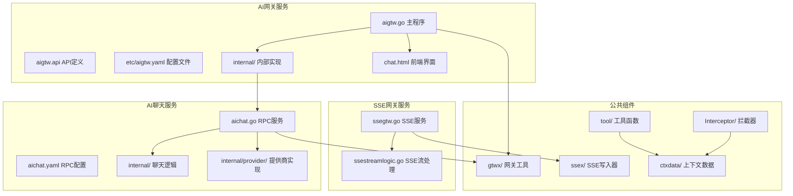
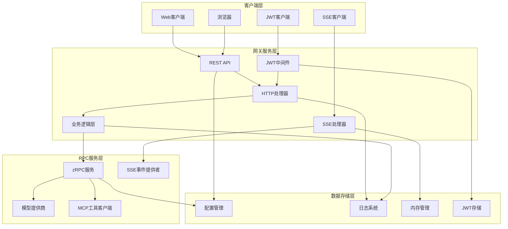
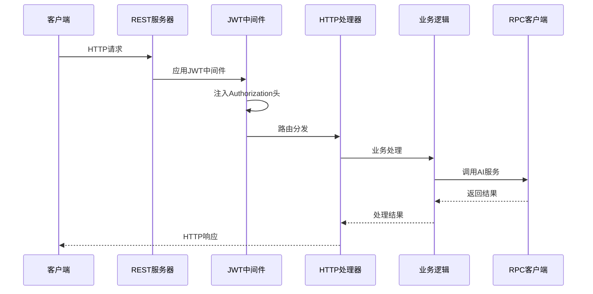
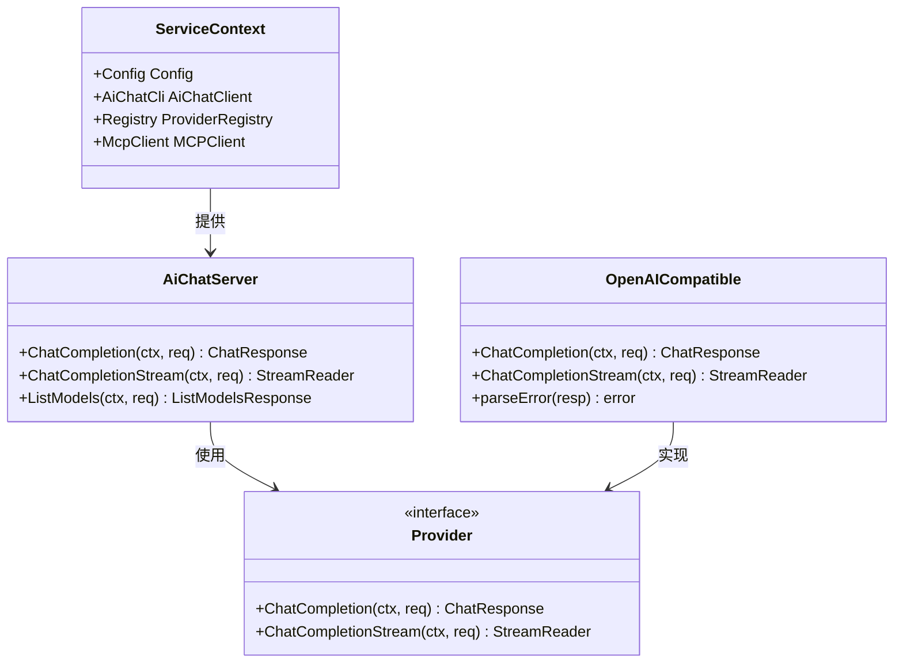
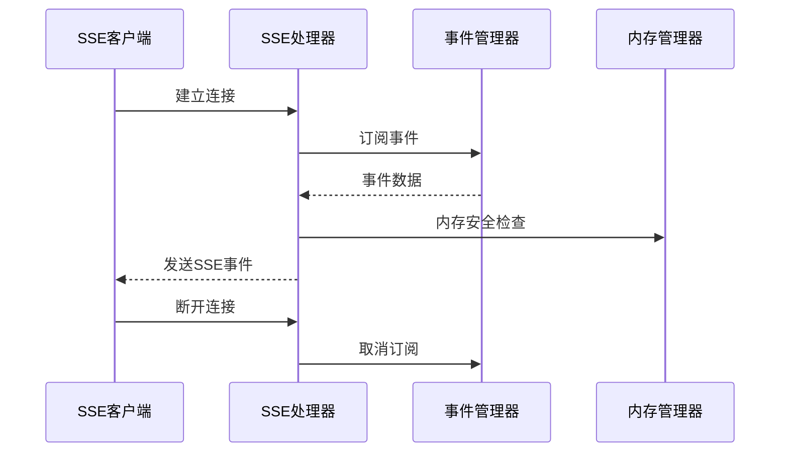
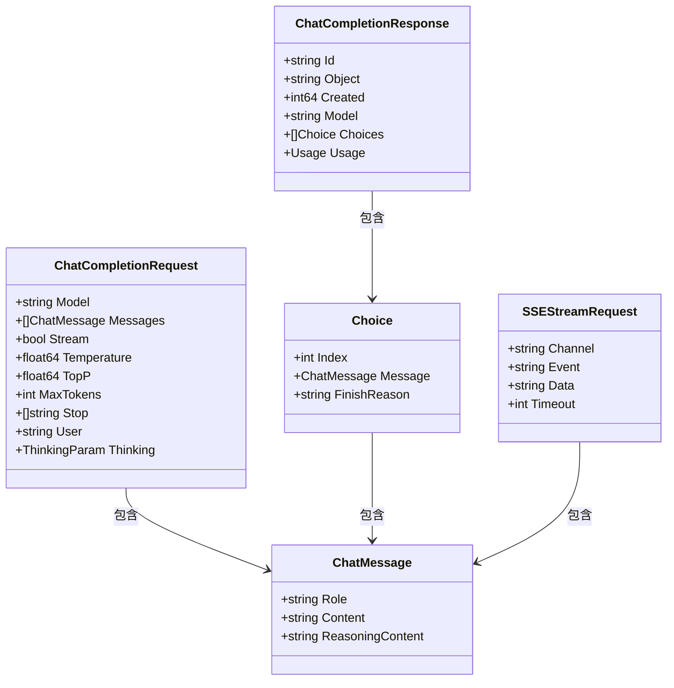
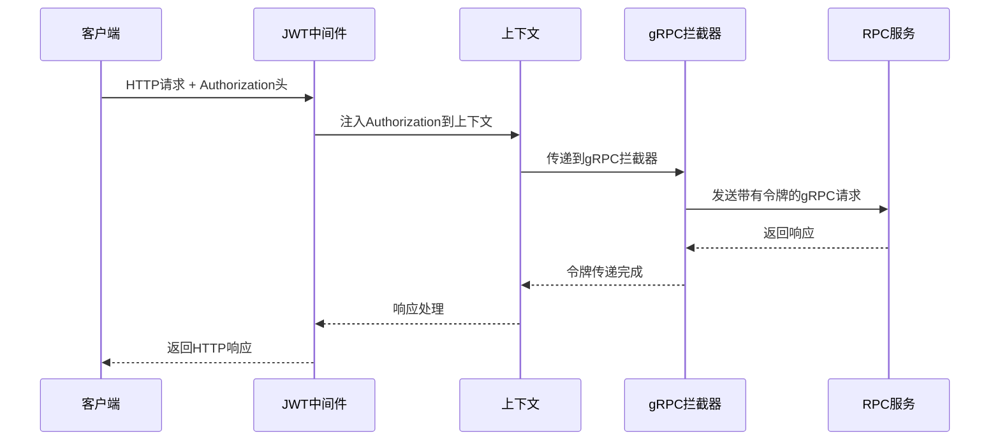
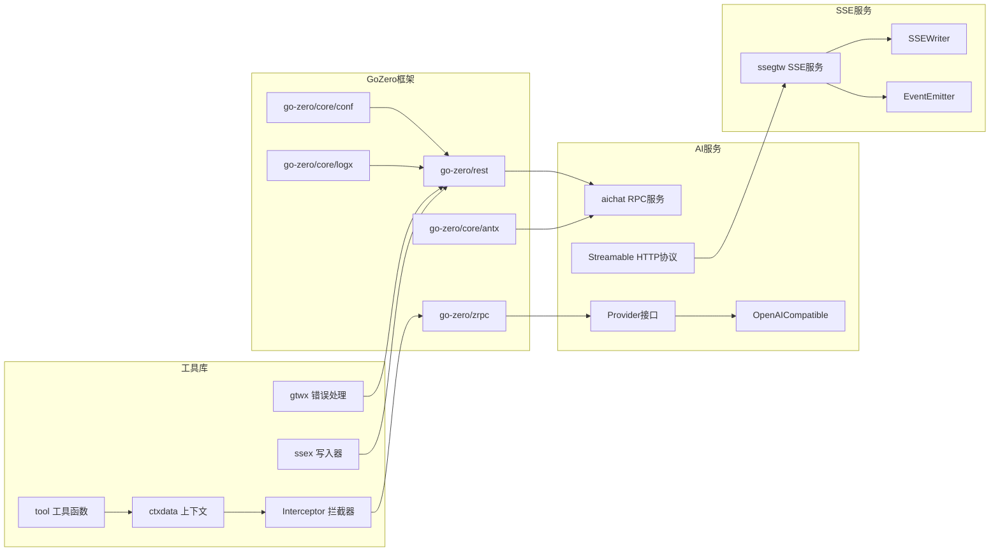
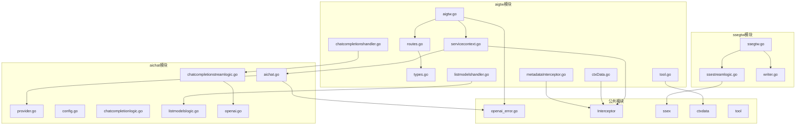

# AI网关服务

<cite>
**本文档引用的文件**
- [aigtw.go](file://aiapp/aigtw/aigtw.go)
- [aigtw.yaml](file://aiapp/aigtw/etc/aigtw.yaml)
- [aigtw.api](file://aiapp/aigtw/aigtw.api)
- [config.go](file://aiapp/aigtw/internal/config/config.go)
- [servicecontext.go](file://aiapp/aigtw/internal/svc/servicecontext.go)
- [routes.go](file://aiapp/aigtw/internal/handler/routes.go)
- [chatcompletionshandler.go](file://aiapp/aigtw/internal/handler/pass/chatcompletionshandler.go)
- [listmodelshandler.go](file://aiapp/aigtw/internal/handler/pass/listmodelshandler.go)
- [chatcompletionstreamlogic.go](file://aiapp/aichat/internal/logic/chatcompletionstreamlogic.go)
- [chatcompletionlogic.go](file://aiapp/aichat/internal/logic/chatcompletionlogic.go)
- [listmodelslogic.go](file://aiapp/aichat/internal/logic/listmodelslogic.go)
- [openai.go](file://aiapp/aichat/internal/provider/openai.go)
- [types.go](file://aiapp/aichat/internal/types/types.go)
- [openai_error.go](file://common/gtwx/openai_error.go)
- [chat.html](file://aiapp/aigtw/chat.html)
- [aichat.go](file://aiapp/aichat/aichat.go)
- [aichat.yaml](file://aiapp/aichat/etc/aichat.yaml)
- [provider.go](file://aiapp/aichat/internal/provider/provider.go)
- [ssestreamlogic.go](file://aiapp/ssegtw/internal/logic/sse/ssestreamlogic.go)
- [ctxData.go](file://common/ctxdata/ctxData.go)
- [metadataInterceptor.go](file://common/Interceptor/rpcclient/metadataInterceptor.go)
- [tool.go](file://common/tool/tool.go)
- [writer.go](file://common/ssex/writer.go)
</cite>

## 更新摘要
**所做更改**
- 新增Streamable HTTP传输协议支持，实现流式SSE事件传输
- 增强JWT令牌管理界面，支持Authorization头注入和gRPC拦截器传递
- 优化SSE流式处理机制，增强内存安全和错误防护
- 更新API组从'ai'重命名为'pass'，URL前缀从'/aigtw/v1'到'/ai/v1'
- 移除Ping健康检查功能，简化服务架构
- 改进流式超时控制和空闲检测机制

## 目录
1. [简介](#简介)
2. [项目结构](#项目结构)
3. [核心组件](#核心组件)
4. [架构概览](#架构概览)
5. [详细组件分析](#详细组件分析)
6. [Streamable HTTP传输协议](#streamable-http传输协议)
7. [JWT令牌管理界面](#jwt令牌管理界面)
8. [依赖关系分析](#依赖关系分析)
9. [性能考虑](#性能考虑)
10. [故障排除指南](#故障排除指南)
11. [结论](#结论)

## 简介

AI网关服务是一个基于GoZero框架构建的OpenAI兼容AI服务网关。该系统提供了统一的REST API接口，将客户端请求转发到后端的AI聊天服务，并支持流式SSE响应和非流式同步响应。

**最新更新** 新增Streamable HTTP传输协议支持，实现高效的流式事件传输；增强JWT令牌管理界面，支持Authorization头的自动注入和gRPC拦截器传递；优化SSE流式处理机制，提升内存安全性和错误防护能力。

该服务的主要特点包括：
- OpenAI兼容的API接口设计
- 支持流式和非流式两种响应模式
- 多模型提供商支持（智谱、通义千问等）
- 统一的错误处理机制
- 前端聊天界面集成
- 增强的SSE流式错误处理和内存安全机制
- Streamable HTTP传输协议支持
- JWT令牌管理界面增强

## 项目结构

AI网关服务采用模块化的项目结构，主要包含以下核心目录：



**图表来源**
- [aigtw.go:1-92](file://aiapp/aigtw/aigtw.go#L1-L92)
- [aichat.go:1-47](file://aiapp/aichat/aichat.go#L1-L47)
- [ssestreamlogic.go:1-117](file://aiapp/ssegtw/internal/logic/sse/ssestreamlogic.go#L1-L117)

**章节来源**
- [aigtw.go:1-92](file://aiapp/aigtw/aigtw.go#L1-L92)
- [aichat.go:1-47](file://aiapp/aichat/aichat.go#L1-L47)
- [ssestreamlogic.go:1-117](file://aiapp/ssegtw/internal/logic/sse/ssestreamlogic.go#L1-L117)

## 核心组件

### 1. 网关服务主程序

网关服务的入口点负责初始化REST服务器、加载配置和注册路由处理器。

**更新** 新增全局中间件，自动将Authorization头注入到上下文中，确保gRPC拦截器可以通过ctxdata.GetAuthorization(ctx)获取原始token

**章节来源**
- [aigtw.go:31-92](file://aiapp/aigtw/aigtw.go#L31-L92)

### 2. 配置管理系统

网关服务使用GoZero的配置系统，支持YAML格式的配置文件管理。

**更新** 配置文件新增JwtAuth部分，包含AccessSecret密钥配置

**章节来源**
- [aigtw.yaml:1-20](file://aiapp/aigtw/etc/aigtw.yaml#L1-L20)
- [config.go:20-27](file://aiapp/aigtw/internal/config/config.go#L20-L27)

### 3. API接口定义

使用Goctl的API DSL定义了完整的REST接口规范，包括模型列表查询和对话补全功能。

**更新** API组已从'ai'重命名为'pass'，URL前缀已从'/aigtw/v1'更新为'/ai/v1'，新增SSE流式接口配置

**章节来源**
- [aigtw.api:1-38](file://aiapp/aigtw/aigtw.api#L1-L38)

### 4. 服务上下文管理

封装了RPC客户端连接和拦截器配置，提供统一的服务访问接口。

**更新** 服务上下文新增Streamable HTTP传输协议支持，配置流式和非流式拦截器

**章节来源**
- [servicecontext.go:12-26](file://aiapp/aigtw/internal/svc/servicecontext.go#L12-L26)

### 5. SSE流式处理组件

新增的SSE网关服务，专门处理流式事件传输，支持心跳保持和内存安全机制。

**更新** 增强SSE事件流处理，支持连接成功事件、通知事件和完成信号

**章节来源**
- [ssestreamlogic.go:39-117](file://aiapp/ssegtw/internal/logic/sse/ssestreamlogic.go#L39-L117)

## 架构概览

AI网关服务采用分层架构设计，实现了清晰的职责分离：



**图表来源**
- [aigtw.go:47-57](file://aiapp/aigtw/aigtw.go#L47-L57)
- [servicecontext.go:17-25](file://aiapp/aigtw/internal/svc/servicecontext.go#L17-L25)
- [ssestreamlogic.go:39-117](file://aiapp/ssegtw/internal/logic/sse/ssestreamlogic.go#L39-L117)

## 详细组件分析

### 网关服务架构

#### 1. REST服务器配置

网关服务使用GoZero的REST框架，支持CORS配置和OpenAI风格的错误处理。



**图表来源**
- [aigtw.go:31-92](file://aiapp/aigtw/aigtw.go#L31-L92)
- [routes.go:16-44](file://aiapp/aigtw/internal/handler/routes.go#L16-L44)

#### 2. 路由注册机制

系统通过动态路由注册实现灵活的API管理，支持不同的HTTP方法和路径映射。

**更新** 路由已更新为使用新的包结构'pass'和URL前缀'/ai/v1'，新增JWT认证支持

**章节来源**
- [routes.go:16-44](file://aiapp/aigtw/internal/handler/routes.go#L16-L44)

### AI聊天服务

#### 1. RPC服务器架构

AI聊天服务作为后端RPC服务，提供统一的AI模型调用接口。



**图表来源**
- [aichat.go:33-34](file://aiapp/aichat/aichat.go#L33-L34)
- [provider.go:5-19](file://aiapp/aichat/internal/provider/provider.go#L5-L19)
- [openai.go:16-144](file://aiapp/aichat/internal/provider/openai.go#L16-L144)

#### 2. 流式处理优化

新增的流式处理逻辑，支持超时控制和内存安全机制。

**更新** 增强流式处理的超时控制，支持总超时和空闲超时双重保护

**章节来源**
- [chatcompletionstreamlogic.go:34-185](file://aiapp/aichat/internal/logic/chatcompletionstreamlogic.go#L34-L185)

#### 3. 错误解析机制

增强的错误解析机制，限制响应体读取大小防止内存攻击。

**章节来源**
- [openai.go:152-204](file://aiapp/aichat/internal/provider/openai.go#L152-L204)

### SSE网关服务

#### 1. SSE事件流处理

专门的SSE网关服务，处理实时事件流传输。



**图表来源**
- [ssestreamlogic.go:39-117](file://aiapp/ssegtw/internal/logic/sse/ssestreamlogic.go#L39-L117)

#### 2. 内存安全机制

SSE处理器内置内存管理，防止内存泄漏和过度占用。

**章节来源**
- [ssestreamlogic.go:39-117](file://aiapp/ssegtw/internal/logic/sse/ssestreamlogic.go#L39-L117)

### 数据类型定义

#### 1. 请求响应模型

系统定义了完整的OpenAI兼容的数据模型，支持流式和非流式的响应格式。



**图表来源**
- [types.go:14-51](file://aiapp/aichat/internal/types/types.go#L14-L51)
- [types.go:26-51](file://aiapp/aichat/internal/types/types.go#L26-L51)
- [ssestreamlogic.go:39-117](file://aiapp/ssegtw/internal/logic/sse/ssestreamlogic.go#L39-L117)

**章节来源**
- [types.go:1-91](file://aiapp/aichat/internal/types/types.go#L1-L91)

### 错误处理机制

#### 1. OpenAI兼容错误格式

系统实现了OpenAI风格的错误响应格式，确保与OpenAI API的兼容性。


**图表来源**
- [openai_error.go:74-102](file://common/gtwx/openai_error.go#L74-L102)
- [openai.go:152-204](file://aiapp/aichat/internal/provider/openai.go#L152-L204)

#### 2. SSE流式错误处理

新增的SSE流式错误处理机制，防止JSON错误响应混入SSE协议流。

**章节来源**
- [openai_error.go:14-151](file://common/gtwx/openai_error.go#L14-L151)
- [openai.go:152-204](file://aiapp/aichat/internal/provider/openai.go#L152-L204)

## Streamable HTTP传输协议

### 协议概述

Streamable HTTP传输协议是AI网关服务新增的核心特性，实现了高效的流式事件传输机制。

### 协议特性

```mermaid
graph TB
subgraph "Streamable HTTP协议"
A[HTTP连接建立]
B[事件订阅]
C[流式数据传输]
D[心跳保活]
E[连接管理]
end
subgraph "SSE协议支持"
F[事件: data]
G[数据: data]
H[注释: :]
I[完成: [DONE]]
end
A --> B
B --> C
C --> D
D --> E
C --> F
C --> G
C --> H
C --> I
```

**图表来源**
- [writer.go:9-79](file://common/ssex/writer.go#L9-L79)
- [ssestreamlogic.go:39-117](file://aiapp/ssegtw/internal/logic/sse/ssestreamlogic.go#L39-L117)

### 协议实现

#### 1. SSE写入器

SSE写入器封装了标准的SSE协议格式，支持事件名、数据和注释的写入。

**更新** 新增WriteJSON方法，支持OpenAI SSE标准格式的JSON序列化

**章节来源**
- [writer.go:9-79](file://common/ssex/writer.go#L9-L79)

#### 2. 事件流处理

SSE处理器实现了完整的事件流生命周期管理，包括连接建立、事件订阅、数据传输和连接清理。

**章节来源**
- [ssestreamlogic.go:39-117](file://aiapp/ssegtw/internal/logic/sse/ssestreamlogic.go#L39-L117)

#### 3. 心跳保活机制

系统实现了30秒的心跳保活机制，通过WriteKeepAlive方法发送注释行保持连接活跃。

**章节来源**
- [writer.go:52-55](file://common/ssex/writer.go#L52-L55)

## JWT令牌管理界面

### 令牌注入机制

AI网关服务实现了完整的JWT令牌管理界面，支持Authorization头的自动注入和gRPC拦截器传递。



**图表来源**
- [aigtw.go:47-57](file://aiapp/aigtw/aigtw.go#L47-L57)
- [metadataInterceptor.go:11-56](file://common/Interceptor/rpcclient/metadataInterceptor.go#L11-L56)

### 中间件实现

#### 1. 全局JWT中间件

网关服务在主程序中集成了全局JWT中间件，自动处理Authorization头的注入。

**章节来源**
- [aigtw.go:47-57](file://aiapp/aigtw/aigtw.go#L47-L57)

#### 2. gRPC拦截器

拦截器将JWT令牌从HTTP上下文提取并注入到gRPC元数据中，确保令牌在RPC调用链中传递。

**章节来源**
- [metadataInterceptor.go:11-56](file://common/Interceptor/rpcclient/metadataInterceptor.go#L11-L56)

#### 3. 上下文数据管理

ctxdata包提供了统一的上下文数据管理，支持用户ID、用户名、部门代码和授权令牌的存储和检索。

**章节来源**
- [ctxData.go:9-76](file://common/ctxdata/ctxData.go#L9-L76)

### 令牌解析功能

系统提供了强大的JWT令牌解析功能，支持多种签名算法和密钥轮换。

**章节来源**
- [tool.go:35-65](file://common/tool/tool.go#L35-L65)

## 依赖关系分析

### 1. 外部依赖

系统依赖于多个GoZero相关的库和组件：



**图表来源**
- [aigtw.go:23-27](file://aiapp/aigtw/aigtw.go#L23-L27)
- [aichat.go:13-19](file://aiapp/aichat/aichat.go#L13-L19)
- [ssestreamlogic.go:39-117](file://aiapp/ssegtw/internal/logic/sse/ssestreamlogic.go#L39-L117)

### 2. 内部模块依赖



**图表来源**
- [aigtw.go:14-27](file://aiapp/aigtw/aigtw.go#L14-L27)
- [aichat.go:7-19](file://aiapp/aichat/aichat.go#L7-L19)
- [ssestreamlogic.go:39-117](file://aiapp/ssegtw/internal/logic/sse/ssestreamlogic.go#L39-L117)

**章节来源**
- [aigtw.go:14-27](file://aiapp/aigtw/aigtw.go#L14-L27)
- [aichat.go:7-19](file://aiapp/aichat/aichat.go#L7-L19)

## 性能考虑

### 1. 流式处理优化

系统支持SSE流式传输，通过专门的流式写入器实现高效的实时数据传输。

**更新** 增强了流式处理的内存安全机制，限制响应体读取大小防止内存攻击；优化超时控制机制，支持总超时和空闲超时双重保护

**章节来源**
- [openai.go:152-204](file://aiapp/aichat/internal/provider/openai.go#L152-L204)
- [openai.go:193-204](file://aiapp/aichat/internal/provider/openai.go#L193-L204)

### 2. 连接池管理

RPC客户端使用连接池管理，支持非阻塞操作和超时控制。

### 3. 内存管理

新增的内存管理机制，防止SSE流式传输中的内存泄漏。

**章节来源**
- [ssestreamlogic.go:39-117](file://aiapp/ssegtw/internal/logic/sse/ssestreamlogic.go#L39-L117)

### 4. JWT令牌缓存

系统实现了JWT令牌的高效解析和缓存机制，减少重复验证开销。

**章节来源**
- [tool.go:35-65](file://common/tool/tool.go#L35-L65)

### 5. Accept Header优化

优化了Accept头处理，区分流式(text/event-stream)和非流式(application/json)模式。

**章节来源**
- [openai.go:98-104](file://aiapp/aichat/internal/provider/openai.go#L98-L104)

## 故障排除指南

### 1. 常见问题诊断

- **模型不可用**: 检查模型配置和提供商连接状态
- **流式传输中断**: 验证SSE连接和网络稳定性
- **RPC调用超时**: 检查后端服务响应时间和超时配置
- **内存泄漏**: 检查SSE流式传输的内存释放机制
- **JWT认证失败**: 验证Authorization头格式和令牌有效性
- **Streamable协议异常**: 检查SSE事件流和心跳保活机制

### 2. 错误处理优化

系统提供详细的日志记录，包括请求处理时间、错误信息和性能指标。

**更新** 增强了错误解析机制，限制响应体读取大小防止内存攻击；优化SSE流式错误处理，防止JSON错误响应混入SSE协议流

**章节来源**
- [openai_error.go:37-70](file://common/gtwx/openai_error.go#L37-L70)
- [openai.go:152-204](file://aiapp/aichat/internal/provider/openai.go#L152-L204)

### 3. SSE流式处理调试

新增的SSE流式处理调试功能，支持事件订阅和内存监控。

**章节来源**
- [ssestreamlogic.go:39-117](file://aiapp/ssegtw/internal/logic/sse/ssestreamlogic.go#L39-L117)

### 4. JWT令牌管理调试

系统提供了完整的JWT令牌管理调试功能，包括令牌解析、验证和传递过程的监控。

**章节来源**
- [aigtw.go:47-57](file://aiapp/aigtw/aigtw.go#L47-L57)
- [metadataInterceptor.go:11-56](file://common/Interceptor/rpcclient/metadataInterceptor.go#L11-L56)

## 结论

AI网关服务提供了一个完整、可扩展的OpenAI兼容AI服务解决方案。通过清晰的架构设计、完善的错误处理机制和灵活的配置管理，该系统能够满足各种AI应用的需求。

**最新更新** 最新版本显著增强了服务功能，主要包括：

1. **Streamable HTTP传输协议**：实现了高效的流式事件传输，支持SSE协议的完整实现，包括事件订阅、数据传输、心跳保活和连接管理

2. **JWT令牌管理界面增强**：新增全局JWT中间件，自动处理Authorization头的注入和gRPC拦截器传递，确保令牌在完整的调用链中正确传递

3. **SSE流式错误处理优化**：增强了流式处理的内存安全机制，防止JSON错误响应混入SSE协议流，提升了系统的稳定性和安全性

4. **API架构重构**：API组已从'ai'重命名为'pass'，URL前缀已从'/aigtw/v1'更新为'/ai/v1'，包结构已从ai/迁移到pass/，移除了Ping健康检查功能

5. **性能优化**：改进了流式超时控制和空闲检测机制，增强了错误解析和内存管理能力

主要优势包括：
- 完全兼容OpenAI API格式
- 支持多种AI模型提供商
- 高效的流式和非流式响应处理
- 统一的错误处理和日志记录
- 灵活的配置管理和部署选项
- 增强的内存安全和错误防护机制
- 专门的SSE事件流处理能力
- 更清晰的API组织结构
- 完善的JWT令牌管理界面
- Streamable HTTP传输协议支持

该系统为构建企业级AI应用提供了坚实的基础架构，可以根据具体需求进行扩展和定制。新增的Streamable HTTP传输协议和JWT令牌管理界面进一步提升了系统的实用性和安全性，为现代AI应用开发提供了全面的技术支持。