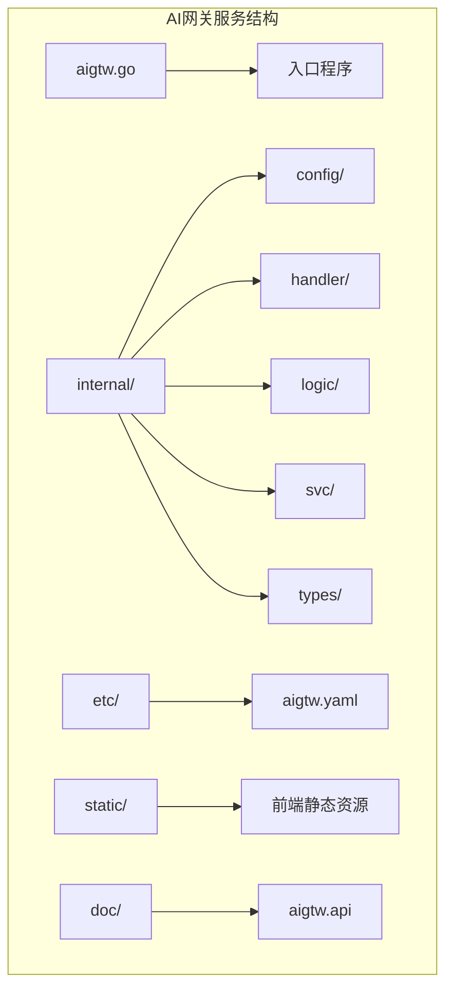
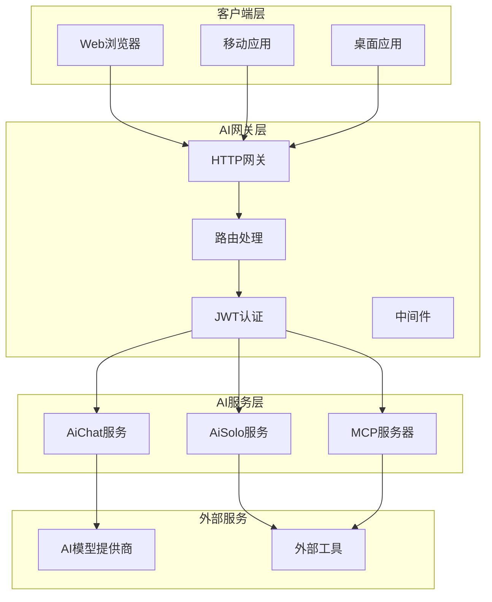
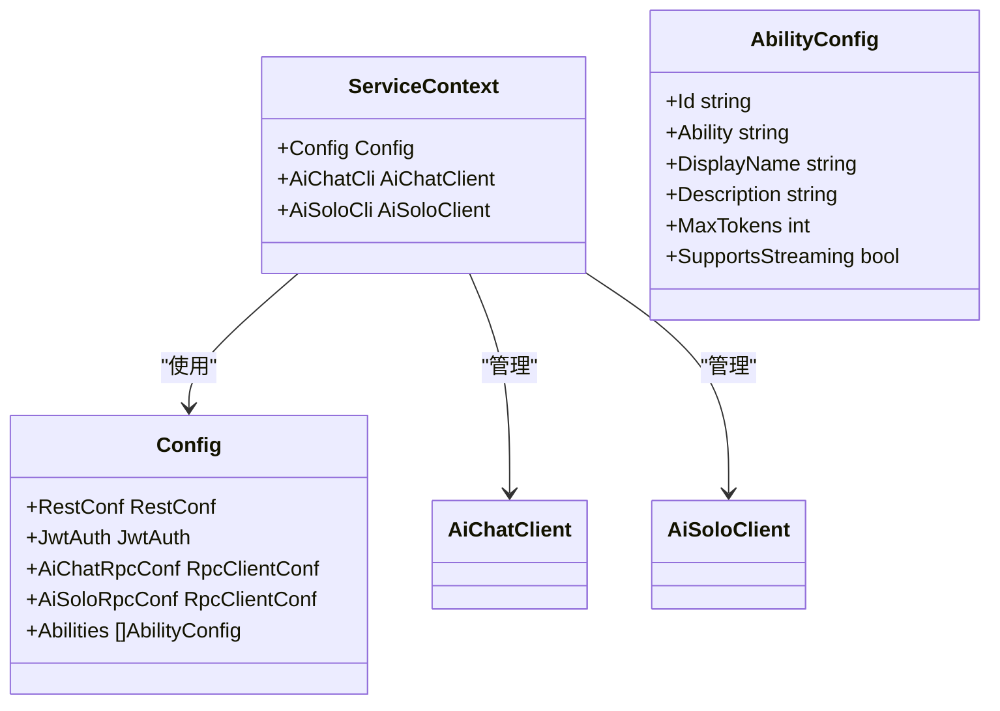
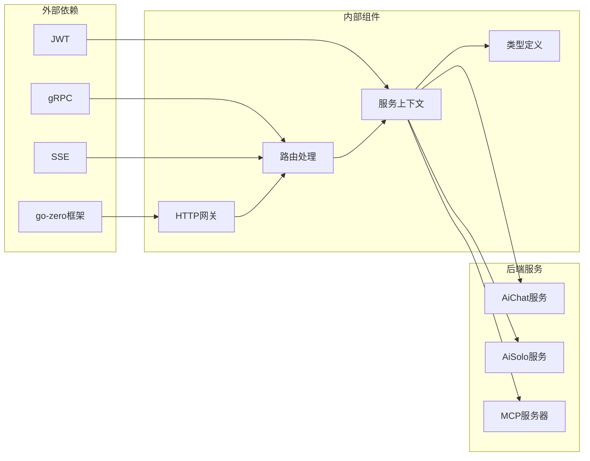

# AI网关服务

<cite>
**本文档引用的文件**
- [README.md](file://README.md)
- [aigtw.go](file://aiapp/aigtw/aigtw.go)
- [aigtw.yaml](file://aiapp/aigtw/etc/aigtw.yaml)
- [routes.go](file://aiapp/aigtw/internal/handler/routes.go)
- [servicecontext.go](file://aiapp/aigtw/internal/svc/servicecontext.go)
- [types.go](file://aiapp/aigtw/internal/types/types.go)
- [aigtw.api](file://aiapp/aigtw/doc/aigtw.api)
- [aichat.yaml](file://aiapp/aichat/etc/aichat.yaml)
- [config.go](file://aiapp/aichat/internal/config/config.go)
- [aisolo.yaml](file://aiapp/aisolo/etc/aisolo.yaml)
- [config.go](file://aiapp/aisolo/internal/config/config.go)
</cite>

## 目录
1. [简介](#简介)
2. [项目结构](#项目结构)
3. [核心组件](#核心组件)
4. [架构概览](#架构概览)
5. [详细组件分析](#详细组件分析)
6. [依赖关系分析](#依赖关系分析)
7. [性能考虑](#性能考虑)
8. [故障排除指南](#故障排除指南)
9. [结论](#结论)

## 简介

AI网关服务是基于go-zero微服务框架构建的AI应用网关，提供OpenAI兼容的API接口，支持对话补全、模型管理、异步工具调用以及AI Solo智能助手功能。该服务作为统一的API入口，聚合多个AI后端服务，为前端应用提供标准化的AI服务能力。

AI网关服务的核心特性包括：
- OpenAI兼容的REST API接口
- JWT身份认证和授权
- SSE流式响应支持
- 异步任务管理和状态查询
- 多后端AI模型支持
- MCP工具集成
- AI Solo智能助手协议

## 项目结构

AI网关服务位于`aiapp/aigtw`目录下，采用标准的go-zero项目结构：

**图表来源**
- [aigtw.go:1-127](file://aiapp/aigtw/aigtw.go#L1-L127)
- [routes.go:1-162](file://aiapp/aigtw/internal/handler/routes.go#L1-L162)

**章节来源**
- [aigtw.go:1-127](file://aiapp/aigtw/aigtw.go#L1-L127)
- [aigtw.yaml:1-29](file://aiapp/aigtw/etc/aigtw.yaml#L1-L29)

## 核心组件

AI网关服务由以下核心组件构成：

### 1. 服务配置组件
负责管理AI网关的运行配置，包括JWT认证、RPC客户端配置、模型能力等。

### 2. HTTP路由组件
定义了完整的API路由表，支持多种AI相关的REST接口。

### 3. 服务上下文组件
管理gRPC客户端连接，包括AiChat和AiSolo服务的客户端实例。

### 4. 类型定义组件
提供完整的数据传输对象定义，确保前后端数据交换的一致性。

**章节来源**
- [config.go:1-30](file://aiapp/aigtw/internal/config/config.go#L1-L30)
- [servicecontext.go:1-34](file://aiapp/aigtw/internal/svc/servicecontext.go#L1-L34)
- [types.go:1-324](file://aiapp/aigtw/internal/types/types.go#L1-L324)

## 架构概览

AI网关服务采用分层架构设计，通过统一的HTTP入口提供多种AI服务能力：

**图表来源**
- [aigtw.go:34-126](file://aiapp/aigtw/aigtw.go#L34-L126)
- [servicecontext.go:20-33](file://aiapp/aigtw/internal/svc/servicecontext.go#L20-L33)

## 详细组件分析

### 1. HTTP路由系统

AI网关定义了两套主要的API前缀：

#### Pass组接口（ai/v1）
- `/models` - 列出所有可用模型
- `/chat/completions` - 对话补全
- `/async/tool/call` - 异步工具调用
- `/async/tool/result/:task_id` - 查询异步工具结果
- `/async/tool/results` - 分页查询异步结果列表
- `/async/tool/stats` - 获取异步结果统计信息

#### Solo组接口（solo/v1）
- `/modes` - 列出所有模式
- `/skills` - 列出技能目录元数据
- `/sessions` - 会话管理相关操作
- `/interrupt/:interruptId` - 中断详情获取
- `/interrupt/:interruptId/resume` - 中断恢复
- `/chat` - 流式对话（请求体字段 `uiLang` 可选，透传 aisolo `AskReq.ui_lang`）
- `/rag/collections` - 创建（POST）/ 列出（GET）向量集合
- `/rag/collections/:collectionId` - 删除集合（DELETE）
- `/rag/collections/:collectionId/ingest` - 文本入库（POST）
- `/rag/collections/:collectionId/sources` - 列出来源（GET）
- `/rag/collections/:collectionId/sources/:sourceId` - 删除来源（DELETE）
- `/rag/collections/:collectionId/query` - 向量检索（POST）

**章节来源**
- [routes.go](file://aiapp/aigtw/internal/handler/routes.go)
- [aigtw.api](file://aiapp/aigtw/doc/aigtw.api)

### 2. 服务上下文管理

服务上下文负责管理gRPC客户端连接，确保AI网关能够与后端服务进行通信：

**图表来源**
- [servicecontext.go:13-33](file://aiapp/aigtw/internal/svc/servicecontext.go#L13-L33)
- [config.go:20-29](file://aiapp/aigtw/internal/config/config.go#L20-L29)

**章节来源**
- [servicecontext.go:1-34](file://aiapp/aigtw/internal/svc/servicecontext.go#L1-L34)
- [config.go:1-30](file://aiapp/aigtw/internal/config/config.go#L1-L30)

### 3. 数据类型定义

AI网关提供了完整的数据传输对象定义，涵盖对话补全、异步工具调用、AI Solo等多个方面：

#### 对话补全相关类型
- `ChatCompletionRequest` - 对话补全请求
- `ChatCompletionResponse` - 对话补全响应
- `ChatCompletionChunk` - SSE流式响应块
- `ChatMessage` - 聊天消息结构

#### 异步工具调用类型
- `AsyncToolCallRequest` - 异步工具调用请求
- `AsyncToolCallResponse` - 异步工具调用响应
- `AsyncToolResultResponse` - 异步工具结果响应
- `AsyncResultStatsResponse` - 异步结果统计信息

#### AI Solo相关类型
- `SoloChatRequest` - AI Solo对话请求
- `SoloSessionInfo` - 会话信息结构
- `SoloInterruptInfo` - 中断信息结构
- `SoloSkillInfo` - 技能信息结构

**章节来源**
- [types.go:38-324](file://aiapp/aigtw/internal/types/types.go#L38-L324)

### 4. 配置管理系统

AI网关支持灵活的配置管理，包括JWT认证、RPC客户端配置、模型能力等：

#### JWT认证配置
- `AccessSecret` - JWT访问密钥
- `ClaimMapping` - JWT声明映射配置

#### RPC客户端配置
- `AiChatRpcConf` - AiChat服务RPC配置
- `AiSoloRpcConf` - AiSolo服务RPC配置

#### 模型能力配置
- `Abilities` - 可用能力列表
- `AbilityConfig` - 能力配置结构

**章节来源**
- [aigtw.yaml:12-28](file://aiapp/aigtw/etc/aigtw.yaml#L12-L28)
- [config.go:20-29](file://aiapp/aigtw/internal/config/config.go#L20-L29)

## 依赖关系分析

AI网关服务的依赖关系体现了清晰的分层架构：

**图表来源**
- [aigtw.go:15-30](file://aiapp/aigtw/aigtw.go#L15-L30)
- [servicecontext.go:3-11](file://aiapp/aigtw/internal/svc/servicecontext.go#L3-L11)

**章节来源**
- [aigtw.go:15-30](file://aiapp/aigtw/aigtw.go#L15-L30)
- [servicecontext.go:3-11](file://aiapp/aigtw/internal/svc/servicecontext.go#L3-L11)

## 性能考虑

AI网关服务在设计时充分考虑了性能优化：

### 1. 连接池管理
- 使用gRPC连接池减少连接建立开销
- 支持非阻塞RPC调用
- 配置合理的超时时间

### 2. 缓存策略
- JWT令牌缓存
- 模型配置缓存
- 前端静态资源缓存

### 3. 流式处理
- SSE流式响应支持
- 异步任务处理
- 分页查询优化

### 4. 资源管理
- 连接数限制
- 内存使用控制
- 并发请求限制

## 故障排除指南

### 1. 常见问题诊断

#### JWT认证失败
- 检查`AIGTW_JWT_ACCESS_SECRET`环境变量
- 验证JWT令牌格式和有效期
- 确认Claim映射配置正确

#### RPC连接异常
- 检查AiChat服务端口（23001）
- 验证AiSolo服务端口（23002）
- 确认网络连通性和防火墙设置

#### SSE连接问题
- 检查浏览器对SSE的支持
- 验证服务器端SSE配置
- 确认超时设置合理

**章节来源**
- [aigtw.go:42-48](file://aiapp/aigtw/aigtw.go#L42-L48)
- [aigtw.yaml:19-28](file://aiapp/aigtw/etc/aigtw.yaml#L19-L28)

### 2. 日志和监控

AI网关提供详细的日志记录功能：
- 请求ID跟踪
- JWT认证日志
- RPC调用日志
- 错误处理日志

### 3. 性能监控指标
- 请求响应时间
- 并发连接数
- 错误率统计
- 资源使用情况

## 结论

AI网关服务是一个功能完整、架构清晰的AI应用网关系统。它通过统一的API接口为前端应用提供了丰富的AI服务能力，包括对话补全、模型管理、异步工具调用和智能助手等功能。

该服务的主要优势包括：
- **标准化接口**：提供OpenAI兼容的API，降低集成成本
- **灵活配置**：支持多种认证方式和配置选项
- **高性能设计**：采用连接池、流式处理等优化技术
- **可扩展性**：模块化设计便于功能扩展和维护

未来可以考虑的功能增强：
- 更完善的错误处理机制
- 增强的监控和告警功能
- 更灵活的路由和中间件系统
- 支持更多的AI模型提供商