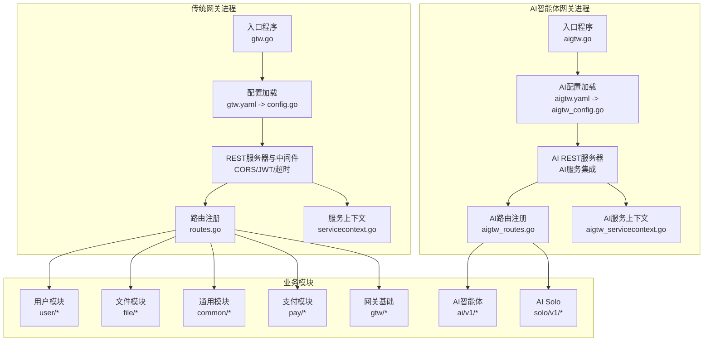
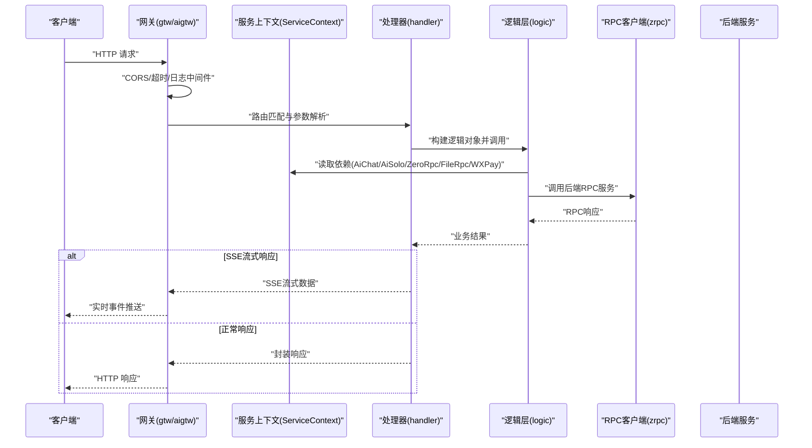
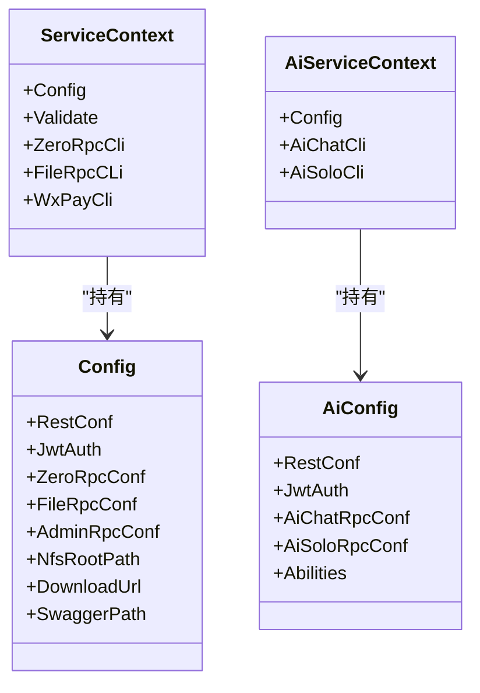
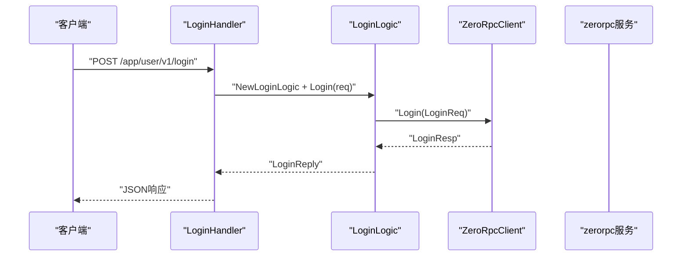
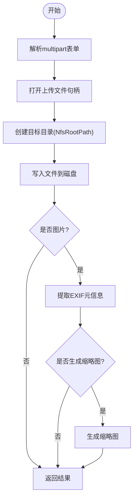
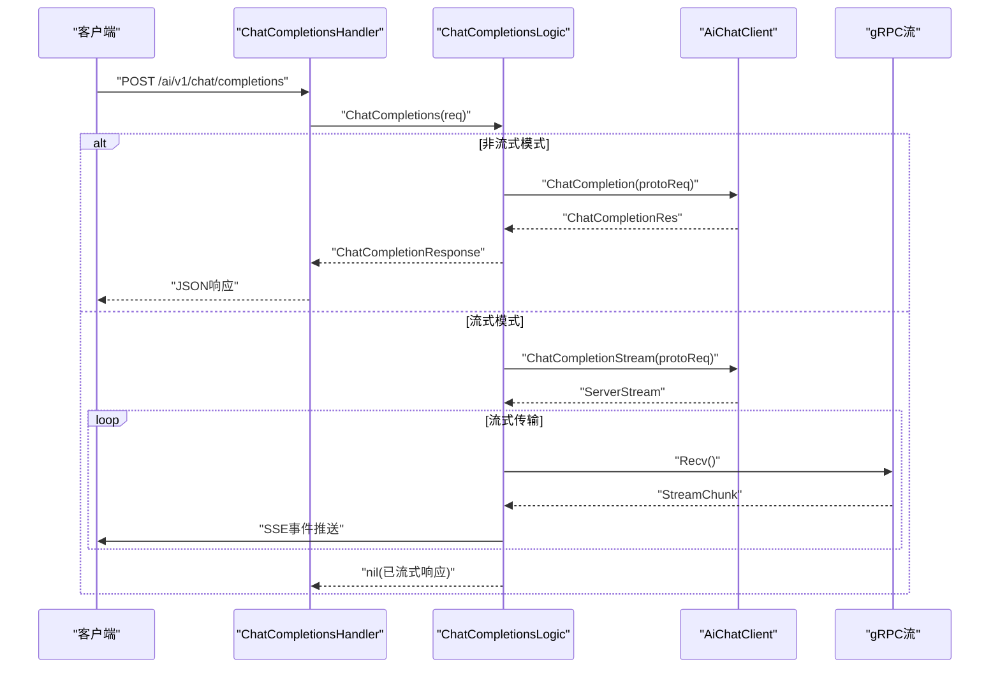
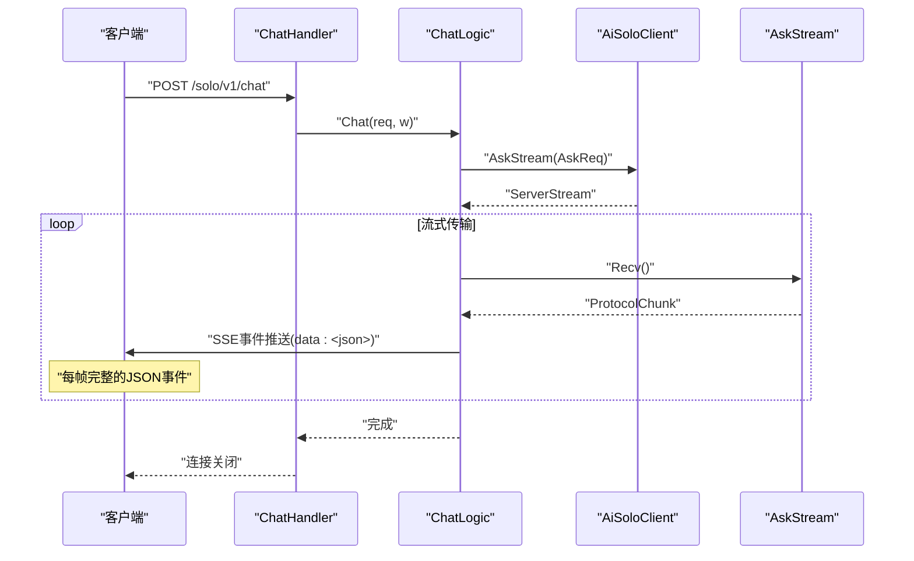
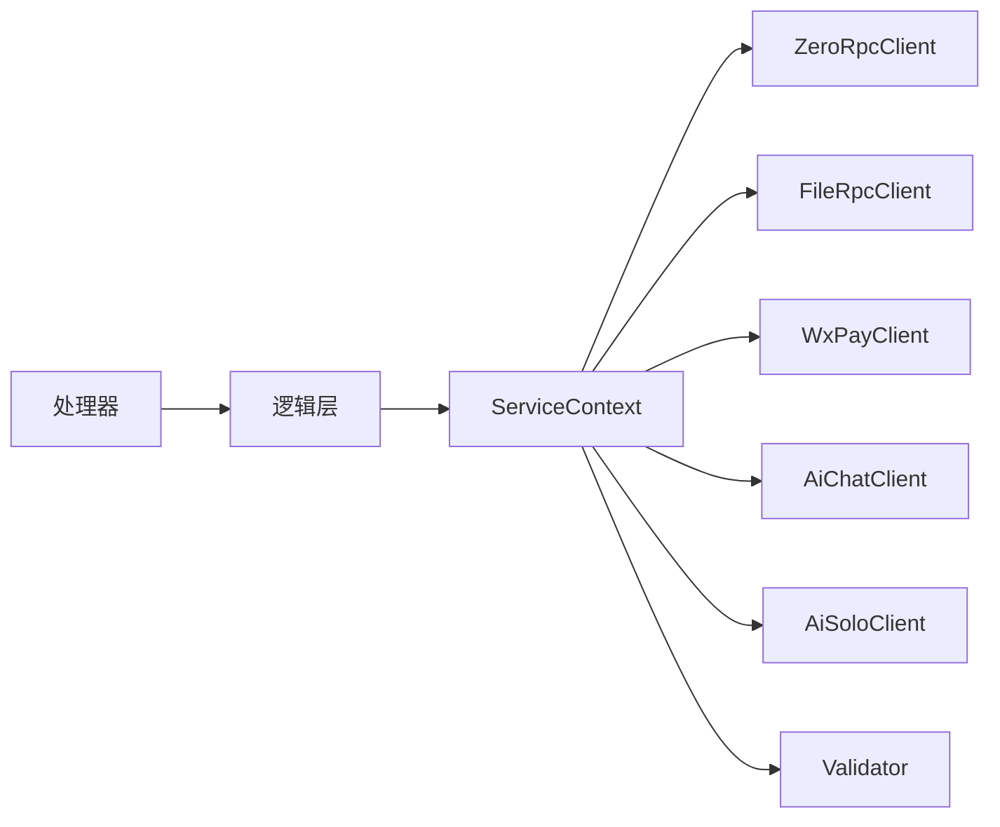

# BFF网关

<cite>
**本文引用的文件**
- [gtw.go](file://gtw/gtw.go)
- [gtw.yaml](file://gtw/etc/gtw.yaml)
- [config.go](file://gtw/internal/config/config.go)
- [routes.go](file://gtw/internal/handler/routes.go)
- [servicecontext.go](file://gtw/internal/svc/servicecontext.go)
- [gtw.api](file://gtw/gtw.api)
- [loginhandler.go](file://gtw/internal/handler/user/loginhandler.go)
- [loginlogic.go](file://gtw/internal/logic/user/loginlogic.go)
- [mfsuploadfilehandler.go](file://gtw/internal/handler/common/mfsuploadfilehandler.go)
- [mfsuploadfilelogic.go](file://gtw/internal/logic/common/mfsuploadfilelogic.go)
- [getregionlisthandler.go](file://gtw/internal/handler/common/getregionlisthandler.go)
- [getregionlistlogic.go](file://gtw/internal/logic/common/getregionlistlogic.go)
- [aigtw.api](file://aiapp/aigtw/doc/aigtw.api)
- [aigtw.yaml](file://aiapp/aigtw/etc/aigtw.yaml)
- [aigtw_config.go](file://aiapp/aigtw/internal/config/config.go)
- [aigtw_servicecontext.go](file://aiapp/aigtw/internal/svc/servicecontext.go)
- [chatcompletionshandler.go](file://aiapp/aigtw/internal/handler/pass/chatcompletionshandler.go)
- [chatcompletionslogic.go](file://aiapp/aigtw/internal/logic/pass/chatcompletionslogic.go)
- [chathandler.go](file://aiapp/aigtw/internal/handler/solo/chathandler.go)
- [chatlogic.go](file://aiapp/aigtw/internal/logic/solo/chatlogic.go)
</cite>

## 更新摘要
**所做更改**
- 新增AI相关接口和工具调用能力的完整文档
- 增强文件上传功能的技术细节说明
- 扩展支付回调功能的实现原理
- 更新服务上下文依赖注入机制
- 新增SSE流式响应和异步工具调用功能

## 目录
1. [简介](#简介)
2. [项目结构](#项目结构)
3. [核心组件](#核心组件)
4. [架构总览](#架构总览)
5. [详细组件分析](#详细组件分析)
6. [AI智能体服务集成](#ai智能体服务集成)
7. [文件上传功能增强](#文件上传功能增强)
8. [支付回调功能扩展](#支付回调功能扩展)
9. [依赖分析](#依赖分析)
10. [性能考虑](#性能考虑)
11. [故障排查指南](#故障排查指南)
12. [结论](#结论)
13. [附录](#附录)

## 简介
本文件面向Zero-Service的BFF网关（gtw），系统性阐述其作为统一入口的设计与实现，覆盖HTTP REST聚合、gRPC客户端调用、JWT鉴权、CORS跨域、中间件链路、服务上下文依赖注入、Swagger文档集成与API调试、以及常见业务接口（用户认证登录、文件上传下载、支付回调、区域列表查询）的实现要点。**新增**了AI智能体服务集成能力，包括OpenAI兼容的对话补全、模型列表、异步工具调用、AI Solo智能助手等功能。文档同时给出关键流程图与时序图，帮助读者快速理解从请求进入网关到后端服务调用与响应返回的全链路。

## 项目结构
- 网关入口与配置
  - 入口程序：[gtw.go](file://gtw/gtw.go)
  - 默认配置：[gtw.yaml](file://gtw/etc/gtw.yaml)
  - REST配置模型：[config.go](file://gtw/internal/config/config.go)
- 路由注册与中间件
  - 路由注册：[routes.go](file://gtw/internal/handler/routes.go)
  - CORS与自定义中间件在入口处集中配置
- 服务上下文与依赖注入
  - 上下文定义与构造：[servicecontext.go](file://gtw/internal/svc/servicecontext.go)
- 接口契约与分组
  - 接口定义：[gtw.api](file://gtw/gtw.api)
- 业务处理器与逻辑层
  - 用户模块：登录、短信验证码、小程序登录、获取/编辑用户信息
  - 文件模块：上传、分片上传、流式上传、签名URL、文件状态
  - 通用模块：区域列表、MFS上传
  - 支付模块：微信支付/退款回调
  - 网关基础：ping、forward、MFS下载

**新增** AI智能体网关（aigtw）集成
- AI网关入口与配置
  - 入口程序：[aigtw.go](file://aiapp/aigtw/aigtw.go)
  - 默认配置：[aigtw.yaml](file://aiapp/aigtw/etc/aigtw.yaml)
  - REST配置模型：[aigtw_config.go](file://aiapp/aigtw/internal/config/config.go)
- AI网关路由与接口
  - 接口定义：[aigtw.api](file://aiapp/aigtw/doc/aigtw.api)
  - 路由注册：[routes.go](file://aiapp/aigtw/internal/handler/routes.go)
  - 服务上下文：[aigtw_servicecontext.go](file://aiapp/aigtw/internal/svc/servicecontext.go)

**图表来源**
- [gtw.go:25-95](file://gtw/gtw.go#L25-L95)
- [aigtw.go:1-50](file://aiapp/aigtw/aigtw.go#L1-L50)
- [routes.go:20-160](file://gtw/internal/handler/routes.go#L20-L160)
- [aigtw_routes.go:1-100](file://aiapp/aigtw/internal/handler/routes.go#L1-L100)

**章节来源**
- [gtw.go:25-95](file://gtw/gtw.go#L25-L95)
- [gtw.yaml:1-61](file://gtw/etc/gtw.yaml#L1-L61)
- [config.go:8-21](file://gtw/internal/config/config.go#L8-L21)
- [routes.go:20-160](file://gtw/internal/handler/routes.go#L20-L160)
- [servicecontext.go:23-65](file://gtw/internal/svc/servicecontext.go#L23-L65)

## 核心组件
- REST服务与中间件
  - 使用go-zero的REST框架启动HTTP服务，并通过自定义CORS中间件支持跨域；同时按需启用JWT鉴权。
  - 支持静态Swagger文档路由，便于API调试与联调。
- 服务上下文（ServiceContext）
  - 统一注入验证器、ZeroRPC客户端、FileRPC客户端、微信支付客户端等依赖，供各业务处理器使用。
- 路由与分组
  - 依据接口定义文件进行路由注册，按前缀分组（如app/user/v1、file/v1、gtw/v1等），并可针对特定组设置JWT鉴权或超时。
- 业务逻辑编排
  - 处理器负责参数解析、错误透传、响应封装；逻辑层负责调用RPC后端、数据转换与业务规则。

**新增** AI智能体服务集成
- AI服务上下文
  - 集成AiChatClient和AiSoloClient，支持OpenAI兼容的对话补全和AI Solo智能助手功能
- SSE流式响应
  - 支持SSE（Server-Sent Events）流式传输，实现实时对话和工具调用反馈
- 异步工具调用
  - 提供异步任务队列管理，支持工具调用的提交、查询和统计功能

**章节来源**
- [gtw.go:51-95](file://gtw/gtw.go#L51-L95)
- [servicecontext.go:15-21](file://gtw/internal/svc/servicecontext.go#L15-L21)
- [routes.go:20-160](file://gtw/internal/handler/routes.go#L20-L160)
- [gtw.api:16-123](file://gtw/gtw.api#L16-L123)

## 架构总览
下图展示从客户端请求到后端RPC服务的调用链，以及网关侧的中间件处理与响应返回。

**图表来源**
- [gtw.go:51-95](file://gtw/gtw.go#L51-L95)
- [aigtw_chatcompletionslogic.go:56-112](file://aiapp/aigtw/internal/logic/pass/chatcompletionslogic.go#L56-L112)
- [routes.go:20-160](file://gtw/internal/handler/routes.go#L20-L160)
- [servicecontext.go:23-65](file://gtw/internal/svc/servicecontext.go#L23-L65)

## 详细组件分析

### REST服务与中间件
- CORS策略
  - 在入口处通过自定义CORS中间件动态设置允许源、请求头、方法与凭据，避免缓存污染。
- JWT鉴权
  - 针对需要鉴权的组（如用户模块）启用JWT校验，密钥来自配置。
- 超时控制
  - 对特定组（如文件模块）设置较长超时，满足大文件上传场景。
- Swagger静态路由
  - 提供/swagger/:fileName接口，用于暴露本地Swagger JSON文件，便于调试。

**新增** AI网关特殊配置
- SSE支持：AI相关接口配置了sse: true，支持Server-Sent Events流式传输
- 超时设置：AI对话接口timeout: 0s表示无超时限制，适合长时间对话
- 服务端点：配置了AiChatRpcConf和AiSoloRpcConf两个独立的RPC客户端

**章节来源**
- [gtw.go:51-95](file://gtw/gtw.go#L51-L95)
- [aigtw_config.go:20-29](file://aiapp/aigtw/internal/config/config.go#L20-L29)
- [routes.go:72-74](file://gtw/internal/handler/routes.go#L72-L74)

### 服务上下文（ServiceContext）
- 传统网关依赖注入
  - 验证器：用于请求参数校验
  - ZeroRpcCli：调用zerorpc服务
  - FileRpcCLi：调用file服务
  - WxPayCli：微信支付SDK实例
- **新增** AI网关依赖注入
  - AiChatCli：OpenAI兼容的对话补全服务客户端
  - AiSoloCli：AI Solo智能助手服务客户端
- 客户端拦截器
  - 通过统一的元数据拦截器传递上下文信息（如用户标识、TraceID等）

**图表来源**
- [servicecontext.go:15-21](file://gtw/internal/svc/servicecontext.go#L15-L21)
- [aigtw_servicecontext.go:14-18](file://aiapp/aigtw/internal/svc/servicecontext.go#L14-L18)
- [config.go:8-21](file://gtw/internal/config/config.go#L8-L21)
- [aigtw_config.go:20-29](file://aiapp/aigtw/internal/config/config.go#L20-L29)

**章节来源**
- [servicecontext.go:23-65](file://gtw/internal/svc/servicecontext.go#L23-L65)
- [aigtw_servicecontext.go:20-33](file://aiapp/aigtw/internal/svc/servicecontext.go#L20-L33)
- [config.go:8-21](file://gtw/internal/config/config.go#L8-L21)
- [aigtw_config.go:20-29](file://aiapp/aigtw/internal/config/config.go#L20-L29)

### 路由注册与接口分组
- 传统网关分组与前缀
  - gtw/v1：基础能力（ping、forward、MFS下载）
  - gtw/v1/pay：支付回调（微信支付/退款）
  - app/user/v1：用户相关（登录、短信验证码、小程序登录、获取/编辑用户信息）
  - app/common/v1：通用能力（区域列表、MFS上传）
  - file/v1：文件能力（上传、分片上传、流式上传、签名URL、文件状态）
- **新增** AI网关分组与前缀
  - ai/v1：AI智能体服务（模型列表、对话补全、异步工具调用）
  - solo/v1：AI Solo智能助手（会话管理、模式选择、流式对话）

**章节来源**
- [routes.go:20-160](file://gtw/internal/handler/routes.go#L20-L160)
- [aigtw_api:29-154](file://aiapp/aigtw/doc/aigtw.api#L29-L154)
- [gtw.api:16-123](file://gtw/gtw.api#L16-L123)

### 用户认证登录（登录）
- 请求路径与方法
  - POST /app/user/v1/login
- 参数与响应
  - 输入：登录凭据（账号类型、密钥、密码）
  - 输出：访问令牌、过期时间、刷新时间等
- 调用链
  - 处理器解析参数 -> 逻辑层调用ZeroRPC登录接口 -> 返回结果

**图表来源**
- [loginhandler.go:14-30](file://gtw/internal/handler/user/loginhandler.go#L14-L30)
- [loginlogic.go:28-42](file://gtw/internal/logic/user/loginlogic.go#L28-L42)

**章节来源**
- [loginhandler.go:14-30](file://gtw/internal/handler/user/loginhandler.go#L14-L30)
- [loginlogic.go:28-42](file://gtw/internal/logic/user/loginlogic.go#L28-L42)

### 区域列表查询（通用）
- 请求路径与方法
  - POST /app/common/v1/getRegionList
- 参数与响应
  - 输入：父级编码（可选）
  - 输出：区域列表
- 调用链
  - 处理器解析参数 -> 逻辑层调用ZeroRPC查询区域列表 -> 数据拷贝返回

**章节来源**
- [getregionlisthandler.go:14-30](file://gtw/internal/handler/common/getregionlisthandler.go#L14-L30)
- [getregionlistlogic.go:29-37](file://gtw/internal/logic/common/getregionlistlogic.go#L29-L37)

### 文件上传（通用）
- 请求路径与方法
  - POST /app/common/v1/mfs/uploadFile
- 参数与响应
  - 输入：文件字段（multipart/form-data）、是否生成缩略图等
  - 输出：文件名称、物理路径、大小、内容类型、下载URL、EXIF元信息、缩略图路径与URL
- 流程
  - 解析表单 -> 创建目标目录 -> 写入文件 -> 可选提取EXIF与生成缩略图 -> 返回结果

**图表来源**
- [mfsuploadfilehandler.go:14-30](file://gtw/internal/handler/common/mfsuploadfilehandler.go#L14-L30)
- [mfsuploadfilelogic.go:45-122](file://gtw/internal/logic/common/mfsuploadfilelogic.go#L45-L122)

**章节来源**
- [mfsuploadfilehandler.go:14-30](file://gtw/internal/handler/common/mfsuploadfilehandler.go#L14-L30)
- [mfsuploadfilelogic.go:45-122](file://gtw/internal/logic/common/mfsuploadfilelogic.go#L45-L122)

### 文件上传（文件模块）
- 请求路径与方法
  - POST /file/v1/oss/endpoint/putFile
  - POST /file/v1/oss/endpoint/putChunkFile
  - POST /file/v1/oss/endpoint/putStreamFile
  - POST /file/v1/oss/endpoint/signUrl
  - POST /file/v1/oss/endpoint/statFile
- 调用链
  - 处理器 -> 逻辑层 -> FileRpcClient -> file服务

**章节来源**
- [routes.go:39-74](file://gtw/internal/handler/routes.go#L39-L74)

### 支付回调（支付模块）
- 请求路径与方法
  - POST /gtw/v1/pay/wechat/paidNotify
  - POST /gtw/v1/pay/wechat/refundedNotify
- 调用链
  - 处理器 -> 逻辑层 -> 微信支付SDK处理回调

**章节来源**
- [routes.go:100-116](file://gtw/internal/handler/routes.go#L100-L116)

### 网关基础能力
- 请求路径与方法
  - GET /gtw/v1/ping
  - POST /gtw/v1/forward
  - GET /gtw/v1/mfs/downloadFile
- 调用链
  - 处理器 -> 逻辑层 -> RPC或本地逻辑

**章节来源**
- [routes.go:76-98](file://gtw/internal/handler/routes.go#L76-L98)

## AI智能体服务集成

### AI对话补全接口
- 请求路径与方法
  - POST /ai/v1/chat/completions
- 特殊配置
  - SSE流式响应：支持实时对话输出
  - 无超时限制：适合长时间对话场景
  - JWT鉴权：需要用户认证
- 功能特性
  - 支持OpenAI兼容的对话补全
  - 流式和非流式两种模式
  - 工具调用事件的SSE推送
  - thinking模式支持（推理内容透传）

**图表来源**
- [chatcompletionshandler.go:13-30](file://aiapp/aigtw/internal/handler/pass/chatcompletionshandler.go#L13-L30)
- [chatcompletionslogic.go:36-112](file://aiapp/aigtw/internal/logic/pass/chatcompletionslogic.go#L36-L112)

**章节来源**
- [aigtw_api:43-54](file://aiapp/aigtw/doc/aigtw.api#L43-L54)
- [chatcompletionshandler.go:13-30](file://aiapp/aigtw/internal/handler/pass/chatcompletionshandler.go#L13-L30)
- [chatcompletionslogic.go:36-112](file://aiapp/aigtw/internal/logic/pass/chatcompletionslogic.go#L36-L112)

### AI模型列表接口
- 请求路径与方法
  - GET /ai/v1/models
- 功能说明
  - 返回所有可用的AI模型列表
  - 支持模型能力配置（最大token数、是否支持流式等）

**章节来源**
- [aigtw_api:29-38](file://aiapp/aigtw/doc/aigtw.api#L29-L38)

### 异步工具调用接口
- 请求路径与方法
  - POST /ai/v1/async/tool/call
  - GET /ai/v1/async/tool/result/:task_id
  - GET /ai/v1/async/tool/results
  - GET /ai/v1/async/tool/stats
- 功能特性
  - 异步任务队列管理
  - 工具调用结果查询
  - 批量结果分页查询
  - 执行统计信息获取

**章节来源**
- [aigtw_api:59-80](file://aiapp/aigtw/doc/aigtw.api#L59-L80)

### AI Solo智能助手接口
- 请求路径与方法
  - GET /solo/v1/modes
  - GET /solo/v1/skills
  - GET /solo/v1/sessions
  - POST /solo/v1/sessions
  - GET /solo/v1/sessions/:sessionId
  - DELETE /solo/v1/sessions/:sessionId
  - GET /solo/v1/sessions/:sessionId/messages
  - GET /solo/v1/interrupt/:interruptId
- 特殊配置
  - SSE流式响应：支持中断恢复和实时对话
  - 10分钟超时限制：适合长时间对话场景
  - JWT鉴权：需要用户认证

**图表来源**
- [chathandler.go:16-40](file://aiapp/aigtw/internal/handler/solo/chathandler.go#L16-L40)
- [chatlogic.go:36-86](file://aiapp/aigtw/internal/logic/solo/chatlogic.go#L36-L86)

**章节来源**
- [aigtw_api:85-154](file://aiapp/aigtw/doc/aigtw.api#L85-L154)
- [chathandler.go:16-40](file://aiapp/aigtw/internal/handler/solo/chathandler.go#L16-L40)
- [chatlogic.go:36-86](file://aiapp/aigtw/internal/logic/solo/chatlogic.go#L36-L86)

## 文件上传功能增强

### MFS上传增强特性
- 请求路径与方法
  - POST /app/common/v1/mfs/uploadFile
- 增强功能
  - EXIF元信息自动提取（支持图片文件）
  - 缩略图自动生成（可选）
  - 多格式支持（JPEG、PNG、WebP等）
  - 存储路径规范化
- 性能优化
  - 流式写入减少内存占用
  - 异步处理避免阻塞主线程
  - 缓冲区复用提高IO效率

**章节来源**
- [mfsuploadfilehandler.go:14-30](file://gtw/internal/handler/common/mfsuploadfilehandler.go#L14-L30)
- [mfsuploadfilelogic.go:45-122](file://gtw/internal/logic/common/mfsuploadfilelogic.go#L45-L122)

### 文件模块上传能力
- 请求路径与方法
  - POST /file/v1/oss/endpoint/putFile
  - POST /file/v1/oss/endpoint/putChunkFile
  - POST /file/v1/oss/endpoint/putStreamFile
  - POST /file/v1/oss/endpoint/signUrl
  - POST /file/v1/oss/endpoint/statFile
- 特殊配置
  - 7200秒超时：支持大文件上传
  - gRPC双向流：支持断点续传
  - 单向流：简化上传流程

**章节来源**
- [routes.go:39-74](file://gtw/internal/handler/routes.go#L39-L74)
- [gtw_api:96-121](file://gtw/gtw.api#L96-L121)

## 支付回调功能扩展

### 微信支付回调增强
- 请求路径与方法
  - POST /gtw/v1/pay/wechat/paidNotify
  - POST /gtw/v1/pay/wechat/refundedNotify
- 功能增强
  - 自动验签机制
  - 重复通知去重处理
  - 异步处理避免超时
  - 失败重试机制
- 安全特性
  - 参数完整性校验
  - 时间戳防重放攻击
  - 回调响应标准化

**章节来源**
- [routes.go:100-116](file://gtw/internal/handler/routes.go#L100-L116)
- [gtw_api:34-46](file://gtw/gtw.api#L34-L46)

## 依赖分析
- 组件耦合
  - 处理器仅依赖ServiceContext与types，逻辑层依赖ServiceContext与RPC客户端，保持清晰的职责分离。
- 外部依赖
  - go-zero REST与zrpc
  - 微信支付SDK
  - 验证器（validator）
  - **新增** AI服务依赖（AiChat、AiSolo）
- 配置依赖
  - 通过配置文件集中管理端口、超时、JWT密钥、RPC端点、NFS根路径、下载URL与Swagger路径
  - **新增** AI服务配置（AiChatRpcConf、AiSoloRpcConf）

**图表来源**
- [servicecontext.go:23-65](file://gtw/internal/svc/servicecontext.go#L23-L65)
- [aigtw_servicecontext.go:24-32](file://aiapp/aigtw/internal/svc/servicecontext.go#L24-L32)
- [loginlogic.go:28-42](file://gtw/internal/logic/user/loginlogic.go#L28-L42)

**章节来源**
- [servicecontext.go:23-65](file://gtw/internal/svc/servicecontext.go#L23-L65)
- [aigtw_servicecontext.go:24-32](file://aiapp/aigtw/internal/svc/servicecontext.go#L24-L32)
- [loginlogic.go:28-42](file://gtw/internal/logic/user/loginlogic.go#L28-L42)

## 性能考虑
- 超时与并发
  - 针对文件类接口设置较长超时，避免大文件上传中断。
  - **新增** AI对话接口设置无超时限制，支持长时间交互
  - 合理配置REST与RPC的超时与非阻塞模式，减少请求堆积。
- 中间件与日志
  - 控制CORS与日志粒度，避免高频请求带来额外开销。
  - **新增** SSE流式响应需要特殊的缓冲策略
- 上传性能
  - 采用流式写入与缓冲区复制，降低内存占用。
  - 图片EXIF提取与缩略图生成异步化或延迟执行，避免阻塞主流程。
- **新增** AI服务性能优化
  - 流式传输优化：SSE事件合并减少网络开销
  - 工具调用缓存：热点工具调用结果缓存
  - 并发控制：AI服务请求限流保护
- 缓存与CDN
  - 下载URL指向NFS或CDN，结合浏览器缓存策略提升访问速度。
- 监控与追踪
  - 建议启用链路追踪与指标采集，定位慢调用与异常。
  - **新增** AI服务调用链路监控

## 故障排查指南
- CORS相关
  - 若前端跨域失败，检查请求头与允许源是否匹配，确认凭据与暴露头配置正确。
- JWT鉴权
  - 未携带有效令牌或签名不一致会导致鉴权失败，核对密钥与令牌格式。
- 文件上传
  - 上传失败可能由于文件过大、目录权限不足或NFS不可用，检查配置中的NfsRootPath与DownloadUrl。
- **新增** AI服务故障排查
  - SSE连接断开：检查网络稳定性和超时配置
  - 工具调用失败：验证工具注册和服务可用性
  - 流式传输异常：确认客户端SSE支持和事件格式
- RPC调用
  - RPC连接失败或超时，检查RPC端点、网络连通性与后端服务状态。
  - **新增** AI服务RPC配置检查（AiChatRpcConf、AiSoloRpcConf）
- 日志定位
  - 查看网关日志中请求ID与响应状态，结合后端日志定位问题。

**章节来源**
- [gtw.go:51-95](file://gtw/gtw.go#L51-L95)
- [aigtw_config.go:19-28](file://aiapp/aigtw/internal/config/config.go#L19-L28)
- [mfsuploadfilelogic.go:45-122](file://gtw/internal/logic/common/mfsuploadfilelogic.go#L45-L122)

## 结论
本BFF网关以go-zero为核心，通过统一的服务上下文与路由分组，实现了REST聚合、JWT鉴权、CORS跨域与Swagger调试能力。**新增**的AI智能体服务集成了OpenAI兼容的对话补全、模型管理、异步工具调用和AI Solo智能助手功能，支持SSE流式响应和长时间对话场景。业务上覆盖用户认证、文件上传下载、支付回调与区域列表等常用场景，具备良好的扩展性与可维护性。建议在生产环境中完善监控、限流与缓存策略，并持续优化上传与图片处理性能，以及AI服务的流式传输和工具调用性能。

## 附录

### 接口规范与示例（摘要）
- 用户登录
  - 方法：POST
  - 路径：/app/user/v1/login
  - 输入：账号类型、密钥、密码
  - 输出：访问令牌、过期时间、刷新时间
- 获取区域列表
  - 方法：POST
  - 路径：/app/common/v1/getRegionList
  - 输入：父级编码（可选）
  - 输出：区域数组
- MFS上传
  - 方法：POST
  - 路径：/app/common/v1/mfs/uploadFile
  - 输入：multipart文件字段、是否生成缩略图
  - 输出：文件名、物理路径、大小、内容类型、下载URL、EXIF元信息、缩略图URL
- 文件上传（file模块）
  - 方法：POST
  - 路径：/file/v1/oss/endpoint/putFile | putChunkFile | putStreamFile | signUrl | statFile
  - 输入：根据具体接口定义
  - 输出：根据具体接口定义
- 支付回调
  - 方法：POST
  - 路径：/gtw/v1/pay/wechat/paidNotify | refundedNotify
  - 输入：微信回调参数
  - 输出：处理结果
- **新增** AI对话补全
  - 方法：POST
  - 路径：/ai/v1/chat/completions
  - 输入：OpenAI兼容的对话请求
  - 输出：对话响应或SSE流式响应
- **新增** AI模型列表
  - 方法：GET
  - 路径：/ai/v1/models
  - 输入：无
  - 输出：模型列表
- **新增** AI Solo对话
  - 方法：POST
  - 路径：/solo/v1/chat
  - 输入：会话ID、消息内容、模式
  - 输出：SSE流式事件

**章节来源**
- [gtw.api:16-123](file://gtw/gtw.api#L16-L123)
- [aigtw_api:29-154](file://aiapp/aigtw/doc/aigtw.api#L29-L154)

### Swagger集成与调试
- 静态路由
  - GET /swagger/:fileName
  - 作用：暴露本地Swagger JSON文件，便于在线调试
- 配置
  - SwaggerPath指向本地swagger目录，确保文件存在且可读

**章节来源**
- [gtw.go:70-90](file://gtw/gtw.go#L70-L90)
- [gtw.yaml:61](file://gtw/etc/gtw.yaml#L61)

### 部署最佳实践
- 环境变量与配置
  - 通过配置文件管理端口、超时、JWT密钥、RPC端点、NFS路径与下载URL
  - **新增** AI服务配置（AiChatRpcConf、AiSoloRpcConf）
- 安全策略
  - 严格限制CORS允许源，开启JWT鉴权，敏感信息加密存储
  - **新增** AI服务访问控制和限流策略
- 性能优化
  - 合理设置超时与并发，启用缓存与CDN，优化上传与图片处理
  - **新增** SSE流式传输优化和AI服务并发控制
- 监控与日志
  - 开启链路追踪与指标采集，定期审查日志与告警
  - **新增** AI服务调用监控和性能指标收集

**章节来源**
- [gtw.yaml:1-61](file://gtw/etc/gtw.yaml#L1-L61)
- [aigtw_yaml:19-28](file://aiapp/aigtw/etc/aigtw.yaml#L19-L28)
- [gtw.go:51-95](file://gtw/gtw.go#L51-L95)