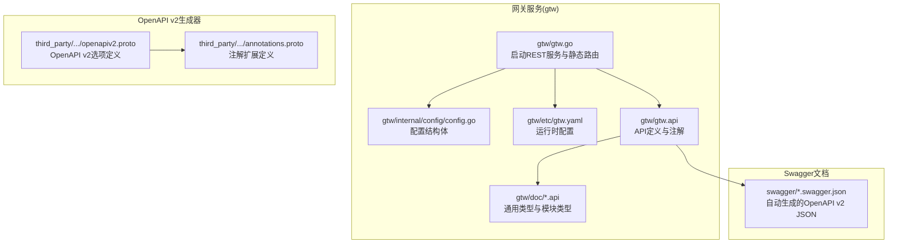
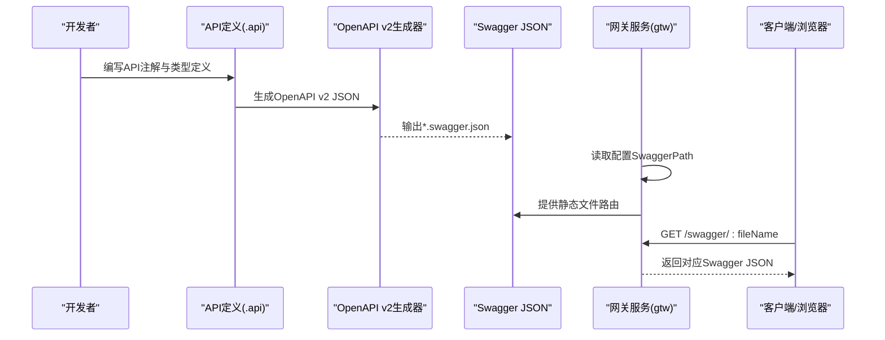
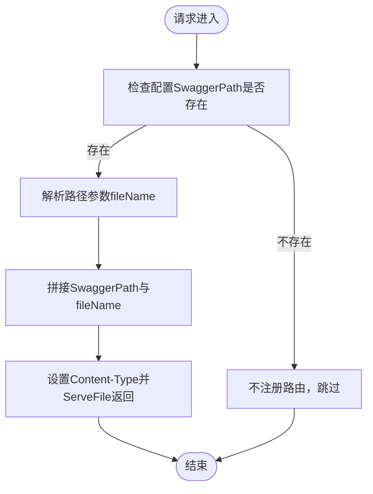
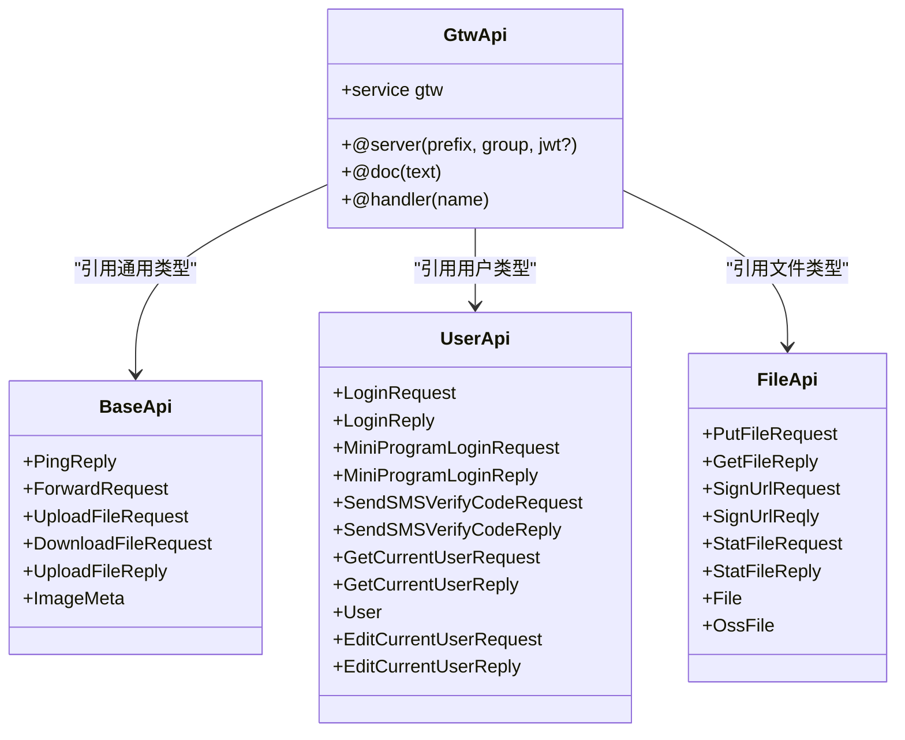
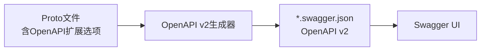
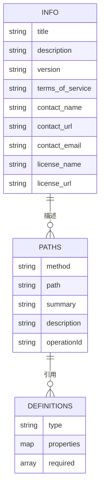
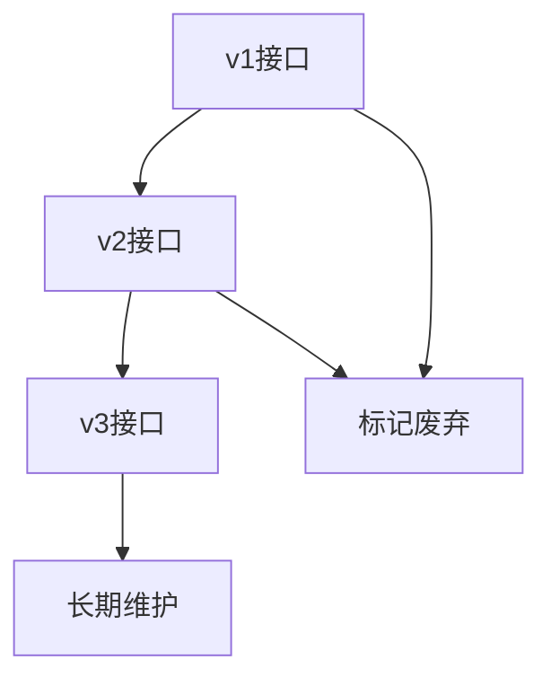
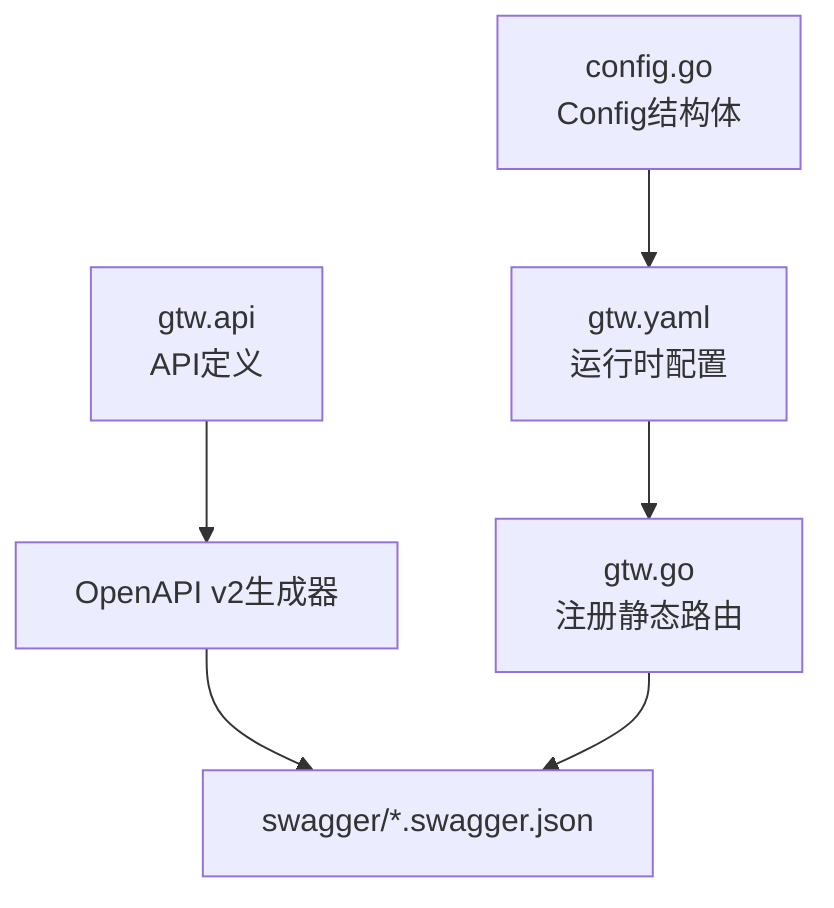

# Swagger集成

<cite>
**本文引用的文件**
- [gtw.go](file://gtw/gtw.go)
- [config.go](file://gtw/internal/config/config.go)
- [gtw.yaml](file://gtw/etc/gtw.yaml)
- [base.api](file://gtw/doc/base.api)
- [common.api](file://gtw/doc/common.api)
- [file.api](file://gtw/doc/file.api)
- [user.api](file://gtw/doc/user.api)
- [gtw.api](file://gtw/gtw.api)
- [bridgegtw.api](file://app/bridgegtw/bridgegtw.api)
- [bridgegtw.yaml](file://app/bridgegtw/etc/bridgegtw.yaml)
- [trigger.swagger.json](file://swagger/trigger.swagger.json)
- [xfusionmock.swagger.json](file://swagger/xfusionmock.swagger.json)
- [openapiv2.proto](file://third_party/protoc-gen-openapiv2/options/openapiv2.proto)
- [annotations.proto](file://third_party/protoc-gen-openapiv2/options/annotations.proto)
</cite>

## 目录
1. [简介](#简介)
2. [项目结构](#项目结构)
3. [核心组件](#核心组件)
4. [架构总览](#架构总览)
5. [详细组件分析](#详细组件分析)
6. [依赖关系分析](#依赖关系分析)
7. [性能考量](#性能考量)
8. [故障排查指南](#故障排查指南)
9. [结论](#结论)
10. [附录](#附录)

## 简介
本文件系统性阐述本仓库中的Swagger集成方案，覆盖以下方面：
- Swagger文档的自动生成机制：基于API注释规范与OpenAPI v2生成器，结合Go Zero框架的API定义与注解，自动产出可直接使用的Swagger JSON。
- 静态文件路由：通过网关服务暴露Swagger JSON文件，便于前端或工具直接访问。
- 文档结构设计：接口分组、参数说明、示例展示与响应模型的组织方式。
- Swagger UI集成：如何在现有服务中接入UI界面，以及主题与本地化的配置思路。
- 版本管理策略：API版本控制、兼容性处理与迁移指南。
- 使用示例：浏览器访问、接口测试与文档导出。
- 最佳实践与常见问题。

## 项目结构
围绕Swagger集成的关键目录与文件如下：
- 网关服务入口与配置
  - 网关主程序：gtw/gtw.go
  - 网关配置结构体：gtw/internal/config/config.go
  - 网关配置文件：gtw/etc/gtw.yaml
- API定义与注释
  - 网关聚合API：gtw/gtw.api
  - 通用类型与模块API：gtw/doc/*.api（如base.api、common.api、file.api、user.api）
  - 其他模块API示例：app/bridgegtw/bridgegtw.api
- Swagger文档
  - 自动生成的Swagger JSON：swagger/*.swagger.json
- OpenAPI v2生成器与扩展
  - OpenAPI v2选项定义：third_party/protoc-gen-openapiv2/options/openapiv2.proto
  - 注解扩展定义：third_party/protoc-gen-openapiv2/options/annotations.proto

图表来源
- [gtw.go:1-96](file://gtw/gtw.go#L1-L96)
- [config.go:1-21](file://gtw/internal/config/config.go#L1-L21)
- [gtw.yaml:1-61](file://gtw/etc/gtw.yaml#L1-L61)
- [gtw.api:1-123](file://gtw/gtw.api#L1-L123)
- [base.api:1-51](file://gtw/doc/base.api#L1-L51)
- [trigger.swagger.json:1-50](file://swagger/trigger.swagger.json#L1-L50)
- [openapiv2.proto:1-522](file://third_party/protoc-gen-openapiv2/options/openapiv2.proto#L1-L522)
- [annotations.proto:1-51](file://third_party/protoc-gen-openapiv2/options/annotations.proto#L1-L51)

章节来源
- [gtw.go:1-96](file://gtw/gtw.go#L1-L96)
- [config.go:1-21](file://gtw/internal/config/config.go#L1-L21)
- [gtw.yaml:1-61](file://gtw/etc/gtw.yaml#L1-L61)
- [gtw.api:1-123](file://gtw/gtw.api#L1-L123)
- [base.api:1-51](file://gtw/doc/base.api#L1-L51)

## 核心组件
- 网关服务启动与静态路由
  - 在网关主程序中，根据配置动态注册Swagger JSON静态路由，实现对./swagger目录下文件的按文件名访问。
  - 路由规则：GET /swagger/:fileName，处理器负责解析路径参数、拼接文件路径并返回对应JSON。
- 配置驱动
  - 配置结构体包含SwaggerPath字段，用于指定Swagger JSON文件所在目录。
  - 网关配置文件中明确设置SwaggerPath为相对路径./swagger。
- API注释与类型定义
  - API定义文件采用统一语法，通过@doc、@handler、@server等注解描述接口行为、分组与前缀。
  - 类型定义文件集中声明请求/响应模型，为Swagger生成提供数据结构基础。
- OpenAPI v2生成器
  - 通过第三方OpenAPI v2选项与注解扩展，将Proto选项映射到OpenAPI v2元数据，从而生成符合标准的Swagger JSON。

章节来源
- [gtw.go:70-90](file://gtw/gtw.go#L70-L90)
- [config.go:19](file://gtw/internal/config/config.go#L19)
- [gtw.yaml:61](file://gtw/etc/gtw.yaml#L61)
- [gtw.api:1-123](file://gtw/gtw.api#L1-L123)
- [openapiv2.proto:19-130](file://third_party/protoc-gen-openapiv2/options/openapiv2.proto#L19-L130)
- [annotations.proto:10-44](file://third_party/protoc-gen-openapiv2/options/annotations.proto#L10-L44)

## 架构总览
下图展示了从API定义到Swagger JSON生成与访问的整体流程：

图表来源
- [gtw.go:70-90](file://gtw/gtw.go#L70-L90)
- [gtw.yaml:61](file://gtw/etc/gtw.yaml#L61)
- [openapiv2.proto:19-130](file://third_party/protoc-gen-openapiv2/options/openapiv2.proto#L19-L130)

## 详细组件分析

### 组件A：静态文件路由与Swagger JSON暴露
- 路由注册逻辑
  - 当配置中存在SwaggerPath时，注册GET /swagger/:fileName路由。
  - 处理器解析路径参数fileName，拼接至SwaggerPath形成最终文件路径。
  - 设置Content-Type为application/json，并通过http.ServeFile返回文件内容。
- 安全与健壮性
  - 解析失败时返回错误；未设置SwaggerPath时不注册该路由。
  - 文件路径通过filepath.Join拼接，避免路径穿越风险。
- 访问方式
  - 通过浏览器或HTTP客户端访问：GET {host}:{port}/swagger/{fileName}.swagger.json

图表来源
- [gtw.go:70-90](file://gtw/gtw.go#L70-L90)

章节来源
- [gtw.go:70-90](file://gtw/gtw.go#L70-L90)
- [config.go:19](file://gtw/internal/config/config.go#L19)
- [gtw.yaml:61](file://gtw/etc/gtw.yaml#L61)

### 组件B：API注释规范与文档模板
- API注释规范
  - @server：定义接口前缀、分组与鉴权策略（如jwt）。
  - @doc：为接口提供简短描述。
  - @handler：绑定具体处理器。
  - service与get/post等：定义资源与HTTP方法。
- 类型定义模板
  - 通过type块定义请求/响应模型，字段支持JSON标签与校验选项。
  - 通用类型集中在doc/base.api中，模块类型分别在各自*.api中定义。
- 示例
  - 网关聚合API示例：gtw/gtw.api
  - 用户模块API示例：gtw/doc/user.api
  - 文件模块API示例：gtw/doc/file.api
  - 通用类型示例：gtw/doc/base.api

图表来源
- [gtw.api:1-123](file://gtw/gtw.api#L1-L123)
- [base.api:1-51](file://gtw/doc/base.api#L1-L51)
- [user.api:1-47](file://gtw/doc/user.api#L1-L47)
- [file.api:1-60](file://gtw/doc/file.api#L1-L60)

章节来源
- [gtw.api:1-123](file://gtw/gtw.api#L1-L123)
- [base.api:1-51](file://gtw/doc/base.api#L1-L51)
- [user.api:1-47](file://gtw/doc/user.api#L1-L47)
- [file.api:1-60](file://gtw/doc/file.api#L1-L60)

### 组件C：OpenAPI v2生成器与注解扩展
- 生成器能力
  - 通过openapiv2.proto定义的Swagger、Operation、Info等消息体，将Proto选项转换为OpenAPI v2元数据。
  - annotations.proto定义了对文件、方法、消息、枚举、服务的扩展ID，使Proto能够携带OpenAPI元信息。
- 实践要点
  - 在Proto文件中使用相应扩展选项，生成时自动注入标题、版本、描述、联系人、许可、标签、操作摘要与响应等信息。
  - 生成的JSON遵循OpenAPI v2规范，可直接被Swagger UI消费。

图表来源
- [openapiv2.proto:19-130](file://third_party/protoc-gen-openapiv2/options/openapiv2.proto#L19-L130)
- [annotations.proto:10-44](file://third_party/protoc-gen-openapiv2/options/annotations.proto#L10-L44)

章节来源
- [openapiv2.proto:19-130](file://third_party/protoc-gen-openapiv2/options/openapiv2.proto#L19-L130)
- [annotations.proto:10-44](file://third_party/protoc-gen-openapiv2/options/annotations.proto#L10-L44)

### 组件D：API文档结构设计
- 接口分类
  - 通过@server(group)与前缀(prefix)对接口进行分组与命名空间划分。
  - 示例：用户组、支付组、通用组、文件组等。
- 参数说明
  - 请求参数通过form/json标签与注释描述用途与约束（如options、optional）。
  - 响应模型通过结构体字段与注释说明各字段含义。
- 示例展示
  - 在Swagger JSON中，definitions部分包含请求/响应模型的示例与必填字段标注。
  - 示例：xfusionmock.swagger.json中包含示例请求与响应模型。

图表来源
- [xfusionmock.swagger.json:1-122](file://swagger/xfusionmock.swagger.json#L1-L122)
- [trigger.swagger.json:1-50](file://swagger/trigger.swagger.json#L1-L50)

章节来源
- [xfusionmock.swagger.json:1-122](file://swagger/xfusionmock.swagger.json#L1-L122)
- [trigger.swagger.json:1-50](file://swagger/trigger.swagger.json#L1-L50)

### 组件E：Swagger UI集成与定制
- 集成方式
  - 将Swagger UI部署于独立静态服务器或作为网关的静态资源。
  - 在Swagger UI中指向网关提供的Swagger JSON地址（例如：/swagger/xxx.swagger.json）。
- 主题与本地化
  - 通过UI配置项调整外观与语言；若需本地化，可在UI构建时替换语言包或通过CDN引入对应语言资源。
- 注意事项
  - 确保跨域配置允许Swagger UI访问Swagger JSON。
  - 若Swagger JSON位于子路径，需同步调整UI的URL配置。

[本节为概念性说明，不直接分析具体文件，故无“章节来源”]

### 组件F：API版本管理策略
- 版本控制
  - 在API定义中通过@server(prefix)与info.version区分不同版本。
  - 示例：网关API使用prefix: gtw/v1、app/user/v1、app/common/v1等。
- 兼容性处理
  - 新增接口时保持旧接口不变；删除或变更接口时，保留旧版本并标注废弃。
- 迁移指南
  - 提供版本升级说明与迁移脚本；在Swagger中通过description与tags标识版本差异。
- 示例参考
  - 网关API版本：gtw/gtw.api
  - 模块API版本：app/bridgegtw/bridgegtw.api

图表来源
- [gtw.api:8-14](file://gtw/gtw.api#L8-L14)
- [bridgegtw.api:5-11](file://app/bridgegtw/bridgegtw.api#L5-L11)

章节来源
- [gtw.api:8-14](file://gtw/gtw.api#L8-L14)
- [bridgegtw.api:5-11](file://app/bridgegtw/bridgegtw.api#L5-L11)

## 依赖关系分析
- 组件耦合
  - 网关服务依赖配置结构体与配置文件；Swagger静态路由仅在配置存在时启用。
  - API定义文件依赖doc/*.api中的通用类型；Swagger JSON由生成器从API定义与Proto扩展生成。
- 外部依赖
  - OpenAPI v2生成器与注解扩展来自third_party目录，确保生成的JSON符合OpenAPI v2规范。
- 潜在循环依赖
  - 当前结构清晰，无循环导入；API定义与生成器相互独立。

图表来源
- [config.go:1-21](file://gtw/internal/config/config.go#L1-L21)
- [gtw.yaml:1-61](file://gtw/etc/gtw.yaml#L1-L61)
- [gtw.go:70-90](file://gtw/gtw.go#L70-L90)
- [gtw.api:1-123](file://gtw/gtw.api#L1-L123)
- [openapiv2.proto:19-130](file://third_party/protoc-gen-openapiv2/options/openapiv2.proto#L19-L130)

章节来源
- [config.go:1-21](file://gtw/internal/config/config.go#L1-L21)
- [gtw.yaml:1-61](file://gtw/etc/gtw.yaml#L1-L61)
- [gtw.go:70-90](file://gtw/gtw.go#L70-L90)
- [gtw.api:1-123](file://gtw/gtw.api#L1-L123)
- [openapiv2.proto:19-130](file://third_party/protoc-gen-openapiv2/options/openapiv2.proto#L19-L130)

## 性能考量
- 静态文件路由
  - 使用http.ServeFile高效传输文件，避免额外编码开销。
  - 合理设置文件缓存与压缩策略以提升传输效率。
- 生成与分发
  - 将Swagger JSON生成纳入CI流程，在构建阶段输出，减少运行时负担。
  - 对大型JSON进行gzip压缩，降低带宽占用。
- 访问优化
  - 将Swagger UI与Swagger JSON置于同一域名下，减少跨域复杂度。
  - 使用CDN加速Swagger UI与JSON的访问。

[本节提供一般性指导，不直接分析具体文件，故无“章节来源”]

## 故障排查指南
- 无法访问Swagger JSON
  - 检查配置文件中SwaggerPath是否正确设置且路径可读。
  - 确认网关已注册静态路由（当SwaggerPath为空时不会注册）。
- 跨域问题
  - 确保网关的CORS配置允许Swagger UI所在域名访问。
  - 检查Access-Control-Allow-Origin与Vary设置。
- 文件路径异常
  - 确认请求路径参数fileName与实际文件名一致，避免大小写与扩展名差异。
- 生成失败
  - 检查API定义与Proto扩展是否正确，确保生成器可用且版本匹配。

章节来源
- [gtw.go:70-90](file://gtw/gtw.go#L70-L90)
- [gtw.yaml:61](file://gtw/etc/gtw.yaml#L61)

## 结论
本仓库通过API注释规范、OpenAPI v2生成器与静态文件路由，实现了从API定义到Swagger JSON的自动化生成与访问。配合合理的版本管理策略与性能优化，可为团队提供稳定、易用的API文档体验。建议在CI中集成Swagger JSON生成，并在生产环境启用CORS与安全策略，确保文档访问的安全与高效。

[本节为总结性内容，不直接分析具体文件，故无“章节来源”]

## 附录

### 使用示例
- 浏览器访问API文档
  - 启动网关服务后，打开浏览器访问：GET {host}:{port}/swagger/{fileName}.swagger.json
  - 示例：GET http://localhost:11001/swagger/xfusionmock.swagger.json
- 接口测试
  - 在Swagger UI中选择对应接口，填写参数并执行请求，查看响应结果。
- 导出文档
  - 直接保存浏览器打开的Swagger JSON文件，或通过curl下载：curl -OJ http://localhost:11001/swagger/trigger.swagger.json

章节来源
- [gtw.yaml:61](file://gtw/etc/gtw.yaml#L61)
- [xfusionmock.swagger.json:1-122](file://swagger/xfusionmock.swagger.json#L1-L122)
- [trigger.swagger.json:1-50](file://swagger/trigger.swagger.json#L1-L50)