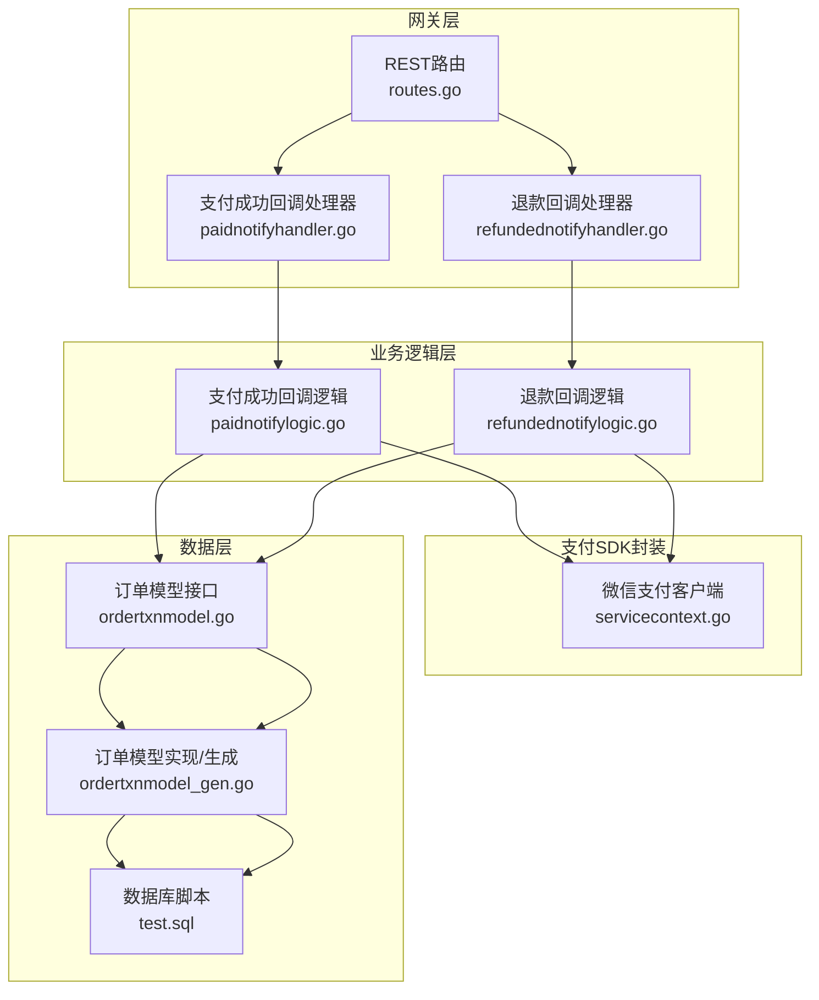
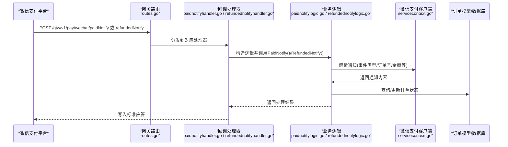
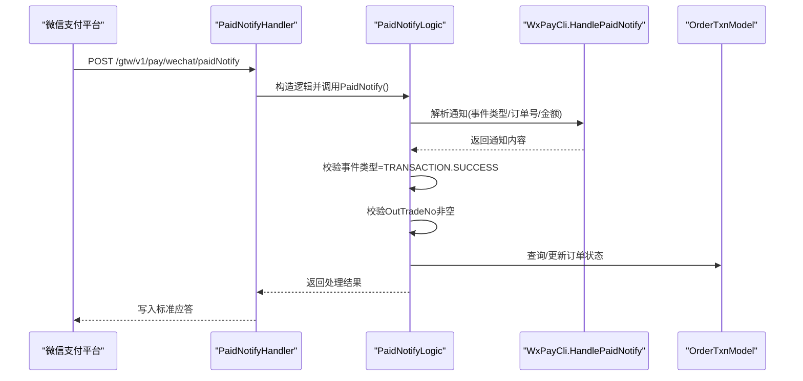
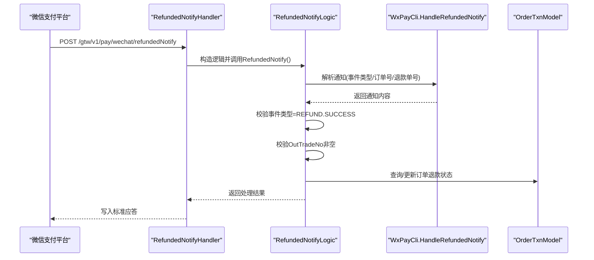
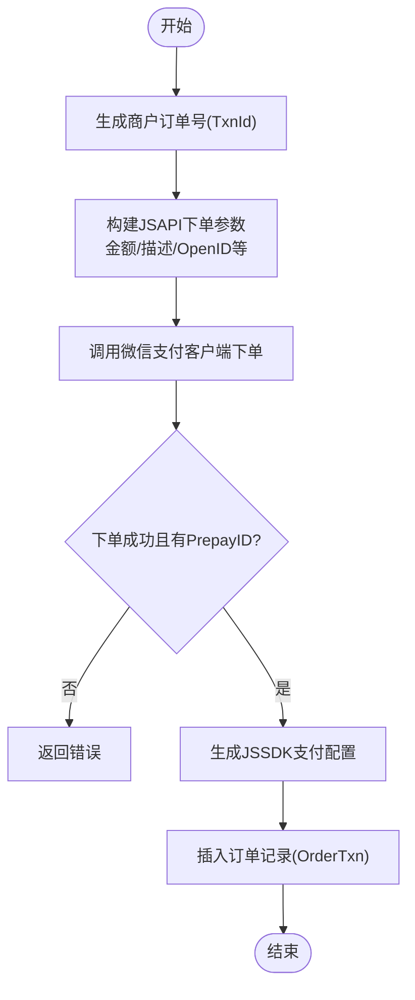
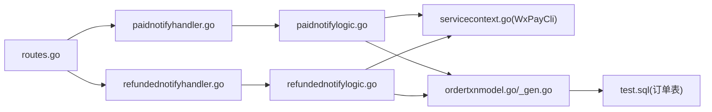

# 支付服务模块

<cite>
**本文引用的文件**
- [gtw.api](file://gtw/gtw.api)
- [routes.go](file://gtw/internal/handler/routes.go)
- [refundednotifyhandler.go](file://gtw/internal/handler/pay/refundednotifyhandler.go)
- [paidnotifyhandler.go](file://gtw/internal/handler/pay/paidnotifyhandler.go)
- [refundednotifylogic.go](file://gtw/internal/logic/pay/refundednotifylogic.go)
- [paidnotifylogic.go](file://gtw/internal/logic/pay/paidnotifylogic.go)
- [servicecontext.go](file://gtw/internal/svc/servicecontext.go)
- [config.go](file://gtw/internal/config/config.go)
- [types.go](file://gtw/internal/types/types.go)
- [wxpayjsapilogic.go](file://zerorpc/internal/logic/wxpayjsapilogic.go)
- [ordertxnmodel.go](file://model/ordertxnmodel.go)
- [ordertxnmodel_gen.go](file://model/ordertxnmodel_gen.go)
- [test.sql](file://model/sql/test.sql)
- [types.go](file://common/powerwechatx/types.go)
- [types.go](file://common/type.go)
</cite>

## 目录
1. [简介](#简介)
2. [项目结构](#项目结构)
3. [核心组件](#核心组件)
4. [架构总览](#架构总览)
5. [详细组件分析](#详细组件分析)
6. [依赖关系分析](#依赖关系分析)
7. [性能考量](#性能考量)
8. [故障排查指南](#故障排查指南)
9. [结论](#结论)
10. [附录](#附录)

## 简介
本文件为支付服务模块的详细API文档，聚焦于以下目标：
- 支付成功回调接口（微信支付通知）的接收、验证与处理流程
- 退款回调接口（微信退款通知）的状态同步、金额校验与业务处理
- 回调接口的安全机制：签名验证、重复通知防护与幂等性保障
- 支付状态查询与对账接口的实现原理与最佳实践
- 各接口的请求参数、响应格式、签名算法与错误处理机制
- 与第三方支付平台（以微信支付为例）的对接流程与集成示例
- 安全考虑、性能优化建议与常见问题解决方案

## 项目结构
支付能力主要由网关层路由与处理器、业务逻辑层、支付SDK封装、订单模型与数据库脚本构成。核心入口为REST路由注册，回调处理器通过ServiceContext注入的微信支付客户端进行通知解析与落库。

图表来源
- [routes.go:100-116](file://gtw/internal/handler/routes.go#L100-L116)
- [paidnotifyhandler.go:12-22](file://gtw/internal/handler/pay/paidnotifyhandler.go#L12-L22)
- [refundednotifyhandler.go:12-22](file://gtw/internal/handler/pay/refundednotifyhandler.go#L12-L22)
- [paidnotifylogic.go:32-61](file://gtw/internal/logic/pay/paidnotifylogic.go#L32-L61)
- [refundednotifylogic.go:32-53](file://gtw/internal/logic/pay/refundednotifylogic.go#L32-L53)
- [servicecontext.go:24-52](file://gtw/internal/svc/servicecontext.go#L24-L52)
- [ordertxnmodel.go:10-13](file://model/ordertxnmodel.go#L10-L13)
- [ordertxnmodel_gen.go:29-47](file://model/ordertxnmodel_gen.go#L29-L47)
- [test.sql:70-91](file://model/sql/test.sql#L70-L91)

章节来源
- [routes.go:100-116](file://gtw/internal/handler/routes.go#L100-L116)
- [gtw.api:38-46](file://gtw/gtw.api#L38-L46)

## 核心组件
- REST路由与处理器
  - 支付成功回调：POST /gtw/v1/pay/wechat/paidNotify
  - 退款回调：POST /gtw/v1/pay/wechat/refundedNotify
- 业务逻辑层
  - PaidNotifyLogic：解析微信支付通知，校验事件类型与订单号，写入日志并返回应答
  - RefundedNotifyLogic：解析微信退款通知，校验事件类型与订单号，写入日志并返回应答
- 支付SDK封装
  - ServiceContext中注入微信支付客户端，配置AppID、商户号、APIv3密钥、证书、通知URL、HTTP超时与日志驱动
- 数据层
  - 订单模型接口与实现，提供按商户订单号、微信订单号等维度的查询与更新
  - 数据库脚本定义交易订单表字段与索引

章节来源
- [routes.go:100-116](file://gtw/internal/handler/routes.go#L100-L116)
- [paidnotifylogic.go:13-30](file://gtw/internal/logic/pay/paidnotifylogic.go#L13-L30)
- [refundednotifylogic.go:13-30](file://gtw/internal/logic/pay/refundednotifylogic.go#L13-L30)
- [servicecontext.go:15-21](file://gtw/internal/svc/servicecontext.go#L15-L21)
- [ordertxnmodel.go:10-13](file://model/ordertxnmodel.go#L10-L13)
- [ordertxnmodel_gen.go:29-47](file://model/ordertxnmodel_gen.go#L29-L47)
- [test.sql:70-91](file://model/sql/test.sql#L70-L91)

## 架构总览
支付回调整体流程如下：
- 第三方支付平台向回调URL推送通知
- 网关层路由将请求转发至对应处理器
- 处理器构造逻辑对象，调用微信支付客户端解析通知
- 逻辑层根据事件类型与订单号进行业务处理（如查询订单、更新状态）
- 返回标准应答给第三方平台，确保其停止重试

图表来源
- [routes.go:100-116](file://gtw/internal/handler/routes.go#L100-L116)
- [paidnotifyhandler.go:12-22](file://gtw/internal/handler/pay/paidnotifyhandler.go#L12-L22)
- [refundednotifyhandler.go:12-22](file://gtw/internal/handler/pay/refundednotifyhandler.go#L12-L22)
- [paidnotifylogic.go:32-61](file://gtw/internal/logic/pay/paidnotifylogic.go#L32-L61)
- [refundednotifylogic.go:32-53](file://gtw/internal/logic/pay/refundednotifylogic.go#L32-L53)
- [servicecontext.go:24-52](file://gtw/internal/svc/servicecontext.go#L24-L52)

## 详细组件分析

### 支付成功回调接口（微信支付通知）
- 接口定义
  - 方法：POST
  - 路径：/gtw/v1/pay/wechat/paidNotify
  - 作用：接收微信支付成功通知，完成业务处理与落库
- 请求与响应
  - 请求：来自微信支付平台的XML/JSON通知体（由SDK内部解析）
  - 响应：标准应答，确保微信侧停止重试
- 处理流程
  - 事件类型校验：仅处理“TRANSACTION.SUCCESS”
  - 订单号校验：OutTradeNo非空才继续处理
  - 业务处理：记录日志，后续可扩展为查询订单、更新状态、异步任务等
  - 返回应答：通过SDK返回标准应答
- 错误处理
  - 解析失败或异常：记录错误日志并返回错误
  - 订单号为空：调用fail回调，避免微信重复通知
- 幂等性与重复通知防护
  - 建议：基于OutTradeNo与微信订单号建立去重表或使用数据库唯一约束；若已处理则直接返回成功应答

图表来源
- [paidnotifyhandler.go:12-22](file://gtw/internal/handler/pay/paidnotifyhandler.go#L12-L22)
- [paidnotifylogic.go:32-61](file://gtw/internal/logic/pay/paidnotifylogic.go#L32-L61)
- [servicecontext.go:24-52](file://gtw/internal/svc/servicecontext.go#L24-L52)
- [ordertxnmodel.go:10-13](file://model/ordertxnmodel.go#L10-L13)

章节来源
- [gtw.api:39-41](file://gtw/gtw.api#L39-L41)
- [routes.go:103-107](file://gtw/internal/handler/routes.go#L103-L107)
- [paidnotifyhandler.go:12-22](file://gtw/internal/handler/pay/paidnotifyhandler.go#L12-L22)
- [paidnotifylogic.go:32-61](file://gtw/internal/logic/pay/paidnotifylogic.go#L32-L61)

### 退款回调接口（微信退款通知）
- 接口定义
  - 方法：POST
  - 路径：/gtw/v1/pay/wechat/refundedNotify
  - 作用：接收微信退款成功通知，完成退款状态同步与业务处理
- 请求与响应
  - 请求：来自微信支付平台的XML/JSON通知体（由SDK内部解析）
  - 响应：标准应答，确保微信侧停止重试
- 处理流程
  - 事件类型校验：仅处理“REFUND.SUCCESS”
  - 订单号校验：OutTradeNo非空才继续处理
  - 业务处理：记录日志，后续可扩展为查询订单、更新退款状态、生成退款流水等
  - 返回应答：通过SDK返回标准应答
- 错误处理
  - 解析失败或异常：记录错误日志并返回错误
  - 订单号为空：调用fail回调，避免微信重复通知
- 幂等性与重复通知防护
  - 建议：基于OutTradeNo与微信退款单号建立去重表或使用数据库唯一约束；若已处理则直接返回成功应答

图表来源
- [refundednotifyhandler.go:12-22](file://gtw/internal/handler/pay/refundednotifyhandler.go#L12-L22)
- [refundednotifylogic.go:32-53](file://gtw/internal/logic/pay/refundednotifylogic.go#L32-L53)
- [servicecontext.go:24-52](file://gtw/internal/svc/servicecontext.go#L24-L52)
- [ordertxnmodel.go:10-13](file://model/ordertxnmodel.go#L10-L13)

章节来源
- [gtw.api:43-45](file://gtw/gtw.api#L43-L45)
- [routes.go:109-113](file://gtw/internal/handler/routes.go#L109-L113)
- [refundednotifyhandler.go:12-22](file://gtw/internal/handler/pay/refundednotifyhandler.go#L12-L22)
- [refundednotifylogic.go:32-53](file://gtw/internal/logic/pay/refundednotifylogic.go#L32-L53)

### 支付下单与预下单（JSAPI）
- 接口定义
  - 方法：POST（由RPC层提供）
  - 作用：生成微信JSAPI预下单，返回支付配置与预支付ID
- 处理流程
  - 生成商户订单号（TxnId），设置金额、描述、用户OpenID等
  - 调用微信支付客户端下单，获取PrepayID
  - 生成JSSDK支付配置
  - 插入订单记录（含金额、渠道、用户标识、过期时间等）
- 数据模型
  - 订单模型接口与实现，支持按商户订单号、微信订单号查询与版本化更新
  - 数据库脚本定义字段与索引（唯一索引：txn_id、(mch_id, mch_order_no)）

图表来源
- [wxpayjsapilogic.go:37-99](file://zerorpc/internal/logic/wxpayjsapilogic.go#L37-L99)
- [ordertxnmodel.go:10-13](file://model/ordertxnmodel.go#L10-L13)
- [ordertxnmodel_gen.go:29-47](file://model/ordertxnmodel_gen.go#L29-L47)
- [test.sql:70-91](file://model/sql/test.sql#L70-L91)

章节来源
- [wxpayjsapilogic.go:37-99](file://zerorpc/internal/logic/wxpayjsapilogic.go#L37-L99)
- [ordertxnmodel.go:10-13](file://model/ordertxnmodel.go#L10-L13)
- [ordertxnmodel_gen.go:29-47](file://model/ordertxnmodel_gen.go#L29-L47)
- [test.sql:70-91](file://model/sql/test.sql#L70-L91)

### 支付状态查询与对账
- 支付状态查询
  - 建议：通过微信支付客户端提供查询接口，结合订单模型中的OutTradeNo/TransactionId进行查询
  - 对账策略：定时任务拉取当日交易清单，与订单模型进行比对，差异入库并人工复核
- 数据模型支撑
  - 订单模型提供按商户订单号、微信订单号查询方法，便于对账与补查
  - 唯一索引保障幂等性与快速定位

章节来源
- [ordertxnmodel_gen.go:123-149](file://model/ordertxnmodel_gen.go#L123-L149)
- [test.sql:89-91](file://model/sql/test.sql#L89-L91)

### 安全机制
- 签名验证
  - 使用微信支付V3 API密钥与证书链进行通知验签，SDK内部完成验签与解密
- 重复通知防护
  - 建议：基于OutTradeNo/微信订单号建立去重表或利用数据库唯一约束；若已处理则直接返回成功应答
- 幂等性保证
  - 订单状态更新采用版本号递增与条件更新，避免并发覆盖
- 日志与审计
  - 自定义日志驱动，统一输出到系统日志，便于审计与排障

章节来源
- [servicecontext.go:24-52](file://gtw/internal/svc/servicecontext.go#L24-L52)
- [types.go:9-66](file://common/powerwechatx/types.go#L9-L66)
- [ordertxnmodel_gen.go:174-199](file://model/ordertxnmodel_gen.go#L174-L199)

## 依赖关系分析
- 路由到处理器
  - routes.go注册支付相关路由，映射到pay包处理器
- 处理器到逻辑
  - 处理器从ServiceContext获取微信支付客户端，构造逻辑对象并调用
- 逻辑到SDK
  - 逻辑层通过SDK解析通知、执行业务处理
- 逻辑到数据层
  - 逻辑层通过订单模型查询/更新订单状态

图表来源
- [routes.go:100-116](file://gtw/internal/handler/routes.go#L100-L116)
- [paidnotifyhandler.go:12-22](file://gtw/internal/handler/pay/paidnotifyhandler.go#L12-L22)
- [refundednotifyhandler.go:12-22](file://gtw/internal/handler/pay/refundednotifyhandler.go#L12-L22)
- [paidnotifylogic.go:32-61](file://gtw/internal/logic/pay/paidnotifylogic.go#L32-L61)
- [refundednotifylogic.go:32-53](file://gtw/internal/logic/pay/refundednotifylogic.go#L32-L53)
- [servicecontext.go:24-52](file://gtw/internal/svc/servicecontext.go#L24-L52)
- [ordertxnmodel.go:10-13](file://model/ordertxnmodel.go#L10-L13)
- [ordertxnmodel_gen.go:29-47](file://model/ordertxnmodel_gen.go#L29-L47)
- [test.sql:70-91](file://model/sql/test.sql#L70-L91)

章节来源
- [routes.go:100-116](file://gtw/internal/handler/routes.go#L100-L116)
- [servicecontext.go:15-21](file://gtw/internal/svc/servicecontext.go#L15-L21)

## 性能考量
- 异步化处理
  - 回调处理器仅负责解析与快速应答，复杂业务（如库存扣减、积分发放）放入消息队列异步处理
- 并发与锁
  - 订单状态更新采用版本号+条件更新，减少锁竞争
- 超时与重试
  - SDK与HTTP客户端设置合理超时；微信侧重试由其控制，应用侧通过幂等避免重复处理
- 日志与监控
  - 使用统一日志驱动，埋点关键耗时指标，配合告警系统

## 故障排查指南
- 回调无法到达
  - 检查路由注册与前缀是否正确
  - 检查ServiceContext中微信支付客户端配置（AppID、MchID、证书路径、NotifyURL）
- 通知解析失败
  - 检查证书与APIv3密钥配置
  - 查看日志驱动输出，确认SDK内部错误
- 重复通知导致重复处理
  - 核对去重策略与数据库唯一约束
  - 确认逻辑层已正确返回成功应答
- 订单状态不一致
  - 对账脚本比对微信侧与本地订单表
  - 检查版本号递增与条件更新是否生效

章节来源
- [routes.go:100-116](file://gtw/internal/handler/routes.go#L100-L116)
- [servicecontext.go:24-52](file://gtw/internal/svc/servicecontext.go#L24-L52)
- [ordertxnmodel_gen.go:174-199](file://model/ordertxnmodel_gen.go#L174-L199)

## 结论
本支付服务模块围绕微信支付回调提供了清晰的路由、处理器与逻辑层实现，结合订单模型与数据库脚本，满足支付成功与退款通知的接收、验证与处理需求。通过SDK内置的签名验证与幂等性设计，配合去重策略与异步化处理，可在高并发场景下稳定运行。建议在生产环境完善对账与监控体系，并持续优化异步处理与可观测性。

## 附录

### 接口一览与参数说明
- 支付成功回调
  - 方法：POST
  - 路径：/gtw/v1/pay/wechat/paidNotify
  - 请求：微信支付平台推送的通知体（事件类型、订单号、金额等）
  - 响应：标准应答，确保微信停止重试
- 退款回调
  - 方法：POST
  - 路径：/gtw/v1/pay/wechat/refundedNotify
  - 请求：微信支付平台推送的通知体（事件类型、订单号、退款单号等）
  - 响应：标准应答，确保微信停止重试

章节来源
- [gtw.api:39-45](file://gtw/gtw.api#L39-L45)
- [routes.go:103-113](file://gtw/internal/handler/routes.go#L103-L113)

### 集成示例（与微信支付对接）
- 步骤概览
  - 在微信支付平台配置回调URL为：/gtw/v1/pay/wechat/paidNotify 与 /gtw/v1/pay/wechat/refundedNotify
  - 确保ServiceContext中微信支付客户端配置正确（AppID、MchID、APIv3Key、证书路径、NotifyURL）
  - 开发端实现回调处理器与逻辑层，完成事件类型与订单号校验、业务处理与落库
  - 配置去重策略与幂等更新，接入异步任务处理复杂业务
- 最佳实践
  - 回调处理器只做轻量处理，复杂逻辑异步化
  - 建立对账与监控，定期比对微信侧与本地订单表
  - 严格区分“未处理/处理中/成功/失败/关闭/超时”状态，避免状态回退

章节来源
- [servicecontext.go:24-52](file://gtw/internal/svc/servicecontext.go#L24-L52)
- [paidnotifylogic.go:32-61](file://gtw/internal/logic/pay/paidnotifylogic.go#L32-L61)
- [refundednotifylogic.go:32-53](file://gtw/internal/logic/pay/refundednotifylogic.go#L32-L53)