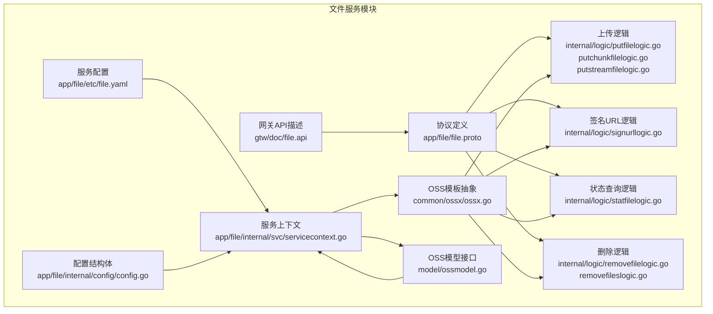
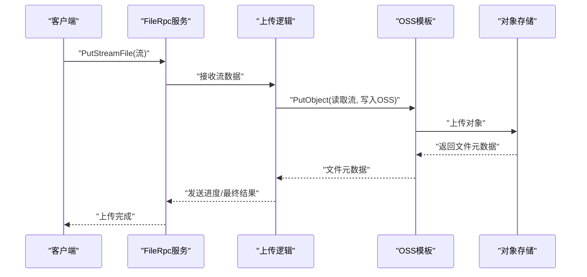
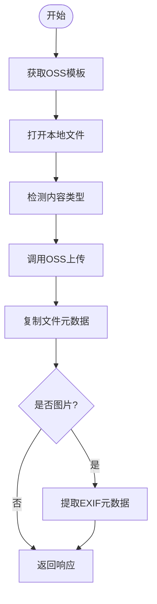
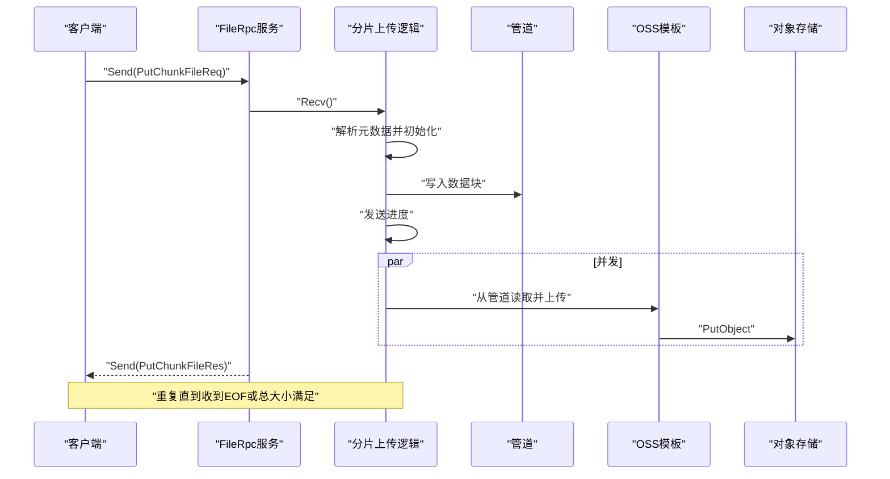
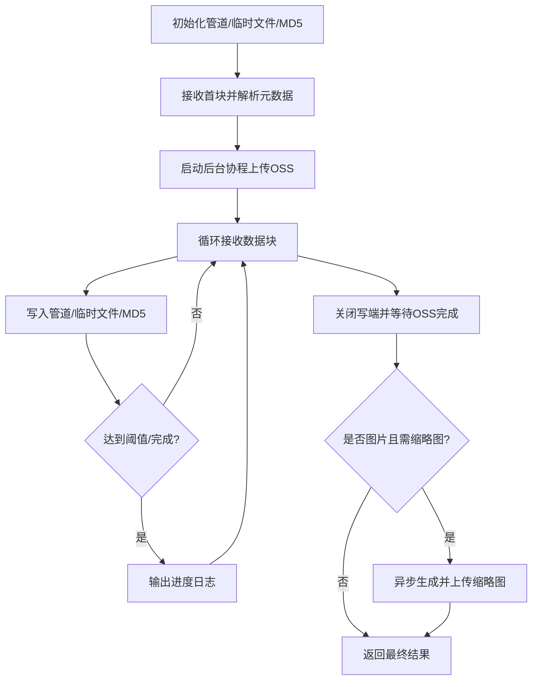
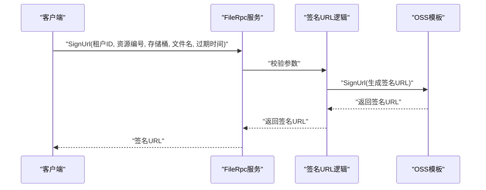
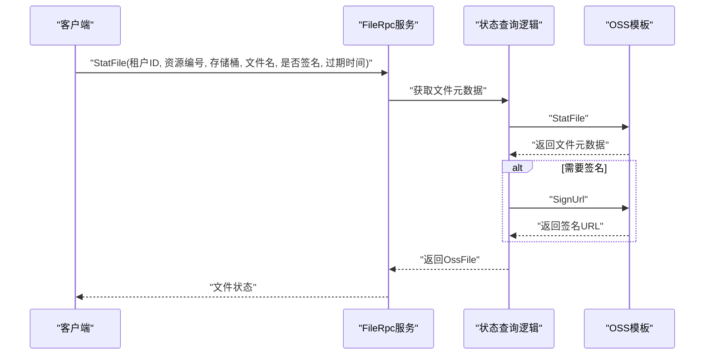
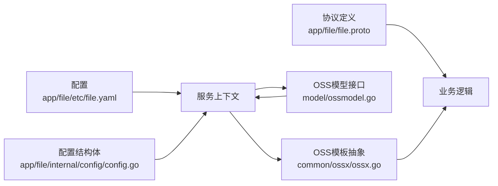

# 文件服务模块

<cite>
**本文引用的文件**
- [app/file/file.proto](file://app/file/file.proto)
- [app/file/etc/file.yaml](file://app/file/etc/file.yaml)
- [app/file/internal/logic/putfilelogic.go](file://app/file/internal/logic/putfilelogic.go)
- [app/file/internal/logic/putchunkfilelogic.go](file://app/file/internal/logic/putchunkfilelogic.go)
- [app/file/internal/logic/putstreamfilelogic.go](file://app/file/internal/logic/putstreamfilelogic.go)
- [app/file/internal/logic/signurllogic.go](file://app/file/internal/logic/signurllogic.go)
- [app/file/internal/logic/statfilelogic.go](file://app/file/internal/logic/statfilelogic.go)
- [app/file/internal/logic/removefilelogic.go](file://app/file/internal/logic/removefilelogic.go)
- [app/file/internal/logic/removefileslogic.go](file://app/file/internal/logic/removefileslogic.go)
- [common/ossx/ossx.go](file://common/ossx/ossx.go)
- [app/file/internal/svc/servicecontext.go](file://app/file/internal/svc/servicecontext.go)
- [app/file/internal/config/config.go](file://app/file/internal/config/config.go)
- [model/ossmodel.go](file://model/ossmodel.go)
- [gtw/doc/file.api](file://gtw/doc/file.api)
</cite>

## 目录
1. [简介](#简介)
2. [项目结构](#项目结构)
3. [核心组件](#核心组件)
4. [架构总览](#架构总览)
5. [详细组件分析](#详细组件分析)
6. [依赖关系分析](#依赖关系分析)
7. [性能考量](#性能考量)
8. [故障排查指南](#故障排查指南)
9. [结论](#结论)
10. [附录](#附录)

## 简介
本文件服务模块提供统一的对象存储（OSS）接入能力，围绕三大上传模式与配套工具能力，形成完整的文件管理闭环：
- 单文件上传：适用于中小文件，直接读取本地文件后上传。
- 分片上传（双向流）：适用于大文件或网络不稳定场景，支持断点续传与进度反馈。
- 流式上传（单向流）：适用于持续数据流或边接收边上传的场景，具备进度日志与异步缩略图生成。

同时提供文件状态查询、签名URL生成、文件删除等辅助能力，并通过租户模式与模板池实现多租户隔离与资源复用。

## 项目结构
文件服务模块位于 app/file，包含协议定义、网关API描述、业务逻辑、服务上下文与配置等。核心目录与文件如下：
- 协议与类型：app/file/file.proto
- 网关API：gtw/doc/file.api
- 服务配置：app/file/etc/file.yaml
- 业务逻辑：app/file/internal/logic/*
- 服务上下文与配置：app/file/internal/svc/*、app/file/internal/config/*
- 对象存储抽象：common/ossx/ossx.go
- 数据模型：model/ossmodel.go

图表来源
- [app/file/file.proto:1-287](file://app/file/file.proto#L1-L287)
- [gtw/doc/file.api:1-60](file://gtw/doc/file.api#L1-L60)
- [app/file/etc/file.yaml:1-23](file://app/file/etc/file.yaml#L1-L23)
- [app/file/internal/svc/servicecontext.go:1-27](file://app/file/internal/svc/servicecontext.go#L1-L27)
- [app/file/internal/config/config.go:1-31](file://app/file/internal/config/config.go#L1-L31)
- [model/ossmodel.go:1-32](file://model/ossmodel.go#L1-L32)
- [common/ossx/ossx.go:1-152](file://common/ossx/ossx.go#L1-L152)
- [app/file/internal/logic/putfilelogic.go:1-78](file://app/file/internal/logic/putfilelogic.go#L1-L78)
- [app/file/internal/logic/putchunkfilelogic.go:1-270](file://app/file/internal/logic/putchunkfilelogic.go#L1-L270)
- [app/file/internal/logic/putstreamfilelogic.go:1-287](file://app/file/internal/logic/putstreamfilelogic.go#L1-L287)
- [app/file/internal/logic/signurllogic.go:1-61](file://app/file/internal/logic/signurllogic.go#L1-L61)
- [app/file/internal/logic/statfilelogic.go:1-59](file://app/file/internal/logic/statfilelogic.go#L1-L59)
- [app/file/internal/logic/removefilelogic.go:1-39](file://app/file/internal/logic/removefilelogic.go#L1-L39)
- [app/file/internal/logic/removefileslogic.go:1-46](file://app/file/internal/logic/removefileslogic.go#L1-L46)

章节来源
- [app/file/file.proto:1-287](file://app/file/file.proto#L1-L287)
- [gtw/doc/file.api:1-60](file://gtw/doc/file.api#L1-L60)
- [app/file/etc/file.yaml:1-23](file://app/file/etc/file.yaml#L1-L23)

## 核心组件
- 协议与消息类型：定义了上传、下载、删除、签名、状态查询等请求/响应消息，以及OSS与文件元数据结构。
- 服务上下文：注入配置、校验器、OSS模型与缩略图任务执行器。
- OSS模板抽象：封装不同对象存储的统一接口，支持桶操作、文件上传、签名URL、删除等。
- 业务逻辑：围绕三种上传模式与辅助功能的具体实现。

章节来源
- [app/file/file.proto:9-287](file://app/file/file.proto#L9-L287)
- [app/file/internal/svc/servicecontext.go:12-26](file://app/file/internal/svc/servicecontext.go#L12-L26)
- [common/ossx/ossx.go:28-39](file://common/ossx/ossx.go#L28-L39)

## 架构总览
文件服务采用“协议层-逻辑层-存储抽象层”的分层设计：
- 协议层：定义gRPC服务与消息类型，统一对外接口。
- 逻辑层：根据请求类型调用OSS模板，完成上传、签名、状态查询与删除。
- 存储抽象层：OSS模板工厂按租户与配置动态创建模板，支持缓存复用。

图表来源
- [app/file/file.proto:209-225](file://app/file/file.proto#L209-L225)
- [app/file/internal/logic/putstreamfilelogic.go:43-287](file://app/file/internal/logic/putstreamfilelogic.go#L43-L287)
- [common/ossx/ossx.go:28-39](file://common/ossx/ossx.go#L28-L39)

## 详细组件分析

### 单文件上传（PutFile）
- 适用场景：中小文件，本地文件路径明确。
- 工作流程：
  - 通过租户与资源编号获取OSS模板。
  - 打开本地文件，检测内容类型，计算文件大小。
  - 调用OSS模板上传，完成后复制元数据到响应结构。
  - 若为图片，提取EXIF信息并填充到响应。
- 关键参数与响应：
  - 请求：租户ID、资源编号、存储桶、文件名、内容类型、本地路径、是否缩略图、路径前缀。
  - 响应：文件链接、域名、名称、大小、格式化大小、原始名、MD5、图片元信息、缩略图链接与名称。
- 错误处理：打开文件失败、读取失败、OSS上传失败均向上抛出。

图表来源
- [app/file/internal/logic/putfilelogic.go:33-78](file://app/file/internal/logic/putfilelogic.go#L33-L78)
- [app/file/file.proto:176-189](file://app/file/file.proto#L176-L189)

章节来源
- [app/file/internal/logic/putfilelogic.go:1-78](file://app/file/internal/logic/putfilelogic.go#L1-L78)
- [app/file/file.proto:176-189](file://app/file/file.proto#L176-L189)

### 分片上传（PutChunkFile，双向流）
- 适用场景：大文件或网络不稳定，需要断点续传与进度反馈。
- 工作流程：
  - 初始化：创建管道与临时文件，准备MD5计算与EXIF缓存。
  - 元数据解析：首次接收时解析租户、桶、文件名、总大小、内容类型、缩略图标志与路径前缀。
  - 并发上传：启动后台协程从管道读取并写入OSS；主线程循环接收数据块，写入管道、临时文件与MD5。
  - 进度反馈：每块发送进度（已上传大小）。
  - 完成处理：关闭写端，等待OSS写入完成；若为图片且需缩略图，异步生成并上传缩略图。
- 关键参数与响应：
  - 请求：租户ID、资源编号、存储桶、文件名、内容类型、数据块、总大小、是否缩略图、路径前缀。
  - 响应：文件元数据、是否结束、已上传大小。
- 错误处理：流读取错误、OSS写入错误、临时文件清理等均有相应处理。

图表来源
- [app/file/file.proto:191-207](file://app/file/file.proto#L191-L207)
- [app/file/internal/logic/putchunkfilelogic.go:38-270](file://app/file/internal/logic/putchunkfilelogic.go#L38-L270)

章节来源
- [app/file/internal/logic/putchunkfilelogic.go:1-270](file://app/file/internal/logic/putchunkfilelogic.go#L1-L270)
- [app/file/file.proto:191-207](file://app/file/file.proto#L191-L207)

### 流式上传（PutStreamFile，单向流）
- 适用场景：持续数据流或边接收边上传，适合直播截图、实时转存等。
- 工作流程：
  - 初始化：创建管道与临时文件，准备MD5计算与EXIF缓存。
  - 元数据解析：首次接收时解析租户、桶、文件名、总大小、内容类型、缩略图标志与路径前缀。
  - 并发上传：后台协程从管道读取并写入OSS；主线程循环接收数据块，写入管道、临时文件与MD5。
  - 进度日志：超过阈值或完成时输出进度日志。
  - 完成处理：关闭写端，等待OSS写入完成；若为图片且需缩略图，异步生成并上传缩略图；返回最终结果并关闭流。
- 关键参数与响应：
  - 请求：租户ID、资源编号、存储桶、文件名、内容类型、数据块、总大小、是否缩略图、路径前缀。
  - 响应：文件元数据、是否结束、已上传大小。
- 错误处理：流读取错误、OSS写入错误、临时文件清理等均有相应处理。

图表来源
- [app/file/file.proto:209-225](file://app/file/file.proto#L209-L225)
- [app/file/internal/logic/putstreamfilelogic.go:43-287](file://app/file/internal/logic/putstreamfilelogic.go#L43-L287)

章节来源
- [app/file/internal/logic/putstreamfilelogic.go:1-287](file://app/file/internal/logic/putstreamfilelogic.go#L1-L287)
- [app/file/file.proto:209-225](file://app/file/file.proto#L209-L225)

### 文件签名URL生成（SignUrl）
- 功能：为指定文件生成带过期时间的签名URL，用于临时访问。
- 参数：
  - 租户ID、资源编号、存储桶、文件名、过期时间（分钟，默认1小时）。
- 行为：
  - 校验必填字段。
  - 获取OSS模板并生成签名URL。
  - 返回签名URL。
- 安全策略：
  - 过期时间可由调用方指定，默认1小时。
  - 仅在授权范围内生成签名URL。

图表来源
- [app/file/file.proto:164-174](file://app/file/file.proto#L164-L174)
- [app/file/internal/logic/signurllogic.go:29-61](file://app/file/internal/logic/signurllogic.go#L29-L61)

章节来源
- [app/file/internal/logic/signurllogic.go:1-61](file://app/file/internal/logic/signurllogic.go#L1-L61)
- [app/file/file.proto:164-174](file://app/file/file.proto#L164-L174)

### 文件状态查询（StatFile）
- 功能：查询文件元数据与可选的签名URL。
- 参数：
  - 租户ID、资源编号、存储桶、文件名、是否生成签名、过期时间（分钟）。
- 行为：
  - 获取OSS文件元数据（大小、上传时间、内容类型等）。
  - 若请求包含签名标志，则生成签名URL并返回。
- 响应：
  - 文件链接、名称、大小、格式化大小、上传时间、内容类型、签名URL。

图表来源
- [app/file/file.proto:151-162](file://app/file/file.proto#L151-L162)
- [app/file/internal/logic/statfilelogic.go:29-59](file://app/file/internal/logic/statfilelogic.go#L29-L59)

章节来源
- [app/file/internal/logic/statfilelogic.go:1-59](file://app/file/internal/logic/statfilelogic.go#L1-L59)
- [app/file/file.proto:151-162](file://app/file/file.proto#L151-L162)

### 文件删除（RemoveFile/RemoveFiles）
- 单文件删除：根据租户ID、资源编号、存储桶与文件名删除文件。
- 批量删除：支持传入多个文件名，逐个删除并聚合错误。
- 行为：通过OSS模板删除文件，返回空响应。

章节来源
- [app/file/internal/logic/removefilelogic.go:1-39](file://app/file/internal/logic/removefilelogic.go#L1-L39)
- [app/file/internal/logic/removefileslogic.go:1-46](file://app/file/internal/logic/removefileslogic.go#L1-L46)
- [app/file/file.proto:240-248](file://app/file/file.proto#L240-L248)
- [app/file/file.proto:250-257](file://app/file/file.proto#L250-L257)

### MFS（多文件系统）上传处理机制
- 文件分片策略：分片上传与流式上传均以数据块为单位，通过管道与临时文件实现边收边传。
- 断点续传支持：分片上传与流式上传在接收端维护已上传字节，可在异常后继续传输。
- 并发上传优化：后台协程从管道读取并写入OSS，避免阻塞接收循环；缩略图生成通过任务运行器异步执行，不阻塞主流程。
- 适用场景：大文件、弱网环境、实时流媒体转存。

章节来源
- [app/file/internal/logic/putchunkfilelogic.go:38-270](file://app/file/internal/logic/putchunkfilelogic.go#L38-L270)
- [app/file/internal/logic/putstreamfilelogic.go:43-287](file://app/file/internal/logic/putstreamfilelogic.go#L43-L287)
- [app/file/internal/svc/servicecontext.go:19-26](file://app/file/internal/svc/servicecontext.go#L19-L26)

## 依赖关系分析
- 服务上下文依赖配置与数据库连接，注入OSS模型与任务运行器。
- 业务逻辑依赖OSS模板抽象，通过租户与资源编号动态选择模板。
- OSS模板抽象支持桶操作、文件上传、签名URL、删除等统一接口。
- 网关API描述与协议定义保持一致，确保对外接口清晰。

图表来源
- [app/file/etc/file.yaml:1-23](file://app/file/etc/file.yaml#L1-L23)
- [app/file/internal/config/config.go:10-31](file://app/file/internal/config/config.go#L10-L31)
- [app/file/internal/svc/servicecontext.go:12-26](file://app/file/internal/svc/servicecontext.go#L12-L26)
- [common/ossx/ossx.go:109-151](file://common/ossx/ossx.go#L109-L151)
- [model/ossmodel.go:20-32](file://model/ossmodel.go#L20-L32)
- [app/file/file.proto:270-287](file://app/file/file.proto#L270-L287)

章节来源
- [app/file/etc/file.yaml:1-23](file://app/file/etc/file.yaml#L1-L23)
- [app/file/internal/config/config.go:10-31](file://app/file/internal/config/config.go#L10-L31)
- [app/file/internal/svc/servicecontext.go:12-26](file://app/file/internal/svc/servicecontext.go#L12-L26)
- [common/ossx/ossx.go:109-151](file://common/ossx/ossx.go#L109-L151)
- [model/ossmodel.go:20-32](file://model/ossmodel.go#L20-L32)
- [app/file/file.proto:270-287](file://app/file/file.proto#L270-L287)

## 性能考量
- 并发与背压：分片与流式上传通过管道与后台协程实现并发上传，避免主线程阻塞；建议合理设置任务并发数与日志阈值。
- 临时文件与磁盘IO：分片与流式上传会写入临时文件，需确保磁盘空间充足与IO性能良好。
- 内容类型探测：仅在首块数据足够时进行探测，减少不必要的CPU消耗。
- 缩略图生成：异步任务生成缩略图，避免阻塞主流程，建议根据业务需求调整并发数。

## 故障排查指南
- 上传失败：
  - 检查租户ID与资源编号是否正确，确认OSS模板创建成功。
  - 查看流读取错误与OSS写入错误日志，定位具体环节。
  - 分片/流式上传时关注管道写入与关闭时机。
- 签名URL无效：
  - 确认文件存在且签名过期时间设置合理。
  - 检查租户模式与桶命名规则。
- 状态查询异常：
  - 确认文件名与桶名正确，检查OSS连接参数。
- 删除失败：
  - 批量删除时注意错误聚合，逐个排查失败文件。

章节来源
- [app/file/internal/logic/putchunkfilelogic.go:91-210](file://app/file/internal/logic/putchunkfilelogic.go#L91-L210)
- [app/file/internal/logic/putstreamfilelogic.go:100-220](file://app/file/internal/logic/putstreamfilelogic.go#L100-L220)
- [app/file/internal/logic/signurllogic.go:36-60](file://app/file/internal/logic/signurllogic.go#L36-L60)
- [app/file/internal/logic/statfilelogic.go:36-57](file://app/file/internal/logic/statfilelogic.go#L36-L57)
- [app/file/internal/logic/removefilelogic.go:26-38](file://app/file/internal/logic/removefilelogic.go#L26-L38)
- [app/file/internal/logic/removefileslogic.go:28-45](file://app/file/internal/logic/removefileslogic.go#L28-L45)

## 结论
文件服务模块通过统一的协议与抽象层，提供了灵活高效的文件上传与管理能力。单文件上传适合中小文件，分片与流式上传则覆盖大文件与实时场景。配合签名URL与状态查询，可满足多种业务需求。建议在生产环境中结合并发配置、磁盘规划与监控告警，确保稳定性与性能。

## 附录

### 接口参数与响应规范（摘要）
- 单文件上传（PutFile）
  - 请求：租户ID、资源编号、存储桶、文件名、内容类型、本地路径、是否缩略图、路径前缀。
  - 响应：文件链接、域名、名称、大小、格式化大小、原始名、MD5、图片元信息、缩略图链接与名称。
- 分片上传（PutChunkFile，双向流）
  - 请求：租户ID、资源编号、存储桶、文件名、内容类型、数据块、总大小、是否缩略图、路径前缀。
  - 响应：文件元数据、是否结束、已上传大小。
- 流式上传（PutStreamFile，单向流）
  - 请求：租户ID、资源编号、存储桶、文件名、内容类型、数据块、总大小、是否缩略图、路径前缀。
  - 响应：文件元数据、是否结束、已上传大小。
- 签名URL（SignUrl）
  - 请求：租户ID、资源编号、存储桶、文件名、过期时间（分钟）。
  - 响应：签名URL。
- 文件状态查询（StatFile）
  - 请求：租户ID、资源编号、存储桶、文件名、是否生成签名、过期时间（分钟）。
  - 响应：文件链接、名称、大小、格式化大小、上传时间、内容类型、签名URL。
- 删除文件（RemoveFile/RemoveFiles）
  - 请求：租户ID、资源编号、存储桶、文件名（批量为文件名数组）。
  - 响应：空。

章节来源
- [app/file/file.proto:176-189](file://app/file/file.proto#L176-L189)
- [app/file/file.proto:191-207](file://app/file/file.proto#L191-L207)
- [app/file/file.proto:209-225](file://app/file/file.proto#L209-L225)
- [app/file/file.proto:164-174](file://app/file/file.proto#L164-L174)
- [app/file/file.proto:151-162](file://app/file/file.proto#L151-L162)
- [app/file/file.proto:240-248](file://app/file/file.proto#L240-L248)
- [app/file/file.proto:250-257](file://app/file/file.proto#L250-L257)

### 使用示例与最佳实践
- 大文件上传（推荐使用分片或流式）：
  - 分片上传：适合强网络抖动与断点续传需求，建议前端按固定大小切片并记录已上传偏移。
  - 流式上传：适合实时流媒体转存，建议设置合理的日志阈值与并发任务数。
- 签名URL：
  - 为私有文件生成短期有效的签名URL，避免长期暴露。
  - 根据访问频率与安全性要求设置过期时间。
- 错误恢复策略：
  - 上传失败时优先检查租户与资源编号、桶存在性与权限。
  - 分片/流式上传失败后，基于已上传偏移继续传输，避免重复写入。
- 最佳实践：
  - 合理设置缩略图并发数，避免抢占主上传带宽。
  - 使用租户模式隔离不同业务的存储桶与配置。
  - 在网关层对请求参数进行必要校验，减少无效调用。