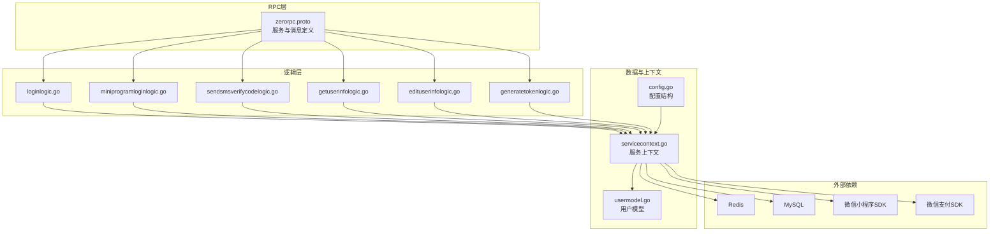
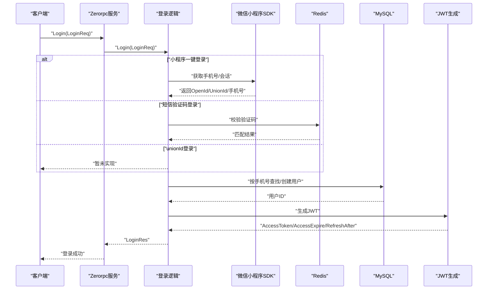
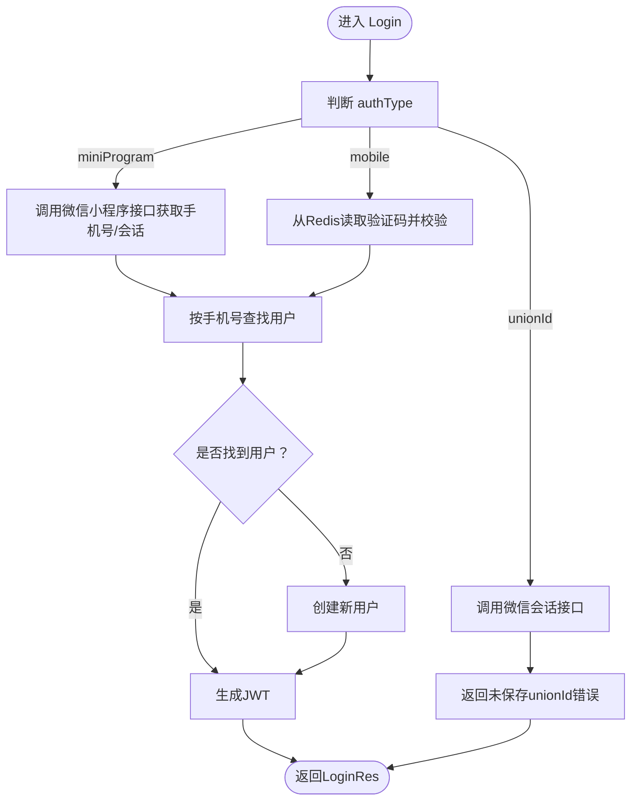
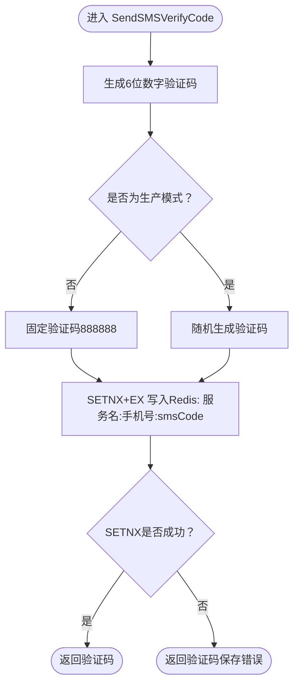
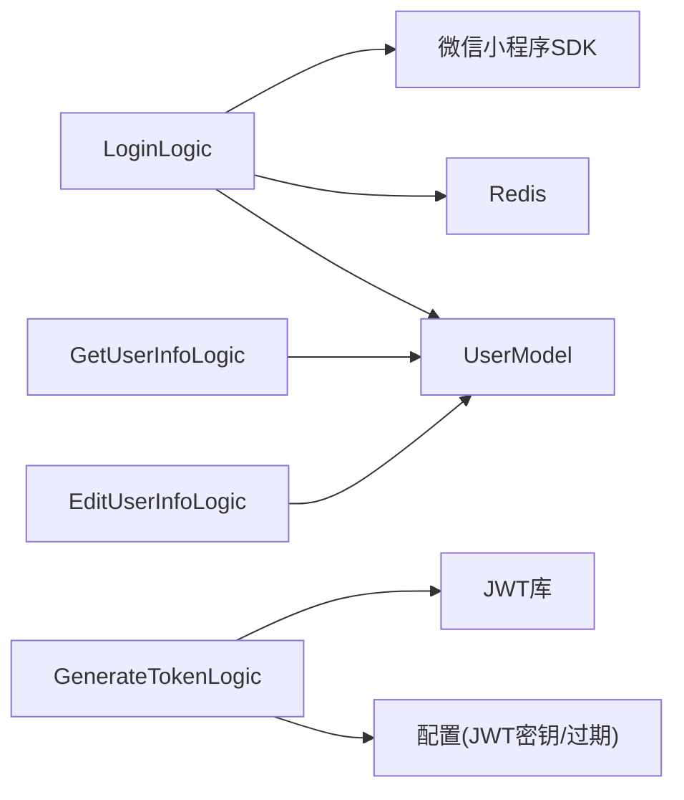

# 用户服务模块

<cite>
**本文引用的文件**
- [user.api](file://gtw/doc/user.api)
- [zerorpc.proto](file://zerorpc/zerorpc.proto)
- [loginlogic.go](file://zerorpc/internal/logic/loginlogic.go)
- [miniprogramloginlogic.go](file://zerorpc/internal/logic/miniprogramloginlogic.go)
- [sendsmsverifycodelogic.go](file://zerorpc/internal/logic/sendsmsverifycodelogic.go)
- [getuserinfologic.go](file://zerorpc/internal/logic/getuserinfologic.go)
- [edituserinfologic.go](file://zerorpc/internal/logic/edituserinfologic.go)
- [generatetokenlogic.go](file://zerorpc/internal/logic/generatetokenlogic.go)
- [servicecontext.go](file://zerorpc/internal/svc/servicecontext.go)
- [config.go](file://zerorpc/internal/config/config.go)
- [zerorpc.yaml](file://zerorpc/etc/zerorpc.yaml)
- [usermodel.go](file://model/usermodel.go)
</cite>

## 目录
1. [简介](#简介)
2. [项目结构](#项目结构)
3. [核心组件](#核心组件)
4. [架构总览](#架构总览)
5. [详细组件分析](#详细组件分析)
6. [依赖分析](#依赖分析)
7. [性能考虑](#性能考虑)
8. [故障排查指南](#故障排查指南)
9. [结论](#结论)
10. [附录](#附录)

## 简介
本文件为“用户服务模块”的全面API文档，覆盖以下能力：
- 用户认证登录：支持用户名密码登录、小程序一键登录、短信验证码登录等多种方式
- 用户信息：当前用户信息查询与编辑
- 短信验证码：验证码生成、下发与有效期管理
- 安全与鉴权：基于JWT的访问令牌生成与刷新策略
- 错误码与响应格式：统一的错误码与返回结构
- 性能与可用性：缓存、异步任务、数据库连接池等设计要点
- 使用示例与最佳实践：请求/响应示例与常见问题处理

## 项目结构
用户服务模块由RPC服务、逻辑层、数据模型与配置组成，采用分层架构：
- RPC接口定义：在协议文件中声明服务与消息类型
- 逻辑层：实现具体业务逻辑（登录、验证码、用户信息等）
- 数据模型：封装用户表的增删改查
- 服务上下文：集中注入Redis、MySQL、微信小程序SDK、支付SDK等外部依赖
- 配置：JWT密钥、过期时间、数据库连接、Redis、小程序配置等

图表来源
- [zerorpc.proto:140-166](file://zerorpc/zerorpc.proto#L140-L166)
- [loginlogic.go:30-109](file://zerorpc/internal/logic/loginlogic.go#L30-L109)
- [miniprogramloginlogic.go:28-42](file://zerorpc/internal/logic/miniprogramloginlogic.go#L28-L42)
- [sendsmsverifycodelogic.go:29-42](file://zerorpc/internal/logic/sendsmsverifycodelogic.go#L29-L42)
- [getuserinfologic.go:27-41](file://zerorpc/internal/logic/getuserinfologic.go#L27-L41)
- [edituserinfologic.go:28-48](file://zerorpc/internal/logic/edituserinfologic.go#L28-L48)
- [generatetokenlogic.go:30-42](file://zerorpc/internal/logic/generatetokenlogic.go#L30-L42)
- [servicecontext.go:19-33](file://zerorpc/internal/svc/servicecontext.go#L19-L33)
- [config.go:8-24](file://zerorpc/internal/config/config.go#L8-L24)

章节来源
- [zerorpc.proto:1-167](file://zerorpc/zerorpc.proto#L1-L167)
- [servicecontext.go:19-33](file://zerorpc/internal/svc/servicecontext.go#L19-L33)
- [config.go:8-24](file://zerorpc/internal/config/config.go#L8-L24)

## 核心组件
- 登录服务：支持多种登录方式，统一封装为登录流程，并生成JWT访问令牌
- 小程序登录：通过微信小程序授权码换取会话信息
- 短信验证码：生成6位数字验证码，写入Redis并设置有效期
- 用户信息：查询与编辑用户资料
- JWT令牌：生成访问令牌与刷新策略
- 服务上下文：集中管理Redis、MySQL、微信SDK、支付SDK与模型实例

章节来源
- [loginlogic.go:30-109](file://zerorpc/internal/logic/loginlogic.go#L30-L109)
- [miniprogramloginlogic.go:28-42](file://zerorpc/internal/logic/miniprogramloginlogic.go#L28-L42)
- [sendsmsverifycodelogic.go:29-42](file://zerorpc/internal/logic/sendsmsverifycodelogic.go#L29-L42)
- [getuserinfologic.go:27-41](file://zerorpc/internal/logic/getuserinfologic.go#L27-L41)
- [edituserinfologic.go:28-48](file://zerorpc/internal/logic/edituserinfologic.go#L28-L48)
- [generatetokenlogic.go:30-42](file://zerorpc/internal/logic/generatetokenlogic.go#L30-L42)
- [servicecontext.go:19-33](file://zerorpc/internal/svc/servicecontext.go#L19-L33)

## 架构总览
用户服务采用RPC服务形式对外提供能力，内部通过服务上下文聚合Redis、MySQL、微信SDK等依赖，逻辑层负责业务编排。

图表来源
- [loginlogic.go:30-109](file://zerorpc/internal/logic/loginlogic.go#L30-L109)
- [generatetokenlogic.go:30-42](file://zerorpc/internal/logic/generatetokenlogic.go#L30-L42)
- [servicecontext.go:38-51](file://zerorpc/internal/svc/servicecontext.go#L38-L51)

## 详细组件分析

### 登录接口（Login）
- 功能概述：支持三种登录方式，统一流程：校验凭证 -> 查找或创建用户 -> 生成JWT
- 请求参数
  - authType：登录类型，取值范围包括 miniProgram、mobile、unionId
  - authKey：登录凭证，miniProgram对应小程序授权码；mobile对应手机号；unionId对应会话Key
  - password：短信验证码登录时用于校验的验证码
- 响应参数
  - accessToken：访问令牌
  - accessExpire：访问令牌过期时间戳
  - refreshAfter：建议刷新令牌的时间点
- 处理流程
  - 小程序一键登录：调用微信小程序接口获取手机号或会话信息，按手机号查找用户，不存在则自动注册
  - 短信验证码登录：从Redis读取验证码并比对，删除已使用验证码，按手机号查找或注册用户
  - unionId登录：预留扩展，当前返回未保存unionId错误
- 错误码
  - 9999：未知类型、小程序登录失败、验证码不匹配、未保存unionId等
- 使用示例
  - 小程序一键登录：authType=miniProgram，authKey=小程序授权码
  - 短信验证码登录：authType=mobile，authKey=手机号，password=验证码
  - unionId登录：authType=unionId，authKey=会话Key（当前未实现）

图表来源
- [loginlogic.go:30-109](file://zerorpc/internal/logic/loginlogic.go#L30-L109)

章节来源
- [loginlogic.go:30-109](file://zerorpc/internal/logic/loginlogic.go#L30-L109)
- [zerorpc.proto:74-84](file://zerorpc/zerorpc.proto#L74-L84)

### 小程序登录接口（MiniProgramLogin）
- 功能概述：通过小程序授权码换取会话信息，返回OpenId、UnionId、SessionKey
- 请求参数
  - code：小程序前端传来的授权码
- 响应参数
  - openId：小程序用户唯一标识
  - unionId：多个应用共享的唯一标识
  - sessionKey：会话密钥
- 错误码
  - 9999：小程序登录失败（微信返回非零错误码）
- 使用示例
  - 前端使用wx.login获取临时登录凭证，后端调用此接口换取会话信息

章节来源
- [miniprogramloginlogic.go:28-42](file://zerorpc/internal/logic/miniprogramloginlogic.go#L28-L42)
- [zerorpc.proto:86-94](file://zerorpc/zerorpc.proto#L86-L94)

### 短信验证码发送接口（SendSMSVerifyCode）
- 功能概述：生成6位数字验证码，写入Redis并设置有效期（默认3分钟），开发环境可固定验证码便于调试
- 请求参数
  - mobile：接收验证码的手机号
- 响应参数
  - code：验证码（开发模式下固定为888888，生产模式随机生成）
- 存储键规则
  - 格式：服务名:手机号:smsCode
- 有效期管理
  - 默认3分钟，Redis中以SETNX+EX原子操作保证幂等与过期
- 错误码
  - 9999：验证码保存错误（如SETNX失败）
- 使用示例
  - 前端输入手机号后调用该接口，收到验证码后进行登录或绑定

图表来源
- [sendsmsverifycodelogic.go:29-42](file://zerorpc/internal/logic/sendsmsverifycodelogic.go#L29-L42)

章节来源
- [sendsmsverifycodelogic.go:29-42](file://zerorpc/internal/logic/sendsmsverifycodelogic.go#L29-L42)
- [zerorpc.proto:35-41](file://zerorpc/zerorpc.proto#L35-L41)

### 用户信息查询接口（GetUserInfo）
- 功能概述：根据用户ID查询用户信息
- 请求参数
  - id：用户ID
- 响应参数
  - user.id：用户ID
  - user.mobile：手机号
  - user.nickname：昵称
  - user.sex：性别
  - user.avatar：头像URL
- 错误码
  - 通用数据库错误：查询失败或用户不存在
- 使用示例
  - 已登录用户调用，返回当前用户资料

章节来源
- [getuserinfologic.go:27-41](file://zerorpc/internal/logic/getuserinfologic.go#L27-L41)
- [zerorpc.proto:96-102](file://zerorpc/zerorpc.proto#L96-L102)

### 用户信息编辑接口（EditUserInfo）
- 功能概述：编辑当前用户的信息（昵称、性别、头像等）
- 请求参数
  - id：用户ID
  - mobile：手机号（可选）
  - nickname：昵称（可选）
  - sex：性别（可选）
  - avatar：头像URL（可选）
- 响应参数
  - 无额外字段
- 错误码
  - 通用数据库错误：更新失败
- 使用示例
  - 已登录用户调用，更新个人资料

章节来源
- [edituserinfologic.go:28-48](file://zerorpc/internal/logic/edituserinfologic.go#L28-L48)
- [zerorpc.proto:104-113](file://zerorpc/zerorpc.proto#L104-L113)

### JWT令牌生成接口（GenerateToken）
- 功能概述：根据用户ID生成访问令牌及过期时间
- 请求参数
  - userId：用户ID
- 响应参数
  - accessToken：JWT访问令牌
  - accessExpire：访问令牌过期时间戳
  - refreshAfter：建议刷新令牌的时间点（通常为过期时间的一半）
- 配置项
  - AccessSecret：JWT签名密钥
  - AccessExpire：访问令牌有效期（秒）
- 使用示例
  - 登录成功后调用，返回令牌供后续接口鉴权使用

章节来源
- [generatetokenlogic.go:30-42](file://zerorpc/internal/logic/generatetokenlogic.go#L30-L42)
- [zerorpc.proto:64-72](file://zerorpc/zerorpc.proto#L64-L72)
- [config.go:11-14](file://zerorpc/internal/config/config.go#L11-L14)
- [zerorpc.yaml:33-35](file://zerorpc/etc/zerorpc.yaml#L33-L35)

## 依赖分析
- 组件耦合
  - 登录逻辑依赖微信小程序SDK、Redis与用户模型
  - 令牌生成依赖JWT库与配置中的密钥与过期时间
  - 用户信息查询与编辑依赖用户模型
- 外部依赖
  - Redis：验证码存储与会话状态
  - MySQL：用户数据持久化
  - 微信小程序SDK：登录态校验与手机号获取
  - 微信支付SDK：支付相关能力（本模块未直接使用）
- 潜在循环依赖
  - 当前模块未发现循环依赖，逻辑层仅向下依赖服务上下文与模型

图表来源
- [loginlogic.go:30-109](file://zerorpc/internal/logic/loginlogic.go#L30-L109)
- [generatetokenlogic.go:30-42](file://zerorpc/internal/logic/generatetokenlogic.go#L30-L42)
- [getuserinfologic.go:27-41](file://zerorpc/internal/logic/getuserinfologic.go#L27-L41)
- [edituserinfologic.go:28-48](file://zerorpc/internal/logic/edituserinfologic.go#L28-L48)
- [servicecontext.go:38-51](file://zerorpc/internal/svc/servicecontext.go#L38-L51)

章节来源
- [servicecontext.go:19-33](file://zerorpc/internal/svc/servicecontext.go#L19-L33)
- [config.go:8-24](file://zerorpc/internal/config/config.go#L8-L24)

## 性能考虑
- Redis缓存
  - 验证码使用SETNX+EX保证原子性与幂等，避免重复发送导致的并发问题
  - 建议在高并发场景下增加Redis集群与合理的超时策略
- 数据库连接
  - 使用连接池与事务封装，减少连接开销；对高频查询可引入二级缓存
- JWT令牌
  - 访问令牌过期时间较长时需结合刷新策略，避免频繁签发
- 异步任务
  - 提供延迟任务能力，可用于日志上报、通知等非阻塞场景
- 网络与超时
  - 微信接口调用设置合理超时与重试策略，避免阻塞主流程

## 故障排查指南
- 登录失败
  - 小程序登录失败：检查小程序AppId/Secret与微信返回的错误码
  - 短信验证码不匹配：确认Redis中验证码是否正确、是否被提前删除
  - 未知登录类型：确认authType取值是否合法
- 用户信息异常
  - 查询不到用户：确认用户ID是否正确，数据库是否存在该记录
  - 更新失败：检查字段约束与权限
- 令牌问题
  - 令牌过期：根据accessExpire与refreshAfter策略主动刷新
  - 密钥不一致：核对JWT密钥配置
- 配置问题
  - Redis/DB连接失败：检查连接串与网络连通性
  - 小程序SDK初始化失败：检查AppId/Secret与证书路径

章节来源
- [loginlogic.go:34-82](file://zerorpc/internal/logic/loginlogic.go#L34-L82)
- [sendsmsverifycodelogic.go:31-38](file://zerorpc/internal/logic/sendsmsverifycodelogic.go#L31-L38)
- [generatetokenlogic.go:32-41](file://zerorpc/internal/logic/generatetokenlogic.go#L32-L41)
- [servicecontext.go:38-51](file://zerorpc/internal/svc/servicecontext.go#L38-L51)

## 结论
用户服务模块提供了完善的用户认证、信息管理与令牌签发能力，具备良好的扩展性与可维护性。通过Redis与MySQL的合理配合、JWT的安全策略以及微信生态的集成，能够满足移动端与小程序场景下的典型需求。建议在生产环境中进一步完善监控、限流与灰度发布机制，持续提升稳定性与用户体验。

## 附录

### 接口规范总览
- 服务：Zerorpc
- 协议：gRPC（基于protobuf）
- 认证：JWT访问令牌
- 配置：JWT密钥、过期时间、数据库连接、Redis、小程序配置

章节来源
- [zerorpc.proto:140-166](file://zerorpc/zerorpc.proto#L140-L166)
- [config.go:11-18](file://zerorpc/internal/config/config.go#L11-L18)
- [zerorpc.yaml:33-39](file://zerorpc/etc/zerorpc.yaml#L33-L39)