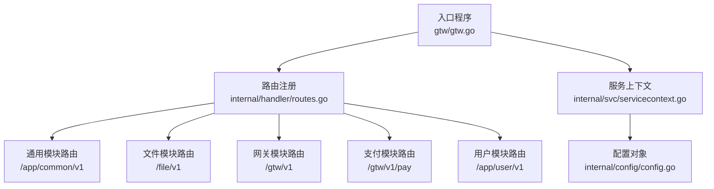
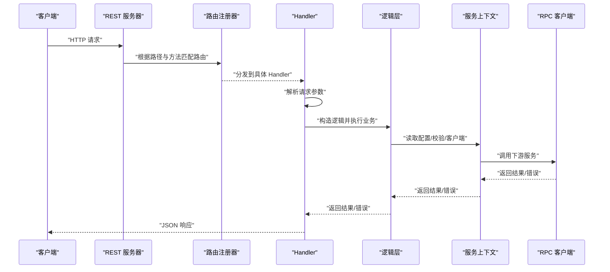
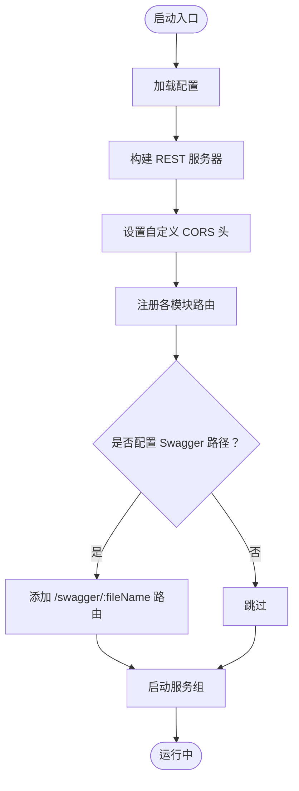
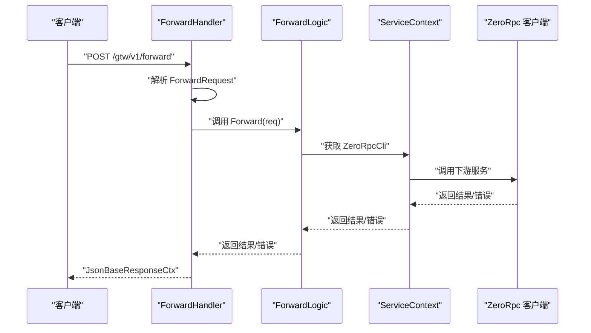
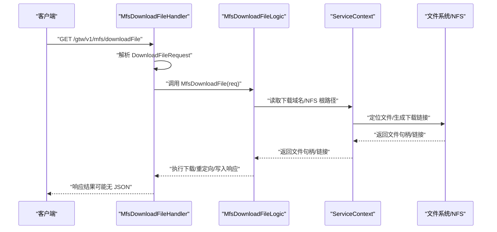
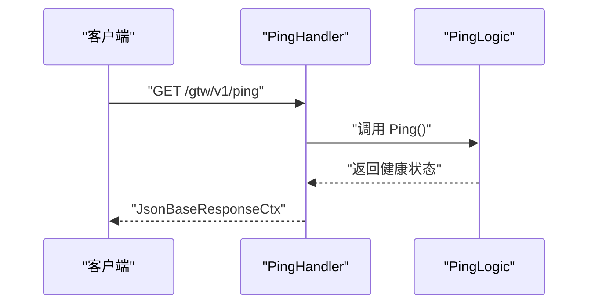
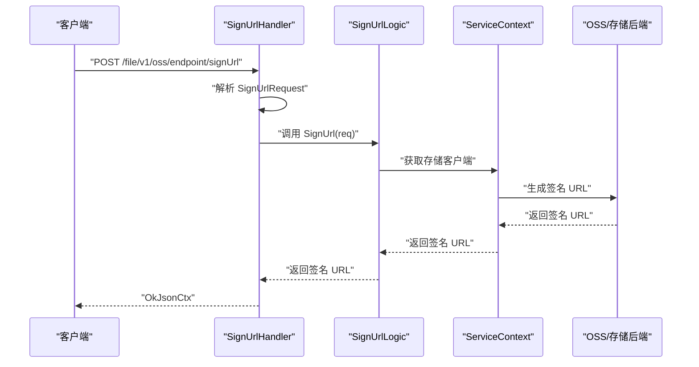
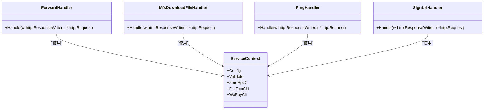
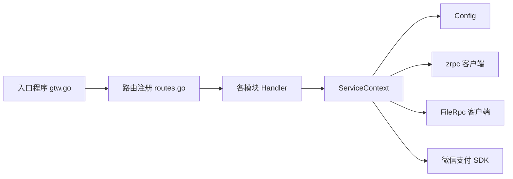

# 网关处理器

<cite>
**本文引用的文件**
- [gtw.go](file://gtw/gtw.go)
- [routes.go](file://gtw/internal/handler/routes.go)
- [config.go](file://gtw/internal/config/config.go)
- [servicecontext.go](file://gtw/internal/svc/servicecontext.go)
- [forwardhandler.go](file://gtw/internal/handler/gtw/forwardhandler.go)
- [mfsdownloadfilehandler.go](file://gtw/internal/handler/gtw/mfsdownloadfilehandler.go)
- [pinghandler.go](file://gtw/internal/handler/gtw/pinghandler.go)
- [signurlhandler.go](file://gtw/internal/handler/file/signurlhandler.go)
- [gtw.api](file://gtw/gtw.api)
</cite>

## 目录
1. [简介](#简介)
2. [项目结构](#项目结构)
3. [核心组件](#核心组件)
4. [架构总览](#架构总览)
5. [详细组件分析](#详细组件分析)
6. [依赖分析](#依赖分析)
7. [性能考虑](#性能考虑)
8. [故障排查指南](#故障排查指南)
9. [结论](#结论)
10. [附录](#附录)

## 简介
本文件面向“网关处理器”模块，系统性阐述其路由注册机制、Handler 组织结构、中间件与 CORS 配置、转发处理器实现原理（请求转发、响应处理、错误传递）、MFS 文件下载处理器（下载链接生成、权限校验、下载统计）、Ping 健康检查接口（服务状态检测、响应时间与健康指标），以及整体设计模式（职责分离、错误处理、性能优化）。文档同时提供可直接定位到源码的路径指引与可视化图示，帮助开发者快速理解与扩展。

## 项目结构
网关服务采用 go-zero 的标准分层：入口程序负责加载配置、构建服务与注册路由；路由集中定义在 handler 层；业务逻辑在 logic 层；共享上下文在 svc 层；配置在 config 层；API 描述在 gtw.api 中。

图表来源
- [gtw.go:25-95](file://gtw/gtw.go#L25-L95)
- [routes.go:20-160](file://gtw/internal/handler/routes.go#L20-L160)

章节来源
- [gtw.go:25-95](file://gtw/gtw.go#L25-L95)
- [routes.go:20-160](file://gtw/internal/handler/routes.go#L20-L160)
- [config.go:8-20](file://gtw/internal/config/config.go#L8-L20)
- [servicecontext.go:23-65](file://gtw/internal/svc/servicecontext.go#L23-L65)

## 核心组件
- 路由注册器：集中定义各模块路由、前缀、超时、JWT 等属性，统一交由 RegisterHandlers 注册。
- Handler：每个具体接口对应一个 http.HandlerFunc，负责参数解析、调用逻辑层、封装响应或错误。
- 逻辑层：封装业务逻辑，如转发、下载、Ping、签名 URL 等。
- 服务上下文：聚合配置、校验器、RPC 客户端、微信支付客户端等，供所有 Handler 使用。
- 配置：包含 REST 服务、JWT 密钥、RPC 客户端配置、NFS 根路径、下载域名、Swagger 路径等。

章节来源
- [routes.go:20-160](file://gtw/internal/handler/routes.go#L20-L160)
- [forwardhandler.go:14-30](file://gtw/internal/handler/gtw/forwardhandler.go#L14-L30)
- [mfsdownloadfilehandler.go:14-30](file://gtw/internal/handler/gtw/mfsdownloadfilehandler.go#L14-L30)
- [pinghandler.go:12-22](file://gtw/internal/handler/gtw/pinghandler.go#L12-L22)
- [servicecontext.go:15-21](file://gtw/internal/svc/servicecontext.go#L15-L21)
- [config.go:8-20](file://gtw/internal/config/config.go#L8-L20)

## 架构总览
下图展示从 HTTP 请求进入，经路由匹配、Handler 解析参数、调用逻辑层、通过 RPC 或外部服务完成业务、最终返回 JSON 响应的整体流程。

图表来源
- [gtw.go:64-68](file://gtw/gtw.go#L64-L68)
- [routes.go:20-160](file://gtw/internal/handler/routes.go#L20-L160)
- [forwardhandler.go:14-30](file://gtw/internal/handler/gtw/forwardhandler.go#L14-L30)
- [servicecontext.go:23-65](file://gtw/internal/svc/servicecontext.go#L23-L65)

## 详细组件分析

### 路由注册机制与中间件链路
- 路由注册集中在 routes.go，按模块分组注册，并设置前缀、超时、JWT 等属性。
- CORS 在入口处以自定义函数方式注入，动态设置 Origin、凭证、方法与头部白名单。
- Swagger 静态文件路由按需暴露，支持按文件名访问 swagger.json。
- JWT 认证用于用户相关受保护接口组。

图表来源
- [gtw.go:51-95](file://gtw/gtw.go#L51-L95)
- [routes.go:20-160](file://gtw/internal/handler/routes.go#L20-L160)

章节来源
- [gtw.go:51-95](file://gtw/gtw.go#L51-L95)
- [routes.go:20-160](file://gtw/internal/handler/routes.go#L20-L160)

### 转发处理器（Forward）
- Handler 负责解析请求体、构造逻辑、调用 Forward 并统一返回 JSON。
- 错误通过 JsonBaseResponseCtx 返回，成功通过 JsonBaseResponseCtx 返回。
- 逻辑层通过 ServiceContext 获取 RPC 客户端，执行跨服务转发。

图表来源
- [forwardhandler.go:14-30](file://gtw/internal/handler/gtw/forwardhandler.go#L14-L30)
- [servicecontext.go:59-63](file://gtw/internal/svc/servicecontext.go#L59-L63)

章节来源
- [forwardhandler.go:14-30](file://gtw/internal/handler/gtw/forwardhandler.go#L14-L30)

### MFS 文件下载处理器（MFS Download）
- Handler 解析 DownloadFileRequest，构造逻辑并调用 MfsDownloadFile。
- 成功时通常不直接写 JSON（保持原响应），失败时通过 JsonBaseResponseCtx 返回。
- 逻辑层结合 ServiceContext 中的配置（如下载域名、NFS 根路径）生成下载链接或执行下载。

图表来源
- [mfsdownloadfilehandler.go:14-30](file://gtw/internal/handler/gtw/mfsdownloadfilehandler.go#L14-L30)
- [servicecontext.go:15-21](file://gtw/internal/svc/servicecontext.go#L15-L21)
- [config.go:17-18](file://gtw/internal/config/config.go#L17-L18)

章节来源
- [mfsdownloadfilehandler.go:14-30](file://gtw/internal/handler/gtw/mfsdownloadfilehandler.go#L14-L30)

### Ping 健康检查接口
- Handler 调用 PingLogic 执行健康检查，返回 JSON。
- 适合用于探活、负载均衡摘除、监控采集。

图表来源
- [pinghandler.go:12-22](file://gtw/internal/handler/gtw/pinghandler.go#L12-L22)

章节来源
- [pinghandler.go:12-22](file://gtw/internal/handler/gtw/pinghandler.go#L12-L22)

### 文件签名 URL 处理器（SignUrl）
- Handler 解析 SignUrlRequest，调用 SignUrlLogic 生成签名 URL。
- 成功时返回 JSON，失败时返回错误。

图表来源
- [signurlhandler.go:13-29](file://gtw/internal/handler/file/signurlhandler.go#L13-L29)

章节来源
- [signurlhandler.go:13-29](file://gtw/internal/handler/file/signurlhandler.go#L13-L29)

### Handler 类型与职责分离
- Handler 仅负责：参数解析、调用逻辑层、统一响应封装与错误传递。
- 逻辑层负责：业务编排、调用 RPC/外部服务、数据转换。
- ServiceContext 聚合配置与客户端，避免 Handler 直接管理资源。
- 配置对象集中管理 REST、JWT、RPC、文件存储等参数。

图表来源
- [servicecontext.go:15-21](file://gtw/internal/svc/servicecontext.go#L15-L21)
- [forwardhandler.go:14-30](file://gtw/internal/handler/gtw/forwardhandler.go#L14-L30)
- [mfsdownloadfilehandler.go:14-30](file://gtw/internal/handler/gtw/mfsdownloadfilehandler.go#L14-L30)
- [pinghandler.go:12-22](file://gtw/internal/handler/gtw/pinghandler.go#L12-L22)
- [signurlhandler.go:13-29](file://gtw/internal/handler/file/signurlhandler.go#L13-L29)

章节来源
- [servicecontext.go:15-21](file://gtw/internal/svc/servicecontext.go#L15-L21)
- [forwardhandler.go:14-30](file://gtw/internal/handler/gtw/forwardhandler.go#L14-L30)
- [mfsdownloadfilehandler.go:14-30](file://gtw/internal/handler/gtw/mfsdownloadfilehandler.go#L14-L30)
- [pinghandler.go:12-22](file://gtw/internal/handler/gtw/pinghandler.go#L12-L22)
- [signurlhandler.go:13-29](file://gtw/internal/handler/file/signurlhandler.go#L13-L29)

## 依赖分析
- 入口程序依赖路由注册器与服务上下文，统一启动 REST 服务器与服务组。
- 路由注册器依赖各模块 Handler，按前缀与超时进行分组注册。
- Handler 依赖 ServiceContext 提供的客户端与配置。
- ServiceContext 依赖 go-zero 的 zrpc 客户端、参数校验器、微信支付 SDK 初始化。

图表来源
- [gtw.go:64-68](file://gtw/gtw.go#L64-L68)
- [routes.go:20-160](file://gtw/internal/handler/routes.go#L20-L160)
- [servicecontext.go:23-65](file://gtw/internal/svc/servicecontext.go#L23-L65)

章节来源
- [gtw.go:64-68](file://gtw/gtw.go#L64-L68)
- [routes.go:20-160](file://gtw/internal/handler/routes.go#L20-L160)
- [servicecontext.go:23-65](file://gtw/internal/svc/servicecontext.go#L23-L65)

## 性能考虑
- 路由超时控制：文件模块设置了较长超时，适配大文件上传/下载场景。
- CORS 动态 Origin 设置，避免跨域缓存污染，提升兼容性。
- Handler 统一错误封装，减少重复判断与分支，提高可维护性。
- 通过 ServiceContext 聚合客户端，避免重复初始化，降低资源消耗。
- Swagger 路由按需开启，避免不必要的静态文件暴露。

章节来源
- [routes.go:72-74](file://gtw/internal/handler/routes.go#L72-L74)
- [gtw.go:51-63](file://gtw/gtw.go#L51-L63)
- [servicecontext.go:59-63](file://gtw/internal/svc/servicecontext.go#L59-L63)

## 故障排查指南
- 参数解析失败：Handler 内部对请求体解析失败会直接返回错误，请检查请求格式与字段类型。
- 转发失败：确认 ServiceContext 中 ZeroRpc 客户端配置正确，下游服务可达。
- 下载异常：核对下载域名与 NFS 根路径配置，确保文件存在且可访问。
- 签名 URL 失败：检查存储后端可用性与签名参数，确认签名算法与有效期设置。
- CORS 问题：确认前端 Origin 是否在允许列表，凭证与头部白名单是否完整。
- Swagger 无法访问：确认配置中的 SwaggerPath 正确且文件存在。

章节来源
- [forwardhandler.go:17-20](file://gtw/internal/handler/gtw/forwardhandler.go#L17-L20)
- [mfsdownloadfilehandler.go:17-20](file://gtw/internal/handler/gtw/mfsdownloadfilehandler.go#L17-L20)
- [signurlhandler.go:16-18](file://gtw/internal/handler/file/signurlhandler.go#L16-L18)
- [gtw.go:51-63](file://gtw/gtw.go#L51-L63)
- [config.go:17-19](file://gtw/internal/config/config.go#L17-L19)

## 结论
该网关处理器遵循清晰的分层与职责分离原则：路由集中注册、Handler 轻薄、逻辑层专注业务、上下文统一承载配置与客户端。转发、下载、Ping、签名 URL 等核心能力均以一致的错误处理与响应封装呈现，具备良好的可扩展性与可维护性。建议在扩展新接口时复用现有模式，保持路由前缀与超时策略的一致性，并完善日志与监控埋点。

## 附录
- 配置项说明（节选）
  - RestConf：REST 服务基础配置
  - JwtAuth.AccessSecret：JWT 密钥
  - ZeroRpcConf/FileRpcConf/AdminRpcConf：RPC 客户端配置
  - NfsRootPath：NFS 根路径
  - DownloadUrl：下载域名
  - SwaggerPath：Swagger 文档路径

章节来源
- [config.go:8-20](file://gtw/internal/config/config.go#L8-L20)