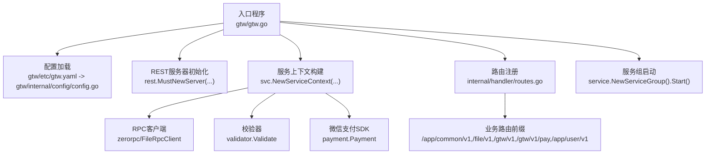
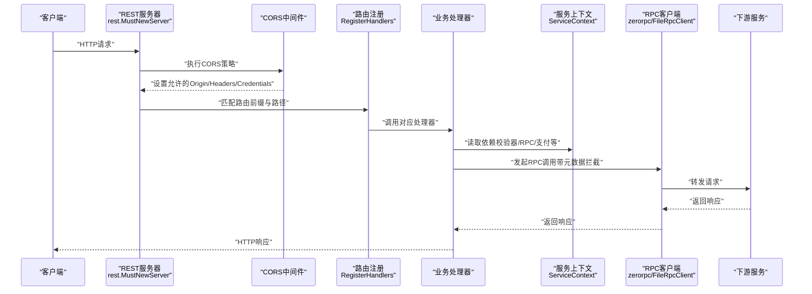
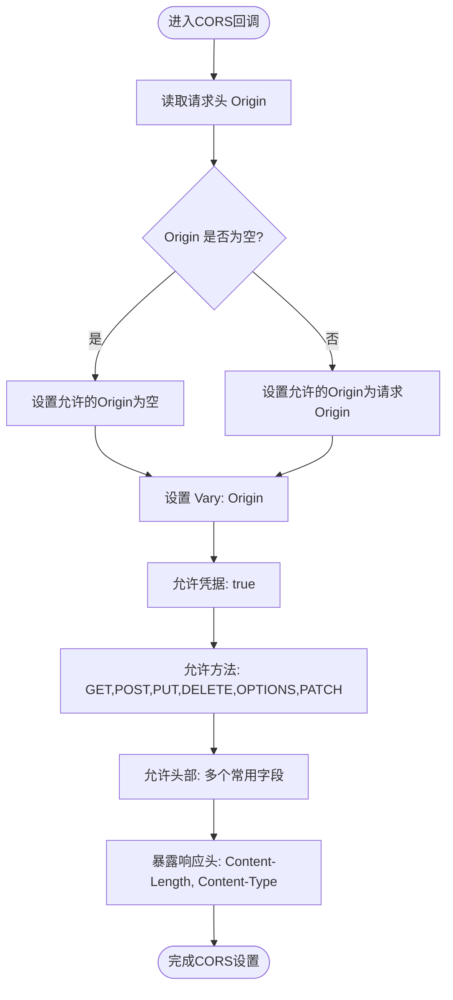
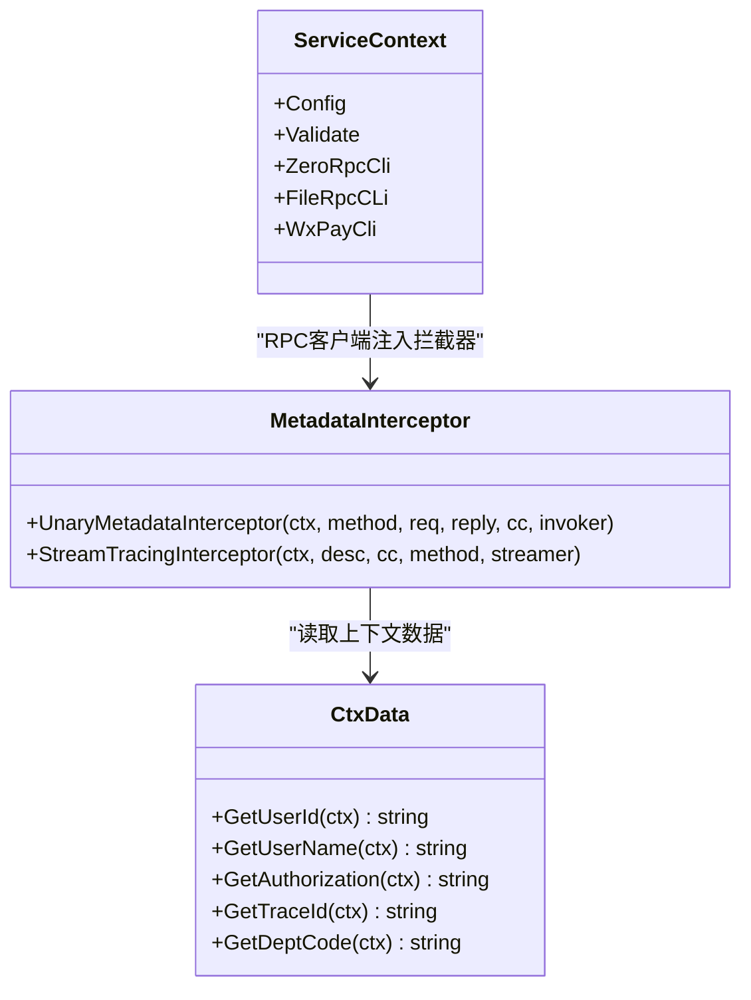
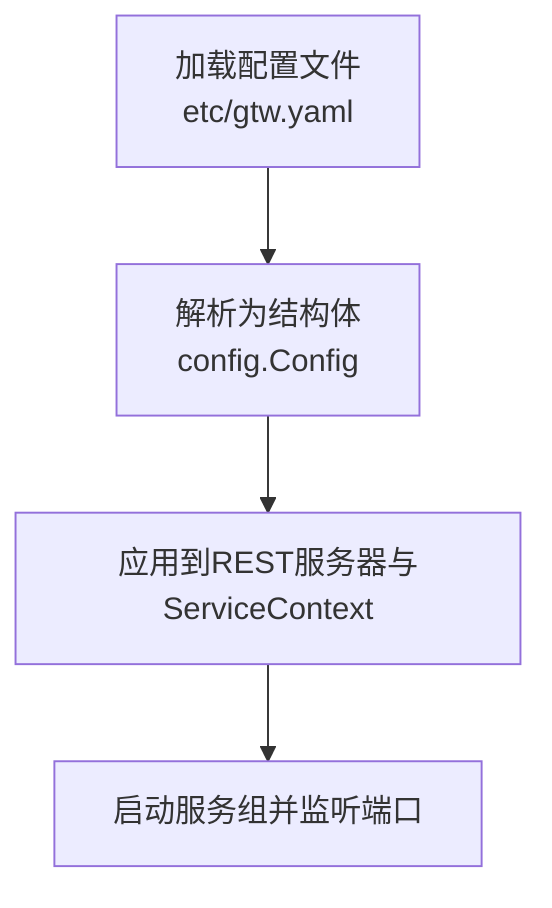
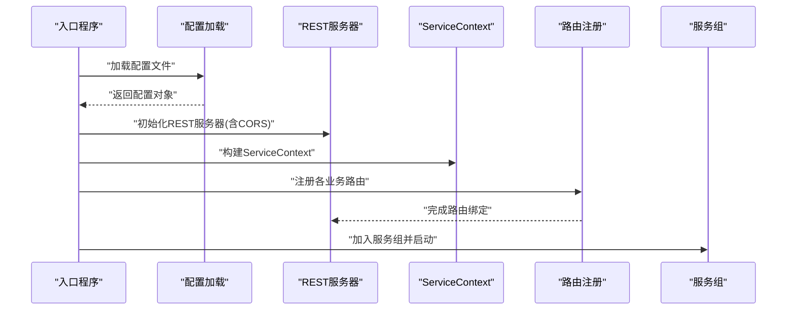
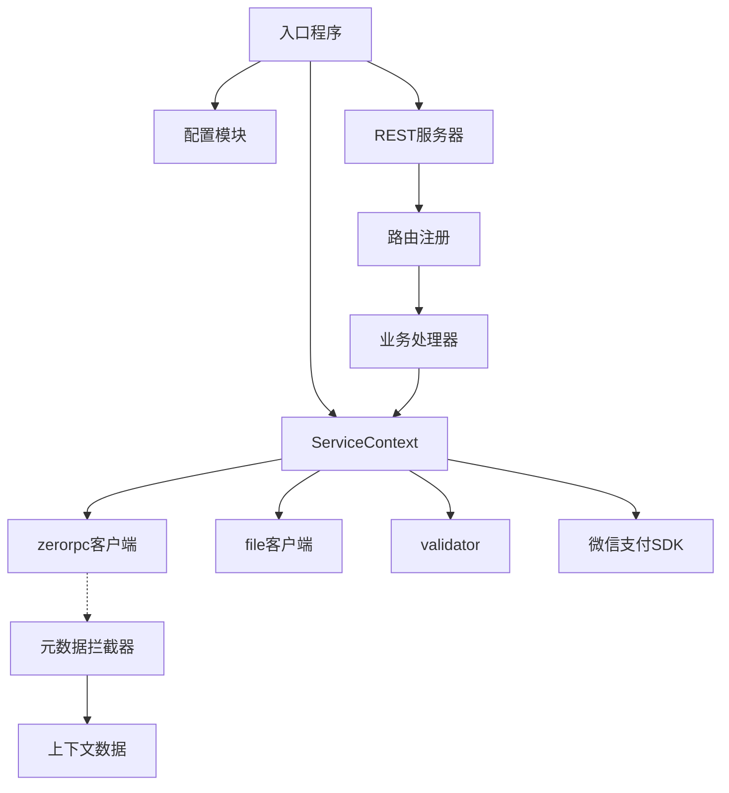

# 网关架构设计

<cite>
**本文引用的文件**
- [gtw.go](file://gtw/gtw.go)
- [servicecontext.go](file://gtw/internal/svc/servicecontext.go)
- [config.go](file://gtw/internal/config/config.go)
- [gtw.yaml](file://gtw/etc/gtw.yaml)
- [routes.go](file://gtw/internal/handler/routes.go)
- [metadataInterceptor.go](file://common/Interceptor/rpcclient/metadataInterceptor.go)
- [ctxData.go](file://common/ctxdata/ctxData.go)
- [servicecontext.go](file://zerorpc/internal/svc/servicecontext.go)
- [servicecontext.go](file://app/file/internal/svc/servicecontext.go)
</cite>

## 目录
1. [引言](#引言)
2. [项目结构](#项目结构)
3. [核心组件](#核心组件)
4. [架构总览](#架构总览)
5. [详细组件分析](#详细组件分析)
6. [依赖分析](#依赖分析)
7. [性能考虑](#性能考虑)
8. [故障排查指南](#故障排查指南)
9. [结论](#结论)
10. [附录](#附录)

## 引言
本文件面向BFF（Backend For Frontend）网关的架构设计与实现，围绕RESTful API服务器初始化、服务上下文（ServiceContext）设计与依赖注入、配置文件加载与解析、CORS跨域处理、服务注册与启动流程、日志系统集成与全局字段添加等方面进行系统化梳理，并通过多种可视化图表帮助开发者快速理解网关内部工作原理。

## 项目结构
网关模块位于 gtw 目录，采用“入口程序 + 配置 + 服务上下文 + 路由注册”的分层组织方式：
- 入口程序负责加载配置、初始化REST服务器、注册路由、启动服务组
- 配置模块定义运行时配置结构体，包含Host、Port、SwaggerPath、JwtAuth、zrpc客户端配置等
- 服务上下文聚合业务所需依赖（校验器、RPC客户端、支付SDK等），作为处理器的共享容器
- 路由注册模块集中声明各业务前缀下的REST路由及鉴权策略
- 中间件与上下文数据模块负责在gRPC调用中传递用户与链路追踪信息

**图表来源**
- [gtw.go:25-95](file://gtw/gtw.go#L25-L95)
- [config.go:8-20](file://gtw/internal/config/config.go#L8-L20)
- [routes.go:20-160](file://gtw/internal/handler/routes.go#L20-L160)

**章节来源**
- [gtw.go:25-95](file://gtw/gtw.go#L25-L95)
- [config.go:8-20](file://gtw/internal/config/config.go#L8-L20)
- [routes.go:20-160](file://gtw/internal/handler/routes.go#L20-L160)

## 核心组件
- REST服务器初始化与CORS：通过自定义CORS回调实现动态Origin设置、预检请求支持、凭证与头部白名单控制
- 服务上下文（ServiceContext）：集中管理验证器、RPC客户端、微信支付SDK等，作为处理器依赖注入容器
- 配置加载与解析：从YAML文件加载运行参数，包括Host、Port、SwaggerPath、JwtAuth、zrpc客户端配置等
- 路由注册与中间件：按业务前缀注册路由，部分路由启用JWT鉴权；统一通过REST框架的中间件链路处理
- 日志系统：在启动阶段添加全局字段，便于日志聚合与追踪

**章节来源**
- [gtw.go:51-63](file://gtw/gtw.go#L51-L63)
- [servicecontext.go:15-21](file://gtw/internal/svc/servicecontext.go#L15-L21)
- [config.go:8-20](file://gtw/internal/config/config.go#L8-L20)
- [routes.go:157-158](file://gtw/internal/handler/routes.go#L157-L158)
- [gtw.go:91-91](file://gtw/gtw.go#L91-L91)

## 架构总览
下图展示了从入口到路由处理、再到下游RPC服务的整体调用链，以及CORS与日志的关键节点：

**图表来源**
- [gtw.go:51-65](file://gtw/gtw.go#L51-L65)
- [routes.go:20-160](file://gtw/internal/handler/routes.go#L20-L160)
- [servicecontext.go:23-64](file://gtw/internal/svc/servicecontext.go#L23-L64)
- [metadataInterceptor.go:11-32](file://common/Interceptor/rpcclient/metadataInterceptor.go#L11-L32)

## 详细组件分析

### REST服务器初始化与CORS
- 初始化方式：使用REST框架提供的服务器工厂函数，传入运行配置并启用自定义CORS回调
- CORS策略要点：
  - 动态Origin：根据请求头中的Origin设置响应头，避免固定域名限制
  - 预检请求支持：明确允许OPTIONS方法，确保浏览器预检正常
  - 凭证与头部白名单：允许携带Cookie/Token，开放常用请求头与暴露响应头
  - Vary头：避免缓存污染，按Origin区分缓存
- Swagger静态路由：当配置中存在SwaggerPath时，动态注册/swagger/:fileName路由，用于暴露本地JSON文件

**图表来源**
- [gtw.go:51-63](file://gtw/gtw.go#L51-L63)

**章节来源**
- [gtw.go:51-63](file://gtw/gtw.go#L51-L63)
- [gtw.go:70-90](file://gtw/gtw.go#L70-L90)

### 服务上下文（ServiceContext）设计与依赖注入
- 结构组成：包含配置对象、验证器、RPC客户端（zerorpc、file）、微信支付SDK等
- 构建流程：在入口处基于配置实例化ServiceContext，随后注入到所有处理器
- 依赖注入：处理器通过ServiceContext获取所需依赖，避免在各层重复构造或硬编码
- RPC拦截：RPC客户端在初始化时注入元数据拦截器，自动将用户与链路追踪信息透传至下游

**图表来源**
- [servicecontext.go:15-21](file://gtw/internal/svc/servicecontext.go#L15-L21)
- [metadataInterceptor.go:11-32](file://common/Interceptor/rpcclient/metadataInterceptor.go#L11-L32)
- [ctxData.go:42-75](file://common/ctxdata/ctxData.go#L42-L75)

**章节来源**
- [servicecontext.go:23-64](file://gtw/internal/svc/servicecontext.go#L23-L64)
- [metadataInterceptor.go:11-32](file://common/Interceptor/rpcclient/metadataInterceptor.go#L11-L32)
- [ctxData.go:42-75](file://common/ctxdata/ctxData.go#L42-L75)

### 配置文件加载与解析
- 加载入口：命令行参数指定配置文件路径，默认etc/gtw.yaml
- 解析逻辑：使用框架提供的配置加载函数将YAML内容映射到配置结构体
- 关键配置项：
  - Name/Host/Port：服务名称与监听地址
  - JwtAuth.AccessSecret：JWT鉴权密钥
  - ZeroRpcConf/FileRpcConf：RPC客户端连接配置
  - NfsRootPath/DownloadUrl：文件存储与下载URL前缀
  - SwaggerPath：Swagger JSON文件目录，用于动态暴露
- 运行时行为：REST配置继承自框架的RestConf，可直接复用其通用能力

**图表来源**
- [gtw.go:23-30](file://gtw/gtw.go#L23-L30)
- [config.go:8-20](file://gtw/internal/config/config.go#L8-L20)
- [gtw.yaml:1-61](file://gtw/etc/gtw.yaml#L1-L61)

**章节来源**
- [gtw.go:23-30](file://gtw/gtw.go#L23-L30)
- [config.go:8-20](file://gtw/internal/config/config.go#L8-L20)
- [gtw.yaml:1-61](file://gtw/etc/gtw.yaml#L1-L61)

### 服务注册与启动流程
- 中间件链路：CORS回调在路由匹配之前执行，确保所有请求均受跨域策略约束
- 路由注册：按业务前缀分组注册REST路由，统一设置前缀与超时策略
- JWT鉴权：对特定用户相关路由启用JWT鉴权，使用配置中的AccessSecret
- 服务组启动：将REST服务器加入服务组，统一生命周期管理与优雅停机

**图表来源**
- [gtw.go:51-65](file://gtw/gtw.go#L51-L65)
- [routes.go:20-160](file://gtw/internal/handler/routes.go#L20-L160)

**章节来源**
- [gtw.go:64-68](file://gtw/gtw.go#L64-L68)
- [routes.go:20-160](file://gtw/internal/handler/routes.go#L20-L160)

### 日志系统集成与全局字段
- 全局字段添加：在启动阶段为日志系统追加全局字段，便于多应用日志聚合与关联
- 字段作用：通过统一的app标识，便于在日志系统中筛选与定位该网关实例

**章节来源**
- [gtw.go:91-91](file://gtw/gtw.go#L91-L91)

## 依赖分析
- 组件耦合度：入口程序仅依赖配置、服务上下文与路由注册，保持低耦合
- 外部依赖：REST框架、zrpc、validator、微信支付SDK、OpenTelemetry传播器
- 依赖注入：ServiceContext集中承载RPC客户端与工具类，处理器通过上下文访问，避免分散初始化
- 中间件契约：元数据拦截器约定以小写头部名传递用户与链路追踪信息，保证跨服务一致性

**图表来源**
- [gtw.go:25-95](file://gtw/gtw.go#L25-L95)
- [servicecontext.go:23-64](file://gtw/internal/svc/servicecontext.go#L23-L64)
- [metadataInterceptor.go:11-32](file://common/Interceptor/rpcclient/metadataInterceptor.go#L11-L32)
- [ctxData.go:42-75](file://common/ctxdata/ctxData.go#L42-L75)

**章节来源**
- [servicecontext.go:23-64](file://gtw/internal/svc/servicecontext.go#L23-L64)
- [metadataInterceptor.go:11-32](file://common/Interceptor/rpcclient/metadataInterceptor.go#L11-L32)
- [ctxData.go:42-75](file://common/ctxdata/ctxData.go#L42-L75)

## 性能考虑
- 路由超时：针对文件上传等长耗时操作设置独立超时，避免阻塞其他请求
- 并发控制：RPC客户端与任务执行器具备并发与限流能力，建议结合实际QPS调整
- CORS成本：动态Origin设置与Vary头会增加少量CPU开销，通常可忽略
- 日志输出：生产环境建议使用异步日志与滚动切分，避免I/O成为瓶颈

## 故障排查指南
- CORS相关问题
  - 现象：浏览器报跨域错误或预检失败
  - 排查：确认请求头Origin是否正确传递，响应头是否包含允许的方法与头部
  - 参考：CORS回调设置的允许方法、头部与凭证策略
- Swagger静态文件无法访问
  - 现象：访问/swagger/:fileName返回404
  - 排查：确认配置文件中SwaggerPath指向的目录存在且可读
- JWT鉴权失败
  - 现象：用户相关接口返回未授权
  - 排查：核对JWT签名密钥与前端令牌生成一致，检查路由是否启用JWT中间件
- RPC调用异常
  - 现象：下游服务不可达或响应超时
  - 排查：检查RPC客户端配置、网络连通性与下游健康状态；确认元数据拦截器已注入

**章节来源**
- [gtw.go:51-63](file://gtw/gtw.go#L51-L63)
- [gtw.go:70-90](file://gtw/gtw.go#L70-L90)
- [routes.go:157-158](file://gtw/internal/handler/routes.go#L157-L158)
- [metadataInterceptor.go:11-32](file://common/Interceptor/rpcclient/metadataInterceptor.go#L11-L32)

## 结论
本网关通过清晰的分层与依赖注入，实现了REST服务器的快速搭建、灵活的CORS策略、完善的路由注册与JWT鉴权、以及可扩展的日志与RPC调用链路。配置驱动的方式使得部署与运维更加便捷，适合在微服务架构中承担统一入口的角色。

## 附录
- 关键配置项速览
  - Name/Host/Port：服务标识与监听地址
  - JwtAuth.AccessSecret：JWT密钥
  - ZeroRpcConf/FileRpcConf：RPC客户端连接配置
  - NfsRootPath/DownloadUrl：文件存储与下载前缀
  - SwaggerPath：Swagger JSON目录
- 典型路由前缀
  - /app/common/v1：通用能力
  - /file/v1：文件相关
  - /gtw/v1：网关通用
  - /gtw/v1/pay：支付通知
  - /app/user/v1：用户相关（部分启用JWT）