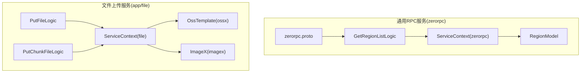
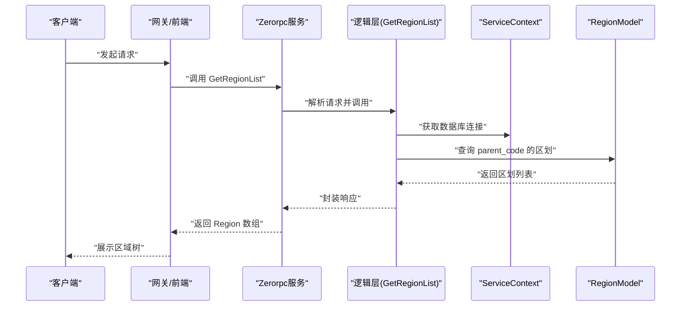
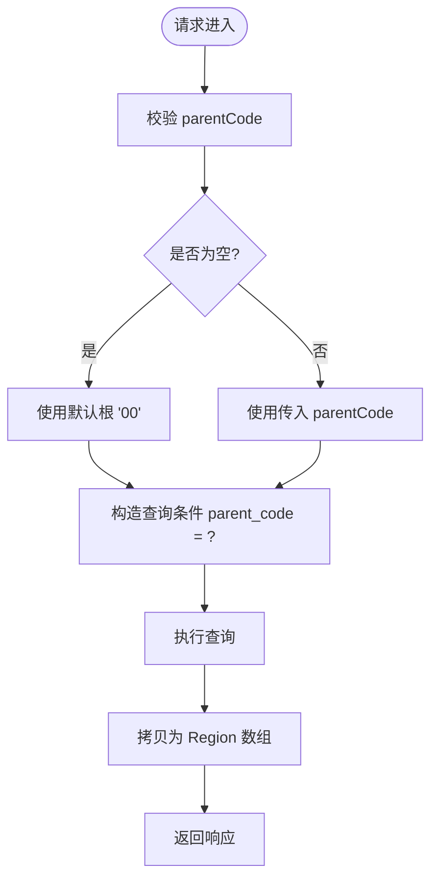
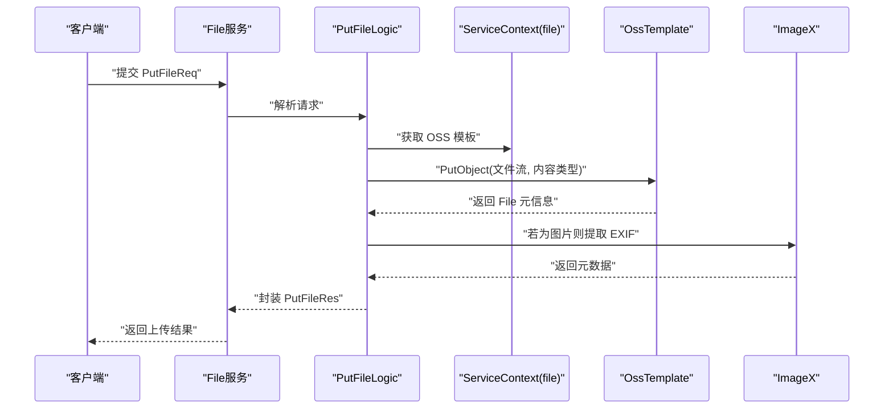
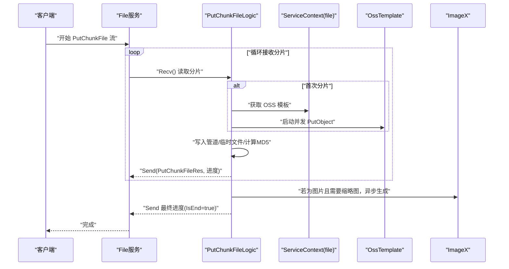
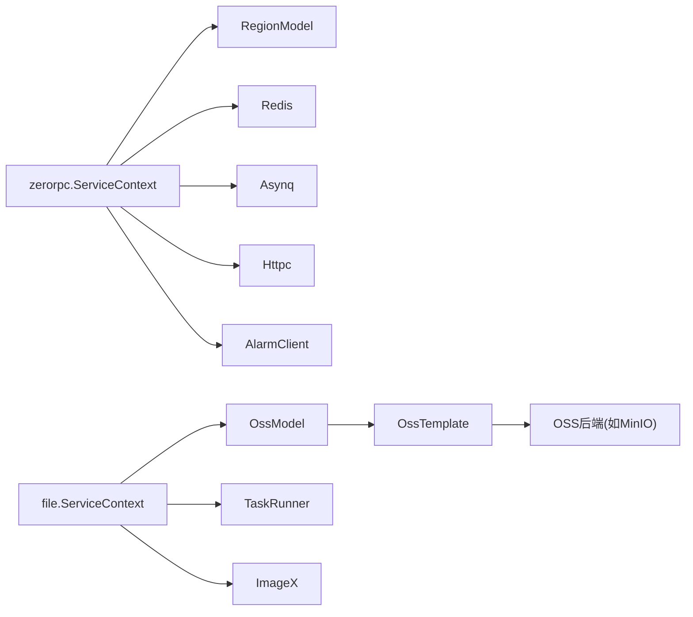

# 通用服务模块

<cite>
**本文引用的文件**
- [zerorpc.proto](file://zerorpc/zerorpc.proto)
- [getregionlistlogic.go](file://zerorpc/internal/logic/getregionlistlogic.go)
- [servicecontext.go](file://zerorpc/internal/svc/servicecontext.go)
- [regionmodel.go](file://model/regionmodel.go)
- [putchunkfilelogic.go](file://app/file/internal/logic/putchunkfilelogic.go)
- [putfilelogic.go](file://app/file/internal/logic/putfilelogic.go)
- [servicecontext.go](file://app/file/internal/svc/servicecontext.go)
- [ossx.go](file://common/ossx/ossx.go)
- [imaging.go](file://common/imagex/imaging.go)
</cite>

## 目录
1. [简介](#简介)
2. [项目结构](#项目结构)
3. [核心组件](#核心组件)
4. [架构总览](#架构总览)
5. [详细组件分析](#详细组件分析)
6. [依赖分析](#依赖分析)
7. [性能考量](#性能考量)
8. [故障排查指南](#故障排查指南)
9. [结论](#结论)
10. [附录](#附录)

## 简介
本文件为通用服务模块的详细API文档，聚焦以下目标：
- 区域列表查询接口：行政区划数据获取、层级关系处理与缓存策略
- MFS上传接口：多文件上传处理、文件分片管理与上传进度跟踪
- 设计理念：接口复用性、扩展性与可维护性的平衡
- 接口规范：请求参数、响应格式、数据结构与使用示例
- 集成方式与数据流转：与后端服务的对接流程
- 错误码定义、异常处理与性能优化建议
- 实际应用场景与最佳实践

## 项目结构
通用服务模块由两大部分组成：
- zerorpc：提供通用RPC能力，包含区域列表查询等通用接口
- app/file：提供文件上传能力，支持单文件与分片上传、缩略图生成与进度反馈

**图表来源**
- [zerorpc.proto:43-62](file://zerorpc/zerorpc.proto#L43-L62)
- [getregionlistlogic.go:28-42](file://zerorpc/internal/logic/getregionlistlogic.go#L28-L42)
- [servicecontext.go:19-33](file://zerorpc/internal/svc/servicecontext.go#L19-L33)
- [regionmodel.go:10-13](file://model/regionmodel.go#L10-L13)
- [putfilelogic.go:33-77](file://app/file/internal/logic/putfilelogic.go#L33-L77)
- [putchunkfilelogic.go:38-269](file://app/file/internal/logic/putchunkfilelogic.go#L38-L269)
- [servicecontext.go:12-17](file://app/file/internal/svc/servicecontext.go#L12-L17)
- [ossx.go:28-39](file://common/ossx/ossx.go#L28-L39)
- [imaging.go:18-32](file://common/imagex/imaging.go#L18-L32)

**章节来源**
- [zerorpc.proto:1-167](file://zerorpc/zerorpc.proto#L1-L167)
- [getregionlistlogic.go:1-44](file://zerorpc/internal/logic/getregionlistlogic.go#L1-L44)
- [servicecontext.go:1-102](file://zerorpc/internal/svc/servicecontext.go#L1-L102)
- [regionmodel.go:1-32](file://model/regionmodel.go#L1-L32)
- [putfilelogic.go:1-78](file://app/file/internal/logic/putfilelogic.go#L1-L78)
- [putchunkfilelogic.go:1-270](file://app/file/internal/logic/putchunkfilelogic.go#L1-L270)
- [servicecontext.go:1-27](file://app/file/internal/svc/servicecontext.go#L1-L27)
- [ossx.go:1-152](file://common/ossx/ossx.go#L1-L152)
- [imaging.go:1-69](file://common/imagex/imaging.go#L1-L69)

## 核心组件
- 区域列表查询接口：基于父级区划编码(parentCode)查询下级行政区划，支持默认根节点“00”
- 文件上传接口：
  - 单文件上传：本地文件路径直传，自动探测内容类型，提取图像EXIF元数据
  - 分片上传：gRPC双向流式传输，边接收边写入OSS，实时返回上传进度
- 通用服务上下文：集中注入数据库连接、Redis、异步任务、第三方SDK等资源
- 对象存储抽象：统一OSS模板接口，按租户与配置动态选择后端实现

**章节来源**
- [zerorpc.proto:43-62](file://zerorpc/zerorpc.proto#L43-L62)
- [getregionlistlogic.go:28-42](file://zerorpc/internal/logic/getregionlistlogic.go#L28-L42)
- [putfilelogic.go:33-77](file://app/file/internal/logic/putfilelogic.go#L33-L77)
- [putchunkfilelogic.go:38-269](file://app/file/internal/logic/putchunkfilelogic.go#L38-L269)
- [servicecontext.go:19-33](file://zerorpc/internal/svc/servicecontext.go#L19-L33)
- [servicecontext.go:12-17](file://app/file/internal/svc/servicecontext.go#L12-L17)
- [ossx.go:28-39](file://common/ossx/ossx.go#L28-L39)

## 架构总览
通用服务通过gRPC暴露接口，前端或网关调用后经逻辑层访问模型层与外部服务（如OSS），最终返回标准响应。

**图表来源**
- [zerorpc.proto:150-151](file://zerorpc/zerorpc.proto#L150-L151)
- [getregionlistlogic.go:28-42](file://zerorpc/internal/logic/getregionlistlogic.go#L28-L42)
- [servicecontext.go:98-99](file://zerorpc/internal/svc/servicecontext.go#L98-L99)
- [regionmodel.go:10-13](file://model/regionmodel.go#L10-L13)

## 详细组件分析

### 区域列表查询接口
- 接口定义：GetRegionListReq(parentCode) → GetRegionListRes(repeated Region)
- 数据模型：Region(code, parentCode, name, province*, city*, district*, level)
- 处理逻辑：
  - 若未提供parentCode，默认使用“00”作为根节点
  - 使用SQL构建器按parent_code过滤
  - 查询结果映射为Region数组返回
- 缓存策略：当前实现未见显式缓存；可在ServiceContext中引入Redis缓存以降低重复查询开销

**图表来源**
- [getregionlistlogic.go:28-42](file://zerorpc/internal/logic/getregionlistlogic.go#L28-L42)

**章节来源**
- [zerorpc.proto:43-62](file://zerorpc/zerorpc.proto#L43-L62)
- [getregionlistlogic.go:28-42](file://zerorpc/internal/logic/getregionlistlogic.go#L28-L42)
- [servicecontext.go:98-99](file://zerorpc/internal/svc/servicecontext.go#L98-L99)
- [regionmodel.go:10-13](file://model/regionmodel.go#L10-L13)

### MFS上传接口（单文件）
- 接口定义：PutFileReq(tenantId, code, bucketName, filename, pathPrefix?, path?) → PutFileRes(file)
- 处理流程：
  - 通过租户与code获取OSS配置模板
  - 打开本地文件，读取前512字节探测内容类型
  - 重置文件指针，调用OSS模板PutObject上传
  - 若为图片，提取EXIF元数据并回填到响应
- 适用场景：小文件直传、批量离线导入、定时任务触发的文件归档

**图表来源**
- [putfilelogic.go:33-77](file://app/file/internal/logic/putfilelogic.go#L33-L77)
- [servicecontext.go:19-25](file://app/file/internal/svc/servicecontext.go#L19-L25)
- [ossx.go:109-151](file://common/ossx/ossx.go#L109-L151)
- [imaging.go:18-32](file://common/imagex/imaging.go#L18-L32)

**章节来源**
- [putfilelogic.go:33-77](file://app/file/internal/logic/putfilelogic.go#L33-L77)
- [servicecontext.go:19-25](file://app/file/internal/svc/servicecontext.go#L19-L25)
- [ossx.go:109-151](file://common/ossx/ossx.go#L109-L151)
- [imaging.go:18-32](file://common/imagex/imaging.go#L18-L32)

### MFS上传接口（分片上传）
- 接口定义：FileRpc.PutChunkFile(流式) → PutChunkFileRes(分片数据+进度)
- 处理流程：
  - 初始化临时目录与临时文件，建立管道写入OSS
  - 首包解析元信息(tenantId, code, bucketName, filename, contentType, size, isThumb, pathPrefix)
  - 启动协程并发写入OSS，主协程接收分片数据写入管道与本地临时文件
  - 实时发送进度(已上传字节)，支持图片EXIF探测与缩略图异步生成
  - 完成后返回最终文件信息
- 适用场景：大文件断点续传、网络不稳定环境、前端分片上传

**图表来源**
- [putchunkfilelogic.go:38-269](file://app/file/internal/logic/putchunkfilelogic.go#L38-L269)
- [servicecontext.go:24-25](file://app/file/internal/svc/servicecontext.go#L24-L25)
- [ossx.go:109-151](file://common/ossx/ossx.go#L109-L151)
- [imaging.go:18-32](file://common/imagex/imaging.go#L18-L32)

**章节来源**
- [putchunkfilelogic.go:38-269](file://app/file/internal/logic/putchunkfilelogic.go#L38-L269)
- [servicecontext.go:19-25](file://app/file/internal/svc/servicecontext.go#L19-L25)
- [ossx.go:109-151](file://common/ossx/ossx.go#L109-L151)
- [imaging.go:18-32](file://common/imagex/imaging.go#L18-L32)

### 通用服务设计理念
- 复用性：通过统一的OSS模板接口与RegionModel接口，不同业务可直接复用
- 扩展性：ServiceContext集中注入资源，新增第三方SDK或模型只需扩展上下文
- 维护性：逻辑层与模型层解耦，接口契约稳定，便于版本演进

**章节来源**
- [servicecontext.go:19-33](file://zerorpc/internal/svc/servicecontext.go#L19-L33)
- [servicecontext.go:12-17](file://app/file/internal/svc/servicecontext.go#L12-L17)
- [regionmodel.go:10-13](file://model/regionmodel.go#L10-L13)
- [ossx.go:28-39](file://common/ossx/ossx.go#L28-L39)

## 依赖分析
- zerorpc依赖：
  - RegionModel：数据库访问
  - Redis/Asynq/Httpc/AlarmClient：通用中间件与外部服务
- app/file依赖：
  - OssModel：OSS配置
  - OssTemplate：对象存储抽象
  - ImageX：图像处理
  - TaskRunner：异步任务调度

**图表来源**
- [servicecontext.go:19-33](file://zerorpc/internal/svc/servicecontext.go#L19-L33)
- [servicecontext.go:12-17](file://app/file/internal/svc/servicecontext.go#L12-L17)
- [ossx.go:109-151](file://common/ossx/ossx.go#L109-L151)

**章节来源**
- [servicecontext.go:19-33](file://zerorpc/internal/svc/servicecontext.go#L19-L33)
- [servicecontext.go:12-17](file://app/file/internal/svc/servicecontext.go#L12-L17)
- [ossx.go:109-151](file://common/ossx/ossx.go#L109-L151)

## 性能考量
- 区域列表查询
  - 建议对高频查询增加Redis缓存，键策略可按parentCode+level组合
  - 对于层级较深的区域树，可采用懒加载或分页策略
- 文件上传
  - 分片上传采用管道与并发写入，减少内存占用
  - 图片缩略图异步生成，避免阻塞主流程
  - 内容类型探测仅读取必要字节，避免全量扫描
- 通用服务
  - ServiceContext按需初始化，避免不必要的SDK连接
  - OSS模板按租户维度缓存，减少重复初始化

[本节为通用性能建议，无需特定文件引用]

## 故障排查指南
- 区域列表查询
  - 现象：返回空列表
  - 排查：确认parentCode是否正确；检查数据库中是否存在对应记录
- 分片上传
  - 现象：进度停滞
  - 排查：检查OSS写入协程是否报错；确认网络稳定性；查看临时文件权限
  - 现象：缩略图未生成
  - 排查：确认图片EXIF读取是否成功；检查异步任务队列状态
- 单文件上传
  - 现象：内容类型识别异常
  - 排查：确认文件头是否完整；检查探测字节数是否足够
  - 现象：EXIF元数据缺失
  - 排查：确认文件为图片类型；检查图像库读取是否报错

**章节来源**
- [getregionlistlogic.go:28-42](file://zerorpc/internal/logic/getregionlistlogic.go#L28-L42)
- [putchunkfilelogic.go:91-100](file://app/file/internal/logic/putchunkfilelogic.go#L91-L100)
- [putchunkfilelogic.go:136-144](file://app/file/internal/logic/putchunkfilelogic.go#L136-L144)
- [putfilelogic.go:49-60](file://app/file/internal/logic/putfilelogic.go#L49-L60)

## 结论
通用服务模块通过清晰的接口设计与稳定的底层抽象，实现了区域查询与文件上传两大核心能力。结合合理的缓存与异步处理策略，能够在保证性能的同时提升可维护性与扩展性。建议在生产环境中进一步完善错误码体系、监控告警与限流降级机制，以应对复杂场景下的高可用需求。

[本节为总结性内容，无需特定文件引用]

## 附录

### API规范：区域列表查询
- 接口名称：GetRegionList
- 请求体：GetRegionListReq
  - 参数：parentCode(string) 可选；默认“00”
- 响应体：GetRegionListRes
  - 字段：region(repeated Region)
- Region字段：
  - code, parentCode, name
  - provinceCode, provinceName, cityCode, cityName, districtCode, districtName
  - regionLevel(int64)

使用示例（概念性）：
- 请求：parentCode=“00”
- 响应：返回省一级行政区划列表
- 下游：前端按层级渲染树形结构

**章节来源**
- [zerorpc.proto:43-62](file://zerorpc/zerorpc.proto#L43-L62)
- [getregionlistlogic.go:28-42](file://zerorpc/internal/logic/getregionlistlogic.go#L28-L42)

### API规范：单文件上传
- 接口名称：PutFile
- 请求体：PutFileReq
  - 参数：tenantId, code, bucketName, filename, pathPrefix?, path
- 响应体：PutFileRes
  - 字段：file(File)
- File字段：
  - link, domain, name, size, formatSize, originalName, attachId
  - 若为图片，附加meta(ImageMeta)

使用示例（概念性）：
- 客户端上传本地文件路径
- 服务端探测内容类型并上传至OSS
- 返回文件访问链接与元数据

**章节来源**
- [putfilelogic.go:33-77](file://app/file/internal/logic/putfilelogic.go#L33-L77)
- [ossx.go:70-78](file://common/ossx/ossx.go#L70-L78)
- [imaging.go:18-32](file://common/imagex/imaging.go#L18-L32)

### API规范：分片上传
- 接口名称：PutChunkFile(流式)
- 请求流：PutChunkFileReq(首包含元信息，后续为content)
- 响应流：PutChunkFileRes(每包返回进度与文件信息)
- 元信息字段：tenantId, code, bucketName, filename, contentType, size, isThumb, pathPrefix
- 进度字段：isEnd(bool), size(int64, 已上传字节)

使用示例（概念性）：
- 客户端分片发送，服务端实时返回进度
- 服务端并发写入OSS，完成后返回最终文件信息
- 图片类型可选生成缩略图并异步上传

**章节来源**
- [putchunkfilelogic.go:38-269](file://app/file/internal/logic/putchunkfilelogic.go#L38-L269)
- [ossx.go:109-151](file://common/ossx/ossx.go#L109-L151)

### 错误码与异常处理
- 建议定义通用错误码：
  - 1000：参数校验失败
  - 1001：数据库查询异常
  - 1002：OSS写入失败
  - 1003：缩略图生成失败
- 异常处理：
  - 对外返回统一错误结构
  - 对内记录详细日志与追踪ID
  - 对关键操作增加重试与熔断

[本节为通用规范建议，无需特定文件引用]

### 最佳实践
- 区域查询
  - 对高频区域树节点做缓存；按需刷新
  - 前端按需懒加载子节点，避免一次性拉取整棵树
- 文件上传
  - 分片大小建议10-50MB，结合带宽自适应
  - 上传前校验文件类型与大小
  - 图片缩略图异步生成，避免阻塞主流程
- 通用服务
  - ServiceContext按需初始化，避免冷启动开销
  - 对第三方SDK设置超时与重试策略

[本节为通用实践建议，无需特定文件引用]