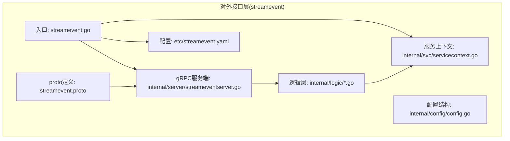
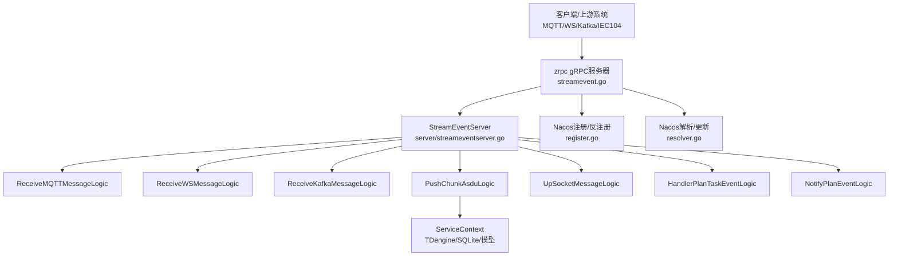
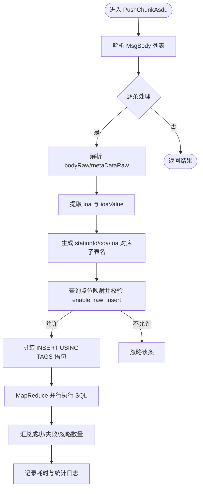
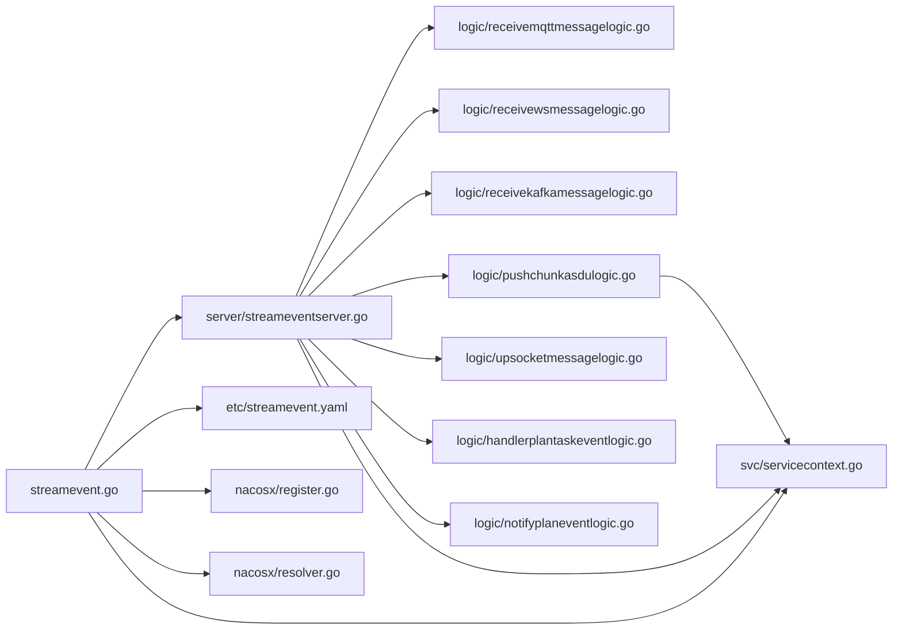

# 对外接口层

<cite>
**本文引用的文件**
- [facade/streamevent/streamevent.proto](file://facade/streamevent/streamevent.proto)
- [facade/streamevent/streamevent.go](file://facade/streamevent/streamevent.go)
- [facade/streamevent/etc/streamevent.yaml](file://facade/streamevent/etc/streamevent.yaml)
- [facade/streamevent/internal/config/config.go](file://facade/streamevent/internal/config/config.go)
- [facade/streamevent/internal/svc/servicecontext.go](file://facade/streamevent/internal/svc/servicecontext.go)
- [facade/streamevent/internal/server/streameventserver.go](file://facade/streamevent/internal/server/streameventserver.go)
- [facade/streamevent/internal/logic/receivemqttmessagelogic.go](file://facade/streamevent/internal/logic/receivemqttmessagelogic.go)
- [facade/streamevent/internal/logic/receivewsmessagelogic.go](file://facade/streamevent/internal/logic/receivewsmessagelogic.go)
- [facade/streamevent/internal/logic/receivekafkamessagelogic.go](file://facade/streamevent/internal/logic/receivekafkamessagelogic.go)
- [facade/streamevent/internal/logic/pushchunkasdulogic.go](file://facade/streamevent/internal/logic/pushchunkasdulogic.go)
- [facade/streamevent/internal/logic/upsocketmessagelogic.go](file://facade/streamevent/internal/logic/upsocketmessagelogic.go)
- [facade/streamevent/internal/logic/handlerplantaskeventlogic.go](file://facade/streamevent/internal/logic/handlerplantaskeventlogic.go)
- [facade/streamevent/internal/logic/notifyplaneventlogic.go](file://facade/streamevent/internal/logic/notifyplaneventlogic.go)
- [common/nacosx/register.go](file://common/nacosx/register.go)
- [common/nacosx/resolver.go](file://common/nacosx/resolver.go)
</cite>

## 目录
1. [简介](#简介)
2. [项目结构](#项目结构)
3. [核心组件](#核心组件)
4. [架构总览](#架构总览)
5. [详细组件分析](#详细组件分析)
6. [依赖分析](#依赖分析)
7. [性能考虑](#性能考虑)
8. [故障排查指南](#故障排查指南)
9. [结论](#结论)
10. [附录](#附录)

## 简介
本文件面向 Zero-Service 的对外接口层（facade/streamevent），系统性梳理统一流数据事件协议的设计理念与实现要点，覆盖以下主题：
- 统一流数据事件协议：统一接收 MQTT/WS/Kafka/IEC104（ASDU）等多源事件，抽象为一致的 RPC 接口与数据模型。
- 跨语言支持与协议转换：通过 proto 定义与多语言编译产物，结合 TDengine 写入与点位映射，实现跨语言与跨协议的数据汇聚。
- gRPC 服务定义与实现：基于 go-zero 的 zrpc 服务器，提供事件接收、消息处理与状态管理能力。
- 服务注册与发现：集成 Nacos，支持服务注册、健康检查与地址解析。
- 流式数据处理：对接 WebSocket 与 SSE 等实时通道（在本模块中以 UpSocketMessage 为例），展示上行/下行交互模式。
- 协议版本管理与兼容：通过 proto 版本演进与字段命名约定，保障向后兼容与平滑升级。
- 服务上下文与依赖注入：ServiceContext 统一注入数据库连接与模型，确保逻辑层解耦。
- API 文档与客户端集成：提供接口清单、请求/响应结构与调用流程图。
- 性能优化与监控：并发写入、批处理、日志与统计中间件配置、延迟与吞吐优化建议。

## 项目结构
对外接口层位于 facade/streamevent，采用典型的 goctl 生成结构：
- proto 定义：streamevent.proto
- 启动入口：streamevent.go
- 配置：etc/streamevent.yaml
- 配置结构体：internal/config/config.go
- 服务上下文：internal/svc/servicecontext.go
- gRPC 服务端：internal/server/streameventserver.go
- 业务逻辑：internal/logic/*（MQTT/WS/Kafka/ASDU/Socket/计划任务等）

图表来源
- [facade/streamevent/streamevent.go:28-71](file://facade/streamevent/streamevent.go#L28-L71)
- [facade/streamevent/etc/streamevent.yaml:1-28](file://facade/streamevent/etc/streamevent.yaml#L1-L28)
- [facade/streamevent/internal/config/config.go:5-24](file://facade/streamevent/internal/config/config.go#L5-L24)
- [facade/streamevent/internal/svc/servicecontext.go:14-32](file://facade/streamevent/internal/svc/servicecontext.go#L14-L32)
- [facade/streamevent/internal/server/streameventserver.go:15-67](file://facade/streamevent/internal/server/streameventserver.go#L15-L67)
- [facade/streamevent/streamevent.proto:10-25](file://facade/streamevent/streamevent.proto#L10-L25)

章节来源
- [facade/streamevent/streamevent.go:28-71](file://facade/streamevent/streamevent.go#L28-L71)
- [facade/streamevent/etc/streamevent.yaml:1-28](file://facade/streamevent/etc/streamevent.yaml#L1-L28)
- [facade/streamevent/internal/config/config.go:5-24](file://facade/streamevent/internal/config/config.go#L5-L24)
- [facade/streamevent/internal/svc/servicecontext.go:14-32](file://facade/streamevent/internal/svc/servicecontext.go#L14-L32)
- [facade/streamevent/internal/server/streameventserver.go:15-67](file://facade/streamevent/internal/server/streameventserver.go#L15-L67)
- [facade/streamevent/streamevent.proto:10-25](file://facade/streamevent/streamevent.proto#L10-L25)

## 核心组件
- gRPC 服务定义：StreamEvent 服务，包含接收 MQTT/WS/Kafka 消息、推送 IEC104（ASDU）片段、上行 Socket 消息、计划任务事件处理与通知等 RPC 方法。
- 服务端实现：StreamEventServer 将每个 RPC 映射到对应的 logic 层，保持职责清晰。
- 逻辑层：各功能模块的业务逻辑封装，如 PushChunkAsdu、UpSocketMessage、HandlerPlanTaskEvent、NotifyPlanEvent 等。
- 服务上下文：ServiceContext 注入 TDengine 连接、SQLite 连接与 DevicePointMappingModel，支撑点位映射与原始数据写入。
- 配置与启动：streamevent.go 加载配置、构建 ServiceContext、注册 gRPC 服务、可选启用反射、注册 Nacos 服务、添加拦截器与日志字段。
- Nacos 集成：注册与反注册、健康实例提取、地址列表排序与更新。

章节来源
- [facade/streamevent/streamevent.proto:10-25](file://facade/streamevent/streamevent.proto#L10-L25)
- [facade/streamevent/internal/server/streameventserver.go:26-66](file://facade/streamevent/internal/server/streameventserver.go#L26-L66)
- [facade/streamevent/internal/logic/pushchunkasdulogic.go:118-222](file://facade/streamevent/internal/logic/pushchunkasdulogic.go#L118-L222)
- [facade/streamevent/internal/logic/upsocketmessagelogic.go:29-55](file://facade/streamevent/internal/logic/upsocketmessagelogic.go#L29-L55)
- [facade/streamevent/internal/logic/handlerplantaskeventlogic.go:29-38](file://facade/streamevent/internal/logic/handlerplantaskeventlogic.go#L29-L38)
- [facade/streamevent/internal/logic/notifyplaneventlogic.go:27-31](file://facade/streamevent/internal/logic/notifyplaneventlogic.go#L27-L31)
- [facade/streamevent/internal/svc/servicecontext.go:14-32](file://facade/streamevent/internal/svc/servicecontext.go#L14-L32)
- [facade/streamevent/streamevent.go:37-67](file://facade/streamevent/streamevent.go#L37-L67)
- [common/nacosx/register.go:21-76](file://common/nacosx/register.go#L21-L76)
- [common/nacosx/resolver.go:47-66](file://common/nacosx/resolver.go#L47-L66)

## 架构总览
对外接口层围绕 StreamEvent 服务展开，形成“入口 -> 服务端 -> 逻辑层 -> 上下文”的清晰分层；同时通过 Nacos 实现服务注册与发现，支持 gRPC 客户端动态解析地址。

图表来源
- [facade/streamevent/streamevent.go:37-67](file://facade/streamevent/streamevent.go#L37-L67)
- [facade/streamevent/internal/server/streameventserver.go:26-66](file://facade/streamevent/internal/server/streameventserver.go#L26-L66)
- [facade/streamevent/internal/logic/pushchunkasdulogic.go:118-222](file://facade/streamevent/internal/logic/pushchunkasdulogic.go#L118-L222)
- [common/nacosx/register.go:21-76](file://common/nacosx/register.go#L21-L76)
- [common/nacosx/resolver.go:47-66](file://common/nacosx/resolver.go#L47-L66)

## 详细组件分析

### 统一流数据事件协议（StreamEvent）
- 服务方法
  - 接收 MQTT 消息：ReceiveMQTTMessage
  - 接收 WS 消息：ReceiveWSMessage
  - 接收 Kafka 消息：ReceiveKafkaMessage
  - 推送 IEC104（ASDU）片段：PushChunkAsdu
  - 上行 Socket 消息：UpSocketMessage
  - 计划任务事件处理：HandlerPlanTaskEvent
  - 通知计划任务事件：NotifyPlanEvent
- 数据模型要点
  - MQTT/WS/Kafka 消息均携带会话标识、消息 ID、发送时间等通用字段，便于追踪与去重。
  - IEC104（ASDU）消息体包含设备地址、端口、ASDU 类型、信息体对象、时间戳、元数据与点位映射等，支持多类型信息体（单点、双点、遥测、累计量等）。
  - 计划任务事件包含计划/批次/执行项等上下文，以及执行结果、消息、原因与延时配置。

章节来源
- [facade/streamevent/streamevent.proto:10-25](file://facade/streamevent/streamevent.proto#L10-L25)
- [facade/streamevent/streamevent.proto:27-80](file://facade/streamevent/streamevent.proto#L27-L80)
- [facade/streamevent/streamevent.proto:82-133](file://facade/streamevent/streamevent.proto#L82-L133)
- [facade/streamevent/streamevent.proto:135-420](file://facade/streamevent/streamevent.proto#L135-L420)
- [facade/streamevent/streamevent.proto:450-459](file://facade/streamevent/streamevent.proto#L450-L459)
- [facade/streamevent/streamevent.proto:461-581](file://facade/streamevent/streamevent.proto#L461-L581)

### gRPC 服务定义与实现
- 服务端绑定：在入口中注册 StreamEventServer，并根据运行模式选择是否开启反射。
- 方法路由：每个 RPC 在 server 层映射到对应 logic，保持业务与传输解耦。
- 中间件：添加日志拦截器，统一记录请求与耗时；配置统计中间件忽略特定方法（如 PushChunkAsdu）以降低统计开销。

章节来源
- [facade/streamevent/streamevent.go:39-45](file://facade/streamevent/streamevent.go#L39-L45)
- [facade/streamevent/internal/server/streameventserver.go:26-66](file://facade/streamevent/internal/server/streameventserver.go#L26-L66)
- [facade/streamevent/etc/streamevent.yaml:11-13](file://facade/streamevent/etc/streamevent.yaml#L11-L13)

### 服务注册与发现（Nacos）
- 注册流程：启动时根据配置构造 Nacos 客户端，注册实例（IP、端口、权重、健康、元数据、集群、分组）。
- 反注册：进程退出时自动反注册，避免悬挂实例。
- 地址解析：监听健康实例变更，提取 gRPC 可用地址，排序后更新到 gRPC 客户端连接。

章节来源
- [facade/streamevent/streamevent.go:46-64](file://facade/streamevent/streamevent.go#L46-L64)
- [common/nacosx/register.go:21-76](file://common/nacosx/register.go#L21-L76)
- [common/nacosx/resolver.go:38-66](file://common/nacosx/resolver.go#L38-L66)

### 流式数据处理（WebSocket 示例：UpSocketMessage）
- 上行消息：接收 sId、event、payload 等字段，用于建立连接、加入房间、上报数据等。
- 下行消息：从逻辑层构造 JSON payload 并返回，作为下行响应。
- 权限：从上下文提取授权信息，便于鉴权与审计。

章节来源
- [facade/streamevent/streamevent.proto:450-459](file://facade/streamevent/streamevent.proto#L450-L459)
- [facade/streamevent/internal/logic/upsocketmessagelogic.go:29-55](file://facade/streamevent/internal/logic/upsocketmessagelogic.go#L29-L55)

### IEC104（ASDU）推送与写入（PushChunkAsdu）
- 输入解析：遍历 MsgBody，解析 bodyRaw 与 metaDataRaw，提取 ioa 与 ioaValue。
- 点位映射：查询本地缓存表，判断是否允许原始插入。
- 动态建表：根据 stationId、coa、ioa 生成子表名，使用 TDengine 的 USING 子句按标签写入。
- 并发写入：使用 MapReduce 并行执行 SQL，统计成功/失败与忽略数量。
- 日志与追踪：为每次请求注入 taos_req_id，记录耗时与统计信息。

图表来源
- [facade/streamevent/internal/logic/pushchunkasdulogic.go:118-222](file://facade/streamevent/internal/logic/pushchunkasdulogic.go#L118-L222)

章节来源
- [facade/streamevent/internal/logic/pushchunkasdulogic.go:118-222](file://facade/streamevent/internal/logic/pushchunkasdulogic.go#L118-L222)

### 计划任务事件处理（HandlerPlanTaskEvent / NotifyPlanEvent）
- HandlerPlanTaskEvent：返回执行结果（已完成/终止/失败/延期/进行中）、消息与延时配置（下次触发时间与原因）。
- NotifyPlanEvent：接收计划事件通知（批次完成/计划完成等），预留扩展属性。

章节来源
- [facade/streamevent/internal/logic/handlerplantaskeventlogic.go:29-38](file://facade/streamevent/internal/logic/handlerplantaskeventlogic.go#L29-L38)
- [facade/streamevent/internal/logic/notifyplaneventlogic.go:27-31](file://facade/streamevent/internal/logic/notifyplaneventlogic.go#L27-L31)
- [facade/streamevent/streamevent.proto:560-581](file://facade/streamevent/streamevent.proto#L560-L581)

### 服务上下文与依赖注入（ServiceContext）
- 注入内容：TDengine 连接、SQLite 连接、DevicePointMappingModel。
- 初始化策略：根据配置决定是否禁用 SQL 语句日志；解析数据库类型；创建模型实例。
- 使用场景：点位映射查询、原始数据写入、统计与审计。

章节来源
- [facade/streamevent/internal/svc/servicecontext.go:14-32](file://facade/streamevent/internal/svc/servicecontext.go#L14-L32)
- [facade/streamevent/etc/streamevent.yaml:22-27](file://facade/streamevent/etc/streamevent.yaml#L22-L27)

### 入口与配置（streamevent.go / streamevent.yaml）
- 入口职责：加载配置、构建 ServiceContext、创建 zrpc 服务器、注册服务、可选反射、Nacos 注册、添加拦截器与日志字段。
- 配置要点：服务名、监听地址、日志级别、中间件统计忽略方法、Nacos 参数、TDengine 与 SQLite 数据源。

章节来源
- [facade/streamevent/streamevent.go:28-71](file://facade/streamevent/streamevent.go#L28-L71)
- [facade/streamevent/etc/streamevent.yaml:1-28](file://facade/streamevent/etc/streamevent.yaml#L1-L28)
- [facade/streamevent/internal/config/config.go:5-24](file://facade/streamevent/internal/config/config.go#L5-L24)

## 依赖分析
- 组件耦合
  - server 层仅依赖 logic 层与 ServiceContext，低耦合高内聚。
  - logic 层依赖 ServiceContext 与 protobuf 定义，不直接依赖外部框架。
  - ServiceContext 统一管理数据库连接与模型，避免重复初始化。
- 外部依赖
  - gRPC 服务器：zrpc（go-zero）
  - 日志：logx
  - 并发：mr.MapReduce
  - 时间：timex
  - 工具：tool、strconv、strings、json、carbon
  - Nacos：nacosx 包含注册与解析逻辑

图表来源
- [facade/streamevent/internal/server/streameventserver.go:26-66](file://facade/streamevent/internal/server/streameventserver.go#L26-L66)
- [facade/streamevent/internal/logic/pushchunkasdulogic.go:118-222](file://facade/streamevent/internal/logic/pushchunkasdulogic.go#L118-L222)
- [facade/streamevent/internal/svc/servicecontext.go:14-32](file://facade/streamevent/internal/svc/servicecontext.go#L14-L32)
- [facade/streamevent/streamevent.go:37-67](file://facade/streamevent/streamevent.go#L37-L67)
- [common/nacosx/register.go:21-76](file://common/nacosx/register.go#L21-L76)
- [common/nacosx/resolver.go:47-66](file://common/nacosx/resolver.go#L47-L66)

章节来源
- [facade/streamevent/internal/server/streameventserver.go:26-66](file://facade/streamevent/internal/server/streameventserver.go#L26-L66)
- [facade/streamevent/internal/logic/pushchunkasdulogic.go:118-222](file://facade/streamevent/internal/logic/pushchunkasdulogic.go#L118-L222)
- [facade/streamevent/internal/svc/servicecontext.go:14-32](file://facade/streamevent/internal/svc/servicecontext.go#L14-L32)
- [facade/streamevent/streamevent.go:37-67](file://facade/streamevent/streamevent.go#L37-L67)
- [common/nacosx/register.go:21-76](file://common/nacosx/register.go#L21-L76)
- [common/nacosx/resolver.go:47-66](file://common/nacosx/resolver.go#L47-L66)

## 性能考虑
- 并发写入：PushChunkAsdu 使用 MapReduce 并行执行 SQL，显著提升批量写入吞吐。
- 批处理与聚合：MQTT/WS/Kafka 请求结构支持批量消息，建议在上游聚合后再调用接口，减少网络与解析开销。
- 统计中间件：对高吞吐接口（如 PushChunkAsdu）配置忽略统计，降低中间件压力。
- 日志与追踪：为每批请求注入 taos_req_id，便于定位与审计。
- 数据库连接：ServiceContext 统一管理连接，避免重复创建；必要时开启连接池参数优化。
- 点位映射缓存：优先命中本地缓存表，减少远程查询；对频繁访问的点位建立索引。

## 故障排查指南
- gRPC 服务无法启动
  - 检查 ListenOn 是否被占用；确认配置文件路径正确。
  - 查看日志级别与路径，确认日志输出正常。
- Nacos 注册失败
  - 核对 Nacos 地址、端口、用户名、密码、命名空间；确认服务名与集群/分组配置。
  - 查看反注册日志，确认进程退出时是否正确反注册。
- PushChunkAsdu 写入异常
  - 检查 TDengine 数据源与数据库名配置；确认表结构与标签符合预期。
  - 关注 bodyRaw/metaDataRaw 解析错误与点位映射查询失败的日志。
  - 分析 MapReduce 报错与忽略计数，定位具体失败的 MsgBody。
- WebSocket 上行/下行异常
  - 核对 sId、event、payload 格式；确认鉴权头是否正确传递。
  - 检查逻辑层返回的 JSON 结构是否符合客户端期望。

章节来源
- [facade/streamevent/etc/streamevent.yaml:1-28](file://facade/streamevent/etc/streamevent.yaml#L1-L28)
- [facade/streamevent/streamevent.go:46-64](file://facade/streamevent/streamevent.go#L46-L64)
- [common/nacosx/register.go:21-76](file://common/nacosx/register.go#L21-L76)
- [facade/streamevent/internal/logic/pushchunkasdulogic.go:118-222](file://facade/streamevent/internal/logic/pushchunkasdulogic.go#L118-L222)
- [facade/streamevent/internal/logic/upsocketmessagelogic.go:29-55](file://facade/streamevent/internal/logic/upsocketmessagelogic.go#L29-L55)

## 结论
对外接口层通过统一的 StreamEvent 协议，将多源异构事件（MQTT/WS/Kafka/IEC104）汇聚到一致的 gRPC 接口，配合 ServiceContext 的依赖注入与 Nacos 的服务治理，实现了高可用、可扩展、可观测的对外接口。PushChunkAsdu 的并发写入与点位映射策略，为大规模实时数据接入提供了高效路径；UpSocketMessage 展示了上行/下行交互的典型模式。建议在生产环境中进一步完善上游聚合、下游订阅与监控告警体系，持续优化写入性能与稳定性。

## 附录

### API 文档与接口规范（概要）
- 服务：StreamEvent
- 方法：
  - ReceiveMQTTMessage(ReceiveMQTTMessageReq) -> ReceiveMQTTMessageRes
  - ReceiveWSMessage(ReceiveWSMessageReq) -> ReceiveWSMessageRes
  - ReceiveKafkaMessage(ReceiveKafkaMessageReq) -> ReceiveKafkaMessageRes
  - PushChunkAsdu(PushChunkAsduReq) -> PushChunkAsduRes
  - UpSocketMessage(UpSocketMessageReq) -> UpSocketMessageRes
  - HandlerPlanTaskEvent(HandlerPlanTaskEventReq) -> HandlerPlanTaskEventRes
  - NotifyPlanEvent(NotifyPlanEventReq) -> NotifyPlanEventRes

请求/响应字段要点（节选）
- ReceiveMQTTMessageReq：messages[]（sessionId/msgId/topic/topicTemplate/payload/sendTime）
- ReceiveWSMessageReq：sessionId/msgId/payload/sendTime
- ReceiveKafkaMessageReq：messages[]（sessionId/topic/group/key/value/sendTime）
- PushChunkAsduReq：tId/msgBody[]（msgId/host/port/asdu/typeId/dataType/coa/bodyRaw/time/metaDataRaw/pm）
- UpSocketMessageReq：reqId/sId/event/payload
- HandlerPlanTaskEventReq：plan/pk/batchId/execId/item*、payload、triggerTime、lastResult/message/reason
- NotifyPlanEventReq：eventType/planId/planType/batchId/attributes

章节来源
- [facade/streamevent/streamevent.proto:10-25](file://facade/streamevent/streamevent.proto#L10-L25)
- [facade/streamevent/streamevent.proto:27-80](file://facade/streamevent/streamevent.proto#L27-L80)
- [facade/streamevent/streamevent.proto:82-133](file://facade/streamevent/streamevent.proto#L82-L133)
- [facade/streamevent/streamevent.proto:450-459](file://facade/streamevent/streamevent.proto#L450-L459)
- [facade/streamevent/streamevent.proto:501-550](file://facade/streamevent/streamevent.proto#L501-L550)
- [facade/streamevent/streamevent.proto:560-581](file://facade/streamevent/streamevent.proto#L560-L581)

### 客户端集成示例（步骤指引）
- gRPC 客户端
  - 使用生成的 proto 客户端代码，连接到配置的 ListenOn 地址。
  - 对于 PushChunkAsdu，建议将多个 MsgBody 聚合为一批再调用，提升吞吐。
  - 对 UpSocketMessage，按需设置 sId、event 与 payload，接收返回的下行 JSON。
- Nacos 客户端
  - 若客户端侧需要直连服务，可使用 Nacos 解析器获取健康实例列表，进行负载均衡。
- WebSocket/SSE
  - 本模块提供 UpSocketMessage 作为上行/下行交互范式，可参考其 payload 构造与返回格式。

章节来源
- [facade/streamevent/etc/streamevent.yaml:1-28](file://facade/streamevent/etc/streamevent.yaml#L1-L28)
- [facade/streamevent/streamevent.proto:450-459](file://facade/streamevent/streamevent.proto#L450-L459)
- [common/nacosx/resolver.go:47-66](file://common/nacosx/resolver.go#L47-L66)

### 协议版本管理与兼容
- 版本演进
  - 通过 proto 文件的新增字段与可选字段，保证向后兼容。
  - 对于新增字段，建议使用 json_name 保持序列化一致性。
- 升级策略
  - 新增方法时，保持现有方法不变；客户端逐步迁移。
  - 对于字段删除，建议标记为 deprecated 并在后续版本移除。
  - 配置层面增加版本号字段，便于灰度与回滚。

章节来源
- [facade/streamevent/streamevent.proto:10-25](file://facade/streamevent/streamevent.proto#L10-L25)
- [facade/streamevent/streamevent.proto:92-133](file://facade/streamevent/streamevent.proto#L92-L133)