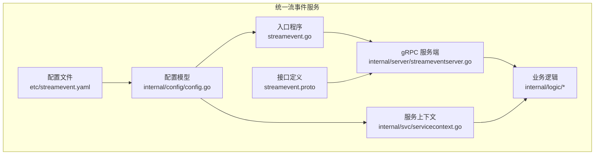
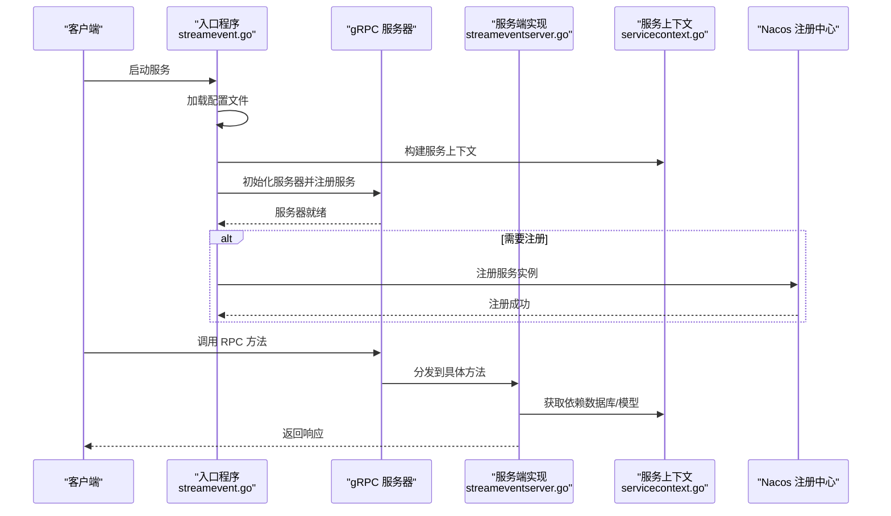
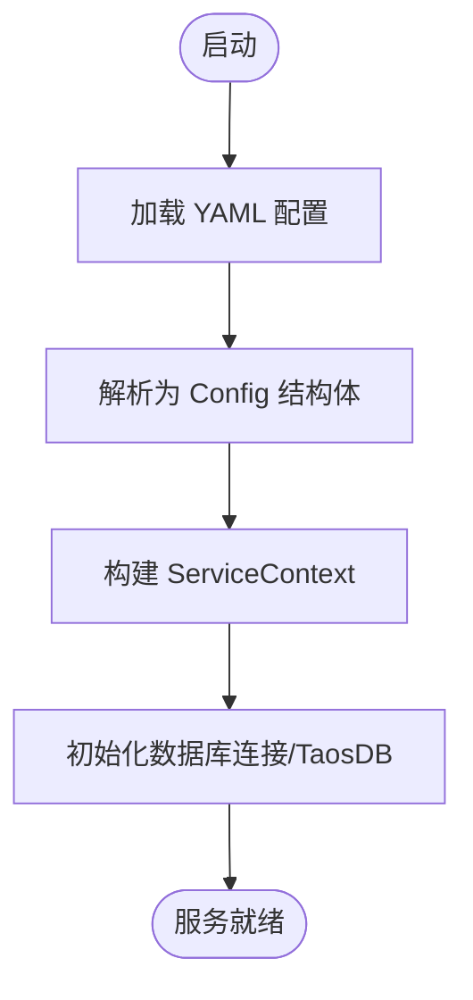
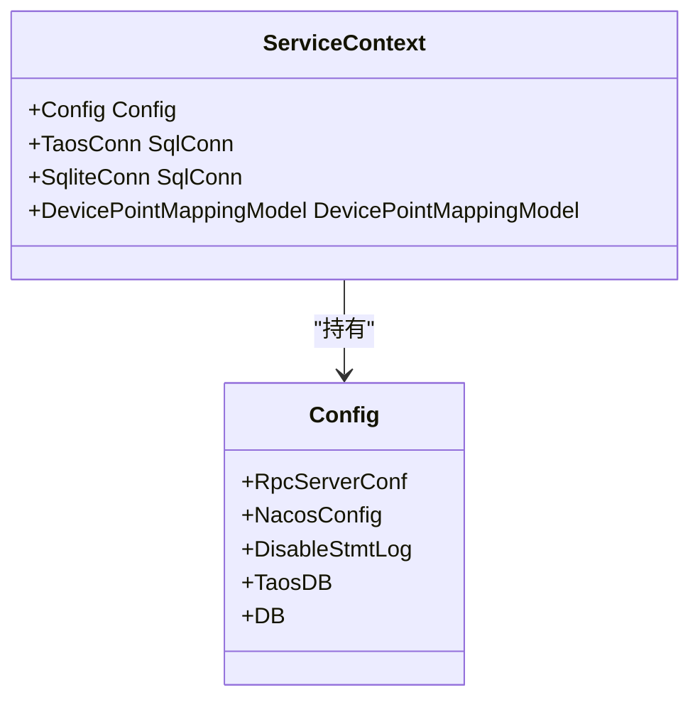
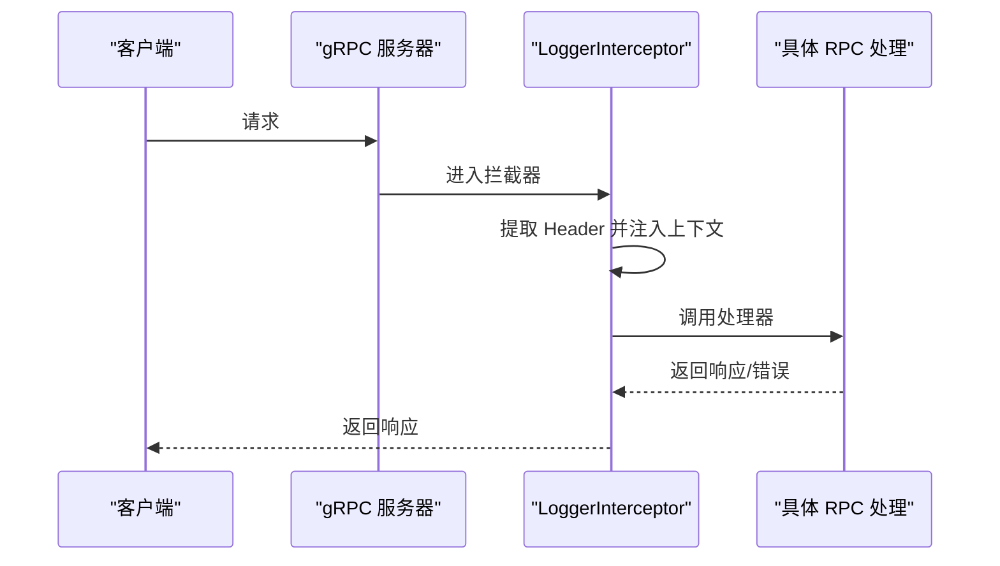
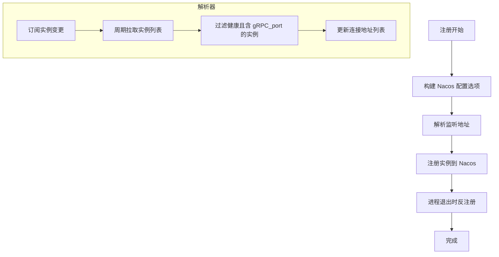
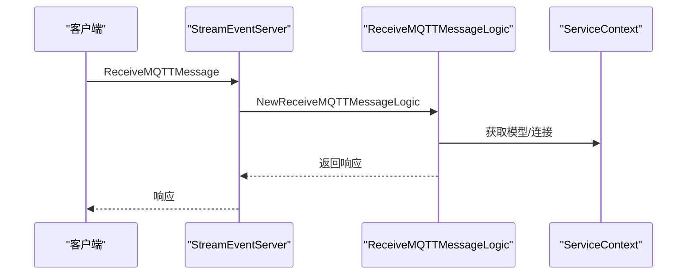
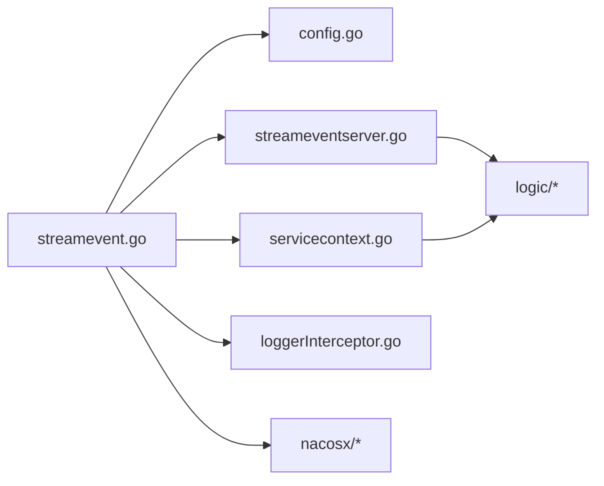

# 服务实现与配置

<cite>
**本文引用的文件**
- [facade/streamevent/etc/streamevent.yaml](file://facade/streamevent/etc/streamevent.yaml)
- [facade/streamevent/internal/config/config.go](file://facade/streamevent/internal/config/config.go)
- [facade/streamevent/internal/svc/servicecontext.go](file://facade/streamevent/internal/svc/servicecontext.go)
- [facade/streamevent/streamevent.go](file://facade/streamevent/streamevent.go)
- [facade/streamevent/internal/server/streameventserver.go](file://facade/streamevent/internal/server/streameventserver.go)
- [common/Interceptor/rpcserver/loggerInterceptor.go](file://common/Interceptor/rpcserver/loggerInterceptor.go)
- [common/nacosx/options.go](file://common/nacosx/options.go)
- [common/nacosx/register.go](file://common/nacosx/register.go)
- [common/nacosx/builder.go](file://common/nacosx/builder.go)
- [common/nacosx/resolver.go](file://common/nacosx/resolver.go)
- [facade/streamevent/streamevent.proto](file://facade/streamevent/streamevent.proto)
- [facade/streamevent/internal/logic/receivemqttmessagelogic.go](file://facade/streamevent/internal/logic/receivemqttmessagelogic.go)
- [facade/streamevent/internal/logic/upsocketmessagelogic.go](file://facade/streamevent/internal/logic/upsocketmessagelogic.go)
- [.trae/skills/zero-skills/references/rpc-patterns.md](file://.trae/skills/zero-skills/references/rpc-patterns.md)
- [.trae/skills/zero-skills/references/rest-api-patterns.md](file://.trae/skills/zero-skills/references/rest-api-patterns.md)
- [.trae/skills/zero-skills/best-practices/overview.md](file://.trae/skills/zero-skills/best-practices/overview.md)
</cite>

## 目录
1. [简介](#简介)
2. [项目结构](#项目结构)
3. [核心组件](#核心组件)
4. [架构总览](#架构总览)
5. [详细组件分析](#详细组件分析)
6. [依赖分析](#依赖分析)
7. [性能考虑](#性能考虑)
8. [故障排查指南](#故障排查指南)
9. [结论](#结论)
10. [附录](#附录)

## 简介
本文件面向统一流事件服务的实现与配置，系统性阐述服务架构设计、依赖注入与服务上下文、gRPC 服务器实现与拦截器、配置加载与管理、服务注册与发现（Nacos）、事件处理流程与状态同步、以及部署与运维监控方法。文档以统一流事件服务（streamevent）为核心案例，结合通用最佳实践与代码实现，帮助读者快速理解并落地该服务。

## 项目结构
统一流事件服务位于 facade/streamevent 目录，采用 goctl 生成的典型分层结构：
- etc：配置文件目录，包含 YAML 配置
- internal/config：服务配置模型
- internal/svc：服务上下文（依赖注入容器）
- internal/server：gRPC 服务端实现
- internal/logic：业务逻辑层（按 RPC 方法划分）
- streamevent.proto：服务接口定义
- streamevent.go：入口程序，负责配置加载、gRPC 服务器初始化、拦截器与 Nacos 注册

图表来源
- [facade/streamevent/etc/streamevent.yaml:1-28](file://facade/streamevent/etc/streamevent.yaml#L1-L28)
- [facade/streamevent/internal/config/config.go:1-25](file://facade/streamevent/internal/config/config.go#L1-L25)
- [facade/streamevent/internal/svc/servicecontext.go:1-33](file://facade/streamevent/internal/svc/servicecontext.go#L1-L33)
- [facade/streamevent/internal/server/streameventserver.go:1-67](file://facade/streamevent/internal/server/streameventserver.go#L1-L67)
- [facade/streamevent/streamevent.proto:1-25](file://facade/streamevent/streamevent.proto#L1-L25)
- [facade/streamevent/streamevent.go:1-72](file://facade/streamevent/streamevent.go#L1-L72)

章节来源
- [facade/streamevent/etc/streamevent.yaml:1-28](file://facade/streamevent/etc/streamevent.yaml#L1-L28)
- [facade/streamevent/internal/config/config.go:1-25](file://facade/streamevent/internal/config/config.go#L1-L25)
- [facade/streamevent/internal/svc/servicecontext.go:1-33](file://facade/streamevent/internal/svc/servicecontext.go#L1-L33)
- [facade/streamevent/internal/server/streameventserver.go:1-67](file://facade/streamevent/internal/server/streameventserver.go#L1-L67)
- [facade/streamevent/streamevent.proto:1-25](file://facade/streamevent/streamevent.proto#L1-L25)
- [facade/streamevent/streamevent.go:1-72](file://facade/streamevent/streamevent.go#L1-L72)

## 核心组件
- 配置模型：基于 zrpc.RpcServerConf 扩展，包含 Nacos、数据库、TaosDB、日志与中间件等配置
- 服务上下文：集中管理数据库连接、模型与全局配置，作为依赖注入容器
- gRPC 服务端：注册服务方法，绑定逻辑层
- 拦截器：统一提取请求头、注入上下文、记录错误日志
- Nacos 集成：服务注册、反注册与健康实例订阅
- 业务逻辑：按 RPC 方法拆分，接收 MQTT/WS/Kafka/IEC104 上行消息与计划任务事件

章节来源
- [facade/streamevent/internal/config/config.go:1-25](file://facade/streamevent/internal/config/config.go#L1-L25)
- [facade/streamevent/internal/svc/servicecontext.go:1-33](file://facade/streamevent/internal/svc/servicecontext.go#L1-L33)
- [facade/streamevent/internal/server/streameventserver.go:1-67](file://facade/streamevent/internal/server/streameventserver.go#L1-L67)
- [common/Interceptor/rpcserver/loggerInterceptor.go:1-45](file://common/Interceptor/rpcserver/loggerInterceptor.go#L1-L45)
- [common/nacosx/register.go:1-99](file://common/nacosx/register.go#L1-L99)

## 架构总览
统一流事件服务采用“配置驱动 + 依赖注入 + 中间件拦截 + gRPC 服务”的架构。入口程序加载配置，构建服务上下文，创建 gRPC 服务器并注册服务；通过拦截器实现跨域与链路追踪；可选地向 Nacos 注册服务并启用健康检查与负载均衡。

图表来源
- [facade/streamevent/streamevent.go:28-71](file://facade/streamevent/streamevent.go#L28-L71)
- [facade/streamevent/internal/server/streameventserver.go:15-67](file://facade/streamevent/internal/server/streameventserver.go#L15-L67)
- [facade/streamevent/internal/svc/servicecontext.go:21-32](file://facade/streamevent/internal/svc/servicecontext.go#L21-L32)
- [common/nacosx/register.go:21-76](file://common/nacosx/register.go#L21-L76)

## 详细组件分析

### 配置系统与加载
- 配置模型扩展 zrpc.RpcServerConf，并新增 NacosConfig、TaosDB、DB、DisableStmtLog 等字段
- 配置文件 streamevent.yaml 定义服务名、监听地址、日志级别、中间件忽略列表、Nacos 参数、数据库连接等
- 入口程序通过 conf.MustLoad 加载 YAML 并初始化服务上下文

图表来源
- [facade/streamevent/etc/streamevent.yaml:1-28](file://facade/streamevent/etc/streamevent.yaml#L1-L28)
- [facade/streamevent/internal/config/config.go:5-24](file://facade/streamevent/internal/config/config.go#L5-L24)
- [facade/streamevent/streamevent.go:31-37](file://facade/streamevent/streamevent.go#L31-L37)

章节来源
- [facade/streamevent/etc/streamevent.yaml:1-28](file://facade/streamevent/etc/streamevent.yaml#L1-L28)
- [facade/streamevent/internal/config/config.go:1-25](file://facade/streamevent/internal/config/config.go#L1-L25)
- [facade/streamevent/streamevent.go:26-37](file://facade/streamevent/streamevent.go#L26-L37)

### 服务上下文与依赖注入
- ServiceContext 聚合配置、数据库连接、模型等，作为依赖注入容器
- 支持禁用 SQL 语句日志、根据数据源类型推断数据库类型
- 通过 NewServiceContext 统一初始化，避免在各逻辑层重复创建资源

图表来源
- [facade/streamevent/internal/svc/servicecontext.go:14-32](file://facade/streamevent/internal/svc/servicecontext.go#L14-L32)
- [facade/streamevent/internal/config/config.go:5-24](file://facade/streamevent/internal/config/config.go#L5-L24)

章节来源
- [facade/streamevent/internal/svc/servicecontext.go:1-33](file://facade/streamevent/internal/svc/servicecontext.go#L1-L33)
- [facade/streamevent/internal/config/config.go:1-25](file://facade/streamevent/internal/config/config.go#L1-L25)

### gRPC 服务器与拦截器
- 使用 zrpc.MustNewServer 创建服务器并注册服务
- 开发/测试模式下启用 reflection 便于调试
- 添加 LoggerInterceptor，从 metadata 提取用户信息与 TraceId，注入上下文并记录错误日志
- 入口程序设置全局日志字段，优雅停止

图表来源
- [facade/streamevent/streamevent.go:39-67](file://facade/streamevent/streamevent.go#L39-L67)
- [common/Interceptor/rpcserver/loggerInterceptor.go:12-44](file://common/Interceptor/rpcserver/loggerInterceptor.go#L12-L44)

章节来源
- [facade/streamevent/streamevent.go:39-71](file://facade/streamevent/streamevent.go#L39-L71)
- [common/Interceptor/rpcserver/loggerInterceptor.go:1-45](file://common/Interceptor/rpcserver/loggerInterceptor.go#L1-L45)

### 服务注册与发现（Nacos）
- 可选注册：当 NacosConfig.IsRegister 为真时，使用 RegisterService 将服务实例注册到 Nacos
- 注册参数包含 gRPC 端口、集群、分组、元数据（含 preserved.register.source），并自动处理监听地址
- 反注册：通过进程关闭监听，在退出时注销实例
- 解析器：通过自定义 resolver 与 builder 实现健康实例订阅与地址列表更新，支持按 gRPC_port 过滤与健康状态过滤

图表来源
- [common/nacosx/register.go:21-76](file://common/nacosx/register.go#L21-L76)
- [common/nacosx/options.go:26-71](file://common/nacosx/options.go#L26-L71)
- [common/nacosx/builder.go:41-112](file://common/nacosx/builder.go#L41-L112)
- [common/nacosx/resolver.go:47-74](file://common/nacosx/resolver.go#L47-L74)

章节来源
- [common/nacosx/register.go:1-99](file://common/nacosx/register.go#L1-L99)
- [common/nacosx/options.go:1-71](file://common/nacosx/options.go#L1-L71)
- [common/nacosx/builder.go:41-138](file://common/nacosx/builder.go#L41-L138)
- [common/nacosx/resolver.go:1-74](file://common/nacosx/resolver.go#L1-L74)

### 业务逻辑与事件处理
- 服务方法覆盖 MQTT/WS/Kafka/IEC104 上行消息与计划任务事件
- 逻辑层通过 ServiceContext 获取数据库与模型，进行业务处理
- 示例逻辑展示了如何从上下文中获取令牌并构造响应

图表来源
- [facade/streamevent/internal/server/streameventserver.go:27-30](file://facade/streamevent/internal/server/streameventserver.go#L27-L30)
- [facade/streamevent/internal/logic/receivemqttmessagelogic.go:18-31](file://facade/streamevent/internal/logic/receivemqttmessagelogic.go#L18-L31)

章节来源
- [facade/streamevent/internal/server/streameventserver.go:1-67](file://facade/streamevent/internal/server/streameventserver.go#L1-L67)
- [facade/streamevent/internal/logic/receivemqttmessagelogic.go:1-32](file://facade/streamevent/internal/logic/receivemqttmessagelogic.go#L1-L32)
- [facade/streamevent/internal/logic/upsocketmessagelogic.go:1-56](file://facade/streamevent/internal/logic/upsocketmessagelogic.go#L1-L56)

### 接口定义与消息模型
- streamevent.proto 定义了服务接口与消息体，涵盖 MQTT/WS/Kafka/IEC104 协议相关结构
- 包含计划任务事件枚举与延迟配置等扩展字段

章节来源
- [facade/streamevent/streamevent.proto:10-25](file://facade/streamevent/streamevent.proto#L10-L25)
- [facade/streamevent/streamevent.proto:82-133](file://facade/streamevent/streamevent.proto#L82-L133)
- [facade/streamevent/streamevent.proto:560-578](file://facade/streamevent/streamevent.proto#L560-L578)

## 依赖分析
- 入口程序依赖配置、服务上下文、gRPC 服务器与 Nacos 客户端
- 服务端实现依赖逻辑层与服务上下文
- 逻辑层依赖服务上下文中的模型与连接
- 拦截器依赖 metadata 与日志组件
- Nacos 组件提供注册、反注册与解析器能力

图表来源
- [facade/streamevent/streamevent.go:1-24](file://facade/streamevent/streamevent.go#L1-L24)
- [facade/streamevent/internal/config/config.go:1-25](file://facade/streamevent/internal/config/config.go#L1-L25)
- [facade/streamevent/internal/svc/servicecontext.go:1-33](file://facade/streamevent/internal/svc/servicecontext.go#L1-L33)
- [facade/streamevent/internal/server/streameventserver.go:1-67](file://facade/streamevent/internal/server/streameventserver.go#L1-L67)
- [common/Interceptor/rpcserver/loggerInterceptor.go:1-45](file://common/Interceptor/rpcserver/loggerInterceptor.go#L1-L45)
- [common/nacosx/register.go:1-99](file://common/nacosx/register.go#L1-L99)

章节来源
- [facade/streamevent/streamevent.go:1-72](file://facade/streamevent/streamevent.go#L1-L72)
- [facade/streamevent/internal/server/streameventserver.go:1-67](file://facade/streamevent/internal/server/streameventserver.go#L1-L67)
- [common/Interceptor/rpcserver/loggerInterceptor.go:1-45](file://common/Interceptor/rpcserver/loggerInterceptor.go#L1-L45)
- [common/nacosx/register.go:1-99](file://common/nacosx/register.go#L1-L99)

## 性能考虑
- SQL 日志控制：可通过 DisableStmtLog 在生产环境关闭 SQL 语句日志，降低 I/O 压力
- 中间件优化：统计中间件可忽略特定高频接口（如 PushChunkAsdu），减少统计开销
- 数据库连接：集中初始化与复用连接，避免在逻辑层重复创建
- Nacos 健康检查：仅使用健康且启用的实例，确保负载均衡效果
- gRPC 服务：开发/测试模式启用反射，便于本地调试；生产环境建议关闭

章节来源
- [facade/streamevent/etc/streamevent.yaml:11-13](file://facade/streamevent/etc/streamevent.yaml#L11-L13)
- [facade/streamevent/internal/svc/servicecontext.go:22-24](file://facade/streamevent/internal/svc/servicecontext.go#L22-L24)
- [common/nacosx/builder.go:120-138](file://common/nacosx/builder.go#L120-L138)

## 故障排查指南
- 配置加载失败：确认 YAML 文件路径与字段拼写，检查日志级别与路径
- gRPC 无法访问：确认 ListenOn 地址与防火墙；开发/测试模式下可启用 reflection 进行验证
- Nacos 注册异常：核对用户名、密码、命名空间、服务名与 gRPC 端口元数据；查看注册/反注册日志
- 业务逻辑错误：拦截器会在错误时记录日志，结合 TraceId 定位问题
- 数据库连接问题：检查 DataSource 与数据库可用性，确认禁用 SQL 日志是否影响定位

章节来源
- [facade/streamevent/etc/streamevent.yaml:1-28](file://facade/streamevent/etc/streamevent.yaml#L1-L28)
- [facade/streamevent/streamevent.go:42-67](file://facade/streamevent/streamevent.go#L42-L67)
- [common/Interceptor/rpcserver/loggerInterceptor.go:40-42](file://common/Interceptor/rpcserver/loggerInterceptor.go#L40-L42)
- [common/nacosx/register.go:58-73](file://common/nacosx/register.go#L58-L73)

## 结论
统一流事件服务通过清晰的配置模型、集中式服务上下文与拦截器机制，实现了稳定的 gRPC 服务框架。结合 Nacos 的服务注册与发现，具备良好的可运维性与扩展性。建议在生产环境中关闭不必要的日志与反射，合理配置中间件与数据库连接，确保性能与稳定性。

## 附录

### 配置示例（节选）
- 服务基础配置：Name、ListenOn、Mode、Timeout、日志
- 中间件：StatConf.IgnoreContentMethods
- Nacos：IsRegister、Host、Port、Username、PassWord、NamespaceId、ServiceName
- 数据库：TaosDB.DataSource、DB.DataSource
- 其他：DisableStmtLog

章节来源
- [facade/streamevent/etc/streamevent.yaml:1-28](file://facade/streamevent/etc/streamevent.yaml#L1-L28)

### 部署指南（步骤要点）
- 准备配置文件：修改 streamevent.yaml 中的监听地址、日志路径、Nacos 参数与数据库连接
- 编译与打包：使用 go build 或 Dockerfile（如存在）
- 启动服务：指定配置文件路径，入口程序会自动加载并启动
- 注册中心：若启用 Nacos 注册，确保 Nacos 可达并与配置一致

章节来源
- [facade/streamevent/streamevent.go:26-37](file://facade/streamevent/streamevent.go#L26-L37)
- [facade/streamevent/etc/streamevent.yaml:14-21](file://facade/streamevent/etc/streamevent.yaml#L14-L21)

### 运维监控方法
- 日志：统一日志级别与输出路径，结合 TraceId 进行链路追踪
- 中间件：利用统计中间件观察接口耗时与错误率
- 健康检查：通过 Nacos 健康实例列表与 gRPC 端口元数据保障可用性
- 数据库：监控连接池与慢查询，必要时开启/关闭 SQL 日志辅助诊断

章节来源
- [facade/streamevent/etc/streamevent.yaml:5-13](file://facade/streamevent/etc/streamevent.yaml#L5-L13)
- [facade/streamevent/internal/svc/servicecontext.go:22-24](file://facade/streamevent/internal/svc/servicecontext.go#L22-L24)
- [common/nacosx/builder.go:120-138](file://common/nacosx/builder.go#L120-L138)