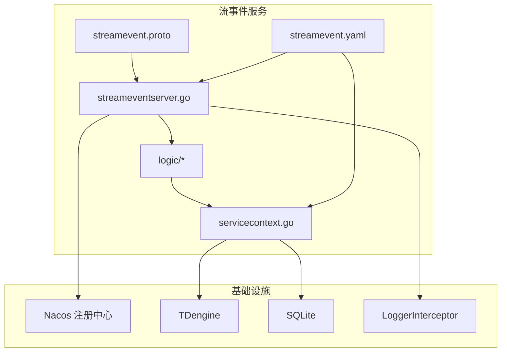
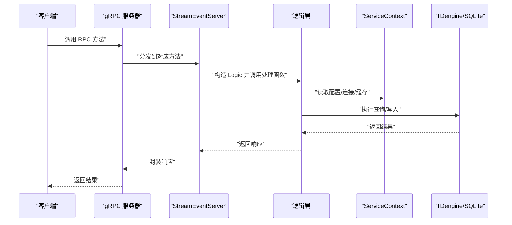
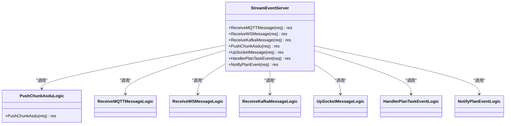
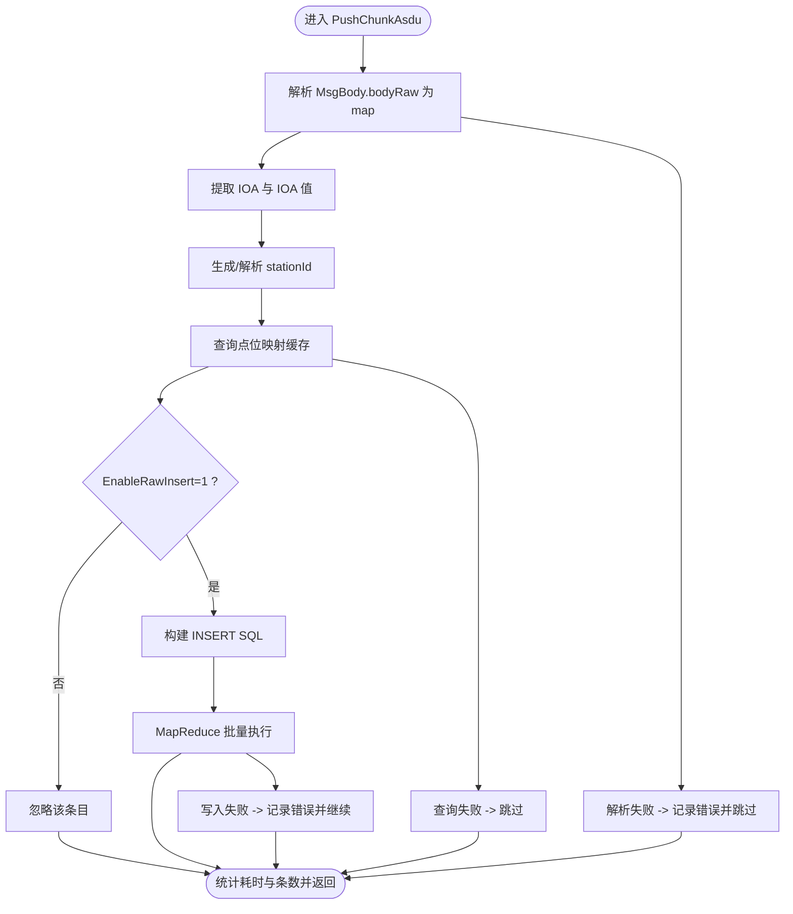
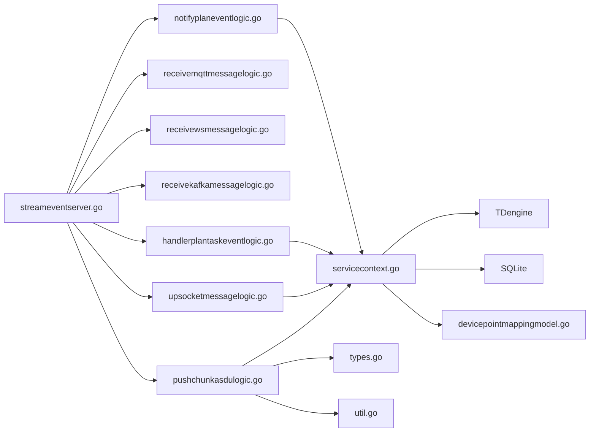

# 统一流事件协议

<cite>
**本文引用的文件**
- [facade/streamevent/streamevent.proto](file://facade/streamevent/streamevent.proto)
- [facade/streamevent/streamevent.go](file://facade/streamevent/streamevent.go)
- [facade/streamevent/internal/server/streameventserver.go](file://facade/streamevent/internal/server/streameventserver.go)
- [facade/streamevent/etc/streamevent.yaml](file://facade/streamevent/etc/streamevent.yaml)
- [facade/streamevent/internal/logic/pushchunkasdulogic.go](file://facade/streamevent/internal/logic/pushchunkasdulogic.go)
- [facade/streamevent/internal/logic/receivemqttmessagelogic.go](file://facade/streamevent/internal/logic/receivemqttmessagelogic.go)
- [facade/streamevent/internal/logic/receivewsmessagelogic.go](file://facade/streamevent/internal/logic/receivewsmessagelogic.go)
- [facade/streamevent/internal/logic/receivekafkamessagelogic.go](file://facade/streamevent/internal/logic/receivekafkamessagelogic.go)
- [facade/streamevent/internal/logic/upsocketmessagelogic.go](file://facade/streamevent/internal/logic/upsocketmessagelogic.go)
- [facade/streamevent/internal/logic/handlerplantaskeventlogic.go](file://facade/streamevent/internal/logic/handlerplantaskeventlogic.go)
- [facade/streamevent/internal/logic/notifyplaneventlogic.go](file://facade/streamevent/internal/logic/notifyplaneventlogic.go)
- [facade/streamevent/internal/svc/servicecontext.go](file://facade/streamevent/internal/svc/servicecontext.go)
- [common/Interceptor/rpcserver/loggerInterceptor.go](file://common/Interceptor/rpcserver/loggerInterceptor.go)
- [common/iec104/types/types.go](file://common/iec104/types/types.go)
- [common/iec104/util/util.go](file://common/iec104/util/util.go)
- [model/devicepointmappingmodel.go](file://model/devicepointmappingmodel.go)
- [swagger/streamevent.swagger.json](file://swagger/streamevent.swagger.json)
</cite>

## 目录
1. [引言](#引言)
2. [项目结构](#项目结构)
3. [核心组件](#核心组件)
4. [架构总览](#架构总览)
5. [详细组件分析](#详细组件分析)
6. [依赖分析](#依赖分析)
7. [性能考虑](#性能考虑)
8. [故障排查指南](#故障排查指南)
9. [结论](#结论)
10. [附录](#附录)

## 引言
本文件面向统一流事件协议（StreamEvent）的技术文档，系统阐述协议的设计理念、架构原理与实现细节。该协议通过 gRPC 服务接口统一接入多种上游事件源（MQTT、WebSocket、Kafka、IEC 104 报文片段），并提供计划任务事件处理与通知能力。文档覆盖以下主题：
- 跨语言支持与协议抽象层
- gRPC 服务接口定义与实现
- 事件推送、消息处理、状态管理与错误处理
- 协议版本管理与兼容性策略
- 协议转换层（传输协议适配与数据格式转换）
- 安全机制（认证授权、访问控制）
- 接口规范、消息格式与客户端集成示例
- 性能优化、监控指标与调试方法

## 项目结构
统一流事件协议位于 facade/streamevent 目录，采用 goctl 生成的目录结构，遵循“proto → server → logic → svc/config”的分层组织方式。核心文件包括：
- 协议定义：facade/streamevent/streamevent.proto
- 服务入口：facade/streamevent/streamevent.go
- 服务端实现：facade/streamevent/internal/server/streameventserver.go
- 逻辑层：facade/streamevent/internal/logic/*.go
- 服务上下文与数据库连接：facade/streamevent/internal/svc/servicecontext.go
- 配置：facade/streamevent/etc/streamevent.yaml
- IEC 104 类型与工具：common/iec104/types/types.go、common/iec104/util/util.go
- 设备点位映射模型与缓存：model/devicepointmappingmodel.go
- RPC 日志拦截器：common/Interceptor/rpcserver/loggerInterceptor.go
- Swagger 文档：swagger/streamevent.swagger.json

图表来源
- [facade/streamevent/streamevent.proto:1-581](file://facade/streamevent/streamevent.proto#L1-L581)
- [facade/streamevent/internal/server/streameventserver.go:1-67](file://facade/streamevent/internal/server/streameventserver.go#L1-L67)
- [facade/streamevent/etc/streamevent.yaml:1-28](file://facade/streamevent/etc/streamevent.yaml#L1-L28)
- [facade/streamevent/internal/svc/servicecontext.go:1-33](file://facade/streamevent/internal/svc/servicecontext.go#L1-L33)

章节来源
- [facade/streamevent/streamevent.proto:1-581](file://facade/streamevent/streamevent.proto#L1-L581)
- [facade/streamevent/streamevent.go:1-72](file://facade/streamevent/streamevent.go#L1-L72)
- [facade/streamevent/etc/streamevent.yaml:1-28](file://facade/streamevent/etc/streamevent.yaml#L1-L28)

## 核心组件
- gRPC 服务接口：定义了接收 MQTT/WS/Kafka 消息、推送 IEC 104 片段、上行 Socket 标准消息以及计划任务事件处理/通知等 RPC 方法。
- 服务端实现：将每个 RPC 映射到对应的 logic 层处理函数。
- 逻辑层：负责具体的消息解析、转换、落库与调度。
- 服务上下文：封装数据库连接、缓存与配置，供逻辑层使用。
- IEC 104 类型与工具：提供 ASDU 类型、质量描述符、站点 ID 生成与主题模板生成等能力。
- 中间件与拦截器：统一记录请求头（用户、部门、授权、追踪 ID）并输出错误日志。

章节来源
- [facade/streamevent/internal/server/streameventserver.go:1-67](file://facade/streamevent/internal/server/streameventserver.go#L1-L67)
- [facade/streamevent/internal/svc/servicecontext.go:1-33](file://facade/streamevent/internal/svc/servicecontext.go#L1-L33)
- [common/iec104/types/types.go:1-323](file://common/iec104/types/types.go#L1-L323)
- [common/iec104/util/util.go:1-242](file://common/iec104/util/util.go#L1-L242)
- [common/Interceptor/rpcserver/loggerInterceptor.go:1-45](file://common/Interceptor/rpcserver/loggerInterceptor.go#L1-L45)

## 架构总览
统一流事件协议通过 gRPC 提供统一入口，内部以“服务端实现 → 逻辑层 → 服务上下文”的分层模式组织。逻辑层根据消息来源进行差异化处理：
- IEC 104 片段：解析 JSON 报文、提取 IOA 值、生成子表名、查询点位映射缓存、批量插入 TDengine。
- MQTT/WS/Kafka：作为透传或预处理入口，后续可扩展为路由与转换。
- Socket 上行：支持鉴权头注入，返回标准化响应。
- 计划任务：提供事件处理与通知接口，便于与调度系统联动。

图表来源
- [facade/streamevent/internal/server/streameventserver.go:26-66](file://facade/streamevent/internal/server/streameventserver.go#L26-L66)
- [facade/streamevent/internal/logic/pushchunkasdulogic.go:118-222](file://facade/streamevent/internal/logic/pushchunkasdulogic.go#L118-L222)
- [facade/streamevent/internal/svc/servicecontext.go:21-32](file://facade/streamevent/internal/svc/servicecontext.go#L21-L32)

## 详细组件分析

### gRPC 服务接口与实现
- 服务定义：包含接收 MQTT/WS/Kafka 消息、推送 IEC 104 片段、上行 Socket 标准消息、计划任务事件处理与通知等方法。
- 服务端实现：将每个 RPC 方法映射到对应 logic 的构造与调用流程，保持职责单一。
- 配置与注册：启动时加载配置、注册服务、可选开启反射；可选注册到 Nacos。

图表来源
- [facade/streamevent/internal/server/streameventserver.go:15-66](file://facade/streamevent/internal/server/streameventserver.go#L15-L66)
- [facade/streamevent/internal/logic/pushchunkasdulogic.go:20-32](file://facade/streamevent/internal/logic/pushchunkasdulogic.go#L20-L32)
- [facade/streamevent/internal/logic/receivemqttmessagelogic.go:12-24](file://facade/streamevent/internal/logic/receivemqttmessagelogic.go#L12-L24)
- [facade/streamevent/internal/logic/receivewsmessagelogic.go:12-24](file://facade/streamevent/internal/logic/receivewsmessagelogic.go#L12-L24)
- [facade/streamevent/internal/logic/receivekafkamessagelogic.go:12-24](file://facade/streamevent/internal/logic/receivekafkamessagelogic.go#L12-L24)
- [facade/streamevent/internal/logic/upsocketmessagelogic.go:14-26](file://facade/streamevent/internal/logic/upsocketmessagelogic.go#L14-L26)
- [facade/streamevent/internal/logic/handlerplantaskeventlogic.go:14-26](file://facade/streamevent/internal/logic/handlerplantaskeventlogic.go#L14-L26)
- [facade/streamevent/internal/logic/notifyplaneventlogic.go:12-24](file://facade/streamevent/internal/logic/notifyplaneventlogic.go#L12-L24)

章节来源
- [facade/streamevent/streamevent.proto:10-25](file://facade/streamevent/streamevent.proto#L10-L25)
- [facade/streamevent/internal/server/streameventserver.go:26-66](file://facade/streamevent/internal/server/streameventserver.go#L26-L66)
- [facade/streamevent/streamevent.go:39-45](file://facade/streamevent/streamevent.go#L39-L45)

### IEC 104 片段推送处理（核心流程）
- 输入：事务 ID 与多个消息体（包含设备地址、ASDU 类型、IOA、原始报文、元数据等）。
- 解析：从 bodyRaw 解析 JSON，提取 IOA 与值；若元数据包含站点 ID，则优先使用。
- 缓存与查询：基于 stationId/coa/ioa 查询点位映射缓存，仅启用原始入库的记录进入写入路径。
- 写入：动态生成子表名，批量插入 TDengine；统计忽略/插入条数并记录耗时。
- 错误处理：解析失败、查询失败、写入失败均记录错误并继续处理后续条目。

图表来源
- [facade/streamevent/internal/logic/pushchunkasdulogic.go:118-222](file://facade/streamevent/internal/logic/pushchunkasdulogic.go#L118-L222)
- [model/devicepointmappingmodel.go:74-107](file://model/devicepointmappingmodel.go#L74-L107)
- [common/iec104/util/util.go:190-195](file://common/iec104/util/util.go#L190-L195)

章节来源
- [facade/streamevent/internal/logic/pushchunkasdulogic.go:118-222](file://facade/streamevent/internal/logic/pushchunkasdulogic.go#L118-L222)
- [model/devicepointmappingmodel.go:74-107](file://model/devicepointmappingmodel.go#L74-L107)

### MQTT/WS/Kafka 消息接收（扩展点）
- 接口已定义，当前逻辑层占位，便于后续对接上游消息队列与协议网关。
- 建议：在逻辑层中实现消息聚合、去重、路由与转换，再统一进入 IEC 104 或自有事件模型。

章节来源
- [facade/streamevent/streamevent.proto:11-16](file://facade/streamevent/streamevent.proto#L11-L16)
- [facade/streamevent/internal/logic/receivemqttmessagelogic.go:27-31](file://facade/streamevent/internal/logic/receivemqttmessagelogic.go#L27-L31)
- [facade/streamevent/internal/logic/receivewsmessagelogic.go:27-31](file://facade/streamevent/internal/logic/receivewsmessagelogic.go#L27-L31)
- [facade/streamevent/internal/logic/receivekafkamessagelogic.go:27-31](file://facade/streamevent/internal/logic/receivekafkamessagelogic.go#L27-L31)

### Socket 上行消息与认证
- 支持标准事件：连接、断开、加入房间、上行事件等。
- 认证：从 gRPC 元数据读取用户、部门、授权与追踪 ID，注入到上下文，便于日志与审计。
- 响应：返回标准化 JSON 字符串，便于前端消费。

章节来源
- [facade/streamevent/streamevent.proto:450-459](file://facade/streamevent/streamevent.proto#L450-L459)
- [facade/streamevent/internal/logic/upsocketmessagelogic.go:29-55](file://facade/streamevent/internal/logic/upsocketmessagelogic.go#L29-L55)
- [common/Interceptor/rpcserver/loggerInterceptor.go:12-44](file://common/Interceptor/rpcserver/loggerInterceptor.go#L12-L44)

### 计划任务事件处理与通知
- HandlerPlanTaskEvent：返回执行结果、消息与延时配置（含下次触发时间与原因）。
- NotifyPlanEvent：用于通知批次/计划完成事件，预留扩展字段。
- 适用场景：与调度系统配合，实现分布式事务与幂等回调。

章节来源
- [facade/streamevent/streamevent.proto:501-581](file://facade/streamevent/streamevent.proto#L501-L581)
- [facade/streamevent/internal/logic/handlerplantaskeventlogic.go:29-38](file://facade/streamevent/internal/logic/handlerplantaskeventlogic.go#L29-L38)
- [facade/streamevent/internal/logic/notifyplaneventlogic.go:27-31](file://facade/streamevent/internal/logic/notifyplaneventlogic.go#L27-L31)

### IEC 104 类型与工具
- 类型体系：涵盖单点、双点、规一化、标度化、短浮点、步位置、32 位比特串、累计量、保护事件等 ASDU 类型。
- 工具函数：质量描述符判断、规范化/浮点转换、站点 ID 生成、主题模板生成与校验。
- 用途：支撑 PushChunkAsdu 的数据解析与落库决策。

章节来源
- [common/iec104/types/types.go:17-323](file://common/iec104/types/types.go#L17-L323)
- [common/iec104/util/util.go:13-242](file://common/iec104/util/util.go#L13-L242)

## 依赖分析
- 服务端实现依赖逻辑层；逻辑层依赖服务上下文；服务上下文依赖数据库连接与缓存。
- IEC 104 工具与类型为逻辑层提供数据结构与转换能力。
- gRPC 启动依赖配置与可选 Nacos 注册；拦截器统一注入上下文字段。

图表来源
- [facade/streamevent/internal/server/streameventserver.go:1-67](file://facade/streamevent/internal/server/streameventserver.go#L1-L67)
- [facade/streamevent/internal/logic/pushchunkasdulogic.go:1-223](file://facade/streamevent/internal/logic/pushchunkasdulogic.go#L1-L223)
- [facade/streamevent/internal/svc/servicecontext.go:14-32](file://facade/streamevent/internal/svc/servicecontext.go#L14-L32)
- [model/devicepointmappingmodel.go:1-108](file://model/devicepointmappingmodel.go#L1-L108)
- [common/iec104/types/types.go:1-323](file://common/iec104/types/types.go#L1-L323)
- [common/iec104/util/util.go:1-242](file://common/iec104/util/util.go#L1-L242)

章节来源
- [facade/streamevent/internal/server/streameventserver.go:1-67](file://facade/streamevent/internal/server/streameventserver.go#L1-L67)
- [facade/streamevent/internal/svc/servicecontext.go:14-32](file://facade/streamevent/internal/svc/servicecontext.go#L14-L32)

## 性能考虑
- 批量写入：PushChunkAsdu 使用 MapReduce 并行执行插入，显著提升吞吐。
- 缓存命中：点位映射采用本地缓存，减少数据库查询压力。
- 日志与追踪：拦截器注入追踪 ID，结合耗时日志定位瓶颈。
- 配置优化：可通过配置文件调整超时、日志级别与中间件忽略列表（如 PushChunkAsdu 的统计忽略）。

章节来源
- [facade/streamevent/internal/logic/pushchunkasdulogic.go:127-212](file://facade/streamevent/internal/logic/pushchunkasdulogic.go#L127-L212)
- [model/devicepointmappingmodel.go:74-107](file://model/devicepointmappingmodel.go#L74-L107)
- [facade/streamevent/etc/streamevent.yaml:12-13](file://facade/streamevent/etc/streamevent.yaml#L12-L13)
- [common/Interceptor/rpcserver/loggerInterceptor.go:12-44](file://common/Interceptor/rpcserver/loggerInterceptor.go#L12-L44)

## 故障排查指南
- TDengine 连接未初始化：检查配置文件中的数据源与数据库名，确认服务上下文初始化。
- 点位映射缓存未命中：确认缓存键生成规则与查询参数（stationId/coa/ioa），必要时清理缓存。
- IEC 104 报文解析失败：检查 bodyRaw 是否为合法 JSON，确保包含 ioa 与 value 字段。
- 写入失败：查看日志中的错误详情，核对表名、标签与字段类型是否匹配。
- 计划任务回调：根据 HandlerPlanTaskEvent 返回的延时配置与原因，调整下次触发时间。

章节来源
- [facade/streamevent/etc/streamevent.yaml:22-27](file://facade/streamevent/etc/streamevent.yaml#L22-L27)
- [facade/streamevent/internal/svc/servicecontext.go:21-32](file://facade/streamevent/internal/svc/servicecontext.go#L21-L32)
- [model/devicepointmappingmodel.go:74-107](file://model/devicepointmappingmodel.go#L74-L107)
- [facade/streamevent/internal/logic/pushchunkasdulogic.go:132-143](file://facade/streamevent/internal/logic/pushchunkasdulogic.go#L132-L143)

## 结论
统一流事件协议以 gRPC 为核心入口，结合 IEC 104 类型体系与高效的数据处理链路，实现了多源事件的统一接入与处理。通过服务上下文与拦截器，系统具备良好的可观测性与可维护性。建议在后续迭代中完善 MQTT/WS/Kafka 的消息处理逻辑、增强安全与鉴权能力，并持续优化批处理与缓存策略。

## 附录

### 接口规范与消息格式
- 服务名称：StreamEvent
- 方法概览：
  - 接收 MQTT 消息：ReceiveMQTTMessage
  - 接收 WebSocket 消息：ReceiveWSMessage
  - 接收 Kafka 消息：ReceiveKafkaMessage
  - 推送 IEC 104 片段：PushChunkAsdu
  - 上行 Socket 标准消息：UpSocketMessage
  - 计划任务事件处理：HandlerPlanTaskEvent
  - 通知计划任务事件：NotifyPlanEvent
- 请求/响应消息要点：
  - PushChunkAsduReq：事务 ID 与消息体数组；消息体包含设备地址、ASDU 类型、IOA、原始报文、元数据与点位映射。
  - UpSocketMessageReq/Res：包含请求 ID、会话 ID、事件名与载荷。
  - HandlerPlanTaskEventRes：包含执行结果、消息、原因与延时配置。

章节来源
- [facade/streamevent/streamevent.proto:10-581](file://facade/streamevent/streamevent.proto#L10-L581)

### 客户端集成示例（步骤指引）
- gRPC 客户端：
  - 使用 proto 文件生成客户端代码（Go/Java/Python 等）。
  - 设置超时与日志级别，按需注入认证头（用户、部门、授权、追踪 ID）。
  - 调用相应 RPC 方法：PushChunkAsdu 用于 IEC 104 片段；UpSocketMessage 用于 Socket 上行。
- IEC 104 数据准备：
  - 构造 MsgBody，填充 host/port/asdu/typeId/dataType/coa/bodyRaw/time/metaDataRaw/pm。
  - 确保 bodyRaw 为合法 JSON，包含 ioa 与 value。
- 计划任务：
  - 调用 HandlerPlanTaskEvent 获取延时配置；根据返回结果决定下次触发时间。
  - 调用 NotifyPlanEvent 通知批次/计划完成事件。

章节来源
- [facade/streamevent/streamevent.proto:83-133](file://facade/streamevent/streamevent.proto#L83-L133)
- [facade/streamevent/internal/logic/upsocketmessagelogic.go:29-55](file://facade/streamevent/internal/logic/upsocketmessagelogic.go#L29-L55)
- [facade/streamevent/internal/logic/handlerplantaskeventlogic.go:29-38](file://facade/streamevent/internal/logic/handlerplantaskeventlogic.go#L29-L38)

### 协议版本管理与兼容性
- 版本策略：建议在 proto 文件中通过选项与枚举扩展字段，保持向后兼容；新增字段使用可选语义，避免破坏既有客户端。
- 升级策略：发布新版本时保留旧字段一段时间，提供迁移脚本与灰度发布方案；通过 Swagger 与客户端 SDK 发布更新。

（本节为通用指导，不直接分析具体文件）

### 协议转换层实现
- 传输适配：MQTT/WS/Kafka → gRPC；在逻辑层实现聚合、去重与路由。
- 数据格式转换：IEC 104 报文 → 标准 MsgBody；利用 types/util 提供的类型与工具函数完成解析与校验。
- 主题生成：通过模板生成最终主题，严格校验非法字符与格式。

章节来源
- [common/iec104/util/util.go:197-241](file://common/iec104/util/util.go#L197-L241)
- [common/iec104/types/types.go:17-40](file://common/iec104/types/types.go#L17-L40)

### 安全机制
- 认证授权：通过 gRPC 元数据注入用户、部门、授权与追踪 ID，拦截器统一读取并写入上下文。
- 访问控制：结合服务端配置与 Nacos 注册，限制服务暴露范围；建议在网关层增加鉴权与限流。
- 数据加密：建议在传输层启用 TLS；敏感字段在日志中脱敏输出。

章节来源
- [common/Interceptor/rpcserver/loggerInterceptor.go:12-44](file://common/Interceptor/rpcserver/loggerInterceptor.go#L12-L44)
- [facade/streamevent/etc/streamevent.yaml:14-21](file://facade/streamevent/etc/streamevent.yaml#L14-L21)

### 监控指标与调试
- 指标建议：请求量、延迟、错误率、批处理插入速率、缓存命中率、数据库连接池使用情况。
- 调试方法：开启调试日志、追踪 ID 注入、关键路径耗时统计；使用 Swagger 查看接口定义与响应结构。

章节来源
- [swagger/streamevent.swagger.json:1-50](file://swagger/streamevent.swagger.json#L1-L50)
- [facade/streamevent/etc/streamevent.yaml:5-13](file://facade/streamevent/etc/streamevent.yaml#L5-L13)