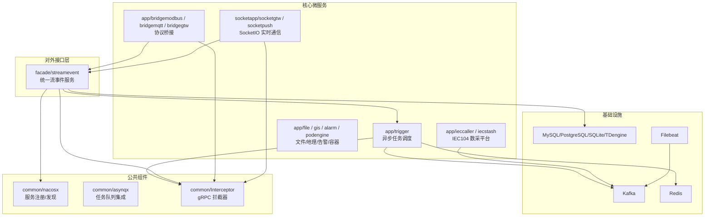
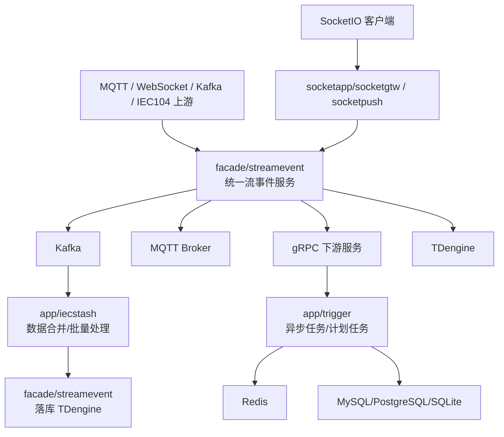
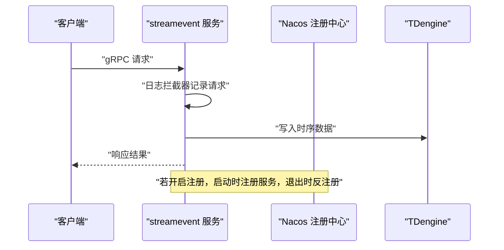
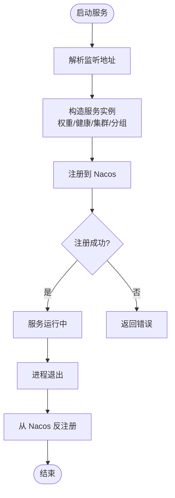
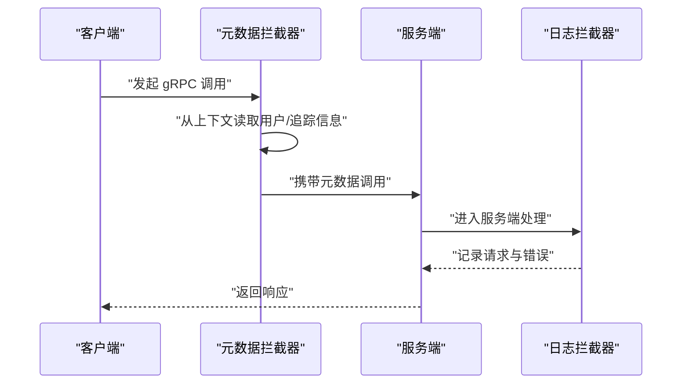
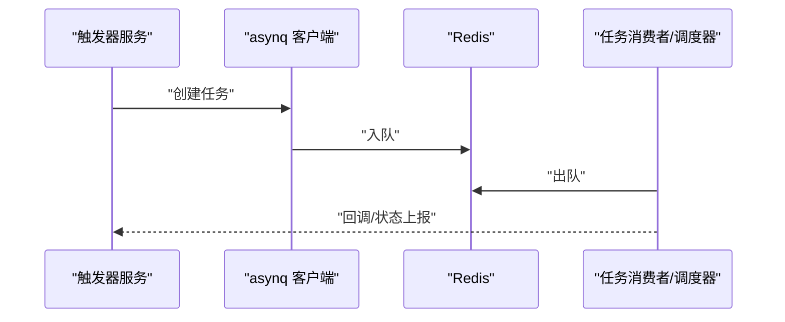
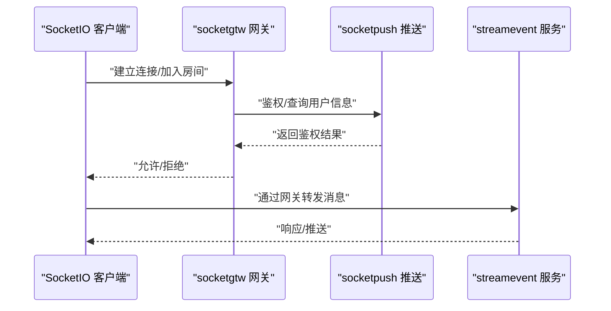
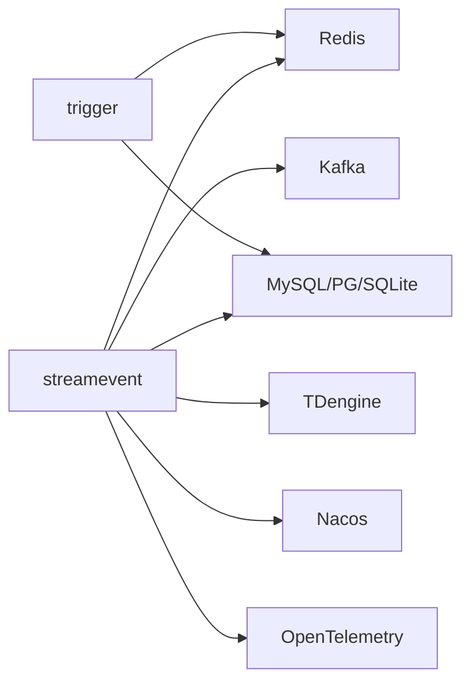

# 集成模式与最佳实践

<cite>
**本文引用的文件**
- [README.md](file://README.md)
- [facade/streamevent/streamevent.go](file://facade/streamevent/streamevent.go)
- [facade/streamevent/etc/streamevent.yaml](file://facade/streamevent/etc/streamevent.yaml)
- [common/nacosx/register.go](file://common/nacosx/register.go)
- [common/nacosx/config.go](file://common/nacosx/config.go)
- [common/Interceptor/rpcserver/loggerInterceptor.go](file://common/Interceptor/rpcserver/loggerInterceptor.go)
- [common/Interceptor/rpcclient/metadataInterceptor.go](file://common/Interceptor/rpcclient/metadataInterceptor.go)
- [common/asynqx/asynqClient.go](file://common/asynqx/asynqClient.go)
- [zerorpc/zerorpc.go](file://zerorpc/zerorpc.go)
- [app/trigger/etc/trigger.yaml](file://app/trigger/etc/trigger.yaml)
- [deploy/docker-compose.yml](file://deploy/docker-compose.yml)
- [.trae/skills/zero-skills/best-practices/overview.md](file://.trae/skills/zero-skills/best-practices/overview.md)
- [socketapp/socketpush/internal/logic/gentokenlogic.go](file://socketapp/socketpush/internal/logic/gentokenlogic.go)
- [util/Taskfile.yml](file://util/Taskfile.yml)
</cite>

## 目录
1. [引言](#引言)
2. [项目结构](#项目结构)
3. [核心组件](#核心组件)
4. [架构总览](#架构总览)
5. [详细组件分析](#详细组件分析)
6. [依赖分析](#依赖分析)
7. [性能考虑](#性能考虑)
8. [故障排查指南](#故障排查指南)
9. [结论](#结论)
10. [附录](#附录)

## 引言
本文件围绕统一流事件服务的集成模式与最佳实践展开，系统梳理服务集成的三种主要模式（直接调用、消息队列集成、事件驱动架构），并结合仓库中的实际实现，给出客户端集成最佳实践（连接管理、重连机制、超时处理、错误恢复）、服务发现与负载均衡（Nacos 配置、健康检查、故障转移）、监控与日志（指标收集、链路追踪、日志聚合）、安全集成（认证授权、数据加密、访问控制）、性能优化（连接池、批量处理、缓存策略）、以及部署脚本、Docker 配置与 CI/CD 集成建议。文档同时提供常见问题排查、性能调优与故障恢复指南，帮助读者在生产环境中稳定落地。

## 项目结构
该项目采用 go-zero 微服务脚手架，围绕 IEC 104 数采平台、异步任务调度、实时通信、容器管理、地理信息、文件服务、MQTT/Modbus 桥接、BFF 网关等能力构建。对外统一通过 facade 层的统一流事件协议（gRPC）进行跨语言交互；内部通过 Kafka/MQTT/gRPC 实现多协议并行推送与数据汇聚。

图表来源
- [README.md:15-51](file://README.md#L15-L51)
- [README.md:59-108](file://README.md#L59-L108)

章节来源
- [README.md:15-51](file://README.md#L15-L51)
- [README.md:59-108](file://README.md#L59-L108)

## 核心组件
- 统一流事件服务（facade/streamevent）：提供跨语言 gRPC 接口，接收来自 MQTT/WebSocket/Kafka/IEC104 等上游的消息，统一落库至 TDengine 并支持计划任务事件处理。
- 异步任务调度（app/trigger）：基于 asynq + Redis 的分布式任务队列，支持 HTTP/gRPC 回调；同时提供计划任务管理引擎，具备状态机与分布式锁。
- 服务注册与发现（common/nacosx）：封装 Nacos 注册/反注册、健康实例管理与元数据注入。
- gRPC 拦截器（common/Interceptor）：服务端日志拦截器与客户端元数据拦截器，统一透传用户标识、鉴权令牌、链路追踪 ID。
- 任务队列集成（common/asynqx）：提供 asynq 客户端、检查器与 OpenTelemetry Producer Span。
- 实时通信（socketapp/socketgtw / socketpush）：SocketIO 网关与推送服务，支持房间管理、单播/广播、MQTT 桥接与 Token 鉴权。
- 协议桥接（app/bridgemodbus / bridgemqtt / bridgegtw）：Modbus/ MQTT/ HTTP 协议桥接，支持设备读写与消息转发。
- 文件/地理/告警/容器（app/file / gis / alarm / podengine）：文件分片上传/流式上传、OSS 集成、地理信息处理、告警通知、容器生命周期管理。
- 基础设施：Kafka、Redis、MySQL/PostgreSQL/SQLite、TDengine、Filebeat。

章节来源
- [README.md:110-188](file://README.md#L110-L188)
- [README.md:207-225](file://README.md#L207-L225)

## 架构总览
统一流事件服务作为统一入口，接收多源异构数据，经由 Kafka/MQTT/gRPC 进行并行处理与转发，最终落库至 TDengine。触发器服务负责异步任务与计划任务的编排与回调，实时通信模块提供 SocketIO 会话管理与推送能力。

图表来源
- [README.md:112-131](file://README.md#L112-L131)
- [README.md:156-173](file://README.md#L156-L173)

## 详细组件分析

### 统一流事件服务（facade/streamevent）
- 服务启动与配置加载：通过命令行参数加载配置文件，初始化服务上下文，注册 gRPC 服务，开发/测试模式下启用反射。
- 服务注册：根据配置决定是否注册到 Nacos，注册时注入 gRPC 端口与元数据，进程退出时自动反注册。
- 日志与拦截：添加服务端日志拦截器，统一记录请求与错误；全局字段包含应用名，便于日志聚合与检索。
- 配置要点：日志级别、输出路径、Nacos 注册开关、TaosDB 数据源、SQLite 数据源等。

图表来源
- [facade/streamevent/streamevent.go:28-71](file://facade/streamevent/streamevent.go#L28-L71)
- [common/nacosx/register.go:21-76](file://common/nacosx/register.go#L21-L76)

章节来源
- [facade/streamevent/streamevent.go:28-71](file://facade/streamevent/streamevent.go#L28-L71)
- [facade/streamevent/etc/streamevent.yaml:1-28](file://facade/streamevent/etc/streamevent.yaml#L1-L28)
- [common/nacosx/register.go:21-76](file://common/nacosx/register.go#L21-L76)

### 服务发现与负载均衡（Nacos 集成）
- 注册流程：解析监听地址，构造服务实例，设置权重、健康状态、集群与分组，注册成功后在进程退出时自动反注册。
- 元数据注入：注册时注入 gRPC 端口与来源标记，便于客户端侧识别与路由。
- 日志配置：提供 Nacos SDK 日志级别、输出目录与 stdout 输出开关，便于定位注册异常。

图表来源
- [common/nacosx/register.go:21-76](file://common/nacosx/register.go#L21-L76)
- [common/nacosx/config.go:15-37](file://common/nacosx/config.go#L15-L37)

章节来源
- [common/nacosx/register.go:21-76](file://common/nacosx/register.go#L21-L76)
- [common/nacosx/config.go:15-37](file://common/nacosx/config.go#L15-L37)

### gRPC 拦截器（客户端与服务端）
- 服务端日志拦截器：从入站元数据提取用户标识、用户名、部门编码、授权令牌、追踪 ID，注入到上下文；对错误进行统一记录。
- 客户端元数据拦截器：在出站请求中回填上述元数据，确保链路上下文一致。
- 最佳实践：在客户端调用前设置用户上下文，服务端拦截器自动透传，避免重复代码与遗漏。

图表来源
- [common/Interceptor/rpcclient/metadataInterceptor.go:11-32](file://common/Interceptor/rpcclient/metadataInterceptor.go#L11-L32)
- [common/Interceptor/rpcserver/loggerInterceptor.go:12-44](file://common/Interceptor/rpcserver/loggerInterceptor.go#L12-L44)

章节来源
- [common/Interceptor/rpcclient/metadataInterceptor.go:11-32](file://common/Interceptor/rpcclient/metadataInterceptor.go#L11-L32)
- [common/Interceptor/rpcserver/loggerInterceptor.go:12-44](file://common/Interceptor/rpcserver/loggerInterceptor.go#L12-L44)

### 异步任务调度（app/trigger + common/asynqx）
- 触发器服务：提供 asynq 任务队列与调度器，支持定时/延时任务、HTTP/gRPC 回调、自动重试与生命周期管理。
- 配置：包含 Redis 连接、数据库连接、统一流事件下游端点列表、非阻塞与超时配置。
- OpenTelemetry 集成：任务生产者侧开启 Producer Span，标注任务类型，便于链路追踪。

图表来源
- [app/trigger/etc/trigger.yaml:19-37](file://app/trigger/etc/trigger.yaml#L19-L37)
- [common/asynqx/asynqClient.go:17-31](file://common/asynqx/asynqClient.go#L17-L31)
- [zerorpc/zerorpc.go:44-57](file://zerorpc/zerorpc.go#L44-L57)

章节来源
- [app/trigger/etc/trigger.yaml:19-37](file://app/trigger/etc/trigger.yaml#L19-L37)
- [common/asynqx/asynqClient.go:17-31](file://common/asynqx/asynqClient.go#L17-L31)
- [zerorpc/zerorpc.go:44-57](file://zerorpc/zerorpc.go#L44-L57)

### 实时通信（socketapp/socketgtw / socketpush）
- SocketIO 网关：负责客户端连接管理、房间管理、消息路由与 Token 鉴权。
- 推送服务：提供 Token 生成/验证、gRPC 推送接口、后端服务调用入口。
- 安全集成：Token 生成逻辑支持自定义载荷，忽略标准 JWT 字段，防止冲突。

图表来源
- [socketapp/socketpush/internal/logic/gentokenlogic.go:57-78](file://socketapp/socketpush/internal/logic/gentokenlogic.go#L57-L78)
- [README.md:156-173](file://README.md#L156-L173)

章节来源
- [socketapp/socketpush/internal/logic/gentokenlogic.go:57-78](file://socketapp/socketpush/internal/logic/gentokenlogic.go#L57-L78)
- [README.md:156-173](file://README.md#L156-L173)

### 协议桥接（app/bridgemodbus / bridgemqtt / bridgegtw）
- Modbus 桥接：支持线圈/寄存器读写、设备配置管理、gRPC 集成。
- MQTT 桥接：消息发布/订阅、带追踪的推送、gRPC 集成。
- HTTP 代理：多后端负载均衡、请求路由。
- 与统一流事件协作：桥接后的消息可经由统一流事件服务统一处理与落库。

章节来源
- [README.md:174-188](file://README.md#L174-L188)

### 文件/地理/告警/容器服务
- 文件服务：gRPC 分片流上传、OSS 集成（MinIO/阿里OSS/腾讯COS）、视频流捕获。
- 地理信息：H3/GeoHash 编解码、电子围栏、坐标系转换。
- 告警服务：多级告警（P0-P3）、钉钉/飞书通知集成。
- 容器管理：Docker 容器 CRUD、Pod 抽象模型、资源统计与镜像管理。

章节来源
- [README.md:174-188](file://README.md#L174-L188)

## 依赖分析
- 组件耦合：统一流事件服务与触发器服务通过 Kafka/Redis/数据库形成松耦合；Nacos 提供服务发现与健康检查；gRPC 拦截器贯穿客户端与服务端，保证上下文一致。
- 外部依赖：Kafka、Redis、MySQL/PostgreSQL/SQLite、TDengine、Nacos、OpenTelemetry、Prometheus/Grafana（监控链路）。
- 潜在环路：当前实现未见明显循环依赖；服务间通过消息队列与 gRPC 解耦。

图表来源
- [README.md:207-225](file://README.md#L207-L225)
- [app/trigger/etc/trigger.yaml:19-37](file://app/trigger/etc/trigger.yaml#L19-L37)

章节来源
- [README.md:207-225](file://README.md#L207-L225)
- [app/trigger/etc/trigger.yaml:19-37](file://app/trigger/etc/trigger.yaml#L19-L37)

## 性能考虑
- 连接池配置：gRPC 客户端连接池大小与超时应结合下游 QPS 与 RTT 调优；Nacos 注册/反注册使用短超时，避免阻塞启动/停止。
- 批量处理：IEC104 数据合并阶段采用批量处理与压缩（ASDU 压缩），降低下游压力。
- 缓存策略：Redis 作为 asynq 存储与任务队列缓存，合理设置过期时间与淘汰策略。
- 并发与资源：利用 go-zero 的并发模型与 automaxprocs，结合容器资源限制（deploy/docker-compose.yml 中已体现）。
- 监控与指标：OpenTelemetry 采集链路追踪，Prometheus 汇总指标，Grafana 可视化。

章节来源
- [README.md:207-225](file://README.md#L207-L225)
- [deploy/docker-compose.yml:1-110](file://deploy/docker-compose.yml#L1-L110)

## 故障排查指南
- 服务注册失败：检查 Nacos 地址、命名空间、账号密码与超时配置；确认服务监听地址解析正确（figureOutListenOn）。
- gRPC 调用异常：启用服务端日志拦截器，查看错误日志；核对客户端元数据拦截器是否正确注入用户/追踪信息。
- 任务队列堆积：检查 Redis 连接与任务处理速率；查看 asynq Inspector 统计；评估回调下游健康状况。
- 数据落库异常：确认 TDengine 数据源配置与库名；检查 Kafka 消费偏移与分区分配。
- 容器与编排：使用 docker-compose 启动依赖服务，确保 Kafka/Filebeat 等前置服务就绪。

章节来源
- [common/nacosx/register.go:21-76](file://common/nacosx/register.go#L21-L76)
- [common/Interceptor/rpcserver/loggerInterceptor.go:12-44](file://common/Interceptor/rpcserver/loggerInterceptor.go#L12-L44)
- [common/Interceptor/rpcclient/metadataInterceptor.go:11-32](file://common/Interceptor/rpcclient/metadataInterceptor.go#L11-L32)
- [common/asynqx/asynqClient.go:17-31](file://common/asynqx/asynqClient.go#L17-L31)
- [deploy/docker-compose.yml:1-110](file://deploy/docker-compose.yml#L1-L110)

## 结论
本项目通过统一流事件服务实现了多协议、多数据源的统一接入与处理，结合 Kafka/MQTT/gRPC 的并行推送与 asynq 任务队列，形成了高可用、可观测、可扩展的工业级微服务体系。配合 Nacos 服务发现、OpenTelemetry 链路追踪与 Prometheus/Grafana 监控，能够在复杂场景下保持稳定与高效。建议在生产环境进一步完善 CI/CD 流水线、灰度发布与容量规划，持续优化批处理与缓存策略。

## 附录

### 客户端集成最佳实践（连接管理、重连、超时、错误恢复）
- 连接管理：gRPC 客户端复用连接，避免频繁创建销毁；在拦截器中统一注入用户/追踪上下文。
- 重连机制：对瞬时网络抖动采用指数退避重试；区分可重试与不可重试错误。
- 超时处理：为不同 RPC 设置合理超时，避免长时间阻塞；结合中间件统计忽略特定高频方法。
- 错误恢复：服务端日志拦截器统一记录错误；客户端根据错误码分类处理并上报监控。

章节来源
- [common/Interceptor/rpcclient/metadataInterceptor.go:11-32](file://common/Interceptor/rpcclient/metadataInterceptor.go#L11-L32)
- [common/Interceptor/rpcserver/loggerInterceptor.go:12-44](file://common/Interceptor/rpcserver/loggerInterceptor.go#L12-L44)
- [facade/streamevent/etc/streamevent.yaml:11-13](file://facade/streamevent/etc/streamevent.yaml#L11-L13)

### 服务发现与负载均衡（Nacos 配置、健康检查、故障转移）
- Nacos 注册：设置服务名、权重、健康状态、集群与分组；注册时注入元数据（如 gRPC 端口）。
- 健康检查：依赖 Nacos 健康实例探测；服务异常时自动摘除。
- 故障转移：客户端侧结合 Nacos 返回的实例列表进行轮询或一致性哈希选择。

章节来源
- [common/nacosx/register.go:21-76](file://common/nacosx/register.go#L21-L76)
- [common/nacosx/config.go:15-37](file://common/nacosx/config.go#L15-L37)

### 监控与日志集成（指标、链路追踪、日志聚合）
- 指标收集：OpenTelemetry SDK 采集 asynq Producer Span 与服务端请求指标。
- 链路追踪：gRPC 拦截器透传 TraceId；服务端拦截器记录请求与错误。
- 日志聚合：统一日志格式与全局字段，结合 Filebeat 将容器日志采集至集中存储。

章节来源
- [common/asynqx/asynqClient.go:25-30](file://common/asynqx/asynqClient.go#L25-L30)
- [common/Interceptor/rpcserver/loggerInterceptor.go:12-44](file://common/Interceptor/rpcserver/loggerInterceptor.go#L12-L44)
- [deploy/docker-compose.yml:32-53](file://deploy/docker-compose.yml#L32-L53)

### 安全集成方案（认证授权、数据加密、访问控制）
- 认证授权：SocketIO Token 生成与校验，支持自定义载荷；JWT 使用 HS256 签名，避免明文密码与敏感日志泄露。
- 数据加密：传输层 TLS（建议在网关层启用）；静态数据加密（OSS/数据库）。
- 访问控制：基于用户标识与授权令牌进行权限校验；避免将内部错误细节暴露给客户端。

章节来源
- [.trae/skills/zero-skills/best-practices/overview.md:610-669](file://.trae/skills/zero-skills/best-practices/overview.md#L610-L669)
- [socketapp/socketpush/internal/logic/gentokenlogic.go:57-78](file://socketapp/socketpush/internal/logic/gentokenlogic.go#L57-L78)

### 部署脚本、Docker 配置与 CI/CD 集成
- Docker Compose：默认包含 Kafka、Filebeat、ieccaller、bridgegtw、bridgedump 等核心服务，便于快速搭建本地开发环境。
- CI/CD：建议在流水线中集成代码生成（gen.sh）、单元测试、Docker 构建与推送、Kubernetes 部署（可选）。
- Taskfile：提供任务编排模板，便于扩展远程运维与批量操作。

章节来源
- [deploy/docker-compose.yml:1-110](file://deploy/docker-compose.yml#L1-L110)
- [util/Taskfile.yml:1-33](file://util/Taskfile.yml#L1-L33)