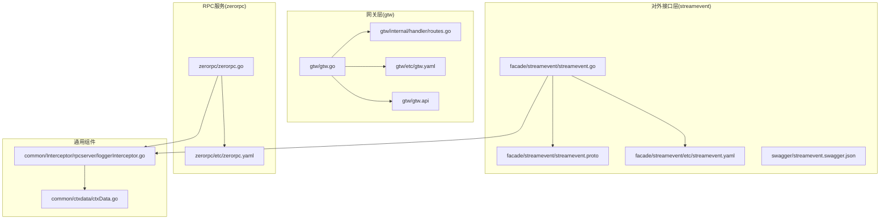
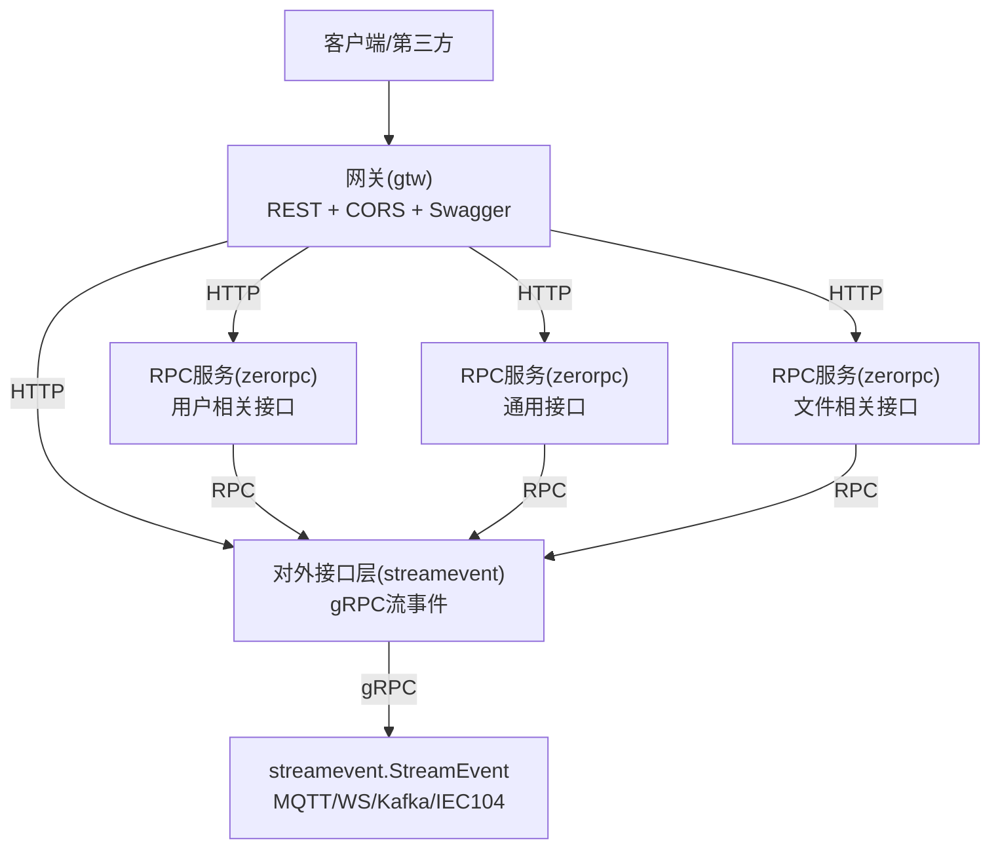
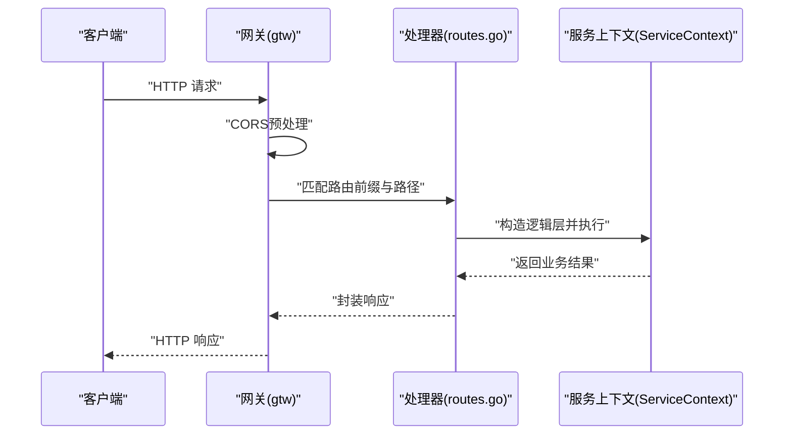
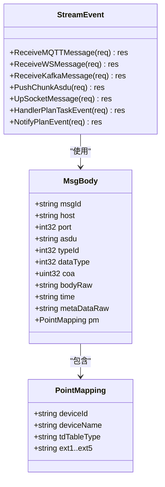
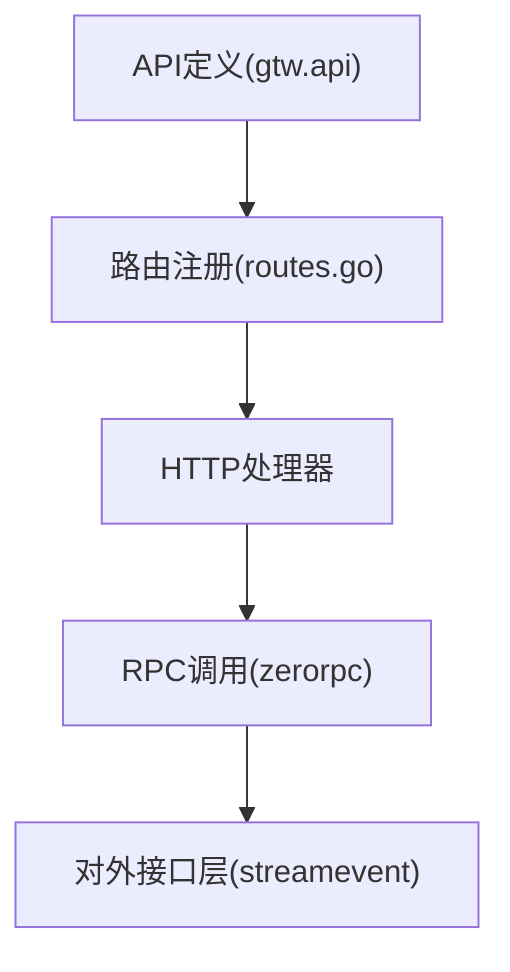
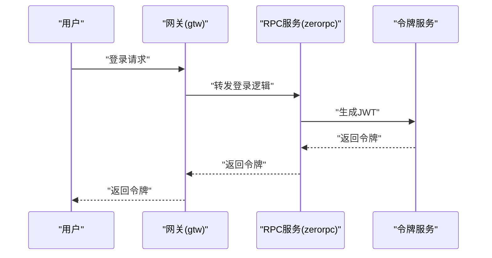
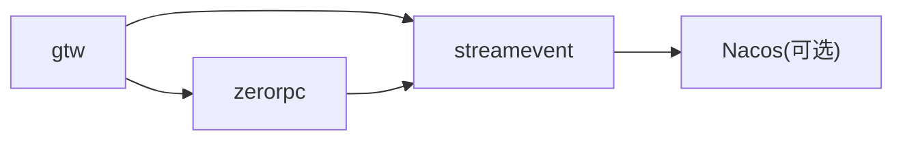

# 网关与接口

<cite>
**本文引用的文件**
- [gtw.go](file://gtw/gtw.go)
- [gtw.api](file://gtw/gtw.api)
- [routes.go](file://gtw/internal/handler/routes.go)
- [gtw.yaml](file://gtw/etc/gtw.yaml)
- [streamevent.go](file://facade/streamevent/streamevent.go)
- [streamevent.proto](file://facade/streamevent/streamevent.proto)
- [streamevent.yaml](file://facade/streamevent/etc/streamevent.yaml)
- [loggerInterceptor.go](file://common/Interceptor/rpcserver/loggerInterceptor.go)
- [ctxData.go](file://common/ctxdata/ctxData.go)
- [zerorpc.go](file://zerorpc/zerorpc.go)
- [zerorpc.yaml](file://zerorpc/etc/zerorpc.yaml)
- [loginlogic.go](file://zerorpc/internal/logic/loginlogic.go)
- [receivemqttmessagelogic.go](file://facade/streamevent/internal/logic/receivemqttmessagelogic.go)
- [streamevent.swagger.json](file://swagger/streamevent.swagger.json)
</cite>

## 目录
1. [引言](#引言)
2. [项目结构](#项目结构)
3. [核心组件](#核心组件)
4. [架构总览](#架构总览)
5. [详细组件分析](#详细组件分析)
6. [依赖分析](#依赖分析)
7. [性能考虑](#性能考虑)
8. [故障排查指南](#故障排查指南)
9. [结论](#结论)
10. [附录](#附录)

## 引言
本技术文档聚焦Zero-Service的网关与接口体系，围绕以下目标展开：
- BFF网关（gtw）：HTTP/gRPC聚合、请求路由、中间件处理与性能优化策略
- 对外接口层（facade/streamevent）：统一流数据事件协议设计、跨语言支持、协议转换与兼容性
- gRPC API设计原则与实现：服务定义、接口规范与错误处理
- REST API与grpc-gateway集成：路由映射与OpenAPI暴露
- 认证授权：JWT令牌管理与权限控制
- CORS跨域与安全策略
- 完整API文档、接口规范与客户端集成示例
- 性能优化建议与监控指标配置
- 基于接口的前端应用与第三方集成实践

## 项目结构
本项目采用多模块并行的微服务架构，网关层（gtw）、对外接口层（facade/streamevent）、RPC服务（zerorpc）分别承担不同职责，并通过统一的配置与中间件实现横切能力。

图表来源
- [gtw.go:1-96](file://gtw/gtw.go#L1-L96)
- [routes.go:1-161](file://gtw/internal/handler/routes.go#L1-L161)
- [gtw.yaml:1-61](file://gtw/etc/gtw.yaml#L1-L61)
- [streamevent.go:1-72](file://facade/streamevent/streamevent.go#L1-L72)
- [streamevent.proto:1-581](file://facade/streamevent/streamevent.proto#L1-L581)
- [streamevent.yaml:1-28](file://facade/streamevent/etc/streamevent.yaml#L1-L28)
- [zerorpc.go:1-59](file://zerorpc/zerorpc.go#L1-L59)
- [zerorpc.yaml:1-39](file://zerorpc/etc/zerorpc.yaml#L1-L39)
- [loggerInterceptor.go:1-45](file://common/Interceptor/rpcserver/loggerInterceptor.go#L1-L45)
- [ctxData.go:1-76](file://common/ctxdata/ctxData.go#L1-L76)

章节来源
- [gtw.go:1-96](file://gtw/gtw.go#L1-L96)
- [routes.go:1-161](file://gtw/internal/handler/routes.go#L1-L161)
- [gtw.yaml:1-61](file://gtw/etc/gtw.yaml#L1-L61)
- [streamevent.go:1-72](file://facade/streamevent/streamevent.go#L1-L72)
- [streamevent.proto:1-581](file://facade/streamevent/streamevent.proto#L1-L581)
- [streamevent.yaml:1-28](file://facade/streamevent/etc/streamevent.yaml#L1-L28)
- [zerorpc.go:1-59](file://zerorpc/zerorpc.go#L1-L59)
- [zerorpc.yaml:1-39](file://zerorpc/etc/zerorpc.yaml#L1-L39)
- [loggerInterceptor.go:1-45](file://common/Interceptor/rpcserver/loggerInterceptor.go#L1-L45)
- [ctxData.go:1-76](file://common/ctxdata/ctxData.go#L1-L76)

## 核心组件
- 网关（gtw）
  - 基于go-zero REST服务，内置CORS策略与Swagger静态文件路由
  - 通过API定义文件（gtw.api）声明路由前缀、分组与鉴权
  - 注册路由处理器，支持多模块（common、file、gtw、pay、user）
- 对外接口层（facade/streamevent）
  - 提供gRPC服务，定义统一的流式事件协议（MQTT、WS、Kafka、IEC104等）
  - 支持反射（开发/测试模式），注册到Nacos（可选）
- RPC服务（zerorpc）
  - 提供用户登录、令牌生成等RPC能力，集成定时任务与调度器
- 通用中间件与上下文
  - gRPC日志拦截器：从metadata注入用户上下文
  - ctxdata：统一的header键名与上下文读取工具

章节来源
- [gtw.api:1-123](file://gtw/gtw.api#L1-L123)
- [routes.go:1-161](file://gtw/internal/handler/routes.go#L1-L161)
- [gtw.go:51-95](file://gtw/gtw.go#L51-L95)
- [streamevent.go:39-71](file://facade/streamevent/streamevent.go#L39-L71)
- [streamevent.proto:10-25](file://facade/streamevent/streamevent.proto#L10-L25)
- [zerorpc.go:37-58](file://zerorpc/zerorpc.go#L37-L58)
- [loggerInterceptor.go:12-44](file://common/Interceptor/rpcserver/loggerInterceptor.go#L12-L44)
- [ctxData.go:9-24](file://common/ctxdata/ctxData.go#L9-L24)

## 架构总览
下图展示了网关、对外接口层与RPC服务之间的交互关系，以及CORS与Swagger的集成位置。

图表来源
- [gtw.go:51-95](file://gtw/gtw.go#L51-L95)
- [routes.go:20-161](file://gtw/internal/handler/routes.go#L20-L161)
- [streamevent.go:39-71](file://facade/streamevent/streamevent.go#L39-L71)
- [streamevent.proto:10-25](file://facade/streamevent/streamevent.proto#L10-L25)
- [zerorpc.go:37-58](file://zerorpc/zerorpc.go#L37-L58)

## 详细组件分析

### 网关（gtw）：HTTP/gRPC聚合与路由
- CORS策略
  - 使用go-zero的自定义CORS配置，动态设置允许源、凭证、方法与头部
  - 通过Vary头避免缓存污染
- Swagger静态路由
  - 在配置中启用SwaggerPath后，提供/ swagger/:fileName的静态文件路由
- 路由注册
  - 通过routes.go集中注册各模块路由，使用前缀与超时配置
  - 用户模块在特定前缀下启用JWT鉴权
- gRPC网关（预留）
  - 代码中保留了grpc-gateway初始化注释，便于后续集成

图表来源
- [gtw.go:51-95](file://gtw/gtw.go#L51-L95)
- [routes.go:20-161](file://gtw/internal/handler/routes.go#L20-L161)

章节来源
- [gtw.go:51-95](file://gtw/gtw.go#L51-L95)
- [routes.go:20-161](file://gtw/internal/handler/routes.go#L20-L161)
- [gtw.yaml:17-61](file://gtw/etc/gtw.yaml#L17-L61)

### 外对接口层（facade/streamevent）：统一流数据事件协议
- 服务定义
  - StreamEvent服务包含接收MQTT/WS/Kafka消息、推送IEC104分片、上行socket消息、计划任务事件等RPC
- 协议设计
  - 以proto3定义消息体，支持JSON字段名映射（json_name）
  - IEC104协议抽象为MsgBody与PointMapping，便于跨系统传输与解析
- 运行与注册
  - 启动时注册服务，开发/测试模式开启反射；可选注册到Nacos
  - 中间件注入日志拦截器，记录请求与错误

图表来源
- [streamevent.proto:10-25](file://facade/streamevent/streamevent.proto#L10-L25)
- [streamevent.proto:92-133](file://facade/streamevent/streamevent.proto#L92-L133)
- [streamevent.proto:116-133](file://facade/streamevent/streamevent.proto#L116-L133)

章节来源
- [streamevent.go:39-71](file://facade/streamevent/streamevent.go#L39-L71)
- [streamevent.proto:10-25](file://facade/streamevent/streamevent.proto#L10-L25)
- [streamevent.proto:92-133](file://facade/streamevent/streamevent.proto#L92-L133)
- [streamevent.yaml:14-28](file://facade/streamevent/etc/streamevent.yaml#L14-L28)

### gRPC API设计原则与实现
- 设计原则
  - 明确的服务边界与单一职责：MQTT/WS/Kafka事件接收、IEC104分片推送、Socket上行消息、计划任务事件
  - 消息体标准化：通过MsgBody与PointMapping统一设备与数据元信息
  - JSON字段映射：便于跨语言消费与Web端解析
- 实现要点
  - 使用proto3语法，定义请求/响应消息
  - 开发/测试模式启用反射，便于调试
  - 可选Nacos注册，提升服务发现能力

章节来源
- [streamevent.proto:10-25](file://facade/streamevent/streamevent.proto#L10-L25)
- [streamevent.proto:92-133](file://facade/streamevent/streamevent.proto#L92-L133)
- [streamevent.go:42-64](file://facade/streamevent/streamevent.go#L42-L64)

### REST API与grpc-gateway集成
- API定义
  - gtw.api通过@server声明前缀、分组与JWT鉴权，覆盖common、file、user、pay等模块
- 路由映射
  - routes.go将API定义映射到具体HTTP处理器
- grpc-gateway集成（预留）
  - gtw.go中保留了grpc-gateway初始化注释，可用于将gRPC接口暴露为REST

图表来源
- [gtw.api:16-123](file://gtw/gtw.api#L16-L123)
- [routes.go:20-161](file://gtw/internal/handler/routes.go#L20-L161)
- [gtw.go:35-49](file://gtw/gtw.go#L35-L49)

章节来源
- [gtw.api:16-123](file://gtw/gtw.api#L16-L123)
- [routes.go:20-161](file://gtw/internal/handler/routes.go#L20-L161)
- [gtw.go:35-49](file://gtw/gtw.go#L35-L49)

### 认证授权：JWT令牌管理与权限控制
- JWT配置
  - gtw.yaml与zerorpc.yaml均配置AccessSecret与AccessExpire
  - 用户模块路由在特定前缀下启用JWT鉴权
- 令牌生成与校验
  - 登录流程根据认证类型（小程序、手机验证码、unionId）生成用户并签发令牌
  - 令牌包含标准声明与自定义payload，签名算法为HS256
- gRPC上下文传递
  - 日志拦截器从metadata提取用户ID、用户名、部门编码、授权信息、TraceId并注入上下文

图表来源
- [zerorpc.go:37-58](file://zerorpc/zerorpc.go#L37-L58)
- [loginlogic.go:30-109](file://zerorpc/internal/logic/loginlogic.go#L30-L109)
- [loggerInterceptor.go:12-44](file://common/Interceptor/rpcserver/loggerInterceptor.go#L12-L44)
- [ctxData.go:42-76](file://common/ctxdata/ctxData.go#L42-L76)

章节来源
- [gtw.yaml:57-59](file://gtw/etc/gtw.yaml#L57-L59)
- [zerorpc.yaml:33-35](file://zerorpc/etc/zerorpc.yaml#L33-L35)
- [routes.go:157-159](file://gtw/internal/handler/routes.go#L157-L159)
- [loginlogic.go:30-109](file://zerorpc/internal/logic/loginlogic.go#L30-L109)
- [loggerInterceptor.go:12-44](file://common/Interceptor/rpcserver/loggerInterceptor.go#L12-L44)
- [ctxData.go:9-24](file://common/ctxdata/ctxData.go#L9-L24)

### CORS跨域支持与安全策略
- CORS策略
  - 动态Origin、允许凭证、指定允许的方法与头部、暴露必要响应头
  - Vary头避免缓存污染
- 安全策略
  - JWT鉴权在用户模块路由启用
  - gRPC拦截器记录错误，便于审计
  - Nacos注册（可选）提升服务治理能力

章节来源
- [gtw.go:51-63](file://gtw/gtw.go#L51-L63)
- [routes.go:157-159](file://gtw/internal/handler/routes.go#L157-L159)
- [streamevent.go:47-64](file://facade/streamevent/streamevent.go#L47-L64)

### OpenAPI与Swagger
- Swagger静态路由
  - gtw.go在配置存在时，提供/ swagger/:fileName的静态文件路由
- 当前Swagger
  - streamevent.swagger.json为gRPC服务的OpenAPI描述（版本字段缺失）

章节来源
- [gtw.go:70-90](file://gtw/gtw.go#L70-L90)
- [streamevent.swagger.json:1-50](file://swagger/streamevent.swagger.json#L1-L50)

## 依赖分析
- 组件耦合
  - gtw依赖各RPC服务与对外接口层；对外接口层与RPC服务通过gRPC交互
  - gRPC拦截器与ctxdata解耦，便于复用
- 外部依赖
  - go-zero REST与gRPC框架
  - Nacos服务注册（可选）
  - Swagger静态文件

图表来源
- [gtw.go:64-69](file://gtw/gtw.go#L64-L69)
- [zerorpc.go:44-54](file://zerorpc/zerorpc.go#L44-L54)
- [streamevent.go:47-64](file://facade/streamevent/streamevent.go#L47-L64)

章节来源
- [gtw.go:64-69](file://gtw/gtw.go#L64-L69)
- [zerorpc.go:44-54](file://zerorpc/zerorpc.go#L44-L54)
- [streamevent.go:47-64](file://facade/streamevent/streamevent.go#L47-L64)

## 性能考虑
- 超时与限流
  - 文件模块路由显式设置高超时（7200s），适用于大文件上传
  - 建议在网关层增加限流与熔断策略
- 中间件统计
  - streamevent.yaml提供中间件统计配置，可忽略特定内容方法的统计
- gRPC流式
  - streamevent支持MQTT/WS/Kafka聚合与IEC104分片推送，适合高吞吐场景
- 缓存与数据库
  - zerorpc配置Redis与DB，建议在热点接口引入缓存与连接池优化

章节来源
- [routes.go:73](file://gtw/internal/handler/routes.go#L73)
- [streamevent.yaml:11-13](file://facade/streamevent/etc/streamevent.yaml#L11-L13)
- [zerorpc.yaml:13-21](file://zerorpc/etc/zerorpc.yaml#L13-L21)

## 故障排查指南
- gRPC错误处理
  - 日志拦截器在处理异常时记录错误，便于定位问题
- 常见问题
  - CORS不生效：检查Origin与Vary头是否正确设置
  - JWT鉴权失败：确认AccessSecret一致且未过期
  - Swagger访问失败：确认SwaggerPath配置与静态路由

章节来源
- [loggerInterceptor.go:40-42](file://common/Interceptor/rpcserver/loggerInterceptor.go#L40-L42)
- [gtw.go:51-63](file://gtw/gtw.go#L51-L63)
- [gtw.go:70-90](file://gtw/gtw.go#L70-L90)

## 结论
本项目通过清晰的模块划分与统一的中间件、上下文与配置，实现了高性能、可扩展的网关与接口体系。网关层提供灵活的HTTP路由与CORS支持，对外接口层以标准化协议承载多源流事件，RPC服务负责核心业务与定时任务。建议在生产环境中完善限流、熔断与监控，并持续优化协议与路由设计以满足业务演进需求。

## 附录
- 客户端集成示例（思路）
  - REST：使用已定义的前缀与路径，携带Authorization头进行用户模块调用
  - gRPC：直接调用streamevent.StreamEvent服务，按消息体规范组织数据
  - Swagger：通过/ swagger/:fileName获取OpenAPI描述，生成SDK
- API清单（节选）
  - 网关：/gtw/v1/ping、/gtw/v1/forward、/app/user/v1/login、/app/user/v1/getCurrentUser、/file/v1/oss/endpoint/*
  - 对外接口层：/streamevent.StreamEvent/*

章节来源
- [gtw.api:20-123](file://gtw/gtw.api#L20-L123)
- [routes.go:20-161](file://gtw/internal/handler/routes.go#L20-L161)
- [streamevent.proto:10-25](file://facade/streamevent/streamevent.proto#L10-L25)