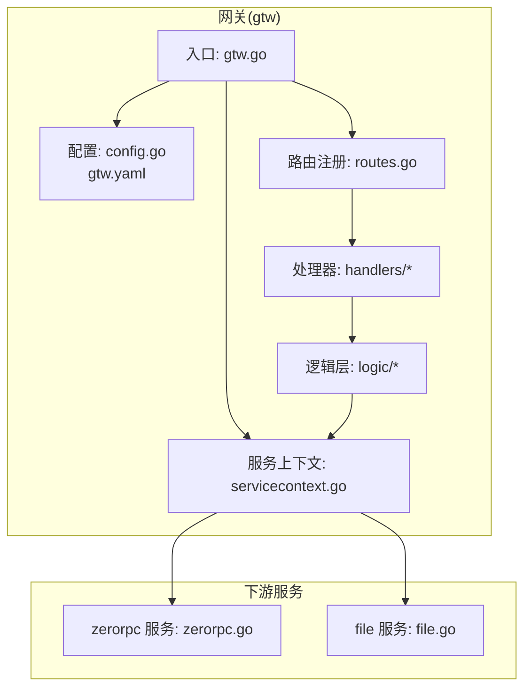
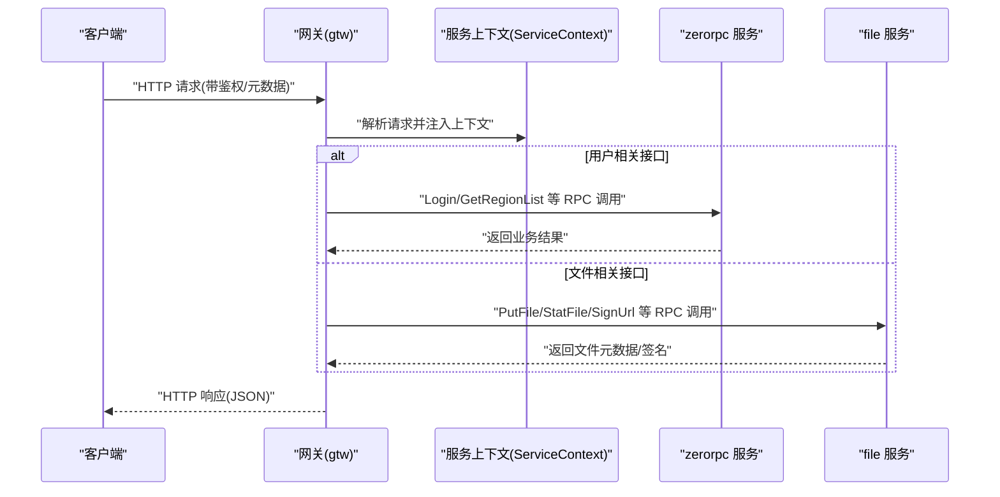
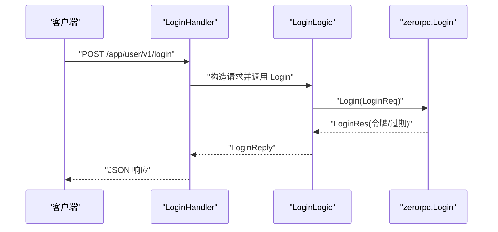
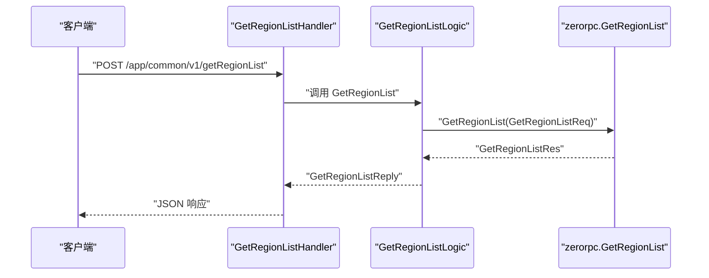
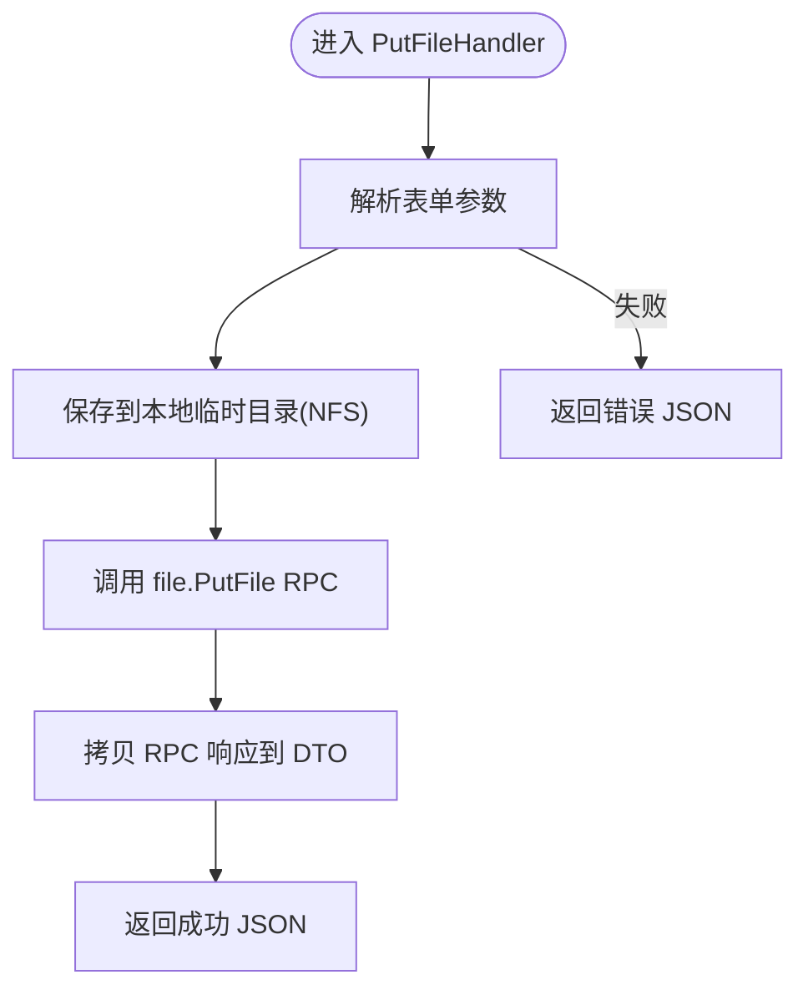
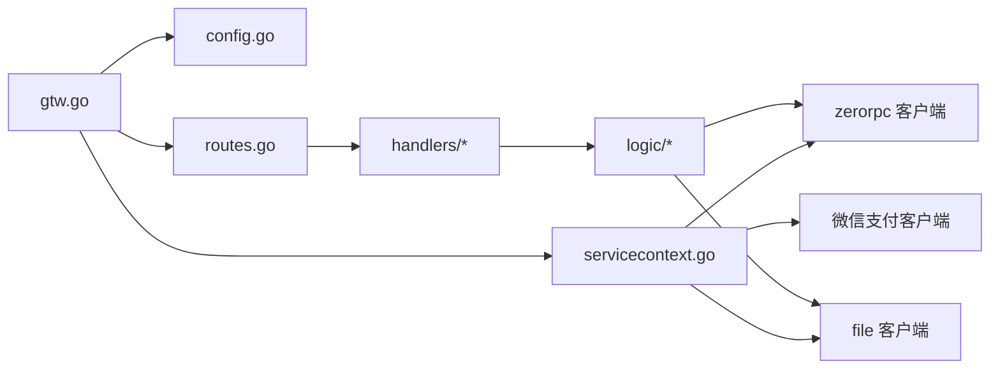

# BFF 网关服务

<cite>
**本文引用的文件**
- [gtw.go](file://gtw/gtw.go)
- [routes.go](file://gtw/internal/handler/routes.go)
- [config.go](file://gtw/internal/config/config.go)
- [servicecontext.go](file://gtw/internal/svc/servicecontext.go)
- [metadataInterceptor.go](file://common/Interceptor/rpcclient/metadataInterceptor.go)
- [loginhandler.go](file://gtw/internal/handler/user/loginhandler.go)
- [getregionlisthandler.go](file://gtw/internal/handler/common/getregionlisthandler.go)
- [putfilehandler.go](file://gtw/internal/handler/file/putfilehandler.go)
- [loginlogic.go](file://gtw/internal/logic/user/loginlogic.go)
- [getregionlistlogic.go](file://gtw/internal/logic/common/getregionlistlogic.go)
- [putfilelogic.go](file://gtw/internal/logic/file/putfilelogic.go)
- [base.api](file://gtw/doc/base.api)
- [gtw.yaml](file://gtw/etc/gtw.yaml)
- [zerorpc.go](file://zerorpc/zerorpc.go)
- [file.go](file://app/file/file.go)
</cite>

## 目录
1. [简介](#简介)
2. [项目结构](#项目结构)
3. [核心组件](#核心组件)
4. [架构总览](#架构总览)
5. [详细组件分析](#详细组件分析)
6. [依赖分析](#依赖分析)
7. [性能考虑](#性能考虑)
8. [故障排查指南](#故障排查指南)
9. [结论](#结论)
10. [附录](#附录)

## 简介
本文件为 BFF（Backend For Frontend）网关服务的技术文档，聚焦 gtw 服务的架构与实现细节。内容涵盖 REST 服务器配置、路由注册机制、中间件链、用户认证登录、文件上传下载、区域列表查询等核心业务接口；同时阐述 gRPC-Gateway 的集成思路、HTTP 到 gRPC 的自动转换规则、CORS 跨域与安全控制策略、请求验证机制，并提供配置项、性能优化建议与故障处理方案。

## 项目结构
- gtw 应用作为统一入口，负责 REST API 的路由与转发，内部通过 RPC 客户端调用 zerorpc 与 file 服务。
- 配置集中于 YAML，包含 REST 服务参数、RPC 客户端连接、JWT 密钥、NFS 根目录、下载地址与 Swagger 路径等。
- 中间件链在 gtw 启动时注入，统一设置 CORS 并透传上下文元数据到下游 gRPC 服务。
- 路由按模块划分前缀：/app/common/v1、/file/v1、/gtw/v1、/gtw/v1/pay、/app/user/v1 等。

图表来源
- [gtw.go:25-95](file://gtw/gtw.go#L25-L95)
- [routes.go:20-160](file://gtw/internal/handler/routes.go#L20-L160)
- [config.go:8-20](file://gtw/internal/config/config.go#L8-L20)
- [servicecontext.go:23-65](file://gtw/internal/svc/servicecontext.go#L23-L65)
- [zerorpc.go:26-58](file://zerorpc/zerorpc.go#L26-L58)
- [file.go:28-71](file://app/file/file.go#L28-L71)

章节来源
- [gtw.go:25-95](file://gtw/gtw.go#L25-L95)
- [routes.go:20-160](file://gtw/internal/handler/routes.go#L20-L160)
- [config.go:8-20](file://gtw/internal/config/config.go#L8-L20)
- [servicecontext.go:23-65](file://gtw/internal/svc/servicecontext.go#L23-L65)
- [zerorpc.go:26-58](file://zerorpc/zerorpc.go#L26-L58)
- [file.go:28-71](file://app/file/file.go#L28-L71)

## 核心组件
- REST 服务器与 CORS
  - 使用 go-zero 的 REST 服务器，自定义 CORS 回调，动态设置允许源、凭证、方法与头部，并通过 Vary 防止缓存污染。
  - 支持静态 Swagger 文档路由，按配置加载 swagger 目录中的 JSON 文件。
- 服务上下文与中间件
  - ServiceContext 注入验证器、zerorpc 客户端、file 客户端与微信支付客户端。
  - gRPC 客户端统一注入元数据拦截器，将用户标识、租户、授权与追踪 ID 透传至下游。
- 路由注册
  - 按模块前缀注册路由，部分路由启用 JWT 认证（如用户中心）。
- 配置管理
  - 包含 REST 参数、RPC 客户端、JWT 密钥、NFS 根目录、下载地址与 Swagger 路径等。

章节来源
- [gtw.go:51-95](file://gtw/gtw.go#L51-L95)
- [servicecontext.go:15-65](file://gtw/internal/svc/servicecontext.go#L15-L65)
- [metadataInterceptor.go:11-32](file://common/Interceptor/rpcclient/metadataInterceptor.go#L11-L32)
- [routes.go:20-160](file://gtw/internal/handler/routes.go#L20-L160)
- [config.go:8-20](file://gtw/internal/config/config.go#L8-L20)

## 架构总览
下图展示从客户端到网关再到下游服务的整体流程，以及 gRPC 客户端元数据透传的关键环节。

图表来源
- [gtw.go:64-68](file://gtw/gtw.go#L64-L68)
- [routes.go:20-160](file://gtw/internal/handler/routes.go#L20-L160)
- [loginlogic.go:28-42](file://gtw/internal/logic/user/loginlogic.go#L28-L42)
- [getregionlistlogic.go:29-37](file://gtw/internal/logic/common/getregionlistlogic.go#L29-L37)
- [putfilelogic.go:79-95](file://gtw/internal/logic/file/putfilelogic.go#L79-L95)

## 详细组件分析

### REST 服务器与 CORS
- CORS 动态设置
  - 依据请求头 Origin 设置 Access-Control-Allow-Origin，避免跨域限制。
  - 设置 Vary: Origin 防止缓存污染。
  - 允许凭据、常用方法与头部，暴露必要响应头。
- Swagger 静态路由
  - 当配置了 SwaggerPath 时，注册 /swagger/:fileName 路由，读取本地 JSON 文件返回。
- 日志与全局字段
  - 启动时打印 Go 版本，设置全局日志字段 app=gateway。

章节来源
- [gtw.go:51-95](file://gtw/gtw.go#L51-L95)

### 服务上下文与 gRPC 客户端
- ServiceContext 提供：
  - 验证器、zerorpc 客户端、file 客户端、微信支付客户端。
  - 客户端均注入元数据拦截器，确保用户上下文在 gRPC 流中传递。
- 配置项
  - JwtAuth.AccessSecret 用于 JWT 鉴权。
  - ZeroRpcConf/FileRpcConf 控制下游 RPC 连接。
  - NfsRootPath/DownloadUrl 用于文件下载与存储路径。
  - SwaggerPath 用于 Swagger 文档暴露。

章节来源
- [servicecontext.go:15-65](file://gtw/internal/svc/servicecontext.go#L15-L65)
- [config.go:8-20](file://gtw/internal/config/config.go#L8-L20)
- [gtw.yaml:47-61](file://gtw/etc/gtw.yaml#L47-L61)

### 路由注册机制
- 模块化前缀
  - /app/common/v1：区域列表、MFS 上传等通用能力。
  - /file/v1：OSS/文件相关接口，包含超时配置。
  - /gtw/v1：网关通用接口（如 ping、下载）。
  - /gtw/v1/pay：支付回调。
  - /app/user/v1：用户登录、短信验证码、当前用户信息等，部分路由启用 JWT。
- 路由注册入口
  - RegisterHandlers 在启动时完成所有路由注册与中间件绑定。

章节来源
- [routes.go:20-160](file://gtw/internal/handler/routes.go#L20-L160)

### 中间件链与元数据透传
- 元数据拦截器
  - 将用户 ID、用户名、部门编码、授权信息、追踪 ID 写入 gRPC 元数据，保证链路可观测与鉴权一致。
- CORS 中间件
  - 在 REST 层统一设置跨域策略，避免每个处理器重复实现。

章节来源
- [metadataInterceptor.go:11-32](file://common/Interceptor/rpcclient/metadataInterceptor.go#L11-L32)
- [gtw.go:51-63](file://gtw/gtw.go#L51-L63)

### 用户认证登录
- 接口
  - /app/user/v1/login：账号密码登录，返回访问令牌与过期时间。
  - /app/user/v1/miniProgramLogin：小程序登录。
  - /app/user/v1/sendSMSVerifyCode：发送短信验证码。
- 处理流程
  - Handler 解析请求体，构造 RPC 请求，调用 zerorpc.Login 接口。
  - 返回统一 JSON 响应。

图表来源
- [loginhandler.go:14-30](file://gtw/internal/handler/user/loginhandler.go#L14-L30)
- [loginlogic.go:28-42](file://gtw/internal/logic/user/loginlogic.go#L28-L42)

章节来源
- [loginhandler.go:14-30](file://gtw/internal/handler/user/loginhandler.go#L14-L30)
- [loginlogic.go:28-42](file://gtw/internal/logic/user/loginlogic.go#L28-L42)

### 区域列表查询
- 接口
  - /app/common/v1/getRegionList：根据父级编码查询区域列表。
- 处理流程
  - Handler -> Logic -> zerorpc.GetRegionList -> 返回并拷贝到 DTO。

图表来源
- [getregionlisthandler.go:14-30](file://gtw/internal/handler/common/getregionlisthandler.go#L14-L30)
- [getregionlistlogic.go:29-37](file://gtw/internal/logic/common/getregionlistlogic.go#L29-L37)

章节来源
- [getregionlisthandler.go:14-30](file://gtw/internal/handler/common/getregionlisthandler.go#L14-L30)
- [getregionlistlogic.go:29-37](file://gtw/internal/logic/common/getregionlistlogic.go#L29-L37)

### 文件上传下载与 OSS 接口
- 上传接口
  - /file/v1/oss/endpoint/putFile：表单上传，写入 NFS，再调用 file 服务持久化。
  - /file/v1/oss/endpoint/putChunkFile：分片上传（双向流）。
  - /file/v1/oss/endpoint/putStreamFile：单向流上传。
- 查询与签名
  - /file/v1/oss/endpoint/statFile：获取文件信息。
  - /file/v1/oss/endpoint/signUrl：生成预签名 URL。
- 下载
  - /gtw/v1/mfs/downloadFile：基于配置的 DownloadUrl 拼接下载链接。
- 处理流程
  - Handler 解析表单/参数 -> Logic 执行业务（写本地临时文件/调用 file RPC）-> 返回统一 JSON。

图表来源
- [putfilehandler.go:13-29](file://gtw/internal/handler/file/putfilehandler.go#L13-L29)
- [putfilelogic.go:45-96](file://gtw/internal/logic/file/putfilelogic.go#L45-L96)

章节来源
- [putfilehandler.go:13-29](file://gtw/internal/handler/file/putfilehandler.go#L13-L29)
- [putfilelogic.go:45-96](file://gtw/internal/logic/file/putfilelogic.go#L45-L96)

### 支付回调
- /gtw/v1/pay/wechat/paidNotify：微信支付成功回调。
- /gtw/v1/pay/wechat/refundedNotify：微信退款回调。
- 处理器职责：解析回调参数、校验签名、更新订单状态等（具体逻辑在对应处理器中实现）。

章节来源
- [routes.go:100-116](file://gtw/internal/handler/routes.go#L100-L116)

### gRPC-Gateway 集成与 HTTP 到 gRPC 的转换
- 当前实现
  - gtw 未直接使用 go-zero 的 gateway 子系统进行 HTTP 到 gRPC 的自动映射。
  - 通过 zrpc 客户端直连下游服务，路由与协议转换由各处理器/逻辑层显式调用完成。
- 集成建议（概念性）
  - 若需引入 gateway：
    - 在配置中启用 Upstreams，声明 gRPC 端点、ProtoSets 与 Mappings。
    - 通过 proto 中的 google.api 注解定义 REST 映射，gateway 自动将 HTTP 请求转换为 gRPC 调用。
  - 注意：本仓库未启用该模式，当前以“显式 RPC 调用”为主。

章节来源
- [gtw.go:35-49](file://gtw/gtw.go#L35-L49)
- [gtw.yaml:17-46](file://gtw/etc/gtw.yaml#L17-L46)

### 数据模型与请求/响应约定
- 基础类型与约定
  - PingReply、ForwardRequest、UploadFileRequest/Reply、DownloadFileRequest、ImageMeta、EmptyReply、BaseRequest/TenantRequest 等。
- 字段约束
  - UploadFileRequest 中对表单字段添加选项与可选标记，便于前端传参与后端校验。

章节来源
- [base.api:3-51](file://gtw/doc/base.api#L3-L51)

## 依赖分析
- 组件耦合
  - gtw 通过 ServiceContext 统一注入 RPC 客户端，降低处理器与具体服务的耦合。
  - 元数据拦截器在客户端层统一处理，保证链路一致性。
- 外部依赖
  - zerorpc 与 file 服务通过 zrpc 提供的连接池与超时控制。
  - 微信支付 SDK 初始化在 ServiceContext 中完成，供支付回调使用。

图表来源
- [gtw.go:25-95](file://gtw/gtw.go#L25-L95)
- [servicecontext.go:23-65](file://gtw/internal/svc/servicecontext.go#L23-L65)
- [routes.go:20-160](file://gtw/internal/handler/routes.go#L20-L160)

章节来源
- [servicecontext.go:15-65](file://gtw/internal/svc/servicecontext.go#L15-L65)
- [routes.go:20-160](file://gtw/internal/handler/routes.go#L20-L160)

## 性能考虑
- 上传性能
  - 单文件最大值与分片大小在逻辑层有常量定义，建议结合业务调整并增加断点续传支持。
  - 上传完成后清理临时表单资源，避免磁盘占用。
- 超时与并发
  - file 模块路由设置了较长超时，适合大文件或流式传输场景。
  - RPC 客户端超时由配置控制，建议根据下游服务性能调优。
- CORS 与静态资源
  - 动态 CORS 设置减少不必要的预检开销；Swagger 静态路由仅在需要时启用。

章节来源
- [putfilelogic.go:24-26](file://gtw/internal/logic/file/putfilelogic.go#L24-L26)
- [routes.go:72-74](file://gtw/internal/handler/routes.go#L72-L74)
- [gtw.yaml:47-56](file://gtw/etc/gtw.yaml#L47-L56)

## 故障排查指南
- CORS 相关
  - 若出现跨域问题，检查请求头 Origin 是否存在，确认响应头是否正确设置。
- JWT 鉴权
  - 对启用 JWT 的路由（如用户中心），确认请求头携带有效令牌。
- RPC 调用失败
  - 检查 zerorpc 与 file 服务是否正常启动，确认端点与超时配置。
- 文件上传异常
  - 关注本地临时目录权限与空间，确认上传文件大小与类型符合预期。
- 支付回调
  - 确认回调地址与签名验证逻辑，检查微信支付证书与密钥配置。

章节来源
- [gtw.go:51-63](file://gtw/gtw.go#L51-L63)
- [routes.go:157-159](file://gtw/internal/handler/routes.go#L157-L159)
- [servicecontext.go:24-52](file://gtw/internal/svc/servicecontext.go#L24-L52)
- [putfilelogic.go:45-96](file://gtw/internal/logic/file/putfilelogic.go#L45-L96)

## 结论
本 BFF 网关服务以 go-zero 为基础，采用模块化路由与统一服务上下文，结合元数据拦截器实现跨服务链路的一致性。通过显式 RPC 调用满足当前业务需求，同时保留引入 gRPC-Gateway 的扩展空间。CORS、JWT、请求解析与统一响应已形成完整闭环，适合在多端前端与多后端服务之间提供稳定、可维护的统一入口。

## 附录
- 配置项速览
  - 名称、主机、端口、超时、日志编码、链路追踪（可选）、上游 gRPC（可选）、zerorpc/file 客户端、JWT 密钥、NFS 根目录、下载地址、Swagger 路径。
- 使用场景
  - 用户登录与信息管理、区域列表查询、文件上传与下载、支付回调接入。

章节来源
- [gtw.yaml:1-61](file://gtw/etc/gtw.yaml#L1-L61)
- [config.go:8-20](file://gtw/internal/config/config.go#L8-L20)