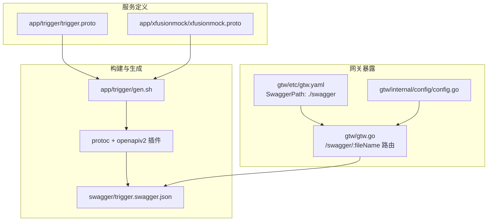
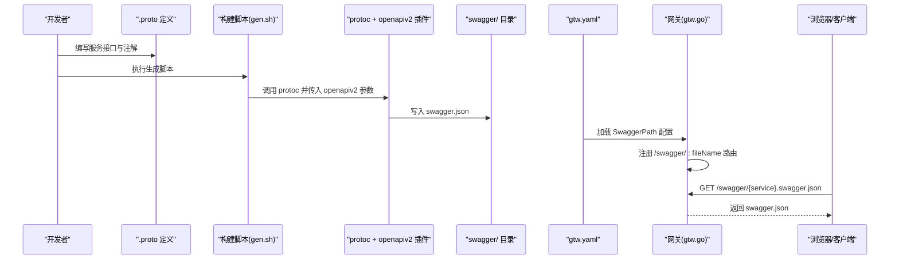
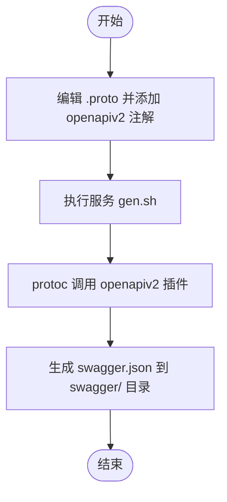
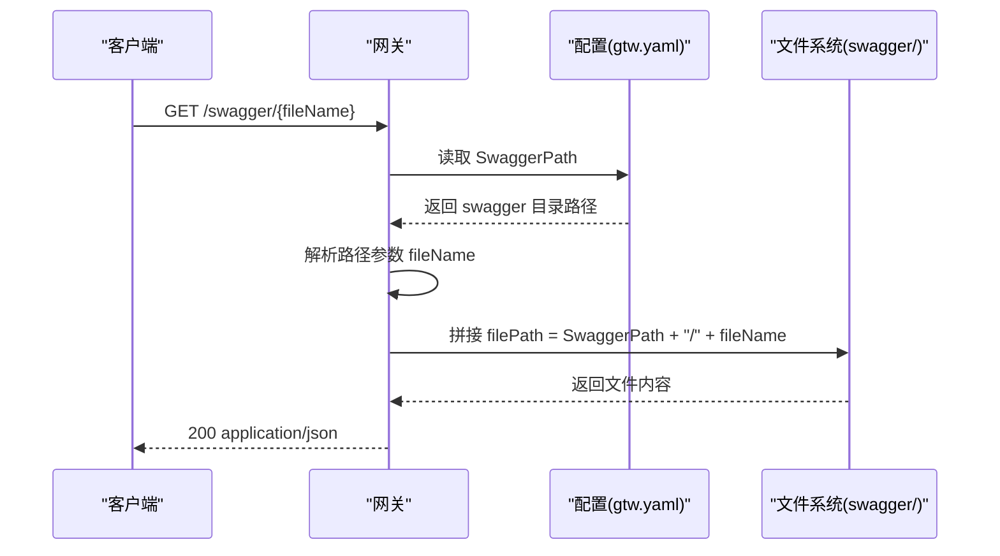
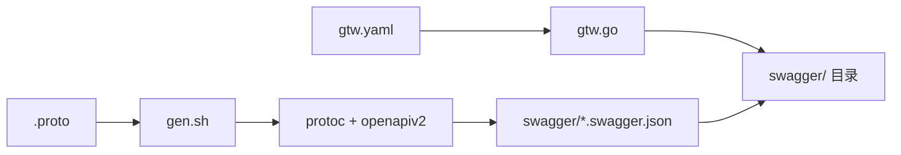

# Swagger 集成

<cite>
**本文引用的文件**
- [gtw.go](file://gtw/gtw.go)
- [gtw.yaml](file://gtw/etc/gtw.yaml)
- [config.go](file://gtw/internal/config/config.go)
- [trigger.proto](file://app/trigger/trigger.proto)
- [xfusionmock.proto](file://app/xfusionmock/xfusionmock.proto)
- [gen.sh](file://app/trigger/gen.sh)
- [trigger.swagger.json](file://swagger/trigger.swagger.json)
- [README.md](file://README.md)
- [defs.bzl](file://third_party/protoc-gen-openapiv2/defs.bzl)
</cite>

## 目录
1. [简介](#简介)
2. [项目结构](#项目结构)
3. [核心组件](#核心组件)
4. [架构总览](#架构总览)
5. [详细组件分析](#详细组件分析)
6. [依赖分析](#依赖分析)
7. [性能考虑](#性能考虑)
8. [故障排查指南](#故障排查指南)
9. [结论](#结论)
10. [附录](#附录)

## 简介
本文件面向 Swagger/OpenAPI v2 文档在本仓库中的集成与使用，重点覆盖以下方面：
- Swagger 文档的自动生成机制：基于 protoc 插件与 grpc-gateway 的注解，通过构建脚本生成 swagger.json。
- 静态文件路由配置：如何在统一网关中暴露 swagger.json 并进行访问控制。
- 文档结构组织与分类管理：接口分组、标签设置、路径与模型定义。
- 版本管理与更新策略：多版本 API 的文档维护建议。
- 配置示例与使用指南：帮助开发者快速生成与维护 API 文档。

## 项目结构
Swagger 集成在本仓库中的分布如下：
- 文档生成：各服务的 .proto 文件中通过注解定义 API 行为，构建脚本调用 protoc 与 openapiv2 插件生成 swagger.json，并输出到 swagger/ 目录。
- 文档暴露：统一网关 gtw 在配置启用时，添加静态文件路由，将 swagger/ 目录下的 swagger.json 暴露给外部访问。
- 文档内容：每个服务对应一个 swagger.json，包含 info、tags、paths、definitions 等字段，用于描述该服务的 API。

图表来源
- [gen.sh:11-18](file://app/trigger/gen.sh#L11-L18)
- [trigger.proto:1-106](file://app/trigger/trigger.proto#L1-L106)
- [xfusionmock.proto:1-24](file://app/xfusionmock/xfusionmock.proto#L1-L24)
- [gtw.yaml:60-61](file://gtw/etc/gtw.yaml#L60-L61)
- [gtw.go:70-90](file://gtw/gtw.go#L70-L90)
- [config.go:18-19](file://gtw/internal/config/config.go#L18-L19)

章节来源
- [README.md:104-107](file://README.md#L104-L107)
- [README.md:289-294](file://README.md#L289-L294)

## 核心组件
- 构建脚本与插件
  - 通过构建脚本调用 protoc，并指定 openapiv2 输出目录为 swagger/，从而生成各服务的 swagger.json。
  - 插件参数支持多种选项，如是否包含包名作为标签、是否使用 Go 模板、是否禁用默认响应等。
- Swagger 文档生成配置
  - 在 .proto 中通过 openapiv2 选项对文档标题、版本、联系人、许可证等进行配置；也可在字段上标注描述与示例。
- 网关静态文件路由
  - 当配置中启用 SwaggerPath 时，网关动态注册 /swagger/:fileName 路由，读取 swagger/ 目录下的文件并返回 JSON。
- 配置结构
  - 网关配置中包含 SwaggerPath 字段，用于指定 swagger.json 的物理路径。

章节来源
- [gen.sh:11-18](file://app/trigger/gen.sh#L11-L18)
- [defs.bzl:91-166](file://third_party/protoc-gen-openapiv2/defs.bzl#L91-L166)
- [trigger.proto:1-106](file://app/trigger/trigger.proto#L1-L106)
- [xfusionmock.proto:9-24](file://app/xfusionmock/xfusionmock.proto#L9-L24)
- [gtw.yaml:60-61](file://gtw/etc/gtw.yaml#L60-L61)
- [gtw.go:70-90](file://gtw/gtw.go#L70-L90)
- [config.go:18-19](file://gtw/internal/config/config.go#L18-L19)

## 架构总览
下图展示了从 .proto 定义到 swagger.json 生成，再到网关暴露的完整流程：

图表来源
- [gen.sh:11-18](file://app/trigger/gen.sh#L11-L18)
- [trigger.proto:1-106](file://app/trigger/trigger.proto#L1-L106)
- [xfusionmock.proto:1-24](file://app/xfusionmock/xfusionmock.proto#L1-L24)
- [gtw.yaml:60-61](file://gtw/etc/gtw.yaml#L60-L61)
- [gtw.go:70-90](file://gtw/gtw.go#L70-L90)

## 详细组件分析

### 组件一：Swagger 文档自动生成机制
- .proto 注解与文档模板
  - 在 .proto 中通过 openapiv2 选项配置文档元信息（标题、版本、描述、联系人、许可证等）。
  - 字段级注解可用于描述字段含义与示例，提升文档可读性。
- 构建脚本与插件参数
  - 构建脚本调用 protoc 并启用 openapiv2 输出，将 swagger.json 写入 swagger/ 目录。
  - 插件支持大量可选参数，如是否包含包名作为标签、是否使用 Go 模板、是否禁用默认响应等，便于定制化输出。
- 输出产物
  - 生成的 swagger.json 包含 info、tags、paths、definitions 等字段，描述服务的 API 结构。

图表来源
- [trigger.proto:1-106](file://app/trigger/trigger.proto#L1-L106)
- [xfusionmock.proto:9-24](file://app/xfusionmock/xfusionmock.proto#L9-L24)
- [gen.sh:11-18](file://app/trigger/gen.sh#L11-L18)
- [defs.bzl:91-166](file://third_party/protoc-gen-openapiv2/defs.bzl#L91-L166)

章节来源
- [trigger.proto:1-106](file://app/trigger/trigger.proto#L1-L106)
- [xfusionmock.proto:1-24](file://app/xfusionmock/xfusionmock.proto#L1-L24)
- [gen.sh:11-18](file://app/trigger/gen.sh#L11-L18)
- [defs.bzl:91-166](file://third_party/protoc-gen-openapiv2/defs.bzl#L91-L166)

### 组件二：静态文件路由配置与访问控制
- 配置项
  - gtw.yaml 中的 SwaggerPath 指定 swagger.json 的物理路径，默认为 ./swagger。
- 路由注册
  - 网关在运行时检查 SwaggerPath 是否为空，若非空则注册 /swagger/:fileName 路由。
- 请求处理
  - 解析路径参数 fileName，拼接实际文件路径，设置 Content-Type 为 application/json，然后返回文件内容。
- 访问控制
  - 当前实现未对 /swagger/* 路由增加鉴权或限流控制，建议结合网关的统一鉴权与安全策略进行补充。

图表来源
- [gtw.yaml:60-61](file://gtw/etc/gtw.yaml#L60-L61)
- [gtw.go:70-90](file://gtw/gtw.go#L70-L90)
- [config.go:18-19](file://gtw/internal/config/config.go#L18-L19)

章节来源
- [gtw.yaml:60-61](file://gtw/etc/gtw.yaml#L60-L61)
- [gtw.go:70-90](file://gtw/gtw.go#L70-L90)
- [config.go:18-19](file://gtw/internal/config/config.go#L18-L19)

### 组件三：API 文档的结构组织与分类管理
- 结构字段
  - info：文档元信息，包含 title、version 等。
  - tags：接口分组标签，通常与服务名一致。
  - consumes/produces：内容类型声明。
  - paths：接口路径集合，记录 HTTP 方法、参数、响应等。
  - definitions：数据模型定义，如 protobufAny、rpcStatus 等。
- 分组与标签
  - 通过 include_package_in_tags 等插件参数可将包名纳入标签，便于按服务分组。
- 示例
  - 触发服务的 swagger.json 展示了上述字段的基本形态。

章节来源
- [trigger.swagger.json:1-50](file://swagger/trigger.swagger.json#L1-L50)
- [defs.bzl:113-114](file://third_party/protoc-gen-openapiv2/defs.bzl#L113-L114)

### 组件四：版本管理与更新策略
- 版本字段
  - swagger.json 的 info.version 字段用于标识文档版本，可在 .proto 的 openapiv2 选项中配置。
- 多版本维护建议
  - 为不同版本的 API 生成独立的 swagger.json 文件（例如 trigger_v1.swagger.json、trigger_v2.swagger.json），并在网关中分别暴露。
  - 通过 SwaggerPath 或路由前缀区分不同版本，确保客户端访问到正确的版本。
  - 更新时保持向后兼容的接口，或在新版本中明确迁移路径与弃用时间线。

章节来源
- [trigger.swagger.json:3-6](file://swagger/trigger.swagger.json#L3-L6)
- [xfusionmock.proto:10-23](file://app/xfusionmock/xfusionmock.proto#L10-L23)

### 组件五：配置示例与使用指南
- 生成步骤
  - 在服务目录执行 gen.sh，触发 protoc 与 openapiv2 插件生成 swagger.json。
- 网关暴露
  - 在 gtw.yaml 中设置 SwaggerPath 指向 swagger/ 目录。
  - 启动网关后，即可通过 GET /swagger/{service}.swagger.json 访问对应文档。
- 最佳实践
  - 在 .proto 中完善 openapiv2 文档元信息与字段注解，提升文档质量。
  - 对 swagger.json 的访问增加鉴权或白名单限制，避免敏感信息泄露。
  - 对多版本 API 做好命名规范与版本路径规划，便于客户端切换。

章节来源
- [gen.sh:11-18](file://app/trigger/gen.sh#L11-L18)
- [gtw.yaml:60-61](file://gtw/etc/gtw.yaml#L60-L61)
- [README.md:289-294](file://README.md#L289-L294)

## 依赖分析
- 组件耦合
  - 构建脚本依赖 protoc 与 openapiv2 插件；swagger.json 依赖 .proto 中的 openapiv2 注解。
  - 网关对 swagger/ 目录的依赖通过 SwaggerPath 配置体现。
- 外部依赖
  - protoc-gen-openapiv2 插件提供丰富的参数选项，影响输出格式与内容。
- 潜在问题
  - 若 SwaggerPath 配置错误或文件不存在，会导致 /swagger/* 路由返回 404。
  - 未对 /swagger/* 路由做访问控制，存在信息泄露风险。

图表来源
- [gen.sh:11-18](file://app/trigger/gen.sh#L11-L18)
- [gtw.yaml:60-61](file://gtw/etc/gtw.yaml#L60-L61)
- [gtw.go:70-90](file://gtw/gtw.go#L70-L90)

章节来源
- [defs.bzl:91-166](file://third_party/protoc-gen-openapiv2/defs.bzl#L91-L166)
- [gtw.yaml:60-61](file://gtw/etc/gtw.yaml#L60-L61)
- [gtw.go:70-90](file://gtw/gtw.go#L70-L90)

## 性能考虑
- 生成性能
  - openapiv2 插件参数较多，建议仅启用必要的选项，减少生成时间与输出体积。
- 访问性能
  - swagger.json 为静态文件，建议通过网关或反向代理开启缓存与压缩，降低带宽占用。
- 安全性能
  - 建议对 /swagger/* 路由增加鉴权与访问限制，避免生产环境暴露敏感信息。

## 故障排查指南
- 无法访问 swagger.json
  - 检查 gtw.yaml 中 SwaggerPath 是否正确指向 swagger/ 目录。
  - 确认 gen.sh 已成功生成对应 {service}.swagger.json。
- 文档内容不完整
  - 检查 .proto 中是否正确添加 openapiv2 注解与字段描述。
  - 确认构建脚本调用了 openapiv2 输出参数。
- 访问控制问题
  - 当前路由未内置鉴权，建议在网关层增加统一鉴权或白名单策略。

章节来源
- [gtw.yaml:60-61](file://gtw/etc/gtw.yaml#L60-L61)
- [gtw.go:70-90](file://gtw/gtw.go#L70-L90)
- [trigger.swagger.json:1-50](file://swagger/trigger.swagger.json#L1-L50)

## 结论
本仓库通过 protoc + openapiv2 插件实现了 .proto 到 swagger.json 的自动化生成，并在网关层提供静态文件路由以暴露文档。建议在现有基础上完善多版本文档管理、访问控制与生成参数优化，以满足更复杂的生产需求。

## 附录
- 相关文件清单
  - 生成脚本：app/*/gen.sh
  - 文档输出：swagger/*.swagger.json
  - 网关配置：gtw/etc/gtw.yaml
  - 网关代码：gtw/gtw.go
  - 插件参数：third_party/protoc-gen-openapiv2/defs.bzl