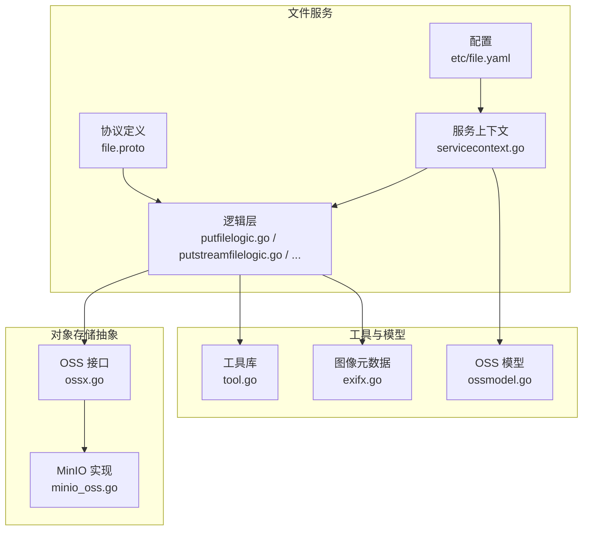
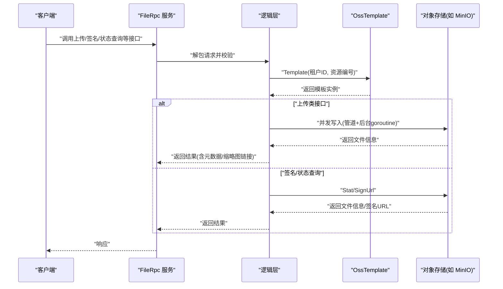
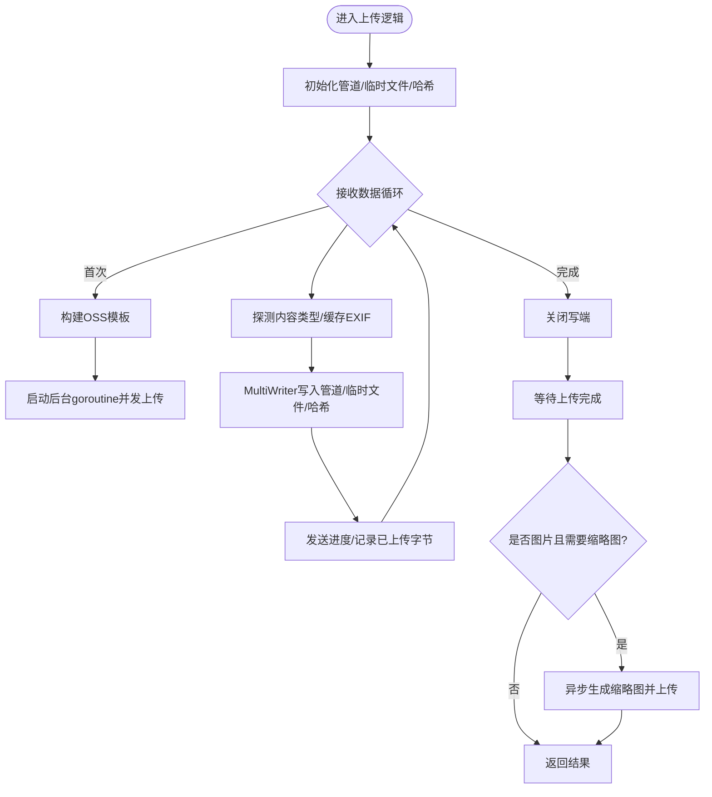
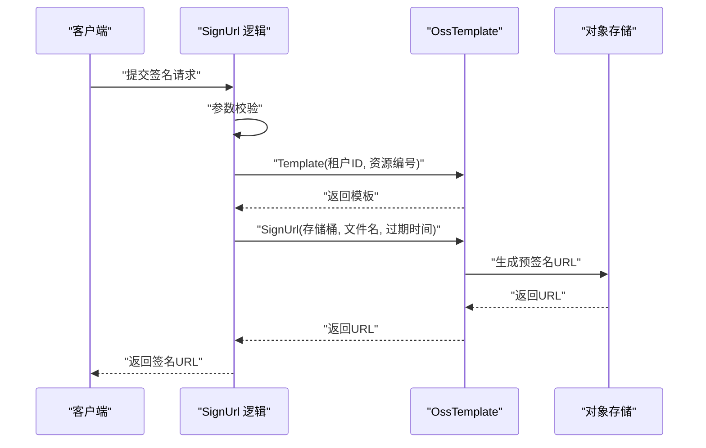
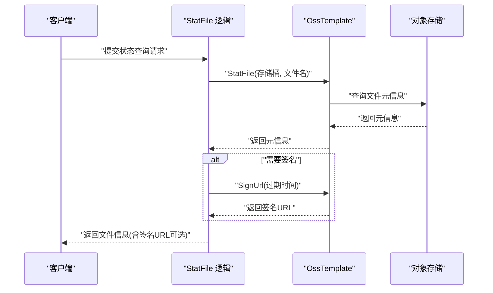
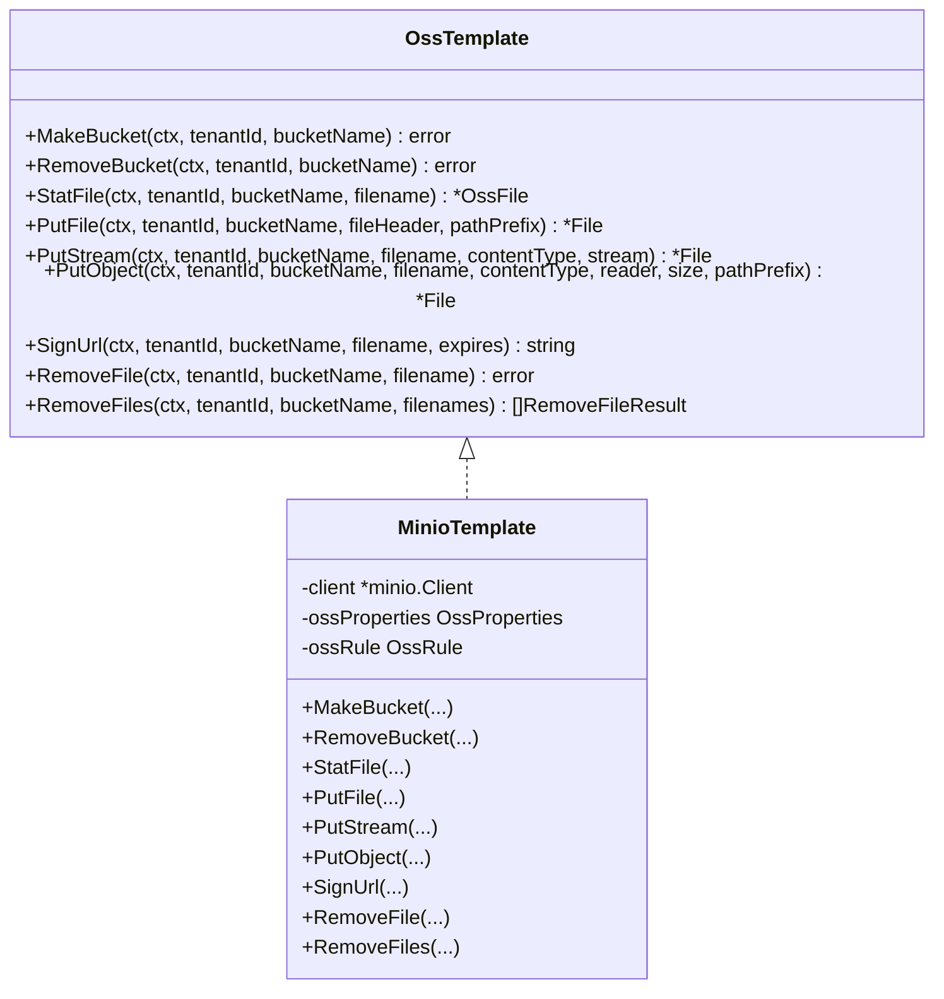
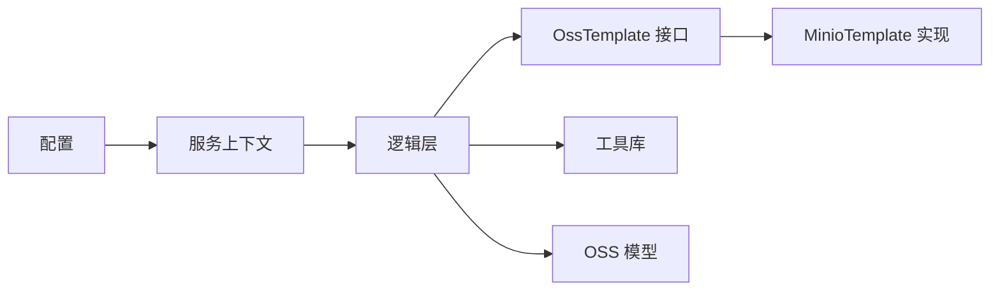

# 文件服务模块

<cite>
**本文引用的文件**
- [app/file/file.proto](file://app/file/file.proto)
- [app/file/etc/file.yaml](file://app/file/etc/file.yaml)
- [app/file/internal/config/config.go](file://app/file/internal/config/config.go)
- [app/file/internal/svc/servicecontext.go](file://app/file/internal/svc/servicecontext.go)
- [app/file/internal/logic/putfilelogic.go](file://app/file/internal/logic/putfilelogic.go)
- [app/file/internal/logic/putchunkfilelogic.go](file://app/file/internal/logic/putchunkfilelogic.go)
- [app/file/internal/logic/putstreamfilelogic.go](file://app/file/internal/logic/putstreamfilelogic.go)
- [app/file/internal/logic/signurllogic.go](file://app/file/internal/logic/signurllogic.go)
- [app/file/internal/logic/statfilelogic.go](file://app/file/internal/logic/statfilelogic.go)
- [app/file/internal/logic/createosslogic.go](file://app/file/internal/logic/createosslogic.go)
- [app/file/internal/logic/removefilelogic.go](file://app/file/internal/logic/removefilelogic.go)
- [common/ossx/ossx.go](file://common/ossx/ossx.go)
- [common/ossx/minio_oss.go](file://common/ossx/minio_oss.go)
- [common/imagex/exifx.go](file://common/imagex/exifx.go)
- [common/tool/tool.go](file://common/tool/tool.go)
- [model/ossmodel.go](file://model/ossmodel.go)
</cite>

## 目录
1. [简介](#简介)
2. [项目结构](#项目结构)
3. [核心组件](#核心组件)
4. [架构总览](#架构总览)
5. [详细组件分析](#详细组件分析)
6. [依赖关系分析](#依赖关系分析)
7. [性能考虑](#性能考虑)
8. [故障排查指南](#故障排查指南)
9. [结论](#结论)
10. [附录：API 接口文档与使用示例](#附录api-接口文档与使用示例)

## 简介
本文件服务模块基于 gRPC 和 Go-Zero 构建，提供统一的对象存储（OSS）接入能力，覆盖单文件上传、分片/流式上传、文件状态查询、签名 URL 生成、缩略图异步生成、批量删除等能力。模块通过模板工厂按租户与资源编号动态选择 OSS 实现，并内置 MinIO 支持；同时提供可扩展的 OSS 类型注册机制。

## 项目结构
- 协议与接口定义：位于 app/file/file.proto，定义了文件服务的 gRPC 接口、请求/响应消息结构。
- 配置与上下文：配置文件 app/file/etc/file.yaml，以及内部配置结构 app/file/internal/config/config.go 和服务上下文 app/file/internal/svc/servicecontext.go。
- 业务逻辑：各 RPC 方法对应的逻辑层实现，如上传、签名、状态查询、OSS 管理等。
- 对象存储抽象：common/ossx 下的接口与 MinIO 实现，负责具体存储交互。
- 工具与模型：common/tool 提供通用工具（如文件名生成、字节格式化），model/ossmodel 提供 OSS 配置的数据库模型。

图表来源
- [app/file/file.proto:1-287](file://app/file/file.proto#L1-L287)
- [app/file/etc/file.yaml:1-23](file://app/file/etc/file.yaml#L1-L23)
- [app/file/internal/svc/servicecontext.go:12-26](file://app/file/internal/svc/servicecontext.go#L12-L26)
- [common/ossx/ossx.go:28-151](file://common/ossx/ossx.go#L28-L151)
- [common/ossx/minio_oss.go:20-243](file://common/ossx/minio_oss.go#L20-L243)
- [common/tool/tool.go:126-131](file://common/tool/tool.go#L126-L131)
- [model/ossmodel.go:10-31](file://model/ossmodel.go#L10-L31)

章节来源
- [app/file/file.proto:1-287](file://app/file/file.proto#L1-L287)
- [app/file/etc/file.yaml:1-23](file://app/file/etc/file.yaml#L1-L23)
- [app/file/internal/config/config.go:10-30](file://app/file/internal/config/config.go#L10-L30)
- [app/file/internal/svc/servicecontext.go:12-26](file://app/file/internal/svc/servicecontext.go#L12-L26)

## 核心组件
- 协议与消息：定义了文件上传（单文件、分片、流式）、文件状态查询、签名 URL、OSS 管理（创建、删除、列表、详情）等接口与消息结构。
- 配置与上下文：集中管理日志、Nacos 注册、数据库连接、缓存、OSS 配置、缩略图并发任务执行器等。
- 逻辑层：封装上传、签名、状态查询、OSS 管理等业务流程，统一调用 OSS 抽象接口。
- OSS 抽象：OssTemplate 接口定义统一能力；MinioTemplate 实现具体存储交互；模板工厂根据租户与资源编号选择模板并缓存。
- 工具与模型：提供文件名生成、字节格式化、EXIF 元数据提取、OSS 配置模型等。

章节来源
- [app/file/file.proto:17-287](file://app/file/file.proto#L17-L287)
- [app/file/internal/config/config.go:10-30](file://app/file/internal/config/config.go#L10-L30)
- [app/file/internal/svc/servicecontext.go:12-26](file://app/file/internal/svc/servicecontext.go#L12-L26)
- [common/ossx/ossx.go:28-151](file://common/ossx/ossx.go#L28-L151)
- [common/ossx/minio_oss.go:20-243](file://common/ossx/minio_oss.go#L20-L243)
- [common/tool/tool.go:126-131](file://common/tool/tool.go#L126-L131)
- [model/ossmodel.go:10-31](file://model/ossmodel.go#L10-L31)

## 架构总览
文件服务通过 gRPC 暴露接口，逻辑层根据请求参数动态获取 OSS 模板，随后调用模板完成对象存储操作。上传流程采用流式写入与管道（io.Pipe）配合后台 goroutine 并发上传，同时支持进度日志与 EXIF 元数据提取。签名 URL 生成基于预签名机制，默认有效期 1 小时，可按需调整。

图表来源
- [app/file/file.proto:270-287](file://app/file/file.proto#L270-L287)
- [app/file/internal/logic/putstreamfilelogic.go:138-156](file://app/file/internal/logic/putstreamfilelogic.go#L138-L156)
- [app/file/internal/logic/signurllogic.go:29-60](file://app/file/internal/logic/signurllogic.go#L29-L60)
- [app/file/internal/logic/statfilelogic.go:29-58](file://app/file/internal/logic/statfilelogic.go#L29-L58)
- [common/ossx/ossx.go:109-151](file://common/ossx/ossx.go#L109-L151)
- [common/ossx/minio_oss.go:150-162](file://common/ossx/minio_oss.go#L150-L162)

## 详细组件分析

### 上传流程（单文件、分片/流式、缩略图）
- 单文件上传（PutFile）：读取本地文件，探测内容类型，调用 OSS 模板 PutObject 完成上传；若为图片则提取 EXIF 元数据并回填。
- 分片/流式上传（PutChunkFile/PutStreamFile）：使用 io.Pipe 建立管道，一边从 gRPC 流接收数据，一边将数据写入管道与临时文件/哈希；后台 goroutine 从管道读取并并发写入 OSS；支持进度日志与 EXIF 元数据提取；可选异步生成缩略图并上传。
- 缩略图生成：当 isThumb 为真且内容类型为图片时，复制临时文件到副本，异步任务生成缩略图并上传，回填缩略图链接与文件名。

图表来源
- [app/file/internal/logic/putchunkfilelogic.go:38-269](file://app/file/internal/logic/putchunkfilelogic.go#L38-L269)
- [app/file/internal/logic/putstreamfilelogic.go:43-287](file://app/file/internal/logic/putstreamfilelogic.go#L43-L287)
- [common/ossx/ossx.go:109-151](file://common/ossx/ossx.go#L109-L151)
- [common/ossx/minio_oss.go:124-148](file://common/ossx/minio_oss.go#L124-L148)
- [common/imagex/exifx.go:89-170](file://common/imagex/exifx.go#L89-L170)

章节来源
- [app/file/internal/logic/putfilelogic.go:33-77](file://app/file/internal/logic/putfilelogic.go#L33-L77)
- [app/file/internal/logic/putchunkfilelogic.go:38-269](file://app/file/internal/logic/putchunkfilelogic.go#L38-L269)
- [app/file/internal/logic/putstreamfilelogic.go:43-287](file://app/file/internal/logic/putstreamfilelogic.go#L43-L287)
- [common/imagex/exifx.go:89-170](file://common/imagex/exifx.go#L89-L170)

### 签名 URL 生成机制
- 输入参数：租户 ID、资源编号、存储桶、文件名、过期时间（分钟）。
- 校验：对必填字段进行结构化校验。
- 模板选择：根据租户与资源编号获取 OSS 模板。
- 预签名：调用模板的 SignUrl，生成带过期时间的临时访问 URL，默认 1 小时。
- 返回：返回签名 URL。

图表来源
- [app/file/internal/logic/signurllogic.go:29-60](file://app/file/internal/logic/signurllogic.go#L29-L60)
- [common/ossx/ossx.go:109-151](file://common/ossx/ossx.go#L109-L151)
- [common/ossx/minio_oss.go:150-162](file://common/ossx/minio_oss.go#L150-L162)

章节来源
- [app/file/internal/logic/signurllogic.go:29-60](file://app/file/internal/logic/signurllogic.go#L29-L60)

### 文件状态查询与元数据管理
- 输入参数：租户 ID、资源编号、存储桶、文件名、是否生成签名、过期时间。
- 查询：调用模板 StatFile 获取文件信息（大小、类型、上传时间等）。
- 签名：若请求要求生成签名，则调用 SignUrl 生成签名 URL。
- 返回：返回文件信息与可选签名 URL。

图表来源
- [app/file/internal/logic/statfilelogic.go:29-58](file://app/file/internal/logic/statfilelogic.go#L29-L58)
- [common/ossx/minio_oss.go:40-56](file://common/ossx/minio_oss.go#L40-L56)
- [common/ossx/minio_oss.go:150-162](file://common/ossx/minio_oss.go#L150-L162)

章节来源
- [app/file/internal/logic/statfilelogic.go:29-58](file://app/file/internal/logic/statfilelogic.go#L29-L58)

### OSS 配置与存储策略
- OSS 配置模型：提供租户 ID、分类、资源编号、Endpoint、AK/SK、BucketName、AppId、区域、备注、状态等字段。
- 模板工厂：根据租户与资源编号动态选择 OSS 实现，支持租户模式（桶名前缀拼接），并缓存模板实例以复用。
- MinIO 实现：支持创建/删除桶、文件状态查询、上传（文件/流/Reader）、签名 URL、删除文件/批量删除等。
- 存储策略：文件名生成规则支持自定义路径前缀与日期目录，缩略图命名与上传路径可定制。

图表来源
- [common/ossx/ossx.go:28-39](file://common/ossx/ossx.go#L28-L39)
- [common/ossx/minio_oss.go:20-243](file://common/ossx/minio_oss.go#L20-L243)

章节来源
- [model/ossmodel.go:10-31](file://model/ossmodel.go#L10-L31)
- [common/ossx/ossx.go:109-151](file://common/ossx/ossx.go#L109-L151)
- [common/ossx/minio_oss.go:214-243](file://common/ossx/minio_oss.go#L214-L243)

### API 接口与使用要点
- 上传接口：PutFile（本地文件）、PutChunkFile（双向流，gRPC 流）、PutStreamFile（单向流，SendAndClose）。
- 查询与签名：StatFile（可选生成签名）、SignUrl（生成签名 URL）。
- 文件管理：RemoveFile、RemoveFiles（批量删除）。
- OSS 管理：OssDetail、OssList、CreateOss、UpdateOss、DeleteOss、MakeBucket、RemoveBucket。
- 关键参数：租户 ID、资源编号、存储桶、文件名、内容类型、是否缩略图、路径前缀、过期时间（分钟）。

章节来源
- [app/file/file.proto:164-287](file://app/file/file.proto#L164-L287)

## 依赖关系分析
- 逻辑层依赖 OSS 抽象接口与工具库，通过服务上下文注入 OSS 模型与校验器。
- OSS 抽象依赖 MinIO 客户端，实现统一的上传、查询、签名、删除等能力。
- 配置文件控制日志、注册中心、数据库连接、OSS 租户模式开关与缩略图并发度。

图表来源
- [app/file/internal/svc/servicecontext.go:12-26](file://app/file/internal/svc/servicecontext.go#L12-L26)
- [app/file/etc/file.yaml:1-23](file://app/file/etc/file.yaml#L1-L23)
- [common/ossx/ossx.go:28-39](file://common/ossx/ossx.go#L28-L39)
- [common/ossx/minio_oss.go:20-243](file://common/ossx/minio_oss.go#L20-L243)

章节来源
- [app/file/internal/svc/servicecontext.go:12-26](file://app/file/internal/svc/servicecontext.go#L12-L26)
- [app/file/etc/file.yaml:1-23](file://app/file/etc/file.yaml#L1-L23)

## 性能考虑
- 并发上传：流式上传通过管道与后台 goroutine 并发写入，减少内存占用与延迟。
- 进度日志：大文件上传支持按阈值输出进度日志，便于可观测性与问题定位。
- 缩略图异步：图片上传完成后异步生成缩略图，避免阻塞主流程。
- 模板缓存：按租户缓存 OSS 模板，降低重复初始化成本。
- 文件名生成：统一的 UUID+日期目录策略，提升对象分布均匀性。
- EXIF 采样：对图片仅缓存必要字节用于 EXIF 提取，避免全量读取。

章节来源
- [app/file/internal/logic/putstreamfilelogic.go:199-207](file://app/file/internal/logic/putstreamfilelogic.go#L199-L207)
- [common/ossx/ossx.go:109-151](file://common/ossx/ossx.go#L109-L151)
- [common/tool/tool.go:126-131](file://common/tool/tool.go#L126-L131)

## 故障排查指南
- 上传失败：检查 OSS 模板构建是否成功、存储桶是否存在、网络连通性与凭据正确性。
- 签名失败：确认文件存在、签名过期时间设置合理、模板实现支持预签名。
- 状态查询失败：确认文件名与存储桶正确、对象可见性与权限配置。
- 缩略图未生成：检查 isThumb 标志、异步任务调度器状态、临时文件读写权限。
- 日志定位：关注上传过程中的进度日志与错误日志，结合服务上下文配置的日志路径定位问题。

章节来源
- [app/file/internal/logic/putstreamfilelogic.go:138-156](file://app/file/internal/logic/putstreamfilelogic.go#L138-L156)
- [app/file/internal/logic/signurllogic.go:49-56](file://app/file/internal/logic/signurllogic.go#L49-L56)
- [app/file/internal/logic/statfilelogic.go:36-54](file://app/file/internal/logic/statfilelogic.go#L36-L54)

## 结论
该文件服务模块以清晰的抽象与可扩展设计，提供了稳定高效的文件上传、查询与签名能力。通过流式上传与异步缩略图生成，兼顾性能与用户体验；通过租户模式与模板工厂，满足多租户与多存储后端场景。建议在生产环境中结合监控与告警体系，持续优化并发与缓存策略。

## 附录：API 接口文档与使用示例

### 协议与消息概览
- 上传接口
  - 单文件上传：PutFile（本地文件路径）
  - 分片/流式上传：PutChunkFile（双向流）、PutStreamFile（单向流，SendAndClose）
- 查询与签名
  - 文件状态：StatFile（可选生成签名）
  - 签名 URL：SignUrl
- 文件管理
  - 删除：RemoveFile、RemoveFiles（批量）
- OSS 管理
  - 详情/列表：OssDetail、OssList
  - 配置：CreateOss、UpdateOss、DeleteOss
  - 桶管理：MakeBucket、RemoveBucket

章节来源
- [app/file/file.proto:164-287](file://app/file/file.proto#L164-L287)

### 关键参数说明
- 租户 ID（tenantId）：用于区分不同租户的数据隔离与桶命名前缀。
- 资源编号（code）：用于选择具体的 OSS 配置模板。
- 存储桶（bucketName）：对象存储的桶名称。
- 文件名（filename）：上传对象的键名。
- 内容类型（contentType）：文件 MIME 类型，用于上传与签名。
- 是否缩略图（isThumb）：是否生成缩略图并上传。
- 路径前缀（pathPrefix）：文件路径前缀，影响最终对象键名。
- 过期时间（expires）：签名 URL 的有效期（分钟），默认 60 分钟。

章节来源
- [app/file/file.proto:176-287](file://app/file/file.proto#L176-L287)

### 使用示例（步骤说明）
- 单文件上传
  - 准备本地文件路径与目标存储桶、文件名、内容类型。
  - 调用 PutFile，等待返回文件信息（含链接、域名、大小、格式化大小、原始名、MD5 等）。
- 分片/流式上传
  - 建立 gRPC 流，先发送元数据（租户ID、资源编号、存储桶、文件名、内容类型、总大小、是否缩略图、路径前缀）。
  - 循环发送数据块，接收进度反馈；完成后关闭写端或等待服务器 SendAndClose。
- 签名 URL
  - 调用 SignUrl，传入租户ID、资源编号、存储桶、文件名与过期时间，获得可临时访问的 URL。
- 文件状态查询
  - 调用 StatFile，传入租户ID、资源编号、存储桶、文件名；若需要签名访问，设置 isSign 与 expires。

章节来源
- [app/file/internal/logic/putfilelogic.go:33-77](file://app/file/internal/logic/putfilelogic.go#L33-L77)
- [app/file/internal/logic/putstreamfilelogic.go:43-287](file://app/file/internal/logic/putstreamfilelogic.go#L43-L287)
- [app/file/internal/logic/signurllogic.go:29-60](file://app/file/internal/logic/signurllogic.go#L29-L60)
- [app/file/internal/logic/statfilelogic.go:29-58](file://app/file/internal/logic/statfilelogic.go#L29-L58)