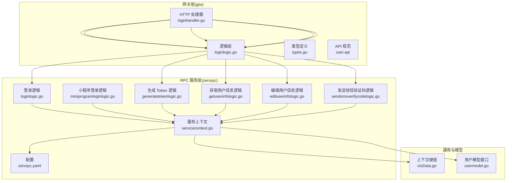
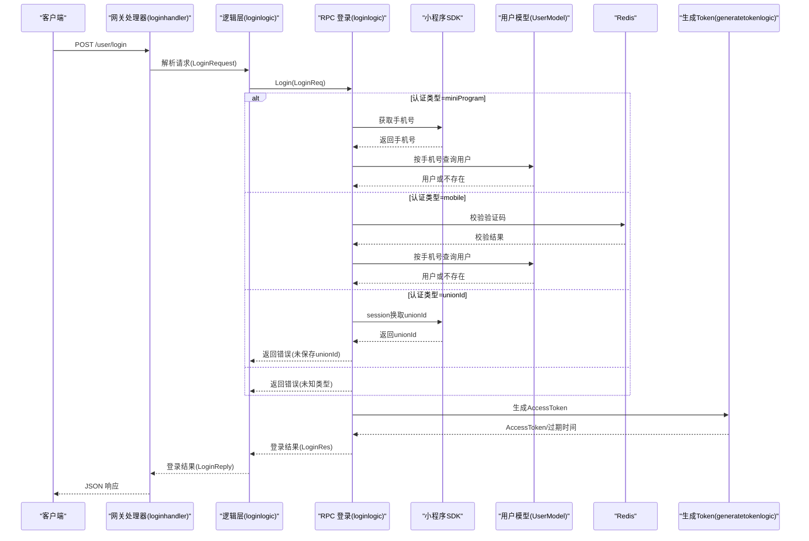
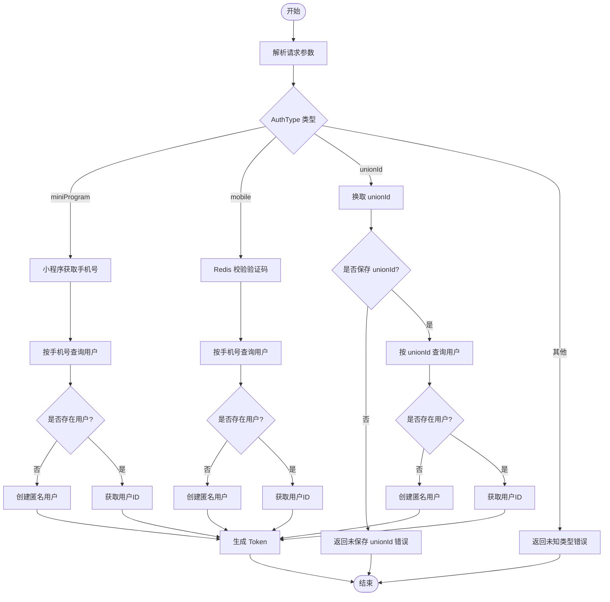
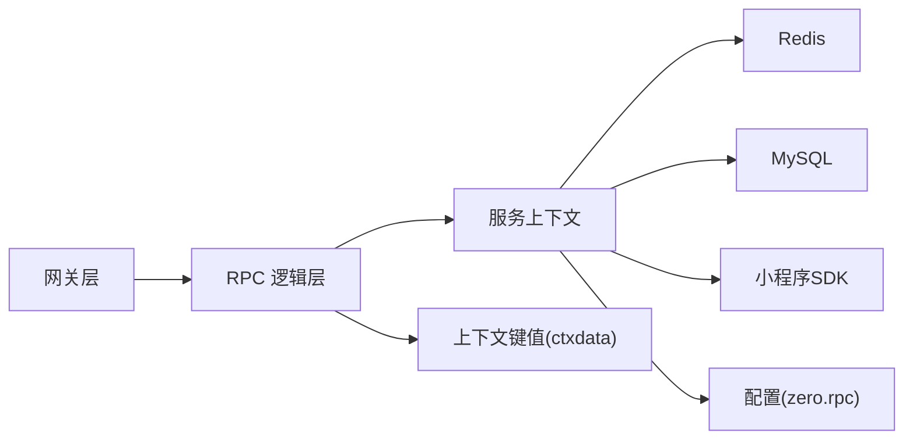

# 用户管理模块

<cite>
**本文引用的文件**
- [gtw/doc/user.api](file://gtw/doc/user.api)
- [gtw/internal/handler/user/loginhandler.go](file://gtw/internal/handler/user/loginhandler.go)
- [gtw/internal/handler/user/miniprogramloginhandler.go](file://gtw/internal/handler/user/miniprogramloginhandler.go)
- [gtw/internal/logic/user/loginlogic.go](file://gtw/internal/logic/user/loginlogic.go)
- [gtw/internal/types/types.go](file://gtw/internal/types/types.go)
- [zerorpc/internal/logic/loginlogic.go](file://zerorpc/internal/logic/loginlogic.go)
- [zerorpc/internal/logic/miniprogramloginlogic.go](file://zerorpc/internal/logic/miniprogramloginlogic.go)
- [zerorpc/internal/logic/generatetokenlogic.go](file://zerorpc/internal/logic/generatetokenlogic.go)
- [zerorpc/internal/logic/getuserinfologic.go](file://zerorpc/internal/logic/getuserinfologic.go)
- [zerorpc/internal/logic/edituserinfologic.go](file://zerorpc/internal/logic/edituserinfologic.go)
- [zerorpc/internal/logic/sendsmsverifycodelogic.go](file://zerorpc/internal/logic/sendsmsverifycodelogic.go)
- [zerorpc/internal/svc/servicecontext.go](file://zerorpc/internal/svc/servicecontext.go)
- [zerorpc/etc/zerorpc.yaml](file://zerorpc/etc/zerorpc.yaml)
- [common/ctxdata/ctxData.go](file://common/ctxdata/ctxData.go)
- [model/usermodel.go](file://model/usermodel.go)
</cite>

## 目录
1. [简介](#简介)
2. [项目结构](#项目结构)
3. [核心组件](#核心组件)
4. [架构总览](#架构总览)
5. [详细组件分析](#详细组件分析)
6. [依赖关系分析](#依赖关系分析)
7. [性能考量](#性能考量)
8. [故障排查指南](#故障排查指南)
9. [结论](#结论)
10. [附录](#附录)

## 简介
本技术文档聚焦于用户管理模块，覆盖以下主题：
- 用户认证登录流程：传统手机号验证码登录与小程序登录的实现差异
- 用户信息获取、编辑与短信验证码发送的接口设计
- JWT 令牌生成与验证机制：token 的生成、存储、刷新与过期处理
- 用户会话与状态保持策略
- 完整的 API 接口文档：请求参数、响应格式与错误码说明
- 实际调用示例与集成指南

## 项目结构
用户管理模块由“网关层”和“RPC 服务层”组成，前者负责对外暴露 REST 接口并转发到后端 RPC；后者负责具体业务逻辑、数据访问与第三方服务交互。

图表来源
- [gtw/internal/handler/user/loginhandler.go:1-30](file://gtw/internal/handler/user/loginhandler.go#L1-L30)
- [gtw/internal/logic/user/loginlogic.go:1-42](file://gtw/internal/logic/user/loginlogic.go#L1-L42)
- [zerorpc/internal/logic/loginlogic.go:1-110](file://zerorpc/internal/logic/loginlogic.go#L1-L110)
- [zerorpc/internal/logic/generatetokenlogic.go:1-53](file://zerorpc/internal/logic/generatetokenlogic.go#L1-L53)
- [zerorpc/internal/logic/miniprogramloginlogic.go:1-43](file://zerorpc/internal/logic/miniprogramloginlogic.go#L1-L43)
- [zerorpc/internal/logic/getuserinfologic.go:1-42](file://zerorpc/internal/logic/getuserinfologic.go#L1-L42)
- [zerorpc/internal/logic/edituserinfologic.go:1-49](file://zerorpc/internal/logic/edituserinfologic.go#L1-L49)
- [zerorpc/internal/logic/sendsmsverifycodelogic.go:1-43](file://zerorpc/internal/logic/sendsmsverifycodelogic.go#L1-L43)
- [zerorpc/internal/svc/servicecontext.go:1-102](file://zerorpc/internal/svc/servicecontext.go#L1-L102)
- [zerorpc/etc/zerorpc.yaml:1-39](file://zerorpc/etc/zerorpc.yaml#L1-L39)
- [common/ctxdata/ctxData.go:1-76](file://common/ctxdata/ctxData.go#L1-L76)
- [model/usermodel.go:1-32](file://model/usermodel.go#L1-L32)

章节来源
- [gtw/doc/user.api:1-47](file://gtw/doc/user.api#L1-L47)
- [gtw/internal/handler/user/loginhandler.go:1-30](file://gtw/internal/handler/user/loginhandler.go#L1-L30)
- [zerorpc/etc/zerorpc.yaml:1-39](file://zerorpc/etc/zerorpc.yaml#L1-L39)

## 核心组件
- 网关层 HTTP 处理器：接收外部请求，解析参数，调用逻辑层，并返回统一格式响应。
- 逻辑层：封装业务流程，协调 RPC 服务层各逻辑组件。
- RPC 服务层逻辑：实现登录、小程序登录、生成 Token、获取/编辑用户信息、发送短信验证码等核心能力。
- 服务上下文：集中管理 Redis、数据库连接、小程序 SDK、支付 SDK、异步任务客户端等依赖。
- 配置：JWT 密钥与过期时长、Redis、数据库、小程序 AppId/Secret 等。
- 上下文键值：在 gRPC 元数据中传递用户标识、授权头等。
- 用户模型接口：抽象数据库访问，支持事务与会话。

章节来源
- [zerorpc/internal/svc/servicecontext.go:19-33](file://zerorpc/internal/svc/servicecontext.go#L19-L33)
- [zerorpc/etc/zerorpc.yaml:33-39](file://zerorpc/etc/zerorpc.yaml#L33-L39)
- [common/ctxdata/ctxData.go:9-24](file://common/ctxdata/ctxData.go#L9-L24)
- [model/usermodel.go:7-18](file://model/usermodel.go#L7-L18)

## 架构总览
用户管理模块采用“网关 + RPC 服务”的分层架构。网关负责 REST 接口与参数校验，RPC 服务负责业务编排、第三方对接与数据持久化。

图表来源
- [gtw/internal/handler/user/loginhandler.go:14-29](file://gtw/internal/handler/user/loginhandler.go#L14-L29)
- [gtw/internal/logic/user/loginlogic.go:28-41](file://gtw/internal/logic/user/loginlogic.go#L28-L41)
- [zerorpc/internal/logic/loginlogic.go:30-109](file://zerorpc/internal/logic/loginlogic.go#L30-L109)
- [zerorpc/internal/logic/generatetokenlogic.go:29-42](file://zerorpc/internal/logic/generatetokenlogic.go#L29-L42)

## 详细组件分析

### 登录流程（传统手机号验证码登录 vs 小程序登录）
- 传统手机号验证码登录
  - 参数：AuthType=mobile、AuthKey=手机号、Password=验证码
  - 校验：从 Redis 中读取并比对验证码，成功后删除该键
  - 用户查找：按手机号查询用户，不存在则自动注册匿名用户
  - 生成 Token：调用生成 Token 逻辑，返回 AccessToken、AccessExpire、RefreshAfter
- 小程序登录
  - 参数：AuthType=miniProgram、AuthKey=小程序 Code
  - 校验：通过小程序 SDK 获取用户手机号，按手机号查询用户
  - 自动注册：若用户不存在，创建匿名用户
  - 生成 Token：同上
- unionId 登录
  - 当前实现：通过 Code 换取 session，读取 unionId，但未保存 unionId，返回错误

图表来源
- [zerorpc/internal/logic/loginlogic.go:30-109](file://zerorpc/internal/logic/loginlogic.go#L30-L109)

章节来源
- [zerorpc/internal/logic/loginlogic.go:30-109](file://zerorpc/internal/logic/loginlogic.go#L30-L109)
- [zerorpc/internal/logic/miniprogramloginlogic.go:27-42](file://zerorpc/internal/logic/miniprogramloginlogic.go#L27-L42)
- [zerorpc/internal/logic/generatetokenlogic.go:29-42](file://zerorpc/internal/logic/generatetokenlogic.go#L29-L42)

### 小程序登录接口
- 功能：通过小程序 Code 获取 OpenId、UnionId、SessionKey
- 请求：MiniProgramLoginRequest{code}
- 响应：MiniProgramLoginReply{openId, unionId, sessionKey}
- 异常：当小程序返回错误码时，返回业务错误

章节来源
- [zerorpc/internal/logic/miniprogramloginlogic.go:27-42](file://zerorpc/internal/logic/miniprogramloginlogic.go#L27-L42)
- [gtw/doc/user.api:14-21](file://gtw/doc/user.api#L14-L21)

### 用户信息获取与编辑
- 获取当前用户
  - 请求：GetCurrentUserRequest{}
  - 响应：GetCurrentUserReply{User{id, mobile, nickname, sex, avatar}}
  - 实现：根据用户 ID 查询用户记录
- 编辑当前用户
  - 请求：EditCurrentUserRequest{nickname, sex, avatar}
  - 响应：空对象
  - 实现：按 ID 查询用户，合并更新字段并写回

章节来源
- [zerorpc/internal/logic/getuserinfologic.go:26-41](file://zerorpc/internal/logic/getuserinfologic.go#L26-L41)
- [zerorpc/internal/logic/edituserinfologic.go:27-48](file://zerorpc/internal/logic/edituserinfologic.go#L27-L48)
- [gtw/doc/user.api:28-44](file://gtw/doc/user.api#L28-L44)

### 短信验证码发送
- 功能：向指定手机号发送验证码（开发环境固定验证码）
- 请求：SendSMSVerifyCodeRequest{mobile}
- 响应：SendSMSVerifyCodeReply{code}
- 存储：以“应用名:手机号:smsCode”为键，NX+EX 存储，有效期 180 秒
- 开发模式：非生产环境返回固定验证码便于调试

章节来源
- [zerorpc/internal/logic/sendsmsverifycodelogic.go:28-42](file://zerorpc/internal/logic/sendsmsverifycodelogic.go#L28-L42)
- [zerorpc/etc/zerorpc.yaml:8](file://zerorpc/etc/zerorpc.yaml#L8)

### JWT 令牌生成与验证机制
- 生成
  - 使用 HS256 签名算法，载荷包含 iat、exp 与用户 ID
  - 过期时间来自配置 JwtAuth.AccessExpire
  - RefreshAfter 为过半时间点，用于提示前端刷新
- 验证
  - 在网关或 RPC 层解析 Authorization 头，使用 AccessSecret 验证签名与过期
  - 从载荷提取用户 ID 并注入到上下文键值中，供后续逻辑使用
- 存储与刷新
  - 前端通常存储 AccessToken 于本地存储或内存
  - 当接近 RefreshAfter 时，建议调用刷新接口或重新登录
- 过期处理
  - 过期后需重新登录获取新 Token
  - 建议在网关层拦截 401 并引导重定向至登录页

章节来源
- [zerorpc/internal/logic/generatetokenlogic.go:29-52](file://zerorpc/internal/logic/generatetokenlogic.go#L29-L52)
- [zerorpc/etc/zerorpc.yaml:33-35](file://zerorpc/etc/zerorpc.yaml#L33-L35)
- [common/ctxdata/ctxData.go:9-24](file://common/ctxdata/ctxData.go#L9-L24)

### 用户会话与状态保持
- 会话保持
  - 基于 JWT 的无状态会话：服务端不维护会话状态
  - 前端在每次请求携带 Authorization 头
- 状态保持策略
  - 前端缓存 AccessToken 与过期时间
  - 在 AccessExpire 前进行刷新或重新登录
  - 退出登录时清除本地缓存与 Cookie/Storage

章节来源
- [zerorpc/internal/logic/generatetokenlogic.go:37-41](file://zerorpc/internal/logic/generatetokenlogic.go#L37-L41)
- [common/ctxdata/ctxData.go:56-61](file://common/ctxdata/ctxData.go#L56-L61)

## 依赖关系分析
- 组件耦合
  - 网关层仅依赖逻辑层与类型定义，低耦合
  - RPC 服务层逻辑依赖服务上下文，集中管理外部依赖
- 外部依赖
  - Redis：验证码存储
  - 数据库：用户信息持久化
  - 小程序 SDK：手机号与 session 获取
  - 支付 SDK：预留，当前未在用户模块使用
- 配置项
  - JwtAuth.AccessSecret、JwtAuth.AccessExpire 控制 Token 行为
  - Redis、DB、MiniProgram 配置决定运行环境

图表来源
- [zerorpc/internal/svc/servicecontext.go:19-33](file://zerorpc/internal/svc/servicecontext.go#L19-L33)
- [zerorpc/etc/zerorpc.yaml:13-39](file://zerorpc/etc/zerorpc.yaml#L13-L39)
- [common/ctxdata/ctxData.go:9-24](file://common/ctxdata/ctxData.go#L9-L24)

章节来源
- [zerorpc/internal/svc/servicecontext.go:35-101](file://zerorpc/internal/svc/servicecontext.go#L35-L101)
- [zerorpc/etc/zerorpc.yaml:13-39](file://zerorpc/etc/zerorpc.yaml#L13-L39)

## 性能考量
- Redis 命中率
  - 验证码键使用 NX+EX，避免并发写入冲突，建议合理设置过期时间
- 数据库查询
  - 按手机号查询用户应建立索引，降低 IO 延迟
- Token 生成
  - HS256 为对称加密，CPU 开销低，适合高并发场景
- 网关与 RPC 间调用
  - 合理设置超时与重试策略，避免雪崩效应

## 故障排查指南
- 登录失败
  - 小程序手机号获取失败：检查小程序 AppId/Secret 与网络连通性
  - 手机号验证码错误：确认 Redis 中验证码是否正确、是否过期
  - 未知认证类型：核对 AuthType 值
- 用户不存在
  - 自动注册逻辑：确认手机号是否正确传入
- Token 无效
  - 检查 AccessSecret 是否一致、过期时间是否正确
  - 确认 Authorization 头格式与传输是否被拦截
- 短信验证码异常
  - 非生产环境固定验证码：确认配置 Mode
  - Redis 写入失败：检查 Redis 连接与权限

章节来源
- [zerorpc/internal/logic/loginlogic.go:30-109](file://zerorpc/internal/logic/loginlogic.go#L30-L109)
- [zerorpc/internal/logic/sendsmsverifycodelogic.go:28-42](file://zerorpc/internal/logic/sendsmsverifycodelogic.go#L28-L42)
- [zerorpc/etc/zerorpc.yaml:8](file://zerorpc/etc/zerorpc.yaml#L8)

## 结论
用户管理模块通过清晰的分层设计与标准化的接口规范，实现了传统与小程序双登录方式、用户信息管理与短信验证码发送等功能。结合 JWT 的无状态会话机制，可满足高并发与多端接入的需求。建议在生产环境中强化安全配置与监控告警，确保系统稳定与数据安全。

## 附录

### API 接口文档

- 登录
  - 方法与路径：POST /user/login
  - 请求体：LoginRequest
    - authType: miniProgram | mobile
    - authKey: 小程序 Code 或 手机号
    - password: 验证码（mobile 模式必填）
  - 响应体：LoginReply
    - accessToken: 访问令牌
    - accessExpire: 过期时间戳
    - refreshAfter: 刷新提醒时间戳
  - 示例
    - 小程序一键登录：authType=miniProgram，authKey=小程序 Code
    - 手机号验证码登录：authType=mobile，authKey=手机号，password=验证码
  - 错误码
    - 9999：业务错误（如登录失败、未知类型、未保存 unionId）

- 小程序登录
  - 方法与路径：POST /user/miniprogram/login
  - 请求体：MiniProgramLoginRequest{code}
  - 响应体：MiniProgramLoginReply{openId, unionId, sessionKey}
  - 错误码：9999（小程序返回错误码）

- 发送短信验证码
  - 方法与路径：POST /user/sms/send
  - 请求体：SendSMSVerifyCodeRequest{mobile}
  - 响应体：SendSMSVerifyCodeReply{code}
  - 说明：开发模式固定验证码，生产模式随机生成
  - 错误码：9999（保存失败）

- 获取当前用户
  - 方法与路径：GET /user/current
  - 请求体：空
  - 响应体：GetCurrentUserReply{user: User}
  - User 字段：id, mobile, nickname, sex, avatar

- 编辑当前用户
  - 方法与路径：PUT /user/current
  - 请求体：EditCurrentUserRequest{nickname, sex, avatar}
  - 响应体：空

章节来源
- [gtw/doc/user.api:1-47](file://gtw/doc/user.api#L1-L47)
- [gtw/internal/types/types.go:77-97](file://gtw/internal/types/types.go#L77-L97)
- [zerorpc/internal/logic/loginlogic.go:30-109](file://zerorpc/internal/logic/loginlogic.go#L30-L109)
- [zerorpc/internal/logic/miniprogramloginlogic.go:27-42](file://zerorpc/internal/logic/miniprogramloginlogic.go#L27-L42)
- [zerorpc/internal/logic/sendsmsverifycodelogic.go:28-42](file://zerorpc/internal/logic/sendsmsverifycodelogic.go#L28-L42)
- [zerorpc/internal/logic/getuserinfologic.go:26-41](file://zerorpc/internal/logic/getuserinfologic.go#L26-L41)
- [zerorpc/internal/logic/edituserinfologic.go:27-48](file://zerorpc/internal/logic/edituserinfologic.go#L27-L48)

### 集成指南
- 前端集成要点
  - 登录成功后缓存 accessToken、accessExpire、refreshAfter
  - 请求头携带 Authorization: Bearer <token>
  - 接近 refreshAfter 时触发刷新或重新登录
- 后端集成要点
  - 在网关层解析 Authorization 头，验证 JWT 并注入用户上下文
  - 对敏感操作增加鉴权与权限校验
  - 使用统一错误码与日志埋点，便于问题定位