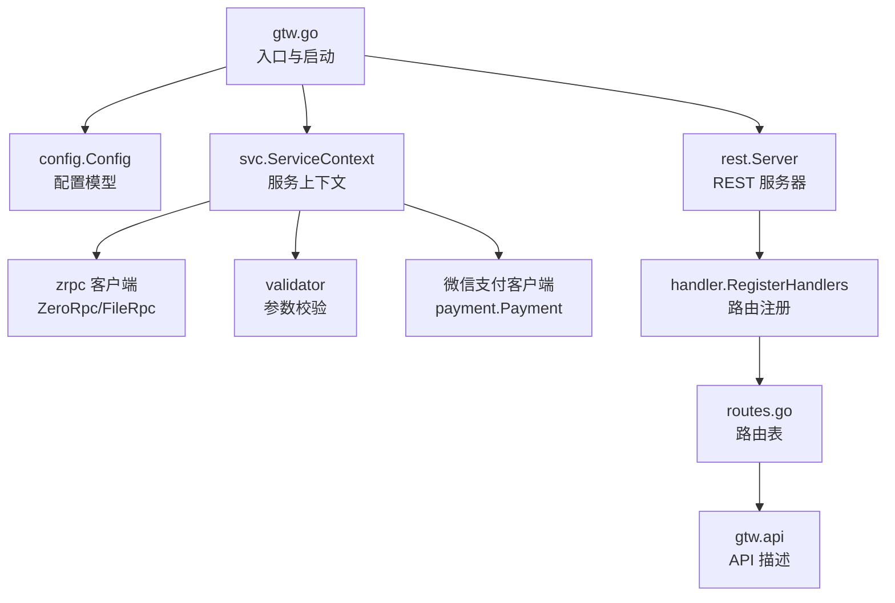
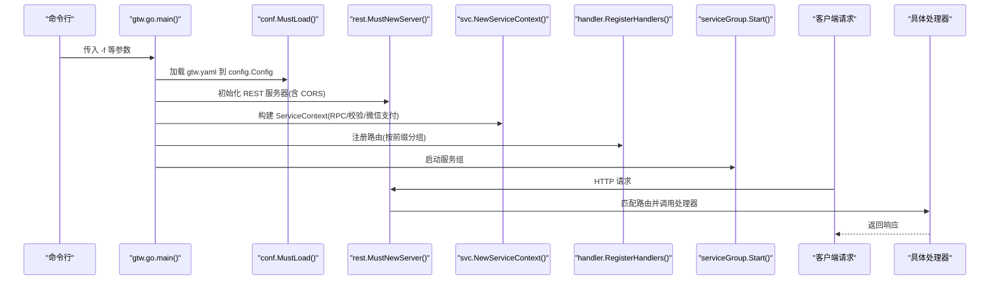
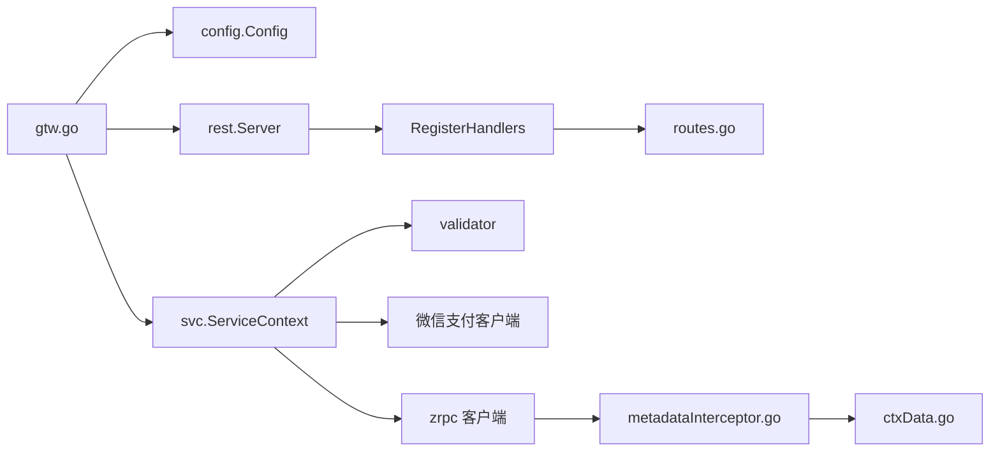

# 网关架构设计

<cite>
**本文引用的文件**
- [gtw.go](file://gtw/gtw.go)
- [gtw.yaml](file://gtw/etc/gtw.yaml)
- [config.go](file://gtw/internal/config/config.go)
- [servicecontext.go](file://gtw/internal/svc/servicecontext.go)
- [routes.go](file://gtw/internal/handler/routes.go)
- [metadataInterceptor.go](file://common/Interceptor/rpcclient/metadataInterceptor.go)
- [ctxData.go](file://common/ctxdata/ctxData.go)
- [tool.go](file://common/tool/tool.go)
- [gtw.api](file://gtw/gtw.api)
- [apiclient_cert.pem](file://gtw/etc/wechat/apiclient_cert.pem)
- [apiclient_key.pem](file://gtw/etc/wechat/apiclient_key.pem)
</cite>

## 目录
1. [简介](#简介)
2. [项目结构](#项目结构)
3. [核心组件](#核心组件)
4. [架构总览](#架构总览)
5. [详细组件分析](#详细组件分析)
6. [依赖分析](#依赖分析)
7. [性能考虑](#性能考虑)
8. [故障排查指南](#故障排查指南)
9. [结论](#结论)
10. [附录](#附录)

## 简介
本文件面向 BFF 网关（Gateway，简称 gtw）的架构设计与实现，围绕 go-zero 框架在网关中的应用展开，系统性阐述 REST 服务器初始化、配置加载机制、启动流程、服务注册、中间件链与路由管理，并对 CORS 跨域处理、动态 Origin 设置、安全头部配置进行深入说明。同时给出配置文件结构与关键参数说明、Swagger 路由暴露机制、启动流程的代码示例路径与最佳实践，帮助开发者快速理解与部署网关。

## 项目结构
- 网关入口与配置
  - 启动入口：gtw/gtw.go
  - 默认配置：gtw/etc/gtw.yaml
  - 配置模型：gtw/internal/config/config.go
- 服务上下文与依赖注入
  - 上下文构建：gtw/internal/svc/servicecontext.go
  - RPC 客户端拦截器：common/Interceptor/rpcclient/metadataInterceptor.go
  - 请求上下文键值工具：common/ctxdata/ctxData.go
- 路由与处理器注册
  - 路由注册：gtw/internal/handler/routes.go
  - API 描述：gtw/gtw.api
- 工具与辅助能力
  - JWT 解析与通用工具：common/tool/tool.go
- 微信支付证书
  - 证书与私钥：gtw/etc/wechat/apiclient_cert.pem、gtw/etc/wechat/apiclient_key.pem

图表来源
- [gtw.go:25-95](file://gtw/gtw.go#L25-L95)
- [config.go:8-20](file://gtw/internal/config/config.go#L8-L20)
- [servicecontext.go:23-65](file://gtw/internal/svc/servicecontext.go#L23-L65)
- [routes.go:20-160](file://gtw/internal/handler/routes.go#L20-L160)
- [gtw.api:16-123](file://gtw/gtw.api#L16-L123)

章节来源
- [gtw.go:25-95](file://gtw/gtw.go#L25-L95)
- [gtw.yaml:1-61](file://gtw/etc/gtw.yaml#L1-L61)
- [config.go:8-20](file://gtw/internal/config/config.go#L8-L20)

## 核心组件
- REST 服务器初始化与启动
  - 使用 go-zero 的 rest.MustNewServer 创建 REST 服务器，启用自定义 CORS 中间件与全局日志字段。
  - 通过 service.NewServiceGroup 管理生命周期，统一 Add/Start/Stop。
- 配置加载与模型
  - 通过 conf.MustLoad 加载 YAML 配置到 config.Config，包含 Host、Port、SwaggerPath、JwtAuth、RPC 客户端配置等。
- 服务上下文与依赖注入
  - ServiceContext 负责构建 RPC 客户端、参数校验器、微信支付客户端，并注入到各处理器。
  - gRPC 客户端统一注入元数据拦截器，自动透传用户与链路追踪信息。
- 路由注册与中间件
  - RegisterHandlers 统一注册路由，按前缀分组；部分路由启用 JWT 认证。
  - CORS 采用动态 Origin 设置，支持 Credentials、Expose-Headers、Vary 等安全头部。
- Swagger 路由
  - 当配置中存在 SwaggerPath 时，动态注册 /swagger/:fileName 路由，提供静态 JSON 文件访问。

章节来源
- [gtw.go:51-95](file://gtw/gtw.go#L51-L95)
- [config.go:8-20](file://gtw/internal/config/config.go#L8-L20)
- [servicecontext.go:23-65](file://gtw/internal/svc/servicecontext.go#L23-L65)
- [routes.go:20-160](file://gtw/internal/handler/routes.go#L20-L160)

## 架构总览
下图展示从进程启动到请求处理的关键交互：

图表来源
- [gtw.go:25-95](file://gtw/gtw.go#L25-L95)
- [routes.go:20-160](file://gtw/internal/handler/routes.go#L20-L160)

## 详细组件分析

### REST 服务器初始化与 CORS
- 自定义 CORS 实现
  - 通过 rest.WithCustomCors 动态设置 Access-Control-Allow-Origin，避免硬编码 Origin。
  - 设置 Vary: Origin 防止缓存污染；开启 Credentials 支持 Cookie/Token；声明允许的方法与请求头；暴露前端可读取的响应头。
- Swagger 路由
  - 当配置中存在 SwaggerPath 时，注册 /swagger/:fileName 路由，解析路径参数 fileName 并拼接物理路径返回 JSON 文件。
- 日志增强
  - 通过 logx.AddGlobalFields 在日志中打上 app 名称标签，便于多实例聚合分析。

章节来源
- [gtw.go:51-95](file://gtw/gtw.go#L51-L95)

### 配置加载机制与参数说明
- 配置文件位置与加载
  - 默认使用 etc/gtw.yaml，可通过 -f 指定。
  - 加载后映射到 config.Config 结构体，包含：
    - 基础 REST 配置：Host、Port、Timeout、MaxBytes、Log 等
    - JWT 认证：JwtAuth.AccessSecret
    - RPC 客户端配置：ZeroRpcConf、FileRpcConf、AdminRpcConf
    - 文件与下载：NfsRootPath、DownloadUrl
    - Swagger：SwaggerPath
- 关键参数说明
  - Host/Port：监听地址与端口
  - SwaggerPath：Swagger JSON 文件所在目录，用于 /swagger/:fileName 路由
  - JwtAuth.AccessSecret：JWT 密钥，用于受保护路由的鉴权
  - ZeroRpcConf/FileRpcConf/AdminRpcConf：下游 RPC 服务地址、超时与非阻塞策略
  - NfsRootPath/DownloadUrl：文件系统根路径与下载链接前缀

章节来源
- [gtw.yaml:1-61](file://gtw/etc/gtw.yaml#L1-L61)
- [config.go:8-20](file://gtw/internal/config/config.go#L8-L20)

### 服务注册与中间件链
- 服务上下文
  - ServiceContext 统一注入：
    - zrpc 客户端（ZeroRpc/FileRpc），并使用 UnaryMetadataInterceptor 透传用户与链路信息
    - 参数校验器 validator
    - 微信支付客户端 payment.Payment（包含证书、密钥、通知地址等）
- 中间件链
  - gRPC 客户端拦截器将上下文中的用户 ID、用户名、部门编码、授权信息、TraceId 写入 gRPC Metadata，确保下游服务可感知。
  - REST 层通过自定义 CORS 中间件实现跨域与安全头部。

章节来源
- [servicecontext.go:23-65](file://gtw/internal/svc/servicecontext.go#L23-L65)
- [metadataInterceptor.go:11-32](file://common/Interceptor/rpcclient/metadataInterceptor.go#L11-L32)
- [ctxData.go:42-75](file://common/ctxdata/ctxData.go#L42-L75)

### 路由管理与 API 描述
- 路由注册
  - RegisterHandlers 按前缀分组注册路由，如：
    - /app/common/v1：通用能力（区域列表、文件上传）
    - /file/v1：文件服务（上传、签名、状态查询）
    - /gtw/v1：网关服务（ping、转发、下载）
    - /gtw/v1/pay：支付回调
    - /app/user/v1：用户服务（登录、短信、JWT 受保护接口）
- API 描述
  - gtw.api 通过 @server 指定前缀与组别，明确各服务的路由、请求/响应类型与认证策略（如 jwt: JwtAuth）。

章节来源
- [routes.go:20-160](file://gtw/internal/handler/routes.go#L20-L160)
- [gtw.api:16-123](file://gtw/gtw.api#L16-L123)

### CORS 跨域处理机制
- 动态 Origin 设置
  - 从请求头 Origin 动态读取并设置 Access-Control-Allow-Origin，避免固定死域名带来的维护成本。
- 安全头部配置
  - Access-Control-Allow-Credentials：true，允许携带 Cookie/Token
  - Access-Control-Allow-Methods：GET, POST, PUT, DELETE, OPTIONS, PATCH
  - Access-Control-Allow-Headers：Content-Type, AccessToken, X-CSRF-Token, Authorization, Token, X-Token, X-User-Id
  - Access-Control-Expose-Headers：Content-Length, Content-Type
  - Vary: Origin：防止缓存污染
- 与 Swagger 的结合
  - SwaggerPath 存在时，/swagger/:fileName 路由同样遵循 CORS 规则，确保前端跨域访问。

章节来源
- [gtw.go:51-63](file://gtw/gtw.go#L51-L63)

### 启动流程与最佳实践
- 启动流程（代码示例路径）
  - 配置加载：参见 [gtw.go:29-30](file://gtw/gtw.go#L29-L30)
  - REST 服务器初始化与 CORS：参见 [gtw.go:51-63](file://gtw/gtw.go#L51-L63)
  - 服务上下文构建：参见 [gtw.go:64-64](file://gtw/gtw.go#L64-L64)
  - 路由注册：参见 [gtw.go:65-65](file://gtw/gtw.go#L65-L65)
  - Swagger 路由注册：参见 [gtw.go:70-90](file://gtw/gtw.go#L70-L90)
  - 启动服务组：参见 [gtw.go:66-68](file://gtw/gtw.go#L66-L68)
- 最佳实践
  - CORS：始终使用动态 Origin，避免生产环境固定死 Allow-Origin
  - JWT：在需要鉴权的路由组上启用 rest.WithJwt，密钥在 JwtAuth.AccessSecret 中配置
  - 超时与限流：根据业务场景调整 rest.WithTimeout 与上游 RPC 超时
  - 日志：通过 logx.AddGlobalFields 统一打点，便于链路追踪与问题定位
  - 证书：微信支付证书与私钥需放置在配置路径，确保支付回调可用

章节来源
- [gtw.go:25-95](file://gtw/gtw.go#L25-L95)

## 依赖分析
- 组件耦合与职责
  - gtw.go 作为入口，负责配置加载、REST 服务器初始化、上下文构建、路由注册与服务组启动
  - routes.go 仅负责路由注册，不直接依赖具体业务逻辑，保持高内聚低耦合
  - servicecontext.go 聚合 RPC 客户端、校验器与第三方 SDK，形成统一依赖注入入口
  - metadataInterceptor.go 与 ctxData.go 提供横切能力，贯穿 gRPC 请求链路
- 外部依赖
  - go-zero：REST 服务器、配置加载、服务组管理
  - grpc：客户端拦截器与 Metadata 传递
  - validator：参数校验
  - 微信支付 SDK：支付回调与证书校验

图表来源
- [gtw.go:25-95](file://gtw/gtw.go#L25-L95)
- [routes.go:20-160](file://gtw/internal/handler/routes.go#L20-L160)
- [servicecontext.go:23-65](file://gtw/internal/svc/servicecontext.go#L23-L65)
- [metadataInterceptor.go:11-32](file://common/Interceptor/rpcclient/metadataInterceptor.go#L11-L32)
- [ctxData.go:42-75](file://common/ctxdata/ctxData.go#L42-L75)

## 性能考虑
- 超时与并发
  - REST 层与 RPC 层分别设置合理超时，避免请求堆积
  - 对于大文件上传等长耗时操作，建议在路由层单独设置较长超时（如 file/v1 的 7200s）
- 资源与日志
  - 控制日志级别与路径，避免磁盘 IO 抖动
  - 合理设置 MaxBytes，避免内存占用过高
- 中间件开销
  - CORS 与 JWT 验证为常见开销点，建议在网关层统一处理，减少下游重复计算

## 故障排查指南
- CORS 相关
  - 现象：浏览器报跨域错误
  - 排查：确认 SwaggerPath 是否正确；检查动态 Origin 是否被正确设置；核对 Allow-Credentials 与 Expose-Headers
- JWT 鉴权失败
  - 现象：受保护路由返回未授权
  - 排查：确认 JwtAuth.AccessSecret 与客户端 Token 使用的密钥一致；检查路由是否启用 rest.WithJwt
- RPC 调用异常
  - 现象：下游服务不可达或超时
  - 排查：核对 ZeroRpcConf/FileRpcConf 的 Endpoints 与超时；检查 metadataInterceptor 是否正确透传用户信息
- 日志与可观测性
  - 建议：通过 logx.AddGlobalFields 统一 app 标签；结合链路追踪与日志检索定位问题

章节来源
- [gtw.go:51-95](file://gtw/gtw.go#L51-L95)
- [servicecontext.go:23-65](file://gtw/internal/svc/servicecontext.go#L23-L65)

## 结论
本网关基于 go-zero 构建，具备清晰的配置驱动、统一的服务上下文与路由注册机制。通过动态 CORS、JWT 鉴权与 gRPC 元数据拦截器，实现了跨域安全、认证与链路透传。配合 Swagger 路由与日志增强，满足生产环境的可观测性与可维护性需求。建议在实际部署中严格遵循 CORS 与 JWT 最佳实践，并针对不同路由组设置合理的超时与限流策略。

## 附录
- 配置文件关键项速览
  - Name/Host/Port/Timeout/MaxBytes/Log：基础运行参数
  - JwtAuth.AccessSecret：JWT 密钥
  - ZeroRpcConf/FileRpcConf/AdminRpcConf：RPC 客户端配置
  - NfsRootPath/DownloadUrl/SwaggerPath：文件与 Swagger 路由

章节来源
- [gtw.yaml:1-61](file://gtw/etc/gtw.yaml#L1-L61)
- [config.go:8-20](file://gtw/internal/config/config.go#L8-L20)