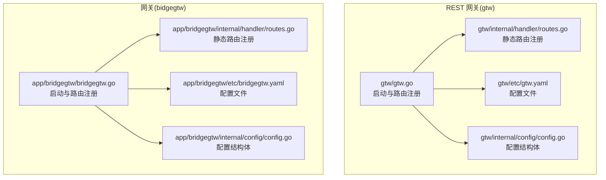
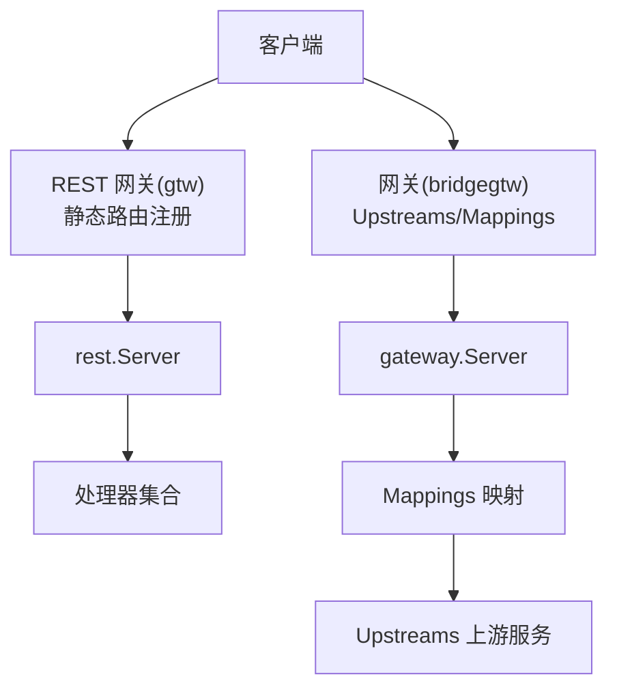
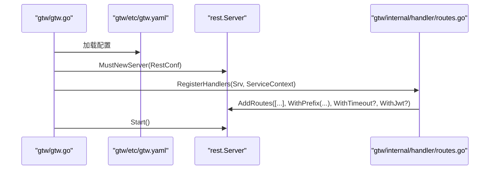
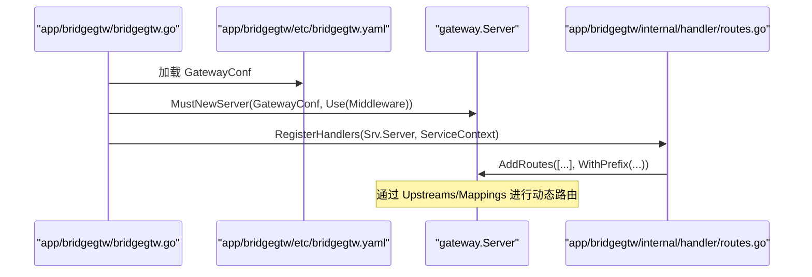
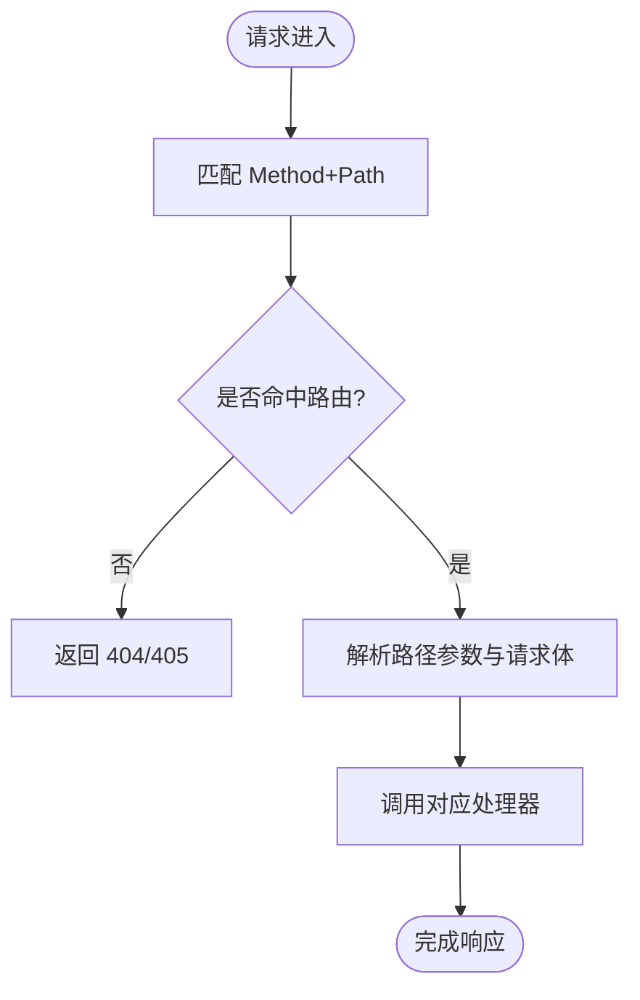
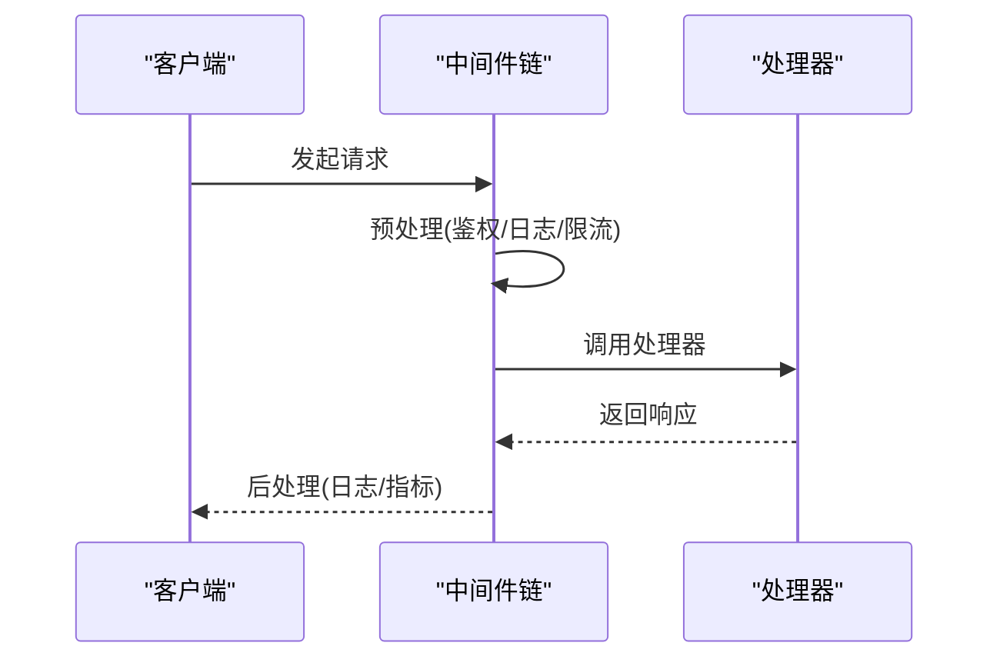
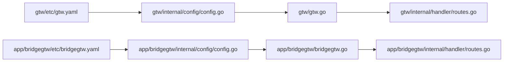

# 路由系统

<cite>
**本文引用的文件**
- [gtw.go](file://gtw/gtw.go)
- [routes.go](file://gtw/internal/handler/routes.go)
- [config.go](file://gtw/internal/config/config.go)
- [gtw.yaml](file://gtw/etc/gtw.yaml)
- [bridgegtw.go](file://app/bridgegtw/bridgegtw.go)
- [routes.go](file://app/bridgegtw/internal/handler/routes.go)
- [config.go](file://app/bridgegtw/internal/config/config.go)
- [bridgegtw.yaml](file://app/bridgegtw/etc/bridgegtw.yaml)
- [ctxData.go](file://common/ctxdata/ctxData.go)
- [rest-api-patterns.md](file://.trae/skills/zero-skills/references/rest-api-patterns.md)
</cite>

## 目录
1. [简介](#简介)
2. [项目结构](#项目结构)
3. [核心组件](#核心组件)
4. [架构总览](#架构总览)
5. [详细组件分析](#详细组件分析)
6. [依赖关系分析](#依赖关系分析)
7. [性能考虑](#性能考虑)
8. [故障排查指南](#故障排查指南)
9. [结论](#结论)
10. [附录](#附录)

## 简介
本技术文档围绕 BFF 网关路由系统展开，重点解释路由注册机制与路由表管理，涵盖静态路由与动态路由的配置方式；详解路由匹配规则、URL 模式定义与参数提取机制；阐述路由中间件的执行顺序与拦截逻辑（请求预处理与响应后处理）；并给出路由生命周期管理与性能优化策略。文末提供可直接参考的配置示例与最佳实践，帮助开发者设计高效稳定的路由系统。

## 项目结构
本仓库包含两类网关形态：
- 基于 HTTP 的 REST 网关：以 gtw 为代表，通过 rest.Server 注册静态路由，并支持 JWT、CORS、超时等通用能力。
- 基于网关（Gateway）的多上游转发网关：以 bridgegtw 为代表，通过 Upstreams/Mappings 将 HTTP 请求映射到 gRPC 后端服务，形成“动态路由”风格的统一入口。

图表来源
- [gtw.go:1-96](file://gtw/gtw.go#L1-L96)
- [routes.go:1-161](file://gtw/internal/handler/routes.go#L1-L161)
- [config.go:1-21](file://gtw/internal/config/config.go#L1-L21)
- [bridgegtw.go:1-43](file://app/bridgegtw/bridgegtw.go#L1-L43)
- [routes.go:1-28](file://app/bridgegtw/internal/handler/routes.go#L1-L28)
- [config.go:1-8](file://app/bridgegtw/internal/config/config.go#L1-L8)

章节来源
- [gtw.go:1-96](file://gtw/gtw.go#L1-L96)
- [routes.go:1-161](file://gtw/internal/handler/routes.go#L1-L161)
- [config.go:1-21](file://gtw/internal/config/config.go#L1-L21)
- [bridgegtw.go:1-43](file://app/bridgegtw/bridgegtw.go#L1-L43)
- [routes.go:1-28](file://app/bridgegtw/internal/handler/routes.go#L1-L28)
- [config.go:1-8](file://app/bridgegtw/internal/config/config.go#L1-L8)

## 核心组件
- 路由注册器（RegisterHandlers）：在各网关模块中集中注册静态路由，按前缀分组，统一挂载到 rest.Server 或 gateway.Server。
- 配置结构体（Config）：承载网关运行所需的基础配置（如 Host/Port/Timeout）、鉴权（JWT）、上游 RPC 客户端配置等。
- 中间件与 CORS：REST 网关通过 WithCustomCors 自定义跨域策略；网关模式下可通过 server.Use 注入中间件。
- 上游映射（Upstreams/Mappings）：网关模式根据配置将 HTTP 方法与路径映射到 gRPC 服务方法，实现“动态路由”。

章节来源
- [routes.go:20-161](file://gtw/internal/handler/routes.go#L20-L161)
- [config.go:8-21](file://gtw/internal/config/config.go#L8-L21)
- [bridgegtw.go:28-35](file://app/bridgegtw/bridgegtw.go#L28-L35)
- [bridgegtw.yaml:12-40](file://app/bridgegtw/etc/bridgegtw.yaml#L12-L40)

## 架构总览
REST 网关与网关模式的路由体系分别服务于不同场景：
- REST 网关：面向纯 HTTP 的业务接口，路由以静态注册为主，支持 JWT、CORS、超时等通用能力。
- 网关：面向多上游（gRPC/HTTP）聚合，通过 Upstreams/Mappings 实现“动态路由”，统一对外暴露 HTTP 接口。

图表来源
- [gtw.go:51-63](file://gtw/gtw.go#L51-L63)
- [routes.go:20-161](file://gtw/internal/handler/routes.go#L20-L161)
- [bridgegtw.go:28-35](file://app/bridgegtw/bridgegtw.go#L28-L35)
- [bridgegtw.yaml:12-40](file://app/bridgegtw/etc/bridgegtw.yaml#L12-L40)

## 详细组件分析

### REST 网关路由注册与静态路由
- 路由注册入口：在 gtw 的 main 函数中加载配置后，调用 RegisterHandlers 将路由注册到 rest.Server。
- 路由分组：通过 rest.WithPrefix 为不同业务模块设置前缀，便于统一管理与扩展。
- 路由项：每个路由包含 Method、Path、Handler，Handler 由对应业务模块的处理器函数提供。
- 超时控制：部分路由通过 rest.WithTimeout 设置独立超时，避免全局超时影响其他路由。
- JWT：针对需要鉴权的路由，通过 rest.WithJwt 绑定 AccessSecret，启用 JWT 校验。

图表来源
- [gtw.go:25-65](file://gtw/gtw.go#L25-L65)
- [routes.go:20-161](file://gtw/internal/handler/routes.go#L20-L161)
- [config.go:8-21](file://gtw/internal/config/config.go#L8-L21)

章节来源
- [gtw.go:25-65](file://gtw/gtw.go#L25-L65)
- [routes.go:20-161](file://gtw/internal/handler/routes.go#L20-L161)
- [config.go:8-21](file://gtw/internal/config/config.go#L8-L21)

### 网关模式路由注册与动态路由
- 网关启动：bridgegtw 在 main 中加载 GatewayConf，创建 gateway.Server，并注入自定义中间件。
- 静态路由：同样通过 RegisterHandlers 注册少量静态路由（如 ping），满足健康检查或简单接口。
- 动态路由：通过 Upstreams/Mappings 将 HTTP 方法与路径映射到 gRPC 服务方法，实现“动态路由”。
- 上游配置：支持多个上游，每个上游可配置 Endpoints、ProtoSets、NonBlock、Timeout 等。

图表来源
- [bridgegtw.go:19-39](file://app/bridgegtw/bridgegtw.go#L19-L39)
- [routes.go:15-27](file://app/bridgegtw/internal/handler/routes.go#L15-L27)
- [bridgegtw.yaml:12-40](file://app/bridgegtw/etc/bridgegtw.yaml#L12-L40)

章节来源
- [bridgegtw.go:19-39](file://app/bridgegtw/bridgegtw.go#L19-L39)
- [routes.go:15-27](file://app/bridgegtw/internal/handler/routes.go#L15-L27)
- [bridgegtw.yaml:12-40](file://app/bridgegtw/etc/bridgegtw.yaml#L12-L40)

### 路由匹配规则、URL 模式与参数提取
- 匹配规则：基于 Method+Path 的精确匹配；前缀通过 WithPrefix 统一分发。
- URL 模式：支持静态路径与带占位符的路径（例如 Swagger 文件名参数），通过 httpx.Parse 提取路径参数。
- 参数提取：在处理器内部使用 httpx.Parse 解析路径参数与请求体，确保类型安全与错误处理。

图表来源
- [gtw.go:70-90](file://gtw/gtw.go#L70-L90)
- [routes.go:20-161](file://gtw/internal/handler/routes.go#L20-L161)

章节来源
- [gtw.go:70-90](file://gtw/gtw.go#L70-L90)
- [routes.go:20-161](file://gtw/internal/handler/routes.go#L20-L161)

### 路由中间件的执行顺序与拦截逻辑
- 执行顺序：REST 网关通过 WithCustomCors 自定义跨域；网关模式通过 server.Use 注入中间件，中间件以链式包裹处理器的方式执行。
- 请求预处理：可在中间件中进行鉴权、日志、限流、参数校验等操作。
- 响应后处理：中间件在调用 next.ServeHTTP 后可进行日志记录、指标上报等。

图表来源
- [rest-api-patterns.md:197-262](file://.trae/skills/zero-skills/references/rest-api-patterns.md#L197-L262)
- [bridgegtw.go:28-35](file://app/bridgegtw/bridgegtw.go#L28-L35)
- [gtw.go:51-63](file://gtw/gtw.go#L51-L63)

章节来源
- [rest-api-patterns.md:197-262](file://.trae/skills/zero-skills/references/rest-api-patterns.md#L197-L262)
- [bridgegtw.go:28-35](file://app/bridgegtw/bridgegtw.go#L28-L35)
- [gtw.go:51-63](file://gtw/gtw.go#L51-L63)

### 路由生命周期管理
- 启动阶段：加载配置、构建服务上下文、注册路由、启动服务。
- 运行阶段：接收请求、匹配路由、执行中间件与处理器、输出响应。
- 关闭阶段：优雅停机，释放资源。

图表来源
- [gtw.go:25-95](file://gtw/gtw.go#L25-L95)
- [bridgegtw.go:19-42](file://app/bridgegtw/bridgegtw.go#L19-L42)

章节来源
- [gtw.go:25-95](file://gtw/gtw.go#L25-L95)
- [bridgegtw.go:19-42](file://app/bridgegtw/bridgegtw.go#L19-L42)

## 依赖关系分析
- REST 网关依赖：
  - 配置文件 gtw.yaml 提供 Host/Port/Timeout/JWT/Upstreams 等配置。
  - routes.go 中的 RegisterHandlers 将路由注册到 rest.Server。
  - config.go 中的 Config 结构体承载配置字段。
- 网关模式依赖：
  - bridgegtw.yaml 提供 Upstreams/Mappings，将 HTTP 路由映射到 gRPC 服务。
  - bridgegtw.go 中通过 gateway.MustNewServer 创建网关服务器，并注入中间件。
  - routes.go 中注册少量静态路由。

图表来源
- [gtw.yaml:1-61](file://gtw/etc/gtw.yaml#L1-L61)
- [config.go:1-21](file://gtw/internal/config/config.go#L1-L21)
- [gtw.go:25-65](file://gtw/gtw.go#L25-L65)
- [routes.go:20-161](file://gtw/internal/handler/routes.go#L20-L161)
- [bridgegtw.yaml:1-40](file://app/bridgegtw/etc/bridgegtw.yaml#L1-L40)
- [config.go:1-8](file://app/bridgegtw/internal/config/config.go#L1-L8)
- [bridgegtw.go:19-39](file://app/bridgegtw/bridgegtw.go#L19-L39)
- [routes.go:15-27](file://app/bridgegtw/internal/handler/routes.go#L15-L27)

章节来源
- [gtw.yaml:1-61](file://gtw/etc/gtw.yaml#L1-L61)
- [config.go:1-21](file://gtw/internal/config/config.go#L1-L21)
- [gtw.go:25-65](file://gtw/gtw.go#L25-L65)
- [routes.go:20-161](file://gtw/internal/handler/routes.go#L20-L161)
- [bridgegtw.yaml:1-40](file://app/bridgegtw/etc/bridgegtw.yaml#L1-L40)
- [config.go:1-8](file://app/bridgegtw/internal/config/config.go#L1-L8)
- [bridgegtw.go:19-39](file://app/bridgegtw/bridgegtw.go#L19-L39)
- [routes.go:15-27](file://app/bridgegtw/internal/handler/routes.go#L15-L27)

## 性能考虑
- 路由前缀分组：通过 WithPrefix 将相似业务路由归并，降低匹配开销。
- 超时控制：对耗时长的路由单独设置超时，避免阻塞其他请求。
- 中间件最小化：仅在必要处插入中间件，减少链路深度。
- 并发与连接池：合理配置上游连接数与超时，避免阻塞。
- 缓存与降级：对热点数据与下游接口实施缓存与降级策略（建议在处理器层实现）。

## 故障排查指南
- 跨域问题：确认 WithCustomCors 的 AllowOrigins/AllowMethods/AllowHeaders 是否覆盖前端实际请求。
- JWT 校验失败：检查 AccessSecret 是否正确，请求头 Authorization 是否携带有效令牌。
- 路由 404/405：核对 Method 与 Path 是否与注册一致，前缀是否匹配。
- 参数解析失败：检查 httpx.Parse 的参数绑定是否与路径/请求体一致。
- 上游映射不生效：核对 Upstreams/Mappings 的 Method/Path/RpcPath 是否与请求一致。

章节来源
- [gtw.go:51-63](file://gtw/gtw.go#L51-L63)
- [routes.go:20-161](file://gtw/internal/handler/routes.go#L20-L161)
- [bridgegtw.yaml:12-40](file://app/bridgegtw/etc/bridgegtw.yaml#L12-L40)

## 结论
本路由系统通过“静态路由 + 动态路由”的组合，既满足了 REST 场景下的快速迭代，又实现了多上游聚合与统一入口。借助中间件链、JWT、CORS 与超时控制，系统具备良好的可扩展性与可维护性。建议在实际工程中遵循前缀分组、最小中间件、参数校验与优雅停机等最佳实践，持续优化性能与稳定性。

## 附录
- 配置示例与最佳实践
  - REST 网关
    - 使用 WithPrefix 对业务模块进行分组，便于后续扩展。
    - 对高风险路由启用 WithJwt，并在配置中设置 AccessSecret。
    - 对长耗时接口设置 WithTimeout，避免影响整体吞吐。
    - 使用 WithCustomCors 自定义跨域策略，确保前端可访问。
  - 网关模式
    - 通过 Upstreams/Mappings 将 HTTP 方法与路径映射到 gRPC 服务方法，保持对外接口稳定。
    - 对上游设置合理的 Timeout 与 NonBlock，提升并发能力。
    - 在 main 中注入中间件，统一处理鉴权、日志与限流。
  - 参数提取
    - 在处理器中使用 httpx.Parse 解析路径参数与请求体，确保类型安全与错误处理。
  - 鉴权与上下文
    - 使用 ctxdata 中的键值在中间件中注入用户信息，供后续处理器使用。

章节来源
- [gtw.yaml:1-61](file://gtw/etc/gtw.yaml#L1-L61)
- [config.go:8-21](file://gtw/internal/config/config.go#L8-L21)
- [bridgegtw.yaml:12-40](file://app/bridgegtw/etc/bridgegtw.yaml#L12-L40)
- [ctxData.go:9-24](file://common/ctxdata/ctxData.go#L9-L24)
- [rest-api-patterns.md:197-262](file://.trae/skills/zero-skills/references/rest-api-patterns.md#L197-L262)