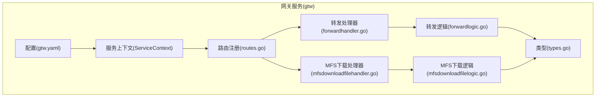
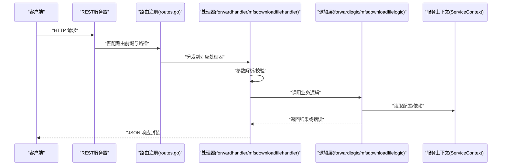
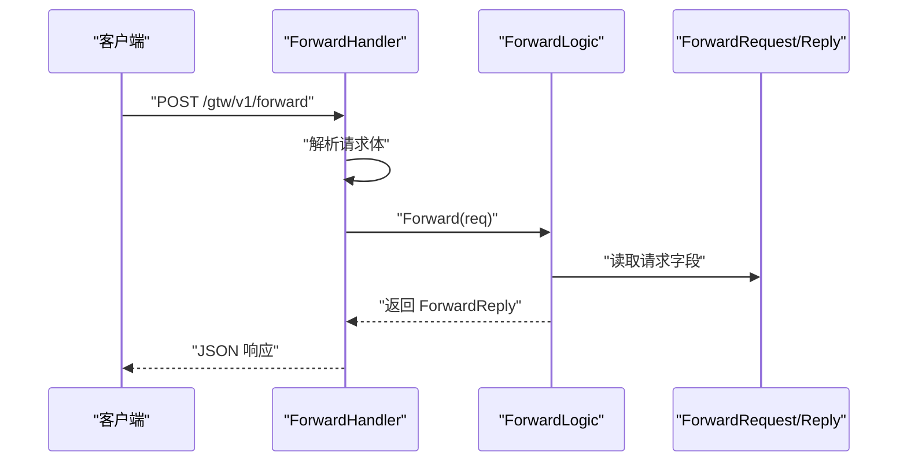
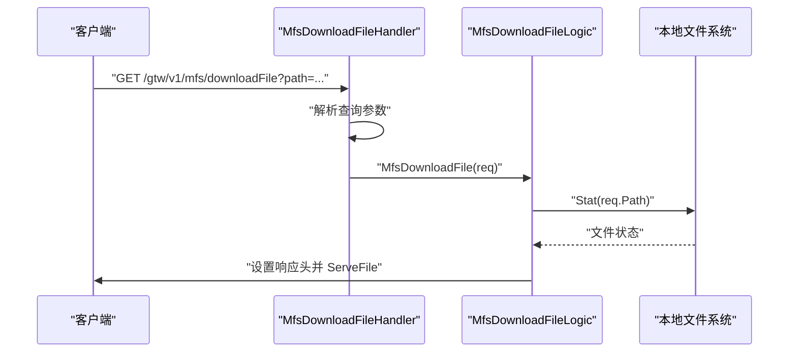
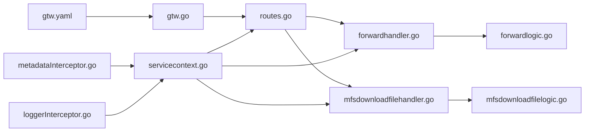

# 转发代理模块

<cite>
**本文引用的文件**
- [gtw.go](file://gtw/gtw.go)
- [routes.go](file://gtw/internal/handler/routes.go)
- [forwardhandler.go](file://gtw/internal/handler/gtw/forwardhandler.go)
- [forwardlogic.go](file://gtw/internal/logic/gtw/forwardlogic.go)
- [mfsdownloadfilehandler.go](file://gtw/internal/handler/gtw/mfsdownloadfilehandler.go)
- [mfsdownloadfilelogic.go](file://gtw/internal/logic/gtw/mfsdownloadfilelogic.go)
- [types.go](file://gtw/internal/types/types.go)
- [config.go](file://gtw/internal/config/config.go)
- [gtw.yaml](file://gtw/etc/gtw.yaml)
- [servicecontext.go](file://gtw/internal/svc/servicecontext.go)
- [metadataInterceptor.go](file://common/Interceptor/rpcclient/metadataInterceptor.go)
- [loggerInterceptor.go](file://common/Interceptor/rpcserver/loggerInterceptor.go)
- [resilience-patterns.md](file://.trae/skills/zero-skills/references/resilience-patterns.md)
- [rest-api-patterns.md](file://.trae/skills/zero-skills/references/rest-api-patterns.md)
</cite>

## 目录
1. [简介](#简介)
2. [项目结构](#项目结构)
3. [核心组件](#核心组件)
4. [架构总览](#架构总览)
5. [详细组件分析](#详细组件分析)
6. [依赖分析](#依赖分析)
7. [性能考虑](#性能考虑)
8. [故障排查指南](#故障排查指南)
9. [结论](#结论)
10. [附录](#附录)

## 简介
本文件面向“转发代理模块”，系统性梳理该模块在本仓库中的实现与使用方式，重点覆盖以下方面：
- HTTP 请求转发与响应转发的处理流程
- MFS 文件下载代理功能（含路径校验与下载行为）
- 安全控制策略（JWT 认证、CORS、自定义错误处理）
- 性能优化方案（超时控制、连接池、熔断与限流）
- 最佳实践与故障排查建议

## 项目结构
转发代理模块位于 gtw 应用中，采用 go-zero 的 REST 服务框架组织代码，主要由如下层次构成：
- 配置层：应用配置与运行参数
- 服务上下文：集中注入依赖（RPC 客户端、校验器等）
- 路由层：REST 路由注册与中间件装配
- 处理器层：HTTP 请求入口，负责参数解析与响应封装
- 逻辑层：业务逻辑编排（转发、MFS 下载等）
- 类型定义：请求/响应数据结构

图表来源
- [gtw.go:51-63](file://gtw/gtw.go#L51-L63)
- [routes.go:20-98](file://gtw/internal/handler/routes.go#L20-L98)
- [forwardhandler.go:14-29](file://gtw/internal/handler/gtw/forwardhandler.go#L14-L29)
- [mfsdownloadfilehandler.go:14-29](file://gtw/internal/handler/gtw/mfsdownloadfilehandler.go#L14-L29)
- [forwardlogic.go:27-31](file://gtw/internal/logic/gtw/forwardlogic.go#L27-L31)
- [mfsdownloadfilelogic.go:33-54](file://gtw/internal/logic/gtw/mfsdownloadfilelogic.go#L33-L54)
- [types.go:10-46](file://gtw/internal/types/types.go#L10-L46)

章节来源
- [gtw.go:25-95](file://gtw/gtw.go#L25-L95)
- [routes.go:20-161](file://gtw/internal/handler/routes.go#L20-L161)
- [config.go:8-20](file://gtw/internal/config/config.go#L8-L20)
- [gtw.yaml:1-61](file://gtw/etc/gtw.yaml#L1-L61)

## 核心组件
- 配置与启动
  - 应用通过命令行加载配置文件，初始化 REST 服务器并注册路由
  - 启用自定义 CORS，支持动态 Origin、凭证传递与常用头部
- 服务上下文
  - 注入 RPC 客户端（ZeroRpc、FileRpc），并设置元数据拦截器以透传用户/追踪信息
- 路由与中间件
  - 在特定前缀下注册转发与下载接口，并对部分路由启用 JWT 中间件
- 处理器与逻辑
  - 转发处理器解析请求体，调用逻辑层执行转发并返回统一 JSON 响应
  - MFS 下载处理器解析查询参数，调用逻辑层执行本地文件下载

章节来源
- [gtw.go:25-95](file://gtw/gtw.go#L25-L95)
- [routes.go:20-98](file://gtw/internal/handler/routes.go#L20-L98)
- [servicecontext.go:23-64](file://gtw/internal/svc/servicecontext.go#L23-L64)
- [forwardhandler.go:14-29](file://gtw/internal/handler/gtw/forwardhandler.go#L14-L29)
- [mfsdownloadfilehandler.go:14-29](file://gtw/internal/handler/gtw/mfsdownloadfilehandler.go#L14-L29)
- [forwardlogic.go:27-31](file://gtw/internal/logic/gtw/forwardlogic.go#L27-L31)
- [mfsdownloadfilelogic.go:33-54](file://gtw/internal/logic/gtw/mfsdownloadfilelogic.go#L33-L54)

## 架构总览
下图展示从客户端到处理器、再到逻辑层的整体调用链，以及安全与性能相关控制点。

图表来源
- [routes.go:20-98](file://gtw/internal/handler/routes.go#L20-L98)
- [forwardhandler.go:14-29](file://gtw/internal/handler/gtw/forwardhandler.go#L14-L29)
- [mfsdownloadfilehandler.go:14-29](file://gtw/internal/handler/gtw/mfsdownloadfilehandler.go#L14-L29)
- [forwardlogic.go:27-31](file://gtw/internal/logic/gtw/forwardlogic.go#L27-L31)
- [mfsdownloadfilelogic.go:33-54](file://gtw/internal/logic/gtw/mfsdownloadfilelogic.go#L33-L54)
- [servicecontext.go:23-64](file://gtw/internal/svc/servicecontext.go#L23-L64)

## 详细组件分析

### 转发请求处理流程
- 路由注册
  - 在 /gtw/v1 前缀下注册 /forward 接口，使用 POST 方法
- 处理器
  - 解析请求体为 ForwardRequest 结构
  - 调用 ForwardLogic.Forward 执行转发逻辑
  - 使用统一 JSON 响应封装返回
- 逻辑层
  - 当前实现记录请求日志并返回空响应，后续可扩展为实际代理转发

图表来源
- [routes.go:76-98](file://gtw/internal/handler/routes.go#L76-L98)
- [forwardhandler.go:14-29](file://gtw/internal/handler/gtw/forwardhandler.go#L14-L29)
- [forwardlogic.go:27-31](file://gtw/internal/logic/gtw/forwardlogic.go#L27-L31)
- [types.go:40-46](file://gtw/internal/types/types.go#L40-L46)

章节来源
- [routes.go:76-98](file://gtw/internal/handler/routes.go#L76-L98)
- [forwardhandler.go:14-29](file://gtw/internal/handler/gtw/forwardhandler.go#L14-L29)
- [forwardlogic.go:27-31](file://gtw/internal/logic/gtw/forwardlogic.go#L27-L31)
- [types.go:40-46](file://gtw/internal/types/types.go#L40-L46)

### MFS 下载文件代理
- 路由注册
  - 在 /gtw/v1 前缀下注册 /mfs/downloadFile 接口，使用 GET 方法
- 处理器
  - 解析查询参数为 DownloadFileRequest（包含 path 字段）
  - 调用 MfsDownloadFileLogic.MfsDownloadFile 执行下载
- 逻辑层
  - 通过 os.Stat 校验文件存在性
  - 设置 Content-Disposition 头并使用 http.ServeFile 提供下载
- 权限与安全
  - 当前逻辑未进行额外鉴权；如需访问限制，可在处理器或中间件层增加校验

图表来源
- [routes.go:84-89](file://gtw/internal/handler/routes.go#L84-L89)
- [mfsdownloadfilehandler.go:14-29](file://gtw/internal/handler/gtw/mfsdownloadfilehandler.go#L14-L29)
- [mfsdownloadfilelogic.go:33-54](file://gtw/internal/logic/gtw/mfsdownloadfilelogic.go#L33-L54)
- [types.go:10-12](file://gtw/internal/types/types.go#L10-L12)

章节来源
- [routes.go:84-89](file://gtw/internal/handler/routes.go#L84-L89)
- [mfsdownloadfilehandler.go:14-29](file://gtw/internal/handler/gtw/mfsdownloadfilehandler.go#L14-L29)
- [mfsdownloadfilelogic.go:33-54](file://gtw/internal/logic/gtw/mfsdownloadfilelogic.go#L33-L54)
- [types.go:10-12](file://gtw/internal/types/types.go#L10-L12)

### 数据模型与类型
- DownloadFileRequest：包含 path 查询参数
- ForwardRequest/ForwardReply：用于转发接口的请求/响应结构

章节来源
- [types.go:10-46](file://gtw/internal/types/types.go#L10-L46)

## 依赖分析
- 配置与运行
  - gtw.yaml 提供服务名称、监听地址、端口、超时、JWT 密钥、NFS 根目录、下载 URL 前缀、Swagger 路径等
  - gtw.go 加载配置并初始化 REST 服务器，注册路由与静态 Swagger 路由
- 服务上下文
  - ServiceContext 注入 ZeroRpc/FileRpc 客户端，并通过元数据拦截器透传用户/追踪信息
- 安全与中间件
  - 路由层对 /app/user/v1 下的部分路由启用 JWT 中间件
  - REST 层启用自定义 CORS，支持凭据与常用头部
  - RPC 服务端拦截器从元数据恢复上下文字段，便于日志与追踪

图表来源
- [gtw.yaml:1-61](file://gtw/etc/gtw.yaml#L1-L61)
- [gtw.go:25-95](file://gtw/gtw.go#L25-L95)
- [routes.go:20-161](file://gtw/internal/handler/routes.go#L20-L161)
- [forwardhandler.go:14-29](file://gtw/internal/handler/gtw/forwardhandler.go#L14-L29)
- [mfsdownloadfilehandler.go:14-29](file://gtw/internal/handler/gtw/mfsdownloadfilehandler.go#L14-L29)
- [forwardlogic.go:27-31](file://gtw/internal/logic/gtw/forwardlogic.go#L27-L31)
- [mfsdownloadfilelogic.go:33-54](file://gtw/internal/logic/gtw/mfsdownloadfilelogic.go#L33-L54)
- [servicecontext.go:23-64](file://gtw/internal/svc/servicecontext.go#L23-L64)
- [metadataInterceptor.go:11-31](file://common/Interceptor/rpcclient/metadataInterceptor.go#L11-L31)
- [loggerInterceptor.go:12-44](file://common/Interceptor/rpcserver/loggerInterceptor.go#L12-L44)

章节来源
- [gtw.yaml:1-61](file://gtw/etc/gtw.yaml#L1-L61)
- [gtw.go:25-95](file://gtw/gtw.go#L25-L95)
- [servicecontext.go:23-64](file://gtw/internal/svc/servicecontext.go#L23-L64)
- [metadataInterceptor.go:11-31](file://common/Interceptor/rpcclient/metadataInterceptor.go#L11-L31)
- [loggerInterceptor.go:12-44](file://common/Interceptor/rpcserver/loggerInterceptor.go#L12-L44)

## 性能考虑
- 超时控制
  - REST 服务层与 RPC 客户端均具备超时配置，建议结合上游服务能力设置合理超时
  - 对于大文件下载场景，可参考文件模块路由对长耗时操作设置独立超时
- 连接池与并发
  - 通过 go-zero 的 zrpc 客户端自动复用连接，减少握手开销
  - 对外部 HTTP 调用建议使用带超时的客户端并配合熔断与限流
- 熔断与限流
  - go-zero 内置熔断器，适用于 RPC/数据库/HTTP 客户端调用
  - 对外公共 API 建议开启速率限制，防止突发流量冲击
- 日志与可观测性
  - 通过拦截器与统一日志记录关键指标，便于定位性能瓶颈

章节来源
- [resilience-patterns.md:1-690](file://.trae/skills/zero-skills/references/resilience-patterns.md#L1-L690)
- [routes.go:72-74](file://gtw/internal/handler/routes.go#L72-L74)
- [servicecontext.go:59-63](file://gtw/internal/svc/servicecontext.go#L59-L63)

## 故障排查指南
- CORS 相关问题
  - 确认浏览器是否携带凭据（Cookie/Token），服务端已启用 Allow-Credentials
  - 检查请求头是否包含允许的方法与头部
- JWT 认证失败
  - 确认 Authorization 头是否正确传递
  - 核对 gtw.yaml 中的 AccessSecret 与前端一致
- 转发接口无响应
  - 检查 /gtw/v1/forward 路由是否被注册
  - 查看处理器日志，确认请求体解析与逻辑层执行情况
- MFS 下载失败
  - 确认 path 参数指向的文件存在且可读
  - 检查 Nginx/Apache 等反向代理是否正确转发至 gtw
- 自定义错误处理
  - 可参考 REST API 模式中的自定义错误处理器，统一返回格式

章节来源
- [gtw.go:51-63](file://gtw/gtw.go#L51-L63)
- [routes.go:157-159](file://gtw/internal/handler/routes.go#L157-L159)
- [forwardhandler.go:14-29](file://gtw/internal/handler/gtw/forwardhandler.go#L14-L29)
- [mfsdownloadfilehandler.go:14-29](file://gtw/internal/handler/gtw/mfsdownloadfilehandler.go#L14-L29)
- [rest-api-patterns.md:362-380](file://.trae/skills/zero-skills/references/rest-api-patterns.md#L362-L380)

## 结论
转发代理模块在本仓库中提供了简洁的转发接口与 MFS 文件下载代理能力。当前转发逻辑为占位实现，建议后续扩展为真正的上游代理（如 HTTP 转发或 RPC 转发）。MFS 下载代理具备基本的路径校验与标准下载行为，但缺少细粒度的访问控制，建议结合 JWT 与白名单策略增强安全性。整体上，模块遵循 go-zero 的最佳实践，具备良好的可扩展性与可观测性基础。

## 附录
- 配置项要点
  - gtw.yaml 中的 JwtAuth.AccessSecret 用于 JWT 验证
  - NfsRootPath 与 DownloadUrl 为文件系统与下载 URL 前缀的关键配置
  - SwaggerPath 用于暴露 Swagger 文档
- 路由前缀与方法
  - /gtw/v1/forward（POST）
  - /gtw/v1/mfs/downloadFile（GET）

章节来源
- [gtw.yaml:57-61](file://gtw/etc/gtw.yaml#L57-L61)
- [routes.go:76-98](file://gtw/internal/handler/routes.go#L76-L98)