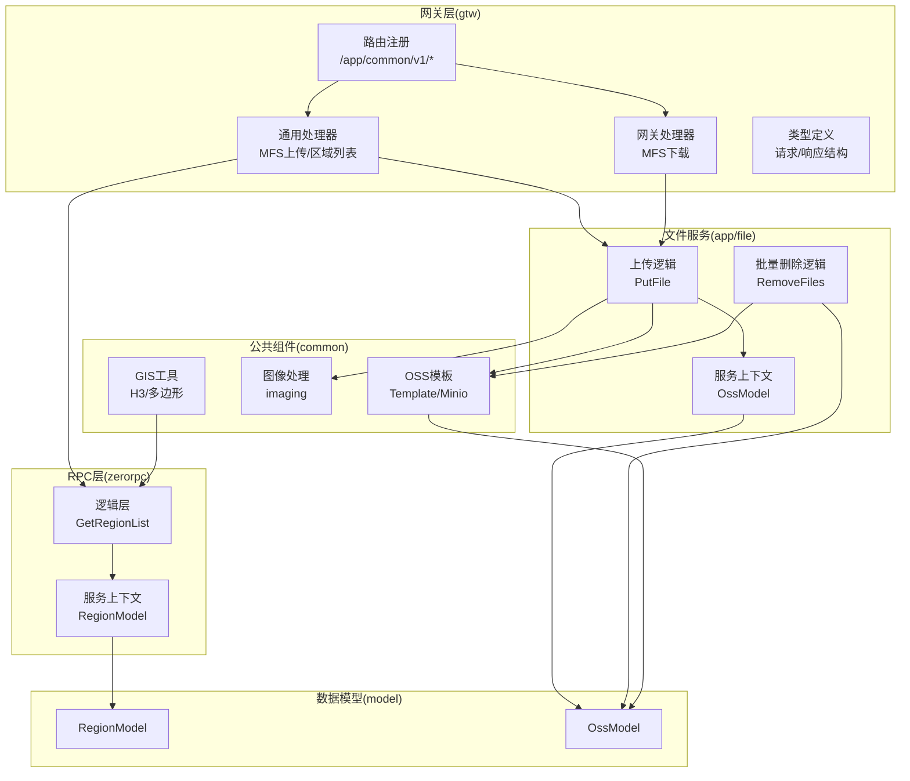
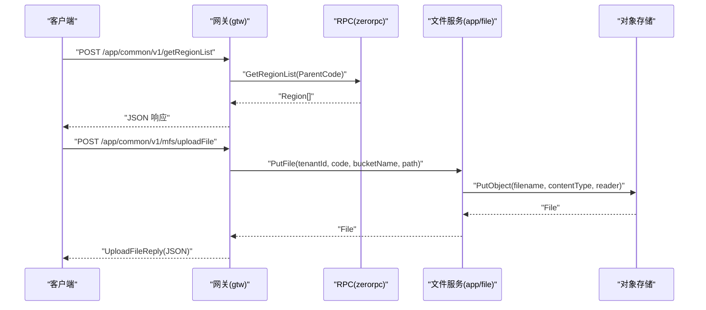
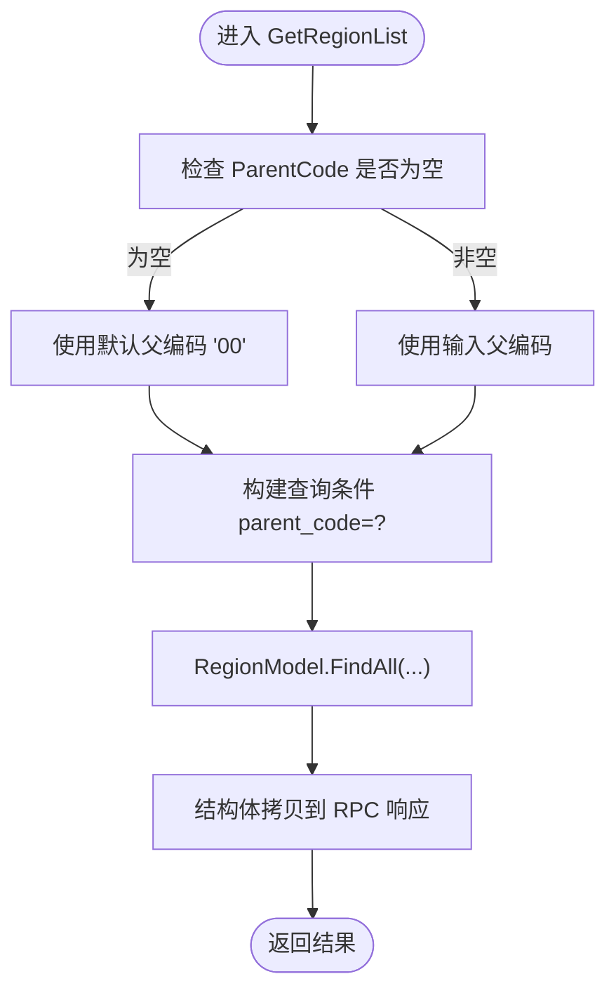
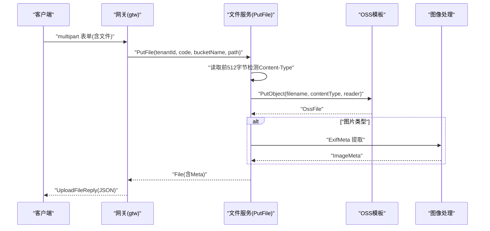
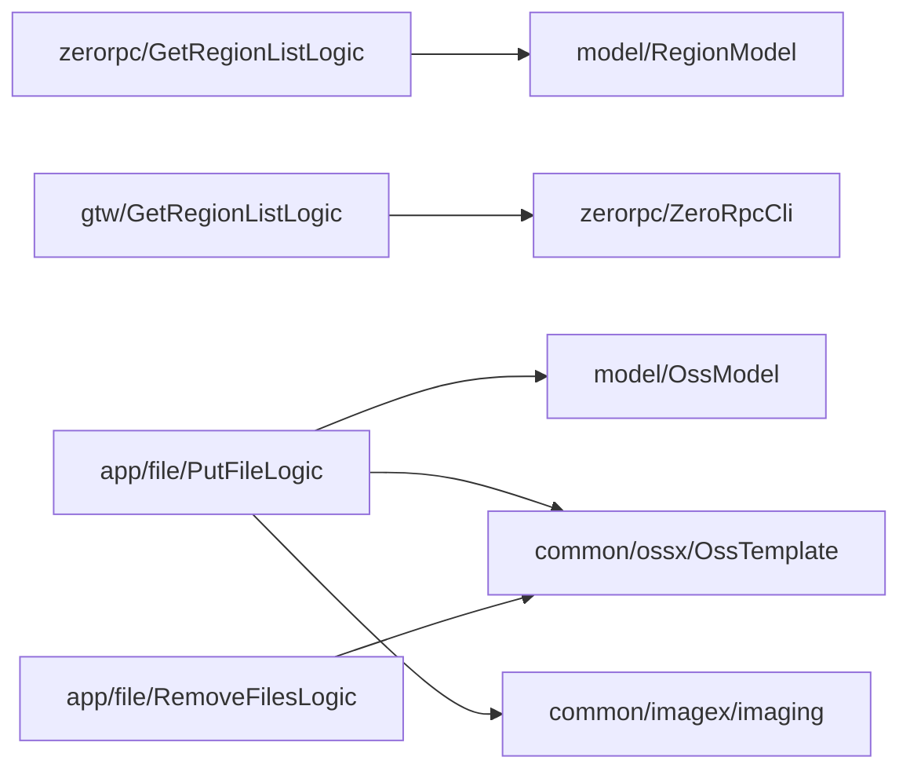

# 通用服务模块

<cite>
**本文引用的文件**
- [zerorpc/zerorpc.proto](file://zerorpc/zerorpc.proto)
- [zerorpc/internal/logic/getregionlistlogic.go](file://zerorpc/internal/logic/getregionlistlogic.go)
- [zerorpc/internal/svc/servicecontext.go](file://zerorpc/internal/svc/servicecontext.go)
- [gtw/internal/logic/common/getregionlistlogic.go](file://gtw/internal/logic/common/getregionlistlogic.go)
- [gtw/internal/handler/routes.go](file://gtw/internal/handler/routes.go)
- [gtw/internal/handler/common/mfsuploadfilehandler.go](file://gtw/internal/handler/common/mfsuploadfilehandler.go)
- [gtw/internal/handler/gtw/mfsdownloadfilehandler.go](file://gtw/internal/handler/gtw/mfsdownloadfilehandler.go)
- [gtw/internal/types/types.go](file://gtw/internal/types/types.go)
- [app/file/file.proto](file://app/file/file.proto)
- [app/file/internal/logic/putfilelogic.go](file://app/file/internal/logic/putfilelogic.go)
- [app/file/internal/logic/removefileslogic.go](file://app/file/internal/logic/removefileslogic.go)
- [app/file/internal/svc/servicecontext.go](file://app/file/internal/svc/servicecontext.go)
- [common/ossx/ossx.go](file://common/ossx/ossx.go)
- [common/imagex/imaging.go](file://common/imagex/imaging.go)
- [common/gisx/gisx.go](file://common/gisx/gisx.go)
- [model/regionmodel.go](file://model/regionmodel.go)
- [model/ossmodel.go](file://model/ossmodel.go)
</cite>

## 目录
1. [简介](#简介)
2. [项目结构](#项目结构)
3. [核心组件](#核心组件)
4. [架构总览](#架构总览)
5. [详细组件分析](#详细组件分析)
6. [依赖分析](#依赖分析)
7. [性能考虑](#性能考虑)
8. [故障排查指南](#故障排查指南)
9. [结论](#结论)
10. [附录](#附录)

## 简介
本技术文档聚焦于通用服务模块，围绕以下目标展开：
- 深入解析“区域列表查询”功能的实现，包括地理信息管理与数据过滤机制；
- 详述 MFS 文件上传服务的集成方案，覆盖多文件上传与批量处理能力；
- 总结通用接口的设计原则与复用策略，涵盖参数标准化与响应格式统一；
- 描述服务间的调用关系与数据流转过程；
- 提供通用服务的扩展指南与最佳实践，帮助开发者高效使用与演进。

## 项目结构
通用服务模块横跨多个应用与公共组件：
- 网关层（gtw）：对外暴露 HTTP 接口，路由至通用逻辑；
- RPC 层（zerorpc）：提供领域服务（如区域列表），并由网关转发；
- 文件服务（app/file）：提供对象存储上传、删除、签名等能力；
- 公共工具（common）：封装 OSS 模板、图像处理、GIS 工具等；
- 数据模型（model）：抽象数据库访问接口，支持自定义扩展。

图表来源
- [gtw/internal/handler/routes.go:20-37](file://gtw/internal/handler/routes.go#L20-L37)
- [zerorpc/internal/logic/getregionlistlogic.go:28-43](file://zerorpc/internal/logic/getregionlistlogic.go#L28-L43)
- [zerorpc/internal/svc/servicecontext.go:19-33](file://zerorpc/internal/svc/servicecontext.go#L19-L33)
- [app/file/internal/logic/putfilelogic.go:33-77](file://app/file/internal/logic/putfilelogic.go#L33-L77)
- [app/file/internal/logic/removefileslogic.go:28-45](file://app/file/internal/logic/removefileslogic.go#L28-L45)
- [app/file/internal/svc/servicecontext.go:12-17](file://app/file/internal/svc/servicecontext.go#L12-L17)
- [common/ossx/ossx.go:109-151](file://common/ossx/ossx.go#L109-L151)
- [common/imagex/imaging.go:12-68](file://common/imagex/imaging.go#L12-L68)
- [model/regionmodel.go:10-18](file://model/regionmodel.go#L10-L18)
- [model/ossmodel.go:7-13](file://model/ossmodel.go#L7-L13)

章节来源
- [gtw/internal/handler/routes.go:20-37](file://gtw/internal/handler/routes.go#L20-L37)
- [zerorpc/zerorpc.proto:43-62](file://zerorpc/zerorpc.proto#L43-L62)
- [app/file/file.proto:176-189](file://app/file/file.proto#L176-L189)

## 核心组件
- 区域列表查询（zerorpc + gtw）
  - zerorpc 提供 GetRegionList RPC，内部通过 RegionModel 查询父区划编码匹配的数据；
  - gtw 的 GetRegionListLogic 作为网关侧逻辑，调用 ZeroRpcCli.GetRegionList，并进行结构体拷贝返回。
- MFS 文件上传与下载（gtw + app/file）
  - gtw 提供 MFS 上传处理器，接收 multipart 表单，转发至文件服务逻辑；
  - 文件服务通过 OSS 模板 PutObject 完成上传，自动识别 Content-Type 并对图片提取 EXIF 元数据；
  - 批量删除通过 RemoveFiles 逐个校验结果，任一失败即整体失败。
- 通用接口设计
  - 请求/响应结构在 gtw/types 中统一定义，便于前后端契约一致；
  - 参数标准化：租户 ID、资源编号、存储桶名、路径前缀等均以字段形式显式传递；
  - 响应格式统一：所有 HTTP 响应通过 JsonBaseResponseCtx 输出，便于前端统一处理。

章节来源
- [zerorpc/internal/logic/getregionlistlogic.go:28-43](file://zerorpc/internal/logic/getregionlistlogic.go#L28-L43)
- [gtw/internal/logic/common/getregionlistlogic.go:29-37](file://gtw/internal/logic/common/getregionlistlogic.go#L29-L37)
- [gtw/internal/handler/common/mfsuploadfilehandler.go:14-29](file://gtw/internal/handler/common/mfsuploadfilehandler.go#L14-L29)
- [app/file/internal/logic/putfilelogic.go:33-77](file://app/file/internal/logic/putfilelogic.go#L33-L77)
- [app/file/internal/logic/removefileslogic.go:28-45](file://app/file/internal/logic/removefileslogic.go#L28-L45)
- [gtw/internal/types/types.go:59-65](file://gtw/internal/types/types.go#L59-L65)

## 架构总览
通用服务采用“网关 + RPC + 文件服务 + 公共组件”的分层架构：
- 网关层负责协议适配与参数解析；
- RPC 层承载领域服务（区域列表）；
- 文件服务承载对象存储能力（上传、删除、签名等）；
- 公共组件提供可复用能力（OSS、图像、GIS）。

图表来源
- [gtw/internal/handler/routes.go:24-34](file://gtw/internal/handler/routes.go#L24-L34)
- [zerorpc/internal/logic/getregionlistlogic.go:28-43](file://zerorpc/internal/logic/getregionlistlogic.go#L28-L43)
- [app/file/internal/logic/putfilelogic.go:33-77](file://app/file/internal/logic/putfilelogic.go#L33-L77)
- [common/ossx/ossx.go:33-38](file://common/ossx/ossx.go#L33-L38)

## 详细组件分析

### 区域列表查询组件
- 功能概述
  - 支持按父区划编码查询下级区域列表；
  - 若未提供父编码，默认使用“00”，兼容全国级查询。
- 数据过滤机制
  - 使用 squirrel 构建 WHERE 条件：parent_code = 输入值；
  - 通过 RegionModel.FindAll 获取全部记录，再进行结构体拷贝。
- 错误处理
  - 查询异常直接透传给调用方；
  - 结果为空时返回空数组，语义清晰。

图表来源
- [zerorpc/internal/logic/getregionlistlogic.go:28-43](file://zerorpc/internal/logic/getregionlistlogic.go#L28-L43)
- [model/regionmodel.go:10-18](file://model/regionmodel.go#L10-L18)

章节来源
- [zerorpc/zerorpc.proto:43-62](file://zerorpc/zerorpc.proto#L43-L62)
- [zerorpc/internal/logic/getregionlistlogic.go:28-43](file://zerorpc/internal/logic/getregionlistlogic.go#L28-L43)
- [zerorpc/internal/svc/servicecontext.go:98-98](file://zerorpc/internal/svc/servicecontext.go#L98-L98)
- [gtw/internal/logic/common/getregionlistlogic.go:29-37](file://gtw/internal/logic/common/getregionlistlogic.go#L29-L37)

### MFS 文件上传组件
- 功能概述
  - 支持多文件上传与批量处理；
  - 自动识别文件 MIME 类型，对图片提取 EXIF 元数据；
  - 通过 OSS 模板统一接入不同厂商对象存储（当前实现 MinIO）。
- 关键流程
  - 解析租户 ID、资源编号、存储桶名、文件路径；
  - 读取文件前 512 字节判断 Content-Type；
  - 调用 OSS 模板 PutObject 完成上传；
  - 对图片类型提取元数据并回填响应。
- 批量删除
  - RemoveFiles 逐个删除并聚合结果，任一失败即整体失败，保证一致性。

图表来源
- [gtw/internal/handler/common/mfsuploadfilehandler.go:14-29](file://gtw/internal/handler/common/mfsuploadfilehandler.go#L14-L29)
- [app/file/internal/logic/putfilelogic.go:33-77](file://app/file/internal/logic/putfilelogic.go#L33-L77)
- [common/ossx/ossx.go:33-38](file://common/ossx/ossx.go#L33-L38)
- [common/imagex/imaging.go:12-68](file://common/imagex/imaging.go#L12-L68)

章节来源
- [app/file/file.proto:176-189](file://app/file/file.proto#L176-L189)
- [app/file/internal/logic/putfilelogic.go:33-77](file://app/file/internal/logic/putfilelogic.go#L33-L77)
- [app/file/internal/logic/removefileslogic.go:28-45](file://app/file/internal/logic/removefileslogic.go#L28-L45)
- [app/file/internal/svc/servicecontext.go:12-17](file://app/file/internal/svc/servicecontext.go#L12-L17)
- [common/ossx/ossx.go:109-151](file://common/ossx/ossx.go#L109-L151)

### MFS 文件下载组件
- 功能概述
  - 提供文件下载能力，结合 OSS 签名 URL 或直链；
  - 网关层处理器解析请求参数并调用逻辑层执行下载。
- 注意事项
  - 下载成功后通常无需 JSON 响应体，直接写入响应流即可；
  - 如需签名链接，可在调用侧配合 SignUrlReqly 流程。

章节来源
- [gtw/internal/handler/gtw/mfsdownloadfilehandler.go:14-29](file://gtw/internal/handler/gtw/mfsdownloadfilehandler.go#L14-L29)
- [gtw/internal/types/types.go:141-151](file://gtw/internal/types/types.go#L141-L151)

### 通用接口设计与复用策略
- 参数标准化
  - 统一字段：tenantId、code、bucketName、filename/pathPrefix 等；
  - 表单参数：isThumb、mfsType 等开关字段，明确语义。
- 响应格式统一
  - 所有 HTTP 响应通过 JsonBaseResponseCtx 输出，便于前端统一处理；
  - 结构体定义集中在 gtw/types，避免重复与歧义。
- 复用策略
  - 通过 gtw/types 的结构体在各处理器中复用；
  - 逻辑层通过 ServiceContext 注入依赖，降低耦合。

章节来源
- [gtw/internal/types/types.go:59-65](file://gtw/internal/types/types.go#L59-L65)
- [gtw/internal/types/types.go:171-185](file://gtw/internal/types/types.go#L171-L185)
- [gtw/internal/handler/common/mfsuploadfilehandler.go:22-28](file://gtw/internal/handler/common/mfsuploadfilehandler.go#L22-L28)

### GIS 与地理信息管理
- 多边形到 H3 GeoPolygon 转换
  - 支持外环与洞（hole）结构，严格校验点数与闭合性；
  - 将 orb.Polygon 转换为 H3 所需的 GeoPolygon，便于后续栅格化或范围计算。
- 实践建议
  - 在上传/更新地理围栏时，先进行多边形有效性校验；
  - 对复杂多边形建议预处理为规范化的 GeoJSON 再转换。

章节来源
- [common/gisx/gisx.go:11-60](file://common/gisx/gisx.go#L11-L60)

## 依赖分析
- 组件内聚与耦合
  - 区域列表：zerorpc 逻辑层仅依赖 RegionModel，耦合度低；
  - 文件上传：依赖 OSS 模板与图像处理，职责清晰；
  - 网关层：仅承担参数解析与转发，保持薄层。
- 外部依赖
  - SQL 查询：squirrel 构建条件；
  - 对象存储：OSS 模板池缓存，减少重复初始化；
  - 图像处理：imaging 库，支持多种输入/输出格式。

图表来源
- [zerorpc/internal/logic/getregionlistlogic.go:28-43](file://zerorpc/internal/logic/getregionlistlogic.go#L28-L43)
- [gtw/internal/logic/common/getregionlistlogic.go:30-33](file://gtw/internal/logic/common/getregionlistlogic.go#L30-L33)
- [app/file/internal/logic/putfilelogic.go:33-77](file://app/file/internal/logic/putfilelogic.go#L33-L77)
- [app/file/internal/logic/removefileslogic.go:28-45](file://app/file/internal/logic/removefileslogic.go#L28-L45)
- [common/ossx/ossx.go:109-151](file://common/ossx/ossx.go#L109-L151)

章节来源
- [zerorpc/internal/svc/servicecontext.go:98-98](file://zerorpc/internal/svc/servicecontext.go#L98-L98)
- [app/file/internal/svc/servicecontext.go:23-24](file://app/file/internal/svc/servicecontext.go#L23-L24)

## 性能考虑
- 查询优化
  - 区域列表查询建议在 parent_code 上建立索引，提升大层级数据检索效率；
  - 使用 FindAll 一次性拉取，避免 N+1 查询。
- 上传优化
  - OSS 模板通过租户维度缓存，减少重复初始化开销；
  - 图片 EXIF 提取仅在图片类型时触发，避免对非图片文件的额外 IO。
- 批量操作
  - RemoveFiles 逐个删除并聚合结果，适合小批量场景；若需高吞吐，建议引入队列异步处理或分批并发。

## 故障排查指南
- 区域列表查询
  - 现象：返回空数组
  - 排查：确认 parentCode 是否正确；检查 RegionModel 数据是否存在；
  - 参考：[zerorpc/internal/logic/getregionlistlogic.go:28-43](file://zerorpc/internal/logic/getregionlistlogic.go#L28-L43)
- 文件上传失败
  - 现象：PutObject 报错
  - 排查：核对 tenantId/code/bucketName；检查 OSS 配置与权限；确认文件路径与大小；
  - 参考：[app/file/internal/logic/putfilelogic.go:33-77](file://app/file/internal/logic/putfilelogic.go#L33-L77)
- 批量删除异常
  - 现象：部分文件删除失败
  - 排查：查看 RemoveFiles 返回的错误明细，定位具体文件；
  - 参考：[app/file/internal/logic/removefileslogic.go:28-45](file://app/file/internal/logic/removefileslogic.go#L28-L45)
- 响应格式不一致
  - 现象：前端解析异常
  - 排查：确认所有处理器均通过 JsonBaseResponseCtx 输出；
  - 参考：[gtw/internal/handler/common/mfsuploadfilehandler.go:22-28](file://gtw/internal/handler/common/mfsuploadfilehandler.go#L22-L28)

章节来源
- [zerorpc/internal/logic/getregionlistlogic.go:28-43](file://zerorpc/internal/logic/getregionlistlogic.go#L28-L43)
- [app/file/internal/logic/putfilelogic.go:33-77](file://app/file/internal/logic/putfilelogic.go#L33-L77)
- [app/file/internal/logic/removefileslogic.go:28-45](file://app/file/internal/logic/removefileslogic.go#L28-L45)
- [gtw/internal/handler/common/mfsuploadfilehandler.go:22-28](file://gtw/internal/handler/common/mfsuploadfilehandler.go#L22-L28)

## 结论
通用服务模块通过清晰的分层设计与统一的接口契约，实现了区域列表查询与 MFS 文件服务的稳定交付。借助公共组件（OSS、图像、GIS），开发者可快速扩展新能力；通过参数标准化与响应统一，提升了系统的可维护性与可复用性。建议在生产环境中完善索引、监控与告警，并根据业务规模选择合适的批量处理策略。

## 附录
- 扩展指南
  - 新增区域查询条件：在 RegionModel 增加 SelectBuilder 扩展方法，避免侵入现有逻辑；
  - 新增文件类型支持：在 PutFile 中扩展 Content-Type 判断与对应元数据提取；
  - 新增对象存储厂商：在 OSS 模板工厂中新增分支，遵循现有接口契约。
- 最佳实践
  - 参数校验前置：在网关层对关键字段进行基础校验；
  - 错误日志规范化：统一记录请求上下文与关键参数，便于追踪；
  - 响应体最小化：仅返回必要字段，避免泄露敏感信息。