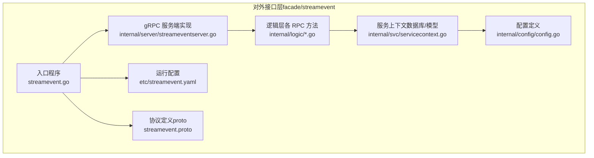
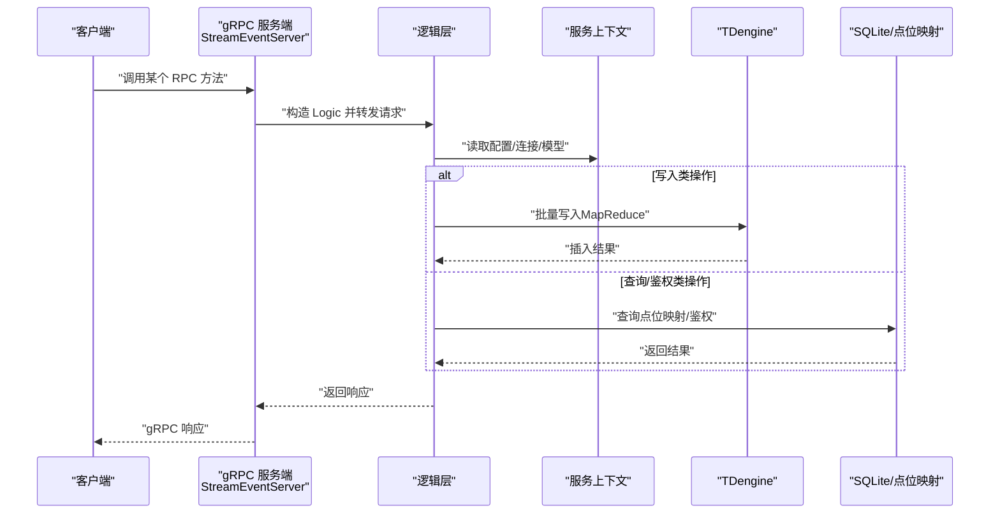
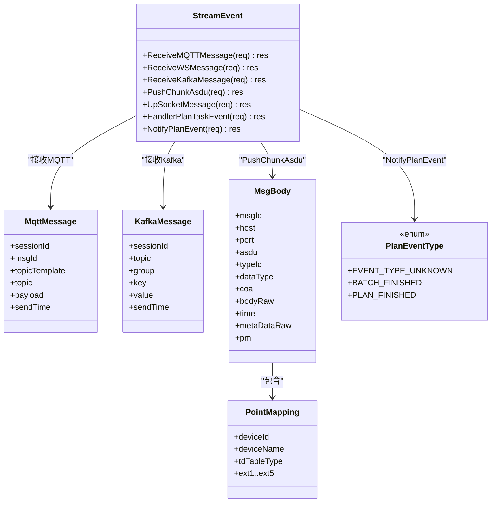
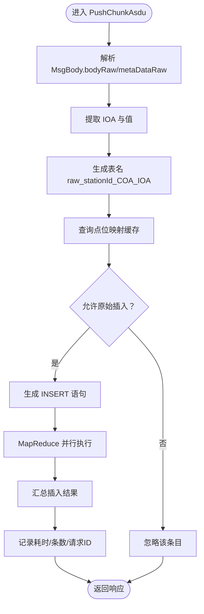
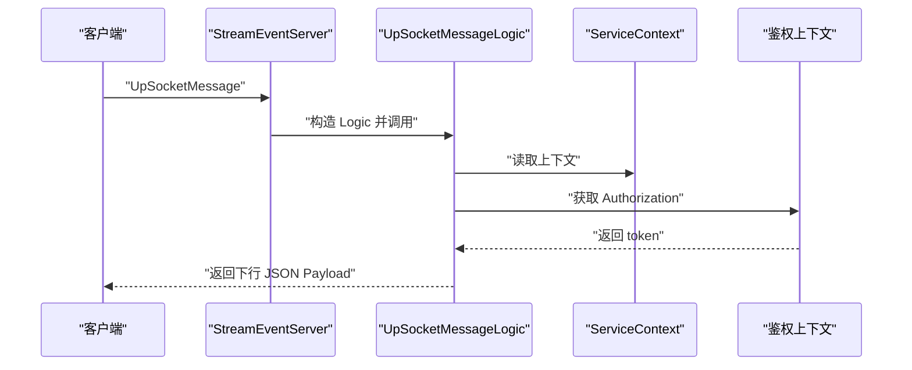
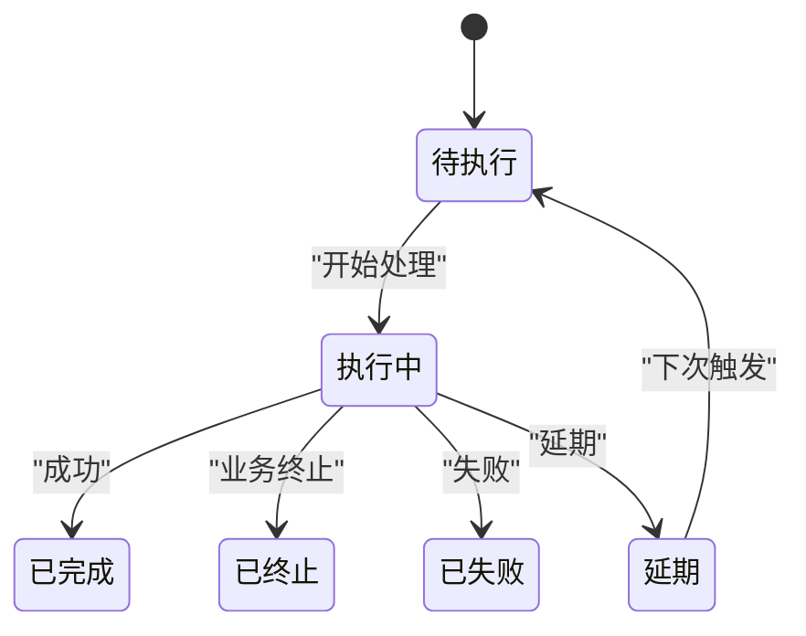
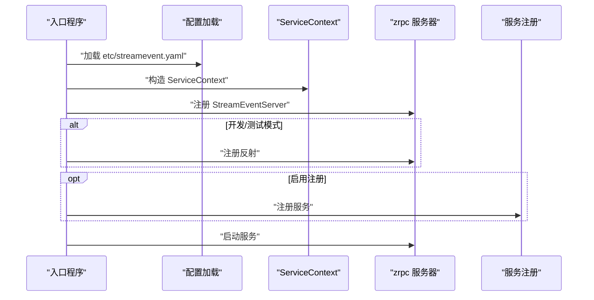
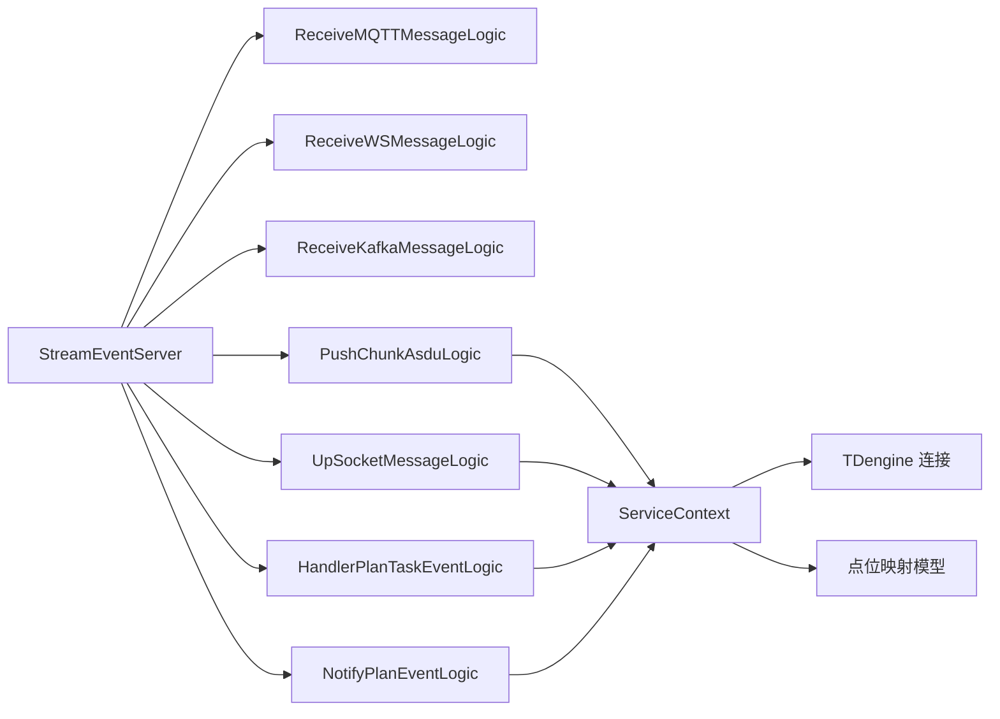

# 对外接口层

<cite>
**本文引用的文件**
- [facade/streamevent/streamevent.proto](file://facade/streamevent/streamevent.proto)
- [facade/streamevent/streamevent.go](file://facade/streamevent/streamevent.go)
- [facade/streamevent/etc/streamevent.yaml](file://facade/streamevent/etc/streamevent.yaml)
- [facade/streamevent/internal/config/config.go](file://facade/streamevent/internal/config/config.go)
- [facade/streamevent/internal/server/streameventserver.go](file://facade/streamevent/internal/server/streameventserver.go)
- [facade/streamevent/internal/svc/servicecontext.go](file://facade/streamevent/internal/svc/servicecontext.go)
- [facade/streamevent/internal/logic/pushchunkasdulogic.go](file://facade/streamevent/internal/logic/pushchunkasdulogic.go)
- [facade/streamevent/internal/logic/upsocketmessagelogic.go](file://facade/streamevent/internal/logic/upsocketmessagelogic.go)
- [facade/streamevent/internal/logic/receivemqttmessagelogic.go](file://facade/streamevent/internal/logic/receivemqttmessagelogic.go)
- [facade/streamevent/internal/logic/receivewsmessagelogic.go](file://facade/streamevent/internal/logic/receivewsmessagelogic.go)
- [facade/streamevent/internal/logic/receivekafkamessagelogic.go](file://facade/streamevent/internal/logic/receivekafkamessagelogic.go)
- [facade/streamevent/internal/logic/handlerplantaskeventlogic.go](file://facade/streamevent/internal/logic/handlerplantaskeventlogic.go)
- [facade/streamevent/internal/logic/notifyplaneventlogic.go](file://facade/streamevent/internal/logic/notifyplaneventlogic.go)
- [swagger/streamevent.swagger.json](file://swagger/streamevent.swagger.json)
</cite>

## 目录
1. [简介](#简介)
2. [项目结构](#项目结构)
3. [核心组件](#核心组件)
4. [架构总览](#架构总览)
5. [详细组件分析](#详细组件分析)
6. [依赖分析](#依赖分析)
7. [性能考虑](#性能考虑)
8. [故障排查指南](#故障排查指南)
9. [结论](#结论)
10. [附录](#附录)

## 简介
对外接口层以 facade 概念为核心，提供统一的外部服务入口与协议适配能力。本层聚焦于“streamevent”子域，实现对多源流式事件的统一接入与处理，包括 MQTT、WebSocket、Kafka、IEC 104 报文（ASDU）以及内部计划任务事件的编排与回传。通过 gRPC 服务暴露标准化接口，配合配置中心注册、日志与统计中间件，形成高内聚、低耦合的对外统一入口。

## 项目结构
对外接口层采用模块化组织方式，按“入口程序 -> 服务端 -> 逻辑层 -> 服务上下文 -> 配置与部署”的层次划分，确保职责清晰、扩展性强。

图表来源
- [facade/streamevent/streamevent.go:28-71](file://facade/streamevent/streamevent.go#L28-L71)
- [facade/streamevent/internal/server/streameventserver.go:15-67](file://facade/streamevent/internal/server/streameventserver.go#L15-L67)
- [facade/streamevent/internal/svc/servicecontext.go:14-32](file://facade/streamevent/internal/svc/servicecontext.go#L14-L32)
- [facade/streamevent/etc/streamevent.yaml:1-28](file://facade/streamevent/etc/streamevent.yaml#L1-L28)
- [facade/streamevent/streamevent.proto:10-25](file://facade/streamevent/streamevent.proto#L10-L25)

章节来源
- [facade/streamevent/streamevent.go:28-71](file://facade/streamevent/streamevent.go#L28-L71)
- [facade/streamevent/etc/streamevent.yaml:1-28](file://facade/streamevent/etc/streamevent.yaml#L1-L28)
- [facade/streamevent/internal/config/config.go:5-24](file://facade/streamevent/internal/config/config.go#L5-L24)
- [facade/streamevent/internal/server/streameventserver.go:15-67](file://facade/streamevent/internal/server/streameventserver.go#L15-L67)
- [facade/streamevent/internal/svc/servicecontext.go:14-32](file://facade/streamevent/internal/svc/servicecontext.go#L14-L32)

## 核心组件
- gRPC 服务定义与消息模型：通过 proto 定义 StreamEvent 服务及各类请求/响应消息，覆盖 MQTT/WS/Kafka/IEC104/计划任务等场景。
- 服务端桩实现：将每个 RPC 方法映射到对应的逻辑层处理函数。
- 逻辑层：具体业务处理，如 PushChunkAsdu 的批量入库、UpSocketMessage 的鉴权与下行示例、计划任务事件处理等。
- 服务上下文：封装数据库连接、点位映射模型、日志与统计等基础设施。
- 运行配置：包含监听地址、日志级别、Nacos 注册、TDengine/SQLite 数据源等。

章节来源
- [facade/streamevent/streamevent.proto:10-581](file://facade/streamevent/streamevent.proto#L10-L581)
- [facade/streamevent/internal/server/streameventserver.go:26-66](file://facade/streamevent/internal/server/streameventserver.go#L26-L66)
- [facade/streamevent/internal/logic/pushchunkasdulogic.go:118-222](file://facade/streamevent/internal/logic/pushchunkasdulogic.go#L118-L222)
- [facade/streamevent/internal/logic/upsocketmessagelogic.go:29-55](file://facade/streamevent/internal/logic/upsocketmessagelogic.go#L29-L55)
- [facade/streamevent/internal/svc/servicecontext.go:14-32](file://facade/streamevent/internal/svc/servicecontext.go#L14-L32)
- [facade/streamevent/etc/streamevent.yaml:14-28](file://facade/streamevent/etc/streamevent.yaml#L14-L28)

## 架构总览
对外接口层作为统一入口，向上提供 gRPC 服务，向下对接多种上游数据源与内部系统。其核心流程如下：

图表来源
- [facade/streamevent/internal/server/streameventserver.go:26-66](file://facade/streamevent/internal/server/streameventserver.go#L26-L66)
- [facade/streamevent/internal/logic/pushchunkasdulogic.go:118-222](file://facade/streamevent/internal/logic/pushchunkasdulogic.go#L118-L222)
- [facade/streamevent/internal/svc/servicecontext.go:21-32](file://facade/streamevent/internal/svc/servicecontext.go#L21-L32)

## 详细组件分析

### streamevent 协议与消息模型
- 服务接口：ReceiveMQTTMessage、ReceiveWSMessage、ReceiveKafkaMessage、PushChunkAsdu、UpSocketMessage、HandlerPlanTaskEvent、NotifyPlanEvent。
- MQTT/WS/Kafka 请求：支持批量消息聚合，便于下游批处理与性能优化。
- IEC104（ASDU）消息：包含报文头、信息对象地址（IOA）、品质描述、时标、原始报文与元数据；支持多种信息体类型（单点/双点/遥测/累计量/保护事件等）。
- Socket 上行事件：支持标准事件（连接/断开/加入房间/上行）与自定义事件，便于实时交互。
- 计划任务事件：包含事件类型枚举（批次完成/计划完成）与回调结果（执行结果、消息、原因、延期配置）。

图表来源
- [facade/streamevent/streamevent.proto:10-25](file://facade/streamevent/streamevent.proto#L10-L25)
- [facade/streamevent/streamevent.proto:35-48](file://facade/streamevent/streamevent.proto#L35-L48)
- [facade/streamevent/streamevent.proto:73-80](file://facade/streamevent/streamevent.proto#L73-L80)
- [facade/streamevent/streamevent.proto:92-114](file://facade/streamevent/streamevent.proto#L92-L114)
- [facade/streamevent/streamevent.proto:116-133](file://facade/streamevent/streamevent.proto#L116-L133)
- [facade/streamevent/streamevent.proto:572-578](file://facade/streamevent/streamevent.proto#L572-L578)

章节来源
- [facade/streamevent/streamevent.proto:10-581](file://facade/streamevent/streamevent.proto#L10-L581)

### PushChunkAsdu 批量入库流程
该方法负责将 IEC104 的 ASDU 报文解析、点位映射校验与批量写入 TDengine。流程要点：
- 解析 bodyRaw 与 metaDataRaw，提取 IOA 与值。
- 生成设备表名（raw_{stationId}_{COA}_{IOA}），优先使用元数据中的 stationId。
- 查询本地点位映射缓存，若允许原始插入则生成 INSERT 语句。
- 使用 MapReduce 并行执行 SQL，统计忽略/插入条数，记录耗时与请求 ID。

图表来源
- [facade/streamevent/internal/logic/pushchunkasdulogic.go:118-222](file://facade/streamevent/internal/logic/pushchunkasdulogic.go#L118-L222)

章节来源
- [facade/streamevent/internal/logic/pushchunkasdulogic.go:118-222](file://facade/streamevent/internal/logic/pushchunkasdulogic.go#L118-L222)

### UpSocketMessage 鉴权与下行示例
该方法演示了基于上下文的鉴权读取与下行 JSON 示例构建，便于客户端进行双向通信验证。

图表来源
- [facade/streamevent/internal/server/streameventserver.go:50-54](file://facade/streamevent/internal/server/streameventserver.go#L50-L54)
- [facade/streamevent/internal/logic/upsocketmessagelogic.go:29-55](file://facade/streamevent/internal/logic/upsocketmessagelogic.go#L29-L55)

章节来源
- [facade/streamevent/internal/logic/upsocketmessagelogic.go:29-55](file://facade/streamevent/internal/logic/upsocketmessagelogic.go#L29-L55)

### 计划任务事件处理与通知
- HandlerPlanTaskEvent：返回执行结果、消息、原因与延期配置，支持“完成/终止/失败/延期/进行中”等状态机。
- NotifyPlanEvent：根据事件类型（批次完成/计划完成）进行后续编排或回调。

图表来源
- [facade/streamevent/streamevent.proto:540-550](file://facade/streamevent/streamevent.proto#L540-L550)
- [facade/streamevent/streamevent.proto:560-570](file://facade/streamevent/streamevent.proto#L560-L570)
- [facade/streamevent/internal/logic/handlerplantaskeventlogic.go:29-38](file://facade/streamevent/internal/logic/handlerplantaskeventlogic.go#L29-L38)

章节来源
- [facade/streamevent/internal/logic/handlerplantaskeventlogic.go:29-38](file://facade/streamevent/internal/logic/handlerplantaskeventlogic.go#L29-L38)
- [facade/streamevent/internal/logic/notifyplaneventlogic.go:26-31](file://facade/streamevent/internal/logic/notifyplaneventlogic.go#L26-L31)

### 入口程序与服务装配
- 入口程序加载配置、初始化服务上下文、注册 gRPC 服务、可选反射调试、注册到 Nacos、添加日志中间件并启动服务。
- 支持开发/测试模式下启用反射，便于本地调试。

图表来源
- [facade/streamevent/streamevent.go:28-71](file://facade/streamevent/streamevent.go#L28-L71)
- [facade/streamevent/etc/streamevent.yaml:14-21](file://facade/streamevent/etc/streamevent.yaml#L14-L21)
- [facade/streamevent/internal/svc/servicecontext.go:21-32](file://facade/streamevent/internal/svc/servicecontext.go#L21-L32)

章节来源
- [facade/streamevent/streamevent.go:28-71](file://facade/streamevent/streamevent.go#L28-L71)
- [facade/streamevent/etc/streamevent.yaml:14-21](file://facade/streamevent/etc/streamevent.yaml#L14-L21)

## 依赖分析
- 服务端与逻辑层解耦：服务端仅做方法分发，逻辑层承担具体业务，便于单元测试与演进。
- 服务上下文集中管理：数据库连接、模型实例、日志与统计在上下文中统一注入，降低重复初始化成本。
- 外部依赖：TDengine（时序数据库）、SQLite（点位映射缓存）、Nacos（服务注册）、gRPC（传输协议）。

图表来源
- [facade/streamevent/internal/server/streameventserver.go:26-66](file://facade/streamevent/internal/server/streameventserver.go#L26-L66)
- [facade/streamevent/internal/logic/pushchunkasdulogic.go:118-222](file://facade/streamevent/internal/logic/pushchunkasdulogic.go#L118-L222)
- [facade/streamevent/internal/logic/upsocketmessagelogic.go:29-55](file://facade/streamevent/internal/logic/upsocketmessagelogic.go#L29-L55)
- [facade/streamevent/internal/svc/servicecontext.go:14-32](file://facade/streamevent/internal/svc/servicecontext.go#L14-L32)

章节来源
- [facade/streamevent/internal/server/streameventserver.go:26-66](file://facade/streamevent/internal/server/streameventserver.go#L26-L66)
- [facade/streamevent/internal/svc/servicecontext.go:14-32](file://facade/streamevent/internal/svc/servicecontext.go#L14-L32)

## 性能考虑
- 批量聚合：MQTT/WS/Kafka 请求支持批量消息，减少网络往返与下游压力。
- 并行写入：PushChunkAsdu 使用 MapReduce 并行执行 SQL，提升吞吐。
- 日志与统计：配置中提供忽略特定方法的统计项，避免高频接口影响指标准确性。
- 连接与缓存：服务上下文统一管理数据库连接与点位映射缓存，减少重复初始化与查询延迟。

章节来源
- [facade/streamevent/etc/streamevent.yaml:11-13](file://facade/streamevent/etc/streamevent.yaml#L11-L13)
- [facade/streamevent/internal/logic/pushchunkasdulogic.go:127-212](file://facade/streamevent/internal/logic/pushchunkasdulogic.go#L127-L212)
- [facade/streamevent/internal/svc/servicecontext.go:21-32](file://facade/streamevent/internal/svc/servicecontext.go#L21-L32)

## 故障排查指南
- TDengine 连接未初始化：PushChunkAsdu 在连接为空时记录错误并跳过写入，检查配置与连接参数。
- JSON 解析失败：当 bodyRaw 或 metaDataRaw 解析异常时，记录错误并忽略该条目，检查上游报文格式。
- 点位映射缺失：若未找到映射或不允许原始插入，则忽略该条，检查点位映射缓存与配置。
- 高频接口统计干扰：可通过配置忽略特定方法的统计项，避免指标失真。
- 服务注册与发现：确认 Nacos 配置与服务元数据，确保服务可被发现。

章节来源
- [facade/streamevent/internal/logic/pushchunkasdulogic.go:122-136](file://facade/streamevent/internal/logic/pushchunkasdulogic.go#L122-L136)
- [facade/streamevent/etc/streamevent.yaml:14-21](file://facade/streamevent/etc/streamevent.yaml#L14-L21)

## 结论
对外接口层以 facade 为核心理念，通过标准化的 gRPC 接口与清晰的分层架构，实现了对多源流式事件的统一接入与高效处理。streamevent 协议覆盖 MQTT/WS/Kafka/IEC104/计划任务等关键场景，并通过并行写入、批量聚合与集中上下文管理，兼顾性能与可维护性。结合配置中心注册与日志统计，满足生产环境的可观测性与可运维性需求。

## 附录

### 接口版本管理与兼容性
- 当前仓库未提供显式的接口版本号或迁移脚本，建议在 proto 中引入版本注释与兼容性策略，逐步引入向后兼容的字段与废弃字段标记，配合 Swagger 文档与灰度发布策略进行平滑升级。

章节来源
- [swagger/streamevent.swagger.json:1-50](file://swagger/streamevent.swagger.json#L1-L50)

### 安全认证、权限控制与访问限制
- 鉴权示例：UpSocketMessage 从上下文中读取 Authorization，可用于令牌校验与权限判定。
- 建议：在入口处增加统一鉴权拦截器，结合 RBAC/资源授权策略，对敏感接口进行细粒度访问控制。

章节来源
- [facade/streamevent/internal/logic/upsocketmessagelogic.go:30-31](file://facade/streamevent/internal/logic/upsocketmessagelogic.go#L30-L31)

### 最佳实践
- 批量处理：优先使用批量请求（MQTT/WS/Kafka）以提升吞吐。
- 并行写入：PushChunkAsdu 已采用并行策略，注意合理设置并发度与资源上限。
- 日志追踪：利用请求 ID（taosReqId）串联链路日志，便于问题定位。
- 配置治理：集中管理 TDengine/SQLite/Nacos 等配置，确保一致性与可审计性。

章节来源
- [facade/streamevent/internal/logic/pushchunkasdulogic.go:120-121](file://facade/streamevent/internal/logic/pushchunkasdulogic.go#L120-L121)
- [facade/streamevent/etc/streamevent.yaml:1-28](file://facade/streamevent/etc/streamevent.yaml#L1-L28)

### 接口使用与集成案例
- MQTT/WS/Kafka 接入：通过批量消息聚合，将上游事件统一投递到对应 RPC 方法，实现解耦与扩展。
- IEC104 报文：将 ASDU 报文按协议规范解析，经 PushChunkAsdu 写入 TDengine，支持后续分析与告警。
- 计划任务：通过 HandlerPlanTaskEvent 与 NotifyPlanEvent 实现任务生命周期编排与回调。

章节来源
- [facade/streamevent/streamevent.proto:27-80](file://facade/streamevent/streamevent.proto#L27-L80)
- [facade/streamevent/streamevent.proto:83-133](file://facade/streamevent/streamevent.proto#L83-L133)
- [facade/streamevent/streamevent.proto:560-578](file://facade/streamevent/streamevent.proto#L560-L578)