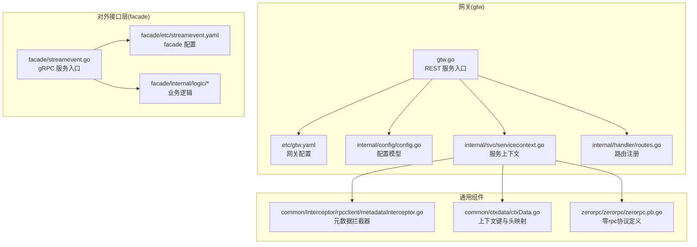
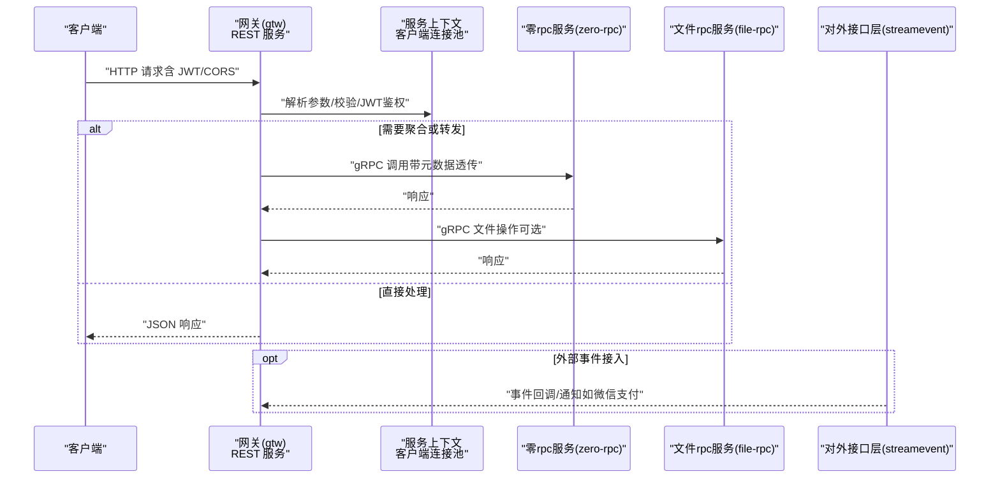
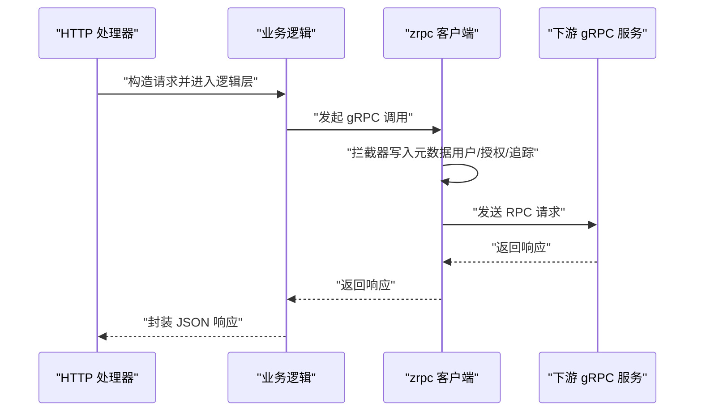
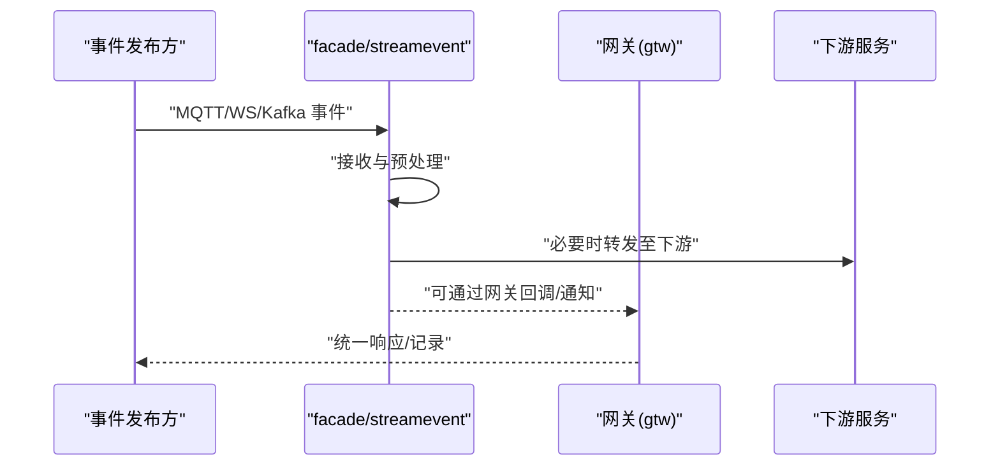
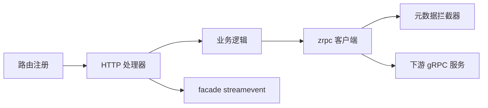

# 网关服务

<cite>
**本文引用的文件**
- [gtw.go](file://gtw/gtw.go)
- [gtw.yaml](file://gtw/etc/gtw.yaml)
- [config.go](file://gtw/internal/config/config.go)
- [servicecontext.go](file://gtw/internal/svc/servicecontext.go)
- [routes.go](file://gtw/internal/handler/routes.go)
- [forwardhandler.go](file://gtw/internal/handler/gtw/forwardhandler.go)
- [mfsdownloadfilehandler.go](file://gtw/internal/handler/gtw/mfsdownloadfilehandler.go)
- [loginhandler.go](file://gtw/internal/handler/user/loginhandler.go)
- [metadataInterceptor.go](file://common/Interceptor/rpcclient/metadataInterceptor.go)
- [ctxData.go](file://common/ctxdata/ctxData.go)
- [zerorpc.pb.go](file://zerorpc/zerorpc/zerorpc.pb.go)
- [streamevent.go](file://facade/streamevent/streamevent.go)
- [streamevent.yaml](file://facade/streamevent/etc/streamevent.yaml)
- [receivemqttmessagelogic.go](file://facade/streamevent/internal/logic/receivemqttmessagelogic.go)
</cite>

## 目录
1. [简介](#简介)
2. [项目结构](#项目结构)
3. [核心组件](#核心组件)
4. [架构总览](#架构总览)
5. [详细组件分析](#详细组件分析)
6. [依赖分析](#依赖分析)
7. [性能考虑](#性能考虑)
8. [故障排查指南](#故障排查指南)
9. [结论](#结论)
10. [附录](#附录)

## 简介
本文件面向 zero-service 的网关服务（BFF 网关，代号 gtw），系统性阐述其架构设计、路由与中间件链、请求聚合、认证授权与安全控制、grpc-gateway 的集成方式、HTTP 到 gRPC 的转换规则、对外接口层（facade）设计理念（尤其是 streamevent 流式事件处理）、路由转发规则、负载均衡策略、请求监控、配置项、性能优化与故障处理机制，并给出部署配置、监控指标与运维建议。

## 项目结构
- 网关服务位于 gtw 目录，采用 go-zero REST 服务框架，通过配置驱动启动，注册多组 REST 路由并挂载到统一入口。
- 对外接口层（facade）位于 facade/streamevent，提供基于 gRPC 的流式事件处理能力，支持 MQTT、WebSocket、Kafka 等上游事件汇聚。
- 通用中间件与上下文数据在 common 目录中，贯穿 RPC 客户端与服务端拦截器，确保链路透传与可观测性。

图表来源
- [gtw.go:1-96](file://gtw/gtw.go#L1-L96)
- [gtw.yaml:1-61](file://gtw/etc/gtw.yaml#L1-L61)
- [config.go:1-21](file://gtw/internal/config/config.go#L1-L21)
- [servicecontext.go:1-66](file://gtw/internal/svc/servicecontext.go#L1-L66)
- [routes.go:1-161](file://gtw/internal/handler/routes.go#L1-L161)
- [metadataInterceptor.go:1-56](file://common/Interceptor/rpcclient/metadataInterceptor.go#L1-L56)
- [ctxData.go:1-76](file://common/ctxdata/ctxData.go#L1-L76)
- [zerorpc.pb.go:1-200](file://zerorpc/zerorpc/zerorpc.pb.go#L1-L200)
- [streamevent.go:1-72](file://facade/streamevent/streamevent.go#L1-L72)
- [streamevent.yaml:1-28](file://facade/streamevent/etc/streamevent.yaml#L1-L28)

章节来源
- [gtw.go:1-96](file://gtw/gtw.go#L1-L96)
- [gtw.yaml:1-61](file://gtw/etc/gtw.yaml#L1-L61)
- [config.go:1-21](file://gtw/internal/config/config.go#L1-L21)
- [servicecontext.go:1-66](file://gtw/internal/svc/servicecontext.go#L1-L66)
- [routes.go:1-161](file://gtw/internal/handler/routes.go#L1-L161)

## 核心组件
- REST 服务与 CORS：使用 go-zero REST 服务，动态设置跨域头，支持凭证、自定义请求头与方法集合。
- 路由注册：按模块前缀分组注册，如 /app/common/v1、/file/v1、/gtw/v1、/gtw/v1/pay、/app/user/v1 等。
- JWT 认证：对特定用户相关路由启用 JWT 中间件，密钥来自配置。
- 服务上下文：注入验证器、零 rpc 客户端、文件 rpc 客户端、微信支付客户端等。
- gRPC 元数据透传：通过客户端拦截器将上下文中的用户、授权、追踪 ID 等写入 gRPC 元数据。
- 外部接口层（facade）：提供 streamevent gRPC 服务，支持事件汇聚与处理，具备中间件统计配置。

章节来源
- [gtw.go:51-63](file://gtw/gtw.go#L51-L63)
- [routes.go:20-161](file://gtw/internal/handler/routes.go#L20-L161)
- [servicecontext.go:23-65](file://gtw/internal/svc/servicecontext.go#L23-L65)
- [metadataInterceptor.go:11-32](file://common/Interceptor/rpcclient/metadataInterceptor.go#L11-L32)
- [streamevent.go:39-45](file://facade/streamevent/streamevent.go#L39-L45)

## 架构总览
下图展示从客户端到网关、再到下游服务与对外接口层的整体交互流程。

图表来源
- [gtw.go:25-95](file://gtw/gtw.go#L25-L95)
- [routes.go:20-161](file://gtw/internal/handler/routes.go#L20-L161)
- [servicecontext.go:59-63](file://gtw/internal/svc/servicecontext.go#L59-L63)
- [metadataInterceptor.go:11-32](file://common/Interceptor/rpcclient/metadataInterceptor.go#L11-L32)
- [zerorpc.pb.go:112-178](file://zerorpc/zerorpc/zerorpc.pb.go#L112-L178)

## 详细组件分析

### REST 服务与 CORS
- 启动流程：解析配置文件、打印运行环境、创建 REST 服务器、注册路由、可选暴露 Swagger 静态文件。
- CORS：动态 Origin、支持凭证、自定义请求头与方法集合，避免缓存污染。
- Swagger：当配置中存在 SwaggerPath 时，注册 /swagger/:fileName 路由以返回对应 JSON。

章节来源
- [gtw.go:25-95](file://gtw/gtw.go#L25-L95)

### 路由与前缀分组
- 公共模块：/app/common/v1，包含区域列表、MFS 上传等。
- 文件模块：/file/v1，包含 OSS 上传、签名、状态查询、流式上传等，部分路由设置较长超时。
- 网关模块：/gtw/v1，包含 ping、下载、通用转发等。
- 支付模块：/gtw/v1/pay，包含微信支付/退款通知。
- 用户模块：/app/user/v1，包含登录、短信验证码、编辑当前用户、获取当前用户；后三者启用 JWT。

章节来源
- [routes.go:20-161](file://gtw/internal/handler/routes.go#L20-L161)

### 认证授权与安全控制
- JWT：用户相关路由启用 JWT 中间件，密钥来源于配置。
- CORS：严格控制允许的来源、方法、头与凭证，避免跨域风险。
- 微信支付：服务上下文中初始化微信支付客户端，配置通知地址与超时等。

章节来源
- [routes.go:157-159](file://gtw/internal/handler/routes.go#L157-L159)
- [gtw.go:51-63](file://gtw/gtw.go#L51-L63)
- [servicecontext.go:24-55](file://gtw/internal/svc/servicecontext.go#L24-L55)

### gRPC 客户端与元数据透传
- 客户端连接：零 rpc 与文件 rpc 客户端均通过 go-zero zrpc 创建，并注入元数据拦截器。
- 元数据键：用户 ID、用户名、部门编码、授权头、追踪 ID 等，均以小写元数据头形式透传。
- 上下文键：ctxdata 提供统一的上下文键与头映射，保证一致性。

图表来源
- [metadataInterceptor.go:11-32](file://common/Interceptor/rpcclient/metadataInterceptor.go#L11-L32)
- [ctxData.go:42-75](file://common/ctxdata/ctxData.go#L42-L75)
- [servicecontext.go:59-63](file://gtw/internal/svc/servicecontext.go#L59-L63)

章节来源
- [metadataInterceptor.go:11-32](file://common/Interceptor/rpcclient/metadataInterceptor.go#L11-L32)
- [ctxData.go:9-24](file://common/ctxdata/ctxData.go#L9-L24)
- [servicecontext.go:59-63](file://gtw/internal/svc/servicecontext.go#L59-L63)

### 请求聚合与通用转发
- 通用转发：/gtw/v1/forward 接口接收请求体，交由逻辑层处理，最终以统一 JSON 响应返回。
- 下载文件：/gtw/v1/mfs/downloadFile 接口解析请求参数，调用逻辑层执行下载，响应由逻辑层控制。

章节来源
- [forwardhandler.go:14-30](file://gtw/internal/handler/gtw/forwardhandler.go#L14-L30)
- [mfsdownloadfilehandler.go:14-30](file://gtw/internal/handler/gtw/mfsdownloadfilehandler.go#L14-L30)

### 登录与用户相关接口
- 登录：/app/user/v1/login 与 /app/user/v1/miniProgramLogin，解析请求体后调用逻辑层完成登录。
- JWT：/app/user/v1/editCurrentUser 与 /app/user/v1/getCurrentUser 启用 JWT 中间件，确保访问安全。

章节来源
- [loginhandler.go:14-30](file://gtw/internal/handler/user/loginhandler.go#L14-L30)
- [routes.go:118-159](file://gtw/internal/handler/routes.go#L118-L159)

### 对外接口层（facade）与 streamevent
- 服务入口：facade/streamevent.go 注册 gRPC 服务，开发模式下开启反射，便于调试。
- 配置：包含日志、中间件统计忽略特定方法、Nacos 注册开关、数据库与 TaosDB 连接等。
- 事件处理：facade 内部提供多种事件接收逻辑（如 MQTT、WebSocket、Kafka），作为 streamevent 的承载。

图表来源
- [streamevent.go:39-45](file://facade/streamevent/streamevent.go#L39-L45)
- [streamevent.yaml:11-13](file://facade/streamevent/etc/streamevent.yaml#L11-L13)
- [receivemqttmessagelogic.go:27-31](file://facade/streamevent/internal/logic/receivemqttmessagelogic.go#L27-L31)

章节来源
- [streamevent.go:28-71](file://facade/streamevent/streamevent.go#L28-L71)
- [streamevent.yaml:1-28](file://facade/streamevent/etc/streamevent.yaml#L1-L28)
- [receivemqttmessagelogic.go:18-31](file://facade/streamevent/internal/logic/receivemqttmessagelogic.go#L18-L31)

### grpc-gateway 集成与 HTTP 到 gRPC 转换
- 当前网关主程序未直接启用 grpc-gateway，而是通过 REST 服务与下游 zrpc 客户端交互。
- 若需启用 grpc-gateway，可在 gtw 主程序中参考注释段落进行扩展，将 gRPC 方法映射为 HTTP 路由，结合元数据拦截器实现链路透传与安全控制。

章节来源
- [gtw.go:35-49](file://gtw/gtw.go#L35-L49)

## 依赖分析
- 组件耦合：网关通过服务上下文统一管理下游客户端，降低各处理器对具体服务的耦合度。
- 中间件链：HTTP 层 CORS 与 JWT，RPC 层元数据透传，形成端到端的可观测与安全链路。
- 外部依赖：微信支付 SDK、Nacos 注册中心、日志与链路追踪（通过 go-zero 日志与中间件）。

图表来源
- [routes.go:20-161](file://gtw/internal/handler/routes.go#L20-L161)
- [servicecontext.go:59-63](file://gtw/internal/svc/servicecontext.go#L59-L63)
- [metadataInterceptor.go:11-32](file://common/Interceptor/rpcclient/metadataInterceptor.go#L11-L32)

章节来源
- [routes.go:20-161](file://gtw/internal/handler/routes.go#L20-L161)
- [servicecontext.go:59-63](file://gtw/internal/svc/servicecontext.go#L59-L63)

## 性能考虑
- 超时与并发：文件模块路由设置了较长超时，适合大文件上传场景；其他路由保持默认，避免阻塞。
- CORS 缓存：设置 Vary: Origin，避免代理缓存污染。
- 中间件统计：facade 的中间件统计可忽略高吞吐方法（如 PushChunkAsdu），减少统计开销。
- 负载均衡：zrpc 客户端默认支持多端点与非阻塞调用，结合 Nacos 可实现服务发现与负载均衡。

章节来源
- [routes.go:73](file://gtw/internal/handler/routes.go#L73)
- [gtw.go:51-63](file://gtw/gtw.go#L51-L63)
- [streamevent.yaml:12-13](file://facade/streamevent/etc/streamevent.yaml#L12-L13)
- [gtw.yaml:47-51](file://gtw/etc/gtw.yaml#L47-L51)

## 故障排查指南
- CORS 异常：检查请求头 Origin 是否匹配，确认 Access-Control-Allow-Origin 动态设置与 Vary 设置。
- JWT 失败：确认请求头 Authorization 是否正确传递，密钥与签名算法是否一致。
- gRPC 调用失败：检查元数据拦截器是否成功写入用户/授权/追踪头；核对下游服务端是否正确读取。
- 文件下载异常：确认 DownloadUrl 配置与 NFS 根路径一致，检查文件是否存在与权限。
- 微信支付回调：核对通知地址与签名验证流程，检查日志驱动与超时配置。

章节来源
- [gtw.go:51-63](file://gtw/gtw.go#L51-L63)
- [routes.go:157-159](file://gtw/internal/handler/routes.go#L157-L159)
- [metadataInterceptor.go:11-32](file://common/Interceptor/rpcclient/metadataInterceptor.go#L11-L32)
- [gtw.yaml:57-61](file://gtw/etc/gtw.yaml#L57-L61)
- [servicecontext.go:24-55](file://gtw/internal/svc/servicecontext.go#L24-L55)

## 结论
本网关服务以 go-zero 为基础，通过清晰的路由分组、JWT 安全控制、gRPC 元数据透传与统一的服务上下文，实现了对内聚合与对外统一入口。结合 facade 的 streamevent 能力，网关可承接多源事件并统一输出。建议在生产环境中启用 grpc-gateway 映射、完善链路追踪与告警、优化中间件统计策略，并持续完善安全与可观测性配置。

## 附录

### 配置项一览（节选）
- 网关基础：名称、主机、端口、超时、日志、模式。
- Upstreams（预留）：gRPC 端点、非阻塞、ProtoSets、Mappings。
- 零 rpc 与文件 rpc：端点、非阻塞、超时。
- JWT：AccessSecret。
- NFS 与下载：NfsRootPath、DownloadUrl。
- Swagger：SwaggerPath。

章节来源
- [gtw.yaml:1-61](file://gtw/etc/gtw.yaml#L1-L61)

### 部署与运维建议
- 部署：容器化镜像构建，挂载日志目录与证书（如微信支付证书）。
- 注册中心：结合 Nacos 实现服务发现与健康检查。
- 监控：启用 go-zero 日志与中间件统计，结合 Prometheus/Grafana。
- 安全：强制 HTTPS、最小权限原则、定期轮换 AccessSecret。
- 故障演练：模拟 CORS、JWT、gRPC 调用失败与文件下载异常，验证降级与告警。