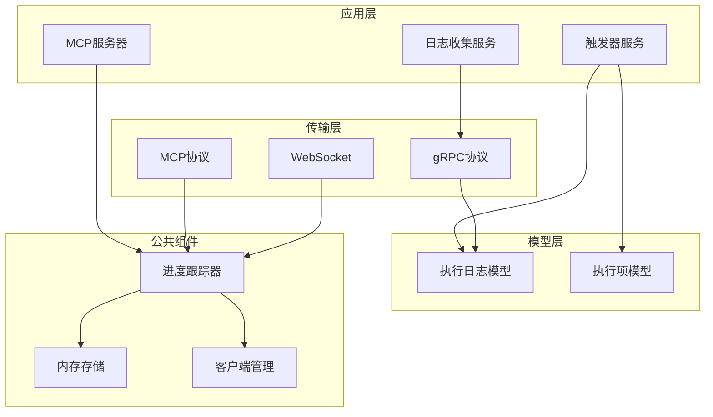
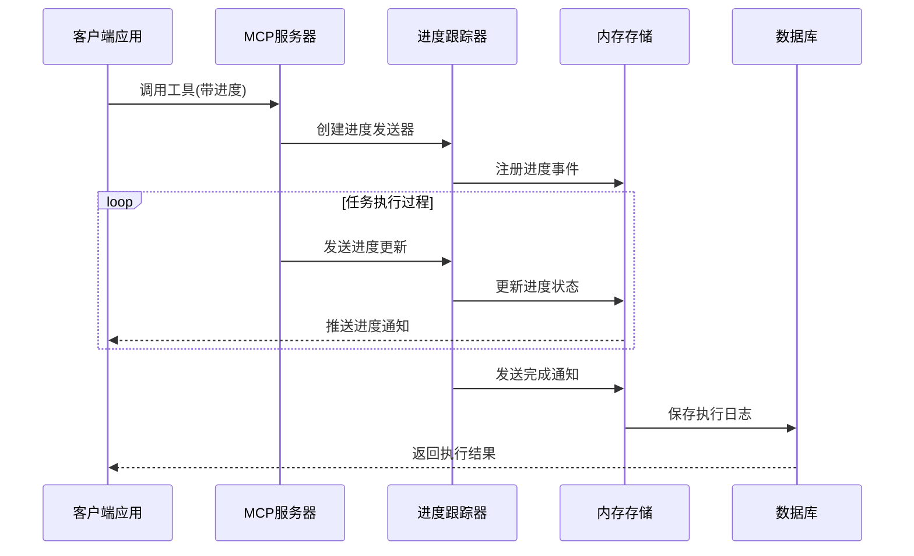
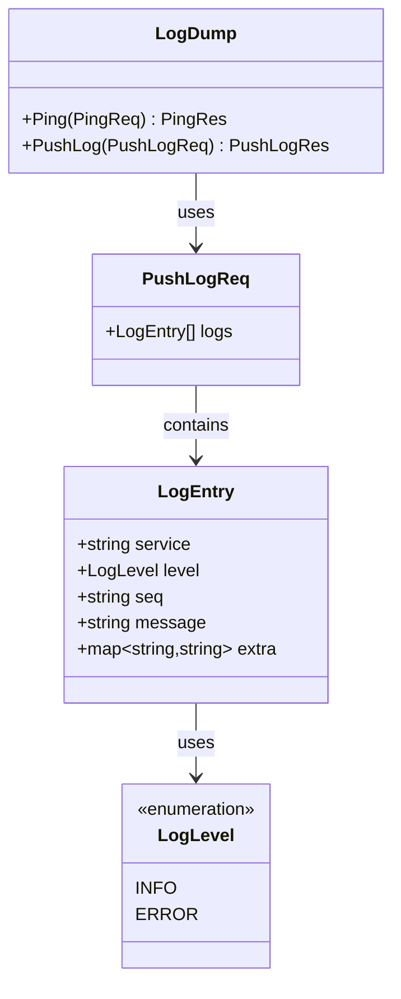
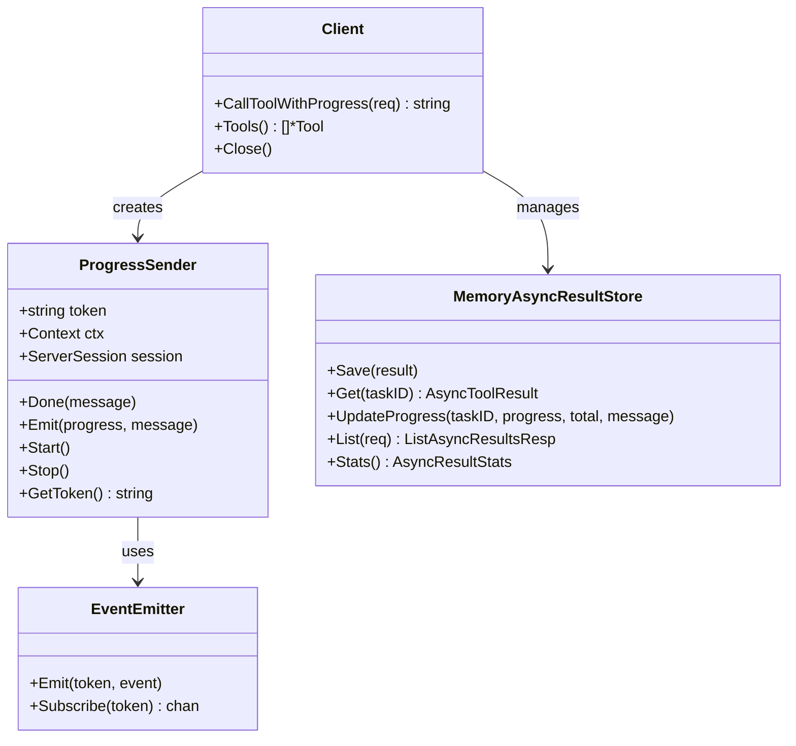
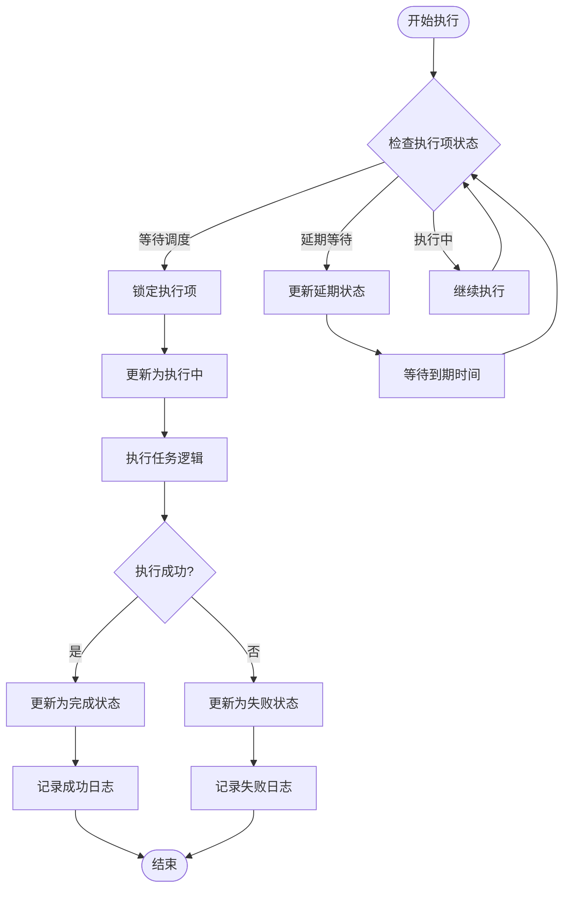
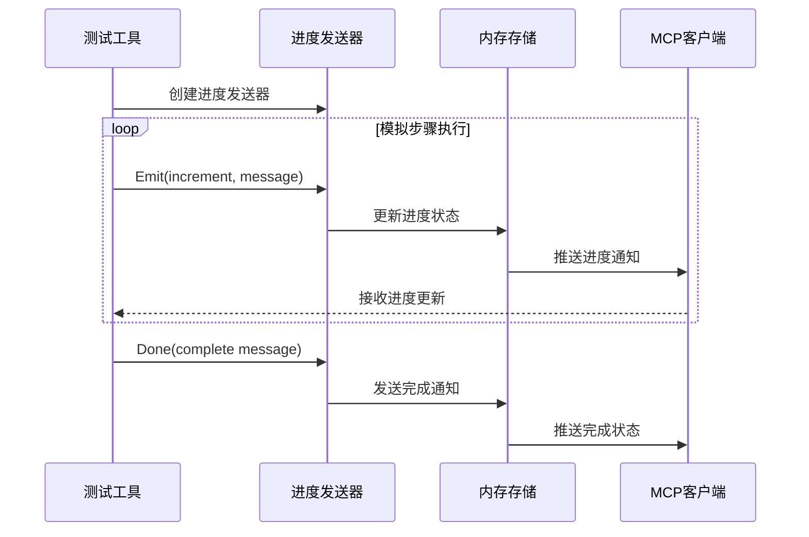
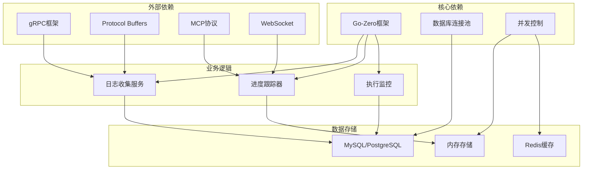

# 进度跟踪日志系统

<cite>
**本文档引用的文件**
- [logdump.proto](file://app/logdump/logdump/logdump.pb.go)
- [logdump_grpc.pb.go](file://app/logdump/logdump/logdump_grpc.pb.go)
- [planexeclogmodel.go](file://model/planexeclogmodel.go)
- [planexeclogmodel_gen.go](file://model/planexeclogmodel_gen.go)
- [planexecitemmodel.go](file://model/planexecitemmodel.go)
- [planexecitemmodel_gen.go](file://model/planexecitemmodel_gen.go)
- [getplanexecloglogic.go](file://app/trigger/internal/logic/getplanexecloglogic.go)
- [listplanexeclogslogic.go](file://app/trigger/internal/logic/listplanexeclogslogic.go)
- [testprogress.go](file://aiapp/mcpserver/internal/tools/testprogress.go)
- [wrapper.go](file://common/mcpx/wrapper.go)
- [memory_handler.go](file://common/mcpx/memory_handler.go)
- [client.go](file://common/mcpx/client.go)
</cite>

## 目录
1. [简介](#简介)
2. [项目结构](#项目结构)
3. [核心组件](#核心组件)
4. [架构概览](#架构概览)
5. [详细组件分析](#详细组件分析)
6. [依赖关系分析](#依赖关系分析)
7. [性能考虑](#性能考虑)
8. [故障排除指南](#故障排除指南)
9. [结论](#结论)

## 简介

进度跟踪日志系统是零服务架构中的一个关键组件，它提供了完整的任务执行进度监控和日志记录功能。该系统支持多种传输协议，包括gRPC、MCP（Model Context Protocol）和WebSocket，能够实时跟踪任务执行状态并提供详细的执行日志。

系统主要包含三个核心功能模块：
- **日志收集与存储**：通过gRPC服务收集各种服务的日志信息
- **进度跟踪**：基于MCP协议的进度通知和状态更新
- **执行监控**：计划执行项的状态管理和日志记录

## 项目结构

该项目采用模块化设计，按照功能领域进行组织：

**图表来源**
- [logdump.proto:318-346](file://app/logdump/logdump/logdump.pb.go#L318-L346)
- [planexeclogmodel_gen.go:1-200](file://model/planexeclogmodel_gen.go#L1-L200)
- [planexecitemmodel_gen.go:1-200](file://model/planexecitemmodel_gen.go#L1-L200)

**章节来源**
- [logdump.proto:318-346](file://app/logdump/logdump/logdump.pb.go#L318-L346)
- [planexeclogmodel.go:1-31](file://model/planexeclogmodel.go#L1-L31)
- [planexecitemmodel.go:1-435](file://model/planexecitemmodel.go#L1-L435)

## 核心组件

### 日志收集服务

日志收集服务是系统的核心组件，负责接收和处理来自各个服务的日志信息。该服务基于gRPC协议实现，提供了高效的二进制通信能力。

**主要特性：**
- 支持批量日志推送
- 实时心跳检测
- 结构化日志格式
- 多级别日志支持

### 进度跟踪系统

进度跟踪系统基于MCP协议构建，提供了强大的异步任务进度通知功能。系统包含完整的客户端-服务器架构，支持多服务器连接和负载均衡。

**核心组件：**
- **进度发送器**：负责发送进度通知和管理进度状态
- **内存存储**：提供临时的异步结果存储和进度跟踪
- **客户端管理**：统一管理多个MCP服务器的连接和路由

### 执行监控模型

系统提供了完整的数据库模型来跟踪计划执行状态和日志信息。这些模型支持复杂的查询操作和状态转换。

**数据模型：**
- **执行日志模型**：记录任务执行的详细信息和状态
- **执行项模型**：管理单个执行项的状态和生命周期

**章节来源**
- [logdump_grpc.pb.go:107-161](file://app/logdump/logdump/logdump_grpc.pb.go#L107-L161)
- [wrapper.go:19-125](file://common/mcpx/wrapper.go#L19-L125)
- [memory_handler.go:13-414](file://common/mcpx/memory_handler.go#L13-L414)

## 架构概览

系统采用分层架构设计，确保了良好的可扩展性和维护性：

**图表来源**
- [testprogress.go:31-90](file://aiapp/mcpserver/internal/tools/testprogress.go#L31-L90)
- [wrapper.go:91-125](file://common/mcpx/wrapper.go#L91-L125)
- [memory_handler.go:97-133](file://common/mcpx/memory_handler.go#L97-L133)

## 详细组件分析

### 日志收集服务实现

日志收集服务基于Protocol Buffers定义，提供了高效的数据序列化和反序列化能力。

**图表来源**
- [logdump.proto:320-346](file://app/logdump/logdump/logdump.pb.go#L320-L346)
- [logdump_grpc.pb.go:143-161](file://app/logdump/logdump/logdump_grpc.pb.go#L143-L161)

**章节来源**
- [logdump.proto:236-410](file://app/logdump/logdump/logdump.pb.go#L236-L410)
- [logdump_grpc.pb.go:107-161](file://app/logdump/logdump/logdump_grpc.pb.go#L107-L161)

### 进度跟踪器架构

进度跟踪器是系统的核心组件，负责管理异步任务的进度通知和状态跟踪。

**图表来源**
- [wrapper.go:34-125](file://common/mcpx/wrapper.go#L34-L125)
- [memory_handler.go:13-414](file://common/mcpx/memory_handler.go#L13-L414)
- [client.go:25-83](file://common/mcpx/client.go#L25-L83)

**章节来源**
- [wrapper.go:19-125](file://common/mcpx/wrapper.go#L19-L125)
- [memory_handler.go:1-414](file://common/mcpx/memory_handler.go#L1-L414)
- [client.go:1-800](file://common/mcpx/client.go#L1-L800)

### 执行日志管理系统

执行日志管理系统提供了完整的计划执行状态跟踪和日志记录功能。

**图表来源**
- [planexecitemmodel.go:74-144](file://model/planexecitemmodel.go#L74-L144)
- [planexecitemmodel.go:165-271](file://model/planexecitemmodel.go#L165-L271)

**章节来源**
- [planexeclogmodel.go:1-31](file://model/planexeclogmodel.go#L1-L31)
- [planexecitemmodel.go:1-435](file://model/planexecitemmodel.go#L1-L435)

### 测试进度工具

系统提供了一个测试进度工具，用于演示和验证进度跟踪功能。

**图表来源**
- [testprogress.go:31-90](file://aiapp/mcpserver/internal/tools/testprogress.go#L31-L90)
- [wrapper.go:68-89](file://common/mcpx/wrapper.go#L68-L89)

**章节来源**
- [testprogress.go:1-91](file://aiapp/mcpserver/internal/tools/testprogress.go#L1-L91)

## 依赖关系分析

系统采用了清晰的依赖层次结构，确保了模块间的松耦合和高内聚。

**图表来源**
- [logdump.proto:318-346](file://app/logdump/logdump/logdump.pb.go#L318-L346)
- [client.go:1-800](file://common/mcpx/client.go#L1-L800)

**章节来源**
- [planexeclogmodel_gen.go:1-200](file://model/planexeclogmodel_gen.go#L1-L200)
- [planexecitemmodel_gen.go:1-200](file://model/planexecitemmodel_gen.go#L1-L200)

## 性能考虑

系统在设计时充分考虑了性能优化，采用了多种策略来提升整体性能：

### 并发处理
- 使用goroutine池管理并发任务
- 实现非阻塞的事件驱动架构
- 采用异步处理模式减少等待时间

### 缓存策略
- 内存存储提供快速的临时数据访问
- 进度状态缓存减少数据库压力
- 连接池复用提高网络效率

### 数据优化
- 批量日志处理减少I/O操作
- 压缩传输数据降低网络开销
- 合理的索引设计优化查询性能

## 故障排除指南

### 常见问题及解决方案

**进度通知丢失**
- 检查MCP服务器连接状态
- 验证进度发送器的生命周期管理
- 确认内存存储的过期设置

**日志收集异常**
- 验证gRPC服务端口和地址配置
- 检查Protocol Buffers编译结果
- 确认防火墙和网络策略设置

**执行监控延迟**
- 优化数据库查询语句
- 调整并发处理参数
- 检查系统资源使用情况

**章节来源**
- [memory_handler.go:33-54](file://common/mcpx/memory_handler.go#L33-L54)
- [logdump_grpc.pb.go:107-161](file://app/logdump/logdump/logdump_grpc.pb.go#L107-L161)

## 结论

进度跟踪日志系统是一个功能完整、架构清晰的分布式监控解决方案。系统通过模块化设计实现了高度的可扩展性和可维护性，同时提供了丰富的功能来满足各种监控需求。

**主要优势：**
- 多协议支持，适应不同场景需求
- 异步处理架构，保证高并发性能
- 完整的生命周期管理，确保数据一致性
- 灵活的配置选项，便于集成和部署

**未来发展方向：**
- 增强数据分析和可视化功能
- 扩展更多的传输协议支持
- 优化大规模部署的性能表现
- 提供更丰富的告警和通知机制

该系统为零服务架构提供了坚实的监控基础，能够有效支撑各种复杂应用场景的需求。