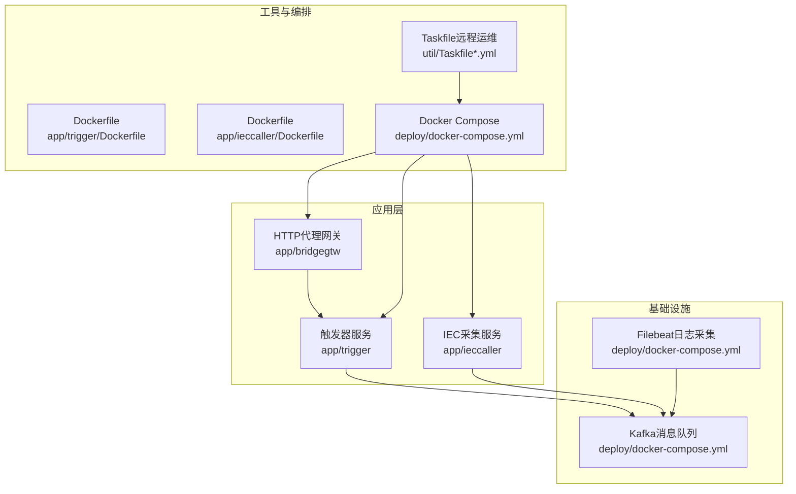
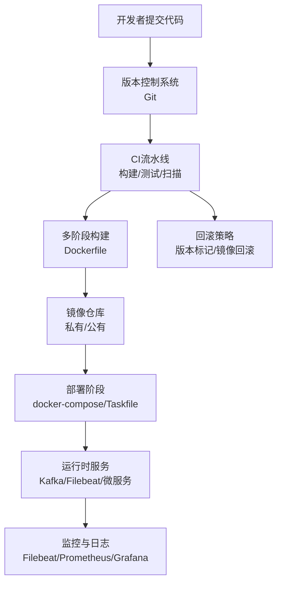
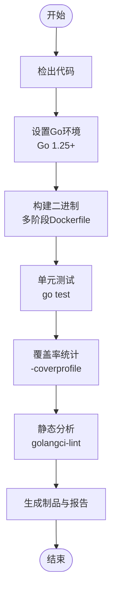
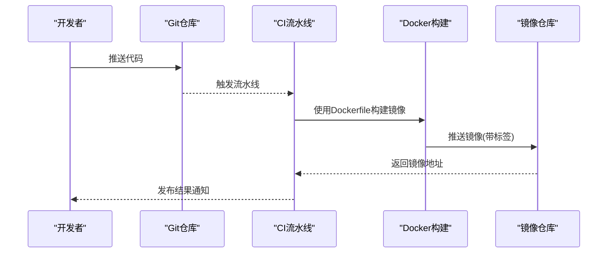
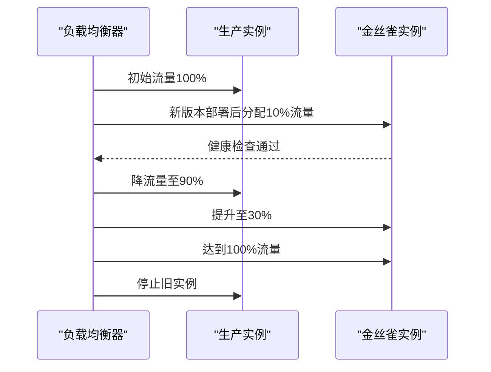
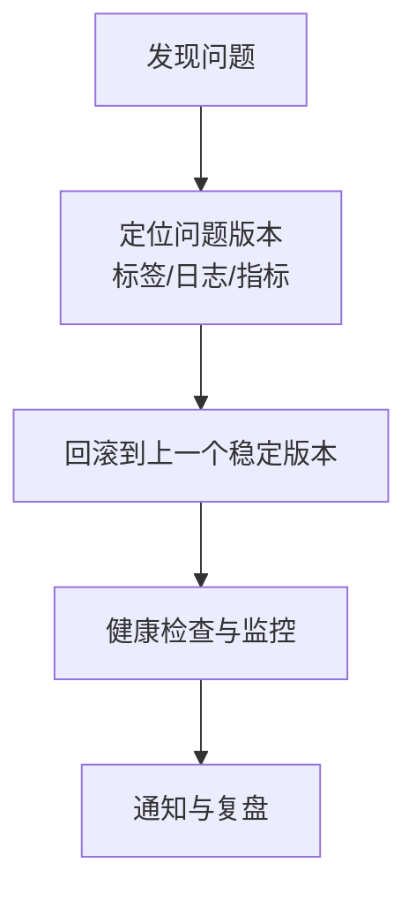
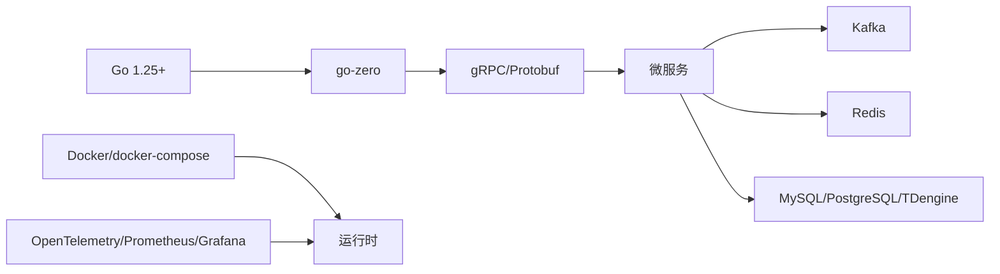

# CI/CD持续集成流水线

<cite>
**本文引用的文件**
- [README.md](file://README.md)
- [go.mod](file://go.mod)
- [deploy/docker-compose.yml](file://deploy/docker-compose.yml)
- [util/Taskfile.yml](file://util/Taskfile.yml)
- [util/Taskfile-docker.yml](file://util/Taskfile-docker.yml)
- [util/Taskfile-135.yml](file://util/Taskfile-135.yml)
- [app/trigger/Dockerfile](file://app/trigger/Dockerfile)
- [app/ieccaller/Dockerfile](file://app/ieccaller/Dockerfile)
- [app/trigger/etc/trigger.yaml](file://app/trigger/etc/trigger.yaml)
- [app/bridgegtw/etc/bridgegtw.yaml](file://app/bridgegtw/etc/bridgegtw.yaml)
- [.trae/skills/zero-skills/examples/verify-tutorial.sh](file://.trae/skills/zero-skills/examples/verify-tutorial.sh)
</cite>

## 目录
1. [简介](#简介)
2. [项目结构](#项目结构)
3. [核心组件](#核心组件)
4. [架构总览](#架构总览)
5. [详细组件分析](#详细组件分析)
6. [依赖分析](#依赖分析)
7. [性能考虑](#性能考虑)
8. [故障排除指南](#故障排除指南)
9. [结论](#结论)
10. [附录](#附录)

## 简介
本指南面向Zero-Service项目的CI/CD持续集成流水线建设，围绕自动化构建、单元测试、代码覆盖率检查、静态分析、镜像构建与推送、部署策略（蓝绿/滚动/金丝雀）以及回滚与版本管理进行系统化设计。结合项目现有Dockerfile、docker-compose编排、Taskfile远程运维脚本与服务配置，提供可落地的流水线实施方案与最佳实践。

## 项目结构
项目采用多服务微架构，每个服务均提供独立的Dockerfile与配置文件，便于在流水线中分别构建与部署。核心目录与职责如下：
- app/*：各微服务源码与配置，每个服务包含Dockerfile与etc配置
- deploy：Docker Compose编排与共享资源（如Kafka、Filebeat）
- util：Taskfile远程运维脚本，支持SSH远程控制容器编排
- docs/swagger：服务API文档与协议定义
- third_party：第三方Proto定义与生成脚本

**图表来源**
- [deploy/docker-compose.yml:1-110](file://deploy/docker-compose.yml#L1-L110)
- [app/trigger/Dockerfile:1-42](file://app/trigger/Dockerfile#L1-L42)
- [app/ieccaller/Dockerfile:1-42](file://app/ieccaller/Dockerfile#L1-L42)
- [util/Taskfile.yml:1-33](file://util/Taskfile.yml#L1-L33)
- [util/Taskfile-docker.yml:1-37](file://util/Taskfile-docker.yml#L1-L37)
- [util/Taskfile-135.yml:1-37](file://util/Taskfile-135.yml#L1-L37)

**章节来源**
- [README.md:59-108](file://README.md#L59-L108)
- [deploy/docker-compose.yml:1-110](file://deploy/docker-compose.yml#L1-L110)

## 核心组件
- 多阶段构建Dockerfile：所有服务均采用golang:alpine基础镜像进行构建，并最终拷贝至scratch最小运行时镜像，确保镜像体积小、安全基线高。
- Docker Compose编排：集中管理Kafka、Filebeat与核心服务，支持环境变量注入与持久化卷挂载。
- Taskfile远程运维：通过SSH对远端服务器执行docker compose命令，实现远程一键启停与重启。
- 服务配置文件：每个服务提供独立yaml配置，包含日志、超时、上游服务、数据库与Redis连接等。

**章节来源**
- [app/trigger/Dockerfile:1-42](file://app/trigger/Dockerfile#L1-L42)
- [app/ieccaller/Dockerfile:1-42](file://app/ieccaller/Dockerfile#L1-L42)
- [deploy/docker-compose.yml:1-110](file://deploy/docker-compose.yml#L1-L110)
- [util/Taskfile-docker.yml:1-37](file://util/Taskfile-docker.yml#L1-L37)
- [app/trigger/etc/trigger.yaml:1-37](file://app/trigger/etc/trigger.yaml#L1-L37)
- [app/bridgegtw/etc/bridgegtw.yaml:1-40](file://app/bridgegtw/etc/bridgegtw.yaml#L1-L40)

## 架构总览
下图展示了CI/CD流水线与运行时架构的映射关系，强调从代码提交到镜像构建、推送、部署与回滚的关键节点。

**图表来源**
- [deploy/docker-compose.yml:1-110](file://deploy/docker-compose.yml#L1-L110)
- [util/Taskfile-docker.yml:1-37](file://util/Taskfile-docker.yml#L1-L37)
- [app/trigger/Dockerfile:1-42](file://app/trigger/Dockerfile#L1-L42)

## 详细组件分析

### 自动化构建流程
- 代码编译：基于Go 1.25+，使用golang:alpine作为构建基础镜像，禁用CGO，减少二进制体积与依赖。
- 单元测试：建议在流水线中添加go test命令，覆盖核心包与服务逻辑。
- 代码覆盖率：使用go test -coverprofile=coverage.out生成覆盖率报告，结合codecov或SonarQube上传。
- 静态分析：集成golangci-lint，检查语法、复杂度、安全问题与未使用代码。

**图表来源**
- [app/trigger/Dockerfile:1-42](file://app/trigger/Dockerfile#L1-L42)
- [go.mod:1-62](file://go.mod#L1-L62)

**章节来源**
- [go.mod:1-62](file://go.mod#L1-L62)
- [app/trigger/Dockerfile:1-42](file://app/trigger/Dockerfile#L1-L42)

### 镜像构建与推送策略
- 多阶段构建：构建阶段使用golang:alpine，运行时阶段拷贝至scratch，仅保留必要证书与时区数据。
- 镜像标签管理：建议采用语义化版本（v1.2.3）与时间戳（v1.2.3-YYYYMMDD）组合，配合短commit hash作为预发布标识。
- 私有仓库配置：在流水线中配置镜像仓库凭据，使用${REGISTER}与${MAIN_TAG}变量注入镜像前缀与标签。
- 推送策略：主分支推送稳定标签，PR触发预发布标签；失败不覆盖已有标签。

**图表来源**
- [deploy/docker-compose.yml:54-109](file://deploy/docker-compose.yml#L54-L109)
- [app/trigger/Dockerfile:1-42](file://app/trigger/Dockerfile#L1-L42)

**章节来源**
- [deploy/docker-compose.yml:54-109](file://deploy/docker-compose.yml#L54-L109)
- [app/trigger/Dockerfile:1-42](file://app/trigger/Dockerfile#L1-L42)

### 部署策略设计
- 蓝绿部署：通过两套相同配置的服务实例（如trigger-v1与trigger-v2），利用外部负载均衡器切换流量，实现零停机切换。
- 滚动更新：在docker-compose中使用restart策略与健康检查，逐步替换容器，降低风险。
- 金丝雀发布：通过不同镜像标签与环境变量区分流量比例，先对小部分用户放量，再逐步扩大。

**图表来源**
- [deploy/docker-compose.yml:54-109](file://deploy/docker-compose.yml#L54-L109)

**章节来源**
- [deploy/docker-compose.yml:54-109](file://deploy/docker-compose.yml#L54-L109)

### 回滚机制与版本管理
- 发布记录：在制品库中记录镜像标签、构建时间、commit hash与变更摘要。
- 变更追踪：结合Git标签与PR描述，建立版本与功能的映射关系。
- 影响评估：通过服务依赖图（如Kafka消费者组、上游gRPC调用链）评估回滚范围。
- 快速回滚：利用Taskfile远程运维脚本，一键切换镜像标签并重启服务。

**图表来源**
- [util/Taskfile-docker.yml:1-37](file://util/Taskfile-docker.yml#L1-L37)
- [deploy/docker-compose.yml:54-109](file://deploy/docker-compose.yml#L54-L109)

**章节来源**
- [util/Taskfile-docker.yml:1-37](file://util/Taskfile-docker.yml#L1-L37)
- [deploy/docker-compose.yml:54-109](file://deploy/docker-compose.yml#L54-L109)

### 流水线配置模板与环境变量
- 环境变量
  - REGISTER：镜像仓库前缀（如registry.example.com/zero-service）
  - MAIN_TAG：镜像标签（如v1.2.3、latest）
  - SSH_USER/SSH_HOST/SSH_PORT/SSH_PASSWORD：远程docker-compose操作凭据
  - DOCKER_COMPOSE_PATH：远端compose文件路径
  - SERVICE_NAME：目标服务名称
- 关键步骤
  - 代码检出与依赖安装
  - 多阶段构建与测试
  - 静态分析与覆盖率上报
  - 镜像构建与标签管理
  - 推送到镜像仓库
  - 部署到目标环境（本地或远端）

**章节来源**
- [deploy/docker-compose.yml:54-109](file://deploy/docker-compose.yml#L54-L109)
- [util/Taskfile-docker.yml:1-37](file://util/Taskfile-docker.yml#L1-L37)
- [util/Taskfile-135.yml:1-37](file://util/Taskfile-135.yml#L1-L37)

### 安全最佳实践
- 最小权限：CI账号仅授予构建与推送权限，避免过度授权。
- 凭据管理：使用密钥管理服务或流水线内置加密变量存储敏感信息。
- 镜像安全：定期扫描镜像漏洞，优先使用官方基础镜像与固定版本。
- 网络隔离：将Kafka、Redis、数据库置于受控网络，限制暴露端口。
- 配置注入：通过环境变量与只读配置卷注入服务配置，避免硬编码。

**章节来源**
- [app/trigger/etc/trigger.yaml:1-37](file://app/trigger/etc/trigger.yaml#L1-L37)
- [app/bridgegtw/etc/bridgegtw.yaml:1-40](file://app/bridgegtw/etc/bridgegtw.yaml#L1-L40)

## 依赖分析
- 语言与框架：Go 1.25+，go-zero微服务框架，gRPC/Protocol Buffers。
- 中间件：Kafka（消息队列）、Redis（任务队列与缓存）、MySQL/PostgreSQL/TDengine（数据库）。
- 运维工具：Docker、docker-compose、Taskfile、OpenTelemetry/Prometheus/Grafana（可观测性）。

**图表来源**
- [go.mod:1-62](file://go.mod#L1-L62)
- [deploy/docker-compose.yml:1-110](file://deploy/docker-compose.yml#L1-L110)

**章节来源**
- [go.mod:1-62](file://go.mod#L1-L62)
- [deploy/docker-compose.yml:1-110](file://deploy/docker-compose.yml#L1-L110)

## 性能考虑
- 构建性能：启用Go构建缓存与并行测试，合理拆分服务以缩短构建时间。
- 镜像大小：继续沿用scratch运行时镜像，减少攻击面与启动时间。
- 资源限制：在docker-compose中设置mem_limit与CPU配额，避免资源争用。
- 网络优化：将Kafka与Filebeat部署在同一主机或子网，降低网络延迟。

**章节来源**
- [deploy/docker-compose.yml:54-109](file://deploy/docker-compose.yml#L54-L109)
- [app/trigger/Dockerfile:1-42](file://app/trigger/Dockerfile#L1-L42)

## 故障排除指南
- 构建失败：检查Go版本与依赖安装，确认Dockerfile中的代理参数与GOPROXY配置。
- 镜像推送失败：核对镜像仓库凭据与网络连通性，确认标签命名规范。
- 远程部署失败：使用Taskfile脚本验证SSH连通性与docker-compose路径，检查服务名拼写。
- 服务启动异常：查看服务配置文件（如trigger.yaml、bridgegtw.yaml）的日志路径与超时设置，确认上游依赖（Kafka/Redis/DB）可达。

**章节来源**
- [util/Taskfile-docker.yml:1-37](file://util/Taskfile-docker.yml#L1-L37)
- [app/trigger/etc/trigger.yaml:1-37](file://app/trigger/etc/trigger.yaml#L1-L37)
- [app/bridgegtw/etc/bridgegtw.yaml:1-40](file://app/bridgegtw/etc/bridgegtw.yaml#L1-L40)

## 结论
通过将多阶段构建、统一的docker-compose编排与Taskfile远程运维相结合，Zero-Service可以实现高效、可追溯且安全的CI/CD流水线。建议在现有基础上补充单元测试、覆盖率与静态分析步骤，并完善蓝绿/金丝雀发布与自动回滚机制，以进一步提升交付质量与稳定性。

## 附录
- 验证教程脚本：提供AI工具配置验证示例，可用于流水线中集成开发环境一致性检查。

**章节来源**
- [.trae/skills/zero-skills/examples/verify-tutorial.sh:58-256](file://.trae/skills/zero-skills/examples/verify-tutorial.sh#L58-L256)