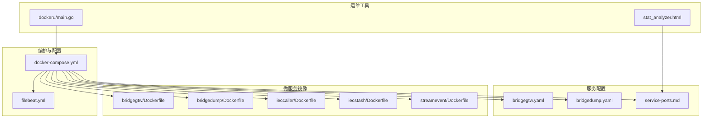
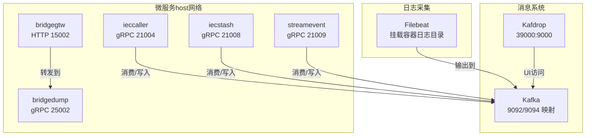
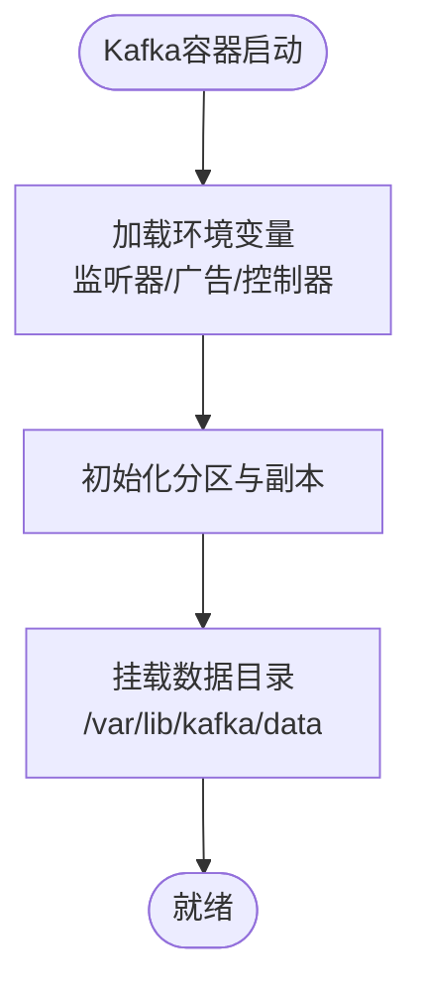
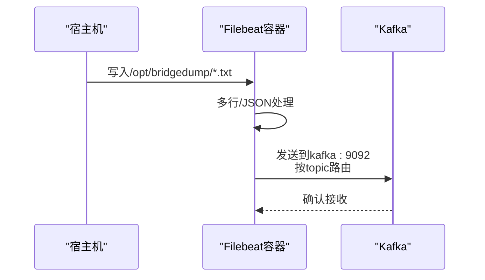
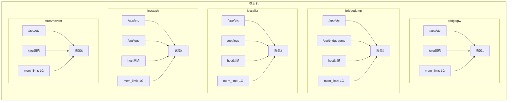
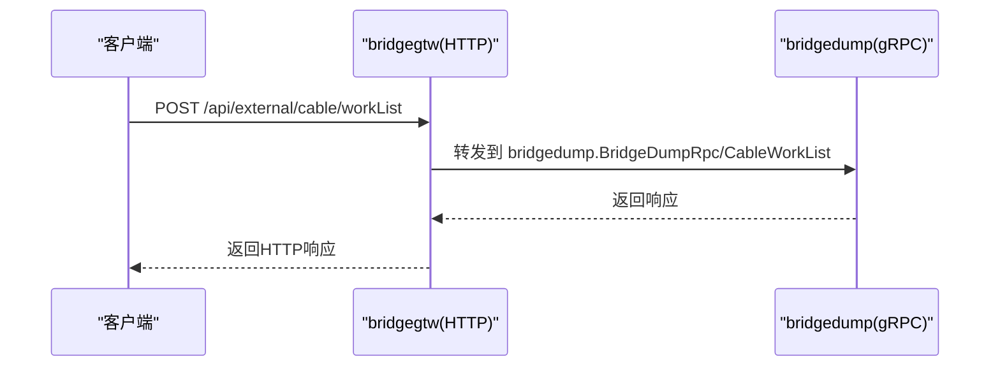
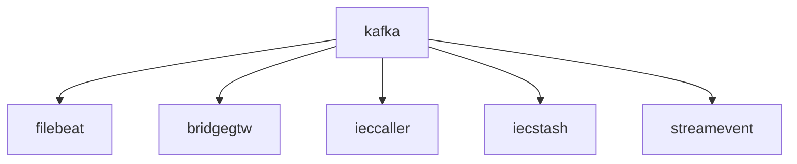

# Docker容器部署

<cite>
**本文引用的文件**   
- [deploy/docker-compose.yml](file://deploy/docker-compose.yml)
- [deploy/filebeat/conf/filebeat.yml](file://deploy/filebeat/conf/filebeat.yml)
- [app/bridgegtw/Dockerfile](file://app/bridgegtw/Dockerfile)
- [app/bridgedump/Dockerfile](file://app/bridgedump/Dockerfile)
- [app/ieccaller/Dockerfile](file://app/ieccaller/Dockerfile)
- [app/iecstash/Dockerfile](file://app/iecstash/Dockerfile)
- [facade/streamevent/Dockerfile](file://facade/streamevent/Dockerfile)
- [app/bridgegtw/etc/bridgegtw.yaml](file://app/bridgegtw/etc/bridgegtw.yaml)
- [app/bridgedump/etc/bridgedump.yaml](file://app/bridgedump/etc/bridgedump.yaml)
- [docs/service-ports.md](file://docs/service-ports.md)
- [util/dockeru/main.go](file://util/dockeru/main.go)
- [deploy/stat_analyzer.html](file://deploy/stat_analyzer.html)
</cite>

## 目录
1. [简介](#简介)
2. [项目结构](#项目结构)
3. [核心组件](#核心组件)
4. [架构总览](#架构总览)
5. [详细组件分析](#详细组件分析)
6. [依赖关系分析](#依赖关系分析)
7. [性能考量](#性能考量)
8. [故障排查指南](#故障排查指南)
9. [结论](#结论)
10. [附录](#附录)

## 简介
本技术文档面向Zero-Service的Docker容器化部署，聚焦于docker-compose编排配置与生产落地细节。内容涵盖：
- Kafka消息队列集群配置与持久化策略
- Filebeat日志采集器设置与输出至Kafka
- 微服务容器的网络模式（host模式）、资源限制与数据卷挂载
- 容器间依赖关系、启动顺序、健康检查与故障恢复策略
- 完整部署命令、配置模板与常见问题解决方案
- 容器监控、日志管理与资源优化最佳实践

## 项目结构
与Docker部署直接相关的目录与文件如下：
- 部署编排与配置
  - deploy/docker-compose.yml：Kafka、Filebeat、Kafdrop以及各微服务容器的编排定义
  - deploy/filebeat/conf/filebeat.yml：Filebeat输入、处理与输出配置
- 微服务镜像构建
  - app/*/Dockerfile：各微服务基于多阶段构建的镜像定义
- 服务配置与端口
  - app/*/etc/*.yaml：各服务配置文件（如网关、RPC监听等）
  - docs/service-ports.md：服务端口清单与段位规划
- 运维辅助工具
  - util/dockeru/main.go：容器运维交互工具（日志、启停、镜像管理等）
  - deploy/stat_analyzer.html：Go-Zero Stats日志分析工具（便于性能与资源分析）

**图表来源**
- [deploy/docker-compose.yml:1-110](file://deploy/docker-compose.yml#L1-L110)
- [deploy/filebeat/conf/filebeat.yml:1-122](file://deploy/filebeat/conf/filebeat.yml#L1-L122)
- [app/bridgegtw/Dockerfile:1-43](file://app/bridgegtw/Dockerfile#L1-L43)
- [app/bridgedump/Dockerfile:1-42](file://app/bridgedump/Dockerfile#L1-L42)
- [app/ieccaller/Dockerfile:1-42](file://app/ieccaller/Dockerfile#L1-L42)
- [app/iecstash/Dockerfile:1-42](file://app/iecstash/Dockerfile#L1-L42)
- [facade/streamevent/Dockerfile:1-42](file://facade/streamevent/Dockerfile#L1-L42)
- [app/bridgegtw/etc/bridgegtw.yaml:1-40](file://app/bridgegtw/etc/bridgegtw.yaml#L1-L40)
- [app/bridgedump/etc/bridgedump.yaml:1-10](file://app/bridgedump/etc/bridgedump.yaml#L1-L10)
- [docs/service-ports.md:1-53](file://docs/service-ports.md#L1-L53)
- [util/dockeru/main.go:1-448](file://util/dockeru/main.go#L1-L448)
- [deploy/stat_analyzer.html:1-800](file://deploy/stat_analyzer.html#L1-L800)

**章节来源**
- [deploy/docker-compose.yml:1-110](file://deploy/docker-compose.yml#L1-L110)
- [deploy/filebeat/conf/filebeat.yml:1-122](file://deploy/filebeat/conf/filebeat.yml#L1-L122)

## 核心组件
- Kafka消息队列（单节点开发集群）
  - 监听端口：容器内9094，宿主映射9092；另提供外部访问监听9094
  - 控制器端口：9093；监听器映射：CONTROLLER/PLAINTEXT/PLAINTEXT_CONTAINER
  - 分区数：3；副本因子：1（开发环境）
  - 数据目录：/var/lib/kafka/data（挂载宿主路径）
- Filebeat日志采集器
  - 输入：监听/opt/bridgedump/下多个子目录的JSON文件，按topic路由到不同Kafka主题
  - 处理：多行匹配、JSON解码、字段清洗、丢弃无效事件
  - 输出：发送到kafka:9092，按fields.topic动态选择主题
  - 宿主挂载：/var/lib/docker/containers（采集容器日志）
- 微服务容器（host网络模式）
  - bridgegtw：HTTP网关，转发到本地gRPC服务
  - bridgedump：gRPC服务，负责数据转储
  - ieccaller：IEC104主站调用
  - iecstash：IEC104数据合并
  - streamevent：流事件聚合
  - 各容器均使用host网络，挂载/etc与日志目录，设置内存上限1G

**章节来源**
- [deploy/docker-compose.yml:4-110](file://deploy/docker-compose.yml#L4-L110)
- [deploy/filebeat/conf/filebeat.yml:1-122](file://deploy/filebeat/conf/filebeat.yml#L1-L122)
- [app/bridgegtw/etc/bridgegtw.yaml:1-40](file://app/bridgegtw/etc/bridgegtw.yaml#L1-L40)
- [app/bridgedump/etc/bridgedump.yaml:1-10](file://app/bridgedump/etc/bridgedump.yaml#L1-L10)
- [docs/service-ports.md:1-53](file://docs/service-ports.md#L1-L53)

## 架构总览
下图展示了容器编排的整体关系：Kafka作为消息中枢，Filebeat从桥接数据目录采集并投递到Kafka；各微服务通过host网络直接监听宿主机端口，实现低延迟与简化网络拓扑。

**图表来源**
- [deploy/docker-compose.yml:4-110](file://deploy/docker-compose.yml#L4-L110)
- [deploy/filebeat/conf/filebeat.yml:109-122](file://deploy/filebeat/conf/filebeat.yml#L109-L122)
- [docs/service-ports.md:14-35](file://docs/service-ports.md#L14-L35)

## 详细组件分析

### Kafka编排与配置
- 端口映射
  - 9092:9092（宿主到容器内部监听）
  - 9094:9094（外部访问监听）
- 监听器与广告地址
  - 容器内监听：9094（PLAINTXT），控制器：9093（CONTROLLER）
  - 广告地址：外部10.10.1.213:9094，容器内kafka:9092
- 性能与可靠性
  - 分区：3；偏移/事务复制因子：1；最小ISR：1
  - 平衡延迟：0；日志目录：/var/lib/kafka/data
- 数据持久化
  - 挂载：./data/kafka/data -> /var/lib/kafka/data

**图表来源**
- [deploy/docker-compose.yml:13-30](file://deploy/docker-compose.yml#L13-L30)

**章节来源**
- [deploy/docker-compose.yml:4-30](file://deploy/docker-compose.yml#L4-L30)

### Filebeat日志采集
- 输入
  - 监听/opt/bridgedump/下的cable_work_list、cable_fault、cable_fault_wave子目录
  - 多行匹配与JSON解码，清洗后保留关键字段
- 输出
  - 发送到kafka:9092，主题由fields.topic动态决定
- 宿主挂载
  - /var/lib/docker/containers（采集容器日志）
  - /home/root/app/etc/filebeat.yml（挂载配置）
- 依赖
  - depends_on: kafka（确保Kafka先启动）

**图表来源**
- [deploy/docker-compose.yml:32-53](file://deploy/docker-compose.yml#L32-L53)
- [deploy/filebeat/conf/filebeat.yml:4-122](file://deploy/filebeat/conf/filebeat.yml#L4-L122)

**章节来源**
- [deploy/docker-compose.yml:32-53](file://deploy/docker-compose.yml#L32-L53)
- [deploy/filebeat/conf/filebeat.yml:1-122](file://deploy/filebeat/conf/filebeat.yml#L1-L122)

### 微服务容器（host网络模式）
- 网络模式
  - network_mode: host（容器与宿主机共享网络命名空间）
- 资源限制
  - mem_limit: 1G（防止资源争抢）
- 数据卷
  - /home/root/app/etc -> /app/etc（服务配置）
  - bridgedump容器额外挂载/opt/bridgedump（桥接数据目录）
- 环境变量
  - TZ=Asia/Shanghai（统一时区）
- 依赖
  - depends_on: kafka（确保Kafka可用后再启动）

**图表来源**
- [deploy/docker-compose.yml:54-110](file://deploy/docker-compose.yml#L54-L110)

**章节来源**
- [deploy/docker-compose.yml:54-110](file://deploy/docker-compose.yml#L54-L110)

### 网关与RPC服务配置
- bridgegtw（HTTP网关）
  - 监听0.0.0.0:15002
  - 上游gRPC：127.0.0.1:25002（bridgedump）
  - 映射REST路径到对应RPC方法
- bridgedump（gRPC服务）
  - 监听0.0.0.0:25002
  - 日志与转储路径配置

**图表来源**
- [app/bridgegtw/etc/bridgegtw.yaml:25-40](file://app/bridgegtw/etc/bridgegtw.yaml#L25-L40)
- [app/bridgedump/etc/bridgedump.yaml:1-10](file://app/bridgedump/etc/bridgedump.yaml#L1-L10)

**章节来源**
- [app/bridgegtw/etc/bridgegtw.yaml:1-40](file://app/bridgegtw/etc/bridgegtw.yaml#L1-L40)
- [app/bridgedump/etc/bridgedump.yaml:1-10](file://app/bridgedump/etc/bridgedump.yaml#L1-L10)
- [docs/service-ports.md:14-35](file://docs/service-ports.md#L14-L35)

### 端口与服务映射
- 端口段规划
  - HTTP网关层：11001–11004
  - gRPC核心服务：21001–21010
  - 桥接/扩展服务：25002–25008
  - 特例：alarm.rpc 8080（独立段）
- bridgegtw对外暴露HTTP端口15002，供上游网关转发

**章节来源**
- [docs/service-ports.md:1-53](file://docs/service-ports.md#L1-L53)

## 依赖关系分析
- 启动顺序
  1) kafka
  2) filebeat（依赖kafka）
  3) 各微服务（依赖kafka）
- 依赖声明
  - docker-compose中通过depends_on声明依赖
- 端口冲突与隔离
  - host网络模式下，各服务监听不同端口，避免冲突
- 数据卷与配置
  - 所有服务挂载/etc配置目录，便于热更新与一致性

**图表来源**
- [deploy/docker-compose.yml:54-110](file://deploy/docker-compose.yml#L54-L110)

**章节来源**
- [deploy/docker-compose.yml:54-110](file://deploy/docker-compose.yml#L54-L110)

## 性能考量
- Kafka
  - 开发环境副本因子=1，分区=3；适合小规模测试
  - 建议生产环境提升副本因子与分区数，配合磁盘IO优化
- Filebeat
  - 多行与JSON解析会带来CPU开销；可通过调整scan_frequency与close_inactive平衡实时性与资源消耗
  - 输出压缩gzip可降低带宽，但会增加CPU
- 微服务
  - host网络减少NAT与转发开销，提升吞吐
  - mem_limit限制内存，避免雪崩效应
  - 建议为高负载服务单独规划资源池与隔离策略

[本节为通用指导，无需具体文件引用]

## 故障排查指南
- 容器运维工具
  - util/dockeru/main.go提供容器/镜像管理与日志查看能力，支持交互式执行与批量操作
- 常见问题
  - Kafka不可达：检查KAFKA_ADVERTISED_LISTENERS与宿主机IP一致
  - Filebeat无法连接Kafka：确认hosts与端口映射正确，输出配置中的topic与消费者组
  - bridgegtw 404/500：确认上游gRPC端点可达且映射路径正确
  - host网络端口冲突：核对service-ports.md与实际宿主机占用情况
- 日志分析
  - 使用deploy/stat_analyzer.html解析Go-Zero Stats日志，定位内存、CPU、QPS与限流状态异常

**章节来源**
- [util/dockeru/main.go:1-448](file://util/dockeru/main.go#L1-L448)
- [deploy/stat_analyzer.html:1-800](file://deploy/stat_analyzer.html#L1-L800)

## 结论
本文档提供了Zero-Service在Docker环境下的完整部署蓝图：以Kafka为核心的消息通道、以Filebeat为入口的日志体系、以host网络模式实现的高性能微服务编排。通过明确的依赖关系、数据卷策略与资源限制，可在保证稳定性的同时获得良好的性能表现。建议在生产环境中进一步完善Kafka高可用、Filebeat输出与微服务健康检查机制，并结合日志分析工具持续优化资源与性能。

[本节为总结性内容，无需具体文件引用]

## 附录

### 部署命令与步骤
- 构建镜像（示例，按需替换服务名）
  - docker build -f app/bridgegtw/Dockerfile -t bridgegtw:latest .
- 启动编排
  - docker compose up -d
- 查看状态
  - docker compose ps
- 查看日志
  - docker compose logs -f kafka
  - docker compose logs -f filebeat
- 停止与清理
  - docker compose down

**章节来源**
- [deploy/docker-compose.yml:1-110](file://deploy/docker-compose.yml#L1-L110)

### 配置模板与要点
- Kafka环境变量关键项
  - KAFKA_NODE_ID、KAFKA_PROCESS_ROLES、KAFKA_LISTENERS、KAFKA_ADVERTISED_LISTENERS、KAFKA_CONTROLLER_LISTENER_NAMES、KAFKA_CONTROLLER_QUORUM_VOTERS、KAFKA_OFFSETS_TOPIC_REPLICATION_FACTOR、KAFKA_NUM_PARTITIONS、KAFKA_LOG_DIRS
- Filebeat输入/处理/输出
  - 输入路径、多行匹配、JSON解码、字段清洗、输出到kafka
- 微服务容器
  - host网络、mem_limit、挂载/etc与日志/数据目录、TZ=Asia/Shanghai

**章节来源**
- [deploy/docker-compose.yml:13-30](file://deploy/docker-compose.yml#L13-L30)
- [deploy/filebeat/conf/filebeat.yml:4-122](file://deploy/filebeat/conf/filebeat.yml#L4-L122)