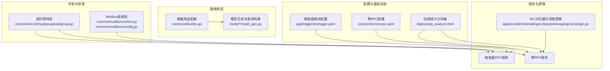
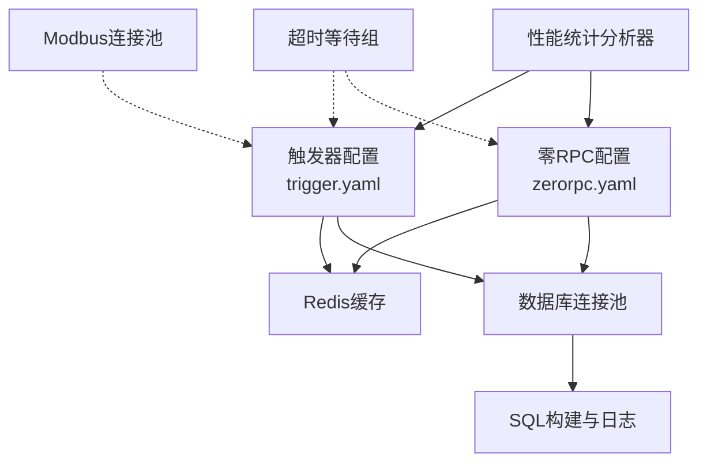
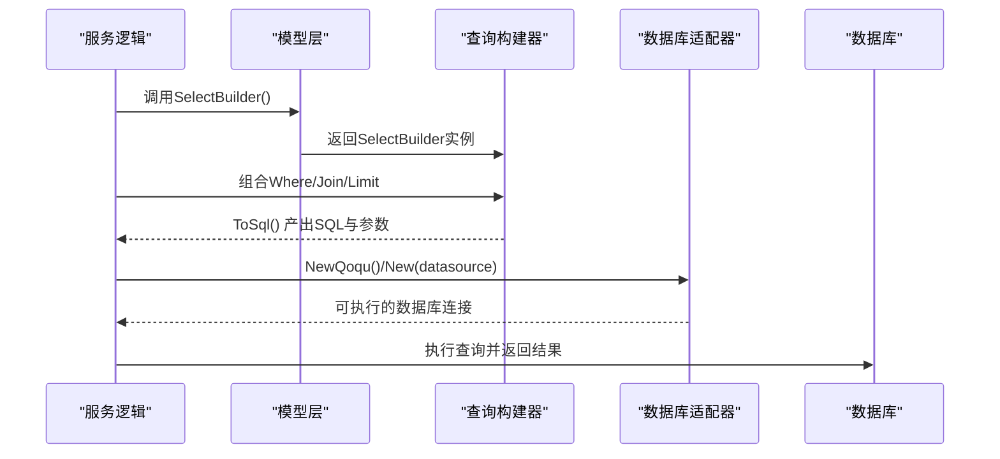
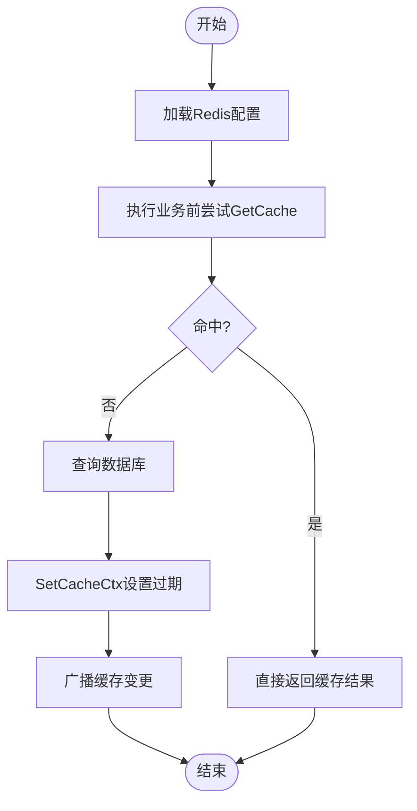
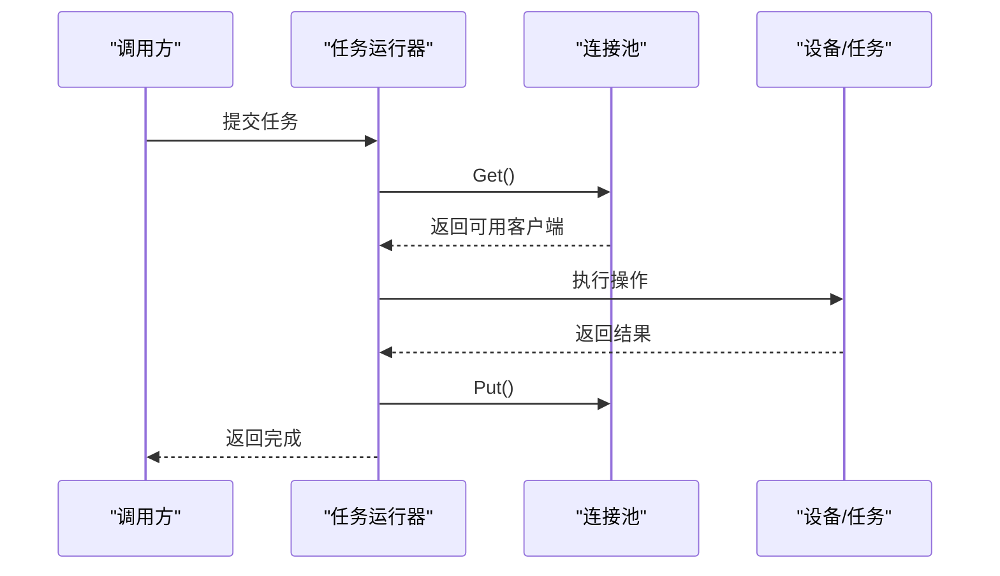
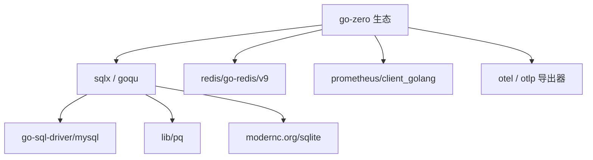

# 性能调优与优化

<cite>
**本文引用的文件**
- [go.mod](file://go.mod)
- [stat_analyzer.html](file://deploy/stat_analyzer.html)
- [trigger.yaml](file://app/trigger/etc/trigger.yaml)
- [zerorpc.yaml](file://zerorpc/etc/zerorpc.yaml)
- [dbx.go](file://common/dbx/dbx.go)
- [config.go](file://app/trigger/internal/config/config.go)
- [clearpointmappingcachelogic.go](file://app/ieccaller/internal/logic/clearpointmappingcachelogic.go)
- [waitgroup.go](file://common/iec104/waitgroup/waitgroup.go)
- [client.go](file://common/modbusx/client.go)
- [config.go](file://common/modbusx/config.go)
- [planexeclogmodel_gen.go](file://model/planexeclogmodel_gen.go)
- [database-patterns.md](file://.trae/skills/zero-skills/references/database-patterns.md)
- [resilience-patterns.md](file://.trae/skills/zero-skills/references/resilience-patterns.md)
</cite>

## 目录
1. [简介](#简介)
2. [项目结构](#项目结构)
3. [核心组件](#核心组件)
4. [架构总览](#架构总览)
5. [详细组件分析](#详细组件分析)
6. [依赖分析](#依赖分析)
7. [性能考量](#性能考量)
8. [故障排查指南](#故障排查指南)
9. [结论](#结论)
10. [附录](#附录)

## 简介
本指南面向Zero-Service项目的性能调优与优化，聚焦以下方面：
- 数据库性能优化：索引优化、查询优化、连接池配置、慢查询分析
- 缓存策略设计：Redis配置、缓存命中率优化、缓存失效策略
- 并发控制机制：goroutine管理、channel使用、锁优化
- 资源管理：内存优化、GC调优、CPU使用率优化
- 性能测试与监控：压测、基准测试、瓶颈分析与监控指标
- 调优案例研究：结合项目中的实际实现进行落地建议

## 项目结构
项目采用多模块微服务架构，围绕go-zero生态构建，包含网关、RPC服务、事件处理、设备协议适配等子系统。数据库访问通过统一适配层抽象，缓存与RPC配置在各服务的配置文件中集中管理。

**图表来源**
- [trigger.yaml:1-37](file://app/trigger/etc/trigger.yaml#L1-L37)
- [zerorpc.yaml:1-39](file://zerorpc/etc/zerorpc.yaml#L1-L39)
- [dbx.go:1-155](file://common/dbx/dbx.go#L1-L155)
- [planexeclogmodel_gen.go:410-457](file://model/planexeclogmodel_gen.go#L410-L457)
- [waitgroup.go:1-112](file://common/iec104/waitgroup/waitgroup.go#L1-L112)
- [client.go:1-218](file://common/modbusx/client.go#L1-L218)
- [config.go:78-124](file://common/modbusx/config.go#L78-L124)
- [clearpointmappingcachelogic.go:26-60](file://app/ieccaller/internal/logic/clearpointmappingcachelogic.go#L26-L60)
- [stat_analyzer.html:345-2734](file://deploy/stat_analyzer.html#L345-L2734)

**章节来源**
- [trigger.yaml:1-37](file://app/trigger/etc/trigger.yaml#L1-L37)
- [zerorpc.yaml:1-39](file://zerorpc/etc/zerorpc.yaml#L1-L39)
- [dbx.go:1-155](file://common/dbx/dbx.go#L1-L155)
- [planexeclogmodel_gen.go:410-457](file://model/planexeclogmodel_gen.go#L410-L457)
- [waitgroup.go:1-112](file://common/iec104/waitgroup/waitgroup.go#L1-L112)
- [client.go:1-218](file://common/modbusx/client.go#L1-L218)
- [config.go:78-124](file://common/modbusx/config.go#L78-L124)
- [clearpointmappingcachelogic.go:26-60](file://app/ieccaller/internal/logic/clearpointmappingcachelogic.go#L26-L60)
- [stat_analyzer.html:345-2734](file://deploy/stat_analyzer.html#L345-L2734)

## 核心组件
- 数据库适配与查询构建：统一解析数据源类型，自动选择MySQL/PostgreSQL/SQLite/TAOS连接；提供goqu方言与日志桥接，便于慢查询定位与SQL审计。
- 缓存与RPC配置：服务配置文件集中定义Redis、DB数据源、Nacos注册、链路追踪等，支撑缓存命中率与限流丢弃统计的可观测性。
- 并发与资源：提供带超时的等待组封装，避免阻塞导致的资源泄漏；Modbus连接池按设备维度隔离，降低共享竞争。
- 性能监控：内置统计分析器可从日志提取QPS、丢弃、内存、GC、缓存命中率等指标，形成可视化趋势图。

**章节来源**
- [dbx.go:46-138](file://common/dbx/dbx.go#L46-L138)
- [trigger.yaml:19-37](file://app/trigger/etc/trigger.yaml#L19-L37)
- [zerorpc.yaml:13-21](file://zerorpc/etc/zerorpc.yaml#L13-L21)
- [waitgroup.go:27-43](file://common/iec104/waitgroup/waitgroup.go#L27-L43)
- [client.go:145-191](file://common/modbusx/client.go#L145-L191)
- [stat_analyzer.html:980-1253](file://deploy/stat_analyzer.html#L980-L1253)

## 架构总览
下图展示服务配置、数据库与缓存、并发控制与监控之间的关系，以及关键调优点位。

**图表来源**
- [trigger.yaml:19-37](file://app/trigger/etc/trigger.yaml#L19-L37)
- [zerorpc.yaml:13-21](file://zerorpc/etc/zerorpc.yaml#L13-L21)
- [dbx.go:106-138](file://common/dbx/dbx.go#L106-L138)
- [waitgroup.go:27-43](file://common/iec104/waitgroup/waitgroup.go#L27-L43)
- [client.go:145-191](file://common/modbusx/client.go#L145-L191)
- [stat_analyzer.html:980-1253](file://deploy/stat_analyzer.html#L980-L1253)

## 详细组件分析

### 数据库性能优化
- 自动数据库类型识别与连接选择：根据数据源URL自动判断类型，确保SQL方言正确与连接参数最优。
- SQL构建与日志：通过goqu构建SQL并输出日志，便于定位慢查询与异常语句。
- 查询构建器模式：模型层提供SelectBuilder/InsertBuilder/UpdateBuilder/DeleteBuilder，统一占位符格式与错误处理，减少手写SQL风险。
- 连接池配置：默认池参数由go-zero提供，可通过RawDB获取底层sql.DB进行自定义（最大空闲连接、最大打开连接、连接生命周期），结合业务QPS与事务特性调整。

**图表来源**
- [dbx.go:106-138](file://common/dbx/dbx.go#L106-L138)
- [planexeclogmodel_gen.go:451-457](file://model/planexeclogmodel_gen.go#L451-L457)

**章节来源**
- [dbx.go:31-64](file://common/dbx/dbx.go#L31-L64)
- [dbx.go:106-138](file://common/dbx/dbx.go#L106-L138)
- [planexeclogmodel_gen.go:410-457](file://model/planexeclogmodel_gen.go#L410-L457)
- [database-patterns.md:448-480](file://.trae/skills/zero-skills/references/database-patterns.md#L448-L480)

### 缓存策略设计
- Redis配置：服务配置文件集中定义Redis主机、类型、密钥与DB索引，便于统一管理与切换。
- 缓存命中率监控：性能分析器从日志中提取缓存命中率、QPM、命中/未命中计数与DB失败次数，支持按类型聚合与趋势分析。
- 缓存失效策略：提供手动清除缓存的逻辑（如IEC点位映射缓存），支持按键或键信息批量清理，并广播同步，保证多节点一致性。

**图表来源**
- [zerorpc.yaml:13-21](file://zerorpc/etc/zerorpc.yaml#L13-L21)
- [stat_analyzer.html:995-1004](file://deploy/stat_analyzer.html#L995-L1004)
- [clearpointmappingcachelogic.go:26-60](file://app/ieccaller/internal/logic/clearpointmappingcachelogic.go#L26-L60)

**章节来源**
- [zerorpc.yaml:13-21](file://zerorpc/etc/zerorpc.yaml#L13-L21)
- [trigger.yaml:19-24](file://app/trigger/etc/trigger.yaml#L19-L24)
- [stat_analyzer.html:995-1004](file://deploy/stat_analyzer.html#L995-L1004)
- [clearpointmappingcachelogic.go:26-60](file://app/ieccaller/internal/logic/clearpointmappingcachelogic.go#L26-L60)

### 并发控制机制
- goroutine管理：通过带超时的等待组封装，避免长时间阻塞导致的资源泄漏；适用于批量任务、异步回调等场景。
- channel使用：在需要背压与限流的场景中，结合worker pool与信号量控制并发度，防止系统过载。
- 锁优化：对热点共享资源使用更细粒度的锁或无锁结构；对Modbus连接池采用独立池按设备维度隔离，降低全局锁竞争。

**图表来源**
- [waitgroup.go:27-43](file://common/iec104/waitgroup/waitgroup.go#L27-L43)
- [client.go:180-191](file://common/modbusx/client.go#L180-L191)
- [resilience-patterns.md:491-517](file://.trae/skills/zero-skills/references/resilience-patterns.md#L491-L517)

**章节来源**
- [waitgroup.go:1-112](file://common/iec104/waitgroup/waitgroup.go#L1-L112)
- [client.go:145-191](file://common/modbusx/client.go#L145-L191)
- [config.go:78-124](file://common/modbusx/config.go#L78-L124)
- [resilience-patterns.md:491-517](file://.trae/skills/zero-skills/references/resilience-patterns.md#L491-L517)

### 资源管理方法
- 内存优化：关注实时内存、系统内存与GC次数指标，结合业务峰值流量与对象分配热点进行优化。
- GC调优：通过降低临时对象创建、复用缓冲区、避免逃逸分配等方式减少GC压力；配合监控观察GC次数与停顿时间。
- CPU使用率优化：限制并发度、合并请求、使用批处理与异步化，避免CPU争用与上下文切换开销。

**章节来源**
- [stat_analyzer.html:414-435](file://deploy/stat_analyzer.html#L414-L435)
- [stat_analyzer.html:1354-1352](file://deploy/stat_analyzer.html#L1354-L1352)

## 依赖分析
项目使用go-zero生态与第三方库，数据库访问通过sqlx与goqu，缓存使用Redis，监控与链路追踪可选启用。

**图表来源**
- [go.mod:5-62](file://go.mod#L5-L62)

**章节来源**
- [go.mod:1-245](file://go.mod#L1-L245)

## 性能考量
- 数据库层面：优先使用索引覆盖查询、避免SELECT *、合理分页与LIMIT、使用EXPLAIN分析执行计划；连接池参数需与QPS、RT目标匹配。
- 缓存层面：热点数据预热、设置合理TTL、批量写入与批量读取、失效策略与广播同步。
- 并发层面：控制并发度上限、使用worker pool与背压、避免全局锁、及时释放资源。
- 监控层面：建立QPS、响应时间、丢弃率、缓存命中率、内存与GC等关键指标，定期复盘并迭代优化。

## 故障排查指南
- 限流与丢弃：通过性能分析器提取丢弃统计，定位CPU过载或队列积压，必要时降低并发或扩容。
- 缓存命中率异常：检查缓存键生成规则、TTL设置、批量清理策略与广播是否生效。
- 数据库慢查询：启用SQL日志，结合EXPLAIN与监控指标定位热点表与慢SQL，优化索引与查询路径。
- 并发阻塞：使用带超时的等待组，避免无限等待导致的资源泄漏；检查worker pool与连接池容量。

**章节来源**
- [stat_analyzer.html:980-1004](file://deploy/stat_analyzer.html#L980-L1004)
- [stat_analyzer.html:1354-1352](file://deploy/stat_analyzer.html#L1354-L1352)
- [clearpointmappingcachelogic.go:26-60](file://app/ieccaller/internal/logic/clearpointmappingcachelogic.go#L26-L60)
- [database-patterns.md:448-480](file://.trae/skills/zero-skills/references/database-patterns.md#L448-L480)
- [waitgroup.go:27-43](file://common/iec104/waitgroup/waitgroup.go#L27-L43)

## 结论
通过统一的数据库适配层、集中化的缓存与RPC配置、严格的并发控制与完善的监控体系，Zero-Service能够在高并发场景下保持稳定与高性能。建议持续以监控指标为依据，结合业务特征迭代优化数据库索引、缓存策略与并发参数，形成闭环的性能治理流程。

## 附录
- 性能测试工具使用建议
  - 压力测试：使用wrk/vegeta等工具模拟高并发请求，结合QPS、P99延迟与丢弃率评估系统承载能力。
  - 基准测试：针对关键SQL与缓存路径进行基准测试，对比不同索引与缓存策略的吞吐差异。
  - 瓶颈分析：结合火焰图与链路追踪，定位CPU热点与IO瓶颈，针对性优化算法与资源配置。
- 监控指标清单
  - 服务级：QPS、平均/中位/分位响应时间、错误率、丢弃数
  - 资源级：CPU使用率、内存占用、GC次数与停顿时间
  - 缓存级：QPM、命中率、命中/未命中计数、DB失败次数
  - 限流级：CPU阈值、丢弃统计、通过/拒绝比例