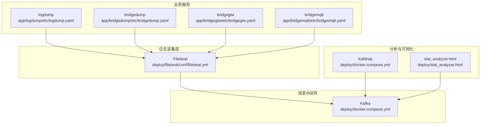
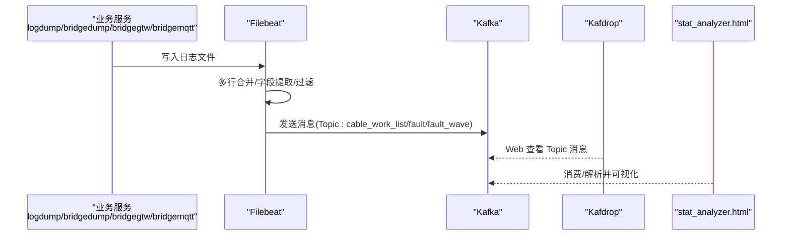
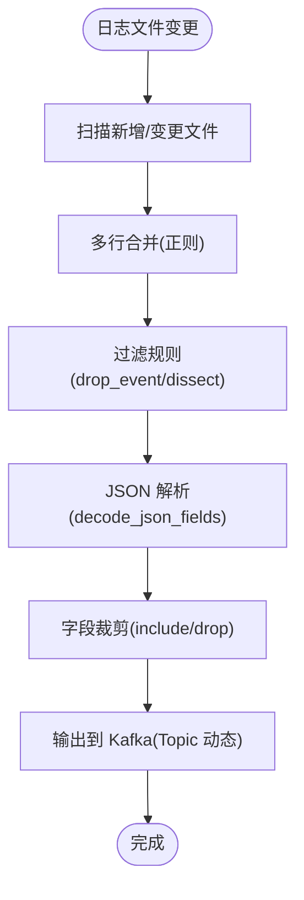
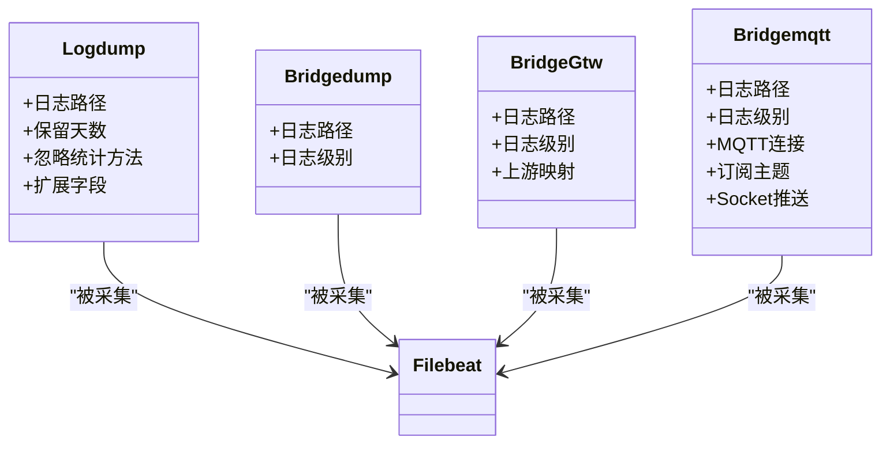
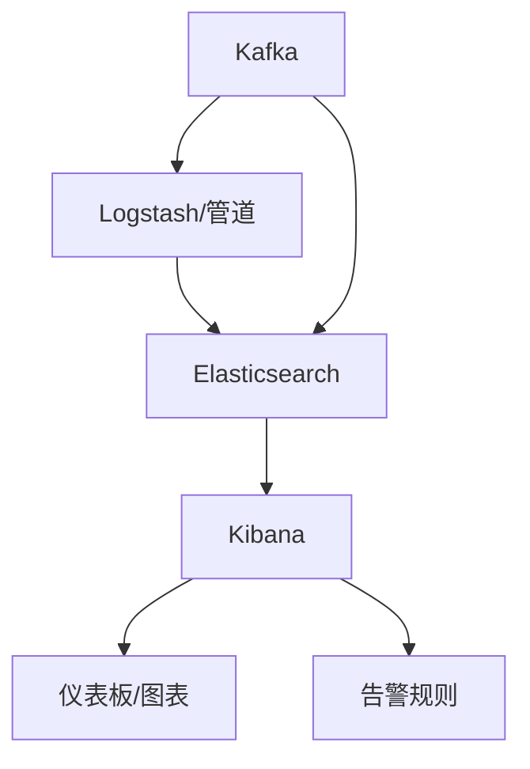
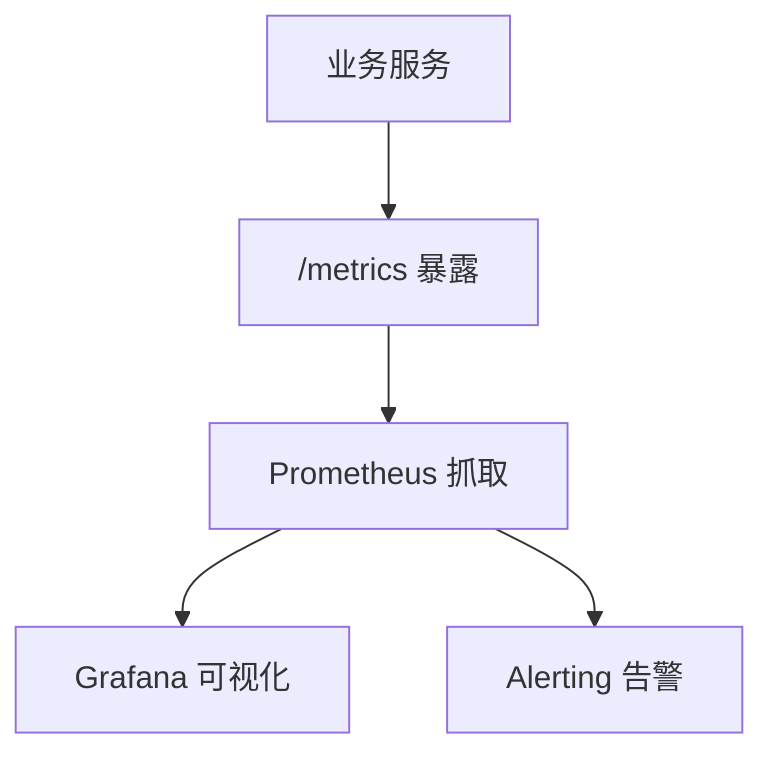
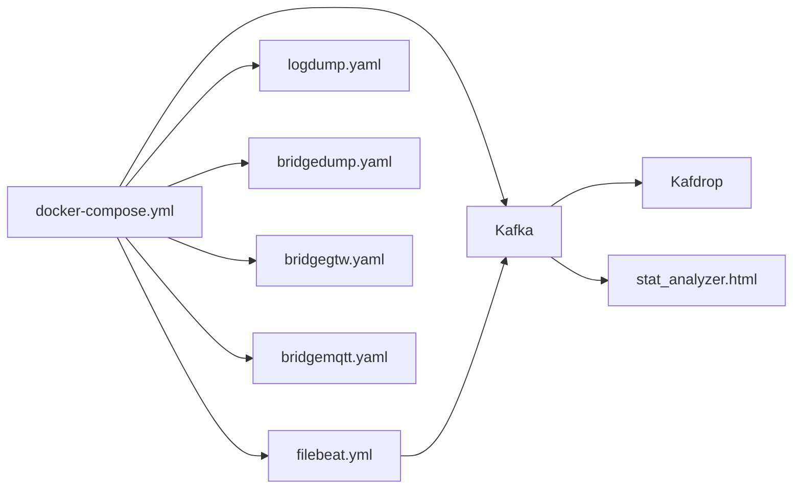
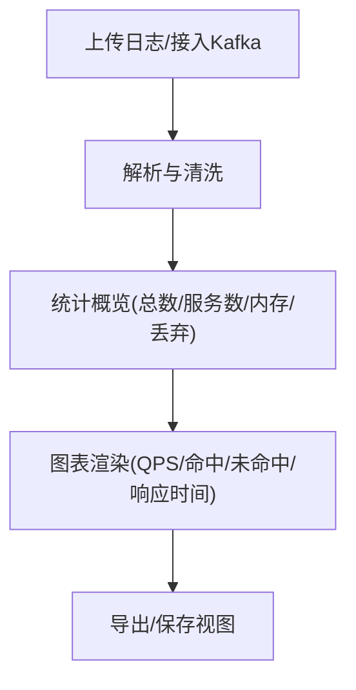
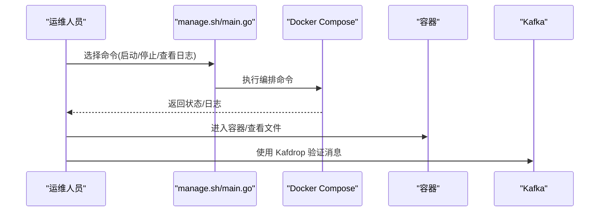

# 监控与日志系统

<cite>
**本文引用的文件**
- [filebeat.yml](file://deploy/filebeat/conf/filebeat.yml)
- [docker-compose.yml](file://deploy/docker-compose.yml)
- [logdump.yaml](file://app/logdump/etc/logdump.yaml)
- [bridgedump.yaml](file://app/bridgedump/etc/bridgedump.yaml)
- [bridgegtw.yaml](file://app/bridgegtw/etc/bridgegtw.yaml)
- [bridgemqtt.yaml](file://app/bridgemqtt/etc/bridgemqtt.yaml)
- [stat_analyzer.html](file://deploy/stat_analyzer.html)
- [manage.sh](file://util/manage.sh)
- [main.go](file://util/main.go)
- [pod-log-app.sh](file://util/dockeru/pod-log-app.sh)
- [dockerx.go](file://common/dockerx/dockerx.go)
</cite>

## 目录
1. [简介](#简介)
2. [项目结构](#项目结构)
3. [核心组件](#核心组件)
4. [架构总览](#架构总览)
5. [详细组件分析](#详细组件分析)
6. [依赖关系分析](#依赖关系分析)
7. [性能监控](#性能监控)
8. [日志分析工具使用指南](#日志分析工具使用指南)
9. [故障诊断方法](#故障诊断方法)
10. [结论](#结论)
11. [附录](#附录)

## 简介
本运维文档面向 Zero-Service 的监控与日志体系，围绕以下目标展开：
- Filebeat 日志采集配置：涵盖日志文件监控、过滤规则、输出到 Kafka 的配置要点
- 可视化与告警：结合现有 Kafka 与 Kafdrop，给出后续接入 ELK/Kibana 的建议路径
- Prometheus 指标采集：说明如何在现有服务中暴露自定义指标，并对接 Grafana 与告警
- 性能监控：CPU、内存、磁盘、网络等资源监控方法
- 日志分析工具：基于内置 HTML 工具进行日志聚合、搜索与统计分析
- 配置模板与故障诊断：提供可复用的配置模板与常见问题排查步骤

## 项目结构
与监控和日志相关的关键位置如下：
- 日志采集与传输
  - Filebeat 配置：deploy/filebeat/conf/filebeat.yml
  - Docker Compose 编排：deploy/docker-compose.yml（含 Kafka、Filebeat、服务容器）
- 日志落盘与服务配置
  - logdump 服务日志配置：app/logdump/etc/logdump.yaml
  - bridgedump 服务日志配置：app/bridgedump/etc/bridgedump.yaml
  - bridgegtw 网关日志配置：app/bridgegtw/etc/bridgegtw.yaml
  - bridgemqtt 服务日志配置：app/bridgemqtt/etc/bridgemqtt.yaml
- 日志分析工具
  - 内置 HTML 分析器：deploy/stat_analyzer.html
- 运维与远程管理
  - 本地/远程编排控制脚本：util/manage.sh、util/main.go
  - Kubernetes 日志查看脚本：util/dockeru/pod-log-app.sh
  - Docker 客户端工具：common/dockerx/dockerx.go

**图示来源**
- [filebeat.yml:1-122](file://deploy/filebeat/conf/filebeat.yml#L1-L122)
- [docker-compose.yml:1-110](file://deploy/docker-compose.yml#L1-L110)
- [logdump.yaml:1-26](file://app/logdump/etc/logdump.yaml#L1-L26)
- [bridgedump.yaml:1-10](file://app/bridgedump/etc/bridgedump.yaml#L1-L10)
- [bridgegtw.yaml:1-40](file://app/bridgegtw/etc/bridgegtw.yaml#L1-L40)
- [bridgemqtt.yaml:1-48](file://app/bridgemqtt/etc/bridgemqtt.yaml#L1-L48)
- [stat_analyzer.html:1-200](file://deploy/stat_analyzer.html#L1-L200)

**章节来源**
- [filebeat.yml:1-122](file://deploy/filebeat/conf/filebeat.yml#L1-L122)
- [docker-compose.yml:1-110](file://deploy/docker-compose.yml#L1-L110)

## 核心组件
- Filebeat：负责从业务服务产生的日志文件中采集、过滤、解析，并输出到 Kafka
- Kafka：作为消息中间件承载日志流，供下游消费与持久化
- 业务服务：各服务按自身配置输出日志至统一路径，供 Filebeat 监控采集
- Kafdrop：提供 Kafka Topic 的 Web 查看界面（便于验证消息是否到达）
- stat_analyzer.html：内置的前端日志分析工具，支持对特定格式日志进行聚合、统计与可视化

**章节来源**
- [filebeat.yml:1-122](file://deploy/filebeat/conf/filebeat.yml#L1-L122)
- [docker-compose.yml:1-110](file://deploy/docker-compose.yml#L1-L110)
- [stat_analyzer.html:1-200](file://deploy/stat_analyzer.html#L1-L200)

## 架构总览
下图展示从日志产生到可视化呈现的整体流程：

**图示来源**
- [filebeat.yml:1-122](file://deploy/filebeat/conf/filebeat.yml#L1-L122)
- [docker-compose.yml:1-110](file://deploy/docker-compose.yml#L1-L110)
- [stat_analyzer.html:1-200](file://deploy/stat_analyzer.html#L1-L200)

## 详细组件分析

### Filebeat 日志采集配置
- 输入源（Inputs）
  - 监控路径：针对不同业务主题分别监控独立目录，确保日志分片清晰
  - 多行模式：通过正则匹配桥接标签，实现多行日志合并
  - 扫描与关闭策略：调整扫描频率、关闭不活跃文件的时间阈值，兼顾实时性与资源占用
  - 过滤策略：忽略过期文件、清理长时间未活动的状态
- 处理器（Processors）
  - 元数据注入：主机、云环境、Docker 容器信息
  - 过滤规则：丢弃解析失败事件；忽略特定起始行
  - 结构化解析：使用 tokenizer 提取 JSON 片段并解码到 message 字段
  - 字段裁剪：仅保留必要字段，去除冗余元数据
- 输出（Kafka）
  - 动态 Topic：根据 fields.topic 注入动态 Topic
  - 压缩与消息大小：启用 gzip 压缩，限制单条消息最大字节
  - 确认机制：设置 required_acks 控制可靠性

**图示来源**
- [filebeat.yml:1-122](file://deploy/filebeat/conf/filebeat.yml#L1-L122)

**章节来源**
- [filebeat.yml:1-122](file://deploy/filebeat/conf/filebeat.yml#L1-L122)

### 业务服务日志配置
- logdump
  - 日志路径与保留天数：集中落盘，便于 Filebeat 采集
  - 统计中间件忽略 PushLog 方法：减少噪声
  - 自定义扩展字段：orderId、userId、taskId、taskGuid、errorCode
- bridgedump
  - 日志路径与级别：统一输出到 /opt/logs/bridgedump
- bridgegtw
  - 日志路径与级别：统一输出到 /opt/logs/bridgegtw
  - 上游映射：将外部 API 请求路由到具体 RPC 方法
- bridgemqtt
  - 日志路径与级别：统一输出到 /opt/logs/bridgemqtt
  - MQTT 连接与订阅：配置 Broker、认证、订阅主题
  - Socket 推送：配置推送目标端点

**图示来源**
- [logdump.yaml:1-26](file://app/logdump/etc/logdump.yaml#L1-L26)
- [bridgedump.yaml:1-10](file://app/bridgedump/etc/bridgedump.yaml#L1-L10)
- [bridgegtw.yaml:1-40](file://app/bridgegtw/etc/bridgegtw.yaml#L1-L40)
- [bridgemqtt.yaml:1-48](file://app/bridgemqtt/etc/bridgemqtt.yaml#L1-L48)

**章节来源**
- [logdump.yaml:1-26](file://app/logdump/etc/logdump.yaml#L1-L26)
- [bridgedump.yaml:1-10](file://app/bridgedump/etc/bridgedump.yaml#L1-L10)
- [bridgegtw.yaml:1-40](file://app/bridgegtw/etc/bridgegtw.yaml#L1-L40)
- [bridgemqtt.yaml:1-48](file://app/bridgemqtt/etc/bridgemqtt.yaml#L1-L48)

### 可视化与告警（Kibana/Kafka）
- 当前现状
  - Kafka 与 Kafdrop 已在编排中提供，可用于验证消息到达
  - 仓库未包含 Kibana 与 Elasticsearch 的编排或配置文件
- 建议接入路径
  - 在现有 Kafka 基础上，部署 Elasticsearch 与 Kibana
  - 使用 Filebeat 作为 ES 输出，或通过 Logstash/其它管道将 Kafka 消息导入 ES
  - 在 Kibana 中创建仪表板、图表与告警规则（基于 Watcher 或 Alerting）

[此图为概念性示意，无需“图示来源”标注]

**章节来源**
- [docker-compose.yml:1-110](file://deploy/docker-compose.yml#L1-L110)

### Prometheus 指标采集（Grafana 与告警）
- 现状
  - 项目依赖包含 Prometheus 客户端库，具备在服务中暴露指标的基础能力
- 实施建议
  - 在各业务服务中注册自定义指标（如 QPS、错误率、响应时间、内存/GC 等）
  - 对外暴露 /metrics 端点，由 Prometheus 抓取
  - 在 Grafana 中创建仪表板，配置告警规则（基于 Prometheus Expression）

[此图为概念性示意，无需“图示来源”标注]

**章节来源**
- [go.sum:427-440](file://go.sum#L427-L440)

## 依赖关系分析
- Filebeat 依赖 Docker 容器元数据挂载，以便在容器内正确识别宿主机路径
- 业务服务日志路径需与 Filebeat 监控路径一致，否则无法采集
- Kafka 作为消息中枢，Kafdrop 用于快速验证消息流
- stat_analyzer.html 依赖 Kafka 消息或本地日志文件进行分析

**图示来源**
- [docker-compose.yml:1-110](file://deploy/docker-compose.yml#L1-L110)
- [filebeat.yml:1-122](file://deploy/filebeat/conf/filebeat.yml#L1-L122)
- [logdump.yaml:1-26](file://app/logdump/etc/logdump.yaml#L1-L26)
- [bridgedump.yaml:1-10](file://app/bridgedump/etc/bridgedump.yaml#L1-L10)
- [bridgegtw.yaml:1-40](file://app/bridgegtw/etc/bridgegtw.yaml#L1-L40)
- [bridgemqtt.yaml:1-48](file://app/bridgemqtt/etc/bridgemqtt.yaml#L1-L48)
- [stat_analyzer.html:1-200](file://deploy/stat_analyzer.html#L1-L200)

**章节来源**
- [docker-compose.yml:1-110](file://deploy/docker-compose.yml#L1-L110)
- [filebeat.yml:1-122](file://deploy/filebeat/conf/filebeat.yml#L1-L122)

## 性能监控
- CPU、内存、磁盘、网络
  - 建议在宿主机层面使用系统级监控工具（如 Node Exporter + Prometheus + Grafana）
  - 在容器层面，结合业务服务日志中的内存/GC/限流状态等指标，辅助定位性能瓶颈
- 业务侧指标
  - QPS、响应时间（avg/median/p90/p99）、丢弃请求数、缓存命中率等，均可在 stat_analyzer.html 中进行统计与可视化

**章节来源**
- [stat_analyzer.html:248-888](file://deploy/stat_analyzer.html#L248-L888)

## 日志分析工具使用指南
- 工具概述
  - 支持多种日志格式识别：内存使用统计、限流状态统计、性能指标统计
  - 提供图表交互：缩放、区域选择、重置视图、全屏
- 使用步骤
  - 准备日志：确保业务服务日志已按配置输出到统一路径
  - 导入数据：将日志文件或 Kafka 消息导入工具进行解析
  - 统计分析：查看总条目、服务数量、平均内存、丢弃请求等概览
  - 图表定制：按需切换折线/柱状图，查看命中/未命中次数、每分钟查询数等
- 关键功能
  - 时间范围与粒度：按分钟聚合，支持滑动窗口分析
  - 服务维度：按服务拆分统计，便于对比与定位
  - 响应时间分布：支持 avg/median/p90/p99/p999 等指标计算

**图示来源**
- [stat_analyzer.html:248-888](file://deploy/stat_analyzer.html#L248-L888)

**章节来源**
- [stat_analyzer.html:1-200](file://deploy/stat_analyzer.html#L1-L200)
- [stat_analyzer.html:248-2935](file://deploy/stat_analyzer.html#L248-L2935)

## 故障诊断方法
- Filebeat 采集异常
  - 检查监控路径是否存在、权限是否允许读取
  - 查看 Filebeat 日志与容器状态，确认 processors 是否导致事件被丢弃
  - 验证 Kafka 连接与 Topic 是否存在
- 业务服务日志缺失
  - 确认服务日志路径与级别配置是否正确
  - 检查容器挂载卷是否生效
- 远程运维与日志查看
  - 本地/远程编排控制：通过 util/manage.sh 与 util/main.go 执行 up/start/stop/restart、查看日志、进入容器等
  - Kubernetes 场景：使用 util/dockeru/pod-log-app.sh 快速选择 Pod 并查看日志
- Docker 客户端工具
  - 利用 common/dockerx/dockerx.go 提供的容器信息解析能力，辅助排查端口、挂载、资源限制等问题

**图示来源**
- [manage.sh:1-35](file://util/manage.sh#L1-L35)
- [main.go:387-433](file://util/main.go#L387-L433)
- [pod-log-app.sh:1-23](file://util/dockeru/pod-log-app.sh#L1-L23)
- [dockerx.go:1-59](file://common/dockerx/dockerx.go#L1-L59)
- [docker-compose.yml:1-110](file://deploy/docker-compose.yml#L1-L110)

**章节来源**
- [manage.sh:1-35](file://util/manage.sh#L1-L35)
- [main.go:387-433](file://util/main.go#L387-L433)
- [pod-log-app.sh:1-23](file://util/dockeru/pod-log-app.sh#L1-L23)
- [dockerx.go:1-59](file://common/dockerx/dockerx.go#L1-L59)
- [docker-compose.yml:1-110](file://deploy/docker-compose.yml#L1-L110)

## 结论
- 本项目已具备完善的日志采集与消息传输链路（Filebeat → Kafka），并通过 Kafdrop 提供了基础的可视化验证能力
- 建议在现有基础上引入 ELK/Kibana 以完善可视化与告警；同时在服务中暴露 Prometheus 指标，构建更全面的可观测体系
- 通过 stat_analyzer.html 可快速完成日志聚合与统计分析，满足日常运维与性能分析需求
- 借助 util 下的脚本与工具，可高效完成远程编排、日志查看与容器诊断

## 附录
- 配置模板与最佳实践
  - Filebeat 输入模板：按业务主题划分监控目录，统一多行合并与过滤规则
  - Kafka 输出模板：启用压缩、合理设置 ack 数量与消息大小上限
  - 业务服务日志模板：统一日志路径、级别与保留策略，必要时添加扩展字段
  - Prometheus 暴露模板：在服务中注册自定义指标，统一 /metrics 端点与标签
- 常见问题清单
  - Filebeat 采集不到新文件：检查路径、权限、scan_frequency、close_inactive
  - 多行日志未合并：核对 multiline.pattern 与 match 行为
  - Kafka 连接失败：核对 advertised.listeners、端口映射与防火墙
  - Kibana 无法连接 ES：确认索引生命周期与权限设置