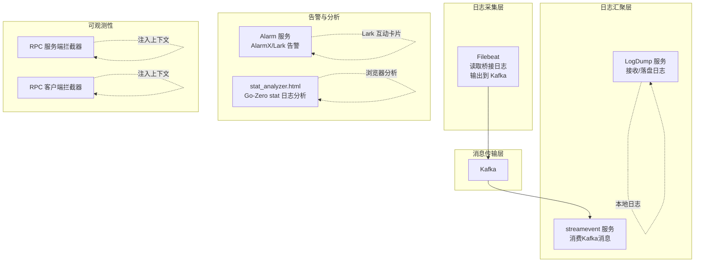
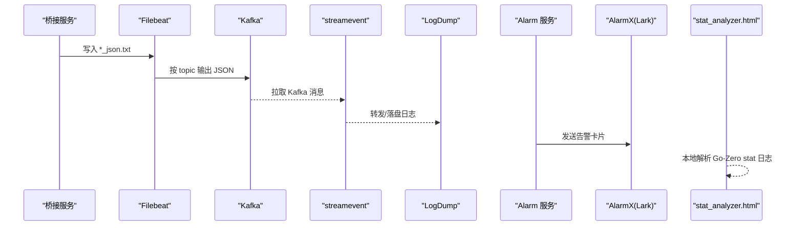
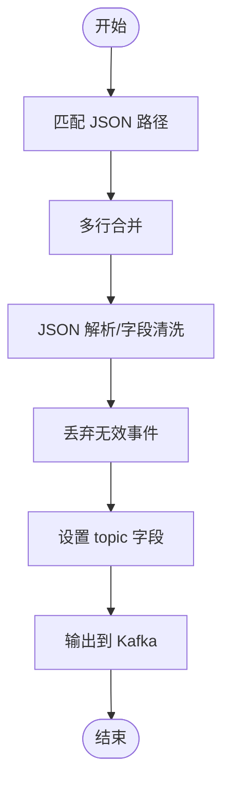
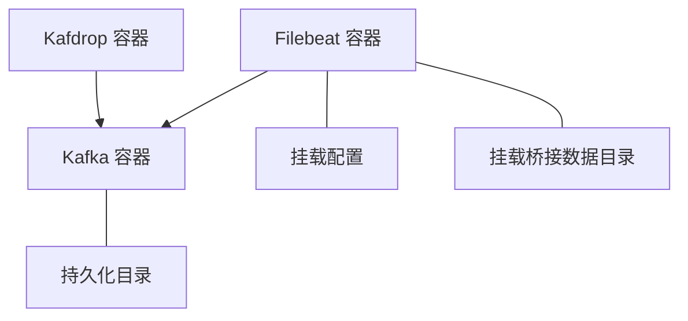
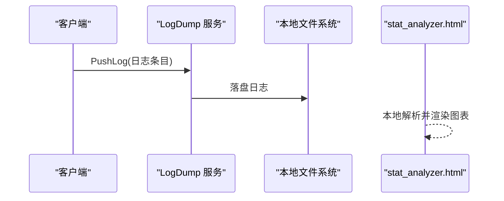
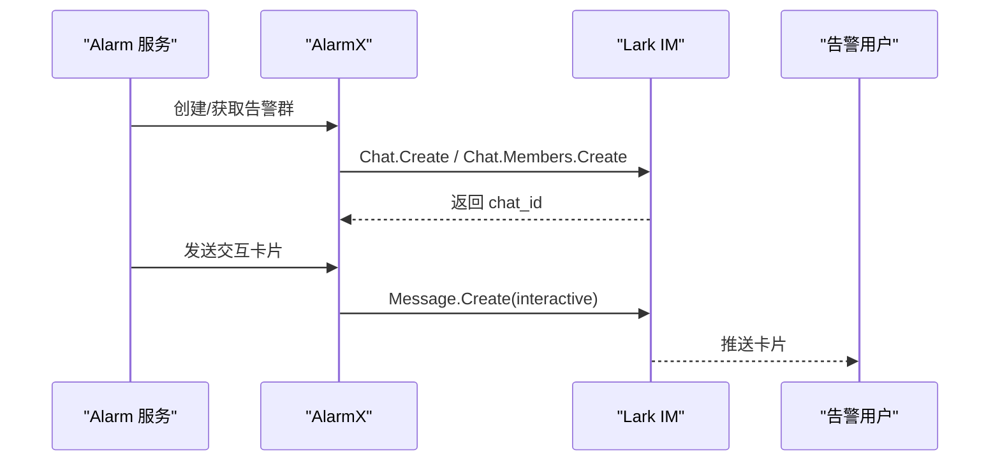
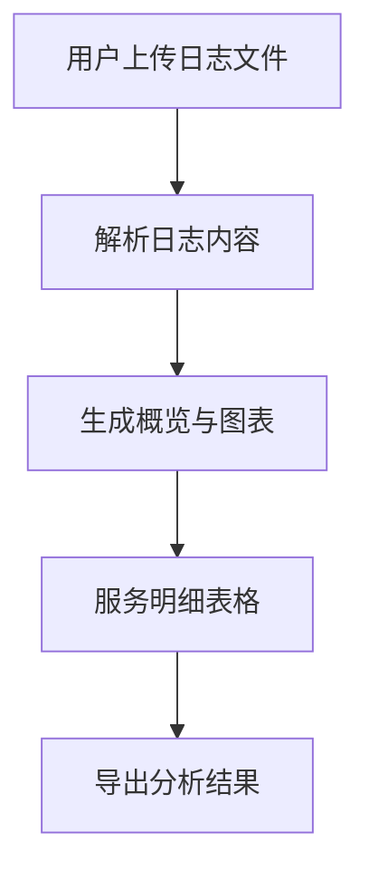
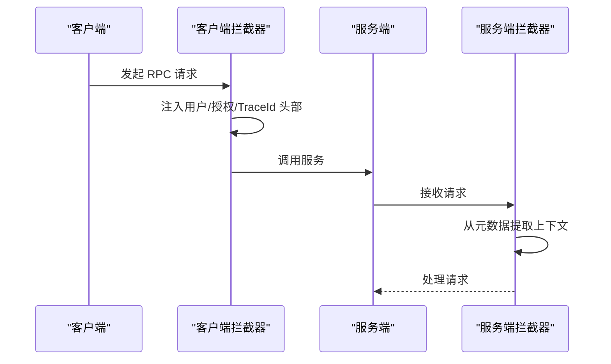
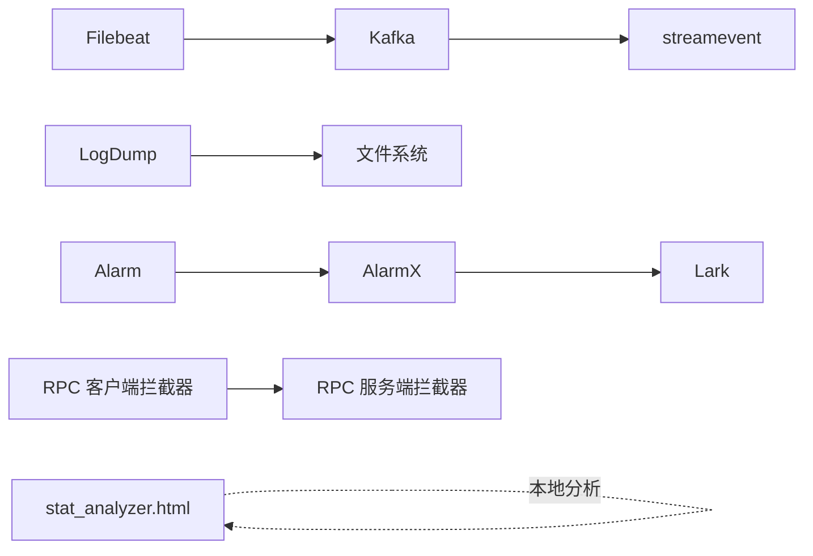

# 监控告警

<cite>
**本文档引用的文件**
- [deploy/filebeat/conf/filebeat.yml](file://deploy/filebeat/conf/filebeat.yml)
- [deploy/docker-compose.yml](file://deploy/docker-compose.yml)
- [deploy/stat_analyzer.html](file://deploy/stat_analyzer.html)
- [app/logdump/etc/logdump.yaml](file://app/logdump/etc/logdump.yaml)
- [app/logdump/logdump.proto](file://app/logdump/logdump.proto)
- [app/logdump/logdump/logdump_grpc.pb.go](file://app/logdump/logdump/logdump_grpc.pb.go)
- [common/alarmx/alarmx.go](file://common/alarmx/alarmx.go)
- [app/alarm/etc/alarm.yaml](file://app/alarm/etc/alarm.yaml)
- [app/alarm/internal/logic/alarmlogic.go](file://app/alarm/internal/logic/alarmlogic.go)
- [facade/streamevent/streamevent/streamevent.pb.go](file://facade/streamevent/streamevent/streamevent.pb.go)
- [facade/streamevent/streamevent/streamevent_grpc.pb.go](file://facade/streamevent/streamevent/streamevent_grpc.pb.go)
- [common/Interceptor/rpcserver/loggerInterceptor.go](file://common/Interceptor/rpcserver/loggerInterceptor.go)
- [common/Interceptor/rpcclient/metadataInterceptor.go](file://common/Interceptor/rpcclient/metadataInterceptor.go)
- [util/main.go](file://util/main.go)
</cite>

## 目录
1. [简介](#简介)
2. [项目结构](#项目结构)
3. [核心组件](#核心组件)
4. [架构总览](#架构总览)
5. [组件详解](#组件详解)
6. [依赖关系分析](#依赖关系分析)
7. [性能与容量建议](#性能与容量建议)
8. [故障排查指南](#故障排查指南)
9. [结论](#结论)
10. [附录](#附录)

## 简介
本文件面向 zero-service 项目的监控与告警体系，围绕日志采集（Filebeat）、消息传输（Kafka）、日志汇聚与展示（LogDump + stat_analyzer.html）、告警通道（AlarmX/Lark）、以及可观测性中间件（RPC 日志拦截器）进行系统化说明。文档同时提供容器化部署参考、最佳实践与可视化方案，帮助团队建立稳定高效的监控告警闭环。

## 项目结构
- 日志采集与传输
  - Filebeat 作为日志采集器，读取桥接服务产生的 JSON 文本，并按 topic 输出至 Kafka。
  - docker-compose 提供 Kafka 与 Filebeat 的容器编排，便于本地或测试环境快速搭建。
- 日志汇聚与消费
  - LogDump 服务接收客户端推送的日志条目，落地到本地日志目录；streamevent 服务消费 Kafka 消息并转发到下游。
- 告警通道
  - Alarm 服务通过 AlarmX 将告警卡片推送到 Lark 群聊，支持用户维度与卡片交互。
- 性能分析工具
  - stat_analyzer.html 提供对 Go-Zero stat 日志的可视化分析，涵盖 QPS、内存、限流等指标。
- 可观测性中间件
  - RPC 服务端/客户端拦截器在日志中注入用户、授权、链路 ID 等上下文，便于关联定位。

**图表来源**
- [deploy/filebeat/conf/filebeat.yml:1-122](file://deploy/filebeat/conf/filebeat.yml#L1-L122)
- [deploy/docker-compose.yml:1-110](file://deploy/docker-compose.yml#L1-L110)
- [app/logdump/etc/logdump.yaml:1-26](file://app/logdump/etc/logdump.yaml#L1-L26)
- [facade/streamevent/streamevent/streamevent.pb.go:435-470](file://facade/streamevent/streamevent/streamevent.pb.go#L435-L470)
- [common/alarmx/alarmx.go:1-223](file://common/alarmx/alarmx.go#L1-L223)
- [deploy/stat_analyzer.html:1-800](file://deploy/stat_analyzer.html#L1-L800)
- [common/Interceptor/rpcserver/loggerInterceptor.go:1-45](file://common/Interceptor/rpcserver/loggerInterceptor.go#L1-L45)
- [common/Interceptor/rpcclient/metadataInterceptor.go:34-55](file://common/Interceptor/rpcclient/metadataInterceptor.go#L34-L55)

**章节来源**
- [deploy/filebeat/conf/filebeat.yml:1-122](file://deploy/filebeat/conf/filebeat.yml#L1-L122)
- [deploy/docker-compose.yml:1-110](file://deploy/docker-compose.yml#L1-L110)

## 核心组件
- 日志采集与输出（Filebeat）
  - 输入：桥接服务输出的 JSON 文本路径，按 topic 字段动态路由。
  - 处理：多行合并、JSON 解析、字段清洗、丢弃无效事件。
  - 输出：Kafka，压缩与分区策略配置。
- 消息传输（Kafka）
  - docker-compose 提供单节点 Kafka，暴露端口与持久化目录。
- 日志汇聚与展示（LogDump + stat_analyzer.html）
  - LogDump 接收日志并落盘，stat_analyzer.html 支持本地拖拽解析 Go-Zero stat 日志，生成多类指标图表。
- 告警通道（AlarmX/Lark）
  - Alarm 服务调用 AlarmX，创建/维护告警群并发送交互卡片，支持用户白名单与卡片动作回调。
- 可观测性中间件（RPC 拦截器）
  - 服务端拦截器从元数据提取用户与链路 ID 写入上下文；客户端拦截器透传这些头部，统一日志格式。

**章节来源**
- [app/logdump/etc/logdump.yaml:1-26](file://app/logdump/etc/logdump.yaml#L1-L26)
- [app/logdump/logdump.proto:1-44](file://app/logdump/logdump.proto#L1-L44)
- [app/logdump/logdump/logdump_grpc.pb.go:107-161](file://app/logdump/logdump/logdump_grpc.pb.go#L107-L161)
- [common/alarmx/alarmx.go:1-223](file://common/alarmx/alarmx.go#L1-L223)
- [app/alarm/etc/alarm.yaml:1-26](file://app/alarm/etc/alarm.yaml#L1-L26)
- [app/alarm/internal/logic/alarmlogic.go:31-55](file://app/alarm/internal/logic/alarmlogic.go#L31-L55)
- [deploy/stat_analyzer.html:1-800](file://deploy/stat_analyzer.html#L1-L800)
- [common/Interceptor/rpcserver/loggerInterceptor.go:1-45](file://common/Interceptor/rpcserver/loggerInterceptor.go#L1-L45)
- [common/Interceptor/rpcclient/metadataInterceptor.go:34-55](file://common/Interceptor/rpcclient/metadataInterceptor.go#L34-L55)

## 架构总览
下图展示了从日志产生到告警与可视化的完整链路，强调 Filebeat → Kafka → streamevent/LogDump → AlarmX → stat_analyzer 的数据流。

**图表来源**
- [deploy/filebeat/conf/filebeat.yml:1-122](file://deploy/filebeat/conf/filebeat.yml#L1-L122)
- [deploy/docker-compose.yml:1-110](file://deploy/docker-compose.yml#L1-L110)
- [facade/streamevent/streamevent/streamevent_grpc.pb.go:51-87](file://facade/streamevent/streamevent/streamevent_grpc.pb.go#L51-L87)
- [app/logdump/etc/logdump.yaml:1-26](file://app/logdump/etc/logdump.yaml#L1-L26)
- [common/alarmx/alarmx.go:119-140](file://common/alarmx/alarmx.go#L119-L140)
- [deploy/stat_analyzer.html:773-800](file://deploy/stat_analyzer.html#L773-L800)

## 组件详解

### 日志采集与 Filebeat 配置
- 输入与路径映射
  - 针对不同业务主题（如工作清单、故障数据、波形数据）分别配置输入路径，确保 Filebeat 能扫描到最新 JSON 文本。
- 多行与 JSON 解析
  - 使用多行模式合并跨行记录；通过解码 JSON 字段与字段裁剪，保证输出结构清晰。
- Kafka 输出
  - 动态 topic 字段来自 input 的 fields.topic；启用压缩与合理的 ack 数量，兼顾吞吐与可靠性。
- 运维要点
  - scan_frequency、close_inactive、ignore_older、clean_inactive 等参数用于控制扫描频率与文件状态清理，避免资源浪费与陈旧数据堆积。

**图表来源**
- [deploy/filebeat/conf/filebeat.yml:4-122](file://deploy/filebeat/conf/filebeat.yml#L4-L122)

**章节来源**
- [deploy/filebeat/conf/filebeat.yml:1-122](file://deploy/filebeat/conf/filebeat.yml#L1-L122)

### Kafka 容器编排与持久化
- Kafka
  - 单节点控制器与 broker 角色，暴露外部端口并挂载持久化目录，便于本地开发与测试。
- Filebeat
  - 依赖 Kafka，挂载配置与桥接数据目录，容器内以非严格权限模式启动，确保对日志目录的读取。
- Kafdrop
  - 提供 Web UI 查看 Kafka 主题与消息，便于调试。

**图表来源**
- [deploy/docker-compose.yml:1-110](file://deploy/docker-compose.yml#L1-L110)

**章节来源**
- [deploy/docker-compose.yml:1-110](file://deploy/docker-compose.yml#L1-L110)

### 日志汇聚与展示（LogDump + stat_analyzer.html）
- LogDump 服务
  - 配置包含日志路径、保留天数、额外字段等；提供 Ping/PushLog RPC 接口，用于健康检查与批量推送。
- stat_analyzer.html
  - 支持拖拽上传 Go-Zero stat 日志，解析内存、QPS、限流、缓存命中率等指标，生成趋势图与服务明细表，支持分页与全屏表格。

**图表来源**
- [app/logdump/etc/logdump.yaml:1-26](file://app/logdump/etc/logdump.yaml#L1-L26)
- [app/logdump/logdump.proto:9-44](file://app/logdump/logdump.proto#L9-L44)
- [app/logdump/logdump/logdump_grpc.pb.go:107-161](file://app/logdump/logdump/logdump_grpc.pb.go#L107-L161)
- [deploy/stat_analyzer.html:773-800](file://deploy/stat_analyzer.html#L773-L800)

**章节来源**
- [app/logdump/etc/logdump.yaml:1-26](file://app/logdump/etc/logdump.yaml#L1-L26)
- [app/logdump/logdump.proto:1-44](file://app/logdump/logdump.proto#L1-L44)
- [app/logdump/logdump/logdump_grpc.pb.go:107-161](file://app/logdump/logdump/logdump_grpc.pb.go#L107-L161)
- [deploy/stat_analyzer.html:1-800](file://deploy/stat_analyzer.html#L1-L800)

### 告警通道（AlarmX/Lark）
- Alarm 服务
  - 从配置读取 Lark 应用凭据与用户白名单，调用 AlarmX 创建/更新告警群并发送交互卡片。
- AlarmX
  - 封装 Lark IM API，支持聊天创建/成员增删、消息发送与卡片模板替换。

**图表来源**
- [app/alarm/etc/alarm.yaml:1-26](file://app/alarm/etc/alarm.yaml#L1-L26)
- [app/alarm/internal/logic/alarmlogic.go:31-55](file://app/alarm/internal/logic/alarmlogic.go#L31-L55)
- [common/alarmx/alarmx.go:53-140](file://common/alarmx/alarmx.go#L53-L140)

**章节来源**
- [app/alarm/etc/alarm.yaml:1-26](file://app/alarm/etc/alarm.yaml#L1-L26)
- [app/alarm/internal/logic/alarmlogic.go:31-55](file://app/alarm/internal/logic/alarmlogic.go#L31-L55)
- [common/alarmx/alarmx.go:1-223](file://common/alarmx/alarmx.go#L1-L223)

### 性能分析工具（stat_analyzer.html）
- 功能特性
  - 支持内存使用、限流状态、QPS、缓存命中率等指标的可视化；提供图表缩放、区域选择、全屏查看与表格分页。
- 使用流程
  - 拖拽或选择 .txt/.log 文件，解析后生成概览与多维度图表，支持按服务筛选与全屏表格。

**图表来源**
- [deploy/stat_analyzer.html:773-800](file://deploy/stat_analyzer.html#L773-L800)

**章节来源**
- [deploy/stat_analyzer.html:1-800](file://deploy/stat_analyzer.html#L1-L800)

### 可观测性中间件（RPC 拦截器）
- 服务端拦截器
  - 从元数据提取用户、用户名、部门、授权、TraceId 等，写入上下文，便于日志关联与追踪。
- 客户端拦截器
  - 将上述头部注入 outgoing metadata，确保跨服务调用上下文一致。

**图表来源**
- [common/Interceptor/rpcserver/loggerInterceptor.go:12-44](file://common/Interceptor/rpcserver/loggerInterceptor.go#L12-L44)
- [common/Interceptor/rpcclient/metadataInterceptor.go:34-55](file://common/Interceptor/rpcclient/metadataInterceptor.go#L34-L55)

**章节来源**
- [common/Interceptor/rpcserver/loggerInterceptor.go:1-45](file://common/Interceptor/rpcserver/loggerInterceptor.go#L1-L45)
- [common/Interceptor/rpcclient/metadataInterceptor.go:34-55](file://common/Interceptor/rpcclient/metadataInterceptor.go#L34-L55)

## 依赖关系分析
- Filebeat 依赖 Kafka；streamevent 依赖 Kafka；LogDump 依赖本地文件系统；Alarm 依赖 AlarmX/Lark；stat_analyzer.html 为独立前端工具。
- RPC 拦截器贯穿客户端与服务端，形成统一的可观测性基础。

**图表来源**
- [deploy/filebeat/conf/filebeat.yml:1-122](file://deploy/filebeat/conf/filebeat.yml#L1-L122)
- [deploy/docker-compose.yml:1-110](file://deploy/docker-compose.yml#L1-L110)
- [common/alarmx/alarmx.go:1-223](file://common/alarmx/alarmx.go#L1-L223)
- [deploy/stat_analyzer.html:1-800](file://deploy/stat_analyzer.html#L1-L800)
- [common/Interceptor/rpcserver/loggerInterceptor.go:1-45](file://common/Interceptor/rpcserver/loggerInterceptor.go#L1-L45)
- [common/Interceptor/rpcclient/metadataInterceptor.go:34-55](file://common/Interceptor/rpcclient/metadataInterceptor.go#L34-L55)

**章节来源**
- [deploy/filebeat/conf/filebeat.yml:1-122](file://deploy/filebeat/conf/filebeat.yml#L1-L122)
- [deploy/docker-compose.yml:1-110](file://deploy/docker-compose.yml#L1-L110)
- [common/alarmx/alarmx.go:1-223](file://common/alarmx/alarmx.go#L1-L223)
- [deploy/stat_analyzer.html:1-800](file://deploy/stat_analyzer.html#L1-L800)
- [common/Interceptor/rpcserver/loggerInterceptor.go:1-45](file://common/Interceptor/rpcserver/loggerInterceptor.go#L1-L45)
- [common/Interceptor/rpcclient/metadataInterceptor.go:34-55](file://common/Interceptor/rpcclient/metadataInterceptor.go#L34-L55)

## 性能与容量建议
- Filebeat
  - 合理设置 scan_frequency 与 close_inactive，避免频繁扫描与文件句柄泄露；根据磁盘 IO 调整 ignore_older 与 clean_inactive。
  - Kafka 输出启用 gzip 压缩，适当增大 max_message_bytes 以提升吞吐。
- Kafka
  - 生产环境建议多副本与分区，合理设置分区数与副本因子；持久化目录使用高性能磁盘。
- LogDump
  - 控制日志保留天数与日志滚动策略，避免磁盘占满；必要时开启压缩或外部归档。
- AlarmX
  - 卡片模板尽量简洁，减少 Lark API 调用频率；对高频告警进行去重与聚合。
- stat_analyzer.html
  - 大文件解析建议分批上传或拆分日志；前端图表渲染可根据数据量调整采样粒度。

[本节为通用建议，不直接分析具体文件，故无“章节来源”]

## 故障排查指南
- Filebeat 无法读取日志
  - 检查 paths 是否正确映射到桥接数据目录；确认容器挂载与权限；核对多行与 JSON 解析规则。
- Kafka 连接异常
  - 核对 advertised/listeners 配置与端口映射；确认容器网络与防火墙；使用 Kafdrop 检查主题与消费者组。
- LogDump 无法落盘
  - 检查日志目录权限与磁盘空间；确认配置中的日志路径与保留天数；查看服务日志定位错误。
- AlarmX 告警未送达
  - 核对 AppId/AppSecret/EncryptKey 与用户白名单；检查 Lark API 返回码；确认卡片模板路径有效。
- stat_analyzer.html 无法解析
  - 确认上传文件格式与内容；检查浏览器控制台错误；尝试较小文件验证解析逻辑。
- RPC 上下文缺失
  - 确认客户端拦截器已注入头部，服务端拦截器已正确提取；检查元数据键名一致性。

**章节来源**
- [deploy/filebeat/conf/filebeat.yml:1-122](file://deploy/filebeat/conf/filebeat.yml#L1-L122)
- [deploy/docker-compose.yml:1-110](file://deploy/docker-compose.yml#L1-L110)
- [app/logdump/etc/logdump.yaml:1-26](file://app/logdump/etc/logdump.yaml#L1-L26)
- [common/alarmx/alarmx.go:119-140](file://common/alarmx/alarmx.go#L119-L140)
- [deploy/stat_analyzer.html:773-800](file://deploy/stat_analyzer.html#L773-L800)
- [common/Interceptor/rpcserver/loggerInterceptor.go:12-44](file://common/Interceptor/rpcserver/loggerInterceptor.go#L12-L44)
- [common/Interceptor/rpcclient/metadataInterceptor.go:34-55](file://common/Interceptor/rpcclient/metadataInterceptor.go#L34-L55)

## 结论
通过 Filebeat + Kafka 的日志采集与传输、LogDump 的落盘与 streamevent 的消费、AlarmX 的告警通道，以及 stat_analyzer.html 的可视化分析，zero-service 形成了从数据采集、传输、汇聚到告警与可视化的完整闭环。结合 RPC 拦截器实现的统一上下文注入，有助于快速定位问题与优化性能。建议在生产环境中进一步完善 Kafka 高可用、日志滚动与归档策略、告警阈值与通知渠道的精细化配置。

[本节为总结性内容，不直接分析具体文件，故无“章节来源”]

## 附录

### 告警规则与通知配置（方法论）
- 阈值设置
  - QPS 降级阈值：基于历史峰值与 SLA 设定；丢弃数占比超过阈值触发告警。
  - 内存/GC：设定内存使用上限与 GC 次数阈值；结合服务规模与负载模型。
  - 限流状态：当 shedding drop 非零持续一段时间即告警。
- 告警级别
  - 严重：服务不可用或大量丢弃；警告：性能退化或异常波动；提示：异常日志量激增。
- 通知渠道
  - Lark 群聊卡片：支持“跟进处理”等交互按钮；邮件/IM 可按需扩展。
- 配置入口
  - Alarm 服务配置文件中包含 Lark 凭据与用户白名单；AlarmX 负责卡片模板与消息发送。

**章节来源**
- [app/alarm/etc/alarm.yaml:1-26](file://app/alarm/etc/alarm.yaml#L1-L26)
- [app/alarm/internal/logic/alarmlogic.go:31-55](file://app/alarm/internal/logic/alarmlogic.go#L31-L55)
- [common/alarmx/alarmx.go:119-140](file://common/alarmx/alarmx.go#L119-L140)

### 容器监控与日志管理最佳实践
- 日志轮转
  - 使用服务侧轮转策略或外部工具（如 logrotate），避免单文件过大；结合 LogDump 的保留天数统一管理。
- 存储管理
  - Kafka 数据目录与 LogDump 日志目录分离；定期清理过期数据与临时文件。
- 查询优化
  - 对高频查询建立索引或缓存；stat_analyzer.html 仅用于离线分析，线上查询建议通过数据库或搜索引擎。
- 可视化与仪表板
  - Grafana/Prometheus 可用于系统资源与业务指标的实时监控；结合 Kafka UI 与 Kafdrop 辅助排查。

[本节为通用建议，不直接分析具体文件，故无“章节来源”]