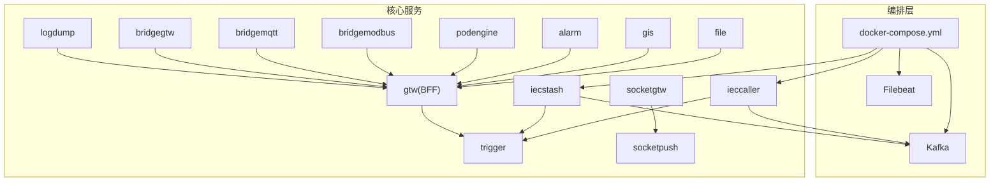
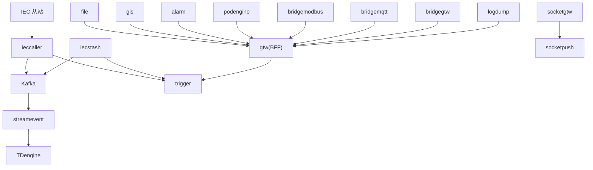
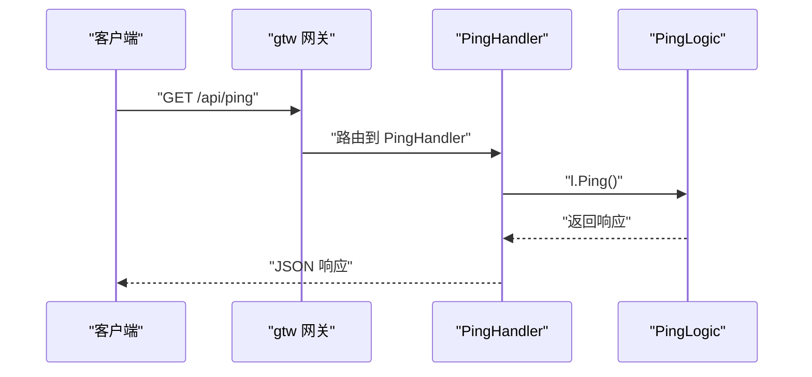
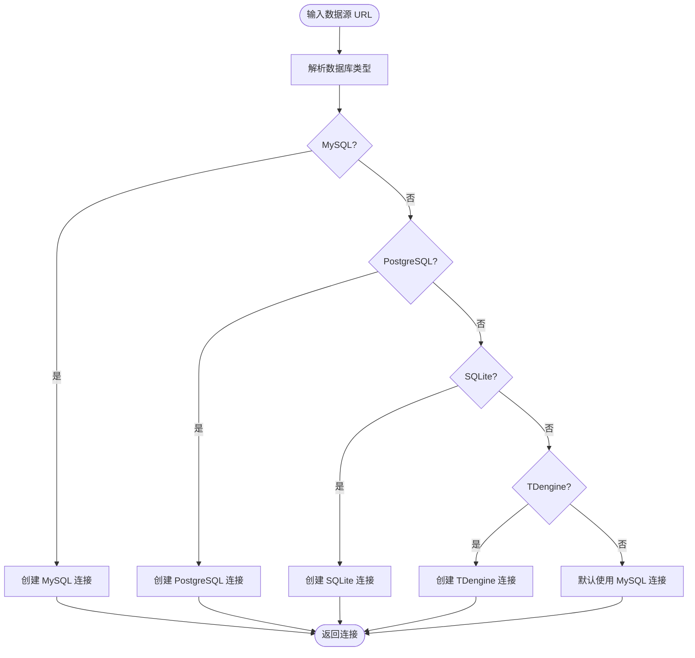
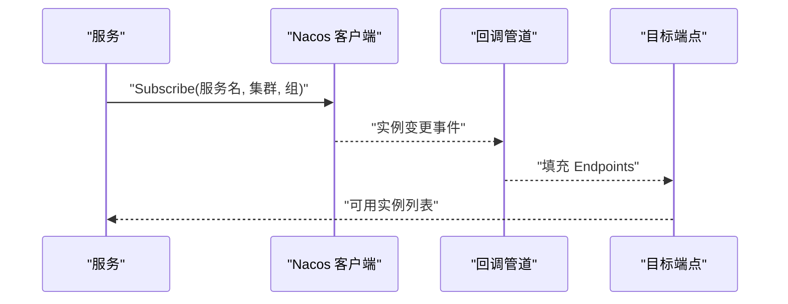
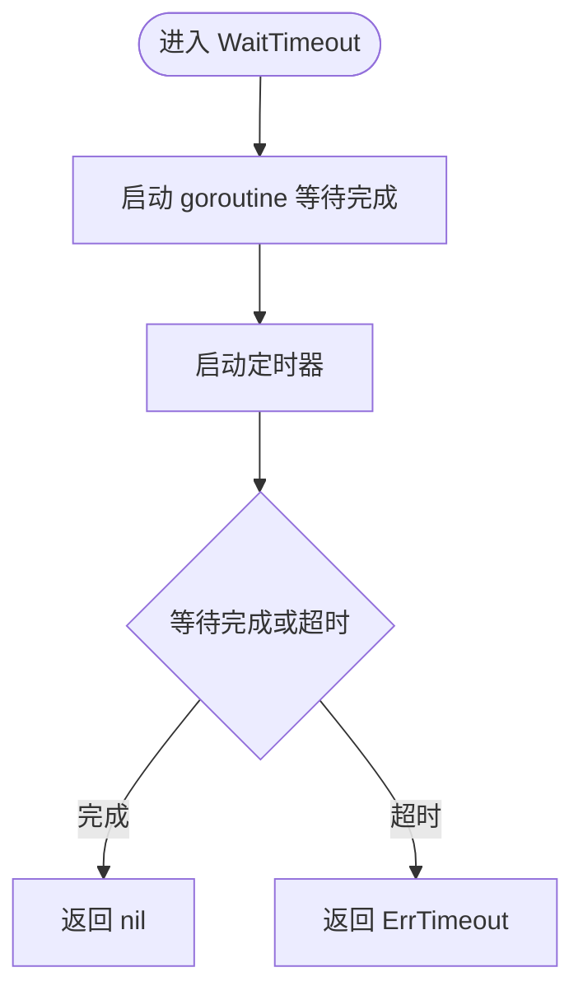
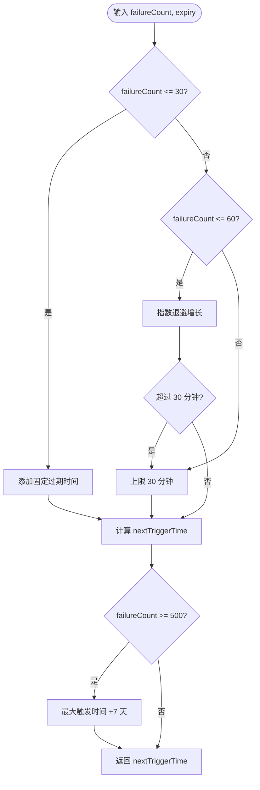
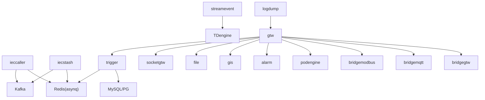

# 维护与故障排查

<cite>
**本文引用的文件**   
- [README.md](file://README.md)
- [docker-compose.yml](file://deploy/docker-compose.yml)
- [manage.sh](file://util/manage.sh)
- [trigger.yaml](file://app/trigger/etc/trigger.yaml)
- [ieccaller.yaml](file://app/ieccaller/etc/ieccaller.yaml)
- [iecstash.yaml](file://app/iecstash/etc/iecstash.yaml)
- [filebeat.yml](file://deploy/filebeat/conf/filebeat.yml)
- [loggerInterceptor.go](file://common/Interceptor/rpcserver/loggerInterceptor.go)
- [dbx.go](file://common/dbx/dbx.go)
- [builder.go](file://common/nacosx/builder.go)
- [pinghandler.go](file://gtw/internal/handler/gtw/pinghandler.go)
- [waitgroup.go](file://common/iec104/waitgroup/waitgroup.go)
- [backoff.go](file://common/tool/backoff.go)
- [resilience-patterns.md](file://.trae/skills/zero-skills/references/resilience-patterns.md)
- [database-patterns.md](file://.trae/skills/zero-skills/references/database-patterns.md)
- [common-issues.md](file://.trae/skills/zero-skills/troubleshooting/common-issues.md)
</cite>

## 目录
1. [简介](#简介)
2. [项目结构](#项目结构)
3. [核心组件](#核心组件)
4. [架构总览](#架构总览)
5. [详细组件分析](#详细组件分析)
6. [依赖分析](#依赖分析)
7. [性能考虑](#性能考虑)
8. [故障排查指南](#故障排查指南)
9. [结论](#结论)
10. [附录](#附录)

## 简介
本指南面向 zero-service 项目的运维与开发团队，提供系统化的维护与故障排查方法论与实操步骤。内容涵盖日常维护（服务重启、配置更新、日志清理、数据备份）、系统监控与健康检查、常见故障诊断流程（网络连接、服务崩溃、数据库连接失败、消息队列异常）、日志分析技巧（日志级别、关键信息提取、定位方法）、性能优化建议（JVM 参数调优、数据库查询优化、缓存策略调整），以及应急响应流程（故障升级、回滚与灾难恢复）。

## 项目结构
- 服务分布：项目采用多微服务架构，核心服务包括 IEC 104 数采平台（ieccaller、iecstash、streamevent）、Trigger 异步任务调度、SocketIO 实时通信（socketgtw、socketpush）、文件服务、GIS、告警、容器管理、协议桥接（Modbus、MQTT、HTTP）、日志导出、BFF 网关（gtw）等。
- 编排与依赖：通过 Docker Compose 编排 Kafka、Filebeat、部分核心服务；服务间通过 gRPC、HTTP、Kafka、Redis、数据库等进行交互。
- 配置管理：各服务配置集中于 etc/ 目录，包含日志、Redis、Kafka、数据库、Nacos 等关键参数。

图表来源
- [docker-compose.yml:1-110](file://deploy/docker-compose.yml#L1-L110)

章节来源
- [README.md:15-108](file://README.md#L15-L108)
- [docker-compose.yml:1-110](file://deploy/docker-compose.yml#L1-L110)

## 核心组件
- IEC 104 数采平台：ieccaller 负责主站通信与三协议推送，iecstash 负责 Kafka 消费与合并，streamevent 负责数据落库与时序存储。
- Trigger 异步任务调度：基于 asynq 的分布式任务队列，支持定时/延时任务与回调；自研计划任务引擎。
- SocketIO 实时通信：socketgtw 负责连接管理与消息路由，socketpush 负责推送与后端调用。
- BFF 网关（gtw）：统一 HTTP/gRPC 入口，聚合后端服务并提供 grpc-gateway。
- 协议桥接：Modbus、MQTT、HTTP 等协议桥接服务，实现与外部系统的互通。
- 日志与监控：Filebeat 收集日志并投递 Kafka；服务内置日志配置与拦截器；Nacos 用于服务注册与发现。

章节来源
- [README.md:110-206](file://README.md#L110-L206)
- [trigger.yaml:1-37](file://app/trigger/etc/trigger.yaml#L1-L37)
- [ieccaller.yaml:1-79](file://app/ieccaller/etc/ieccaller.yaml#L1-L79)
- [iecstash.yaml:1-46](file://app/iecstash/etc/iecstash.yaml#L1-L46)

## 架构总览
系统采用“BFF 网关 + 微服务 + 消息中间件 + 存储”的分层架构。IEC 104 从站数据经 ieccaller 推送到 Kafka，再由 iecstash 消费合并，最终由 streamevent 落库至 TDengine；Trigger 作为任务调度中枢，支撑计划任务与异步任务；SocketIO 提供实时通信能力；gtw 聚合对外接口。

图表来源
- [README.md:112-127](file://README.md#L112-L127)
- [ieccaller.yaml:35-58](file://app/ieccaller/etc/ieccaller.yaml#L35-L58)
- [iecstash.yaml:18-42](file://app/iecstash/etc/iecstash.yaml#L18-L42)

## 详细组件分析

### 组件 A：日志与健康检查
- 日志拦截器：在 gRPC 服务端拦截请求，注入用户与追踪上下文，并对错误进行统一记录，便于问题定位。
- 日志配置：各服务配置文件包含日志编码、输出路径、级别与保留天数等，便于集中管理。
- 健康检查：BFF 网关提供 ping 接口，可用于快速探测服务可用性。

图表来源
- [pinghandler.go:1-22](file://gtw/internal/handler/gtw/pinghandler.go#L1-L22)

章节来源
- [loggerInterceptor.go:1-45](file://common/Interceptor/rpcserver/loggerInterceptor.go#L1-L45)
- [trigger.yaml:5-11](file://app/trigger/etc/trigger.yaml#L5-L11)
- [ieccaller.yaml:7-12](file://app/ieccaller/etc/ieccaller.yaml#L7-L12)
- [iecstash.yaml:4-9](file://app/iecstash/etc/iecstash.yaml#L4-L9)
- [pinghandler.go:1-22](file://gtw/internal/handler/gtw/pinghandler.go#L1-L22)

### 组件 B：数据库连接与适配
- 自动类型识别：根据数据源 URL 自动识别数据库类型（MySQL、PostgreSQL、SQLite、TDengine），并创建相应连接。
- 适配器模式：提供 SqlConnAdapter，将底层 sql.DB 适配为可执行事务、查询、预处理等操作。
- ORM 日志：集成 goqu 并将 SQL 日志输出到统一日志系统，便于审计与性能分析。

图表来源
- [dbx.go:31-64](file://common/dbx/dbx.go#L31-L64)

章节来源
- [dbx.go:1-155](file://common/dbx/dbx.go#L1-L155)

### 组件 C：服务注册与发现（Nacos）
- 客户端配置：支持命名空间、用户名密码、超时、日志目录等参数。
- 订阅机制：通过 SubscribeParam 订阅指定服务，回调处理实例变更。
- 端点填充：订阅回调通过管道传递实例列表，后台协程填充目标端点。

图表来源
- [builder.go:41-85](file://common/nacosx/builder.go#L41-L85)

章节来源
- [builder.go:41-85](file://common/nacosx/builder.go#L41-L85)

### 组件 D：等待组与超时控制
- WaitGroup 包装：在等待 goroutine 完成时提供超时控制，避免长时间阻塞导致资源泄漏。
- Await/AwaitWithError：提供便捷的等待与错误返回封装，支持超时与错误优先处理。

图表来源
- [waitgroup.go:20-43](file://common/iec104/waitgroup/waitgroup.go#L20-L43)

章节来源
- [waitgroup.go:1-112](file://common/iec104/waitgroup/waitgroup.go#L1-L112)

### 组件 E：指数退避与触发策略
- 计算下一次触发时间：根据失败次数与过期时间计算下次触发时间，超过阈值后限制最大等待时间。
- 时间字符串格式化：将时间转换为可读字符串，便于日志与告警展示。

图表来源
- [backoff.go:9-35](file://common/tool/backoff.go#L9-L35)

章节来源
- [backoff.go:1-40](file://common/tool/backoff.go#L1-L40)

## 依赖分析
- 外部依赖：Kafka（消息队列）、Redis（任务队列/缓存）、MySQL/PostgreSQL/SQLite/TDengine（数据库）、Nacos（服务注册与发现）、Filebeat（日志采集）。
- 服务间耦合：ieccaller/iecstash 与 Kafka 强耦合；Trigger 与 Redis 强耦合；streamevent 与 TDengine 强耦合；gtw 作为聚合层与多个后端服务交互。
- 配置耦合：各服务配置文件集中管理日志、连接、超时、GracePeriod 等关键参数，便于统一维护。

图表来源
- [trigger.yaml:19-37](file://app/trigger/etc/trigger.yaml#L19-L37)
- [ieccaller.yaml:35-79](file://app/ieccaller/etc/ieccaller.yaml#L35-L79)
- [iecstash.yaml:18-46](file://app/iecstash/etc/iecstash.yaml#L18-L46)

章节来源
- [trigger.yaml:1-37](file://app/trigger/etc/trigger.yaml#L1-L37)
- [ieccaller.yaml:1-79](file://app/ieccaller/etc/ieccaller.yaml#L1-L79)
- [iecstash.yaml:1-46](file://app/iecstash/etc/iecstash.yaml#L1-L46)

## 性能考虑
- JVM 参数调优：对于 Go 应用，重点在于 GC 参数与并发控制（GOGC、GOMAXPROCS）。建议结合 CPU/内存/GC 指标动态调整。
- 数据库查询优化：使用连接池（默认 MaxOpenConns/MaxIdleConns），合理设置连接生命周期；对热点查询建立索引，避免全表扫描；使用批量写入与事务合并。
- 缓存策略调整：利用 go-zero 缓存层，设置合理的过期时间与命中率目标；对读多写少的数据启用缓存；定期清理失效键。
- 消息队列吞吐：Kafka 消费端的 Conns、Consumers、Processors 与分区数匹配，避免过度并发导致抖动；合理设置 MinBytes/MaxBytes 与提交策略。
- 超时与负载保护：为所有外部调用设置合理超时；启用负载保护（load shedding）与熔断（circuit breaker）；对高频接口实施限流。

章节来源
- [resilience-patterns.md:565-619](file://.trae/skills/zero-skills/references/resilience-patterns.md#L565-L619)
- [database-patterns.md:431-480](file://.trae/skills/zero-skills/references/database-patterns.md#L431-L480)

## 故障排查指南

### 日常维护操作
- 服务重启
  - 使用编排工具：通过 docker-compose 管理核心服务（如 ieccaller、iecstash、bridgegtw、bridgedump）。
  - 使用管理脚本：util/manage.sh 支持 restart/up/start/stop 操作，可按服务名批量执行。
- 配置更新
  - 修改 etc/ 下对应服务的 YAML 配置（如 Redis、Kafka、数据库、日志级别等）。
  - 更新后重启服务或触发热加载（若支持）。
- 日志清理
  - 依据配置中的 KeepDays 控制日志保留天数；结合系统磁盘策略定期清理。
  - Filebeat 侧可通过 ignore_older/clean_inactive 控制日志文件生命周期。
- 数据备份
  - 数据库：针对 MySQL/PG/SQLite/TDengine 制定备份策略（增量/全量、压缩、异地）。
  - Kafka：关注数据保留策略与快照清理；确保消费者组位移安全。
  - Redis：定期 RDB/AOF 备份；集群模式注意槽位一致性。

章节来源
- [docker-compose.yml:1-110](file://deploy/docker-compose.yml#L1-L110)
- [manage.sh:1-35](file://util/manage.sh#L1-L35)
- [trigger.yaml:5-11](file://app/trigger/etc/trigger.yaml#L5-L11)
- [filebeat.yml:21-24](file://deploy/filebeat/conf/filebeat.yml#L21-L24)

### 系统监控与健康检查
- 服务状态检查
  - gRPC/HTTP 健康探针：通过 gtw 的 ping 接口快速验证服务可用性。
  - 服务注册中心：Nacos 订阅服务实例变化，及时发现下线/上线。
- 资源使用监控
  - CPU/内存/GC：结合容器监控与应用日志中的 GC 指标评估压力。
  - Kafka 消费滞后：关注 lag 指标，必要时扩容消费者或分区。
  - Redis 队列长度：监控任务堆积与延迟。
- 性能指标分析
  - 请求耗时分布（avg/med/p90/p99）、QPS、丢弃/限流/熔断状态。
  - 数据库慢查询与连接池饱和度。

章节来源
- [pinghandler.go:1-22](file://gtw/internal/handler/gtw/pinghandler.go#L1-L22)
- [builder.go:41-85](file://common/nacosx/builder.go#L41-L85)
- [resilience-patterns.md:621-641](file://.trae/skills/zero-skills/references/resilience-patterns.md#L621-L641)

### 常见故障诊断流程
- 网络连接问题
  - 症状：服务间 gRPC/HTTP 调用超时或拒绝。
  - 排查：检查服务发现（Nacos）、DNS/网络连通性、防火墙策略；确认端口映射与 host 配置。
- 服务崩溃
  - 症状：进程退出、core dump、频繁重启。
  - 排查：查看服务日志（含拦截器错误记录）、堆栈信息；检查资源限制（内存/CPU）、goroutine 泄漏。
- 数据库连接失败
  - 症状：SQL 连接超时、认证失败、连接池耗尽。
  - 排查：核对数据源 URL、凭据、网络连通；调整连接池参数；确认数据库实例状态。
- 消息队列异常
  - 症状：Kafka 消费停滞、生产积压、分区不可用。
  - 排查：检查 broker 状态、分区 leader/follower、消费者组位移；调整 Conns/Consumers/Processors；核对网络与磁盘。

章节来源
- [common-issues.md:171-210](file://.trae/skills/zero-skills/troubleshooting/common-issues.md#L171-L210)
- [common-issues.md:623-713](file://.trae/skills/zero-skills/troubleshooting/common-issues.md#L623-L713)

### 日志分析技巧
- 日志级别设置：在配置文件中设置 Level（如 info/warn/error），生产环境建议从 info 起步，必要时临时提升。
- 关键信息提取：利用拦截器注入 TraceId、用户信息等上下文，结合日志聚合系统进行关联检索。
- 问题定位方法：围绕 TraceId/请求 ID 聚合链路日志；关注错误拦截器输出的错误详情；结合数据库/消息队列日志交叉验证。

章节来源
- [loggerInterceptor.go:1-45](file://common/Interceptor/rpcserver/loggerInterceptor.go#L1-L45)
- [trigger.yaml:5-11](file://app/trigger/etc/trigger.yaml#L5-L11)
- [filebeat.yml:1-122](file://deploy/filebeat/conf/filebeat.yml#L1-L122)

### 性能优化建议
- JVM 参数调优：Go 应用通过 GOGC、GOMAXPROCS 控制 GC 与并行度；结合 CPU/内存/GC 指标动态调整。
- 数据库查询优化：连接池参数、索引优化、批量写入、事务合并；避免 N+1 查询。
- 缓存策略调整：热点数据缓存、合理过期、缓存穿透防护、缓存雪崩预防。
- 消息队列吞吐：消费者并发与分区数匹配、批大小与提交策略、压缩与分区策略。

章节来源
- [resilience-patterns.md:565-619](file://.trae/skills/zero-skills/references/resilience-patterns.md#L565-L619)
- [database-patterns.md:431-480](file://.trae/skills/zero-skills/references/database-patterns.md#L431-L480)

### 应急响应流程
- 故障升级：分级响应（P0/P1/P2），明确升级路径与联系人；记录 SLA 与影响范围。
- 回滚操作：版本化发布与回滚策略；数据库迁移需具备逆向脚本；缓存与配置回滚。
- 灾难恢复：备份策略与演练；RTO/RPO 指标；跨机房容灾；服务降级与熔断配合。

章节来源
- [README.md:300-325](file://README.md#L300-L325)

## 结论
通过标准化的维护流程、完善的监控与健康检查、系统化的故障排查方法、精细化的日志分析与性能优化策略，以及严谨的应急响应机制，zero-service 可以在复杂工业场景中保持高可用与高性能。建议将本文方法固化为 SOP，并结合实际运行数据持续迭代优化。

## 附录
- 快速命令参考
  - 启动/停止/重启服务：使用 util/manage.sh 或 docker-compose。
  - 查看 Kafka 界面：Kafdrop 端口映射 39000。
  - 日志采集：Filebeat 读取 bridgedump 目录并投递 Kafka。

章节来源
- [manage.sh:1-35](file://util/manage.sh#L1-L35)
- [docker-compose.yml:101-110](file://deploy/docker-compose.yml#L101-L110)
- [filebeat.yml:1-122](file://deploy/filebeat/conf/filebeat.yml#L1-L122)