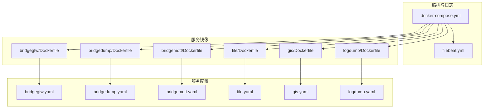
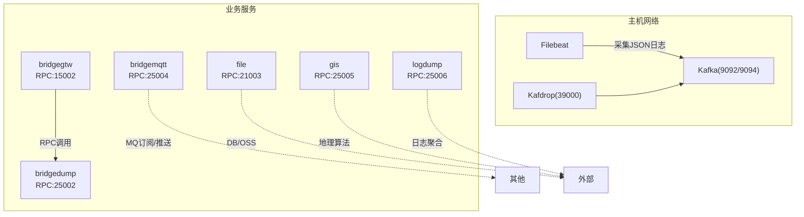
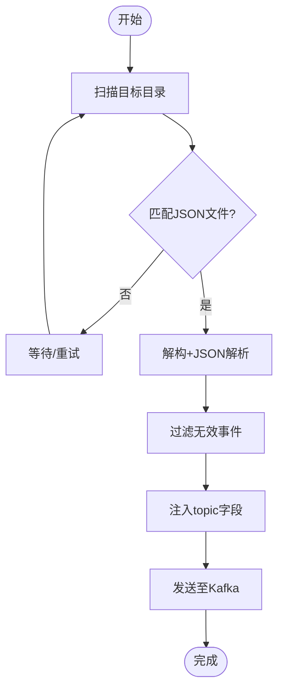
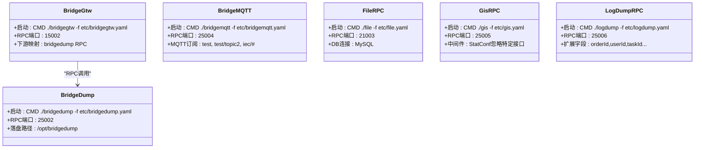
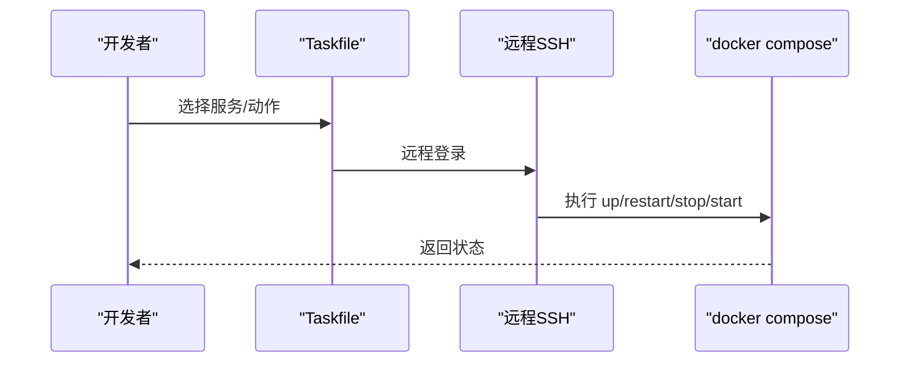
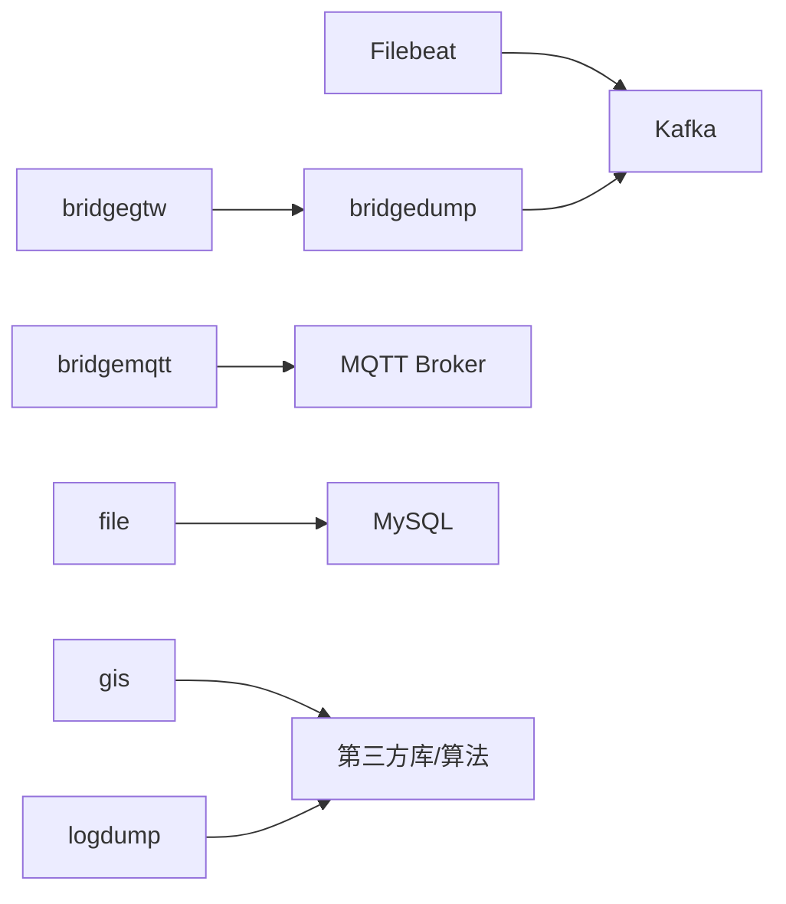

# 部署与运维

<cite>
**本文引用的文件**
- [deploy/docker-compose.yml](file://deploy/docker-compose.yml)
- [deploy/filebeat/conf/filebeat.yml](file://deploy/filebeat/conf/filebeat.yml)
- [util/Taskfile.yml](file://util/Taskfile.yml)
- [util/Taskfile-docker.yml](file://util/Taskfile-docker.yml)
- [util/config.yaml](file://util/config.yaml)
- [util/config-sh.yaml](file://util/config-sh.yaml)
- [app/bridgegtw/Dockerfile](file://app/bridgegtw/Dockerfile)
- [app/bridgedump/Dockerfile](file://app/bridgedump/Dockerfile)
- [app/bridgemqtt/Dockerfile](file://app/bridgemqtt/Dockerfile)
- [app/file/Dockerfile](file://app/file/Dockerfile)
- [app/gis/Dockerfile](file://app/gis/Dockerfile)
- [app/logdump/Dockerfile](file://app/logdump/Dockerfile)
- [app/bridgegtw/etc/bridgegtw.yaml](file://app/bridgegtw/etc/bridgegtw.yaml)
- [app/bridgedump/etc/bridgedump.yaml](file://app/bridgedump/etc/bridgedump.yaml)
- [app/bridgemqtt/etc/bridgemqtt.yaml](file://app/bridgemqtt/etc/bridgemqtt.yaml)
- [app/file/etc/file.yaml](file://app/file/etc/file.yaml)
- [app/gis/etc/gis.yaml](file://app/gis/etc/gis.yaml)
- [app/logdump/etc/logdump.yaml](file://app/logdump/etc/logdump.yaml)
</cite>

## 目录
1. [简介](#简介)
2. [项目结构](#项目结构)
3. [核心组件](#核心组件)
4. [架构总览](#架构总览)
5. [详细组件分析](#详细组件分析)
6. [依赖关系分析](#依赖关系分析)
7. [性能考虑](#性能考虑)
8. [故障排查指南](#故障排查指南)
9. [结论](#结论)
10. [附录](#附录)

## 简介
本文件面向Zero-Service项目的部署与运维团队，提供从容器化部署、CI/CD流程设计、监控与日志、集群与高可用、性能调优到运维最佳实践的完整技术文档。内容以仓库中的实际配置与脚本为基础，结合服务间依赖与数据流，帮助读者快速落地并高效维护生产环境。

## 项目结构
本项目采用多服务单体仓库组织方式，按功能域划分应用模块与公共组件，同时提供统一的容器编排与日志采集配置。关键目录与职责如下：
- deploy：容器编排与日志采集配置（docker-compose、Filebeat）
- app/*：各微服务源码与打包产物（含Dockerfile与配置文件）
- util：运维任务编排与远程部署脚本（Taskfile、配置模板）
- common：跨服务通用能力（拦截器、异步任务、MQ客户端等）

图表来源
- [deploy/docker-compose.yml:1-110](file://deploy/docker-compose.yml#L1-L110)
- [deploy/filebeat/conf/filebeat.yml:1-122](file://deploy/filebeat/conf/filebeat.yml#L1-L122)
- [app/bridgegtw/Dockerfile:1-43](file://app/bridgegtw/Dockerfile#L1-L43)
- [app/bridgedump/Dockerfile:1-42](file://app/bridgedump/Dockerfile#L1-L42)
- [app/bridgemqtt/Dockerfile:1-42](file://app/bridgemqtt/Dockerfile#L1-L42)
- [app/file/Dockerfile:1-42](file://app/file/Dockerfile#L1-L42)
- [app/gis/Dockerfile:1-41](file://app/gis/Dockerfile#L1-L41)
- [app/logdump/Dockerfile:1-42](file://app/logdump/Dockerfile#L1-L42)
- [app/bridgegtw/etc/bridgegtw.yaml:1-40](file://app/bridgegtw/etc/bridgegtw.yaml#L1-L40)
- [app/bridgedump/etc/bridgedump.yaml:1-10](file://app/bridgedump/etc/bridgedump.yaml#L1-L10)
- [app/bridgemqtt/etc/bridgemqtt.yaml:1-48](file://app/bridgemqtt/etc/bridgemqtt.yaml#L1-L48)
- [app/file/etc/file.yaml:1-23](file://app/file/etc/file.yaml#L1-L23)
- [app/gis/etc/gis.yaml:1-19](file://app/gis/etc/gis.yaml#L1-L19)
- [app/logdump/etc/logdump.yaml:1-26](file://app/logdump/etc/logdump.yaml#L1-L26)

章节来源
- [deploy/docker-compose.yml:1-110](file://deploy/docker-compose.yml#L1-L110)
- [deploy/filebeat/conf/filebeat.yml:1-122](file://deploy/filebeat/conf/filebeat.yml#L1-L122)

## 核心组件
- 容器编排与网络
  - 使用docker-compose定义Kafka、Filebeat、各业务服务及可视化工具，服务间通过host网络共享主机网络栈，降低网络开销并简化端口暴露。
  - Kafka配置支持控制器与broker角色，设置监听与对外映射，保证容器内外通信一致性。
- 日志采集与传输
  - Filebeat监听桥接采集输出目录，按主题动态路由至Kafka；内置JSON解析与字段清洗逻辑，减少下游处理负担。
- 服务镜像与启动
  - 各服务均提供独立Dockerfile，统一设置时区、代理参数与最小化运行时，通过命令行参数加载配置文件。
- 远程运维与任务编排
  - 提供Taskfile与配置模板，支持远程SSH执行docker compose命令，便于批量或分组管理服务。

章节来源
- [deploy/docker-compose.yml:1-110](file://deploy/docker-compose.yml#L1-L110)
- [deploy/filebeat/conf/filebeat.yml:1-122](file://deploy/filebeat/conf/filebeat.yml#L1-L122)
- [util/Taskfile.yml:1-33](file://util/Taskfile.yml#L1-L33)
- [util/Taskfile-docker.yml:1-37](file://util/Taskfile-docker.yml#L1-L37)
- [util/config.yaml:1-26](file://util/config.yaml#L1-L26)
- [util/config-sh.yaml:1-20](file://util/config-sh.yaml#L1-L20)

## 架构总览
下图展示了Zero-Service在容器化环境中的整体拓扑：业务服务通过网关/直连暴露RPC端口，Filebeat采集桥接输出的日志并投递到Kafka，Kafka可被外部工具或下游系统消费。

图表来源
- [deploy/docker-compose.yml:1-110](file://deploy/docker-compose.yml#L1-L110)
- [deploy/filebeat/conf/filebeat.yml:1-122](file://deploy/filebeat/conf/filebeat.yml#L1-L122)
- [app/bridgegtw/etc/bridgegtw.yaml:1-40](file://app/bridgegtw/etc/bridgegtw.yaml#L1-L40)
- [app/bridgedump/etc/bridgedump.yaml:1-10](file://app/bridgedump/etc/bridgedump.yaml#L1-L10)
- [app/bridgemqtt/etc/bridgemqtt.yaml:1-48](file://app/bridgemqtt/etc/bridgemqtt.yaml#L1-L48)
- [app/file/etc/file.yaml:1-23](file://app/file/etc/file.yaml#L1-L23)
- [app/gis/etc/gis.yaml:1-19](file://app/gis/etc/gis.yaml#L1-L19)
- [app/logdump/etc/logdump.yaml:1-26](file://app/logdump/etc/logdump.yaml#L1-L26)

## 详细组件分析

### 容器编排与网络配置
- Kafka
  - 监听与对外映射分离，容器内使用9094，宿主映射9092；支持控制器与broker角色，设置投票与分区数，确保单节点可用性。
  - 数据持久化挂载至本地目录，避免重启丢失。
- Filebeat
  - 通过root权限与严格权限模式启动，挂载容器日志目录以采集容器标准输出；按输入目录匹配JSON文件并注入topic字段，最终投递到Kafka。
- 业务服务
  - 所有服务均使用host网络，避免额外网络层损耗；通过内存限制约束资源占用；挂载配置与日志目录，便于运维与审计。
  - bridgegtw作为RPC网关，将HTTP请求映射到下游gRPC服务；其他服务以gRPC直连为主。

章节来源
- [deploy/docker-compose.yml:1-110](file://deploy/docker-compose.yml#L1-L110)

### 日志采集与传输（Filebeat）
- 输入
  - 监听桥接输出目录的多个子目录，按时间窗口与文件状态清理策略控制采集节奏。
- 处理
  - 使用解构与JSON解析提取结构化字段，过滤无效事件，保留必要字段。
- 输出
  - 发送到Kafka，按输入阶段注入的topic动态路由，压缩与消息大小可配置。

图表来源
- [deploy/filebeat/conf/filebeat.yml:1-122](file://deploy/filebeat/conf/filebeat.yml#L1-L122)

章节来源
- [deploy/filebeat/conf/filebeat.yml:1-122](file://deploy/filebeat/conf/filebeat.yml#L1-L122)

### 服务镜像与启动参数
- 统一特性
  - 设置Asia/Shanghai时区；支持HTTP/HTTPS代理与国内GOPROXY；部分服务启用CGO以满足特定库需求。
  - CMD通过-f参数加载etc目录下的配置文件，便于容器内配置管理。
- bridgegtw
  - 作为RPC网关，映射下游gRPC服务接口，支持HTTP到gRPC的路径与方法映射。
- bridgedump
  - 对外暴露gRPC端口，负责桥接数据落盘与转发。
- bridgemqtt
  - 内置MQTT客户端与Nacos注册配置，支持订阅与事件推送。
- file/gis/logdump
  - file服务连接MySQL；gis服务可配置中间件统计忽略某些接口；logdump服务支持扩展字段注入。

图表来源
- [app/bridgegtw/Dockerfile:1-43](file://app/bridgegtw/Dockerfile#L1-L43)
- [app/bridgedump/Dockerfile:1-42](file://app/bridgedump/Dockerfile#L1-L42)
- [app/bridgemqtt/Dockerfile:1-42](file://app/bridgemqtt/Dockerfile#L1-L42)
- [app/file/Dockerfile:1-42](file://app/file/Dockerfile#L1-L42)
- [app/gis/Dockerfile:1-41](file://app/gis/Dockerfile#L1-L41)
- [app/logdump/Dockerfile:1-42](file://app/logdump/Dockerfile#L1-L42)
- [app/bridgegtw/etc/bridgegtw.yaml:1-40](file://app/bridgegtw/etc/bridgegtw.yaml#L1-L40)
- [app/bridgedump/etc/bridgedump.yaml:1-10](file://app/bridgedump/etc/bridgedump.yaml#L1-L10)
- [app/bridgemqtt/etc/bridgemqtt.yaml:1-48](file://app/bridgemqtt/etc/bridgemqtt.yaml#L1-L48)
- [app/file/etc/file.yaml:1-23](file://app/file/etc/file.yaml#L1-L23)
- [app/gis/etc/gis.yaml:1-19](file://app/gis/etc/gis.yaml#L1-L19)
- [app/logdump/etc/logdump.yaml:1-26](file://app/logdump/etc/logdump.yaml#L1-L26)

章节来源
- [app/bridgegtw/Dockerfile:1-43](file://app/bridgegtw/Dockerfile#L1-L43)
- [app/bridgedump/Dockerfile:1-42](file://app/bridgedump/Dockerfile#L1-L42)
- [app/bridgemqtt/Dockerfile:1-42](file://app/bridgemqtt/Dockerfile#L1-L42)
- [app/file/Dockerfile:1-42](file://app/file/Dockerfile#L1-L42)
- [app/gis/Dockerfile:1-41](file://app/gis/Dockerfile#L1-L41)
- [app/logdump/Dockerfile:1-42](file://app/logdump/Dockerfile#L1-L42)
- [app/bridgegtw/etc/bridgegtw.yaml:1-40](file://app/bridgegtw/etc/bridgegtw.yaml#L1-L40)
- [app/bridgedump/etc/bridgedump.yaml:1-10](file://app/bridgedump/etc/bridgedump.yaml#L1-L10)
- [app/bridgemqtt/etc/bridgemqtt.yaml:1-48](file://app/bridgemqtt/etc/bridgemqtt.yaml#L1-L48)
- [app/file/etc/file.yaml:1-23](file://app/file/etc/file.yaml#L1-L23)
- [app/gis/etc/gis.yaml:1-19](file://app/gis/etc/gis.yaml#L1-L19)
- [app/logdump/etc/logdump.yaml:1-26](file://app/logdump/etc/logdump.yaml#L1-L26)

### 远程运维与任务编排（Taskfile）
- 支持远程SSH登录，执行docker compose相关命令，适用于多服务器、多服务场景。
- 配置模板提供两套格式：单实例与通配符路径，便于不同环境批量管理。

图表来源
- [util/Taskfile.yml:1-33](file://util/Taskfile.yml#L1-L33)
- [util/Taskfile-docker.yml:1-37](file://util/Taskfile-docker.yml#L1-L37)
- [util/config.yaml:1-26](file://util/config.yaml#L1-L26)
- [util/config-sh.yaml:1-20](file://util/config-sh.yaml#L1-L20)

章节来源
- [util/Taskfile.yml:1-33](file://util/Taskfile.yml#L1-L33)
- [util/Taskfile-docker.yml:1-37](file://util/Taskfile-docker.yml#L1-L37)
- [util/config.yaml:1-26](file://util/config.yaml#L1-L26)
- [util/config-sh.yaml:1-20](file://util/config-sh.yaml#L1-L20)

## 依赖关系分析
- 服务耦合
  - bridgegtw依赖bridgedump的gRPC接口；其他服务相对独立，主要通过Kafka与Filebeat进行异步解耦。
- 数据流
  - Filebeat采集桥接输出，经Kafka汇聚，便于后续消费与分析。
- 外部依赖
  - MySQL（file服务）、Nacos（部分服务注册）、MQTT（bridgemqtt）。

图表来源
- [deploy/docker-compose.yml:1-110](file://deploy/docker-compose.yml#L1-L110)
- [deploy/filebeat/conf/filebeat.yml:1-122](file://deploy/filebeat/conf/filebeat.yml#L1-L122)
- [app/file/etc/file.yaml:1-23](file://app/file/etc/file.yaml#L1-L23)
- [app/bridgemqtt/etc/bridgemqtt.yaml:1-48](file://app/bridgemqtt/etc/bridgemqtt.yaml#L1-L48)

章节来源
- [deploy/docker-compose.yml:1-110](file://deploy/docker-compose.yml#L1-L110)
- [deploy/filebeat/conf/filebeat.yml:1-122](file://deploy/filebeat/conf/filebeat.yml#L1-L122)
- [app/file/etc/file.yaml:1-23](file://app/file/etc/file.yaml#L1-L23)
- [app/bridgemqtt/etc/bridgemqtt.yaml:1-48](file://app/bridgemqtt/etc/bridgemqtt.yaml#L1-L48)

## 性能考虑
- 容器网络
  - 使用host网络减少NAT与DNAT开销，适合高吞吐RPC场景；如需隔离可评估端口复用与防火墙策略。
- 日志采集
  - Filebeat扫描周期与文件关闭时间可按写入频率调整；压缩与消息大小影响吞吐与延迟平衡。
- 服务资源
  - 通过mem_limit限制内存，避免资源争抢；合理设置超时与并发，避免阻塞。
- 数据库与MQ
  - MySQL连接串包含时区与时钟同步；Kafka分区数与副本因子影响吞吐与容灾；建议按峰值流量与SLA评估。
- 中间件统计
  - gis与logdump服务对特定接口启用了统计忽略，有助于降低热点接口的统计开销。

章节来源
- [deploy/docker-compose.yml:1-110](file://deploy/docker-compose.yml#L1-L110)
- [deploy/filebeat/conf/filebeat.yml:1-122](file://deploy/filebeat/conf/filebeat.yml#L1-L122)
- [app/gis/etc/gis.yaml:1-19](file://app/gis/etc/gis.yaml#L1-L19)
- [app/logdump/etc/logdump.yaml:1-26](file://app/logdump/etc/logdump.yaml#L1-L26)
- [app/file/etc/file.yaml:1-23](file://app/file/etc/file.yaml#L1-L23)

## 故障排查指南
- 容器无法启动
  - 检查镜像标签与构建参数是否正确；确认配置挂载路径存在且权限允许。
- 端口冲突
  - host网络下需避免端口重复；Kafka监听与对外映射需一致。
- 日志不入库
  - 校验Filebeat输入路径与JSON结构；确认topic字段注入与Kafka连接；查看Kafdrop验证消息是否到达。
- 服务间调用失败
  - 检查bridgegtw到bridgedump的RPC映射与端口；确认容器网络与防火墙策略。
- 远程运维失败
  - 校验SSH凭据与docker compose路径；确认Taskfile变量已正确传入。

章节来源
- [deploy/docker-compose.yml:1-110](file://deploy/docker-compose.yml#L1-L110)
- [deploy/filebeat/conf/filebeat.yml:1-122](file://deploy/filebeat/conf/filebeat.yml#L1-L122)
- [util/Taskfile-docker.yml:1-37](file://util/Taskfile-docker.yml#L1-L37)

## 结论
通过统一的容器编排、轻量化的日志采集与清晰的服务边界，Zero-Service实现了可运维、可扩展的生产级部署方案。结合Taskfile的远程运维能力与服务自身的配置化管理，可在多环境快速复制并保持一致性。建议在生产环境中进一步完善监控与告警、引入服务网格与自动扩缩容，并持续优化数据库与消息队列参数以匹配业务峰值。

## 附录

### 部署清单（概要）
- 基础设施
  - 主机：具备host网络权限与足够磁盘空间
  - Docker与Compose：确保版本兼容
- 镜像与配置
  - 使用各服务Dockerfile构建镜像，或拉取预构建镜像
  - 将etc目录下的配置文件随容器挂载
- 卷与日志
  - Kafka数据目录、桥接输出目录、日志目录需持久化
- 网络
  - host网络模式；确保端口未被占用；如需隔离可改为用户自定义网络

章节来源
- [deploy/docker-compose.yml:1-110](file://deploy/docker-compose.yml#L1-L110)
- [app/bridgegtw/Dockerfile:1-43](file://app/bridgegtw/Dockerfile#L1-L43)
- [app/bridgedump/Dockerfile:1-42](file://app/bridgedump/Dockerfile#L1-L42)
- [app/bridgemqtt/Dockerfile:1-42](file://app/bridgemqtt/Dockerfile#L1-L42)
- [app/file/Dockerfile:1-42](file://app/file/Dockerfile#L1-L42)
- [app/gis/Dockerfile:1-41](file://app/gis/Dockerfile#L1-L41)
- [app/logdump/Dockerfile:1-42](file://app/logdump/Dockerfile#L1-L42)

### CI/CD流程设计（建议）
- 自动化构建
  - 在CI中按Dockerfile构建镜像，设置镜像标签（如时间戳或版本号），推送至私有仓库。
- 镜像管理
  - 引入镜像签名与漏洞扫描；建立镜像版本策略与过期清理。
- 部署策略
  - 使用滚动升级或蓝绿发布，结合健康检查与灰度流量。
- 回滚机制
  - 记录镜像标签与部署时间；一键回滚至上一个稳定版本。
- 监控与日志
  - 集成指标与链路追踪；统一日志采集与索引；配置告警阈值与通知渠道。

（本节为概念性流程说明，不直接对应具体代码文件）

### 集群部署策略（建议）
- 服务发现
  - 使用Nacos或Consul进行服务注册与发现；在服务配置中启用注册开关。
- 负载均衡
  - 在网关层或反向代理层实现请求分发；根据权重与健康状态切换。
- 高可用
  - 多副本部署与故障转移；Kafka与数据库主从/集群提升可用性。
- 灾难恢复
  - 制定备份与恢复演练计划；确保配置与数据卷可快速恢复。

（本节为概念性策略说明，不直接对应具体代码文件）

### 运维最佳实践（建议）
- 健康检查
  - 为每个服务暴露健康端点，定期探测；失败自动重启或摘除。
- 优雅停机
  - 捕获信号，停止接收新请求，等待在途请求完成。
- 配置热更新
  - 优先通过配置文件挂载；对不支持热加载的配置，采用滚动重启。
- 故障处理
  - 明确故障分级与响应时限；建立值班与升级机制。

（本节为通用运维建议，不直接对应具体代码文件）