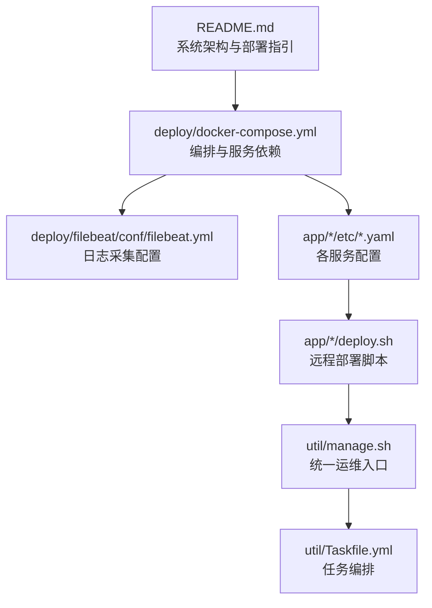
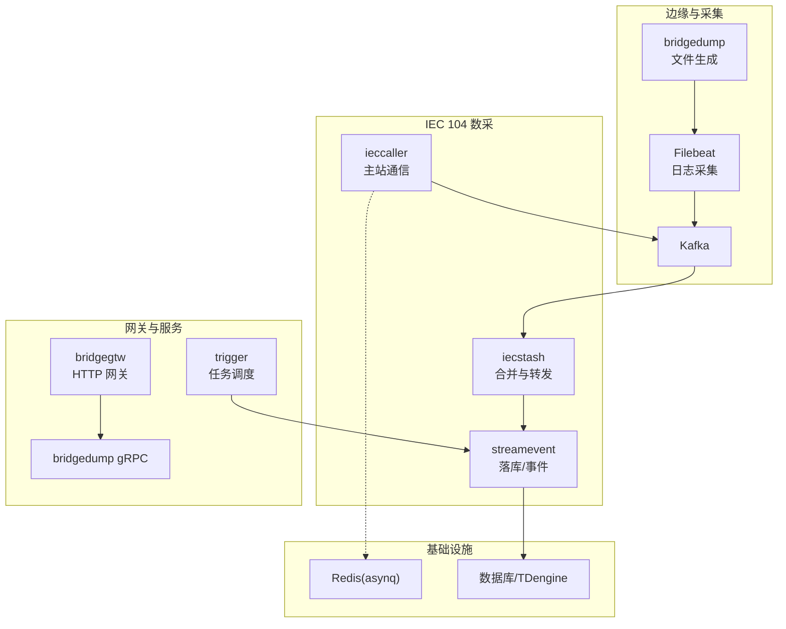
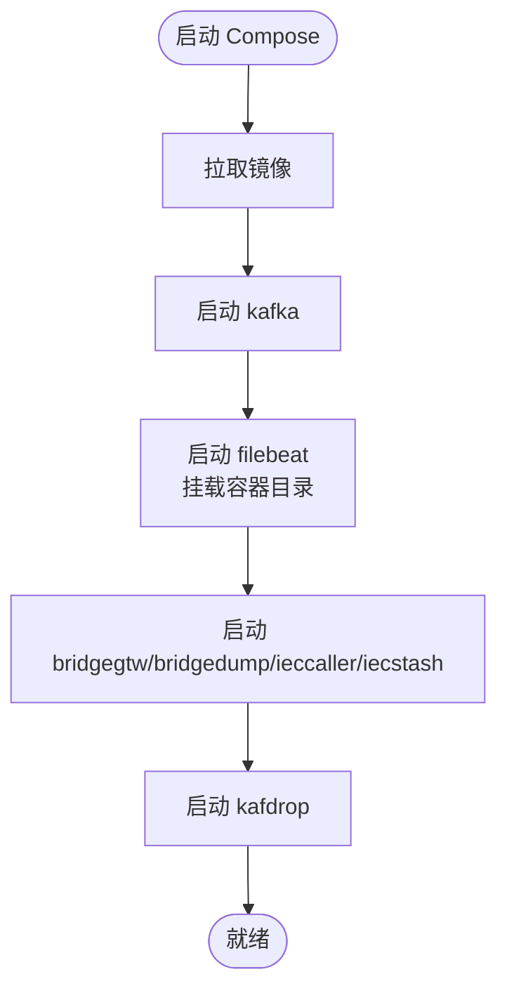
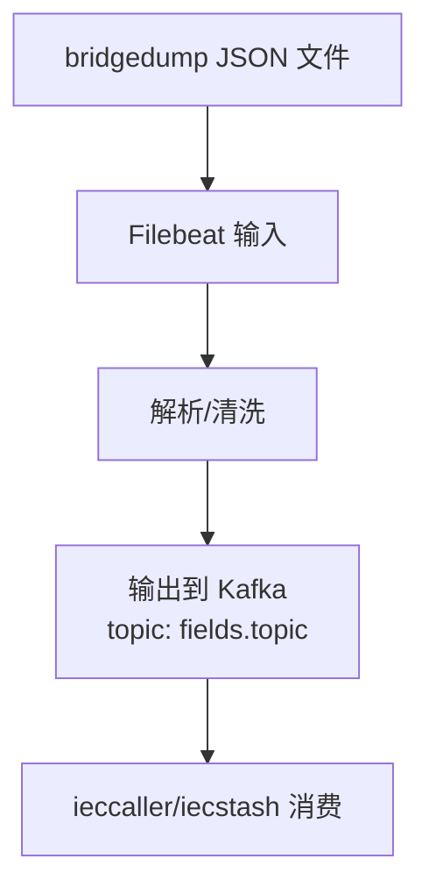
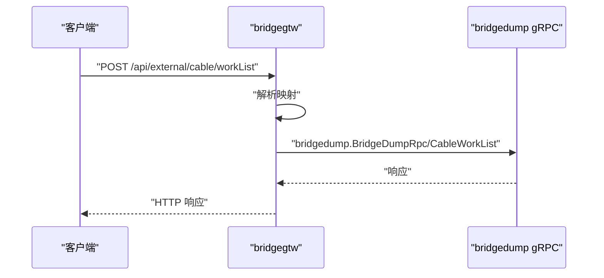
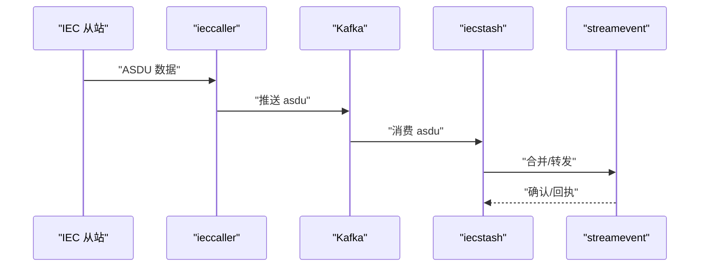
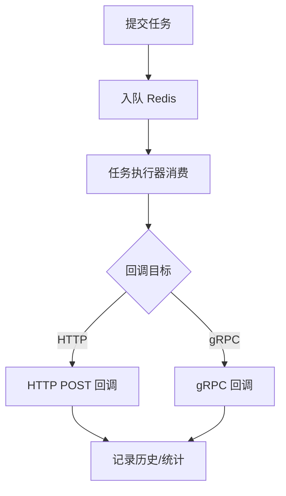
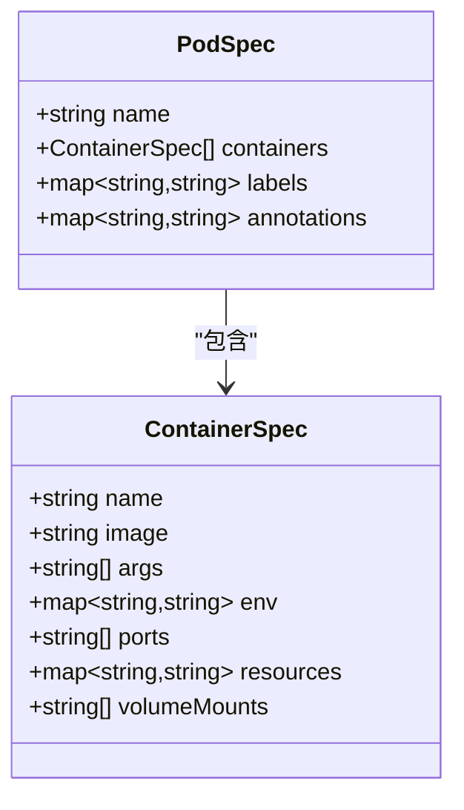
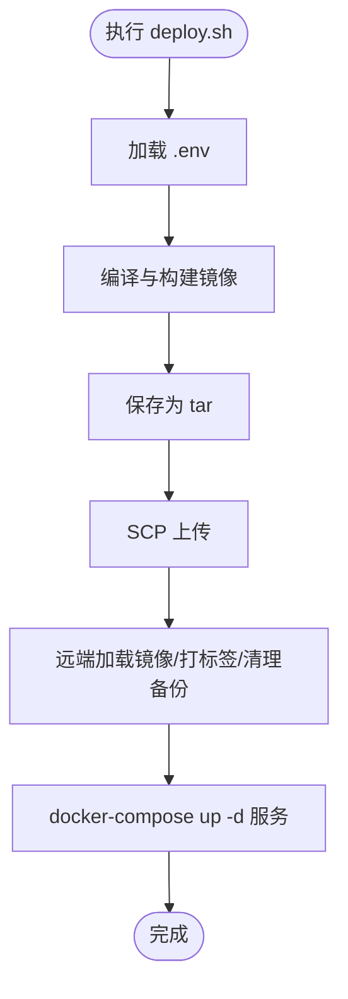
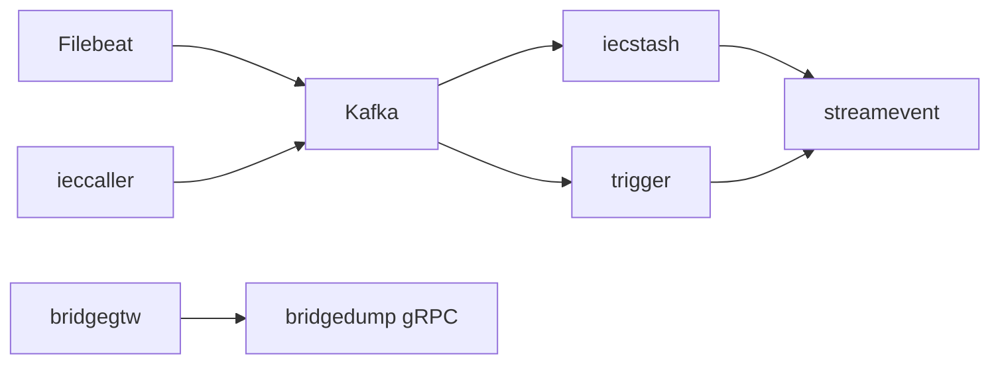

# 部署与运维

<cite>
**本文引用的文件**
- [README.md](file://README.md)
- [docker-compose.yml](file://deploy/docker-compose.yml)
- [filebeat.yml](file://deploy/filebeat/conf/filebeat.yml)
- [ieccaller.yaml](file://app/ieccaller/etc/ieccaller.yaml)
- [trigger.yaml](file://app/trigger/etc/trigger.yaml)
- [bridgegtw.yaml](file://app/bridgegtw/etc/bridgegtw.yaml)
- [bridgedump.yaml](file://app/bridgedump/etc/bridgedump.yaml)
- [deploy.sh（ieccaller）](file://app/ieccaller/deploy.sh)
- [deploy.sh（trigger）](file://app/trigger/deploy.sh)
- [manage.sh](file://util/manage.sh)
- [Taskfile.yml](file://util/Taskfile.yml)
- [overview.md（最佳实践）](file://.trae/skills/zero-skills/best-practices/overview.md)
- [podengine.proto](file://app/podengine/podengine.proto)
- [podengine.pb.go](file://app/podengine/podengine/podengine.pb.go)
- [go.sum](file://go.sum)
</cite>

## 目录
1. [简介](#简介)
2. [项目结构](#项目结构)
3. [核心组件](#核心组件)
4. [架构总览](#架构总览)
5. [详细组件分析](#详细组件分析)
6. [依赖分析](#依赖分析)
7. [性能考虑](#性能考虑)
8. [故障排查指南](#故障排查指南)
9. [结论](#结论)
10. [附录](#附录)

## 简介
本指南面向 zero-service 项目的部署与运维，覆盖单机部署、Docker 部署、集群部署与 Kubernetes 编排；提供 Docker Compose 编排配置详解（服务依赖、网络与数据卷）；阐述 Kubernetes 部署要点（Pod、Service、探针与资源限制）；介绍监控告警与日志管理（Filebeat、Kafka、可视化）；总结配置管理、环境变量与密钥安全实践；并给出故障排查、性能优化、容量规划、备份恢复、滚动更新与灾难恢复的实施方案。

## 项目结构
- 顶层 README 提供系统架构、核心服务与技术栈概览，并给出快速开始与部署指引。
- deploy 目录包含 Docker Compose 编排与 Filebeat 配置。
- app/*/etc 下为各服务配置文件，包含监听地址、日志、Kafka/MQTT/Redis/数据库等连接参数。
- app/*/deploy.sh 提供基于 docker-compose 的远程部署脚本模板。
- util/ 提供统一的运维脚本与任务编排入口。

**图表来源**
- [README.md:15-51](file://README.md#L15-L51)
- [docker-compose.yml:1-110](file://deploy/docker-compose.yml#L1-L110)
- [filebeat.yml:1-122](file://deploy/filebeat/conf/filebeat.yml#L1-L122)
- [Taskfile.yml:1-33](file://util/Taskfile.yml#L1-L33)

**章节来源**
- [README.md:15-51](file://README.md#L15-L51)
- [docker-compose.yml:1-110](file://deploy/docker-compose.yml#L1-L110)
- [filebeat.yml:1-122](file://deploy/filebeat/conf/filebeat.yml#L1-L122)
- [Taskfile.yml:1-33](file://util/Taskfile.yml#L1-L33)

## 核心组件
- 消息与日志
  - Kafka：IEC 104 数据经 ieccaller 推送至 Kafka，再由 iecstash 消费并转发至 streamevent 落库。
  - Filebeat：采集 bridgedump 生成的 JSON 文件，按 topic 分发到 Kafka。
- 服务编排
  - bridgegtw：HTTP 网关，将外部请求映射到 gRPC 服务（如 bridgedump）。
  - ieccaller/iecstash/streamevent：IEC 104 数采链路三件套。
  - trigger：异步任务调度与计划任务管理。
  - 其他：podengine（容器生命周期）、bridgemodbus/bridgemqtt/bridgegtw/bridgedump/logdump 等。
- 监控与可观测性
  - Prometheus 客户端库在 go.sum 中可见，结合 Grafana 可实现指标可视化。
  - Filebeat + Kafka + 外部分析系统可实现日志采集与分析。

**章节来源**
- [README.md:110-225](file://README.md#L110-L225)
- [go.sum:428-440](file://go.sum#L428-L440)

## 架构总览
下图展示零信任、低耦合的服务编排与数据流：

**图表来源**
- [README.md:112-127](file://README.md#L112-L127)
- [filebeat.yml:108-119](file://deploy/filebeat/conf/filebeat.yml#L108-L119)
- [ieccaller.yaml:35-41](file://app/ieccaller/etc/ieccaller.yaml#L35-L41)
- [trigger.yaml:19-28](file://app/trigger/etc/trigger.yaml#L19-L28)

## 详细组件分析

### Docker Compose 编排
- 服务与依赖
  - kafka：提供消息通道，暴露 9092/9094，持久化到 ./data/kafka/data。
  - filebeat：采集 bridgedump 生成的 JSON 文件，挂载 Docker 容器目录，依赖 kafka。
  - bridgegtw/bridgedump/ieccaller/iecstash：均使用 host 网络模式，挂载 etc 与日志目录。
  - kafdrop：Kafka Web UI，连接到 kafka:9092。
- 网络与数据卷
  - host 网络模式简化了服务间 gRPC/HTTP 监听与端口暴露。
  - 数据卷：/app/etc、/opt/bridgedump、/opt/logs、/var/lib/kafka/data。
- 环境变量与时区
  - TZ=Asia/Shanghai 统一时区，避免日志与时钟偏差。
- 依赖顺序
  - filebeat 依赖 kafka；其他服务依赖各自上游（如 ieccaller 依赖 Kafka/MQTT/DB）。

**图表来源**
- [docker-compose.yml:1-110](file://deploy/docker-compose.yml#L1-L110)

**章节来源**
- [docker-compose.yml:1-110](file://deploy/docker-compose.yml#L1-L110)
- [filebeat.yml:44-50](file://deploy/filebeat/conf/filebeat.yml#L44-L50)

### Kafka 与 Filebeat 配置
- Kafka
  - 监听与广告地址分离，支持容器内外访问。
  - 单节点配置，副本因子与 ISR 设置为 1，适合开发测试。
- Filebeat
  - 监听 bridgedump 生成的 JSON 文件目录，按 fields.topic 动态路由到 Kafka。
  - 多行匹配、JSON 解析、忽略旧文件、清理非活动状态等策略保障稳定性。

**图表来源**
- [filebeat.yml:4-72](file://deploy/filebeat/conf/filebeat.yml#L4-L72)
- [filebeat.yml:110-119](file://deploy/filebeat/conf/filebeat.yml#L110-L119)

**章节来源**
- [filebeat.yml:1-122](file://deploy/filebeat/conf/filebeat.yml#L1-L122)

### 网关 bridgegtw 与 gRPC 映射
- bridgegtw 将 HTTP 请求映射到 gRPC 方法，配置包含：
  - Upstreams.grpc.Endpoints 指向本地 gRPC 服务。
  - ProtoSets 指定 bridgedump 的 pb 文件。
  - Mappings 定义 HTTP 到 gRPC 的路径映射。

**图表来源**
- [bridgegtw.yaml:25-40](file://app/bridgegtw/etc/bridgegtw.yaml#L25-L40)

**章节来源**
- [bridgegtw.yaml:1-40](file://app/bridgegtw/etc/bridgegtw.yaml#L1-L40)

### IEC 104 数采链路
- ieccaller：多从站并发、Kafka/MQTT/gRPC 推送、SQLite 动态配置。
- iecstash：Kafka 消费、ASDU 压缩合并、下游 RPC 转发。
- streamevent：统一流事件协议，对接 TDengine 等存储。

**图表来源**
- [README.md:122-127](file://README.md#L122-L127)
- [ieccaller.yaml:35-41](file://app/ieccaller/etc/ieccaller.yaml#L35-L41)

**章节来源**
- [README.md:112-131](file://README.md#L112-L131)
- [ieccaller.yaml:1-79](file://app/ieccaller/etc/ieccaller.yaml#L1-L79)

### Trigger 异步任务调度
- Redis 存储任务队列，支持定时/延时任务与回调。
- 支持 HTTP POST 与 gRPC 两种回调方式，具备自动重试与生命周期管理。

**图表来源**
- [trigger.yaml:19-37](file://app/trigger/etc/trigger.yaml#L19-L37)

**章节来源**
- [trigger.yaml:1-38](file://app/trigger/etc/trigger.yaml#L1-L38)

### 容器管理与 Kubernetes 抽象（podengine）
- podengine 提供容器生命周期管理与 Pod 抽象，其 proto 定义包含：
  - PodSpec/ContainerSpec：描述期望状态、环境变量、资源与卷挂载。
  - 便于在 Docker 与 Kubernetes 间复用抽象。

**图表来源**
- [podengine.proto:108-139](file://app/podengine/podengine.proto#L108-L139)
- [podengine.pb.go:425-438](file://app/podengine/podengine/podengine.pb.go#L425-L438)

**章节来源**
- [podengine.proto:88-139](file://app/podengine/podengine.proto#L88-L139)
- [podengine.pb.go:319-438](file://app/podengine/podengine/podengine.pb.go#L319-L438)

### 远程部署脚本与运维入口
- 各服务提供 deploy.sh，流程包括：
  - 读取环境变量文件、校验必要变量。
  - 本地编译与镜像构建、保存为 tar 并上传至远端。
  - 远端加载镜像、打标签、清理旧备份、启动指定服务。
- util/manage.sh 提供统一命令入口，调用 Taskfile 任务。
- Taskfile.yml 提供 docker-compose 相关任务的组织入口。

**图表来源**
- [deploy.sh（ieccaller）:1-175](file://app/ieccaller/deploy.sh#L1-L175)
- [deploy.sh（trigger）:1-175](file://app/trigger/deploy.sh#L1-L175)
- [manage.sh:1-35](file://util/manage.sh#L1-L35)
- [Taskfile.yml:1-33](file://util/Taskfile.yml#L1-L33)

**章节来源**
- [deploy.sh（ieccaller）:1-175](file://app/ieccaller/deploy.sh#L1-L175)
- [deploy.sh（trigger）:1-175](file://app/trigger/deploy.sh#L1-L175)
- [manage.sh:1-35](file://util/manage.sh#L1-L35)
- [Taskfile.yml:1-33](file://util/Taskfile.yml#L1-L33)

## 依赖分析
- 外部依赖
  - Kafka：消息总线，支撑 IEC 104 数据链路。
  - Redis：asynq 任务队列存储。
  - Prometheus 客户端库：指标采集基础。
- 服务间依赖
  - bridgegtw 依赖 gRPC 后端（如 bridgedump）。
  - ieccaller 依赖 Kafka/MQTT/DB。
  - iecstash 依赖 Kafka。
  - trigger 依赖 Redis/DB。
- 数据流
  - bridgedump -> Filebeat -> Kafka -> iecstash -> streamevent -> TDengine。
  - bridgegtw -> gRPC -> bridgedump。

**图表来源**
- [filebeat.yml:110-119](file://deploy/filebeat/conf/filebeat.yml#L110-L119)
- [ieccaller.yaml:35-41](file://app/ieccaller/etc/ieccaller.yaml#L35-L41)
- [trigger.yaml:19-28](file://app/trigger/etc/trigger.yaml#L19-L28)
- [bridgegtw.yaml:25-40](file://app/bridgegtw/etc/bridgegtw.yaml#L25-L40)

**章节来源**
- [filebeat.yml:108-119](file://deploy/filebeat/conf/filebeat.yml#L108-L119)
- [ieccaller.yaml:35-41](file://app/ieccaller/etc/ieccaller.yaml#L35-L41)
- [trigger.yaml:19-28](file://app/trigger/etc/trigger.yaml#L19-L28)
- [bridgegtw.yaml:25-40](file://app/bridgegtw/etc/bridgegtw.yaml#L25-L40)

## 性能考虑
- Kafka
  - 生产环境建议启用副本与 ISR，提升可靠性；分区数与复制因子需结合吞吐与容灾需求评估。
  - 压缩与消息大小限制已配置，注意生产环境的磁盘与网络带宽。
- Filebeat
  - 多行匹配与 JSON 解析会带来 CPU 开销，建议在资源充足的环境中运行。
  - close_inactive、ignore_older、clean_inactive 等参数有助于控制磁盘占用。
- Redis
  - asynq 任务队列对延迟敏感，建议使用高性能 Redis 实例并合理设置持久化策略。
- 网关与服务
  - host 网络模式简化部署但不利于资源隔离，建议在生产中使用用户自定义网络并配合资源限制。
- 指标与监控
  - 引入 Prometheus 客户端，结合 Grafana 展示 CPU/内存/网络/磁盘与 Kafka/Redis 指标。

**章节来源**
- [filebeat.yml:17-26](file://deploy/filebeat/conf/filebeat.yml#L17-L26)
- [go.sum:428-440](file://go.sum#L428-L440)

## 故障排查指南
- 启动失败
  - 检查 docker-compose 依赖顺序与端口冲突；确认 host 网络模式下端口未被占用。
  - 查看各服务日志目录（/opt/logs）与容器日志输出。
- Kafka 连接异常
  - 核对 advertised.listeners 与容器内外监听地址；确保防火墙放行 9092/9094。
- Filebeat 无法采集
  - 检查 /opt/bridgedump 挂载路径与权限；确认文件写入与多行解析规则。
- bridgegtw 映射错误
  - 校验 bridgegtw.yaml 的 ProtoSets 与 Mappings；确认 gRPC 服务监听端口。
- IEC 104 通信失败
  - 检查 ieccaller.yaml 的 IecServerConfig 与 Kafka/MQTT/DB 连接参数。
- Trigger 任务堆积
  - 检查 Redis 连接与队列长度；核对回调目标可达性与超时设置。
- 容器资源不足
  - 适当提高内存限制与 CPU 资源配额；避免 host 网络导致的资源争用。

**章节来源**
- [docker-compose.yml:54-109](file://deploy/docker-compose.yml#L54-L109)
- [filebeat.yml:4-72](file://deploy/filebeat/conf/filebeat.yml#L4-L72)
- [bridgegtw.yaml:25-40](file://app/bridgegtw/etc/bridgegtw.yaml#L25-L40)
- [ieccaller.yaml:22-41](file://app/ieccaller/etc/ieccaller.yaml#L22-L41)
- [trigger.yaml:19-37](file://app/trigger/etc/trigger.yaml#L19-L37)

## 结论
本指南基于仓库现有配置与脚本，给出了从单机到集群、从 Docker Compose 到 Kubernetes 的部署与运维路径，并配套监控、日志、配置与安全实践建议。建议在生产环境中进一步完善高可用、安全加固与容量规划。

## 附录

### 单机部署步骤
- 准备
  - 安装 Docker 与 docker-compose。
  - 准备各服务配置文件（app/*/etc/*.yaml）。
- 启动
  - 进入 deploy 目录，执行 docker-compose up -d。
  - 确认 Kafka、Filebeat、bridgegtw、bridgedump、ieccaller、iecstash、kafdrop 启动成功。
- 验证
  - 通过 bridgegtw 的 HTTP 接口调用 gRPC 服务；检查 Kafka 控制台或 Kafdrop。

**章节来源**
- [README.md:242-252](file://README.md#L242-L252)
- [docker-compose.yml:1-110](file://deploy/docker-compose.yml#L1-L110)

### Docker 部署最佳实践
- 镜像构建
  - 使用多阶段构建，精简运行时镜像体积。
- 环境变量
  - 通过 .env 文件集中管理，避免硬编码。
- 数据持久化
  - Kafka 数据卷、日志卷与配置卷分离，定期备份。
- 安全
  - 限制特权容器；使用只读根文件系统；最小权限原则。

**章节来源**
- [overview.md（最佳实践）:671-754](file://.trae/skills/zero-skills/best-practices/overview.md#L671-L754)

### Kubernetes 部署要点
- Pod 与 Service
  - 使用 Deployment 管理副本；Service 暴露 gRPC/HTTP 端口。
- 探针
  - livenessProbe/readinessProbe 指向健康检查端点。
- 资源
  - 设置 requests/limits，避免资源抢占。
- 配置与密钥
  - ConfigMap/Secret 管理配置与密钥，避免写入镜像。

**章节来源**
- [overview.md（最佳实践）:697-754](file://.trae/skills/zero-skills/best-practices/overview.md#L697-L754)
- [podengine.proto:108-139](file://app/podengine/podengine.proto#L108-L139)

### 监控与告警
- 指标
  - 引入 Prometheus 客户端，采集服务指标。
- 日志
  - Filebeat 采集 -> Kafka -> 外部分析系统（如 ELK/EFK）。
- 可视化
  - Grafana 展示 Kafka/Redis/服务指标与告警面板。

**章节来源**
- [go.sum:428-440](file://go.sum#L428-L440)
- [filebeat.yml:108-119](file://deploy/filebeat/conf/filebeat.yml#L108-L119)

### 配置管理与密钥安全
- 配置
  - 服务配置集中于 etc/*.yaml；区分 dev/prd 环境。
- 环境变量
  - 通过 .env 注入；避免在 compose 中硬编码敏感信息。
- 密钥
  - 使用 Secret 管理数据库密码、MQTT 密码等；避免提交到版本库。

**章节来源**
- [ieccaller.yaml:13-20](file://app/ieccaller/etc/ieccaller.yaml#L13-L20)
- [trigger.yaml:19-28](file://app/trigger/etc/trigger.yaml#L19-L28)
- [bridgegtw.yaml:5-11](file://app/bridgegtw/etc/bridgegtw.yaml#L5-L11)

### 备份恢复、滚动更新与灾难恢复
- 备份
  - 定期备份 Kafka 数据卷、数据库快照、配置文件与日志。
- 恢复
  - 重建容器后恢复数据卷与配置；验证 Kafka/Redis/DB 可用性。
- 滚动更新
  - Kubernetes 使用 RollingUpdate；Docker Compose 使用新镜像标签切换。
- 灾难恢复
  - 多副本与异地备份；演练恢复流程并定期验证。

**章节来源**
- [docker-compose.yml:28-29](file://deploy/docker-compose.yml#L28-L29)
- [deploy.sh（ieccaller）:137-169](file://app/ieccaller/deploy.sh#L137-L169)
- [deploy.sh（trigger）:137-169](file://app/trigger/deploy.sh#L137-L169)