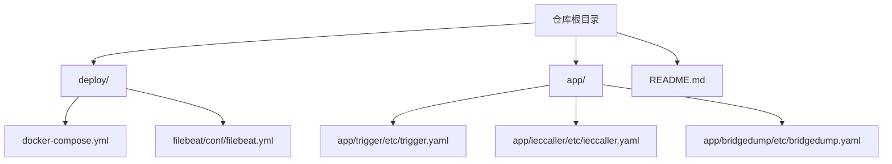
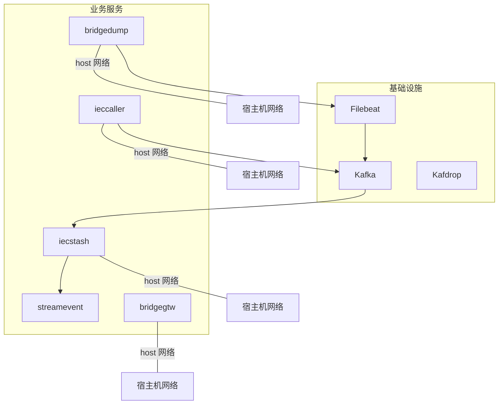
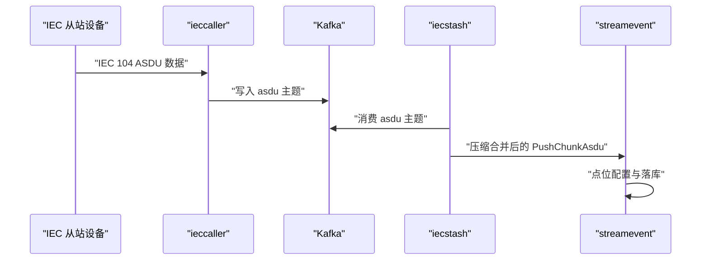
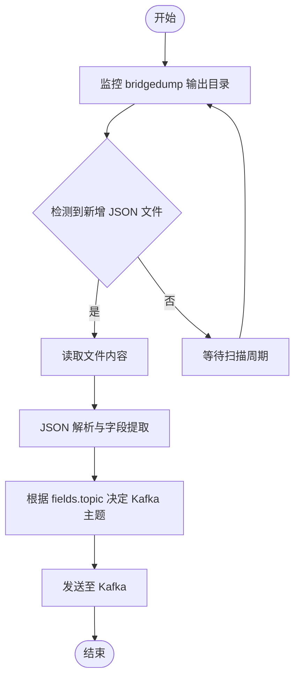
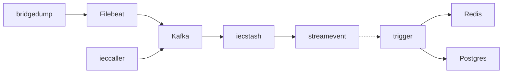

# 部署策略

<cite>
**本文引用的文件**   
- [docker-compose.yml](file://deploy/docker-compose.yml)
- [README.md](file://README.md)
- [trigger.yaml](file://app/trigger/etc/trigger.yaml)
- [ieccaller.yaml](file://app/ieccaller/etc/ieccaller.yaml)
- [bridgedump.yaml](file://app/bridgedump/etc/bridgedump.yaml)
- [filebeat.yml](file://deploy/filebeat/conf/filebeat.yml)
- [ieccaller 部署脚本](file://app/ieccaller/deploy.sh)
- [trigger 部署脚本](file://app/trigger/deploy.sh)
- [dockerx.go](file://common/dockerx/dockerx.go)
- [overview.md](file://.trae/skills/zero-skills/best-practices/overview.md)
</cite>

## 目录
1. [简介](#简介)
2. [项目结构](#项目结构)
3. [核心组件](#核心组件)
4. [架构总览](#架构总览)
5. [详细组件分析](#详细组件分析)
6. [依赖关系分析](#依赖关系分析)
7. [性能考量](#性能考量)
8. [故障排查指南](#故障排查指南)
9. [结论](#结论)
10. [附录](#附录)

## 简介
本文件面向 zero-service 的部署实践，提供单机部署、Docker 部署与集群部署的完整策略与配置要点，并重点阐述 Docker Compose 编排中的服务依赖、网络模式（host 模式 vs bridge 模式）、数据卷挂载、环境变量、资源限制、重启策略与安全配置。同时给出部署前的环境准备、依赖检查与配置验证步骤，以及部署后的健康检查、启动验证与基础功能测试方法，并提供不同部署场景下的性能调优与资源规划建议。

## 项目结构
- 顶层 README 提供了系统架构概览、核心服务清单与部署指引。
- deploy 目录包含 Docker Compose 编排与 Filebeat 配置。
- app/*/etc 下存放各服务的配置文件；app/*/Dockerfile 用于独立构建镜像。
- app/*/deploy.sh 提供远程部署脚本模板，便于自动化发布。

图表来源
- [docker-compose.yml:1-110](file://deploy/docker-compose.yml#L1-L110)
- [README.md:1-350](file://README.md#L1-L350)

章节来源
- [README.md:1-350](file://README.md#L1-L350)

## 核心组件
- Kafka 消息队列：提供 IEC 104 数据采集链路的缓冲与分发。
- Filebeat：采集 bridgedump 生成的日志文件并投递至 Kafka。
- bridgegtw、bridgedump、ieccaller、iecstash、kafdrop：核心业务服务，采用 host 网络模式直连宿主机端口，便于与外部设备或系统互通。
- streamevent：对外统一流事件协议服务，负责接收并处理多源数据。

章节来源
- [docker-compose.yml:1-110](file://deploy/docker-compose.yml#L1-L110)
- [README.md:110-206](file://README.md#L110-L206)

## 架构总览
下图展示零信任/低耦合的部署视图：Kafka 作为数据中枢，Filebeat 采集本地文件，ieccaller 将 IEC 104 数据写入 Kafka，iecstash 消费并压缩合并，streamevent 接收后写入时序库；bridgegtw/bridgedump/ieccaller/iecstash 通过 host 网络暴露端口，便于与外部系统对接。

图表来源
- [docker-compose.yml:1-110](file://deploy/docker-compose.yml#L1-L110)
- [filebeat.yml:1-122](file://deploy/filebeat/conf/filebeat.yml#L1-L122)

## 详细组件分析

### Docker Compose 编排与配置要点
- 服务依赖
  - Filebeat 依赖 Kafka，通过 depends_on 确保顺序启动。
- 网络模式
  - bridgegtw、bridgedump、ieccaller、iecstash 使用 network_mode: host，便于直接复用宿主机端口，降低 NAT/NAT 穿透复杂度。
  - kafka 使用默认 bridge 网络，通过端口映射对外暴露。
- 数据卷挂载
  - kafka：持久化数据目录映射至宿主机。
  - Filebeat：挂载宿主机容器日志目录与 bridgedump 输出目录，确保日志采集与投递。
  - 业务服务：挂载 etc 配置目录与日志输出目录，便于动态配置与运维。
- 环境变量
  - kafka：设置节点 ID、控制器端口、监听器与广告地址、分区数、副本因子等。
  - Filebeat：设置时区、严格权限关闭、配置文件挂载路径。
  - 业务服务：统一设置时区，部分服务开启特权模式以满足特定设备访问需求。
- 资源限制与重启策略
  - 业务服务均设置内存上限与 always 重启策略，保证稳定性。
  - kafka 设置特权模式与持久化卷，确保高可用与数据安全。
- 安全配置
  - kafka 控制器与监听器分离，使用不同端口与安全协议映射，避免外部明文访问。
  - 业务服务通过 host 网络暴露端口，建议结合防火墙与内网隔离策略。

章节来源
- [docker-compose.yml:1-110](file://deploy/docker-compose.yml#L1-L110)
- [filebeat.yml:1-122](file://deploy/filebeat/conf/filebeat.yml#L1-L122)

### 服务配置文件要点
- trigger.yaml
  - 日志路径与级别、Nacos 注册开关与命名空间、Redis 连接、Postgres 数据源、StreamEvent 目标端点等。
- ieccaller.yaml
  - 部署模式、IEC 从站配置、Kafka 主题、MQTT 推送主题、PushAsduChunkBytes 批大小、GracePeriod 等。
- bridgedump.yaml
  - 日志路径、输出目录 DumpPath。

章节来源
- [trigger.yaml:1-38](file://app/trigger/etc/trigger.yaml#L1-L38)
- [ieccaller.yaml:1-79](file://app/ieccaller/etc/ieccaller.yaml#L1-L79)
- [bridgedump.yaml:1-10](file://app/bridgedump/etc/bridgedump.yaml#L1-L10)

### 部署前准备与依赖检查
- 环境要求
  - Docker 与 Docker Compose 已安装并可正常运行。
  - Kafka、Redis、Postgres（如启用）等外部依赖已就绪。
- 本地构建与镜像准备
  - 各服务目录下提供 Dockerfile，可独立构建镜像。
  - 使用 app/*/deploy.sh 脚本进行远程部署时，需准备 .env 环境变量文件，包含远程用户、主机、端口、路径、镜像名与服务名等。
- 配置验证
  - 校验 docker-compose.yml 中的环境变量占位符是否替换为实际值。
  - 校验各服务 etc/*.yaml 的连接串、主题、端口等是否与实际环境一致。
  - 校验 Filebeat 配置中的输入路径与 Kafka 地址是否正确。

章节来源
- [README.md:226-261](file://README.md#L226-L261)
- [ieccaller 部署脚本:1-175](file://app/ieccaller/deploy.sh#L1-L175)
- [trigger 部署脚本:1-175](file://app/trigger/deploy.sh#L1-L175)

### 单机部署流程
- 启动
  - 进入 deploy 目录，执行 docker-compose up -d 启动全部服务。
- 验证
  - 查看容器状态与日志，确认 Kafka、Filebeat、ieccaller、bridgegtw、bridgedump、iecstash、kafdrop 均处于健康状态。
  - 通过 Kafdrop 界面或命令行验证 Kafka 主题是否存在及消息是否正常写入。
- 基础功能测试
  - 通过 bridgegtw/bridgedump/ieccaller/iecstash 的 API 或日志输出，验证数据采集、转发与落库链路是否正常。

章节来源
- [docker-compose.yml:1-110](file://deploy/docker-compose.yml#L1-L110)
- [README.md:300-318](file://README.md#L300-L318)

### Docker 部署流程
- 构建镜像
  - 在 app/{service} 目录执行 docker build -t zero-service/{service}:latest . 生成镜像。
- 运行
  - 修改 docker-compose.yml 中的镜像标签与环境变量，执行 docker-compose up -d 启动。
- 发布
  - 使用 app/*/deploy.sh 脚本进行远程打包、上传与部署，自动打标签、备份旧镜像并清理历史备份。

章节来源
- [README.md:300-318](file://README.md#L300-L318)
- [ieccaller 部署脚本:1-175](file://app/ieccaller/deploy.sh#L1-L175)
- [trigger 部署脚本:1-175](file://app/trigger/deploy.sh#L1-L175)

### 集群部署流程
- 服务发现与高可用
  - 使用 Nacos 实现服务注册与发现；Redis 集群、Kafka 集群与数据库主从提升可用性。
- 负载均衡
  - 通过 Nginx 或 gRPC 内置负载均衡实现横向扩展。
- 监控与可观测性
  - 建议引入 OpenTelemetry -> Prometheus -> Grafana 的监控链路，对关键指标进行采集与可视化。
- 安全加固
  - 限制容器特权使用范围，仅在确需访问设备或特殊端口时启用；结合网络策略与防火墙控制访问。

章节来源
- [README.md:319-325](file://README.md#L319-L325)

### 关键流程时序图：Kafka 数据采集与落库

图表来源
- [ieccaller.yaml:35-79](file://app/ieccaller/etc/ieccaller.yaml#L35-L79)
- [docker-compose.yml:1-110](file://deploy/docker-compose.yml#L1-L110)

### 关键流程图：Filebeat 日志采集与投递

图表来源
- [filebeat.yml:1-122](file://deploy/filebeat/conf/filebeat.yml#L1-L122)

### 容器资源与环境解析辅助工具
- dockerx 包提供容器资源解析、环境变量解析、端口与卷挂载提取等工具函数，可用于自动化运维与诊断。

章节来源
- [dockerx.go:1-94](file://common/dockerx/dockerx.go#L1-L94)

## 依赖关系分析
- Filebeat 依赖 Kafka；Kafka 为 ieccaller/bridgedump 的上游数据源。
- iecstash 依赖 Kafka；streamevent 依赖 iecstash 的推送。
- bridgegtw/bridgedump/ieccaller/iecstash 使用 host 网络，直接占用宿主机端口，需注意端口冲突与安全策略。
- trigger 依赖 Redis 与数据库；其 StreamEventConf 指向 streamevent 端点。

图表来源
- [docker-compose.yml:1-110](file://deploy/docker-compose.yml#L1-L110)
- [ieccaller.yaml:1-79](file://app/ieccaller/etc/ieccaller.yaml#L1-L79)
- [trigger.yaml:1-38](file://app/trigger/etc/trigger.yaml#L1-L38)

章节来源
- [docker-compose.yml:1-110](file://deploy/docker-compose.yml#L1-L110)
- [ieccaller.yaml:1-79](file://app/ieccaller/etc/ieccaller.yaml#L1-L79)
- [trigger.yaml:1-38](file://app/trigger/etc/trigger.yaml#L1-L38)

## 性能考量
- Kafka
  - 合理设置分区数与副本因子，平衡吞吐与容灾；开启压缩减少带宽消耗。
- Filebeat
  - 调整扫描频率与关闭策略，避免频繁小文件 IO；合理设置 max_message_bytes。
- 业务服务
  - 依据硬件资源设置内存上限与 CPU 配额；对高并发场景启用多实例与负载均衡。
- 网络
  - host 模式可降低网络开销，但需谨慎端口管理与安全策略；bridge 模式适合多版本/多租户隔离。
- 存储
  - Kafka 数据目录与日志目录使用高性能磁盘；定期清理旧日志与备份镜像。

## 故障排查指南
- 容器无法启动
  - 检查 docker-compose.yml 中的环境变量与端口映射是否冲突；查看容器日志定位错误。
- Kafka 无数据
  - 确认 ieccaller/bridgedump 的 Kafka 地址与主题配置正确；使用 Kafdrop 或命令行验证主题与消息。
- Filebeat 未采集
  - 检查 bridgedump 输出目录与 Filebeat 配置路径；确认容器日志目录挂载正确。
- 业务服务连接异常
  - 校验 trigger/ieccaller 的 Redis、数据库与 streamevent 端点配置；确认网络连通性。
- 资源不足
  - 使用 docker stats 或监控面板观察 CPU/内存/磁盘；调整资源限制与实例数量。

章节来源
- [docker-compose.yml:1-110](file://deploy/docker-compose.yml#L1-L110)
- [filebeat.yml:1-122](file://deploy/filebeat/conf/filebeat.yml#L1-L122)
- [ieccaller.yaml:1-79](file://app/ieccaller/etc/ieccaller.yaml#L1-L79)
- [trigger.yaml:1-38](file://app/trigger/etc/trigger.yaml#L1-L38)

## 结论
通过 Docker Compose 的标准化编排，zero-service 可快速在单机与容器环境中完成部署；结合 host 网络模式与严格的配置管理，可在工业与物联网场景中实现稳定的数据采集与传输链路。生产环境建议配合 Nacos、Kafka 集群、Redis 集群与数据库高可用方案，并完善监控与安全策略，以获得更高的可靠性与可维护性。

## 附录
- 最佳实践参考
  - Dockerfile 示例与 Kubernetes 部署 YAML 可作为镜像构建与集群部署的参考模板。

章节来源
- [overview.md:671-754](file://.trae/skills/zero-skills/best-practices/overview.md#L671-L754)