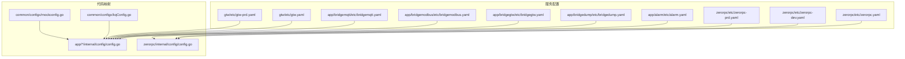
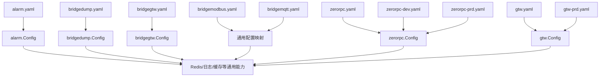
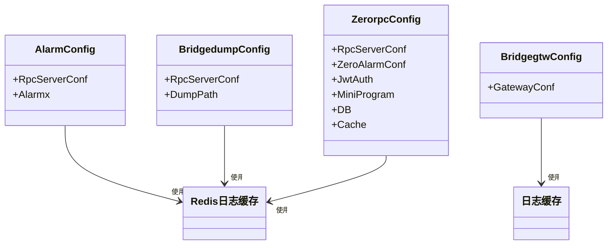

# 配置管理

<cite>
**本文引用的文件**
- [alarm.yaml](file://app/alarm/etc/alarm.yaml)
- [config.go](file://app/alarm/internal/config/config.go)
- [bridgedump.yaml](file://app/bridgedump/etc/bridgedump.yaml)
- [config.go](file://app/bridgedump/internal/config/config.go)
- [bridgegtw.yaml](file://app/bridgegtw/etc/bridgegtw.yaml)
- [config.go](file://app/bridgegtw/internal/config/config.go)
- [bridgemodbus.yaml](file://app/bridgemodbus/etc/bridgemodbus.yaml)
- [bridgemqtt.yaml](file://app/bridgemqtt/etc/bridgemqtt.yaml)
- [zerorpc.yaml](file://zerorpc/etc/zerorpc.yaml)
- [zerorpc-dev.yaml](file://zerorpc/etc/zerorpc-dev.yaml)
- [zerorpc-prd.yaml](file://zerorpc/etc/zerorpc-prd.yaml)
- [config.go](file://zerorpc/internal/config/config.go)
- [gtw.yaml](file://gtw/etc/gtw.yaml)
- [gtw-prd.yaml](file://gtw/etc/gtw-prd.yaml)
- [kqConfig.go](file://common/configx/kqConfig.go)
- [mockconfig.go](file://common/configx/mockconfig.go)
</cite>

## 目录
1. [简介](#简介)
2. [项目结构](#项目结构)
3. [核心组件](#核心组件)
4. [架构总览](#架构总览)
5. [详细组件分析](#详细组件分析)
6. [依赖关系分析](#依赖关系分析)
7. [性能考量](#性能考量)
8. [故障排查指南](#故障排查指南)
9. [结论](#结论)
10. [附录](#附录)

## 简介
本文件系统性梳理 zero-service 的配置管理体系，覆盖全局配置、服务特定配置与环境配置的分层设计；明确 YAML 配置语法规范、字段语义与默认行为；阐述环境变量在敏感信息与动态更新中的使用策略；给出配置热更新的实现思路与注意事项；并总结配置验证与错误处理机制、多环境差异与切换方法，以及安全与审计最佳实践。

## 项目结构
- 配置文件按“服务”维度集中存放于各服务的 etc 目录中，采用 YAML 格式，字段遵循 go-zero 配置约定与各服务自定义扩展。
- 各服务通过内部 config 包内的 Config 结构体映射 YAML 字段，确保类型安全与可读性。
- 环境配置通过命名后缀区分（如 -dev.yaml、-prd.yaml），便于在不同环境间切换。
- 全局网关 gtw 提供统一入口与上游服务路由配置，支持多服务聚合。

图表来源
- [alarm.yaml:1-26](file://app/alarm/etc/alarm.yaml#L1-L26)
- [bridgedump.yaml:1-10](file://app/bridgedump/etc/bridgedump.yaml#L1-L10)
- [bridgegtw.yaml:1-40](file://app/bridgegtw/etc/bridgegtw.yaml#L1-L40)
- [bridgemodbus.yaml:1-26](file://app/bridgemodbus/etc/bridgemodbus.yaml#L1-L26)
- [bridgemqtt.yaml:1-48](file://app/bridgemqtt/etc/bridgemqtt.yaml#L1-L48)
- [zerorpc.yaml:1-39](file://zerorpc/etc/zerorpc.yaml#L1-L39)
- [zerorpc-dev.yaml:1-28](file://zerorpc/etc/zerorpc-dev.yaml#L1-L28)
- [zerorpc-prd.yaml:1-39](file://zerorpc/etc/zerorpc-prd.yaml#L1-L39)
- [gtw.yaml:1-61](file://gtw/etc/gtw.yaml#L1-L61)
- [gtw-prd.yaml:1-24](file://gtw/etc/gtw-prd.yaml#L1-L24)
- [config.go:1-16](file://app/alarm/internal/config/config.go#L1-L16)
- [config.go:1-9](file://app/bridgedump/internal/config/config.go#L1-L9)
- [config.go:1-8](file://app/bridgegtw/internal/config/config.go#L1-L8)
- [config.go:1-25](file://zerorpc/internal/config/config.go#L1-L25)
- [kqConfig.go:1-7](file://common/configx/kqConfig.go#L1-L7)
- [mockconfig.go:1-147](file://common/configx/mockconfig.go#L1-L147)

章节来源
- [alarm.yaml:1-26](file://app/alarm/etc/alarm.yaml#L1-L26)
- [bridgedump.yaml:1-10](file://app/bridgedump/etc/bridgedump.yaml#L1-L10)
- [bridgegtw.yaml:1-40](file://app/bridgegtw/etc/bridgegtw.yaml#L1-L40)
- [bridgemodbus.yaml:1-26](file://app/bridgemodbus/etc/bridgemodbus.yaml#L1-L26)
- [bridgemqtt.yaml:1-48](file://app/bridgemqtt/etc/bridgemqtt.yaml#L1-L48)
- [zerorpc.yaml:1-39](file://zerorpc/etc/zerorpc.yaml#L1-L39)
- [zerorpc-dev.yaml:1-28](file://zerorpc/etc/zerorpc-dev.yaml#L1-L28)
- [zerorpc-prd.yaml:1-39](file://zerorpc/etc/zerorpc-prd.yaml#L1-L39)
- [gtw.yaml:1-61](file://gtw/etc/gtw.yaml#L1-L61)
- [gtw-prd.yaml:1-24](file://gtw/etc/gtw-prd.yaml#L1-L24)
- [config.go:1-16](file://app/alarm/internal/config/config.go#L1-L16)
- [config.go:1-9](file://app/bridgedump/internal/config/config.go#L1-L9)
- [config.go:1-8](file://app/bridgegtw/internal/config/config.go#L1-L8)
- [config.go:1-25](file://zerorpc/internal/config/config.go#L1-L25)
- [kqConfig.go:1-7](file://common/configx/kqConfig.go#L1-L7)
- [mockconfig.go:1-147](file://common/configx/mockconfig.go#L1-L147)

## 核心组件
- 服务配置模型：各服务在 internal/config 中定义 Config 结构体，字段与 etc 下 YAML 对应，保证强类型与可维护性。
- 环境配置：通过 -dev.yaml、-prd.yaml 等命名区分，便于 CI/CD 自动注入或手动切换。
- 网关配置：gtw.yaml 定义统一入口、超时、日志、上游服务映射等，支持多服务聚合。
- 通用配置工具：kqConfig.go 提供 Kafka 队列配置结构；mockconfig.go 提供基于模板的响应生成与延迟模拟。

章节来源
- [config.go:1-16](file://app/alarm/internal/config/config.go#L1-L16)
- [config.go:1-9](file://app/bridgedump/internal/config/config.go#L1-L9)
- [config.go:1-8](file://app/bridgegtw/internal/config/config.go#L1-L8)
- [config.go:1-25](file://zerorpc/internal/config/config.go#L1-L25)
- [kqConfig.go:1-7](file://common/configx/kqConfig.go#L1-L7)
- [mockconfig.go:1-147](file://common/configx/mockconfig.go#L1-L147)

## 架构总览
下图展示配置从 YAML 到运行时的加载与使用路径，以及跨服务共享的配置项（如 Redis、日志、缓存）如何在不同服务中复用。

图表来源
- [alarm.yaml:1-26](file://app/alarm/etc/alarm.yaml#L1-L26)
- [bridgedump.yaml:1-10](file://app/bridgedump/etc/bridgedump.yaml#L1-L10)
- [bridgegtw.yaml:1-40](file://app/bridgegtw/etc/bridgegtw.yaml#L1-L40)
- [bridgemodbus.yaml:1-26](file://app/bridgemodbus/etc/bridgemodbus.yaml#L1-L26)
- [bridgemqtt.yaml:1-48](file://app/bridgemqtt/etc/bridgemqtt.yaml#L1-L48)
- [zerorpc.yaml:1-39](file://zerorpc/etc/zerorpc.yaml#L1-L39)
- [zerorpc-dev.yaml:1-28](file://zerorpc/etc/zerorpc-dev.yaml#L1-L28)
- [zerorpc-prd.yaml:1-39](file://zerorpc/etc/zerorpc-prd.yaml#L1-L39)
- [gtw.yaml:1-61](file://gtw/etc/gtw.yaml#L1-L61)
- [gtw-prd.yaml:1-24](file://gtw/etc/gtw-prd.yaml#L1-L24)
- [config.go:1-16](file://app/alarm/internal/config/config.go#L1-L16)
- [config.go:1-9](file://app/bridgedump/internal/config/config.go#L1-L9)
- [config.go:1-8](file://app/bridgegtw/internal/config/config.go#L1-L8)
- [config.go:1-25](file://zerorpc/internal/config/config.go#L1-L25)

## 详细组件分析

### Alarm 服务配置
- YAML 关键点：名称、监听地址、模式、日志编码、Redis 连接、告警平台参数（AppId、AppSecret、EncryptKey、VerificationToken、UserId、配置路径）。
- 结构映射：Config 继承 RPC 服务器配置，并新增 Alarmx 块用于第三方平台接入。
- 默认行为：未显式设置的日志输出、缓存等由 go-zero 默认值接管。

章节来源
- [alarm.yaml:1-26](file://app/alarm/etc/alarm.yaml#L1-L26)
- [config.go:1-16](file://app/alarm/internal/config/config.go#L1-L16)

### Bridgedump 服务配置
- YAML 关键点：名称、监听地址、模式、日志、导出目录 DumpPath。
- 结构映射：Config 继承 RPC 服务器配置，并新增 DumpPath 字段。
- 默认行为：日志级别与输出路径由 go-zero 默认值决定。

章节来源
- [bridgedump.yaml:1-10](file://app/bridgedump/etc/bridgedump.yaml#L1-L10)
- [config.go:1-9](file://app/bridgedump/internal/config/config.go#L1-L9)

### Bridgegtw 网关配置
- YAML 关键点：名称、主机、端口、模式、日志、超时、上游服务列表（grpc、target、protoSet、Mappings）、日志保留天数。
- 结构映射：Config 继承网关配置，承载路由与转发规则。
- 默认行为：未配置时的默认日志格式与超时由 go-zero 默认值承担。

章节来源
- [bridgegtw.yaml:1-40](file://app/bridgegtw/etc/bridgegtw.yaml#L1-L40)
- [config.go:1-8](file://app/bridgegtw/internal/config/config.go#L1-L8)

### Bridgemodbus 与 Bridgemqtt 服务配置
- Bridgemodbus：包含 Modbus 池大小、Nacos 注册配置、数据库连接、Modbus 客户端配置等。
- Bridgemqtt：包含 Nacos 注册配置、MQTT 连接参数、订阅主题、Socket 推送配置等。
- 结构映射：均继承 RPC 服务器配置，并扩展各自业务配置块。

章节来源
- [bridgemodbus.yaml:1-26](file://app/bridgemodbus/etc/bridgemodbus.yaml#L1-L26)
- [bridgemqtt.yaml:1-48](file://app/bridgemqtt/etc/bridgemqtt.yaml#L1-L48)

### Zerorpc 服务配置（含环境）
- 主配置：名称、监听地址、超时、模式、日志、Redis、缓存、数据库、告警客户端、JWT、小程序配置。
- 开发环境：-dev.yaml 覆盖日志输出位置、Redis 密码、非阻塞开关等。
- 生产环境：-prd.yaml 覆盖日志编码、缓存、数据库连接等。
- 结构映射：Config 继承 RPC 服务器配置，新增 ZeroAlarmConf、JwtAuth、MiniProgram、DB、Cache 等。

章节来源
- [zerorpc.yaml:1-39](file://zerorpc/etc/zerorpc.yaml#L1-L39)
- [zerorpc-dev.yaml:1-28](file://zerorpc/etc/zerorpc-dev.yaml#L1-L28)
- [zerorpc-prd.yaml:1-39](file://zerorpc/etc/zerorpc-prd.yaml#L1-L39)
- [config.go:1-25](file://zerorpc/internal/config/config.go#L1-L25)

### 网关 gtw 配置（含环境）
- 主配置：名称、主机、端口、超时、模式、最大请求体、日志、链路追踪占位、上游服务（ZeroRpcConf、FileRpcConf）、JWT、NFS 根路径、下载地址、Swagger 路径。
- 生产配置：-prd.yaml 覆盖日志编码、输出模式、路径等。
- 结构映射：Config 承载统一入口与上游服务路由。

章节来源
- [gtw.yaml:1-61](file://gtw/etc/gtw.yaml#L1-L61)
- [gtw-prd.yaml:1-24](file://gtw/etc/gtw-prd.yaml#L1-L24)

### 通用配置工具
- Kafka 队列配置：KqConfig 提供 Brokers 与 Topic 字段，便于消息队列集成。
- Mock 配置：MockConfig 支持 JSON 模板解析与场景化响应生成，内置延迟模拟与假数据函数。

章节来源
- [kqConfig.go:1-7](file://common/configx/kqConfig.go#L1-L7)
- [mockconfig.go:1-147](file://common/configx/mockconfig.go#L1-L147)

## 依赖关系分析
- 配置到代码映射：YAML 文件通过结构体字段与 internal/config 中的 Config 对齐，确保类型安全与可读性。
- 环境配置耦合：-dev.yaml、-prd.yaml 仅覆盖必要字段，避免重复与冲突。
- 通用能力复用：Redis、日志、缓存等通用配置在多个服务中复用，降低维护成本。

图表来源
- [config.go:1-16](file://app/alarm/internal/config/config.go#L1-L16)
- [config.go:1-9](file://app/bridgedump/internal/config/config.go#L1-L9)
- [config.go:1-8](file://app/bridgegtw/internal/config/config.go#L1-L8)
- [config.go:1-25](file://zerorpc/internal/config/config.go#L1-L25)

章节来源
- [config.go:1-16](file://app/alarm/internal/config/config.go#L1-L16)
- [config.go:1-9](file://app/bridgedump/internal/config/config.go#L1-L9)
- [config.go:1-8](file://app/bridgegtw/internal/config/config.go#L1-L8)
- [config.go:1-25](file://zerorpc/internal/config/config.go#L1-L25)

## 性能考量
- 日志级别与输出：生产环境建议使用 JSON 编码与文件输出，减少控制台开销。
- 上游调用超时：合理设置 Timeout，避免级联阻塞；非阻塞调用可提升吞吐但需关注失败重试。
- 缓存与数据库：生产环境启用缓存与连接池优化，避免频繁 IO。
- 网关限流与请求体大小：根据业务峰值调整 MaxBytes 与超时，防止资源耗尽。

## 故障排查指南
- 配置加载失败
  - 症状：启动时报错提示字段不匹配或缺失。
  - 处理：核对 YAML 字段与 Config 结构体是否一致；检查缩进与类型。
- 日志异常
  - 症状：日志未输出或格式异常。
  - 处理：确认 Log.Encoding、Mode、Path 设置；生产环境优先使用 file 模式。
- Redis/数据库连接失败
  - 症状：连接超时或认证失败。
  - 处理：核对 Host、Pass、Key、DataSource；区分 -dev.yaml 与 -prd.yaml 的差异。
- 网关路由不生效
  - 症状：上游映射 404 或 502。
  - 处理：检查 Upstreams、ProtoSets、Mappings 与 RpcPath 是否正确。
- Mock 响应异常
  - 症状：模板解析错误或延迟无效。
  - 处理：检查 JSON 模板语法与延迟前缀；确认场景存在 default 回退。

章节来源
- [mockconfig.go:104-146](file://common/configx/mockconfig.go#L104-L146)

## 结论
zero-service 的配置体系以 YAML 为中心，结合 go-zero 的强类型结构体映射，实现了清晰的服务配置分层与环境隔离。通过 -dev.yaml 与 -prd.yaml 的差异化覆盖，满足多环境部署需求；同时利用通用配置模块与网关聚合，提升运维效率与可观测性。建议在生产环境严格启用文件日志、缓存与连接池，并完善配置校验与热更新机制，确保系统稳定与安全。

## 附录

### YAML 语法规范与字段含义
- 通用字段
  - Name：服务名称
  - ListenOn/Host:Port：监听地址
  - Mode：运行模式（dev/prd）
  - Log：日志编码、输出模式、路径、级别、保留天数
  - Timeout：请求超时（毫秒）
- 服务特有字段示例
  - Alarmx：第三方告警平台接入参数
  - DumpPath：文件导出目录
  - Upstreams/Mappings：网关上游与路由映射
  - NacosConfig：服务注册与发现配置
  - MqttConfig/Broker/SubscribeTopics：MQTT 连接与订阅
  - ZeroAlarmConf/JwtAuth/MiniProgram/DB/Cache：RPC 服务扩展配置

章节来源
- [alarm.yaml:1-26](file://app/alarm/etc/alarm.yaml#L1-L26)
- [bridgedump.yaml:1-10](file://app/bridgedump/etc/bridgedump.yaml#L1-L10)
- [bridgegtw.yaml:1-40](file://app/bridgegtw/etc/bridgegtw.yaml#L1-L40)
- [bridgemodbus.yaml:1-26](file://app/bridgemodbus/etc/bridgemodbus.yaml#L1-L26)
- [bridgemqtt.yaml:1-48](file://app/bridgemqtt/etc/bridgemqtt.yaml#L1-L48)
- [zerorpc.yaml:1-39](file://zerorpc/etc/zerorpc.yaml#L1-L39)
- [zerorpc-dev.yaml:1-28](file://zerorpc/etc/zerorpc-dev.yaml#L1-L28)
- [zerorpc-prd.yaml:1-39](file://zerorpc/etc/zerorpc-prd.yaml#L1-L39)
- [gtw.yaml:1-61](file://gtw/etc/gtw.yaml#L1-L61)
- [gtw-prd.yaml:1-24](file://gtw/etc/gtw-prd.yaml#L1-L24)

### 环境变量与敏感信息
- 建议将密码、密钥、令牌等敏感信息通过环境变量注入，避免硬编码在 YAML 中。
- 在容器化部署中，使用配置管理工具（如 Kubernetes Secrets）进行密文存储与挂载。
- 对于需要加密的字段，可在应用启动时解密或通过外部密钥服务（如 KMS）动态获取。

### 动态配置与热更新
- 方案一：监听配置文件变更，触发平滑重启或重新加载关键模块。
- 方案二：将部分配置迁移到配置中心（如 Nacos），通过客户端拉取最新配置并缓存。
- 注意事项：热更新需保证幂等与回滚策略；对数据库连接、缓存连接等长连接需在更新后重建。

### 配置验证与错误处理
- 启动阶段：对必填字段进行非空校验；对日志、缓存、数据库等连接进行连通性探测。
- 运行阶段：对上游调用失败进行熔断与降级；记录配置加载与变更日志，便于审计。

### 多环境差异与切换
- 开发环境：-dev.yaml 强调本地调试与快速迭代，日志可输出至控制台，非阻塞调用更常见。
- 生产环境：-prd.yaml 强调稳定性与可观测性，日志采用文件与 JSON 编码，启用缓存与连接池。
- 切换方法：通过构建脚本或容器启动参数选择对应配置文件；CI/CD 中通过环境变量注入差异化参数。

### 安全与审计
- 最小权限：数据库、缓存、MQTT 等连接使用最小权限账号。
- 加密传输：Redis、数据库、MQTT 建议启用 TLS。
- 审计日志：记录配置加载时间、变更人、变更内容；对敏感字段变更进行二次审批。
- 定期巡检：核对配置一致性、密钥轮换与过期策略。