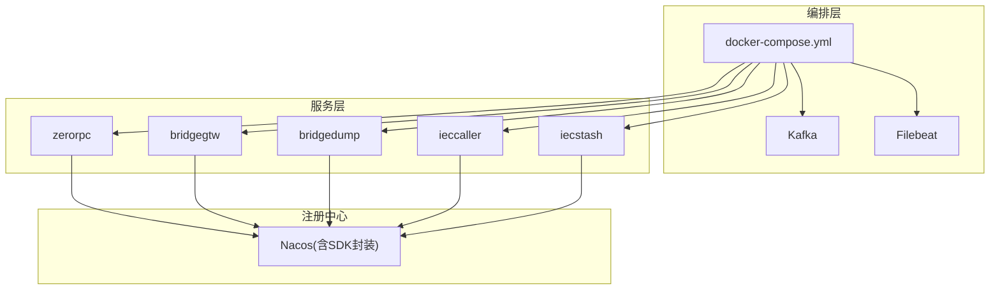
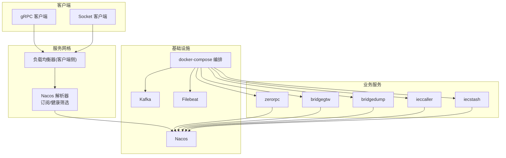
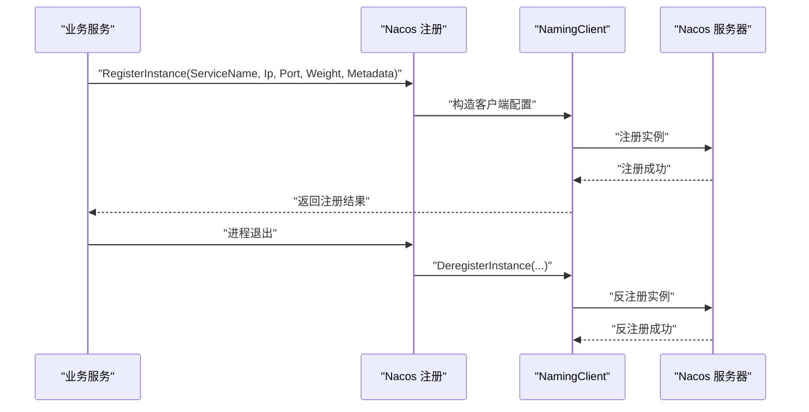
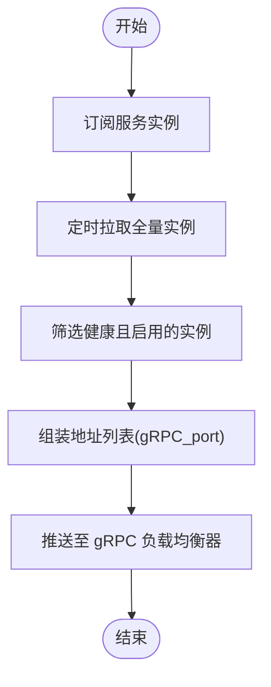
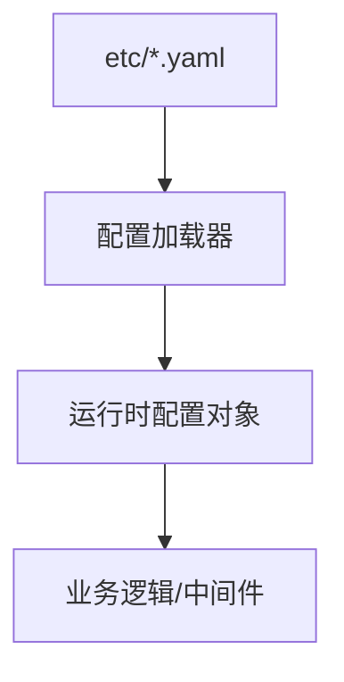
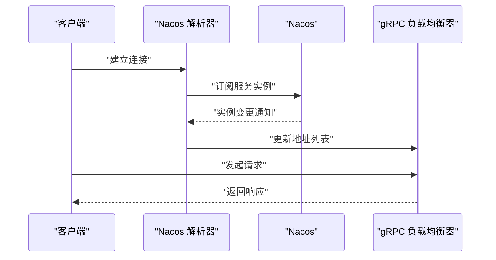
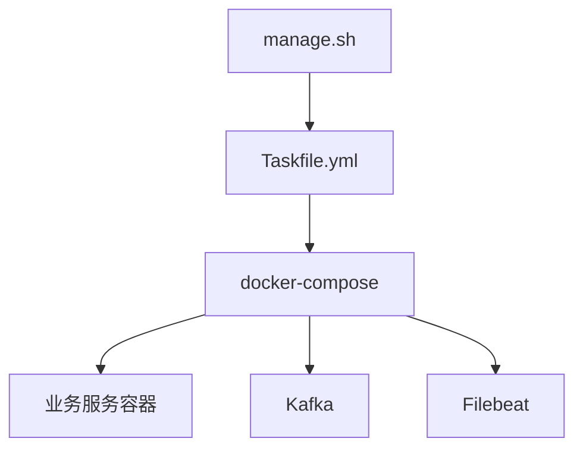
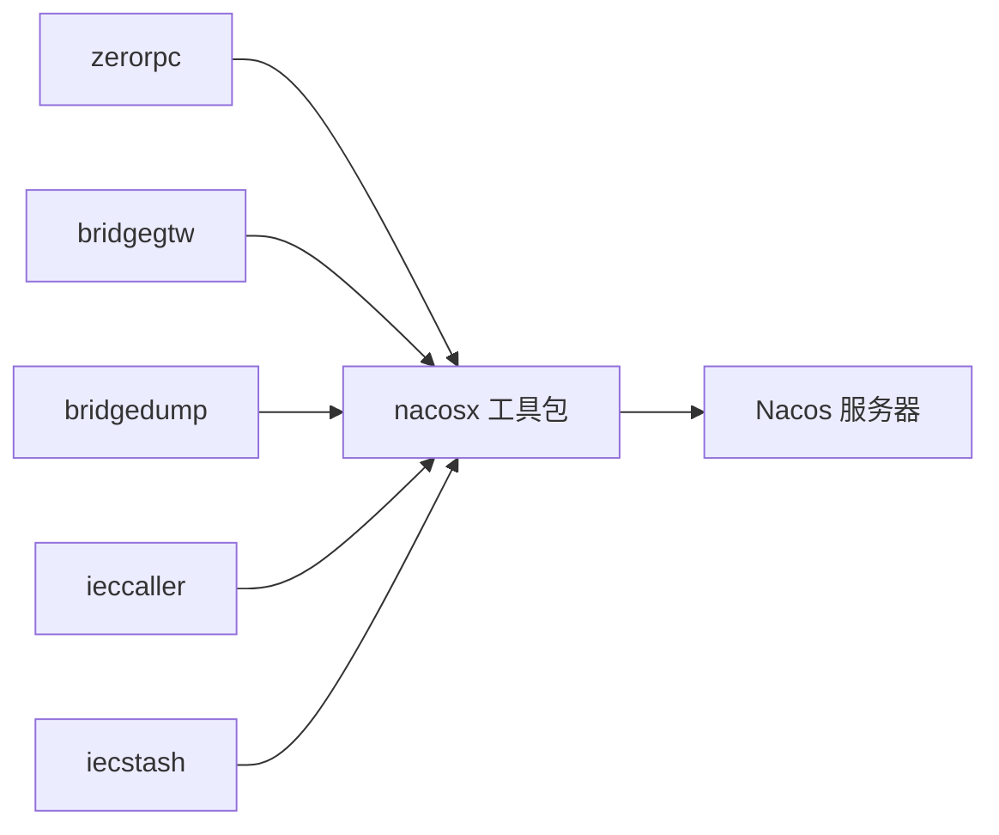

# 集群部署与高可用

<cite>
**本文引用的文件**
- [docker-compose.yml](file://deploy/docker-compose.yml)
- [config.go](file://common/nacosx/config.go)
- [options.go](file://common/nacosx/options.go)
- [register.go](file://common/nacosx/register.go)
- [resolver.go](file://common/nacosx/resolver.go)
- [builder.go](file://common/nacosx/builder.go)
- [target.go](file://common/nacosx/target.go)
- [container.go](file://common/socketiox/container.go)
- [zerorpc.yaml](file://zerorpc/etc/zerorpc.yaml)
- [zerorpc-dev.yaml](file://zerorpc/etc/zerorpc-dev.yaml)
- [zerorpc-prd.yaml](file://zerorpc/etc/zerorpc-prd.yaml)
- [resilience-patterns.md](file://.trae/skills/zero-skills/references/resilience-patterns.md)
- [manage.sh](file://util/manage.sh)
- [Taskfile.yml](file://util/Taskfile.yml)
</cite>

## 目录
1. [引言](#引言)
2. [项目结构](#项目结构)
3. [核心组件](#核心组件)
4. [架构总览](#架构总览)
5. [详细组件分析](#详细组件分析)
6. [依赖分析](#依赖分析)
7. [性能考虑](#性能考虑)
8. [故障排查指南](#故障排查指南)
9. [结论](#结论)
10. [附录](#附录)

## 引言
本方案面向 Zero-Service 的集群部署与高可用，围绕 Nacos 服务注册与发现、健康检查与动态配置、负载均衡策略（反向代理、服务间与客户端侧）、高可用设计（多节点、故障转移、数据备份）、灾难恢复（熔断、降级、应急响应）以及集群扩缩容（水平/垂直/弹性）进行系统化落地。方案以仓库中的现有实现为基础，结合可操作的运维脚本与配置模板，提供从设计到执行的完整路径。

## 项目结构
- 集群编排与基础设施
  - 使用 docker-compose 管理 Kafka、Filebeat、各业务服务等容器化组件，支持主机网络模式与持久化卷挂载，便于在生产环境直接复用。
- 服务注册与发现
  - 在 common/nacosx 下提供 Nacos SDK 封装，包括注册、反解析、健康实例提取、gRPC 解析器与订阅机制。
- 动态配置
  - 通过各应用的 etc/*.yaml 提供运行时配置（日志、数据库、缓存、鉴权等），支持开发/生产环境差异化。
- 负载均衡与客户端侧发现
  - 通过 gRPC resolver 与 Nacos 订阅，实现客户端侧服务地址列表动态更新；同时在 socketiox 中演示基于 Nacos 的客户端连接池维护。
- 运维与自动化
  - 提供 manage.sh 与 Taskfile.yml，统一入口控制服务启停与批量操作。

图表来源
- [docker-compose.yml:1-110](file://deploy/docker-compose.yml#L1-L110)
- [register.go:21-76](file://common/nacosx/register.go#L21-L76)
- [builder.go:29-112](file://common/nacosx/builder.go#L29-L112)

章节来源
- [docker-compose.yml:1-110](file://deploy/docker-compose.yml#L1-L110)

## 核心组件
- Nacos 注册与发现
  - 注册：服务启动时向 Nacos 注册实例，携带健康、权重、元数据、集群与分组信息，并在进程退出时自动反注册。
  - 解析：gRPC resolver 通过 Nacos 订阅服务实例，过滤健康且启用的实例，按 gRPC_port 组合地址列表，动态推送至负载均衡器。
  - 健康检查：通过实例元数据与 Enable/Healthy 字段筛选，确保仅路由到健康实例。
- 动态配置
  - 应用通过 etc/*.yaml 加载配置，支持日志编码/输出、数据库连接、缓存与鉴权等参数，便于在不同环境切换。
- 负载均衡
  - 反向代理：建议在网关层（如 Nginx）对上游服务做健康检查与会话保持（根据业务需要）。
  - 服务间：gRPC 客户端侧通过 Nacos 解析器实现动态地址列表与健康实例选择。
  - 客户端侧：socketiox 展示了基于 Nacos 的客户端连接池维护，支持按子集扩容/收缩。
- 高可用
  - 多节点部署：每个服务以多副本方式部署，注册到同一服务名/集群/分组，实现横向扩展与故障转移。
  - 数据备份：数据库与缓存采用独立实例，结合备份策略与只读副本提升可用性。
- 灾难恢复
  - 熔断与降级：遵循韧性模式最佳实践，对外部调用启用熔断、超时与限流，避免级联故障。
  - 应急响应：通过健康检查与日志采集（Filebeat/Kafka）快速定位问题，必要时回滚版本或隔离故障节点。

章节来源
- [register.go:21-76](file://common/nacosx/register.go#L21-L76)
- [resolver.go:13-74](file://common/nacosx/resolver.go#L13-L74)
- [builder.go:29-138](file://common/nacosx/builder.go#L29-L138)
- [container.go:156-316](file://common/socketiox/container.go#L156-L316)
- [zerorpc.yaml:1-39](file://zerorpc/etc/zerorpc.yaml#L1-L39)
- [resilience-patterns.md:565-696](file://.trae/skills/zero-skills/references/resilience-patterns.md#L565-L696)

## 架构总览
下图展示 Zero-Service 在集群环境下的整体交互：业务服务通过 Nacos 实现注册与发现，客户端侧解析器与订阅机制保障地址列表实时更新；Kafka/Filebeat 支持事件采集与可观测性；docker-compose 提供编排与持久化。

图表来源
- [builder.go:29-112](file://common/nacosx/builder.go#L29-L112)
- [resolver.go:47-66](file://common/nacosx/resolver.go#L47-L66)
- [docker-compose.yml:1-110](file://deploy/docker-compose.yml#L1-L110)

## 详细组件分析

### Nacos 服务注册与发现
- 注册流程
  - 服务启动时解析 ListenOn，计算 IP 与端口，构造 RegisterInstanceParam 并调用 NamingClient 注册。
  - 注册成功后，注册 Shutdown Hook，在进程退出时自动反注册，避免悬挂实例。
- 健康与元数据
  - 注册时标记 Healthy=true、Enable=true、Ephemeral=true，并可附加 Metadata（如 gRPC_port）。
  - 解析器在订阅回调中仅接受健康且启用的实例，确保流量不命中故障节点。
- 客户端解析与订阅
  - 解析器通过 Nacos 订阅服务实例，周期性拉取全量实例并合并去重，排序后推送给 gRPC 负载均衡器。
  - 地址列表按字符串排序，避免负载均衡器重复替换相同地址列表。

图表来源
- [register.go:21-76](file://common/nacosx/register.go#L21-L76)

图表来源
- [builder.go:78-109](file://common/nacosx/builder.go#L78-L109)
- [resolver.go:47-66](file://common/nacosx/resolver.go#L47-L66)

章节来源
- [register.go:21-76](file://common/nacosx/register.go#L21-L76)
- [resolver.go:13-74](file://common/nacosx/resolver.go#L13-L74)
- [builder.go:29-138](file://common/nacosx/builder.go#L29-L138)
- [options.go:11-41](file://common/nacosx/options.go#L11-L41)
- [config.go:8-37](file://common/nacosx/config.go#L8-L37)

### 动态配置管理
- 配置文件
  - 应用通过 etc/*.yaml 提供运行时配置，包含日志、数据库、缓存、鉴权等关键参数。
  - 开发/生产环境分别提供 dev/prd 配置样例，便于差异化部署。
- 配置加载
  - 通过框架配置加载机制读取上述 YAML，实现热切换与环境隔离。

图表来源
- [zerorpc.yaml:1-39](file://zerorpc/etc/zerorpc.yaml#L1-L39)
- [zerorpc-dev.yaml:1-28](file://zerorpc/etc/zerorpc-dev.yaml#L1-L28)
- [zerorpc-prd.yaml:1-39](file://zerorpc/etc/zerorpc-prd.yaml#L1-L39)

章节来源
- [zerorpc.yaml:1-39](file://zerorpc/etc/zerorpc.yaml#L1-L39)
- [zerorpc-dev.yaml:1-28](file://zerorpc/etc/zerorpc-dev.yaml#L1-L28)
- [zerorpc-prd.yaml:1-39](file://zerorpc/etc/zerorpc-prd.yaml#L1-L39)

### 客户端侧负载均衡与连接池
- gRPC 客户端侧解析
  - 通过 Nacos 解析器构建 resolver，订阅服务实例变化，将健康地址列表推送至 gRPC 负载均衡器。
- Socket 客户端侧连接池
  - 基于 Nacos 的地址列表动态维护客户端连接池，按子集大小扩容/收缩，减少连接抖动与资源浪费。

图表来源
- [builder.go:78-111](file://common/nacosx/builder.go#L78-L111)
- [resolver.go:47-66](file://common/nacosx/resolver.go#L47-L66)

章节来源
- [container.go:156-316](file://common/socketiox/container.go#L156-L316)
- [builder.go:78-111](file://common/nacosx/builder.go#L78-L111)

### 集群编排与运维自动化
- docker-compose
  - 统一编排 Kafka、Filebeat 与各业务服务，支持主机网络模式与持久化卷，便于生产落地。
- 运维脚本
  - manage.sh 提供统一命令入口，支持 restart/up/stop/start，结合 Taskfile.yml 执行批量任务。

图表来源
- [manage.sh:1-35](file://util/manage.sh#L1-L35)
- [Taskfile.yml:1-33](file://util/Taskfile.yml#L1-L33)
- [docker-compose.yml:1-110](file://deploy/docker-compose.yml#L1-L110)

章节来源
- [manage.sh:1-35](file://util/manage.sh#L1-L35)
- [Taskfile.yml:1-33](file://util/Taskfile.yml#L1-L33)
- [docker-compose.yml:1-110](file://deploy/docker-compose.yml#L1-L110)

## 依赖分析
- 组件耦合
  - 业务服务依赖 Nacos SDK 进行注册与解析，解耦于具体注册中心实现。
  - gRPC 客户端通过自定义 resolver 与 Nacos 集成，降低对第三方负载均衡器的依赖。
- 外部依赖
  - Nacos 作为注册中心，Kafka/Filebeat 作为消息与日志采集，docker-compose 作为编排工具。
- 循环依赖
  - 当前模块以工具包形式存在，无明显循环依赖风险。

图表来源
- [register.go:31-38](file://common/nacosx/register.go#L31-L38)
- [builder.go:67-73](file://common/nacosx/builder.go#L67-L73)

章节来源
- [register.go:31-38](file://common/nacosx/register.go#L31-L38)
- [builder.go:67-73](file://common/nacosx/builder.go#L67-L73)

## 性能考虑
- 注册与解析
  - 注册时尽量减少不必要的元数据，避免过长的 Metadata 字段影响查询性能。
  - 解析器周期性拉取全量实例，建议合理设置定时器间隔，避免频繁查询。
- 负载均衡
  - 客户端侧地址列表排序与去重，避免重复替换导致的连接抖动。
  - 对于大流量场景，建议在网关层引入限流与熔断，防止单点过载。
- 存储与日志
  - 数据库连接池与缓存配置应与并发规模匹配，避免阻塞与超时。
  - 日志输出模式与路径在生产环境建议使用文件模式并开启轮转。

## 故障排查指南
- 服务无法注册/注销
  - 检查 Nacos 地址、认证信息与命名空间是否正确；确认服务端口与 ListenOn 配置一致。
  - 关注注册/反注册日志，定位网络或权限问题。
- 实例不健康或被忽略
  - 核对实例元数据中 gRPC_port 是否存在；确认 Enable/Healthy 标记。
  - 查看解析器回调日志，确认订阅是否正常。
- 客户端连接异常
  - 检查地址列表是否更新；确认负载均衡器是否收到最新地址。
  - 对于 Socket 客户端，关注连接池增删日志，避免连接泄漏。
- 配置不生效
  - 确认当前环境对应的 YAML 文件已被加载；核对键名与类型。
- 运维脚本问题
  - 使用 manage.sh 的命令参数必须合法；结合 Taskfile.yml 的任务名称进行调试。

章节来源
- [register.go:58-75](file://common/nacosx/register.go#L58-L75)
- [resolver.go:38-45](file://common/nacosx/resolver.go#L38-L45)
- [builder.go:95-109](file://common/nacosx/builder.go#L95-L109)
- [container.go:267-277](file://common/socketiox/container.go#L267-L277)
- [zerorpc.yaml:1-39](file://zerorpc/etc/zerorpc.yaml#L1-L39)

## 结论
通过 Nacos 实现的服务注册与发现、gRPC 客户端侧解析与订阅、以及 docker-compose 的编排能力，Zero-Service 能够在生产环境中实现高可用与弹性伸缩。配合动态配置与韧性模式的最佳实践，可在复杂场景下保证系统的稳定性与可维护性。后续可进一步引入网关层反向代理与更细粒度的限流/熔断策略，完善整体高可用体系。

## 附录

### 集群部署与高可用实施方案要点
- 多节点部署
  - 每个服务至少部署 2-3 个副本，注册到同一服务名/集群/分组，实现故障转移。
- 健康检查
  - 利用 Nacos 实例健康状态与 Enable 标记，确保流量仅路由到健康实例。
- 数据备份
  - 数据库与缓存采用独立实例，定期备份并验证恢复流程。
- 灾难恢复
  - 外部调用启用熔断与超时；对公共 API 实施限流；测试韧性模式在压力下的表现。
- 扩缩容
  - 水平扩展：增加副本数，注册中心自动感知；垂直扩展：提升资源配额；弹性伸缩：结合监控指标自动扩缩。

章节来源
- [resilience-patterns.md:565-696](file://.trae/skills/zero-skills/references/resilience-patterns.md#L565-L696)

### 集群配置模板与运维最佳实践
- Nacos 注册配置
  - 服务名、集群名、分组名、权重、元数据（含 gRPC_port）等参数应在启动时配置。
- 动态配置模板
  - 参考 etc/*.yaml，区分开发/生产环境，确保日志、数据库、缓存与鉴权参数正确。
- 运维脚本
  - 使用 manage.sh 统一执行 up/restart/stop/start；结合 Taskfile.yml 执行批量任务。

章节来源
- [options.go:11-41](file://common/nacosx/options.go#L11-L41)
- [zerorpc.yaml:1-39](file://zerorpc/etc/zerorpc.yaml#L1-L39)
- [manage.sh:1-35](file://util/manage.sh#L1-L35)
- [Taskfile.yml:1-33](file://util/Taskfile.yml#L1-L33)