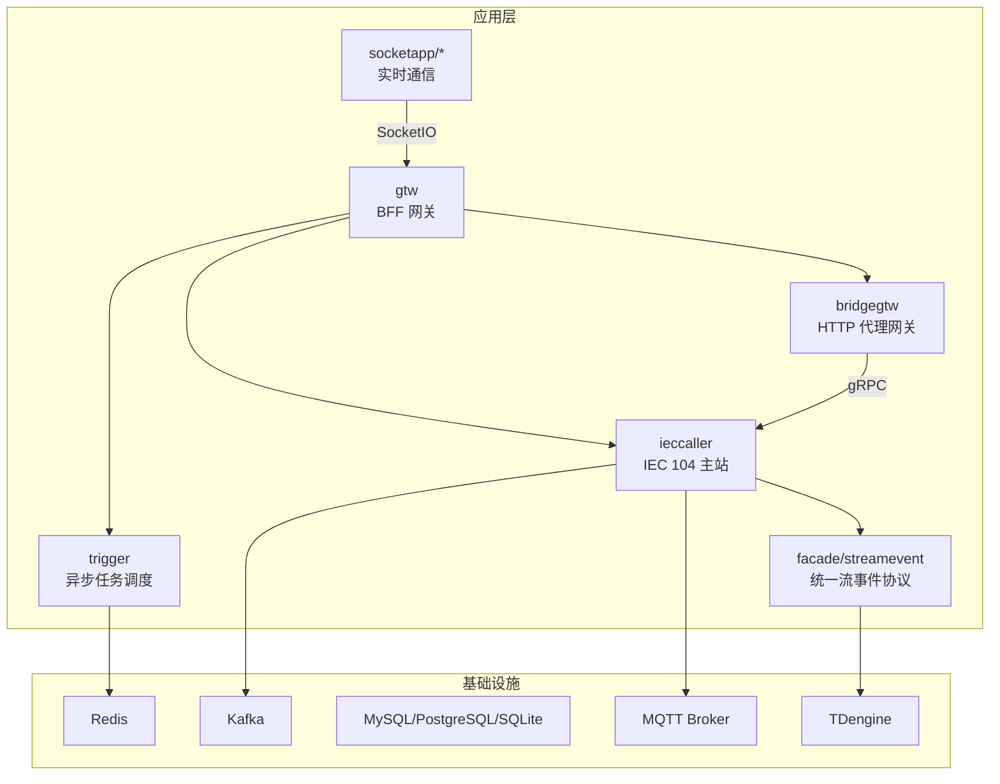
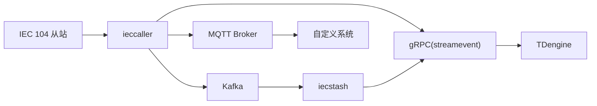
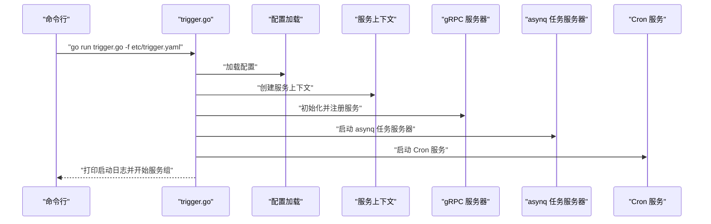
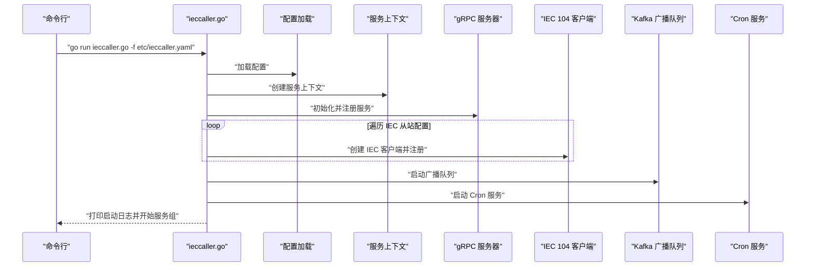

# 快速开始

<cite>
**本文引用的文件**
- [README.md](file://README.md)
- [go.mod](file://go.mod)
- [deploy/docker-compose.yml](file://deploy/docker-compose.yml)
- [app/trigger/etc/trigger.yaml](file://app/trigger/etc/trigger.yaml)
- [app/ieccaller/etc/ieccaller.yaml](file://app/ieccaller/etc/ieccaller.yaml)
- [app/bridgegtw/etc/bridgegtw.yaml](file://app/bridgegtw/etc/bridgegtw.yaml)
- [app/trigger/trigger.go](file://app/trigger/trigger.go)
- [app/ieccaller/ieccaller.go](file://app/ieccaller/ieccaller.go)
- [util/manage.sh](file://util/manage.sh)
- [util/Taskfile-docker.yml](file://util/Taskfile-docker.yml)
- [util/config.yaml](file://util/config.yaml)
</cite>

## 目录
1. [简介](#简介)
2. [项目结构](#项目结构)
3. [核心组件](#核心组件)
4. [架构概览](#架构概览)
5. [详细组件分析](#详细组件分析)
6. [依赖分析](#依赖分析)
7. [性能考虑](#性能考虑)
8. [故障排查指南](#故障排查指南)
9. [结论](#结论)
10. [附录](#附录)

## 简介
本指南面向首次接触 zero-service 的用户，提供从零开始的完整部署流程，涵盖环境准备、依赖安装、配置文件设置与启动服务的步骤。项目基于 go-zero 微服务框架，面向物联网数采、异步任务调度、实时通信等场景，提供开箱即用的多协议接入与高性能数据处理能力。

- 系统架构概览与核心服务职责请参考项目根目录的说明文档。
- 快速开始章节提供了环境要求、安装与启动命令、配置要点以及 Docker Compose 编排说明。

**章节来源**
- [README.md:226-252](file://README.md#L226-L252)

## 项目结构
- 核心微服务位于 app/ 目录，包含 trigger、ieccaller、bridgegtw 等服务；facade/streamevent 提供对外统一的流数据事件协议；socketapp 提供实时通信网关与推送服务；gtw 作为 BFF 网关聚合 gRPC 与 HTTP。
- deploy/ 目录提供 Docker Compose 编排，包含 Kafka、Filebeat、ieccaller、bridgegtw、bridgedump 等服务的默认编排。
- common/ 提供公共组件库，如 asynq 任务队列、SocketIO、Modbus、MQTT、Nacos 等扩展。
- model/ 提供数据库模型与 SQL 脚本，swagger/ 提供 Swagger API 文档，third_party/ 包含第三方 Proto 定义。

**图表来源**
- [README.md:15-51](file://README.md#L15-L51)

**章节来源**
- [README.md:59-108](file://README.md#L59-L108)

## 核心组件
- 触发器服务（trigger）：基于 asynq 的分布式任务队列与计划任务管理引擎，支持 HTTP/gRPC 回调与任务历史统计。
- IEC 104 主站（ieccaller）：多从站并行通信、Kafka/MQTT/gRPC 三协议推送、内嵌 SQLite 动态配置。
- HTTP 代理网关（bridgegtw）：gRPC 聚合与 HTTP 路由，支持将 HTTP 请求映射到 gRPC 方法。
- 统一流事件协议（facade/streamevent）：跨语言 gRPC 接口，接收来自 Kafka、MQTT、WebSocket 的消息并落库至 TDengine。
- 实时通信（socketapp）：SocketIO 网关与推送服务，支持房间管理、广播、MQTT 桥接与 Token 鉴权。

**章节来源**
- [README.md:110-188](file://README.md#L110-L188)

## 架构概览
下图展示从 IEC 104 从站到数据落库的典型数据流，以及 Kafka、MQTT、gRPC 的并行推送路径。

**图表来源**
- [README.md:122-127](file://README.md#L122-L127)

**章节来源**
- [README.md:112-127](file://README.md#L112-L127)

## 详细组件分析

### 环境要求与安装
- 环境要求
  - Go 版本：1.25+
  - 可选依赖：Redis、Kafka、MySQL/PostgreSQL、TDengine、Docker
- 安装步骤
  - 克隆仓库并初始化依赖
  - 使用 go mod tidy 安装依赖

**章节来源**
- [README.md:228-240](file://README.md#L228-L240)
- [go.mod:1-3](file://go.mod#L1-L3)

### 配置文件位置与修改方法
- 配置文件位置：每个服务的配置位于 app/{service}/etc/ 目录下，例如 trigger、ieccaller、bridgegtw 等。
- 常见配置项
  - 服务监听地址与端口
  - Redis、Kafka、数据库连接
  - Nacos 服务注册配置
  - 协议特定配置（IEC 104 从站列表、MQTT Broker 等）

**章节来源**
- [README.md:254-261](file://README.md#L254-L261)
- [app/trigger/etc/trigger.yaml:1-37](file://app/trigger/etc/trigger.yaml#L1-L37)
- [app/ieccaller/etc/ieccaller.yaml:1-79](file://app/ieccaller/etc/ieccaller.yaml#L1-L79)
- [app/bridgegtw/etc/bridgegtw.yaml:1-40](file://app/bridgegtw/etc/bridgegtw.yaml#L1-L40)

### 单个服务启动方式
- 以 trigger 为例，进入服务目录，使用 go run 启动并指定配置文件路径
- 该启动方式适合开发调试与本地验证

**章节来源**
- [README.md:244-247](file://README.md#L244-L247)
- [app/trigger/trigger.go:32-38](file://app/trigger/trigger.go#L32-L38)

### 多个服务启动方式（Docker Compose）
- 进入 deploy 目录，使用 docker-compose up -d 启动默认编排的服务
- 默认编排包含 Kafka、Filebeat、ieccaller、bridgegtw、bridgedump 等核心服务
- 可根据需要修改 docker-compose.yml 中的镜像与挂载路径

**章节来源**
- [README.md:249-252](file://README.md#L249-L252)
- [deploy/docker-compose.yml:1-110](file://deploy/docker-compose.yml#L1-L110)

### 服务启动流程（以 trigger 为例）

**图表来源**
- [app/trigger/trigger.go:34-88](file://app/trigger/trigger.go#L34-L88)

**章节来源**
- [app/trigger/trigger.go:34-88](file://app/trigger/trigger.go#L34-L88)

### IEC 104 主站启动流程（ieccaller）

**图表来源**
- [app/ieccaller/ieccaller.go:41-122](file://app/ieccaller/ieccaller.go#L41-L122)

**章节来源**
- [app/ieccaller/ieccaller.go:41-122](file://app/ieccaller/ieccaller.go#L41-L122)

### 配置文件关键字段说明（示例）
- trigger.yaml
  - Name、ListenOn：服务名称与监听地址
  - Redis：Redis 连接参数
  - DB：数据库连接字符串
  - StreamEventConf：统一流事件服务的 gRPC 端点
- ieccaller.yaml
  - IecServerConfig：IEC 104 从站配置列表
  - KafkaConfig：Kafka Broker 列表、Topic 与广播配置
  - MqttConfig：MQTT Broker、用户名、密码、Topic 列表
- bridgegtw.yaml
  - Upstreams.grpc.Endpoints：上游 gRPC 服务端点
  - Mappings：HTTP 到 gRPC 的路由映射

**章节来源**
- [app/trigger/etc/trigger.yaml:1-37](file://app/trigger/etc/trigger.yaml#L1-L37)
- [app/ieccaller/etc/ieccaller.yaml:1-79](file://app/ieccaller/etc/ieccaller.yaml#L1-L79)
- [app/bridgegtw/etc/bridgegtw.yaml:1-40](file://app/bridgegtw/etc/bridgegtw.yaml#L1-L40)

### 开发环境与生产环境差异
- 开发环境
  - 使用 go run 直接启动单个服务，便于调试与热迭代
  - 配置文件指向本地 Redis、Kafka、数据库
- 生产环境
  - 使用 Docker Compose 编排，集中管理依赖与服务
  - 通过环境变量与挂载卷配置服务参数，便于横向扩展与运维

**章节来源**
- [README.md:242-252](file://README.md#L242-L252)
- [deploy/docker-compose.yml:1-110](file://deploy/docker-compose.yml#L1-L110)

## 依赖分析
- 技术栈与外部依赖
  - 微服务框架：go-zero
  - RPC：gRPC + grpc-gateway + Protocol Buffers
  - 消息队列：Kafka（go-queue）
  - 任务队列：asynq + Redis
  - 实时通信：SocketIO（fork）
  - 工业协议：IEC 60870-5-104、Modbus、MQTT
  - 关系数据库：MySQL、PostgreSQL、SQLite
  - 时序数据库：TDengine
  - 对象存储：MinIO、阿里 OSS、腾讯 COS
  - 服务发现：Nacos
  - 地理计算：H3、GeoHash、orb、go-geom
  - 容器管理：Docker SDK
  - 监控追踪：OpenTelemetry、Prometheus
  - 容器编排：Docker Compose、Kubernetes（可选）

**章节来源**
- [README.md:207-224](file://README.md#L207-L224)
- [go.mod:5-62](file://go.mod#L5-L62)

## 性能考虑
- 合理设置 Kafka 分区数与副本策略，避免单点瓶颈
- Redis 使用集群或哨兵模式，提升高可用与吞吐
- 数据库连接池大小与超时参数应结合业务峰值进行调优
- 容器资源限制（mem_limit、CPU）在 Docker Compose 中已示例，建议按实际负载调整
- 任务队列并发与批处理大小应根据 Redis 与下游系统能力进行平衡

**章节来源**
- [deploy/docker-compose.yml:54-109](file://deploy/docker-compose.yml#L54-L109)

## 故障排查指南
- 启动失败：检查配置文件中的监听地址、端口是否被占用，确认 Redis、Kafka、数据库连通性
- gRPC 无法访问：确认服务注册与发现配置（Nacos），或关闭注册模式进行直连测试
- Kafka 消费异常：检查 Broker 地址、Topic 名称、消费者组 ID 与分区权限
- Docker 启动异常：确认镜像标签、容器网络模式（host）、挂载路径与权限
- 远程部署：使用 util/manage.sh 与 util/Taskfile-docker.yml 提供的远程管理命令，确保 SSH 凭据与 docker-compose 路径正确

**章节来源**
- [app/trigger/etc/trigger.yaml:11-37](file://app/trigger/etc/trigger.yaml#L11-L37)
- [app/ieccaller/etc/ieccaller.yaml:35-79](file://app/ieccaller/etc/ieccaller.yaml#L35-L79)
- [util/manage.sh:1-35](file://util/manage.sh#L1-L35)
- [util/Taskfile-docker.yml:10-37](file://util/Taskfile-docker.yml#L10-L37)
- [util/config.yaml:1-26](file://util/config.yaml#L1-L26)

## 结论
通过本快速开始指南，您可以在本地或生产环境中完成 zero-service 的环境准备、依赖安装、配置修改与服务启动。建议先以单个服务（如 trigger）进行本地验证，再使用 Docker Compose 启动多服务编排，最后结合远程部署脚本进行生产部署。遇到问题时，优先检查配置文件与依赖连通性，并参考故障排查章节进行定位。

## 附录
- 常用命令示例
  - 安装依赖：go mod tidy
  - 启动单个服务：go run app/{service}/trigger.go -f app/{service}/etc/{service}.yaml
  - 启动多服务：cd deploy && docker-compose up -d
- 配置文件示例路径
  - trigger：app/trigger/etc/trigger.yaml
  - ieccaller：app/ieccaller/etc/ieccaller.yaml
  - bridgegtw：app/bridgegtw/etc/bridgegtw.yaml

**章节来源**
- [README.md:234-252](file://README.md#L234-L252)
- [app/trigger/etc/trigger.yaml:1-37](file://app/trigger/etc/trigger.yaml#L1-L37)
- [app/ieccaller/etc/ieccaller.yaml:1-79](file://app/ieccaller/etc/ieccaller.yaml#L1-L79)
- [app/bridgegtw/etc/bridgegtw.yaml:1-40](file://app/bridgegtw/etc/bridgegtw.yaml#L1-L40)