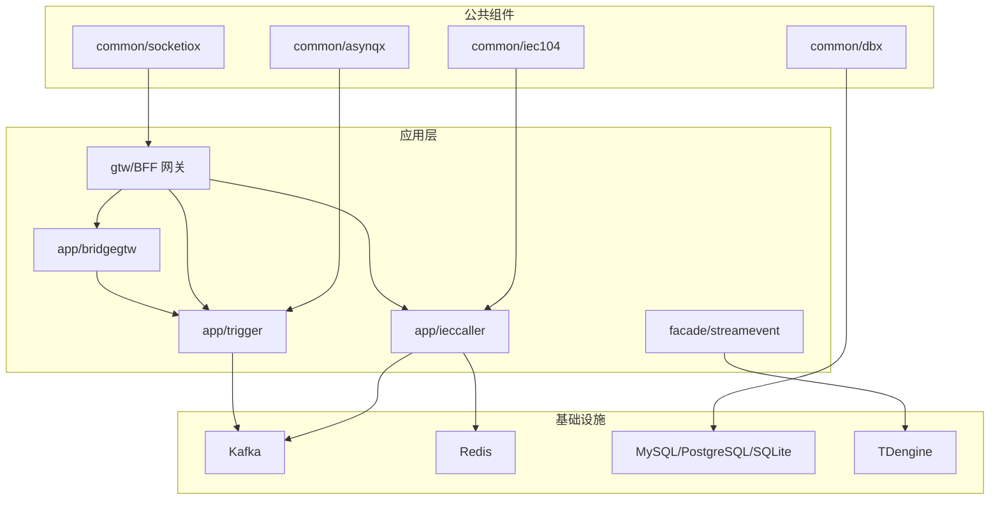
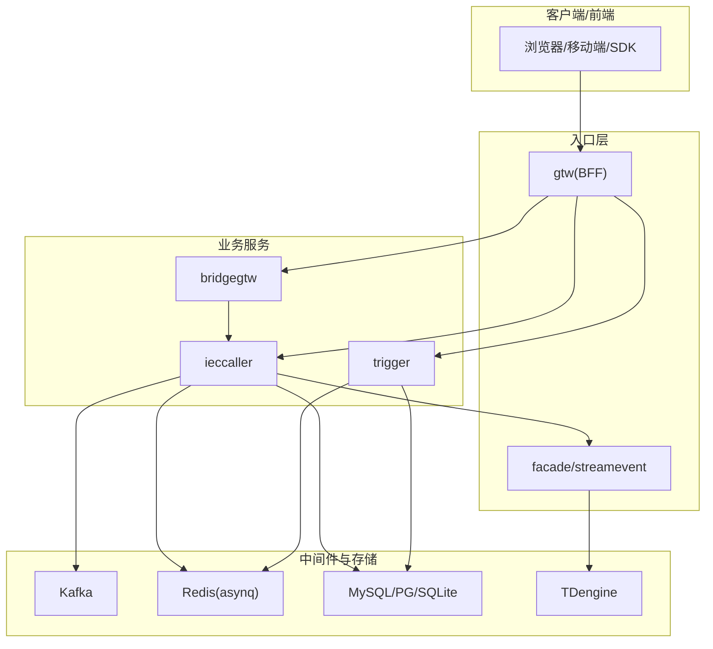
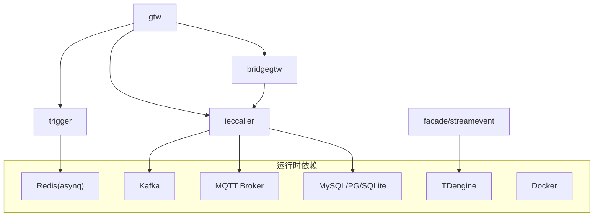

# 快速开始指南

<cite>
**本文引用的文件**
- [README.md](file://README.md)
- [go.mod](file://go.mod)
- [deploy/docker-compose.yml](file://deploy/docker-compose.yml)
- [app/trigger/etc/trigger.yaml](file://app/trigger/etc/trigger.yaml)
- [app/ieccaller/etc/ieccaller.yaml](file://app/ieccaller/etc/ieccaller.yaml)
- [app/bridgegtw/etc/bridgegtw.yaml](file://app/bridgegtw/etc/bridgegtw.yaml)
- [util/manage.sh](file://util/manage.sh)
- [aiapp/ssegtw/deploy.sh](file://aiapp/ssegtw/deploy.sh)
- [aiapp/ssegtw/sse_demo.html](file://aiapp/ssegtw/sse_demo.html)
- [aiapp/ssegtw/env/test.env](file://aiapp/ssegtw/env/test.env)
- [util/config.yaml](file://util/config.yaml)
- [util/Taskfile.yml](file://util/Taskfile.yml)
</cite>

## 目录
1. [简介](#简介)
2. [项目结构](#项目结构)
3. [核心组件](#核心组件)
4. [架构概览](#架构概览)
5. [详细组件分析](#详细组件分析)
6. [依赖分析](#依赖分析)
7. [性能考虑](#性能考虑)
8. [故障排查指南](#故障排查指南)
9. [结论](#结论)
10. [附录](#附录)

## 简介
本指南面向首次接触 Zero-Service 的开发者，帮助你在约 30 分钟内完成环境搭建、服务启动与基础功能验证。项目基于 go-zero 微服务框架，覆盖 IEC 104 数采、异步任务调度、实时通信、容器管理、地理信息、BFF 网关等能力，适合物联网、工业自动化与实时数据场景。

## 项目结构
仓库采用“多服务 + 公共组件 + 部署编排”的组织方式：
- app/：核心微服务集合（trigger、ieccaller、bridge 系列、file、gis、alarm 等）
- common/：公共组件库（协议扩展、任务队列、数据库、实时通信、工具等）
- deploy/：Docker Compose 编排与部署样例
- gtw/：BFF 网关（HTTP + grpc-gateway 聚合）
- facade/：对外接口层（streamevent）
- model/：数据库模型与 SQL 脚本
- swagger/：各服务 Swagger 文档
- third_party/：第三方 proto 定义
- util/：运维与工具脚本
- docs/：架构与协议文档

图表来源
- [README.md:15-51](file://README.md#L15-L51)
- [deploy/docker-compose.yml:1-110](file://deploy/docker-compose.yml#L1-L110)

章节来源
- [README.md:59-108](file://README.md#L59-L108)

## 核心组件
- 触发器服务（trigger）：基于 asynq 的分布式任务队列与计划任务引擎，支持 Redis 存储、HTTP/gRPC 回调、状态机与生命周期管理。
- IEC 104 主站（ieccaller）：多从站并行通信、Kafka/MQTT/gRPC 三协议推送、内嵌 SQLite 配置、弱校验模式。
- 网关（bridgegtw）：HTTP 到 gRPC 的代理转发，支持上游映射与 Proto 集成。
- BFF 网关（gtw）：统一入口，聚合 gRPC 服务并通过 grpc-gateway 提供 HTTP 访问。
- 对外接口（facade/streamevent）：跨语言流数据事件协议，支持多种消息源与推送。

章节来源
- [README.md:110-206](file://README.md#L110-L206)

## 架构概览
下图展示服务间的典型交互路径与数据流：

图表来源
- [README.md:15-51](file://README.md#L15-L51)
- [app/ieccaller/etc/ieccaller.yaml:35-41](file://app/ieccaller/etc/ieccaller.yaml#L35-L41)
- [app/trigger/etc/trigger.yaml:19-24](file://app/trigger/etc/trigger.yaml#L19-L24)

## 详细组件分析

### 环境要求与安装
- 环境要求
  - Go 1.25+
  - Redis（任务队列与缓存）
  - 可选：Kafka、MySQL/PostgreSQL、TDengine、Docker
- 安装步骤
  - 克隆仓库并初始化依赖
  - 运行 go mod tidy 安装依赖

章节来源
- [README.md:226-241](file://README.md#L226-L241)
- [go.mod:1-3](file://go.mod#L1-L3)

### 单服务启动（以 trigger 为例）
- 进入服务目录
- 使用 go run 启动，指定配置文件
- 常用命令参考
  - cd app/trigger
  - go run trigger.go -f etc/trigger.yaml

章节来源
- [README.md:242-247](file://README.md#L242-L247)

### Docker Compose 启动
- 进入 deploy 目录
- 使用 docker-compose up -d 启动
- 默认包含 Kafka、Filebeat、ieccaller、bridgegtw、bridgedump 等核心服务
- 可按需修改 docker-compose.yml 中的镜像与端口映射

章节来源
- [README.md:249-252](file://README.md#L249-L252)
- [deploy/docker-compose.yml:1-110](file://deploy/docker-compose.yml#L1-L110)

### 常用配置文件说明与修改建议
- trigger.yaml（触发器服务）
  - 监听地址与端口：ListenOn
  - Redis 配置：Host、Type、Key、Pass、DB
  - 数据库连接：DataSource
  - StreamEventConf：目标服务端点、超时与优雅期
  - 修改建议：将 Redis 地址改为本机或容器内可达地址；根据需要启用 Nacos 注册
- ieccaller.yaml（IEC 104 主站）
  - IecServerConfig：从站 Host/Port、定时总召唤与累计量召唤配置、并发度
  - KafkaConfig：Brokers、Topic、广播 Topic 与组 ID
  - MqttConfig：Broker、用户名/密码、QoS、推送 Topic 列表
  - StreamEventConf：目标服务端点
  - 修改建议：先在本地启动 Kafka 与 MQTT，确认连通性后再启动服务
- bridgegtw.yaml（HTTP 到 gRPC 网关）
  - Upstreams.grpc.Endpoints：后端 gRPC 服务地址
  - ProtoSets：Proto 文件路径
  - Mappings：HTTP 方法、路径与 gRPC 方法映射
  - 修改建议：确保后端服务已启动且端口正确

章节来源
- [app/trigger/etc/trigger.yaml:1-37](file://app/trigger/etc/trigger.yaml#L1-L37)
- [app/ieccaller/etc/ieccaller.yaml:1-79](file://app/ieccaller/etc/ieccaller.yaml#L1-L79)
- [app/bridgegtw/etc/bridgegtw.yaml:1-40](file://app/bridgegtw/etc/bridgegtw.yaml#L1-L40)

### 基础功能验证步骤
- 启动依赖服务
  - 启动 Kafka、Redis（可选 MySQL/PostgreSQL/TDengine/Docker）
- 启动核心服务
  - 启动 trigger、ieccaller、bridgegtw（或使用 docker-compose）
- 验证服务健康
  - 通过 gtw 的 grpc-gateway 暴露的 HTTP 接口进行简单调用
  - 使用 curl 或 Postman 访问已映射的 API
- 验证实时通信（可选）
  - 使用 sse_demo.html 连接 SSE 端点，观察事件流
- 验证任务队列（可选）
  - 通过 trigger 的 API 提交任务，观察 Redis 队列与日志

章节来源
- [README.md:242-252](file://README.md#L242-L252)
- [aiapp/ssegtw/sse_demo.html:406-480](file://aiapp/ssegtw/sse_demo.html#L406-L480)

### 部署与运维脚本
- 管理脚本（util/manage.sh）
  - 支持 restart/up/stop/start 命令，可对指定服务或全部服务执行
  - 通过 Taskfile 调用 task 任务名（如 start-docker、up-docker）
- 远程部署脚本（aiapp/ssegtw/deploy.sh）
  - 支持本地编译、打包镜像、上传 tar、远程加载镜像、打标签、清理旧备份、启动服务
  - 通过 .env 文件注入远程主机、镜像名、服务名等参数
- 配置样例（util/config.yaml）
  - 提供多台服务器的 SSH 与服务清单配置模板

章节来源
- [util/manage.sh:1-35](file://util/manage.sh#L1-L35)
- [aiapp/ssegtw/deploy.sh:1-170](file://aiapp/ssegtw/deploy.sh#L1-L170)
- [util/config.yaml:1-26](file://util/config.yaml#L1-L26)
- [util/Taskfile.yml:1-33](file://util/Taskfile.yml#L1-L33)

## 依赖分析
- 技术栈概览
  - 微服务框架：go-zero
  - RPC：gRPC + grpc-gateway + Protocol Buffers
  - 消息队列：Kafka（go-queue）
  - 任务队列：asynq + Redis
  - 实时通信：SocketIO（fork）
  - 工业协议：IEC 60870-5-104、Modbus、MQTT
  - 数据库：MySQL/PostgreSQL/SQLite
  - 时序数据库：TDengine
  - 对象存储：MinIO/阿里 OSS/腾讯 COS
  - 服务发现：Nacos
  - 地理计算：H3、GeoHash、orb、go-geom
  - 容器管理：Docker SDK
  - 监控追踪：OpenTelemetry/Prometheus
  - 容器编排：Docker Compose/Kubernetes

图表来源
- [README.md:207-225](file://README.md#L207-L225)
- [app/trigger/etc/trigger.yaml:19-28](file://app/trigger/etc/trigger.yaml#L19-L28)
- [app/ieccaller/etc/ieccaller.yaml:35-57](file://app/ieccaller/etc/ieccaller.yaml#L35-L57)

章节来源
- [README.md:207-225](file://README.md#L207-L225)

## 性能考虑
- 任务队列与并发
  - asynq 任务并发与 Redis 配置需结合业务吞吐评估
  - trigger.yaml 中的 RedisDB、Key 建议按服务拆分，避免热点
- Kafka 与 MQTT
  - Topic 设计应避免过多分区导致消费者竞争
  - MQTT QoS 与推送频率需平衡实时性与带宽
- 数据库与索引
  - TDengine 时序写入建议批量提交与合理分区
  - MySQL/PG 查询需关注索引与慢查询
- 网关与代理
  - bridgegtw 的映射与 ProtoSets 应尽量减少不必要的序列化
- 容器与资源
  - docker-compose 中的 mem_limit 与 host 网络模式需按实际资源调整

## 故障排查指南
- 依赖未就绪
  - 现象：服务启动报错或连接超时
  - 排查：确认 Kafka、Redis、MQTT、数据库等依赖是否正常启动
  - 建议：优先使用 docker-compose 启动依赖，再启动业务服务
- 配置不一致
  - 现象：服务无法连接下游或推送失败
  - 排查：核对 trigger.yaml、ieccaller.yaml、bridgegtw.yaml 中的地址与端口
  - 建议：将外部依赖地址改为宿主机可达地址（如 127.0.0.1 或宿主机 IP）
- 端口冲突
  - 现象：服务启动失败或端口被占用
  - 排查：检查 etc/*.yaml 与 docker-compose.yml 中的 ListenOn/Port
  - 建议：修改为未占用端口或释放冲突进程
- 权限与卷挂载
  - 现象：容器内无法读写日志或配置
  - 排查：确认 /app/etc 与 /opt/logs 的挂载权限
  - 建议：使用 host 网络模式并确保目录存在与权限正确
- 远程部署失败
  - 现象：deploy.sh 上传/加载镜像失败
  - 排查：检查 .env 中的 REMOTE_* 参数与网络连通性
  - 建议：先手动 ssh 登录目标主机，再执行脚本；必要时开启免密登录

章节来源
- [deploy/docker-compose.yml:54-109](file://deploy/docker-compose.yml#L54-L109)
- [aiapp/ssegtw/env/test.env:1-16](file://aiapp/ssegtw/env/test.env#L1-L16)

## 结论
通过本指南，你可以在 30 分钟内完成 Zero-Service 的环境搭建与基础验证。建议先使用 docker-compose 快速跑通核心链路，再逐步替换为单服务启动以便深入调试。后续可结合 util/ 与 aiapp/ssegtw/ 的脚本提升本地开发与远程部署效率。

## 附录

### 常用命令速查
- 克隆与初始化
  - git clone 仓库地址
  - cd zero-service && go mod tidy
- 单服务启动（以 trigger 为例）
  - cd app/trigger && go run trigger.go -f etc/trigger.yaml
- Docker Compose 启动
  - cd deploy && docker-compose up -d
- 管理脚本
  - util/manage.sh up trigger,bridgegtw
- 远程部署
  - aiapp/ssegtw/deploy.sh dev

章节来源
- [README.md:226-252](file://README.md#L226-L252)
- [util/manage.sh:1-35](file://util/manage.sh#L1-L35)
- [aiapp/ssegtw/deploy.sh:1-170](file://aiapp/ssegtw/deploy.sh#L1-L170)