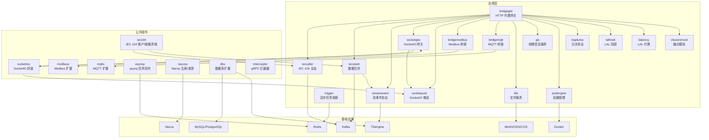
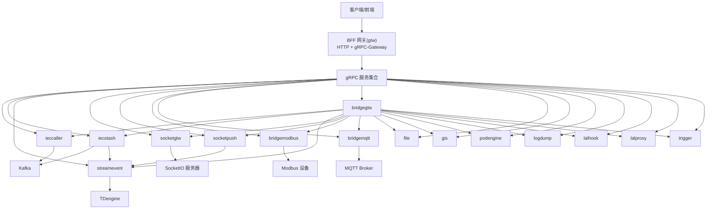
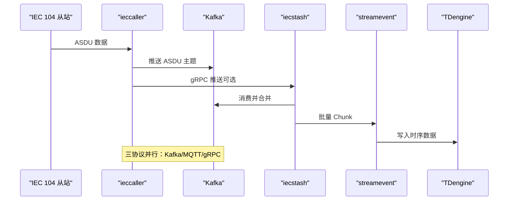
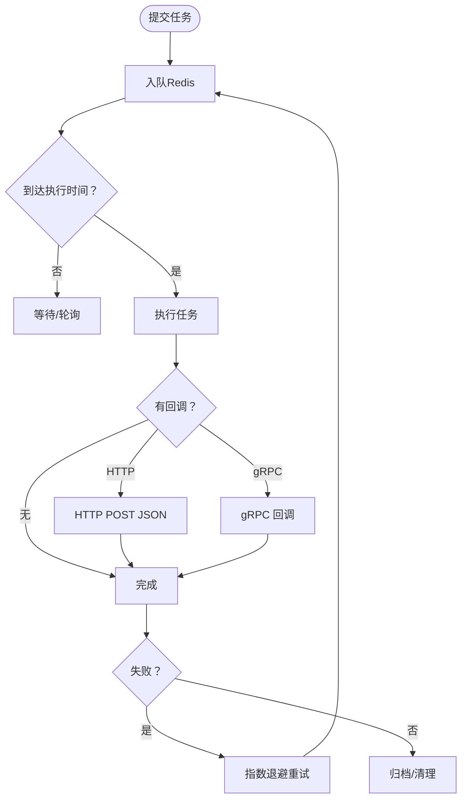
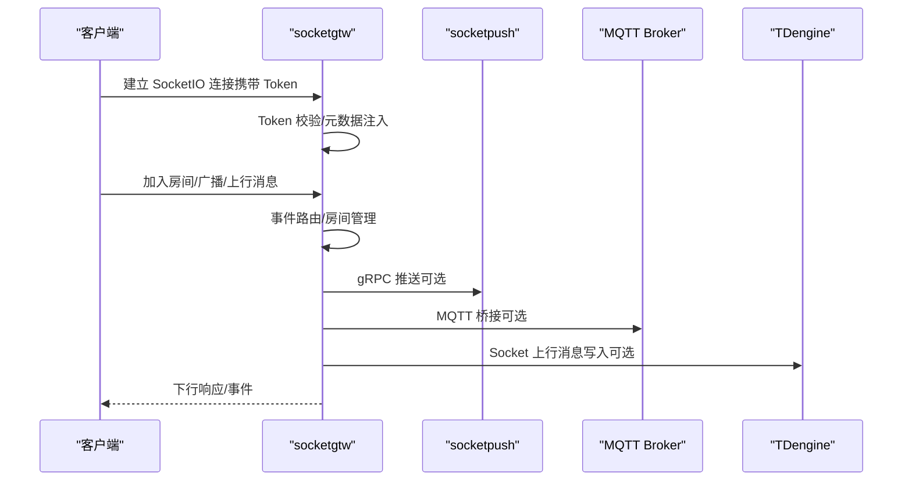
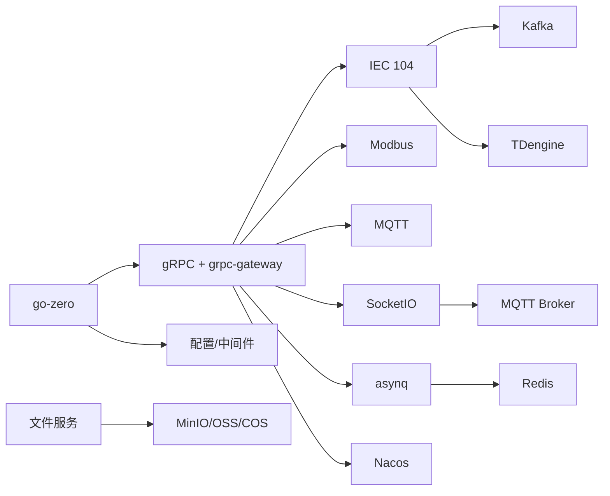

# 技术架构概览

<cite>
**本文引用的文件**
- [README.md](file://README.md)
- [go.mod](file://go.mod)
- [docker-compose.yml](file://deploy/docker-compose.yml)
- [trigger.yaml](file://app/trigger/etc/trigger.yaml)
- [ieccaller.yaml](file://app/ieccaller/etc/ieccaller.yaml)
- [streamevent.yaml](file://facade/streamevent/etc/streamevent.yaml)
- [loggerInterceptor.go](file://common/Interceptor/rpcserver/loggerInterceptor.go)
- [config.go](file://app/trigger/internal/config/config.go)
- [core.go](file://common/iec104/client/core.go)
- [server.go](file://common/socketiox/server.go)
- [asynqClient.go](file://common/asynqx/asynqClient.go)
- [config.go](file://common/nacosx/config.go)
</cite>

## 目录
1. [引言](#引言)
2. [项目结构](#项目结构)
3. [核心组件](#核心组件)
4. [架构总览](#架构总览)
5. [详细组件分析](#详细组件分析)
6. [依赖分析](#依赖分析)
7. [性能考虑](#性能考虑)
8. [故障排查指南](#故障排查指南)
9. [结论](#结论)
10. [附录](#附录)

## 引言
本文件为 Zero-Service 的技术架构概览，围绕基于 go-zero 的企业级微服务架构展开，系统性阐述微服务拆分原则、服务间通信机制、数据流设计与关键架构决策。重点说明如何通过多协议接入（IEC 104、Modbus、MQTT、gRPC、HTTP）与高性能数据处理支撑工业物联网场景；并深入解析服务网格、负载均衡、故障转移、容器化部署、服务发现与监控体系，辅以系统拓扑图与组件交互关系图，帮助读者快速理解整体结构与运行机制。

## 项目结构
项目采用“按领域/协议分层”的微服务组织方式，核心模块包括：
- 核心微服务：IEC 104 数采平台（ieccaller/iecstash/streamevent）、Trigger 异步任务调度、SocketIO 实时通信（socketgtw/socketpush）、文件/地理/GIS/容器/桥接/日志/LAL 等服务
- BFF 网关：统一入口，聚合 gRPC 并提供 grpc-gateway HTTP 访问
- 对外接口层：统一流数据事件协议（facade/streamevent），跨语言 gRPC
- 公共组件库：协议实现（IEC 104、Modbus、MQTT）、实时通信（SocketIO）、任务队列（asynq）、服务注册（Nacos）、数据库扩展、工具库等
- 部署与文档：Docker Compose 编排、Swagger 文档、技术栈与错误码规范

图表来源
- [README.md:15-51](file://README.md#L15-L51)
- [README.md:59-108](file://README.md#L59-L108)
- [go.mod:5-62](file://go.mod#L5-L62)

章节来源
- [README.md:15-108](file://README.md#L15-L108)
- [go.mod:1-62](file://go.mod#L1-L62)

## 核心组件
- 微服务框架：go-zero 提供高性能 RPC、HTTP、gRPC-Gateway、中间件与配置体系
- 协议接入：IEC 104（go-iecp5）、Modbus（grid-x/modbus）、MQTT（eclipse/paho.mqtt.golang）、gRPC/Protocol Buffers
- 消息与任务：Kafka（go-queue）、asynq（Redis）分布式任务队列
- 实时通信：SocketIO（fork of socket.io-golang），支持房间、广播、MQTT 桥接与 Token 鉴权
- 服务治理：Nacos（服务注册/发现）、gRPC 拦截器（日志/链路透传）
- 数据存储：MySQL/PostgreSQL/SQLite、TDengine（时序）、MinIO/OSS/COS（对象存储）
- 容器化：Docker Compose 编排，支持独立服务镜像构建与部署

章节来源
- [README.md:207-225](file://README.md#L207-L225)
- [go.mod:5-62](file://go.mod#L5-L62)

## 架构总览
系统采用“BFF 网关 + 多协议微服务 + 事件驱动”的混合架构：
- BFF 网关（gtw）统一入口，聚合 gRPC 服务并通过 grpc-gateway 提供 HTTP 访问，内置 JWT 认证、CORS、文件上传/下载等能力
- IEC 104 数采平台：ieccaller（主站）并发采集并推送至 Kafka/MQTT/gRPC；iecstash（合并）消费 Kafka 并批量转发；streamevent（统一协议）接收并写入 TDengine
- 异步任务调度：Trigger 基于 asynq + Redis，支持定时/延时任务与 HTTP/gRPC 回调
- 实时通信：socketgtw + socketpush，支持房间管理、广播、MQTT 桥接与 Token 鉴权
- 其他服务：文件、地理、容器、桥接、日志、LAL 等，均通过 gRPC 或 HTTP 暴露能力

图表来源
- [README.md:15-51](file://README.md#L15-L51)
- [README.md:189-206](file://README.md#L189-L206)

章节来源
- [README.md:15-206](file://README.md#L15-L206)

## 详细组件分析

### IEC 104 数采平台
- ieccaller：多从站并行通信、Kafka/MQTT/gRPC 三协议推送、弱校验模式、动态配置与批处理
- iecstash：Kafka 消费、ASDU 压缩合并、Chunk 批量处理、下游 RPC 转发
- streamevent：统一流事件协议，接收多源消息（MQTT/WebSocket/Kafka/Socket 上行），写入 TDengine

图表来源
- [README.md:112-131](file://README.md#L112-L131)
- [ieccaller.yaml:35-79](file://app/ieccaller/etc/ieccaller.yaml#L35-L79)
- [streamevent.yaml:22-28](file://facade/streamevent/etc/streamevent.yaml#L22-L28)

章节来源
- [README.md:112-131](file://README.md#L112-L131)
- [ieccaller.yaml:1-79](file://app/ieccaller/etc/ieccaller.yaml#L1-L79)
- [streamevent.yaml:1-28](file://facade/streamevent/etc/streamevent.yaml#L1-L28)

### 异步任务调度（Trigger）
- 基于 asynq + Redis，支持定时/延时任务、HTTP POST JSON 与 gRPC 回调、自动重试、归档与生命周期管理
- 计划任务管理：Plan/Batch/ExecItem 三层模型，状态机（WAITING/RUNNING/COMPLETED/FAILED/DELAYED/ONGOING/TERMINATED），分布式锁防重、执行日志追踪

图表来源
- [README.md:133-154](file://README.md#L133-L154)
- [asynqClient.go:17-31](file://common/asynqx/asynqClient.go#L17-L31)
- [trigger.yaml:19-37](file://app/trigger/etc/trigger.yaml#L19-L37)

章节来源
- [README.md:133-154](file://README.md#L133-L154)
- [asynqClient.go:1-31](file://common/asynqx/asynqClient.go#L1-L31)
- [trigger.yaml:1-37](file://app/trigger/etc/trigger.yaml#L1-L37)

### SocketIO 实时通信
- socketgtw：连接管理、房间管理、消息路由、Token 认证、MQTT 桥接
- socketpush：Token 生成/验证、gRPC 推送接口、后端服务调用入口
- 核心能力：房间加入/离开/广播、全局广播、单播/批量推送、会话剔除与元数据管理、统计信息推送与房间加载错误检测

图表来源
- [README.md:156-173](file://README.md#L156-L173)
- [server.go:337-676](file://common/socketiox/server.go#L337-L676)

章节来源
- [README.md:156-173](file://README.md#L156-L173)
- [server.go:1-814](file://common/socketiox/server.go#L1-L814)

### BFF 网关（gtw）
- 聚合 gRPC 服务，同时支持 grpc-gateway 提供 HTTP 访问
- 用户认证（JWT）、微信支付回调、短信验证码、文件上传（单文件/分片/流式）、文件下载、CORS

章节来源
- [README.md:189-196](file://README.md#L189-L196)

### 对外接口层（facade/streamevent）
- 统一跨语言流数据事件协议，支持 MQTT/WebSocket/Kafka 消息接收，IEC 104 ASDU 推送、Socket 上行消息处理、计划任务事件处理与通知
- 任何语言实现该 proto 即可与数采平台交互

章节来源
- [README.md:197-205](file://README.md#L197-L205)
- [streamevent.yaml:1-28](file://facade/streamevent/etc/streamevent.yaml#L1-L28)

### 协议与通信组件
- IEC 104 客户端：连接管理、自动重连、命令发送、事件回调、指标统计
- Modbus/MQTT 扩展：读写操作、设备配置管理、gRPC 集成
- SocketIO 封装：事件绑定、房间管理、广播、会话管理、统计上报
- asynq 任务队列：生产者/检查器、链路追踪属性、Redis 存储
- Nacos 服务注册/发现：日志配置、客户端配置、命名空间与服务名

章节来源
- [core.go:1-446](file://common/iec104/client/core.go#L1-L446)
- [server.go:1-814](file://common/socketiox/server.go#L1-L814)
- [asynqClient.go:1-31](file://common/asynqx/asynqClient.go#L1-L31)
- [config.go:1-38](file://common/nacosx/config.go#L1-L38)

## 依赖分析
- 微服务框架：go-zero 提供 RPC、HTTP、gRPC-Gateway、中间件与配置
- RPC/序列化：gRPC + grpc-gateway + Protocol Buffers
- 消息队列：Kafka（go-queue）
- 任务队列：asynq + Redis
- 协议实现：IEC 104（go-iecp5）、Modbus（grid-x/modbus）、MQTT（eclipse/paho.mqtt.golang）
- 数据库：MySQL/PostgreSQL/SQLite（dbx）、TDengine（taosdata/driver-go）
- 对象存储：MinIO/阿里 OSS/腾讯 COS（minio/minio-go）
- 服务发现：Nacos（nacos-group/nacos-sdk-go）
- 实时通信：SocketIO（doquangtan/socketio）
- 监控追踪：OpenTelemetry（opentelemetry.io）

图表来源
- [go.mod:5-62](file://go.mod#L5-L62)
- [README.md:207-225](file://README.md#L207-L225)

章节来源
- [go.mod:1-245](file://go.mod#L1-L245)
- [README.md:207-225](file://README.md#L207-L225)

## 性能考虑
- 高并发采集：IEC 104 客户端支持自动重连与连接事件回调，结合批处理与 Chunk 推送降低网络与存储压力
- 异步解耦：Kafka/Redis 作为缓冲层，削峰填谷，提升系统稳定性与吞吐
- 资源隔离：Docker Compose 为各服务分配独立资源限制，避免资源争抢
- 中间件优化：BFF 网关启用 gRPC-Gateway，减少重复开发成本；拦截器统一注入 TraceId、用户信息，便于链路追踪与审计
- 存储优化：TDengine 时序数据库适配海量时间序列数据写入与查询；对象存储分片上传与断点续传

## 故障排查指南
- gRPC 请求头透传与错误记录：通过拦截器将用户标识、授权信息、TraceId 注入上下文，并在错误发生时输出统一错误日志
- IEC 104 连接状态：客户端维护连接事件（Connected/Disconnected/ServerActive），可通过日志定位断连与重连问题
- SocketIO 会话与房间：提供会话统计与房间加载错误检测，便于排查连接异常与广播失败
- Trigger 任务：关注 Redis 队列积压、回调失败与重试退避策略，必要时查看 Inspector 状态
- 配置校验：服务配置文件（如 trigger.yaml、ieccaller.yaml、streamevent.yaml）中关键字段（监听地址、超时、Nacos、Redis、Kafka、DB/TDengine）需确保正确

章节来源
- [loggerInterceptor.go:12-44](file://common/Interceptor/rpcserver/loggerInterceptor.go#L12-L44)
- [core.go:130-147](file://common/iec104/client/core.go#L130-L147)
- [server.go:702-740](file://common/socketiox/server.go#L702-L740)
- [asynqClient.go:25-31](file://common/asynqx/asynqClient.go#L25-L31)
- [trigger.yaml:1-37](file://app/trigger/etc/trigger.yaml#L1-L37)
- [ieccaller.yaml:1-79](file://app/ieccaller/etc/ieccaller.yaml#L1-L79)
- [streamevent.yaml:1-28](file://facade/streamevent/etc/streamevent.yaml#L1-L28)

## 结论
Zero-Service 基于 go-zero 构建的企业级微服务架构，通过清晰的微服务拆分、统一的 BFF 网关、事件驱动的数据流与完善的公共组件库，实现了对多协议接入与高性能数据处理的全面支撑。结合 Kafka/Redis 的异步解耦、Nacos 的服务治理、OpenTelemetry 的可观测性以及 Docker Compose 的容器化部署，系统具备良好的扩展性、稳定性与运维效率。建议在生产环境中进一步完善服务网格（如 Istio）、全链路压测与容量规划，持续优化关键路径与存储层性能。

## 附录
- 部署与编排：Docker Compose 默认包含 Kafka、Filebeat、ieccaller、bridgegtw、bridgedump 等核心服务，便于快速启动与验证
- Swagger 文档：各服务提供 Swagger 文档，便于 API 调试与联调
- 错误码规范：遵循 google.rpc.Code 标准，HTTP 与 gRPC 错误码映射关系见 code.md

章节来源
- [README.md:300-350](file://README.md#L300-L350)
- [docker-compose.yml:1-110](file://deploy/docker-compose.yml#L1-L110)